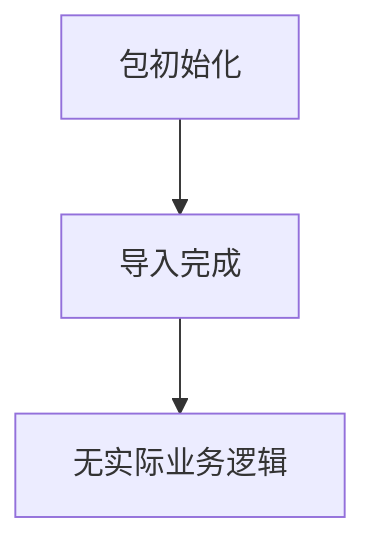

# `graphrag\packages\graphrag\graphrag\index\operations\extract_graph\__init__.py` 详细设计文档

这是微软Indexing Engine实体提取包的根初始化文件，仅包含版权声明和包级文档字符串，没有实际的类、方法或变量定义。

## 整体流程



## 类结构

```

```

## 全局变量及字段


    

## 全局函数及方法


## 关键组件


## 代码概述

该代码文件为 Microsoft Indexing Engine 实体提取包的根模块，仅包含版权声明和包级文档字符串，无实际功能实现。

## 文件运行流程

该文件作为包的入口点，不包含任何可执行逻辑，不参与运行时流程。

## 类和模块信息

由于源代码中不包含任何类、全局变量或全局函数，因此无可提供的详细信息。

## 关键组件信息

### Package Root (包根目录)

Indexing Engine 实体提取包的根模块标识，声明了 MIT 开源许可证。

## 潜在技术债务与优化空间

由于当前代码仅包含声明性内容，无实际实现，因此暂无技术债务。但建议在后续开发中考虑：

- 添加核心索引引擎功能模块
- 实现实体提取的具体逻辑
- 建立完善的错误处理机制
- 设计可扩展的量化策略支持

## 其它项目

### 设计目标与约束

- 遵循 MIT 开源许可证
- 目标构建高效的索引引擎实体提取框架

### 外部依赖与接口契约

暂无外部依赖声明，实际实现时需根据功能需求确定。


## 问题及建议


### 已知问题

-   **空包结构**: 该文件仅为一个占位符性质的 `__init__.py`，未定义任何公开API或导入子模块，导致该包无法被有效使用
-   **文档不完整**: 模块文档字符串仅包含一句话描述，缺少对功能范围、核心组件和使用方式的详细说明
-   **缺少版本信息**: 未定义 `__version__` 或 `__author__` 等包元数据，影响依赖管理和可追溯性
-   **无API导出控制**: 未定义 `__all__` 列表来明确公共接口，导致未来扩展时API边界不清晰
-   **无类型提示和文档**: 作为包入口文件，缺少对主要类和函数的类型注解及使用文档

### 优化建议

-   **完善文档字符串**: 扩展模块文档，说明该包在索引引擎中的定位、主要功能模块（如实体提取）、依赖关系和使用示例
-   **添加版本管理**: 引入 `__version__` 变量，可通过 `importlib.metadata` 或手动定义实现，便于版本追踪
-   **定义公共API**: 创建 `__all__` 列表，明确导出该包的公共接口类、函数和常量
-   **模块导入结构**: 根据实际功能，导入子模块使其可通过 `from indexing_engine.entities_extraction import XXX` 方式使用
-   **添加类型注解和文档**: 为公共API添加类型提示和详细的docstring，提升可维护性和IDE支持


## 其它


### 设计目标与约束

本包作为Indexing Engine的实体提取模块根包，旨在为上层应用提供统一的实体提取功能入口。设计约束包括：遵循MIT开源许可协议，支持Python 3.8+版本，要求与主索引引擎其他模块保持接口兼容性。

### 错误处理与异常设计

当前代码未定义任何自定义异常类。建议后续开发中添加自定义异常层次结构，如EntityExtractionError基类及其子类（ExtractionTimeoutError、InvalidInputError、ModelLoadError等），以支持细粒度的错误处理和调用方能够精确捕获特定异常。

### 数据流与状态机

本包作为实体提取功能的入口模块，主要数据流为：外部调用→包级别接口→具体提取器实现→返回实体列表。由于代码尚未实现具体功能，暂不涉及复杂的状态机设计。

### 外部依赖与接口契约

当前代码无任何外部依赖。建议后续开发中明确以下接口契约：extract_entities(text: str, options: Optional[Dict]) -> List[Entity]，确保与Indexing Engine其他组件的集成兼容性。

### 版本兼容性声明

当前版本：0.1.0（推测）。建议在包中明确定义__version__变量，并遵循语义化版本规范（Semantic Versioning），确保API的稳定性承诺。

### 模块化架构说明

作为包根目录，建议采用以下模块结构：entities/（实体定义）、extractors/（提取器实现）、parsers/（解析器）、utils/（工具函数），以保持代码的模块化和可维护性。

### 性能考量

由于涉及NLP实体提取，需考虑：批处理支持、异步调用接口、缓存机制（尤其对于重复实体识别）、以及可选的模型量化/加速支持。

### 测试策略建议

建议包含：单元测试（覆盖各提取器）、集成测试（与Indexing Engine其他模块）、性能基准测试（吞吐量与延迟）、以及Mock测试（隔离外部依赖）。

### 安全与隐私

作为微软项目，需考虑：输入数据脱敏、日志级别控制（避免敏感信息泄露）、以及依赖库的安全审计流程。

### 文档与注释规范

建议采用Google风格的docstring格式，每个公共API需包含：功能描述、参数说明、返回值描述、异常说明、示例代码。

### CI/CD与部署

建议配置：GitHub Actions自动化测试、PyPI包发布工作流、版本标签策略、以及Docker容器化支持（如适用）。

### 配置管理

建议支持通过配置文件或环境变量进行提取器参数配置，包括：模型选择、提取阈值、语言支持、并发参数等。


    