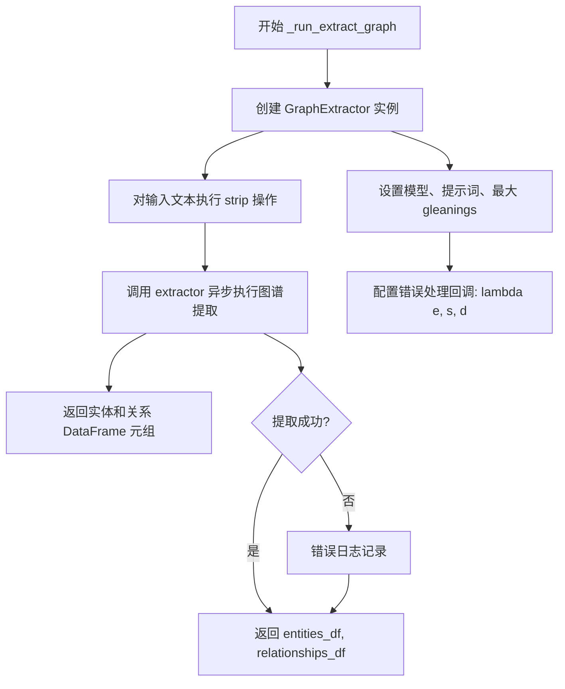
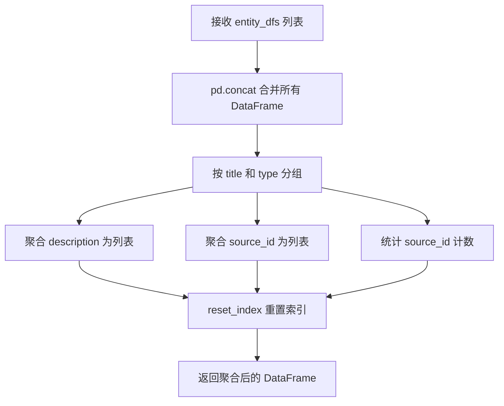
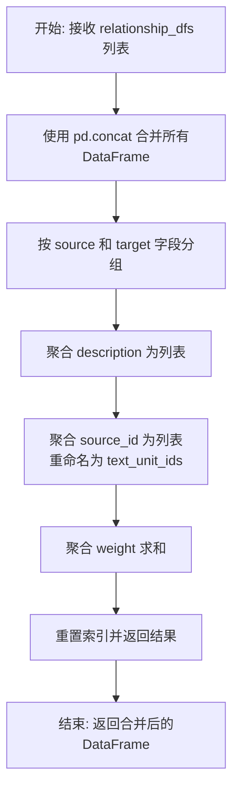
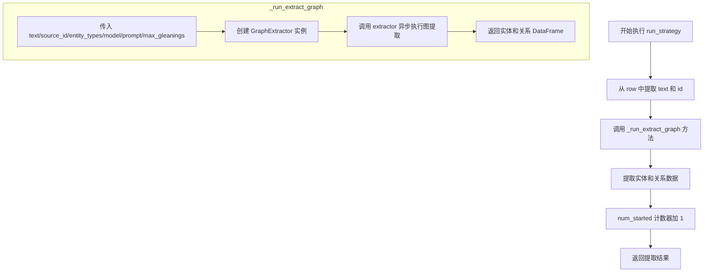

# `graphrag\packages\graphrag\graphrag\index\operations\extract_graph\extract_graph.py` 详细设计文档

该模块提供了一个从文本单元中提取知识图谱（实体和关系）的异步函数，通过调用语言模型识别文本中的实体及其关系，并返回合并后的实体和关系数据框

## 整体流程

```mermaid
graph TD
    A[开始 extract_graph] --> B[初始化 num_started = 0]
    B --> C[创建 run_strategy 异步函数]
    C --> D[调用 derive_from_rows 并行处理 text_units]
    D --> E{遍历 results}
    E -->|有结果| F[分别追加 entity_df 和 relationship_df]
    E -->|无结果| G[跳过]
    F --> H[调用 _merge_entities 合并实体]
    H --> I[调用 _merge_relationships 合并关系]
    I --> J[返回 (entities, relationships) 元组]
```

## 类结构

```
无类定义（纯函数模块）
├── extract_graph (主入口异步函数)
├── _run_extract_graph (内部异步辅助函数)
├── _merge_entities (实体合并函数)
└── _merge_relationships (关系合并函数)
```

## 全局变量及字段


### `num_started`
    
用于跟踪已启动的提取任务数量

类型：`int`
    


    

## 全局函数及方法


### `extract_graph`

从文本单元（Text Units）中提取知识图谱（实体和关系）的核心异步函数，通过调用语言模型进行实体和关系抽取，并行处理多个文本单元，最后将结果合并为统一的实体表和关系表。

参数：

- `text_units`：`pd.DataFrame`，待处理的文本单元数据表，包含需要提取图谱的文本内容
- `callbacks`：`WorkflowCallbacks`，工作流回调接口，用于报告进度和处理事件
- `text_column`：`str`，文本单元中包含实际文本内容的列名
- `id_column`：`str`，文本单元中唯一标识每条记录的ID列名
- `model`：`LLMCompletion`，语言模型接口，用于执行实体和关系抽取
- `prompt`：`str`，用于指导语言模型进行图谱抽取的系统提示词
- `entity_types`：`list[str]`，需要抽取的实体类型列表（如人物、组织、地点等）
- `max_gleanings`：`int`，单个文本单元的最大重复尝试次数，用于提升抽取质量
- `num_threads`：`int`，并发处理的线程/任务数量
- `async_type`：`AsyncType`，异步执行模式类型（如线程池或异步任务）

返回值：`tuple[pd.DataFrame, pd.DataFrame]`，返回两个数据框——第一个为实体表（entities），包含合并后的实体及其描述、来源文本单元ID和出现频率；第二个为关系表（relationships），包含合并后的关系及其描述、来源文本单元ID和权重

#### 流程图

```mermaid
flowchart TD
    A[开始 extract_graph] --> B[初始化 num_started = 0]
    B --> C[定义异步内部函数 run_strategy]
    C --> D[从 row 提取 text 和 id]
    D --> E[调用 _run_extract_graph 执行单条抽取]
    E --> F[num_started += 1]
    F --> G[返回抽取结果]
    C -.-> H[通过 derive_from_rows 并行执行]
    H --> I[收集所有结果到 results]
    I --> J{遍历 results}
    J -->|有结果| K[分离 entity_df 和 relationship_df]
    J -->|无结果| L[跳过]
    K --> M[分别添加到 entity_dfs 和 relationship_dfs 列表]
    M --> J
    J --> N[调用 _merge_entities 合并实体]
    N --> O[调用 _merge_relationships 合并关系]
    O --> P[返回 (entities, relationships) 元组]
```

#### 带注释源码

```python
async def extract_graph(
    text_units: pd.DataFrame,
    callbacks: WorkflowCallbacks,
    text_column: str,
    id_column: str,
    model: "LLMCompletion",
    prompt: str,
    entity_types: list[str],
    max_gleanings: int,
    num_threads: int,
    async_type: AsyncType,
) -> tuple[pd.DataFrame, pd.DataFrame]:
    """Extract a graph from a piece of text using a language model."""
    # 用于跟踪已启动的提取任务数量
    num_started = 0

    # 定义异步策略函数，对每一行文本单元执行图谱提取
    async def run_strategy(row):
        nonlocal num_started  # 允许修改外层函数的变量
        # 从当前行提取文本内容和ID
        text = row[text_column]
        id = row[id_column]
        # 调用内部函数执行实际的图谱提取
        result = await _run_extract_graph(
            text=text,
            source_id=id,
            entity_types=entity_types,
            model=model,
            prompt=prompt,
            max_gleanings=max_gleanings,
        )
        # 任务计数加一
        num_started += 1
        return result

    # 使用 derive_from_rows 工具并行处理所有文本单元
    # 支持多线程/多异步任务并发执行，并可通过 callbacks 报告进度
    results = await derive_from_rows(
        text_units,
        run_strategy,
        callbacks,
        num_threads=num_threads,
        async_type=async_type,
        progress_msg="extract graph progress: ",
    )

    # 初始化空列表用于收集实体和关系数据框
    entity_dfs = []
    relationship_dfs = []
    # 遍历所有提取结果，分离实体和关系
    for result in results:
        if result:
            entity_dfs.append(result[0])
            relationship_dfs.append(result[1])

    # 合并所有实体数据框：按 title 和 type 分组
    # 聚合描述为列表、来源文本单元ID为列表、统计出现频率
    entities = _merge_entities(entity_dfs)
    # 合并所有关系数据框：按 source 和 target 分组
    # 聚合描述为列表、来源文本单元ID为列表、累加权重
    relationships = _merge_relationships(relationship_dfs)

    # 返回合并后的实体表和关系表
    return (entities, relationships)
```


### `_run_extract_graph`

这是一个内部异步函数，用于执行单次图谱提取操作。它接收文本、源ID、实体类型、模型、提示词和最大 gleanings 数作为输入，创建一个 GraphExtractor 实例来处理文本，并返回提取的实体和关系数据框。

参数：

- `text`：`str`，待提取图谱的文本内容
- `source_id`：`str`，文本来源的唯一标识符
- `entity_types`：`list[str]`，要提取的实体类型列表
- `model`：`LLMCompletion`，用于图谱提取的语言模型
- `prompt`：`str`，用于指导语言模型进行实体提取的提示词
- `max_gleanings`：`int`，最大重试次数（gleaning），用于在首次提取失败时尝试重新提取

返回值：`tuple[pd.DataFrame, pd.DataFrame]`，返回两个 pandas DataFrame，第一个包含提取的实体（entities），第二个包含提取的关系（relationships）

#### 流程图



#### 带注释源码

```python
async def _run_extract_graph(
    text: str,                    # 输入：待处理的文本内容
    source_id: str,               # 输入：文本来源的唯一标识
    entity_types: list[str],      # 输入：需要提取的实体类型列表
    model: "LLMCompletion",       # 输入：用于提取的语言模型实例
    prompt: str,                  # 输入：引导模型提取的提示模板
    max_gleanings: int,           # 输入：最大重试 glean 次数
) -> tuple[pd.DataFrame, pd.DataFrame]:
    """Run the graph intelligence entity extraction strategy."""
    
    # 创建 GraphExtractor 实例，配置模型、提示词、最大 gleanings 和错误处理
    extractor = GraphExtractor(
        model=model,
        prompt=prompt,
        max_gleanings=max_gleanings,
        # 错误回调：记录提取过程中的异常信息
        on_error=lambda e, s, d: logger.error(
            "Entity Extraction Error", 
            exc_info=e, 
            extra={"stack": s, "details": d}
        ),
    )
    
    # 清理输入文本，去除首尾空白字符
    text = text.strip()

    # 异步调用 extractor 执行图谱提取
    # 输入：处理后的文本、实体类型列表、来源ID
    # 输出：实体数据框和关系数据框
    entities_df, relationships_df = await extractor(
        text,
        entity_types=entity_types,
        source_id=source_id,
    )

    # 返回提取结果：实体 DataFrame 和关系 DataFrame 的元组
    return (entities_df, relationships_df)
```


### `_merge_entities`

该函数接收一个实体 DataFrame 列表，通过 pandas 的 concat 合并所有数据，然后按照 title 和 type 字段进行分组聚合，将 description 和 source_id 收集为列表，并统计每个实体的出现频率，最终返回去重合并后的实体数据框。

参数：

- `entity_dfs`：`list[pd.DataFrame]`，需要合并的实体数据框列表，每个 DataFrame 应包含 title、type、description、source_id 等列

返回值：`pd.DataFrame`，合并并聚合后的实体数据框，包含以下列：

- `title`：实体标题
- `type`：实体类型
- `description`：描述列表（list[str]）
- `text_unit_ids`：来源文本单元 ID 列表（list[str]）
- `frequency`：实体出现频率（int）

#### 流程图



#### 带注释源码

```python
def _merge_entities(entity_dfs) -> pd.DataFrame:
    """
    合并并聚合多个实体数据框。
    
    参数:
        entity_dfs: 包含多个实体 DataFrame 的列表
        
    返回:
        合并聚合后的实体 DataFrame
    """
    # 步骤1: 使用 pandas concat 将所有 DataFrame 合并为一个
    # ignore_index=True 确保合并后的索引是连续的
    all_entities = pd.concat(entity_dfs, ignore_index=True)
    
    # 步骤2: 返回合并后的 DataFrame，进行分组聚合操作
    return (
        all_entities
        # 按 title 和 type 列进行分组，sort=False 保持原始顺序提升性能
        .groupby(["title", "type"], sort=False)
        # 聚合函数：对每个分组进行以下聚合
        .agg(
            # description 列：收集所有描述为列表
            description=("description", list),
            # source_id 列：收集所有来源ID为列表，作为 text_unit_ids
            text_unit_ids=("source_id", list),
            # source_id 列：统计出现次数作为 frequency
            frequency=("source_id", "count"),
        )
        # 重置索引，将分组键变回普通列
        .reset_index()
    )
```


### `_merge_relationships`

该函数是图谱提取模块中的关系数据合并函数，负责将多个关系DataFrame合并为一个统一的数据集，并按照源实体和目标实体进行分组聚合，计算关系的描述列表、关联的文本单元ID列表以及权重总和。

参数：

- `relationship_dfs`：`List[pd.DataFrame]`，待合并的关系DataFrame列表，每个DataFrame包含source、target、description、source_id和weight等列

返回值：`pd.DataFrame`，合并并聚合后的关系DataFrame，包含source、target、description（描述列表）、text_unit_ids（文本单元ID列表）、weight（权重总和）列

#### 流程图



#### 带注释源码

```python
def _merge_relationships(relationship_dfs) -> pd.DataFrame:
    """
    合并关系数据框（DataFrame），按照源实体和目标实体进行分组聚合。
    
    该函数执行以下操作：
    1. 使用 pd.concat 将多个关系DataFrame合并为一个
    2. 按照 source 和 target 字段进行分组
    3. 对每个分组进行聚合操作：
       - description: 收集所有描述组成列表
       - text_unit_ids: 收集所有源ID组成列表
       - weight: 对权重进行求和
    
    参数:
        relationship_dfs: 关系DataFrame列表，每个DataFrame应包含
                         source, target, description, source_id, weight 列
    
    返回:
        合并并聚合后的DataFrame，包含以下列：
        - source: 源实体
        - target: 目标实体  
        - description: 描述列表
        - text_unit_ids: 文本单元ID列表
        - weight: 权重总和
    """
    # 1. 合并所有关系DataFrame，ignore_index=False 保持原有索引
    all_relationships = pd.concat(relationship_dfs, ignore_index=False)
    
    # 2. 按 source 和 target 分组，sort=False 保持原始顺序提升性能
    # 3. 使用 agg 进行聚合操作
    return (
        all_relationships
        .groupby(["source", "target"], sort=False)
        .agg(
            # 将同一关系的所有描述收集为列表
            description=("description", list),
            # 将同一关系的文本单元ID收集为列表
            text_unit_ids=("source_id", list),
            # 将同一关系的权重进行求和
            weight=("weight", "sum"),
        )
        .reset_index()  # 重置索引，使 source 和 target 变回普通列
    )
```


### `extract_graph.run_strategy`

这是一个在 `extract_graph` 函数内部定义的异步内部函数，负责对每一行文本单元数据执行图提取策略，调用底层 `_run_extract_graph` 方法提取实体和关系，并更新进度计数器。

参数：

-  `row`：`pd.Series`，从 `text_units` DataFrame 中遍历出的每一行数据，包含文本内容和ID信息

返回值：`tuple[pd.DataFrame, pd.DataFrame]`，包含从该文本单元提取的实体DataFrame和关系DataFrame

#### 流程图



#### 带注释源码

```python
async def run_strategy(row):
    """异步策略函数：对单行文本单元执行图提取"""
    nonlocal num_started  # 引用外层函数的计数器变量
    
    # 从当前行数据中提取文本内容和ID
    text = row[text_column]      # 获取指定文本列的内容
    id = row[id_column]          # 获取记录的唯一标识符
    
    # 调用底层图提取函数进行处理
    result = await _run_extract_graph(
        text=text,               # 待处理的文本内容
        source_id=id,            # 文本来源ID
        entity_types=entity_types,  # 要提取的实体类型列表
        model=model,             # LLM模型实例
        prompt=prompt,           # 提取提示词
        max_gleanings=max_gleanings,  # 最大重试次数
    )
    
    # 更新已处理的记录数
    num_started += 1
    
    # 返回提取的实体和关系结果
    return result
```

## 关键组件


### extract_graph

这是模块的主入口函数，异步处理文本单元DataFrame，通过derive_from_rows实现并行图提取，最后合并实体和关系结果。

### _run_extract_graph

单个文本单元的图提取执行函数，实例化GraphExtractor并调用其异步方法进行实体和关系抽取。

### GraphExtractor

图提取器类（在graph_extractor模块中），接收LLM模型和提示词，执行实际的图智能实体提取策略。

### derive_from_rows

并行处理工具函数，支持多线程和异步处理模式，实现文本单元的惰性加载和并行提取。

### _merge_entities

实体合并函数，使用groupby对实体进行聚合，合并相同实体并统计描述、文本单元ID列表和出现频率。

### _merge_relationships

关系合并函数，使用groupby对关系进行聚合，合并相同关系并统计描述、文本单元ID列表和权重求和。

### max_gleanings 参数

重试策略参数，控制图提取器的最大重试次数，用于提高提取的完整性。

### async_type 参数

异步处理类型枚举参数，决定derive_from_rows使用线程池还是asyncio进行并行处理。


## 问题及建议


### 已知问题

- **错误处理缺失**：`run_strategy` 异步函数中未对 `_run_extract_graph` 的执行结果进行异常捕获，若LLM调用失败会导致整个流程中断
- **未使用变量**：`num_started` 变量被递增但从未被使用，造成冗余代码
- **类型提示不完整**：`_merge_entities` 和 `_merge_relationships` 函数缺少参数类型和返回类型注解
- **数据安全风险**：在 `extract_graph` 的结果遍历中直接访问 `result[0]` 和 `result[1]`，若 `result` 为 `None` 或空列表会导致 `IndexError`
- **日志记录不足**：缺少关键节点的日志记录，难以追踪提取进度和问题排查
- **并发竞争条件**：`nonlocal num_started` 在高并发场景下可能存在竞争风险

### 优化建议

- 为 `run_strategy` 添加 try-except 异常处理，捕获失败并记录日志，确保部分失败不影响整体流程
- 移除未使用的 `num_started` 变量及相关逻辑，或改为记录成功/失败的计数器供监控使用
- 完善类型注解，为合并函数添加明确的输入输出类型
- 增加空值检查：`if result and len(result) >= 2` 再进行解包操作
- 在关键节点添加 `logger.info` 或 `logger.debug` 记录进度和状态
- 考虑将并发计数器改为线程安全的方式，或使用 `asyncio.Lock` 保护共享状态

## 其它


### 设计目标与约束

本模块的设计目标是实现从文本单元（text units）中异步提取知识图谱的实体（entities）和关系（relationships），支持大规模并行处理。约束条件包括：1）必须使用指定的异步类型（AsyncType）进行并发控制；2）输入的text_units DataFrame必须包含指定的text_column和id_column；3）实体类型列表（entity_types）不能为空；4）max_gleanings参数限制了单次提取的最大迭代次数；5）num_threads参数控制并行线程数。

### 错误处理与异常设计

错误处理采用分层设计：1）模块级别通过try-except捕获异常并使用logger.error记录详细错误信息（包括堆栈和额外详情）；2）GraphExtractor内部通过on_error回调处理提取错误；3）derive_from_rows函数负责处理行级别的异常；4）对于空结果或None值，代码通过if result条件判断进行过滤，避免后续处理崩溃。异常传播机制为：底层异常被捕获后记录日志，然后继续处理下一条记录，最终返回已成功处理的结果。

### 数据流与状态机

数据流处理分为三个主要阶段：第一阶段为并行提取阶段，text_units通过derive_from_rows分发到多个并行任务，每个任务调用_run_extract_graph执行实体和关系提取；第二阶段为结果聚合阶段，提取结果按实体和关系分别收集到entity_dfs和relationship_dfs列表；第三阶段为合并归一化阶段，_merge_entities函数将相同实体（按title和type分组）进行合并，_merge_relationships函数将相同关系（按source和target分组）进行合并归类。整个流程无显式状态机设计，状态转换由异步任务的完成情况决定。

### 外部依赖与接口契约

主要外部依赖包括：1）pandas库用于DataFrame操作；2）graphrag.callbacks.workflow_callbacks.WorkflowCallbacks工作流回调接口；3）graphrag.config.enums.AsyncType异步类型枚举；4）graphrag.index.operations.extract_graph.graph_extractor.GraphExtractor图提取器类；5）graphrag.index.utils.derive_from_rows.derive_from_rows并行处理工具函数；6）graphrag_llm.completion.LLMCompletion语言模型接口。接口契约要求：输入text_units为包含指定列的DataFrame，model为实现了LLMCompletion接口的对象，prompt为非空字符串，entity_types为非空列表，max_gleanings和num_threads为正整数。

### 性能考虑与优化空间

性能优化点包括：1）使用async/await实现异步并发处理，提高I/O密集型任务的吞吐量；2）通过num_threads参数控制并行度，平衡性能和资源消耗；3）_merge_entities和_merge_relationships使用groupby和agg进行批量聚合，减少循环次数。潜在优化空间：1）可以添加结果缓存机制避免重复提取；2）可以支持批处理模式减少模型调用次数；3）可以添加超时控制机制防止单个任务长时间阻塞；4）可以预分配列表容量减少内存分配开销。

### 并发模型与资源管理

并发模型采用基于asyncio的异步并行处理，通过derive_from_rows函数实现多任务调度。num_threads参数控制并发任务数量，async_type参数指定具体的异步执行策略。资源管理方面：1）使用nonlocal关键字在异步闭包中维护计数器；2）DataFrame操作使用concat进行批量合并，减少内存碎片；3）未使用的临时变量（如text变量在_run_extract_graph中）可在提取后释放。

### 输入输出数据格式

输入格式：text_units为pandas DataFrame，必须包含text_column（文本内容，字符串类型）和id_column（唯一标识，字符串类型）指定的列。entity_types为字符串列表，定义要提取的实体类型。prompt为字符串，包含提取使用的提示模板。max_gleanings为整数，控制在单次提取中是否进行多次 gleaning。输出格式：返回元组(pd.DataFrame, pd.DataFrame)，第一个DataFrame为实体列表（包含title、type、description、text_unit_ids、frequency列），第二个DataFrame为关系列表（包含source、target、description、text_unit_ids、weight列）。

### 安全性考虑

安全考量包括：1）日志记录时使用exc_info=True确保堆栈信息被记录，便于问题排查；2）错误处理回调中包含stack和details字段，提供详细的调试信息；3）未对外部输入进行显式的SQL注入或命令注入防护，但因使用pandas DataFrame和语言模型接口，风险较低；4）建议在使用时对prompt进行验证，防止提示注入攻击。

### 可观测性设计

可观测性实现包括：1）日志记录：使用logging模块记录实体提取错误，包含异常信息、堆栈和额外详情；2）进度监控：通过derive_from_rows的progress_msg参数输出"extract graph progress: "进度消息；3）计数器追踪：使用num_started变量追踪已启动的提取任务数量；4）回调机制：通过WorkflowCallbacks接口支持外部监控系统集成。

    