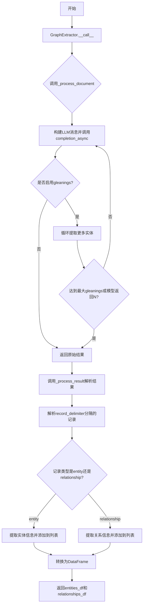
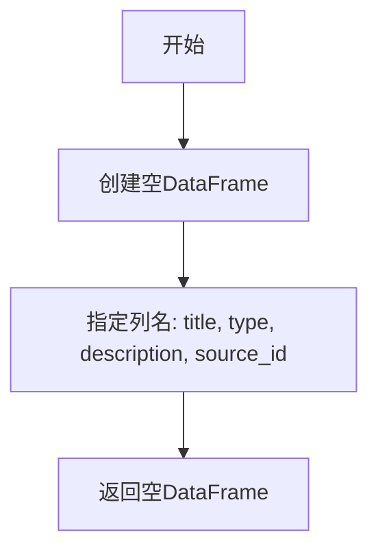
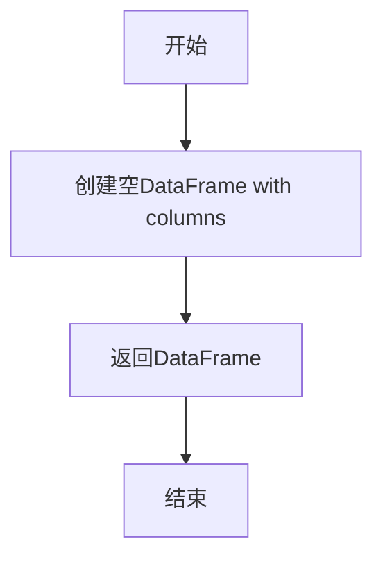
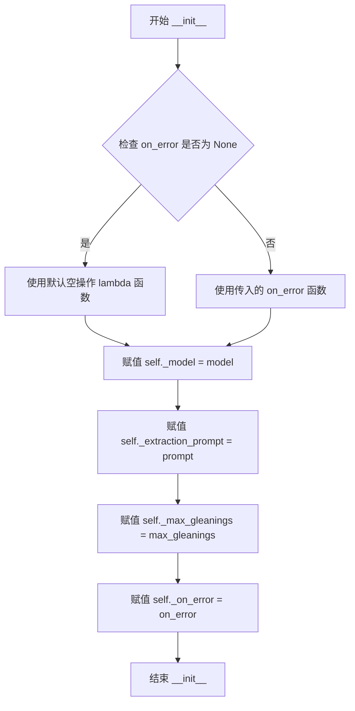
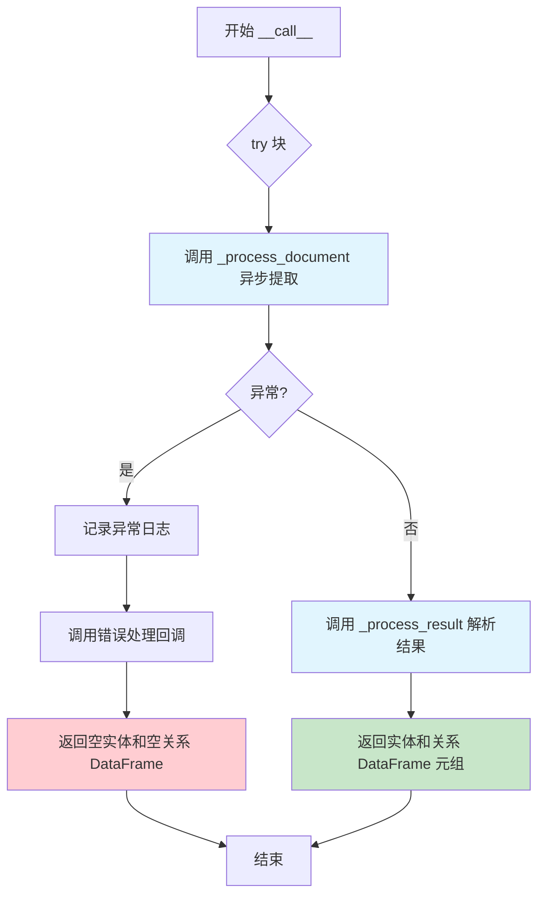
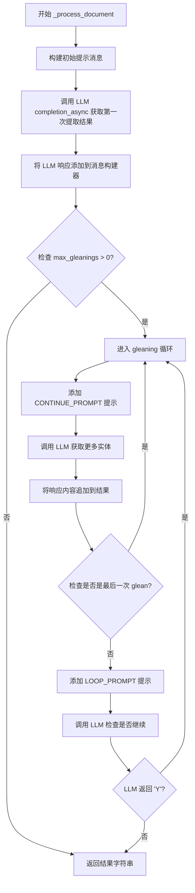
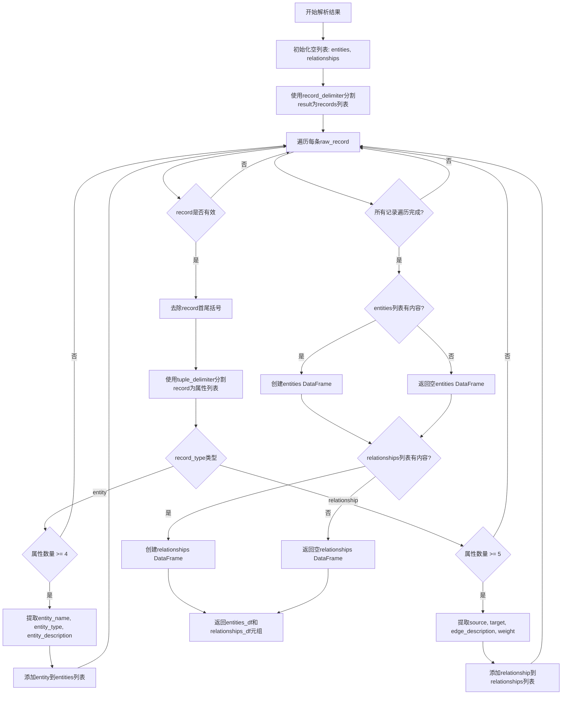

# `graphrag\packages\graphrag\graphrag\index\operations\extract_graph\graph_extractor.py` 详细设计文档

图形提取辅助工具类，通过调用LLM模型从文本中提取实体和关系，并将结果解析为pandas DataFrame格式的表格数据

## 整体流程



## 类结构

```
GraphExtractor (图形提取器类)
├── _model: LLMCompletion - LLM模型实例
├── _extraction_prompt: str - 提取提示模板
├── _max_gleanings: int - 最大迭代次数
└── _on_error: ErrorHandlerFn - 错误处理函数

全局函数 (模块级)
├── _empty_entities_df() - 返回空实体DataFrame
└── _empty_relationships_df() - 返回空关系DataFrame
```

## 全局变量及字段


### `INPUT_TEXT_KEY`
    
输入文本的键名常量，值为'input_text'

类型：`str`
    


### `RECORD_DELIMITER_KEY`
    
记录分隔符的键名常量

类型：`str`
    


### `COMPLETION_DELIMITER_KEY`
    
完成分隔符的键名常量

类型：`str`
    


### `ENTITY_TYPES_KEY`
    
实体类型的键名常量，值为'entity_types'

类型：`str`
    


### `TUPLE_DELIMITER`
    
元组分隔符，值为'<|>'

类型：`str`
    


### `RECORD_DELIMITER`
    
记录分隔符，值为'##'

类型：`str`
    


### `COMPLETION_DELIMITER`
    
完成标记，值为'<|COMPLETE|>'

类型：`str`
    


### `GraphExtractor._model`
    
LLM模型实例，用于调用大语言模型完成实体和关系提取

类型：`LLMCompletion`
    


### `GraphExtractor._extraction_prompt`
    
实体提取的提示模板，包含输入文本和实体类型的占位符

类型：`str`
    


### `GraphExtractor._max_gleanings`
    
最大迭代次数，控制从文本中提取更多实体的轮数

类型：`int`
    


### `GraphExtractor._on_error`
    
错误处理回调函数，当提取过程发生异常时调用

类型：`ErrorHandlerFn`
    
    

## 全局函数及方法


### `_empty_entities_df`

返回只包含列定义（title, type, description, source_id）的空DataFrame，用于初始化或错误时返回。

参数：
- 无

返回值：`pd.DataFrame`，返回一个空的DataFrame，仅包含列定义（title, type, description, source_id），用于在没有提取到任何实体时作为默认值返回。

#### 流程图



#### 带注释源码

```python
def _empty_entities_df() -> pd.DataFrame:
    """返回一个只包含列定义（title, type, description, source_id）的空DataFrame。
    
    用于在没有提取到任何实体时作为默认值返回，或者用于初始化操作。
    这确保了即使没有提取到实体，返回的DataFrame也具有正确的列结构，
    避免了后续处理中因列不存在而导致的错误。
    
    Returns:
        pd.DataFrame: 带有预定义列的空DataFrame，列包括：
            - title: 实体名称
            - type: 实体类型
            - description: 实体描述
            - source_id: 数据源ID
    """
    return pd.DataFrame(columns=["title", "type", "description", "source_id"])
```


### `_empty_relationships_df`

该函数是一个全局辅助函数，用于返回一个仅包含列定义（source, target, weight, description, source_id）的空 pandas DataFrame，主要用于 GraphExtractor 类在初始化数据容器或捕获异常时返回空的关联关系数据集，以保证调用方始终能获得有效的数据结构。

参数： 无

返回值：`pd.DataFrame`，返回一个仅定义列名但不含任何数据行的 DataFrame，用于作为空关联关系表的占位符

#### 流程图



#### 带注释源码

```python
def _empty_relationships_df() -> pd.DataFrame:
    """
    创建一个仅包含列定义（无数据行）的空关联关系DataFrame。
    
    该函数用于以下场景：
    1. 初始化 entities_df 和 relationships_df 变量，确保返回类型一致
    2. 当 GraphExtractor 捕获到异常时，返回空的关系表而不是 None
    
    Returns:
        pd.DataFrame: 包含列 ['source', 'target', 'weight', 'description', 'source_id'] 
                      的空 DataFrame
    """
    return pd.DataFrame(
        columns=["source", "target", "weight", "description", "source_id"]
    )
```

---

### 关联信息

**调用关系**：
- 被 `GraphExtractor.__call__()` 方法在异常处理分支中调用
- 被 `GraphExtractor._process_result()` 方法在关系数据为空时调用

**配套函数**：
- `_empty_entities_df()`: 类似的空实体DataFrame创建函数，返回包含 ["title", "type", "description", "source_id"] 列的空DataFrame

---

### 潜在技术债务与优化空间

1. **重复代码模式**：`_empty_entities_df()` 和 `_empty_relationships_df()` 结构完全一致，可考虑合并为一个通用函数，传入列名列表参数
2. **硬编码列名**：列名在多处硬编码，建议提取为模块级常量（如 `RELATIONSHIP_COLUMNS`），提高可维护性
3. **类型提示完整性**：可添加 `from __future__ import annotations` 以支持延迟类型注解

---

### 其它项目

**设计目标**：
- 提供一致的数据结构返回，避免调用方进行空值检查
- 在 LLM 提取失败或无关联关系时提供安全的默认返回值

**错误处理**：
- 本函数本身不涉及错误处理（无外部依赖）
- 调用方通过返回空 DataFrame 而非抛出异常来静默处理提取失败

**数据契约**：
- 返回的 DataFrame 必须包含列：source, target, weight, description, source_id
- 所有列的类型由 pandas 推断（通常为 object/float64）


### `GraphExtractor.__init__`

初始化方法，设置模型、提示、最大 gleanings（迭代提取次数）和错误处理函数，初始化 GraphExtractor 类的实例。

参数：

- `model`：`LLMCompletion`，用于完成 LLM 调用的模型实例，负责执行实体和关系提取的异步请求
- `prompt`：`str`，用于实体和关系提取的提示模板，包含格式化占位符（input_text、entity_types）
- `max_gleanings`：`int`，最大迭代提取次数，控制从文本中提取更多实体的循环次数，值为 0 时跳过迭代提取
- `on_error`：`ErrorHandlerFn | None`，可选的错误处理回调函数，当提取过程发生异常时调用，默认使用空操作 lambda 函数

返回值：`None`，构造函数不返回值，仅初始化对象内部状态

#### 流程图



#### 带注释源码

```python
def __init__(
    self,
    model: "LLMCompletion",
    prompt: str,
    max_gleanings: int,
    on_error: ErrorHandlerFn | None = None,
):
    """Init method definition."""
    # 将传入的 LLMCompletion 模型实例赋值给实例变量
    # 该模型用于异步调用大语言模型进行实体和关系提取
    self._model = model
    
    # 将提取提示模板赋值给实例变量
    # 提示模板应包含 {input_text} 和 {entity_types} 占位符
    self._extraction_prompt = prompt
    
    # 将最大 gleanings 次数赋值给实例变量
    # 控制迭代提取的轮数，0 表示不进行迭代提取
    self._max_gleanings = max_gleanings
    
    # 将错误处理函数赋值给实例变量
    # 如果未提供，则使用默认的空操作 lambda 函数
    # 该函数接受三个参数：异常对象、堆栈跟踪、上下文数据
    self._on_error = on_error or (lambda _e, _s, _d: None)
```


### `GraphExtractor.__call__`

这是 GraphExtractor 类的异步调用入口方法，接收文本、实体类型列表和源ID，通过内部方法处理文档并解析结果，最终返回实体和关系的 DataFrame 元组。

参数：

- `text`：`str`，输入的待提取文本内容
- `entity_types`：`list[str]`，要提取的实体类型列表
- `source_id`：`str`，数据源的标识符，用于关联提取结果

返回值：`tuple[pd.DataFrame, pd.DataFrame]`，包含实体DataFrame和关系DataFrame的元组

#### 流程图



#### 带注释源码

```python
async def __call__(
    self, text: str, entity_types: list[str], source_id: str
) -> tuple[pd.DataFrame, pd.DataFrame]:
    """Extract entities and relationships from the supplied text."""
    try:
        # 调用异步方法处理文档，执行实体和关系提取
        result = await self._process_document(text, entity_types)
    except Exception as e:  # pragma: no cover - defensive logging
        # 记录提取过程中的异常日志
        logger.exception("error extracting graph")
        # 调用错误处理回调函数，传递异常信息、堆栈跟踪和上下文数据
        self._on_error(
            e,
            traceback.format_exc(),
            {
                "source_id": source_id,
                "text": text,
            },
        )
        # 返回空的实体和关系 DataFrame，避免调用方崩溃
        return _empty_entities_df(), _empty_relationships_df()

    # 解析 LLM 返回的结果字符串为结构化的 DataFrame
    return self._process_result(
        result,
        source_id,
        TUPLE_DELIMITER,
        RECORD_DELIMITER,
    )
```


### `GraphExtractor._process_document`

该方法是一个异步内部方法，负责处理文档的实体和关系提取逻辑。它首先构建包含输入文本和实体类型的提示消息，然后调用 LLM 进行首次提取。如果配置了多次 gleanings（增量提取），则进入循环继续提取更多实体，直到达到最大次数或 LLM 返回无更多实体为止。最终返回所有提取结果的原始文本字符串。

参数：

- `self`：GraphExtractor，类的实例本身
- `text`：`str`，待处理的输入文档文本
- `entity_types`：`list[str]`，要提取的实体类型列表

返回值：`str`，LLM 提取的所有实体和关系原始文本内容

#### 流程图



#### 带注释源码

```python
async def _process_document(self, text: str, entity_types: list[str]) -> str:
    """
    处理文档提取逻辑的核心方法。
    
    参数:
        text: str - 输入的原始文档文本
        entity_types: list[str] - 需要提取的实体类型列表
    
    返回:
        str - LLM 返回的原始提取结果字符串
    """
    # 步骤1: 创建消息构建器并添加初始用户提示
    # 使用提取提示模板格式化，填入输入文本和实体类型
    messages_builder = CompletionMessagesBuilder().add_user_message(
        self._extraction_prompt.format(**{
            INPUT_TEXT_KEY: text,
            ENTITY_TYPES_KEY: ",".join(entity_types),
        })
    )

    # 步骤2: 异步调用 LLM 进行第一次实体/关系提取
    response: LLMCompletionResponse = await self._model.completion_async(
        messages=messages_builder.build(),
    )  # type: ignore
    # 获取第一次提取的内容结果
    results = response.content
    # 将 LLM 的回复添加到消息历史中，维持对话上下文
    messages_builder.add_assistant_message(results)

    # 步骤3: 如果配置了 gleanings（增量提取），进入循环提取更多实体
    # gleaning 是一种迭代技术，用于从同一文档中提取更多关系
    # 退出条件: (a) 达到配置的最大 gleaning 次数, (b) LLM 表示没有更多实体
    if self._max_gleanings > 0:
        # 遍历 max_gleanings 次进行增量提取
        for i in range(self._max_gleanings):
            # 添加继续提示，要求 LLM 提取更多实体
            messages_builder.add_user_message(CONTINUE_PROMPT)
            response: LLMCompletionResponse = await self._model.completion_async(
                messages=messages_builder.build(),
            )  # type: ignore
            response_text = response.content
            # 将增量提取的结果追加到已有结果中
            messages_builder.add_assistant_message(response_text)
            results += response_text

            # 如果是最后一次 glean（即将达到最大次数），直接退出循环
            # 不需要再询问是否继续
            if i >= self._max_gleanings - 1:
                break

            # 添加循环提示，询问是否还有更多实体需要提取
            messages_builder.add_user_message(LOOP_PROMPT)
            response: LLMCompletionResponse = await self._model.completion_async(
                messages=messages_builder.build(),
            )  # type: ignore
            # 如果 LLM 返回非 'Y'，表示没有更多实体，退出提取循环
            if response.content != "Y":
                break

    # 步骤4: 返回累积的所有提取结果（原始文本格式）
    return results
```


### `GraphExtractor._process_result`

该方法负责将LLM返回的原始字符串结果解析为结构化的实体（Entity）和关系（Relationship）数据。它通过指定的元组分隔符和记录分隔符拆分文本内容，识别并提取实体记录和关系记录，最终将它们转换为两个pandas DataFrame对象返回。

参数：

- `self`：GraphExtractor类实例本身
- `result`：`str`，LLM返回的原始文本字符串，包含用特定分隔符分隔的实体和关系记录
- `source_id`：`str`，数据来源的唯一标识符，用于追溯数据出处
- `tuple_delimiter`：`str`，用于分隔每条记录内属性的分隔符，默认为`<|>`
- `record_delimiter`：`str`，用于分隔不同记录的分隔符，默认为`##`

返回值：`tuple[pd.DataFrame, pd.DataFrame]`，返回包含实体和关系数据的两个DataFrame，第一个是实体DataFrame，第二个是关系DataFrame

#### 流程图



#### 带注释源码

```python
def _process_result(
    self,
    result: str,
    source_id: str,
    tuple_delimiter: str,
    record_delimiter: str,
) -> tuple[pd.DataFrame, pd.DataFrame]:
    """Parse the result string into entity and relationship data frames."""
    # 初始化用于存储解析结果的列表
    entities: list[dict[str, Any]] = []
    relationships: list[dict[str, Any]] = []

    # 使用记录分隔符将结果字符串分割成多条记录
    records = [r.strip() for r in result.split(record_delimiter)]

    # 遍历每一条记录
    for raw_record in records:
        # 去除记录首尾可能存在的括号
        record = re.sub(r"^\(|\)$", "", raw_record.strip())
        
        # 跳过空记录或完成标记
        if not record or record == COMPLETION_DELIMITER:
            continue

        # 使用元组分隔符拆分记录属性
        record_attributes = record.split(tuple_delimiter)
        record_type = record_attributes[0]

        # 处理实体记录：类型为"entity"且至少有4个属性
        if record_type == '"entity"' and len(record_attributes) >= 4:
            # 提取实体属性并清理字符串
            entity_name = clean_str(record_attributes[1].upper())
            entity_type = clean_str(record_attributes[2].upper())
            entity_description = clean_str(record_attributes[3])
            
            # 将实体添加到列表中，包含标题、类型、描述和来源ID
            entities.append({
                "title": entity_name,
                "type": entity_type,
                "description": entity_description,
                "source_id": source_id,
            })

        # 处理关系记录：类型为"relationship"且至少有5个属性
        if record_type == '"relationship"' and len(record_attributes) >= 5:
            # 提取关系属性并清理字符串
            source = clean_str(record_attributes[1].upper())
            target = clean_str(record_attributes[2].upper())
            edge_description = clean_str(record_attributes[3])
            
            # 尝试将最后一个属性解析为权重，解析失败则默认为1.0
            try:
                weight = float(record_attributes[-1])
            except ValueError:
                weight = 1.0

            # 将关系添加到列表中，包含源节点、目标节点、描述、来源ID和权重
            relationships.append({
                "source": source,
                "target": target,
                "description": edge_description,
                "source_id": source_id,
                "weight": weight,
            })

    # 将实体列表转换为DataFrame，如果有数据则使用数据创建，否则返回空DataFrame
    entities_df = pd.DataFrame(entities) if entities else _empty_entities_df()
    relationships_df = (
        pd.DataFrame(relationships) if relationships else _empty_relationships_df()
    )

    # 返回实体和关系DataFrame的元组
    return entities_df, relationships_df
```

## 关键组件


### GraphExtractor 类

图提取器核心类，负责从文本中提取实体和关系，并返回为pandas DataFrame格式的表格数据。

### CompletionMessagesBuilder 消息构建器

外部依赖工具类，用于构建LLM聊天消息，包含用户消息和助手消息的添加功能。

### 实体提取流程

通过LLM异步调用从输入文本中提取实体，使用提取提示词模板格式化输入，支持多轮 gleaning 迭代提取更多实体。

### 关系提取流程

在实体提取的同时提取关系数据，包含源实体、目标实体、权重和描述信息。

### 多轮 Gleaning 机制

支持配置最大 gleanings 次数，通过 CONTINUE_PROMPT 和 LOOP_PROMPT 实现多轮对话提取更多实体，直到达到最大次数或模型返回无更多实体。

### 结果解析器

使用正则表达式和定界符（tuple_delimiter, record_delimiter）解析LLM返回的字符串结果，转换为结构化的DataFrame。

### 错误处理机制

通过 ErrorHandlerFn 回调函数处理提取过程中的异常，记录错误日志并返回空的DataFrame。

### 定界符配置

使用 TUPLE_DELIMITER (⟨|⟩) 和 RECORD_DELIMITER (##) 作为记录和元组的分隔符，支持自定义配置。

### 清洁字符串工具

使用 clean_str 函数清理提取的实体名、类型和描述，去除多余空格和特殊字符。


## 问题及建议


### 已知问题

- **缺少输入验证**：在`_process_document`中没有对`text`和`entity_types`进行空值或类型验证，可能导致后续处理出现异常
- **LLM响应未校验**：在获取LLM响应后，未检查`response.content`是否为`None`或空字符串就直接使用
- **解析逻辑脆弱**：在`_process_result`中，解析记录时使用硬编码的索引（如`record_attributes[0]`、`record_attributes[1]`），没有对列表长度进行充分校验，可能导致`IndexError`
- **类型注解不规范**：使用字符串形式`"LLMCompletion"`进行类型检查，且存在多处`# type: ignore`注释，影响代码可读性和类型安全
- **错误处理不完善**：在`_process_result`方法中捕获`ValueError`设置默认权重，但其他解析异常未被捕获，可能导致整个解析失败
- **魔法值硬编码**：分隔符`TUPLE_DELIMITER`、`RECORD_DELIMITER`等在多处硬编码，缺乏配置灵活性
- **字符串拼接效率低**：使用`results += response_text`进行字符串拼接，在多次gleaning时效率不高
- **日志信息不足**：仅在异常时记录日志，缺少关键操作的成功/失败统计信息

### 优化建议

- 在`__call__`方法入口处添加输入参数验证，确保`text`非空、`entity_types`为有效列表
- 在调用LLM后添加响应校验逻辑，处理`content`为`None`或空的情况
- 重构`_process_result`方法，将记录解析逻辑拆分为独立方法，并为每种记录类型创建专门的解析方法，提高可读性和可测试性
- 将类型注解改为正确的导入方式，移除不必要的`# type: ignore`注释
- 使用`logging.INFO`级别记录提取统计信息（如提取到的实体数量、关系数量），便于监控和调试
- 考虑使用`list.append`配合`join`或使用`StringIO`替代字符串拼接，提高性能
- 将分隔符提取为类或模块级别常量，并考虑通过构造函数注入以提高灵活性
- 为关键代码路径添加单元测试，特别是解析逻辑和错误处理路径

## 其它


### 设计目标与约束

本模块的设计目标是从非结构化文本中提取结构化的实体和关系数据，并以表格形式（DataFrame）输出，支持知识图谱的构建。核心约束包括：1）依赖外部LLM进行实体和关系抽取，LLM的输出格式直接影响解析逻辑；2）通过max_gleanings参数控制提取轮次，平衡提取完整性LLM调用成本；3）使用预定义的分隔符（TUPLE_DELIMITER、RECORD_DELIMITER、COMPLETION_DELIMITER）进行输出格式化，需与prompt模板保持一致。

### 错误处理与异常设计

错误处理采用try-except捕获所有异常，并通过on_error回调函数上报错误信息。具体设计：1）在__call__方法中捕获异常并调用_on_error回调，回调参数包含异常对象、堆栈跟踪和上下文数据（source_id、text）；2）发生异常时返回空的entities和relationships DataFrame，确保调用方能继续处理；3）_process_result方法中的float解析异常被局部捕获，weight字段默认为1.0；4）日志记录采用logger.exception确保堆栈信息完整。潜在问题：异常被静默返回空DataFrame，可能导致上游难以感知部分失败。

### 数据流与状态机

数据流遵循以下路径：输入文本 → 构建LLM消息 → 调用completion_async → 解析结果 → 输出DataFrame。状态机体现在多轮提取流程：初始提取 → 判断max_gleanings > 0 → 进入循环提取（每轮包含continue prompt和loop prompt） → 检查模型响应是否为"Y"决定是否继续 → 达到最大轮次或模型返回非"Y"时退出。循环提取通过messages_builder维护对话上下文，实现增量实体发现。

### 外部依赖与接口契约

外部依赖包括：1）graphrag_llm.CompletionMessagesBuilder：构建LLM消息；2）graphrag_llm.completion.LLMCompletion：异步LLM调用接口；3）graphrag.index.typing.error_handler.ErrorHandlerFn：错误回调类型；4）graphrag.prompts.index.extract_graph中的CONTINUE_PROMPT和LOOP_PROMPT：多轮提取提示词；5）pandas：DataFrame数据结构。接口契约：__call__方法接收text（str）、entity_types（list[str]）、source_id（str），返回tuple[pd.DataFrame, pd.DataFrame]（entities和relationships）；_on_error回调签名为(Error, str, dict)。

### 性能考虑与优化空间

性能关键点：1）每次提取需调用LLM多次（初始+gleanings轮次），LLM调用为主要耗时点；2）结果解析使用正则和字符串split，复杂度O(n)可接受。优化空间：1）可添加批量处理接口支持并行提取多个文本；2）可在_process_result中添加缓存机制避免重复解析；3）_empty_entities_df和_empty_relationships_df每次调用创建新DataFrame，可考虑预创建单例空DataFrame；4）错误处理中返回空DataFrame而非抛出异常，可能掩盖部分失败，建议增加重试机制或失败标记。

### 配置与常量定义

本模块使用多个配置常量：INPUT_TEXT_KEY = "input_text"（prompt模板中文本占位符）、RECORD_DELIMITER_KEY = "record_delimiter"、COMPLETION_DELIMITER_KEY = "completion_delimiter"、ENTITY_TYPES_KEY = "entity_types"、TUPLE_DELIMITER = "<|>"（属性分隔符）、RECORD_DELIMITER = "##"（记录分隔符）、COMPLETION_DELIMITER = "<|COMPLETE|>"（完成标记）。这些常量与prompt模板紧密耦合，修改需同步更新两处。

### 并发与异步设计

异步设计采用async/await模式，核心方法__call__和_process_document均为异步。LLM调用通过completion_async实现非阻塞，消息构建器CompletionMessagesBuilder支持增量添加消息。多轮提取循环中每次LLM调用顺序执行，未实现并行以保持对话上下文连续性。调用方需使用asyncio.run或类似机制驱动执行。

### 可测试性分析

可测试性方面：1）类构造函数依赖注入model和on_error，便于mock；2）_process_result方法纯同步，可独立单元测试解析逻辑；3）需mock LLMCompletion的completion_async方法及其返回的content字段。测试难点：1）LLM输出格式依赖prompt效果，难以构造稳定测试用例；2）多轮提取逻辑涉及状态管理，测试覆盖需要构造多次交互；3）空DataFrame返回逻辑难以通过返回值判断是正常空结果还是异常返回。

### 安全性考量

安全考虑：1）text参数直接传入prompt模板，存在prompt注入风险，建议对输入文本进行基本清洗或使用安全格式化；2）on_error回调接收原始text，可能包含敏感信息，需确保日志存储安全；3）异常堆栈通过traceback.format_exc()获取，可能暴露内部实现细节，上报前需脱敏处理。

    