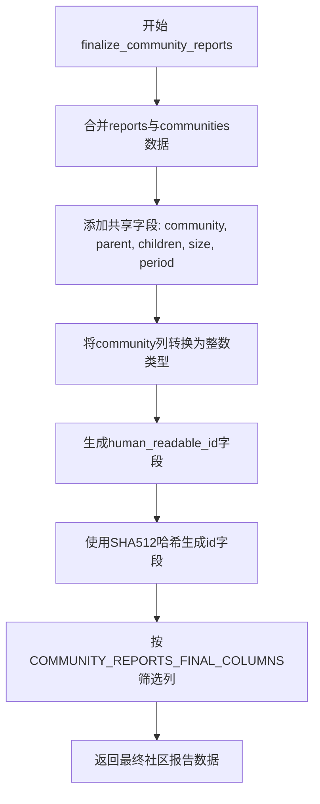

# `graphrag\packages\graphrag\graphrag\index\operations\finalize_community_reports.py` 详细设计文档

该文件实现了社区报告的最终处理流程，通过合并社区数据、转换数据类型、生成唯一标识等步骤，将原始报告数据转换为符合最终输出格式的社区报告。

## 整体流程

```mermaid
graph TD
    A[开始: finalize_community_reports] --> B[接收 reports 和 communities DataFrame]
    B --> C[合并数据: reports.merge(communities)]
    C --> D[数据类型转换: community 转换为 int]
    D --> E[生成 human_readable_id]
    E --> F[生成唯一标识: gen_sha512_hash]
    F --> G[选择最终列: COMMUNITY_REPORTS_FINAL_COLUMNS]
    G --> H[返回处理后的 DataFrame]
```

## 类结构

```
该文件为函数型代码，无类定义
└── finalize_community_reports (主函数)
```

## 全局变量及字段


### `reports`
    
输入参数，原始社区报告数据

类型：`pd.DataFrame`
    


### `communities`
    
输入参数，社区基础数据

类型：`pd.DataFrame`
    


### `community_reports`
    
中间变量，合并后的数据

类型：`pd.DataFrame`
    


### `COMMUNITY_REPORTS_FINAL_COLUMNS`
    
从外部导入的常量，定义最终输出列

类型：`list[str]`
    


### `gen_sha512_hash`
    
从外部导入的哈希生成函数

类型：`Callable`
    


    

## 全局函数及方法


### `finalize_community_reports`

该函数是社区报告的最终处理函数，负责将社区报告数据与社区数据进行合并，添加共享字段（如parent、children、size、period），生成人类可读的唯一标识符（human_readable_id）以及基于报告内容的SHA512哈希作为全局唯一标识符（id），最终返回符合COMMUNITY_REPORTS_FINAL_COLUMNS规范格式的社区报告数据。

参数：

- `reports`：`pd.DataFrame`，社区报告原始数据
- `communities`：`pd.DataFrame`，社区基础数据，包含community、parent、children、size、period等字段

返回值：`pd.DataFrame`，处理完成后的社区报告数据，包含所有最终列

#### 流程图



#### 带注释源码

```python
def finalize_community_reports(
    reports: pd.DataFrame,
    communities: pd.DataFrame,
) -> pd.DataFrame:
    """All the steps to transform final community reports."""
    
    # 第一步：合并社区报告与社区数据，添加共享字段
    # 从communities中选取community、parent、children、size、period字段
    # 通过community列进行左连接，确保所有报告记录都被保留
    community_reports = reports.merge(
        communities.loc[:, ["community", "parent", "children", "size", "period"]],
        on="community",
        how="left",
        copy=False,
    )

    # 第二步：将community列转换为整数类型，确保ID的一致性
    community_reports["community"] = community_reports["community"].astype(int)
    
    # 第三步：生成人类可读的社区ID，直接复制community值
    community_reports["human_readable_id"] = community_reports["community"]
    
    # 第四步：基于full_content字段生成SHA512哈希作为全局唯一标识符
    # 使用apply函数逐行处理，生成不可预测的唯一ID
    community_reports["id"] = community_reports.apply(
        lambda row: gen_sha512_hash(row, ["full_content"]), axis=1
    )

    # 第五步：按预定义的最终列顺序筛选并返回数据
    # 确保输出数据符合COMMUNITY_REPORTS_FINAL_COLUMNS规范
    return community_reports.loc[
        :,
        COMMUNITY_REPORTS_FINAL_COLUMNS,
    ]
```

## 关键组件


### finalize_community_reports 函数

将原始社区报告数据与社区数据合并，添加共享字段并生成唯一标识符，返回符合最终列规范的DataFrame

### pd.merge 数据合并操作

将报告数据与社区数据基于community字段进行左连接合并，获取parent、children、size、period等共享字段

### 数据类型转换

将community列转换为整数类型，并创建human_readable_id列用于人类可读展示

### gen_sha512_hash 哈希生成

使用SHA512算法基于full_content字段为每行生成唯一的哈希ID

### COMMUNITY_REPORTS_FINAL_COLUMNS 列筛选

通过列索引筛选，保留最终输出所需的特定列，返回结构化的社区报告数据


## 问题及建议


### 已知问题

-   **性能问题 - 行级迭代**：`df.apply(lambda row: ..., axis=1)` 是 pandas 中性能最差的操作之一，它逐行迭代而非使用向量化操作，当数据量大时会导致严重的性能瓶颈
-   **缺失的输入验证**：函数未验证 `reports` 和 `communities` DataFrame 是否包含必需的列（如 "community"、"full_content"），可能导致运行时错误
-   **空值处理缺失**：未处理 NaN 值，`astype(int)` 转换在存在空值时会失败，`gen_sha512_hash` 对空值的处理也未可知
-   **哈希生成逻辑不清晰**：`gen_sha512_hash(row, ["full_content"])` 的实现细节未知，如果 "full_content" 列不存在或为空，可能导致哈希生成失败或结果不符合预期
-   **重复社区标识符风险**：如果 `reports` 中存在重复的 `community` 值，merge 操作会产生笛卡尔积，导致数据膨胀
-   **硬编码的列名列表**：merge 操作中硬编码了需要选取的列名，降低了代码的可维护性

### 优化建议

-   **优化哈希生成**：使用向量化操作替代 `apply`，或考虑使用 pandas 的 `hash_pandas_object` 结合其他字符串处理方法实现批量哈希
-   **添加输入验证**：在函数开头添加列存在性检查，提供清晰的错误信息
-   **处理空值**：在类型转换前使用 `.fillna()` 或在 merge 后使用 `.dropna()` 处理缺失值
-   **处理重复数据**：在 merge 前检查并处理重复的 community 值，或使用验证机制确保数据完整性
-   **提取配置**：将列名列表提取为常量或配置，提高代码可维护性
-   **考虑使用索引 merge**：如果可能，使用 `set_index` 后再 merge，可以提高合并操作的性能

## 其它


### 设计目标与约束

本函数旨在将原始社区报告数据转换为最终格式，通过合并社区元数据、类型转换和ID生成，生成符合`COMMUNITY_REPORTS_FINAL_COLUMNS`规范的DataFrame。约束条件包括：输入的reports和communities DataFrame必须包含必要的列（如reports中的"community"和"full_content"，communities中的"community", "parent", "children", "size", "period"），且"full_content"列必须存在以供SHA512哈希生成ID。

### 错误处理与异常设计

本函数未显式实现错误处理和异常捕获。潜在异常场景包括：1) 合并操作中on指定的列不存在于任一DataFrame中时会抛出KeyError；2) apply操作中如果row的"full_content"字段缺失或为NULL，会导致哈希生成失败；3) 数据类型转换（如astype(int)）在遇到无法转换为整数的值时会抛出异常。建议增加列存在性检查、数据类型验证和异常捕获机制，确保函数的健壮性。

### 外部依赖与接口契约

本函数依赖以下外部组件：1) pandas库用于DataFrame操作；2) graphrag.data_model.schemas模块中的COMMUNITY_REPORTS_FINAL_COLUMNS常量，定义最终输出的列顺序；3) graphrag.index.utils.hashing模块中的gen_sha512_hash函数用于生成唯一标识符。接口契约方面：输入的reports参数应为包含"community"和"full_content"列的DataFrame，communities参数应为包含"community", "parent", "children", "size", "period"列的DataFrame；输出为符合COMMUNITY_REPORTS_FINAL_COLUMNS规范的DataFrame。

### 性能考虑与复杂度分析

本函数的主要性能瓶颈在于使用apply方法逐行生成哈希ID，时间复杂度为O(n)，其中n为报告数量。对于大规模数据集，建议优化方案包括：1) 使用向量化操作替代apply；2) 预先计算"full_content"的哈希而非在apply中逐行处理；3) 考虑使用更高效的哈希算法或批量处理机制。内存方面，merge操作可能会创建DataFrame副本（尽管使用了copy=False以尝试避免），需要关注内存占用。

### 数据质量与验证

数据质量方面需要关注：1) reports中的"community"列应与communities中的"community"列能够正确匹配；2) "full_content"列不应包含空值，否则生成的ID可能不符合预期；3) 合并后可能存在大量NULL值（当communities中无对应记录时），需要在后续处理中进行缺失值填充或过滤。建议在函数入口增加数据验证逻辑，确保输入数据符合预期。

    