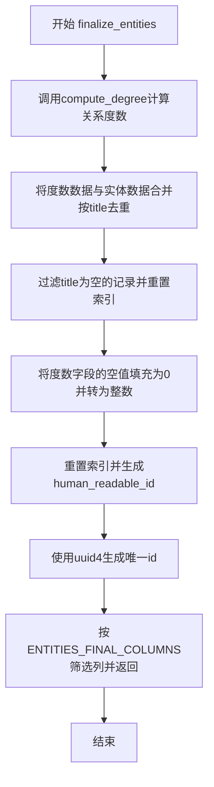
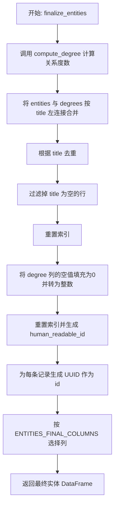
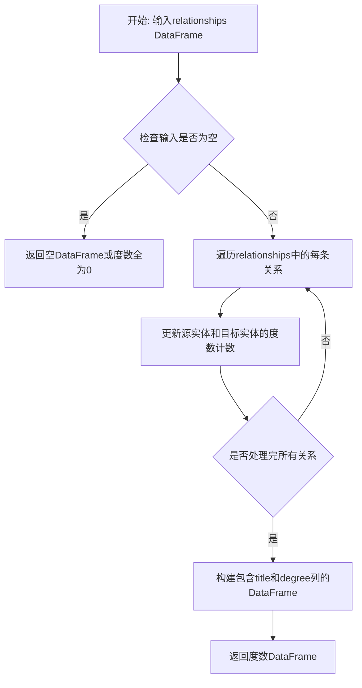
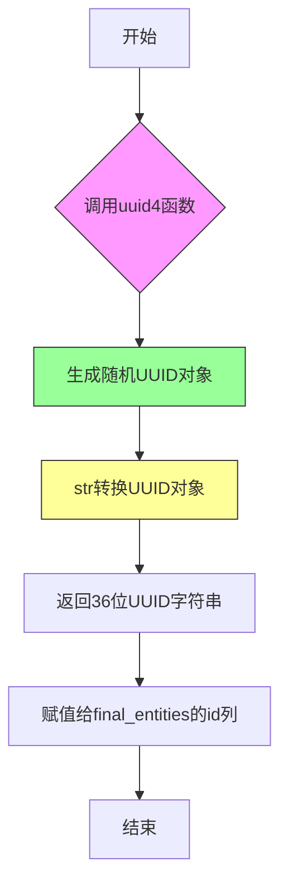

# `graphrag\packages\graphrag\graphrag\index\operations\finalize_entities.py` 详细设计文档

该文件实现了实体最终化处理的核心功能，接收原始实体和关系数据，通过计算图的度数来为每个实体添加连接度信息，并生成唯一标识符和人类可读的ID，最终返回符合标准格式的实体数据。

## 整体流程



## 类结构

```
finalize_entities (模块)
└── finalize_entities (全局函数)
```

## 全局变量及字段


### `ENTITIES_FINAL_COLUMNS`
    
从graphrag.data_model.schemas导入，定义最终实体表的列名列表

类型：`List[str]`
    


### `uuid4`
    
从uuid模块导入，用于生成UUID v4格式的唯一标识符

类型：`Callable[[], uuid.UUID]`
    


    

## 全局函数及方法


### `finalize_entities`

该函数接收实体和关系 DataFrame，计算每个实体的度数，生成人类可读的 ID 和 UUID，并返回符合最终格式要求的实体 DataFrame。

参数：

- `entities`：`pd.DataFrame`，输入的实体数据表
- `relationships`：`pd.DataFrame`，输入的关系数据表

返回值：`pd.DataFrame`，处理完成后的最终实体数据表，包含度排名、人类可读 ID、UUID 等字段

#### 流程图



#### 带注释源码

```python
def finalize_entities(
    entities: pd.DataFrame,
    relationships: pd.DataFrame,
) -> pd.DataFrame:
    """All the steps to transform final entities."""
    # 步骤1: 计算关系度数
    # 使用 compute_degree 函数根据 relationships 计算每个实体的度数
    degrees = compute_degree(relationships)
    
    # 步骤2: 合并实体与度数
    # 将 entities 与 degrees 按 'title' 字段进行左连接
    # 左连接确保即使某些实体没有度信息也能保留
    final_entities = entities.merge(degrees, on="title", how="left").drop_duplicates(
        subset="title"
    )
    
    # 步骤3: 过滤空值
    # 只保留 title 不为空的实体记录，并重置索引
    final_entities = final_entities.loc[entities["title"].notna()].reset_index()
    
    # 步骤4: 处理缺失度数
    # 断开的节点和没有社区的节点可能没有度数信息
    # 将缺失的度数填充为 0 并转换为整数类型
    final_entities["degree"] = final_entities["degree"].fillna(0).astype(int)
    
    # 步骤5: 生成人类可读 ID
    # 重置索引并基于索引生成 human_readable_id
    final_entities.reset_index(inplace=True)
    final_entities["human_readable_id"] = final_entities.index
    
    # 步骤6: 生成唯一标识符
    # 为每个实体生成 UUID 作为其唯一标识
    final_entities["id"] = final_entities["human_readable_id"].apply(
        lambda _x: str(uuid4())
    )
    
    # 步骤7: 选择最终列并返回
    # 只返回 ENTITIES_FINAL_COLUMNS 中定义的列
    return final_entities.loc[
        :,
        ENTITIES_FINAL_COLUMNS,
    ]
```


### `compute_degree`

该函数用于计算图中节点的度数（degree），即统计每个实体在关系数据中出现的次数，以衡量其在图中的连接程度。

参数：

- `relationships`：`pd.DataFrame`，输入的关系数据，包含源实体和目标实体的连接信息

返回值：`pd.DataFrame`，返回包含实体标题（title）及其对应度数（degree）的DataFrame，用于后续与实体数据合并

#### 流程图



#### 带注释源码

```
# 由于原始代码仅提供了compute_degree的导入和使用示例，
# 未包含该函数的具体实现。以下为根据其在finalize_entities中的
# 使用方式推断的函数签名和预期行为：

from graphrag.graphs.compute_degree import compute_degree

def compute_degree(relationships: pd.DataFrame) -> pd.DataFrame:
    """
    计算图中节点的度数（degree）。
    
    参数:
        relationships: pd.DataFrame
            关系数据DataFrame，应包含源实体和目标实体的连接信息
            （例如：source、target或title等列）
    
    返回:
        pd.DataFrame
            包含两列的DataFrame：
            - title: 实体标题
            - degree: 该实体在所有关系中出现的次数（度数）
            
    使用示例（来自finalize_entities函数）:
        degrees = compute_degree(relationships)
        final_entities = entities.merge(degrees, on="title", how="left")
    """
    # 预期实现逻辑：
    # 1. 从relationships中提取所有实体（作为源和作为目标的）
    # 2. 统计每个实体出现的次数
    # 3. 返回包含title和degree列的DataFrame
    
    # 注意：实际实现可能使用groupby、value_counts等pandas操作
    pass
```

---

**注意**：由于提供的代码片段中仅包含 `compute_degree` 的导入语句和使用示例（位于 `finalize_entities` 函数中），未包含该函数的具体实现代码。以上信息是基于以下使用方式推断得出的：

```python
degrees = compute_degree(relationships)
final_entities = entities.merge(degrees, on="title", how="left")
final_entities["degree"] = final_entities["degree"].fillna(0).astype(int)
```

如需获取完整的函数实现源码，建议查看 `graphrag/graphs/compute_degree.py` 文件的实际内容。


### `uuid4`

该函数是Python标准库`uuid`模块提供的UUID生成函数，在本代码中用于为每个实体生成全局唯一的标识符。通过`str(uuid4())`将生成的UUID对象转换为字符串形式，赋值给实体的`id`字段。

参数：

- 无参数

返回值：`str`，返回32位的十六进制字符串（带连字符的UUID格式），如`"550e8400-e29b-41d4-a716-446655440000"`

#### 流程图



#### 带注释源码

```python
# uuid4函数定义在Python标准库中，此处为导入声明
from uuid import uuid4  # 导入uuid4函数，用于生成随机UUID

# 在finalize_entities函数中使用uuid4
final_entities["id"] = final_entities["human_readable_id"].apply(
    lambda _x: str(uuid4())  # 对每一行调用uuid4()生成唯一ID并转换为字符串
)
```

#### 补充说明

- **函数来源**：`uuid`模块是Python标准库，无需额外安装
- **UUID版本**：uuid4()生成的是随机UUID（版本4），基于随机数生成
- **唯一性原理**：虽然理论上存在极小的碰撞概率，但在实际应用中可认为全球唯一
- **调用时机**：在`finalize_entities`函数中，通过`DataFrame.apply`为每一行生成不同的UUID

## 关键组件


### finalize_entities 函数

主函数，接收实体数据框和关系数据框，计算实体度数，生成最终格式的实体数据框，包含唯一ID和可读ID

### compute_degree 函数

调用外部模块计算关系的度，用于确定每个实体的连接数量

### merge 操作

将实体数据框与计算出的度数数据框按"title"列进行左连接合并

### 数据清洗流程

包括去重（drop_duplicates）、空值处理（notna、fillna）、类型转换（astype(int)）等操作

### ID生成机制

使用uuid4生成全局唯一标识符，并生成自增的人类可读ID

### ENTITIES_FINAL_COLUMNS 常量

定义在外部schema模块中，指定最终输出实体需要包含的列


## 问题及建议


### 已知问题

-   **索引使用错误**：第10行使用`entities["title"].notna()`进行过滤，但此时应该使用`final_entities`，这可能导致逻辑不一致
-   **UUID生成性能**：使用`apply`结合`lambda`生成UUID在大数据量场景下性能较差
-   **缺少类型注解**：函数参数和返回值都缺少类型注解，影响代码可读性和IDE支持
-   **空值处理顺序不当**：在合并后直接使用`drop_duplicates`，但没有先处理可能的空值问题
-   **硬编码列名**：多处直接使用字符串"title"、"degree"等硬编码列名，缺乏常量定义

### 优化建议

-   **修正索引使用**：将第10行改为使用`final_entities["title"].notna()`以确保数据一致性
-   **优化UUID生成**：使用`pd.util.hash_pandas_object`或向量化方式生成UUID，避免逐行apply
-   **添加类型注解**：
  ```python
  def finalize_entities(
      entities: pd.DataFrame,
      relationships: pd.DataFrame,
  ) -> pd.DataFrame:
  ```
-   **提取常量**：将列名"title"、"degree"等提取为常量，提高可维护性
-   **添加输入验证**：在函数开始时验证必要的列是否存在
-   **合并reset_index操作**：减少不必要的索引操作，提高性能

## 其它


### 设计目标与约束

本模块的设计目标是完成实体数据的最终处理流程，包括度数计算、数据合并、去重、索引重置以及ID生成，最终输出符合ENTITIES_FINAL_COLUMNS定义的标准化实体数据。约束条件包括：输入的entities和relationships必须为pandas DataFrame类型，且entities必须包含title列；输出结果严格按照预定义的列顺序返回。

### 错误处理与异常设计

代码采用pandas的链式操作处理异常情况。对于缺失的title字段，通过`.loc[entities["title"].notna()]`过滤；对于degree字段缺失值（可能出现在孤立节点或无社区的节点），使用`.fillna(0)`填充为0并转换为整数类型。若输入DataFrame缺少必要列（如title），pandas会抛出KeyError；若compute_degree返回的DataFrame结构不符合预期，merge操作可能失败。当前缺乏显式的输入验证和详细的错误信息反馈机制。

### 数据流与状态机

数据流如下：输入原始entities和relationships → compute_degree计算关系度数 → degrees与entities按title合并 → 按title去重 → 过滤title为空的数据 → 重置索引 → degree列填充默认值 → 重新设置索引 → 生成human_readable_id → 生成UUID格式的id → 按ENTITIES_FINAL_COLUMNS列顺序选取输出。不存在复杂的状态机，流程为单向线性处理。

### 外部依赖与接口契约

核心依赖包括：(1) uuid模块的uuid4()函数用于生成唯一标识；(2) pandas库提供DataFrame数据结构和操作；(3) graphrag.data_model.schemas模块的ENTITIES_FINAL_COLUMNS常量定义输出列规范；(4) graphrag.graphs.compute_degree模块的compute_degree函数计算节点度数。接口契约：finalize_entities(entities: pd.DataFrame, relationships: pd.DataFrame) -> pd.DataFrame，输入需包含title列的关系数据，输出为符合实体模式定义的DataFrame。

### 性能考量与优化空间

当前实现存在多次DataFrame复制操作（merge、drop_duplicates、reset_index等），大数据集下可能产生性能瓶颈。优化方向包括：(1) 使用inplace=True减少复制（但需注意部分操作已使用inplace）；(2) 考虑使用pyarrow或polars等高性能引擎替代pandas；(3) compute_degree的计算结果可缓存复用，避免重复计算；(4) 批量操作可考虑向量化优化。degree列先转换类型再fillna的顺序可调整为fillna后直接转换，减少类型转换开销。

### 配置与可扩展性

当前hardcoded的逻辑较多，可扩展性受限。可考虑将以下内容配置化：(1) degree缺失时的填充值（当前为0）；(2) id生成策略（当前使用uuid4，可扩展为自定义生成器）；(3) 列名映射关系（title列名、degree列名等）。若需支持多租户或不同图谱配置，可通过参数注入配置对象解耦硬编码逻辑。


    