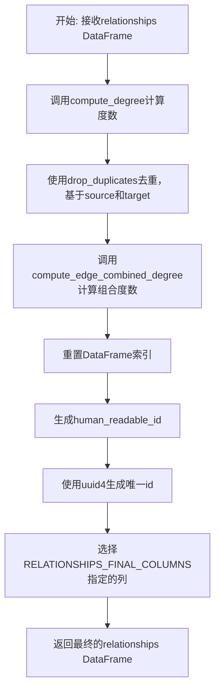
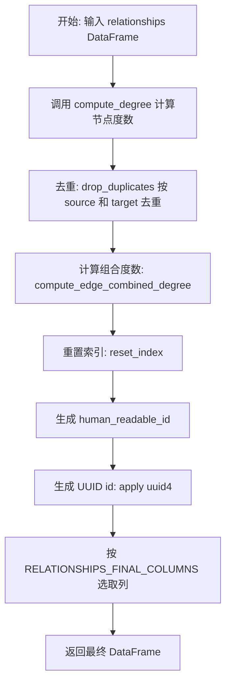
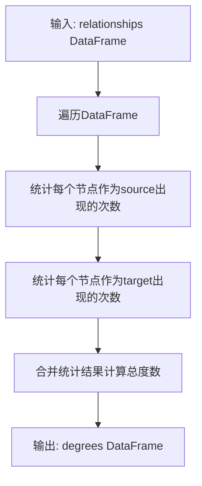
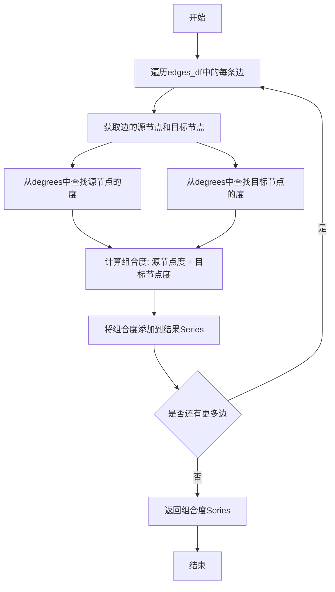
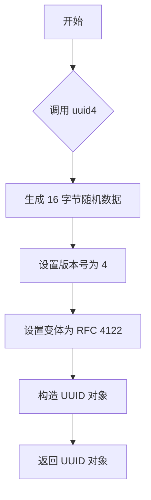
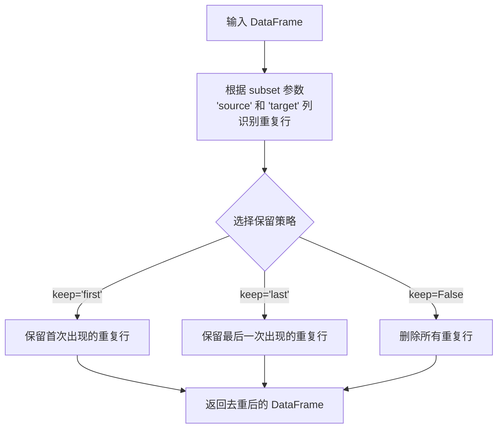
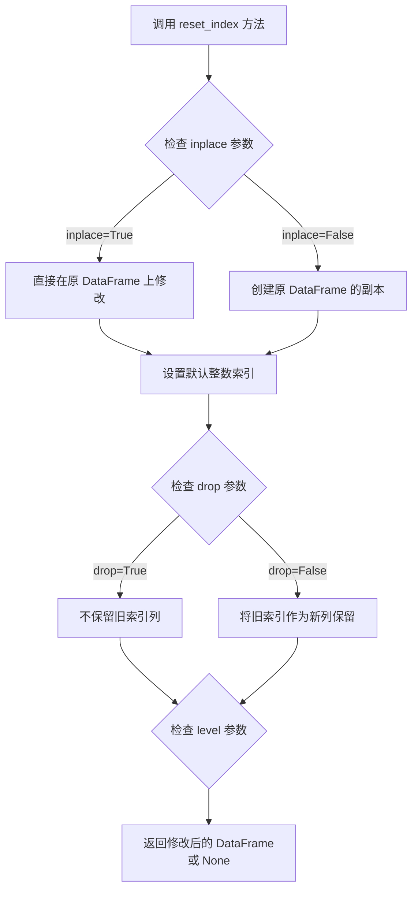
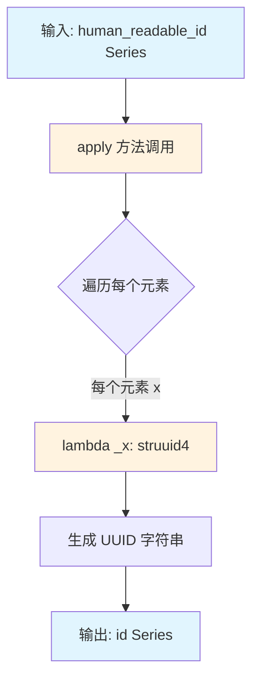

# `graphrag\packages\graphrag\graphrag\index\operations\finalize_relationships.py` 详细设计文档

这是一个用于处理和转换最终关系数据的Python模块，接收包含边（关系）的DataFrame，通过计算度数、去重、生成唯一标识等步骤，将原始关系数据转换为符合最终规范的关系数据集。

## 整体流程



## 类结构

```
finalize_relationships.py (模块)
└── finalize_relationships (主函数)
```

## 全局变量及字段


### `RELATIONSHIPS_FINAL_COLUMNS`
    
从graphrag.data_model.schemas导入的列名常量，定义了最终关系输出时需要保留的列名列表

类型：`list[str]`
    


    

## 全局函数及方法


### `finalize_relationships`

该函数是图谱关系数据处理的核心环节，负责将原始关系 DataFrame 进行多步骤转换：计算节点度数、去重、计算边组合度数、生成唯一标识和可读ID，最终输出符合最终模式的关系表。

参数：

- `relationships`：`pd.DataFrame`，输入的原始关系数据表，包含 source、target 等关系字段

返回值：`pd.DataFrame`，处理完成后的最终关系表，包含 human_readable_id、id、combined_degree 等最终字段

#### 流程图



#### 带注释源码

```python
def finalize_relationships(
    relationships: pd.DataFrame,
) -> pd.DataFrame:
    """All the steps to transform final relationships."""
    # 步骤1: 计算每个节点的度数（入度+出度），返回包含 degree 列的 Series
    degrees = compute_degree(relationships)

    # 步骤2: 按 source 和 target 去重，去除重复的边
    final_relationships = relationships.drop_duplicates(subset=["source", "target"])
    
    # 步骤3: 计算边的组合度数（两端节点的度数之和），用于后续排序或权重计算
    # 参数说明：
    #   - node_name_column="title": 节点名称字段
    #   - node_degree_column="degree": 节点度数字段
    #   - edge_source_column="source": 边源节点字段
    #   - edge_target_column="target": 边目标节点字段
    final_relationships["combined_degree"] = compute_edge_combined_degree(
        final_relationships,
        degrees,
        node_name_column="title",
        node_degree_column="degree",
        edge_source_column="source",
        edge_target_column="target",
    )

    # 步骤4: 重置 DataFrame 索引，为生成 human_readable_id 做准备
    final_relationships.reset_index(inplace=True)
    
    # 步骤5: 生成人类可读的序号 ID（0, 1, 2, ...）
    final_relationships["human_readable_id"] = final_relationships.index
    
    # 步骤6: 为每条记录生成全局唯一标识符 UUID
    final_relationships["id"] = final_relationships["human_readable_id"].apply(
        lambda _x: str(uuid4())
    )

    # 步骤7: 按预定义的最终列顺序选取并返回结果
    return final_relationships.loc[
        :,
        RELATIONSHIPS_FINAL_COLUMNS,
    ]
```


### `compute_degree`

该函数用于计算关系图中每个节点的度数（degree），即统计每个节点作为source或target出现的次数，返回包含节点及其对应度数的DataFrame，以便后续计算边的combined degree。

参数：

- `relationships`：`pd.DataFrame`，输入的关系数据表，包含"source"和"target"列，表示图的边

返回值：`pd.DataFrame`，返回包含节点标识和对应度数的DataFrame，通常包含"title"（节点名）和"degree"（度数）列

#### 流程图



#### 带注释源码

```
# 基于代码调用推断的实现逻辑
def compute_degree(relationships: pd.DataFrame) -> pd.DataFrame:
    """
    计算关系图中每个节点的度数
    
    参数:
        relationships: 包含'source'和'target'列的DataFrame，表示图的边
    
    返回:
        包含节点及其度数的DataFrame，包含'title'和'degree'列
    """
    # 创建一个空的degree统计字典
    degree_dict = {}
    
    # 遍历relationships中的每一行
    for _, row in relationships.iterrows():
        source = row['source']
        target = row['target']
        
        # 统计source节点的度 数
        if source in degree_dict:
            degree_dict[source] += 1
        else:
            degree_dict[source] = 1
        
        # 统计target节点的度数
        if target in degree_dict:
            degree_dict[target] += 1
        else:
            degree_dict[target] = 1
    
    # 转换为DataFrame格式
    degrees = pd.DataFrame([
        {'title': node, 'degree': degree}
        for node, degree in degree_dict.items()
    ])
    
    return degrees
```

> **注意**：由于提供的代码片段仅包含对`compute_degree`函数的调用，未展示其完整源码，以上源码为基于函数调用方式和用途进行的合理推断。实际实现可能使用向量化操作以提高性能。


### `compute_edge_combined_degree`

该函数用于计算图中每条边的组合度（combined degree），即边的两端节点的度之和或某种聚合结果，常用于关系重要性评估或图特征工程。

参数：

- `edges_df`：`pd.DataFrame`，包含边/关系信息的数据框
- `degrees`：`pd.Series` 或 `pd.DataFrame`，节点的度信息，通常为节点名称到度数的映射
- `node_name_column`：`str`，节点名称在数据框中对应的列名（用于匹配）
- `node_degree_column`：`str`，节点度在degrees数据框中对应的列名
- `edge_source_column`：`str`，边的源节点在edges_df中对应的列名
- `edge_target_column`：`str`，边的目标节点在edges_df中对应的列名

返回值：`pd.Series`，每条边对应的组合度值（通常为源节点度 + 目标节点度）

#### 流程图



#### 带注释源码

```python
def compute_edge_combined_degree(
    edges_df: pd.DataFrame,
    degrees: pd.DataFrame,
    node_name_column: str = "title",
    node_degree_column: str = "degree",
    edge_source_column: str = "source",
    edge_target_column: str = "target",
) -> pd.Series:
    """计算图中每条边的组合度（两端节点度之和）。
    
    参数:
        edges_df: 包含边信息的数据框
        degrees: 包含节点度信息的数据框，需包含node_name_column和node_degree_column
        node_name_column: 节点名称列名
        node_degree_column: 节点度列名
        edge_source_column: 边源节点列名
        edge_target_column: 边目标节点列名
    
    返回:
        每条边的组合度Series
    """
    # 将degrees转换为节点名到度的字典，便于快速查找
    degree_dict = degrees.set_index(node_name_column)[node_degree_column].to_dict()
    
    # 定义内部函数计算单条边的组合度
    def calculate_combined_degree(row):
        source = row[edge_source_column]
        target = row[edge_target_column]
        # 获取源节点度，默认为0
        source_degree = degree_dict.get(source, 0)
        # 获取目标度，默认为0
        target_degree = degree_dict.get(target, 0)
        # 返回组合度（两端度之和）
        return source_degree + target_degree
    
    # 应用到每条边，计算组合度
    return edges_df.apply(calculate_combined_degree, axis=1)
```


### `uuid4`

生成一个随机的 UUID（版本 4），该函数是 Python 标准库 `uuid` 模块中的一个函数，用于创建基于随机数的唯一标识符。在本代码中用于为每条关系记录生成唯一的 ID。

参数：

- 无

返回值：`uuid.UUID`，一个随机生成的 UUID 对象。在代码中通过 `str(uuid4())` 转换为字符串格式。

#### 流程图



#### 带注释源码

```python
# uuid4 函数的简化实现逻辑
# 来源：Python 标准库 uuid 模块

def uuid4() -> UUID:
    """
    生成一个随机的 UUID（UUID 版本 4）。
    
    UUID 版本 4 使用随机或伪随机位生成。
    这是一个几乎唯一的标识符，适合用于生成 ID。
    
    Returns:
        UUID: 一个随机生成的 UUID 对象
    """
    import os
    
    # 步骤 1: 生成 16 字节的随机数据
    # 使用操作系统提供的加密安全随机数生成器
    bytes = os.urandom(16)
    
    # 步骤 2: 将字节数组转换为可修改的 bytearray
    bytes = bytearray(bytes)
    
    # 步骤 3: 设置版本号为 4 (UUID 版本 4)
    # 清空高 4 位，然后设置 0100 (0x40)
    bytes[6] = (bytes[6] & 0x0f) | 0x40
    
    # 步骤 4: 设置变体为 RFC 4122
    # 清空高 2 位，然后设置 10 (0x80)
    bytes[8] = (bytes[8] & 0x3f) | 0x80
    
    # 步骤 5: 返回构造好的 UUID 对象
    return UUID(bytes=bytes)
```

#### 在本项目中的实际使用

```python
# 在 finalize_relationships 函数中的实际应用
from uuid import uuid4  # 导入 uuid4 函数

# 为每条关系记录生成唯一 ID
final_relationships["id"] = final_relationships["human_readable_id"].apply(
    lambda _x: str(uuid4())  # 将 UUID 对象转换为字符串
)
```

**使用说明**：在 `finalize_relationships` 函数中，`uuid4()` 被用于为每个关系记录生成一个全局唯一标识符。`apply` 方法会对每一行数据调用 `lambda` 函数，从而为每条记录生成一个唯一的 UUID 字符串作为 `id` 字段的值。


# pd.DataFrame.drop_duplicates 详细设计文档

## 概述

`pd.DataFrame.drop_duplicates` 是 Pandas DataFrame 的内置方法，用于移除 DataFrame 中的重复行，可根据指定的列或全部列进行去重操作，并返回一个新的 DataFrame（默认不修改原数据）。

---

## 方法信息

### `pd.DataFrame.drop_duplicates`

**描述**：从 DataFrame 中删除重复的行，返回删除重复项后的 DataFrame。

**参数**：

- `subset`：`column label or sequence of labels, optional`，用于识别重复的列。默认使用所有列。
- `keep`：`{'first', 'last', False}, default 'first'`，控制保留哪一行：'first' 保留第一次出现的重复项，'last' 保留最后一次出现的，False 删除所有重复项。
- `inplace`：`bool, default False`，是否原地修改 DataFrame 而非返回新的 DataFrame。
- `ignore_index`：`bool, default False`，如果为 True，则结果的索引将标记为 0, 1, ..., n-1。

**返回值**：`pd.DataFrame`，删除重复项后的 DataFrame。

---

## 在代码中的使用

### 调用上下文

在 `finalize_relationships` 函数中：

```python
final_relationships = relationships.drop_duplicates(subset=["source", "target"])
```

---

#### 流程图



---

#### 带注释源码

```python
# 使用 pd.DataFrame.drop_duplicates 方法移除重复关系
# 参数说明：
#   subset=["source", "target"]: 仅根据 "source" 和 "target" 列判断重复性
#   keep="first" (默认值): 保留首次出现的记录，删除后续重复项
#   inplace=False (默认值): 不修改原 DataFrame，返回新的去重 DataFrame
#   ignore_index=False (默认值): 保留原始索引

final_relationships = relationships.drop_duplicates(
    subset=["source", "target"]  # 指定基于 source 和 target 两列进行去重
)
```

---

## 技术细节

| 项目 | 详情 |
|------|------|
| **方法类型** | Pandas DataFrame 实例方法 |
| **所属类** | `pandas.core.frame.DataFrame` |
| **内存行为** | 默认返回新对象，原 DataFrame 不变 |
| **时间复杂度** | O(n)，其中 n 为 DataFrame 行数 |
| **空间复杂度** | O(n)，需要额外空间存储结果 |

---

## 设计目标与约束

- **去重依据**：代码中基于 `source` 和 `target` 两列判断关系是否重复
- **保留策略**：使用默认的 `keep='first'`，保留首次出现的关系
- **不可变性**：不修改原始 `relationships` DataFrame，保证数据安全

---

## 错误处理与异常设计

- 如果 `subset` 指定的列不存在于 DataFrame 中，将抛出 `KeyError`
- 如果 `keep` 参数值不合法，将抛出 `ValueError`
- 该方法自动处理空 DataFrame 和全空值的情况

---

## 外部依赖与接口契约

| 依赖项 | 作用 |
|--------|------|
| `pandas` 库 | 提供 DataFrame 数据结构和 drop_duplicates 方法 |

---

## 潜在的技术债务或优化空间

1. **索引重置**：后续代码使用 `reset_index(inplace=True)`，可考虑在 `drop_duplicates` 时直接设置 `ignore_index=True` 以减少操作步骤
2. **内存效率**：对于超大规模 DataFrame，可考虑使用 `inplace=True` 减少内存占用（需权衡数据安全性）
3. **可读性增强**：可显式添加 `keep='first'` 参数使意图更清晰


### `pd.DataFrame.reset_index`

`reset_index` 是 pandas DataFrame 的内置方法，用于重置 DataFrame 的索引。该方法将当前索引转换为 DataFrame 的一列，并创建一个新的默认整数索引。如果指定 `inplace=True`，则直接在原 DataFrame 上进行修改，不返回新对象。

#### 参数

- `level`：`int`、`str`、`list` 或 `None`，默认 `0` - 对于 MultiIndex，可以指定重置哪个级别的索引。可以是单个级别、级别列表或 `None`（重置所有级别）。
- `drop`：`bool`，默认 `False` - 如果设置为 `True`，则不将旧索引作为列保留，直接丢弃。
- `inplace`：`bool`，默认 `False` - 如果设置为 `True`，则在原 DataFrame 上直接修改，不返回新对象。
- `col_level`：`int` 或 `str`，默认 `0` - 当列名是 MultiIndex 时，指定将索引插入到哪个级别。
- `col_fill`：`object`，默认 `''` - 当列名是 MultiIndex 时，用于填充其他级别的名称。

#### 返回值

- 当 `inplace=True` 时：返回 `None`，修改直接在原 DataFrame 上完成。
- 当 `inplace=False` 时：返回一个新的 DataFrame，索引已重置。

#### 流程图



#### 带注释源码

```python
# 在 final_relationships DataFrame 上调用 reset_index 方法
# inplace=True 表示直接修改原 DataFrame，不创建副本
final_relationships.reset_index(inplace=True)

# 详细解释：
# 1. reset_index() 将当前的索引（可能是之前操作产生的非标准索引）重置为默认的整数索引 (0, 1, 2, ...)
# 2. inplace=True 参数确保修改直接在 final_relationships 对象上完成，节省内存
# 3. 旧索引默认会被保留为名为 'index' 的列，但在本例中由于前面进行了 drop_duplicates 操作，
#    原始索引值可能并不重要，重置后将成为连续的整数索引，便于后续添加 human_readable_id
# 4. 此操作是为后续创建 human_readable_id 和 id 字段做准备，确保索引是连续整数
```


### `finalize_relationships` 中的 `.apply()` 调用

这是 `pd.Series.apply` 方法（因为调用对象是 `finalize_relationships["human_readable_id"]` Series），用于为每一行生成唯一的 UUID 标识符。

参数：

-  `func`：`callable`（lambda 函数），将输入值转换为 UUID 字符串的函数
-  `*args`：`tuple`，可选，位置参数（此处未使用）
-  `**kwargs`：`dict`，可选，关键字参数（此处未使用）

返回值：`pd.Series`，返回与原 Series 索引相同的新 Series，其中每个元素都是通过 func 转换后的值（UUID 字符串）

#### 流程图



#### 带注释源码

```python
# 为每一行生成唯一的 UUID 标识符
final_relationships["id"] = final_relationships["human_readable_id"].apply(
    lambda _x: str(uuid4())  # 将 lambda 函数的输入转换为 UUID 字符串
)

# 参数详解：
# - func: lambda _x: str(uuid4()) - 匿名函数，接收每个元素 _x，返回 UUID 字符串
#   * _x 参数接收 human_readable_id Series 中的每个值
#   * str(uuid4()) 生成唯一的 UUID 字符串
# - *args: 未使用
# - **kwargs: 未使用
#
# 返回值：
# - 返回一个新的 pd.Series，索引与原 human_readable_id 相同
# - 每个元素是 UUID 字符串，如 "550e8400-e29b-41d4-a716-446655440000"
#
# 执行流程：
# 1. 遍历 human_readable_id Series 中的每个元素
# 2. 对每个元素调用 lambda 函数
# 3. lambda 函数生成一个新的 UUID 并转换为字符串
# 4. 将所有结果组合成新的 Series 赋值给 "id" 列
```

#### 在 `finalize_relationships` 函数上下文中的完整代码

```python
def finalize_relationships(
    relationships: pd.DataFrame,
) -> pd.DataFrame:
    """All the steps to transform final relationships."""
    # 计算度数
    degrees = compute_degree(relationships)

    # 去重并计算组合度数
    final_relationships = relationships.drop_duplicates(subset=["source", "target"])
    final_relationships["combined_degree"] = compute_edge_combined_degree(
        final_relationships,
        degrees,
        node_name_column="title",
        node_degree_column="degree",
        edge_source_column="source",
        edge_target_column="target",
    )

    # 重置索引并添加人类可读 ID
    final_relationships.reset_index(inplace=True)
    final_relationships["human_readable_id"] = final_relationships.index
    
    # ====== pd.Series.apply 使用位置 ======
    # 为每行生成唯一的 UUID 标识符
    # 应用 lambda 函数将每个 human_readable_id 值转换为 UUID 字符串
    final_relationships["id"] = final_relationships["human_readable_id"].apply(
        lambda _x: str(uuid4())
    )
    # ======================================

    # 返回指定列的最终关系数据
    return final_relationships.loc[
        :,
        RELATIONSHIPS_FINAL_COLUMNS,
    ]
```


### pd.DataFrame.loc

`pd.DataFrame.loc` 是 pandas DataFrame 的标签索引访问器，用于通过行标签和列标签选择数据。代码中利用该方法从 `final_relationships` DataFrame 中选取所有行（`:`）以及预定义的最终列集合（`RELATIONSHIPS_FINAL_COLUMNS`），实现了数据列的筛选和标准化输出。

参数：

-  `row_selector`：标签、标签列表、切片对象或布尔数组，用于指定要选择的行。代码中使用 `:` 表示选择所有行。
-  `column_selector`：标签、标签列表或布尔数组，用于指定要选择的列。代码中传入 `RELATIONSHIPS_FINAL_COLUMNS`（列名列表）。

返回值：`pd.DataFrame`，返回包含选定行和列的新 DataFrame。代码中返回经过列筛选后的关系数据子集。

#### 流程图

```mermaid
flowchart TD
    A[输入: final_relationships DataFrame] --> B[执行 .loc[:, RELATIONSHIPS_FINAL_COLUMNS]]
    B --> C{行选择: : 表示所有行}
    B --> D{列选择: RELATIONSHIPS_FINAL_COLUMNS}
    C --> E[输出: 筛选后的 DataFrame]
    D --> E
    E --> F[返回给调用者]
```

#### 带注释源码

```python
# final_relationships 是经过以下处理后的 DataFrame：
# 1. 去重（drop_duplicates）
# 2. 计算 combined_degree（compute_edge_combined_degree）
# 3. 重置索引并添加 human_readable_id 和 id 字段

# 使用 .loc 选择数据
# 语法结构: DataFrame.loc[row_selector, column_selector]
return final_relationships.loc[
    :,                              # 行选择器：冒号表示选择所有行（等同于 slice(None)）
    RELATIONSHIPS_FINAL_COLUMNS,    # 列选择器：预定义的列名列表，用于筛选需要保留的列
]
# 等价于: final_relationships.iloc[:, final_relationships.columns.isin(RELATIONSHIPS_FINAL_COLUMNS)]
# 但 .loc 是基于标签的选择，更直观和安全

# 返回值是一个新的 DataFrame，仅包含 RELATIONSHIPS_FINAL_COLUMNS 中定义的列
```


## 关键组件


### finalize_relationships 函数

主函数，执行关系数据的最终处理，包括去重、度计算、ID生成和列选择

### compute_degree 函数

计算图中每个节点的度，用于后续的边合并度计算

### compute_edge_combined_degree 函数

计算边的合并度，结合源节点和目标节点的度数

### 去重操作

使用 drop_duplicates 基于 source 和 target 列去除重复的关系记录

### ID 生成机制

使用 uuid4 为每条关系生成全局唯一标识符

### RELATIONSHIPS_FINAL_COLUMNS

定义了最终输出关系数据应包含的列集合，作为列选择的依据


## 问题及建议


### 已知问题

-   **缺少类型注解**：函数参数和返回值都未添加类型提示，不利于静态分析和 IDE 支持
-   **输入数据校验缺失**：未对输入的 DataFrame 进行基本校验（如空 DataFrame、必需列是否存在等），可能导致后续操作出现隐晦错误
-   **UUID 生成效率低**：使用 `apply` + lambda 逐行生成 UUID 性能较差，未利用向量化操作
-   **中间数据冗余**：创建了多个中间 DataFrame 副本（`degrees`、`final_relationships`），未充分利用链式操作或原地修改
-   **重复遍历数据**：先计算完整 degrees，再在去重后的数据上计算 combined_degree，存在不必要的计算
-   **列选择时机不当**：最终列筛选 (`loc[:, RELATIONSHIPS_FINAL_COLUMNS]`) 放在最后，之前的数据处理可能在不需要的列上做了操作

### 优化建议

-   **添加类型注解**：为参数和返回值添加 `pd.DataFrame` 类型提示，提升代码可维护性
-   **添加输入校验**：在函数开头添加空 DataFrame 检查和必需列验证，提供明确的错误信息
-   **优化 UUID 生成**：使用 `pd.util.hash_pandas_object` 或 `numpy` 向量化方式批量生成 UUID，避免逐行 apply
-   **减少中间变量**：考虑使用链式调用或合并部分操作，减少内存占用
-   **前置列筛选**：在数据处理早期阶段就筛选需要的列，避免对无关列进行计算
-   **考虑合并 compute_degree**：如果 `compute_degree` 只用于此场景，可考虑将逻辑内联以减少函数调用开销

## 其它


### 设计目标与约束

本模块的设计目标是处理和转换图关系数据，生成最终的关系统一数据格式。具体约束包括：1) 输入数据必须包含source、target和title列；2) 输出数据必须符合RELATIONSHIPS_FINAL_COLUMNS定义的模式；3) 使用UUID作为关系ID确保全局唯一性；4) 需要保持列顺序与定义的标准列顺序一致。

### 错误处理与异常设计

代码中缺少显式的错误处理机制。潜在异常场景包括：1) 输入DataFrame为空时的处理；2) 缺少必需列（source、target、title）时的异常抛出；3) compute_degree和compute_edge_combined_degree函数调用失败的处理；4) UUID生成失败时的备选方案。建议增加输入数据验证、异常捕获和有意义的错误信息抛出。

### 数据流与状态机

数据流处理分为五个主要阶段：1) 计算节点度数；2) 去重（基于source-target对）；3) 计算边组合度数；4) 生成ID（human_readable_id和uuid）；5) 列筛选与重置索引。整个过程是单向流动的，无状态回退或分支。每个阶段都有明确的输入输出契约。

### 外部依赖与接口契约

主要外部依赖包括：1) pandas库用于DataFrame操作；2) uuid库用于生成唯一标识；3) graphrag.data_model.schemas中的RELATIONSHIPS_FINAL_COLUMNS常量定义输出列模式；4) graphrag.graphs.compute_degree模块的compute_degree函数；5) graphrag.index.operations.compute_edge_combined_degree模块的compute_edge_combined_degree函数。输入接口要求relationships参数为pd.DataFrame类型且包含必需列。

### 输入输出规范

输入：relationships (pd.DataFrame) - 包含source、target、title等列的关系统数据
输出：pd.DataFrame - 符合RELATIONSHIPS_FINAL_COLUMNS模式的最终关系数据

### 性能考虑与优化空间

当前实现存在以下优化空间：1) drop_duplicates操作可在计算度数之前执行以减少计算量；2) apply lambda生成UUID可使用向量化操作替代；3) inplace=True的参数修改不利于链式调用；4) 可考虑使用numpy或polars提升大规模数据处理性能；5) 中间变量final_relationships可优化内存使用。

### 并发与线程安全性

该函数为纯函数，无共享状态修改，理论上支持并发调用。但需注意：1) uuid4()的生成在极高并发下理论上存在冲突可能（虽然概率极低）；2) reset_index的inplace操作会修改原DataFrame（若传入的是视图而非副本），可能产生意外的副作用。

### 测试与验证建议

建议补充以下测试用例：1) 空DataFrame输入的行为验证；2) 重复source-target对的去重验证；3) 输出列顺序与RELATIONSHIPS_FINAL_COLUMNS一致性验证；4) UUID格式和唯一性验证；5) 大规模数据集的性能基准测试；6) 缺少必需列时的异常抛出测试。

    