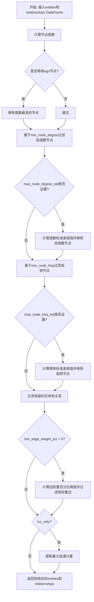
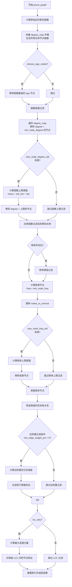
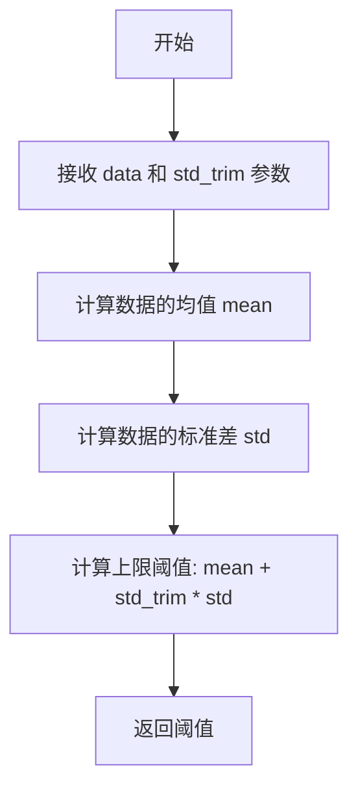

# `graphrag\packages\graphrag\graphrag\index\operations\prune_graph.py` 详细设计文档

该文件实现图剪枝功能，通过基于节点度数、节点频率和边权重的多重过滤策略，移除图中的低频节点、低权重边和孤立节点，最终返回剪枝后的实体和关系数据框。

## 整体流程



## 类结构

```
该文件为模块文件，无类定义，仅包含函数
prune_graph (主函数)
└── _get_upper_threshold_by_std (辅助函数)
```

## 全局变量及字段


### `entities`
    
输入的实体数据表，包含节点的标题和其他属性

类型：`pd.DataFrame`
    


### `relationships`
    
输入的关系数据表，包含源节点、目标节点和边权重

类型：`pd.DataFrame`
    


### `min_node_freq`
    
节点的最小频率阈值，低于此频率的节点将被移除

类型：`int`
    


### `max_node_freq_std`
    
节点频率的最大标准差倍数，用于计算频率上限阈值

类型：`float | None`
    


### `min_node_degree`
    
节点的最小度数阈值，低于此度数的节点将被移除

类型：`int`
    


### `max_node_degree_std`
    
节点度数的最大标准差倍数，用于计算度数上限阈值

类型：`float | None`
    


### `min_edge_weight_pct`
    
边权重的最小百分位数，低于此百分位的边将被移除

类型：`float`
    


### `remove_ego_nodes`
    
是否移除度数最高的自我中心节点

类型：`bool`
    


### `lcc_only`
    
是否仅保留最大连通分量中的节点和边

类型：`bool`
    


### `pruned_entities`
    
剪枝后的实体数据表

类型：`pd.DataFrame`
    


### `pruned_rels`
    
剪枝后的关系数据表

类型：`pd.DataFrame`
    


### `degree_df`
    
包含节点标题和对应度数的DataFrame

类型：`pd.DataFrame`
    


### `degree_map`
    
节点标题到度数的映射字典

类型：`dict[str, int]`
    


### `entity_titles`
    
所有实体标题的集合

类型：`set[str]`
    


### `degree_values`
    
所有节点度数的列表

类型：`list[int]`
    


### `nodes_to_remove`
    
待移除节点的集合

类型：`set[str]`
    


### `ego_node`
    
度数最高的自我中心节点标题

类型：`str`
    


### `remaining`
    
经过初步过滤后剩余的实体数据

类型：`pd.DataFrame`
    


### `low_freq`
    
频率低于最小阈值的节点标题

类型：`pd.Series`
    


### `freq_values`
    
剩余节点的频率值列表

类型：`list`
    


### `high_freq`
    
频率高于上限阈值的节点标题

类型：`pd.Series`
    


### `kept_titles`
    
最终保留的节点标题集合

类型：`set[str]`
    


### `min_weight`
    
根据百分位数计算的边权重最小值

类型：`float`
    


### `lcc_nodes`
    
最大连通分量中的节点集合

类型：`set[str]`
    


### `data`
    
输入的数值数据列表

类型：`list[float] | list[int]`
    


### `std_trim`
    
标准差倍数，用于计算阈值上限

类型：`float`
    


### `mean`
    
数据的平均值

类型：`float`
    


### `std`
    
数据的标准差

类型：`float`
    


### `upper`
    
计算得到的阈值上限

类型：`float`
    


    

## 全局函数及方法


### `prune_graph`

该函数是图数据处理的核心剪枝模块，通过多维度过滤策略（度数阈值、频率阈值、边权重百分位过滤、最大连通分量提取）逐步移除图中不符合条件的节点和边，最终返回净化后的实体和关系数据集。

参数：

- `entities`：`pd.DataFrame`，输入的实体数据框，需包含 title 列
- `relationships`：`pd.DataFrame`，输入的关系数据框，需包含 source、target 列及可选的边权重列
- `min_node_freq`：`int = 1`，最小节点频率阈值，低于此值的节点将被移除
- `max_node_freq_std`：`float | None = None`，最大节点频率的标准差倍数，用于计算高频节点上限
- `min_node_degree`：`int = 1`，最小节点度数阈值，低于此值的节点被视为孤立点将被移除
- `max_node_degree_std`：`float | None = None`，最大节点度数的标准差倍数，用于识别高度数异常节点
- `min_edge_weight_pct`：`float = 40`，边权重百分位阈值，低于该百分位的边将被过滤
- `remove_ego_nodes`：`bool = False`，是否移除度数最高的自我中心节点
- `lcc_only`：`bool = False`，是否仅保留最大连通分量

返回值：`tuple[pd.DataFrame, pd.DataFrame]`，返回剪枝后的实体数据框和关系数据框，均已重置索引

#### 流程图



#### 带注释源码

```python
def prune_graph(
    entities: pd.DataFrame,
    relationships: pd.DataFrame,
    min_node_freq: int = 1,
    max_node_freq_std: float | None = None,
    min_node_degree: int = 1,
    max_node_degree_std: float | None = None,
    min_edge_weight_pct: float = 40,
    remove_ego_nodes: bool = False,
    lcc_only: bool = False,
) -> tuple[pd.DataFrame, pd.DataFrame]:
    """Prune graph by removing out-of-range nodes and low-weight edges.

    Returns the pruned *entities* and *relationships* DataFrames.
    """
    # -- Compute degrees from the original edge list --------------------------
    # 使用 compute_degree 函数计算关系数据框中每个节点的度数
    degree_df = compute_degree(relationships)
    # 将度数数据转换为字典格式，键为节点标题，值为度数
    degree_map: dict[str, int] = dict(
        zip(degree_df["title"], degree_df["degree"], strict=True)
    )

    # Entity-only nodes (isolated, degree 0) must also be present so that
    # degree thresholds are computed over the same population as before.
    # 确保所有实体节点都存在于 degree_map 中，孤立节点度数为 0
    entity_titles: set[str] = set(entities["title"])
    for t in entity_titles:
        degree_map.setdefault(t, 0)

    degree_values = list(degree_map.values())
    nodes_to_remove: set[str] = set()

    # -- Ego node removal (highest degree) ------------------------------------
    # 如果启用ego节点移除，删除度数最高的节点（高度数异常节点）
    if remove_ego_nodes and degree_map:
        ego_node = max(degree_map, key=lambda n: degree_map[n])
        nodes_to_remove.add(ego_node)

    # -- Degree-based removal -------------------------------------------------
    # 移除度数低于最小阈值的节点
    for node, deg in degree_map.items():
        if deg < min_node_degree:
            nodes_to_remove.add(node)

    # 如果设置了最大度数标准差阈值，计算上限并移除超限节点
    if max_node_degree_std is not None and degree_values:
        upper = _get_upper_threshold_by_std(degree_values, max_node_degree_std)
        for node, deg in degree_map.items():
            if deg > upper:
                nodes_to_remove.add(node)

    # -- Apply degree removals before frequency filtering ---------------------
    # 在频率过滤之前应用度数过滤，确保频率阈值在相同节点集上计算
    # NX mutates sequentially, so frequency thresholds are computed over the
    # set of entity nodes that survived degree-based removal.
    remaining = entities[~entities["title"].isin(nodes_to_remove)]

    # -- Frequency-based removal ----------------------------------------------
    # 基于节点频率进行过滤
    freq_col = schemas.NODE_FREQUENCY
    if freq_col in remaining.columns:
        # 移除低频节点
        low_freq = remaining.loc[remaining[freq_col] < min_node_freq, "title"]
        nodes_to_remove.update(low_freq)
        remaining = remaining[~remaining["title"].isin(nodes_to_remove)]

        # 如果设置了最大频率标准差阈值，移除高频异常节点
        if max_node_freq_std is not None and len(remaining) > 0:
            freq_values = remaining[freq_col].tolist()
            upper = _get_upper_threshold_by_std(freq_values, max_node_freq_std)
            high_freq = remaining.loc[remaining[freq_col] > upper, "title"]
            nodes_to_remove.update(high_freq)

    # -- Filter to surviving entity nodes -------------------------------------
    # 计算保留的节点标题集合
    kept_titles = entity_titles - nodes_to_remove
    # 筛选保留的实体和关系
    pruned_entities = entities[entities["title"].isin(kept_titles)]
    pruned_rels = relationships[
        relationships["source"].isin(kept_titles)
        & relationships["target"].isin(kept_titles)
    ]

    # -- Edge weight filtering ------------------------------------------------
    # 基于边权重百分位进行过滤
    if (
        len(pruned_rels) > 0
        and min_edge_weight_pct > 0
        and schemas.EDGE_WEIGHT in pruned_rels.columns
    ):
        # 计算给定百分位的边权重阈值
        min_weight = np.percentile(
            pruned_rels[schemas.EDGE_WEIGHT].to_numpy(), min_edge_weight_pct
        )
        # 保留权重高于阈值的边
        pruned_rels = pruned_rels[pruned_rels[schemas.EDGE_WEIGHT] >= min_weight]

    # -- LCC ------------------------------------------------------------------
    # 如果启用仅保留最大连通分量选项
    if lcc_only and len(pruned_rels) > 0:
        # 计算最大连通分量节点集合
        lcc_nodes = largest_connected_component(pruned_rels)
        # 仅保留属于最大连通分量的节点和边
        pruned_entities = pruned_entities[pruned_entities["title"].isin(lcc_nodes)]
        pruned_rels = pruned_rels[
            pruned_rels["source"].isin(lcc_nodes)
            & pruned_rels["target"].isin(lcc_nodes)
        ]

    # 返回剪枝后的实体和关系，重置索引
    return pruned_entities.reset_index(drop=True), pruned_rels.reset_index(drop=True)
```


### `_get_upper_threshold_by_std`

这是一个私有辅助函数，用于根据数据的均值和标准差计算上限阈值。它接收一个数值列表和标准差倍数，返回 `mean + std_trim * std` 作为阈值，用于过滤高于该阈值的异常数据点。

参数：

- `data`：`list[float] | list[int]`，要进行阈值计算的数值列表（可以是度数、频率等）
- `std_trim`：`float`，标准差倍数，用于确定阈值高于均值的标准差数量

返回值：`float`，计算得到的上限阈值（均值 + 标准差倍数 × 标准差）

#### 流程图



#### 带注释源码

```python
def _get_upper_threshold_by_std(
    data: list[float] | list[int], std_trim: float
) -> float:
    """Get upper threshold by standard deviation."""
    # 计算数据的算术平均值
    mean = np.mean(data)
    # 计算数据的标准差（默认使用总体标准差，ddof=0）
    std = np.std(data)
    # 返回均值加上 std_trim 倍标准差作为上限阈值
    # 这是一种基于统计的异常值过滤方法
    return mean + std_trim * std  # type: ignore
```

## 关键组件


### prune_graph 函数

图剪枝主函数，通过多阶段过滤策略移除不满足条件的节点和边，包括度过滤、频率过滤、边权重过滤和最大连通分量过滤。

### compute_degree 函数

计算关系图中每个节点的度数，用于后续的度基过滤。

### largest_connected_component 函数

计算并返回图中最大连通分量包含的节点集合，用于LCC过滤。

### _get_upper_threshold_by_std 函数

通过标准差方法计算上界阈值，用于基于标准差的高频节点和高度数节点过滤。

### 度基过滤模块

根据min_node_degree和max_node_degree_std参数过滤低度数和高度数节点，支持通过标准差动态计算上界。

### 频率基过滤模块

根据min_node_freq和max_node_freq_std参数过滤低频和高频实体节点，支持标准差动态阈值计算。

### 边权重过滤模块

使用np.percentile计算边权重的百分位阈值，过滤权重低于min_edge_weight_pct的边。

### 自我节点移除模块

remove_ego_nodes参数控制是否移除最高度数的节点（ego node），防止中心节点主导图结构。

### LCC过滤模块

lcc_only参数控制是否仅保留最大连通分量中的节点，用于提取图的核心连接部分。

### 数据验证与填充模块

确保所有实体节点都在度映射中包含，度为0的孤立节点也参与阈值计算。


## 问题及建议


### 已知问题

-   **循环冗余**：度检查循环遍历 `degree_map` 两次（一次检查下限 `min_node_degree`，一次检查上限 `max_node_degree_std`），可以合并为单次循环以提高效率
-   **Ego节点移除不完整**：`remove_ego_nodes` 仅移除单个最高度节点，而命名暗示应移除所有高度中心节点（hub nodes）
-   **重复过滤操作**：多次执行 `isin` 检查和 DataFrame 过滤操作（如 `remaining[~remaining["title"].isin(nodes_to_remove)]`），产生冗余的中间数据副本
-   **魔数与常量未统一**：`"title"`, "source", "target" 等字符串直接硬编码，未统一使用 `schemas` 中定义的常量，易导致拼写错误
-   **空数据边界处理缺失**：`compute_degree` 返回空结果或 DataFrame 缺少必需列时缺乏防御性检查，可能导致运行时异常
-   **类型提示不一致**：部分变量如 `degree_map` 使用 `dict[str, int]` 但未使用 `from __future__ import annotations`
-   **内存占用隐患**：多阶段过滤产生多个中间 DataFrame，大数据集场景下可能导致内存压力

### 优化建议

-   合并度值检查的两层循环为单次遍历，使用 `if` 条件同时检查上下限
-   若需移除多个 ego 节点，改用循环或基于百分位数阈值移除 top-k 节点
-   提取公共过滤逻辑为函数，或使用位图/布尔索引减少重复 DataFrame 操作
-   将所有列名字符串替换为 `schemas.NODE_TITLE`, `schemas.SOURCE`, `schemas.TARGET` 等常量引用
-   在函数入口添加参数校验：`if entities.empty or relationships.empty: return entities, relationships`
-   对 `_get_upper_threshold_by_std` 增加空列表检查：`if not data: return 0.0`
-   考虑使用 `inplace=True` 或链式操作减少中间 DataFrame 创建，或在必要时显式 `del` 释放大对象


## 其它


### 设计目标与约束

**设计目标：**
- 通过多维度过滤策略（节点度数、节点频率、边权重、连通分量）逐步剪枝图中的低价值节点和边
- 保持过滤逻辑的顺序独立性，确保每次过滤基于前一次的结果进行
- 支持灵活的配置参数，允许用户根据不同场景调整过滤阈值

**设计约束：**
- 输入的 entities 和 relationships 必须包含 title 列作为节点标识
- 频率过滤要求数据中存在 NODE_FREQUENCY 列，边权重过滤要求存在 EDGE_WEIGHT 列
- max_node_freq_std 和 max_node_degree_std 不能同时使用，需要互斥
- 所有过滤操作均在 DataFrame 层面进行，不修改原始输入数据

### 错误处理与异常设计

**边界情况处理：**
- 空输入：空 entities 或 relationships 时直接返回空 DataFrame（已通过 len(pruned_rels) > 0 等条件判断）
- 缺失列：freq_col 和 schemas.EDGE_WEIGHT 使用 in 判断，避免 KeyError
- degree_map 为空时跳过 ego node 移除逻辑

**异常场景：**
- 列不存在：使用条件判断跳过相应过滤步骤，不会抛出异常
- NaN 值：np.percentile 会自动忽略 NaN，但 DataFrame 操作可能产生警告
- 类型错误：degree_map 使用 dict 和 set 确保类型一致性

### 数据流与状态机

**数据转换流程：**
原始 entities → 计算 degree_map → 基于 degree 过滤 → 基于 frequency 过滤 → 边权重过滤 → LCC 过滤 → 最终 pruned entities/relationships

**状态变化：**
nodes_to_remove 集合不断累积待删除节点，最终通过 kept_titles = entity_titles - nodes_to_remove 计算保留节点，实现"先标记后删除"策略

### 外部依赖与接口契约

**依赖模块：**
- graphrag.data_model.schemas：提供 NODE_FREQUENCY 和 EDGE_WEIGHT 常量
- graphrag.graphs.compute_degree：计算节点度数
- graphrag.graphs.connected_components.largest_connected_component：计算最大连通分量
- numpy：数值计算（mean、std、percentile）
- pandas：数据处理

**接口契约：**
- 输入：entities (pd.DataFrame) 必须包含 title 列，relationships (pd.DataFrame) 必须包含 source、target 列
- 输出：tuple[pd.DataFrame, pd.DataFrame]，分别为剪枝后的 entities 和 relationships
- 约束：min_node_freq >= 1，min_node_degree >= 0，0 <= min_edge_weight_pct <= 100

### 性能考量与优化空间

**当前实现特点：**
- 使用 set 进行节点去重，O(1) 查找效率
- 多次 DataFrame 过滤操作，每次都会创建新对象

**潜在优化方向：**
- 可使用索引预计算减少重复的isin操作
- 对于大规模数据，可考虑使用 polars 替代 pandas 提升性能
- 多个过滤步骤可以合并为单次过滤，减少数据遍历次数

### 配置参数说明

| 参数名 | 类型 | 默认值 | 说明 |
|--------|------|--------|------|
| min_node_freq | int | 1 | 节点最小频率阈值 |
| max_node_freq_std | float \| None | None | 节点频率标准差倍数上限 |
| min_node_degree | int | 1 | 节点最小度数阈值 |
| max_node_degree_std | float \| None | None | 节点度数标准差倍数上限 |
| min_edge_weight_pct | float | 40 | 边权重百分位阈值 |
| remove_ego_nodes | bool | False | 是否移除最高度数节点 |
| lcc_only | bool | False | 是否仅保留最大连通分量 |

### 使用场景示例

典型使用场景包括：知识图谱构建后的实体关系精简、去除噪声边和孤立节点、提取核心社区结构、降低下游处理的数据规模等。


    