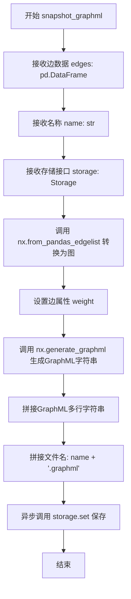
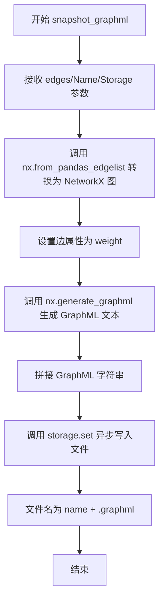

# `graphrag\packages\graphrag\graphrag\index\operations\snapshot_graphml.py` 详细设计文档

一个异步图数据导出模块，通过NetworkX将pandas DataFrame格式的边数据转换为GraphML标准格式，并使用存储接口持久化保存。

## 整体流程



## 类结构

```
snapshot_graphml (模块级异步函数)
```

## 全局变量及字段


### `edges`
    
输入的边数据，以 pandas DataFrame 形式存储，包含图的边信息，通常包含 'source'、'target' 和 'weight' 等列

类型：`pd.DataFrame`
    


### `name`
    
快照的名称，用于命名输出的 GraphML 文件

类型：`str`
    


### `storage`
    
存储接口实例，提供异步的键值存储能力，用于将 GraphML 内容写入持久化系统

类型：`Storage`
    


### `graph`
    
从边数据构建的 NetworkX 图对象，通过 from_pandas_edgelist 方法转换边 DataFrame 得到

类型：`nx.Graph`
    


### `graphml`
    
GraphML 格式的图序列化字符串，通过 NetworkX 的 generate_graphml 生成

类型：`str`
    


    

## 全局函数及方法


### `snapshot_graphml`

该异步函数用于将图数据的边信息导出为标准 GraphML 格式，并持久化存储。它接收边数据 DataFrame、文件名和存储接口，将 DataFrame 转换为 NetworkX 图对象，生成 GraphML 格式文本后写入存储。

参数：

- `edges`：`pd.DataFrame`，包含图的边数据，预期包含源节点、目标节点和权重属性
- `name`：`str`，输出文件的名称（不含扩展名）
- `storage`：`Storage`，存储抽象接口，用于持久化 GraphML 文件

返回值：`None`，该函数通过副作用（写入存储）完成操作，无返回值

#### 流程图



#### 带注释源码

```python
import networkx as nx
import pandas as pd
from graphrag_storage import Storage


async def snapshot_graphml(
    edges: pd.DataFrame,
    name: str,
    storage: Storage,
) -> None:
    """Take a entire snapshot of a graph to standard graphml format."""
    # 使用 NetworkX 将 pandas DataFrame 转换为图对象
    # edges 应包含至少三列：源节点、目标节点、weight（权重）
    graph = nx.from_pandas_edgelist(edges, edge_attr=["weight"])
    
    # 使用 NetworkX 生成 GraphML 格式的文本输出
    # generate_graphml 返回生成器，需要拼接为完整字符串
    graphml = "\n".join(nx.generate_graphml(graph))
    
    # 异步写入存储层，文件名添加 .graphml 扩展名
    await storage.set(name + ".graphml", graphml)
```

## 关键组件


### snapshot_graphml 异步函数

将边数据帧转换为GraphML格式并存储到指定存储中的异步函数

### networkx 图转换模块

使用networkx库的from_pandas_edgelist方法将pandas数据帧转换为NetworkX图对象，支持边属性中的权重信息

### GraphML 格式生成模块

使用networkx的generate_graphml生成器将图对象序列化为GraphML格式字符串

### Storage 存储接口

异步存储抽象接口，提供set方法用于将GraphML数据写入持久化存储

### 边数据处理

使用pandas DataFrame作为输入格式，通过edge_attr参数指定weight属性为边属性


## 问题及建议


### 已知问题

- **输入验证缺失**：未验证 `edges` DataFrame 的必需列（如 `source`、`target`）是否存在，也未检查数据是否为空，可能导致运行时错误
- **异常处理不足**：`storage.set()` 调用缺少 try-except 捕获，可能导致未处理的异步异常
- **权重属性处理不完善**：仅固定使用 `weight` 作为边属性，若数据中不存在该列会导致错误，且未处理权重为 None 的情况
- **文件名安全风险**：直接拼接 `name + ".graphml"` 未对特殊字符进行转义或校验，可能产生无效的文件名或路径遍历风险
- **内存效率问题**：对于大规模图数据，一次性生成完整 GraphML 字符串可能导致内存溢出，应考虑流式处理
- **日志缺失**：函数执行过程中无任何日志记录，不利于问题追踪和监控
- **文档注释不完整**：缺少对参数约束条件、异常抛出、边界情况等的说明

### 优化建议

- 添加输入验证逻辑，检查 `edges` 是否包含必需的 `source` 和 `target` 列，以及数据是否为空
- 为 `storage.set()` 调用添加异常处理，捕获并合理处理可能的存储错误
- 使用可选的边属性列表或动态检测可用属性，增强函数灵活性
- 对 `name` 参数进行文件名安全校验，过滤或拒绝非法字符
- 对于大型图，考虑使用生成器模式流式写入存储，或提供分片导出选项
- 添加结构化日志记录关键操作和错误信息
- 完善文档注释，明确参数约束、可能的异常和返回值说明

## 其它


### 设计目标与约束

将图数据（边列表）导出为标准GraphML格式，存储到指定的存储系统中。约束：依赖networkx和pandas库，要求edges参数包含必要的列以生成有效的GraphML，支持异步操作以提高性能。

### 错误处理与异常设计

验证edges参数是否为有效的pandas DataFrame且包含必需列；若networkx图生成失败或storage.set()抛出异常，则向上传播；建议调用方处理可能的IOError和DataFrame格式错误。

### 数据流与状态机

输入：edges (DataFrame) → 转换为NetworkX图对象 → 生成GraphML字符串 → 输出：存储至storage；无状态机设计，为纯函数式转换流程。

### 外部依赖与接口契约

依赖networkx≥3.0用于图操作，pandas≥1.5用于数据处理，graphrag_storage.Storage接口需提供async set(key, value)方法；edges参数需包含source和target列用于生成边，weight为可选边属性。

### 性能考虑

使用async/await实现非阻塞IO，适用于大规模图数据导出；GraphML字符串拼接可考虑流式处理以减少内存占用；对于超大图，建议分片处理或使用生成器。

### 安全性考虑

验证name参数防止路径遍历攻击；对GraphML内容进行长度检查避免超大规模输出；storage.set()调用需确保原子性。

### 兼容性考虑

GraphML格式遵循标准规范，兼容主流图分析工具；networkx生成的GraphML版本需与目标系统兼容；Python版本需支持async语法（3.7+）。

### 测试策略

单元测试：验证正常数据转换、边界条件（空DataFrame）、异常数据处理；集成测试：验证与Storage接口的交互；性能测试：大数据集导出耗时和内存占用。

### 配置管理

name参数支持自定义文件名；storage后端可配置（本地文件系统、云存储等）；GraphML生成参数（如编码、压缩）可通过配置调整。

    