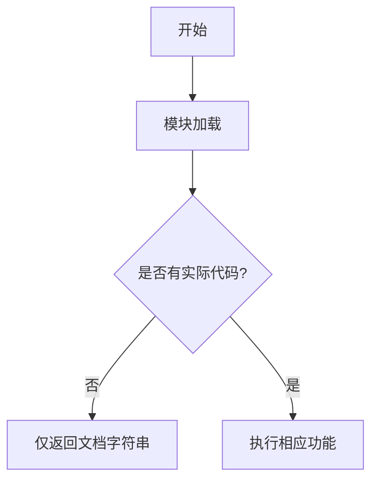

# `graphrag\packages\graphrag\graphrag\index\operations\summarize_communities\__init__.py` 详细设计文档

该代码文件为社区摘要模块的占位文件，仅包含版权信息和模块文档字符串，实际功能实现未提供。

## 整体流程



## 类结构

```
该文件为占位模块，无类层次结构
```

## 全局变量及字段


    

## 全局函数及方法


## 关键组件


### 模块概述

该代码模块为 Microsoft Corporation 于 2024 年发布的社区摘要（Community Summarization）功能模块，属于 MIT 许可证下的开源项目，目前仅包含模块声明文件头，尚未实现具体功能代码。

### 文件整体运行流程

由于当前代码仅包含模块文档字符串和版权声明，无实际实现代码，因此无法提取具体的运行流程信息。

### 类的详细信息

当前代码中未定义任何类。

### 全局变量和全局函数

当前代码中未定义任何全局变量或全局函数。

### 关键组件信息

基于模块名称 "Community summarization modules" 推断，该模块可能包含以下关键组件（需等待实际代码实现后确认）：

- **社区检测组件**：用于识别图中社区结构的算法模块
- **摘要生成组件**：将社区信息压缩为简洁摘要的核心逻辑
- **图数据处理组件**：处理图结构数据和邻居节点关系

### 潜在的技术债务或优化空间

由于代码尚未实现，无法进行技术债务分析。

### 其它项目

- **设计目标**：提供社区摘要功能，支持大规模图数据的自动化信息提取
- **错误处理**：暂无实现
- **外部依赖**：暂无声明


## 问题及建议


### 已知问题

-   代码文件仅包含版权声明和模块文档字符串，缺少实际实现代码，无法进行完整的技术债务分析
-   模块文档字符串过于简略（"""Community summarization modules."""），未说明具体功能、用途或设计目标
-   未定义任何类、函数或接口，无法评估代码结构和设计质量
-   缺少错误处理机制的说明或实现
-   缺少外部依赖声明和接口契约定义

### 优化建议

-   实现社区摘要生成的核心功能逻辑，包括数据输入处理、摘要算法实现和输出格式化
-   完善模块文档字符串，明确说明模块职责、输入输出格式、适用场景和限制条件
-   设计清晰的类层次结构和函数接口，遵循单一职责原则
-   添加必要的错误处理和异常管理机制
-   明确声明外部依赖库和接口契约，提供完整的类型注解和参数说明
-   考虑添加性能优化点，如缓存机制、并行处理等
-   建立单元测试和集成测试框架


## 其它


### 一段话描述

该代码模块为Microsoft Corporation开发的社区摘要（Community Summarization）功能模块，属于MIT许可证开源项目，旨在为知识图谱或社区检测结果提供摘要生成能力，但目前仅定义了模块框架，具体实现待补充。

### 文件的整体运行流程

由于代码目前仅包含模块声明和文档字符串，尚未实现具体功能，因此无法提供完整的运行流程图。预期流程为：接收社区检测结果或图谱数据，经过预处理、特征提取、摘要生成等步骤，输出结构化摘要内容。

### 类的详细信息

当前文件中未定义任何类。

### 全局变量和全局函数

当前文件中未定义任何全局变量或全局函数。

### 关键组件信息

由于代码未实现具体功能，无法提取关键组件信息。

### 潜在的技术债务或优化空间

当前代码仅有模块文档字符串，缺少具体实现，存在重大技术债务：
1. **核心功能未实现**：社区摘要生成逻辑完全缺失
2. **接口契约不明确**：未定义输入输出数据结构
3. **错误处理机制缺失**：无异常处理设计
4. **测试覆盖不足**：无任何测试用例
5. **文档不完整**：缺少API使用说明和示例代码

### 设计目标与约束

由于代码未实现，无法提取具体设计目标。根据模块名称推断，设计目标应包括：
- 支持大规模图数据的社区摘要生成
- 提供可扩展的摘要算法接口
- 遵循Microsoft的代码质量和安全标准

### 错误处理与异常设计

代码未实现错误处理机制。建议设计：
- 自定义异常类（如CommunitySummarizationError）
- 输入数据验证异常
- 算法执行超时异常
- 结果为空或无效异常

### 数据流与状态机

无法提取具体的数据流和状态机信息。建议在实现时明确：
- 输入数据格式（图结构、社区划分结果）
- 中间处理状态
- 输出摘要格式
- 状态转换逻辑

### 外部依赖与接口契约

代码未声明任何外部依赖。建议在实现时明确：
- 图数据库接口
- 摘要生成算法库
- 配置管理模块
- 日志记录模块
- 输出格式定义

### 性能要求与基准测试

建议在实现时考虑：
- 大规模图数据处理性能
- 摘要生成时间复杂度
- 内存使用效率
- 并发处理能力

### 安全性与隐私考虑

作为Microsoft开源项目，应考虑：
- 输入数据脱敏处理
- API访问控制
- 敏感信息过滤
- 安全审计日志

    