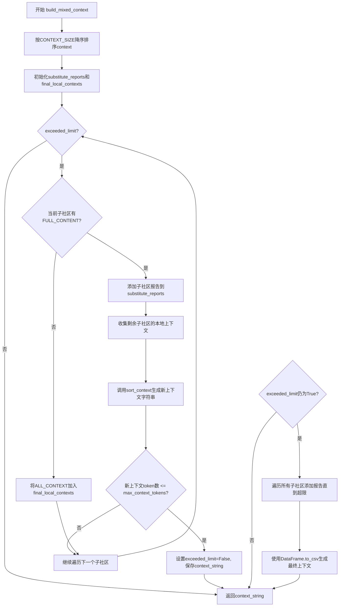
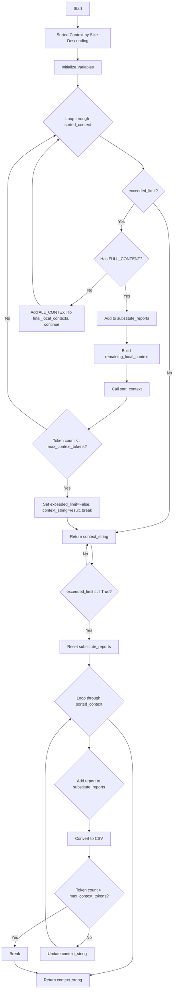

# `graphrag\packages\graphrag\graphrag\index\operations\summarize_communities\build_mixed_context.py` 详细设计文档

该模块实现了build_mixed_context函数，用于在图谱检索增强生成中构建混合上下文。当上下文超过令牌限制时，该函数会使用子社区报告替代本地上下文，通过排序和替换策略优化上下文长度，确保在token限制内提供最有价值的社区信息。

## 整体流程



## 类结构

```
build_mixed_context (函数模块)
└── build_mixed_context (主函数)
    ├── 导入依赖
    │   ├── Tokenizer (graphrag_llm.tokenizer)
    │   ├── schemas (graphrag.data_model.schemas)
    │   ├── sort_context (graphrag.index.operations)
    │   └── pd (pandas)
```

## 全局变量及字段


### `sorted_context`
    
按上下文大小降序排序的子社区上下文列表

类型：`list[dict]`
    


### `substitute_reports`
    
存储子社区报告的列表，用于替换超出限制的上下文

类型：`list[dict]`
    


### `final_local_contexts`
    
最终保留的本地上下文列表

类型：`list`
    


### `exceeded_limit`
    
标记是否超过最大token限制的标志

类型：`bool`
    


### `context_string`
    
最终构建的上下文字符串，用于返回

类型：`str`
    


### `idx`
    
遍历sorted_context时的当前索引

类型：`int`
    


### `sub_community_context`
    
当前处理的子社区上下文字典

类型：`dict`
    


### `remaining_local_context`
    
剩余子社区的本地上下文列表

类型：`list`
    


### `new_context_string`
    
临时构建的上下文字符串，用于检查token限制

类型：`str`
    


### `rid`
    
遍历剩余子社区时的索引

类型：`int`
    


    

## 全局函数及方法


### `build_mixed_context`

构建父级上下文，通过合并所有子社区的上下文来构建。如果上下文超过令牌限制，则使用子社区报告替代。

参数：

- `context`：`list[dict]`，包含子社区上下文的字典列表
- `tokenizer`：`Tokenizer`，用于计算令牌数的分词器实例
- `max_context_tokens`：`int`，允许的最大上下文令牌数

返回值：`str`，构建的上下文字符串（混合了本地上下文和子社区报告，或仅包含CSV格式的子社区报告）

#### 流程图



#### 带注释源码

```python
def build_mixed_context(
    context: list[dict], tokenizer: Tokenizer, max_context_tokens: int
) -> str:
    """
    Build parent context by concatenating all sub-communities' contexts.

    If the context exceeds the limit, we use sub-community reports instead.
    """
    # 按上下文大小降序排序子社区
    sorted_context = sorted(
        context, key=lambda x: x[schemas.CONTEXT_SIZE], reverse=True
    )

    # 初始化变量：从最大的子社区开始，用子社区报告替换本地上下文
    substitute_reports = []
    final_local_contexts = []
    exceeded_limit = True
    context_string = ""

    # 遍历排序后的子社区上下文
    for idx, sub_community_context in enumerate(sorted_context):
        if exceeded_limit:
            # 如果存在完整内容（子社区报告），则添加到替换报告列表
            if sub_community_context[schemas.FULL_CONTENT]:
                substitute_reports.append({
                    schemas.COMMUNITY_ID: sub_community_context[schemas.SUB_COMMUNITY],
                    schemas.FULL_CONTENT: sub_community_context[schemas.FULL_CONTENT],
                })
            else:
                # 该子社区没有报告，使用其本地上下文
                final_local_contexts.extend(sub_community_context[schemas.ALL_CONTEXT])
                continue

            # 为剩余的子社区添加本地上下文
            remaining_local_context = []
            for rid in range(idx + 1, len(sorted_context)):
                remaining_local_context.extend(sorted_context[rid][schemas.ALL_CONTEXT])
            
            # 使用 sort_context 构建新上下文
            new_context_string = sort_context(
                local_context=remaining_local_context + final_local_contexts,
                tokenizer=tokenizer,
                sub_community_reports=substitute_reports,
            )
            
            # 检查新上下文是否在令牌限制内
            if tokenizer.num_tokens(new_context_string) <= max_context_tokens:
                exceeded_limit = False
                context_string = new_context_string
                break

    # 如果所有子社区报告仍超出限制，则添加报告直到上下文满
    if exceeded_limit:
        substitute_reports = []
        for sub_community_context in sorted_context:
            substitute_reports.append({
                schemas.COMMUNITY_ID: sub_community_context[schemas.SUB_COMMUNITY],
                schemas.FULL_CONTENT: sub_community_context[schemas.FULL_CONTENT],
            })
            new_context_string = pd.DataFrame(substitute_reports).to_csv(
                index=False, sep=","
            )
            # 检查是否超出限制，超出则停止添加
            if tokenizer.num_tokens(new_context_string) > max_context_tokens:
                break

            context_string = new_context_string
    return context_string
```

## 关键组件


### build_mixed_context 函数

构建混合上下文的入口函数，通过排序子社区上下文并智能替换为子社区报告来控制在token限制内的上下文构建

### sort_context 调用

使用排序上下文模块将本地上下文与子社区报告合并，并确保总token数不超过最大限制

### 上下文大小索引与排序

使用 schemas.CONTEXT_SIZE 作为排序键，按上下文大小降序排列子社区，确保优先处理最大的子社区

### 子社区报告替换策略

当上下文超过限制时，使用子社区的 FULL_CONTENT（完整报告）替代 ALL_CONTEXT（本地上下文），以减少token使用量

### 惰性加载机制

仅在 exceeded_limit 为 True 时才处理子社区报告，避免不必要的计算

### schemas 常量引用

使用图谱数据模型中的标准schema定义（CONTEXT_SIZE, FULL_CONTENT, SUB_COMMUNITY, ALL_CONTEXT, COMMUNITY_ID）来访问数据结构


## 问题及建议


### 已知问题

-   **算法时间复杂度高**：存在嵌套循环，外层遍历子社区，内层在每次迭代中遍历剩余子社区构建`remaining_local_context`，最坏情况时间复杂度为O(n²)，当子社区数量较多时性能下降明显。
-   **重复计算问题**：在第一个循环中每次检查token限制时都调用`sort_context`函数，该函数可能涉及复杂计算，存在重复调用的性能浪费。
-   **逻辑重复**：两个地方使用了相似的逻辑构建`substitute_reports`列表（第一个循环和第二个if分支），代码重复违背了DRY原则。
-   **边界条件风险**：如果`max_context_tokens`设置过小（如小于一个报告的token数），第二个循环可能陷入死循环或返回空字符串。
-   **空值处理缺失**：没有检查`context`是否为空列表、`tokenizer`是否为None、以及`schemas`中定义的键是否存在，运行时可能抛出KeyError或TypeError。
-   **过度使用pandas**：仅为了将字典列表转换为CSV字符串就引入pandas依赖，对于简单的数据结构转换来说过于重量级，增加了内存开销和启动时间。
-   **变量职责不清晰**：`exceeded_limit`变量既用于控制循环又用于最终判断，职责过多，可读性较差。

### 优化建议

-   **优化循环逻辑**：预先计算每个子社区的local_context总和，避免在每次迭代中重复遍历，使用前缀和或一次遍历完成所有local_context的收集。
-   **抽取重复逻辑**：将构建`substitute_reports`的逻辑抽取为独立函数，减少代码重复。
-   **添加输入验证**：在函数入口添加参数校验，检查context、tokenizer非空，以及max_context_tokens为正整数。
-   **简化依赖**：考虑使用标准库如`csv`模块替代pandas进行CSV转换，减少外部依赖。
-   **函数拆分**：将排序、构建报告、限制检查等逻辑拆分为独立函数，每个函数职责单一，提高可测试性和可维护性。
-   **增加文档注释**：为复杂逻辑块添加更详细的注释，说明替换策略的意图和边界条件。

## 其它


### 设计目标与约束

该函数旨在解决图谱检索中的上下文长度限制问题，通过智能替换策略在子社区报告和本地上下文之间取得平衡。约束条件包括：输入的context必须包含特定schema字段（CONTEXT_SIZE、SUB_COMMUNITY、FULL_CONTENT、ALL_CONTEXT），tokenizer必须实现num_tokens方法，上下文结果不能超过max_context_tokens指定的最大token数。

### 错误处理与异常设计

函数未包含显式的异常处理逻辑。潜在的异常场景包括：1) 输入context列表为空时返回空字符串；2) 当所有子社区都没有FULL_CONTENT且本地上下文也超出限制时，可能返回空字符串；3) tokenizer.num_tokens()方法抛出异常时会导致调用失败。建议添加空值检查、默认值处理和异常捕获机制。

### 数据流与状态机

函数内部维护三种状态：exceeded_limit状态控制是否需要进行上下文替换，substitute_reports存储待替换的报告列表，final_local_contexts存储最终保留的本地上下文。数据流为：输入context → 按CONTEXT_SIZE降序排序 → 迭代尝试构建有效上下文 → 如果成功则退出循环 → 如果全部失败则回退到纯报告模式。

### 外部依赖与接口契约

主要依赖包括：1) pandas库（用于DataFrame.to_csv转换报告）；2) Tokenizer抽象类（需实现num_tokens方法）；3) schemas模块（定义CONTEXT_SIZE、SUB_COMMUNITY、FULL_CONTENT、ALL_CONTEXT等常量）；4) sort_context函数（来自graphrag.index.operations.summarize_communities.graph_context.sort_context）。调用方需确保传入的context列表中每个元素都是包含必要schema字段的字典。

### 性能考虑

时间复杂度为O(n² log n)，主要开销在于双重循环遍历子社区以及每次迭代调用sort_context和tokenizer.num_tokens。优化方向包括：1) 预计算token数量避免重复计算；2) 使用增量式token计数而非每次重新计算整个字符串；3) 考虑使用二分查找确定最佳替换点。

### 安全性考虑

函数本身不涉及用户输入处理或敏感数据操作，但需要注意：1) 传入的context数据源需保证可信；2) sort_context函数内部实现需确保无注入风险；3) to_csv生成的CSV格式需防范特殊字符导致的内容篡改。

### 可扩展性

当前实现仅支持两种替换策略（报告替换或纯报告模式）。未来可扩展方向包括：1) 支持自定义替换策略接口；2) 支持多种输出格式（JSON、XML等）；3) 支持多级混合上下文构建；4) 支持缓存机制避免重复计算。

### 使用示例

```python
from graphrag_llm.tokenizer import Tokenizer
from graphrag.data_model import schemas

# 示例context输入
context = [
    {
        schemas.SUB_COMMUNITY: "community_1",
        schemas.CONTEXT_SIZE: 1000,
        schemas.FULL_CONTENT: "Report content for community 1...",
        schemas.ALL_CONTEXT: ["context1", "context2"]
    },
    {
        schemas.SUB_COMMUNITY: "community_2",
        schemas.CONTEXT_SIZE: 500,
        schemas.FULL_CONTENT: None,
        schemas.ALL_CONTEXT: ["context3", "context4"]
    }
]

# 调用示例
result = build_mixed_context(context, tokenizer, max_context_tokens=2000)
```

### 配置参数说明

| 参数名 | 类型 | 必填 | 说明 |
|--------|------|------|------|
| context | list[dict] | 是 | 包含子社区上下文的字典列表，每个字典需包含SUB_COMMUNITY、CONTEXT_SIZE、FULL_CONTENT、ALL_CONTEXT字段 |
| tokenizer | Tokenizer | 是 | 分词器对象，需实现num_tokens(str) -> int方法 |
| max_context_tokens | int | 是 | 允许的最大token数量，超出此限制将触发上下文替换逻辑 |

### 边界条件处理

1. 空context列表：返回空字符串
2. 所有子社区均无FULL_CONTENT且本地上下文超出限制：返回空字符串
3. max_context_tokens为0或负数：直接返回空字符串
4. tokenizer.num_tokens返回异常值（如负数）：可能导致逻辑错误

### 测试建议

应覆盖的测试场景：1) 正常场景下成功构建混合上下文；2) 空输入边界条件；3) 超出限制时的报告替换逻辑；4) 全部使用报告仍超出限制的回退逻辑；5) tokenizer性能对整体函数的影响；6) context中缺少必要字段时的容错性。

### 架构位置

该函数位于graphrag项目的索引模块中，负责将图谱检索结果转换为适合大语言模型消费的文本格式。是图谱问答流程中的关键数据预处理组件，连接社区发现模块与prompt构建模块。


    