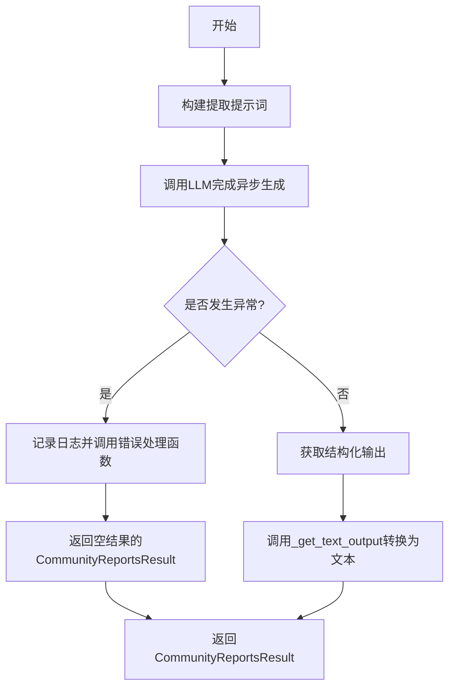
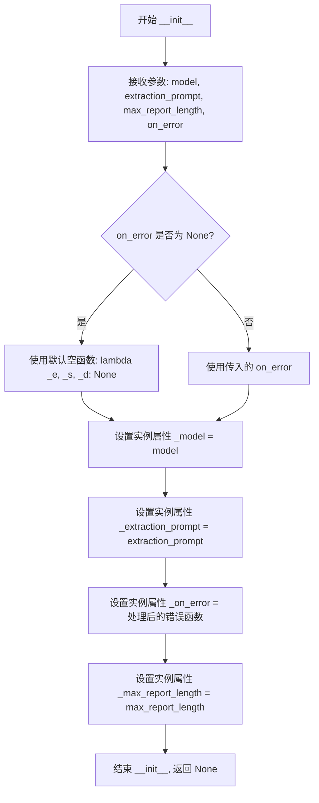
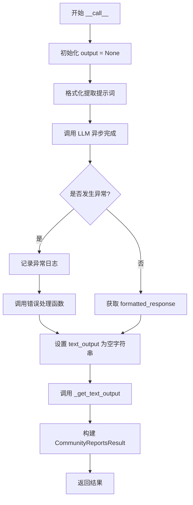
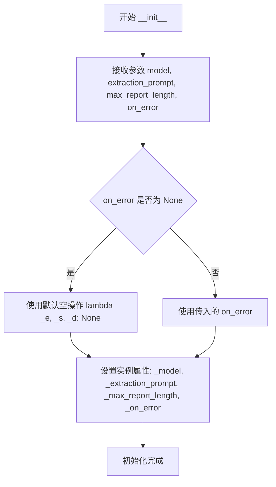
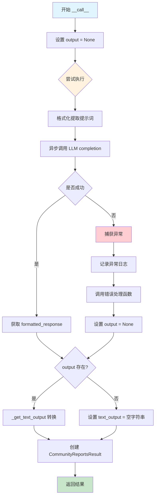

# `graphrag\packages\graphrag\graphrag\index\operations\summarize_communities\community_reports_extractor.py` 详细设计文档

这是一个社区报告提取模块，通过调用大语言模型(LLM)将输入文本转换为结构化的社区报告，包含标题、摘要、发现结果、评级等信息，并提供错误处理机制。

## 整体流程



## 类结构

```
FindingModel (Pydantic BaseModel)
├── summary: str
└── explanation: str

CommunityReportResponse (Pydantic BaseModel)
├── title: str
├── summary: str
├── findings: list[FindingModel]
├── rating: float
└── rating_explanation: str

CommunityReportsResult (dataclass)
├── output: str
└── structured_output: CommunityReportResponse | None

CommunityReportsExtractor
├── _model: LLMCompletion
├── _extraction_prompt: str
├── _output_formatter_prompt: str
├── _on_error: ErrorHandlerFn
├── _max_report_length: int
├── __init__()
├── __call__(input_text: str)
└── _get_text_output(report: CommunityReportResponse) -> str
```

## 全局变量及字段


### `INPUT_TEXT_KEY`
    
输入文本的键名常量

类型：`str`
    


### `MAX_LENGTH_KEY`
    
最大报告长度的键名常量

类型：`str`
    


### `logger`
    
模块级日志记录器

类型：`logging.Logger`
    


### `FindingModel.summary`
    
发现结果的摘要

类型：`str`
    


### `FindingModel.explanation`
    
发现结果的解释说明

类型：`str`
    


### `CommunityReportResponse.title`
    
报告的标题

类型：`str`
    


### `CommunityReportResponse.summary`
    
报告的摘要

类型：`str`
    


### `CommunityReportResponse.findings`
    
发现结果列表

类型：`list[FindingModel]`
    


### `CommunityReportResponse.rating`
    
报告的评级

类型：`float`
    


### `CommunityReportResponse.rating_explanation`
    
评级解释

类型：`str`
    


### `CommunityReportsResult.output`
    
文本格式的输出

类型：`str`
    


### `CommunityReportsResult.structured_output`
    
结构化输出对象

类型：`CommunityReportResponse | None`
    


### `CommunityReportsExtractor._model`
    
LLM模型实例

类型：`LLMCompletion`
    


### `CommunityReportsExtractor._extraction_prompt`
    
提取提示词模板

类型：`str`
    


### `CommunityReportsExtractor._output_formatter_prompt`
    
输出格式化提示词

类型：`str`
    


### `CommunityReportsExtractor._on_error`
    
错误处理回调函数

类型：`ErrorHandlerFn`
    


### `CommunityReportsExtractor._max_report_length`
    
最大报告长度

类型：`int`
    
    

## 全局函数及方法


### `CommunityReportsExtractor.__init__`

社区报告提取器的初始化方法，用于接收并配置LLM模型、提取提示模板、最大报告长度以及可选的错误处理函数，将这些参数存储为实例属性供后续调用时使用。

参数：

- `model`：`LLMCompletion`，执行社区报告生成的LLMCompletion实例
- `extraction_prompt`：`str`，用于指导LLM提取社区报告内容的提示模板字符串
- `max_report_length`：`int`，生成社区报告的最大长度限制
- `on_error`：`ErrorHandlerFn | None`，可选的错误处理回调函数，当发生异常时调用，默认为None

返回值：无（`None`），该方法为构造函数，仅初始化实例状态不返回值

#### 流程图



#### 带注释源码

```python
def __init__(
    self,
    model: "LLMCompletion",          # LLMCompletion实例，用于调用大语言模型生成社区报告
    extraction_prompt: str,          # 格式化字符串模板，包含输入文本和最大长度的占位符
    max_report_length: int,          # 整数类型，限制生成报告的最大字符长度
    on_error: ErrorHandlerFn | None = None,  # 可选的错误处理函数，默认为None
):
    """Init method definition."""
    # 将传入的LLM模型赋值给实例属性
    self._model = model
    
    # 将提取提示模板赋值给实例属性，供后续__call__方法格式化使用
    self._extraction_prompt = extraction_prompt
    
    # 如果提供了错误处理函数则使用，否则使用默认的空操作函数
    # 默认函数接受错误、堆栈跟踪和数据三个参数但不做任何处理
    self._on_error = on_error or (lambda _e, _s, _d: None)
    
    # 将最大报告长度限制赋值给实例属性
    self._max_report_length = max_report_length
```


### `CommunityReportsExtractor.__call__`

这是一个异步调用方法，用于从输入文本中提取社区报告。它接收原始文本，通过 LLM 进行处理，生成结构化的社区报告响应，并将其转换为文本格式返回。

参数：

- `input_text`：`str`，待提取社区报告的原始输入文本

返回值：`CommunityReportsResult`，包含结构化输出（`CommunityReportResponse`）和文本格式输出的结果对象

#### 流程图



#### 带注释源码

```python
async def __call__(self, input_text: str):
    """Call method definition."""
    output = None  # 初始化输出为 None
    try:
        # 使用输入文本和最大报告长度格式化提取提示词
        prompt = self._extraction_prompt.format(**{
            INPUT_TEXT_KEY: input_text,
            MAX_LENGTH_KEY: str(self._max_report_length),
        })
        # 异步调用 LLM 生成社区报告响应
        response = await self._model.completion_async(
            messages=prompt,
            response_format=CommunityReportResponse,  # 使用 JSON 模式时需要指定模型
        )

        # 获取格式化的响应结果
        output = response.formatted_response  # type: ignore
    except Exception as e:
        # 记录异常日志
        logger.exception("error generating community report")
        # 调用错误处理回调函数
        self._on_error(e, traceback.format_exc(), None)

    # 如果有输出则转换为文本格式，否则使用空字符串
    text_output = self._get_text_output(output) if output else ""
    # 返回包含结构化输出和文本输出的结果对象
    return CommunityReportsResult(
        structured_output=output,
        output=text_output,
    )
```


### `CommunityReportsExtractor._get_text_output`

将结构化的社区报告（CommunityReportResponse）转换为Markdown文本格式，通过遍历报告发现项并拼接成完整的文本输出。

参数：

- `report`：`CommunityReportResponse`，包含标题、摘要和发现项列表的结构化报告对象

返回值：`str`，格式化后的Markdown文本字符串，包含标题、摘要和各发现项的详细说明

#### 流程图

```mermaid
flowchart TD
    A[开始 _get_text_output] --> B[接收 report 参数<br/>类型: CommunityReportResponse]
    B --> C[遍历 report.findings 列表]
    C --> D{还有未处理的 finding?}
    D -->|是| E[格式化当前 finding<br/>## {summary}\n\n{explanation}]
    E --> F[将格式化字符串加入列表]
    F --> C
    D -->|否| G[用 \n\n 连接所有 section]
    G --> H[构建最终输出字符串<br/># {title}\n\n{summary}\n\n{sections}]
    H --> I[返回格式化文本]
    I --> J[结束]
```

#### 带注释源码

```python
def _get_text_output(self, report: CommunityReportResponse) -> str:
    """
    将结构化社区报告转换为Markdown文本格式
    
    Args:
        report: CommunityReportResponse对象，包含title、summary和findings字段
        
    Returns:
        格式化的Markdown文本字符串
    """
    # 遍历报告中的所有发现项，将每个发现格式化为Markdown标题和内容
    # 格式: "## {summary}\n\n{explanation}"
    report_sections = "\n\n".join(
        f"## {f.summary}\n\n{f.explanation}" for f in report.findings
    )
    
    # 拼接最终输出字符串，包含:
    # - 报告标题 (一级标题)
    # - 报告摘要
    # - 所有发现项的详细内容 (二级标题形式)
    return f"# {report.title}\n\n{report.summary}\n\n{report_sections}"
```


### CommunityReportsExtractor.__init__

初始化社区报告提取器，设置LLM模型、提取提示词、最大报告长度以及可选的错误处理函数。

参数：

- `model`：`LLMCompletion`，用于生成社区报告的LLM模型实例
- `extraction_prompt`：`str`，用于提取社区报告内容的提示词模板
- `max_report_length`：`int`，生成报告的最大长度限制
- `on_error`：`ErrorHandlerFn | None`，可选的错误处理回调函数，默认为空操作

返回值：`None`，无返回值（`__init__` 方法）

#### 流程图



#### 带注释源码

```python
def __init__(
    self,
    model: "LLMCompletion",          # LLM模型实例，用于生成社区报告
    extraction_prompt: str,          # 提取提示词模板，包含输入文本和最大长度的占位符
    max_report_length: int,           # 最大报告长度，限制生成报告的篇幅
    on_error: ErrorHandlerFn | None = None,  # 可选的错误处理函数，默认为None
):
    """Init method definition."""
    # 设置LLM模型实例
    self._model = model
    
    # 设置提取提示词模板
    self._extraction_prompt = extraction_prompt
    
    # 设置错误处理函数：如果传入则为传入的函数，否则使用默认的空操作lambda
    # 该lambda接受错误、堆栈跟踪和额外数据三个参数，但不做任何处理
    self._on_error = on_error or (lambda _e, _s, _d: None)
    
    # 设置最大报告长度限制
    self._max_report_length = max_report_length
```


### `CommunityReportsExtractor.__call__`

这是一个异步调用方法，执行社区报告提取的核心逻辑。它接收输入文本，通过 LLM 进行处理，将结构化响应转换为文本格式，并返回包含结构化输出和文本输出的结果对象。

参数：

- `input_text`：`str`，需要提取社区报告的输入文本内容

返回值：`CommunityReportsResult`，包含结构化的报告响应（`CommunityReportResponse`）和格式化的纯文本报告内容

#### 流程图



#### 带注释源码

```python
async def __call__(self, input_text: str):
    """Call method definition."""
    # 初始化输出变量为 None，用于后续判断是否成功获取响应
    output = None
    try:
        # 使用格式化字符串构建提示词，填入输入文本和最大报告长度
        prompt = self._extraction_prompt.format(**{
            INPUT_TEXT_KEY: input_text,
            MAX_LENGTH_KEY: str(self._max_report_length),
        })
        
        # 异步调用 LLM 完成生成，传入提示词和期望的响应格式模型
        # response_format 指定了 CommunityReportResponse 作为 JSON 解析模型
        response = await self._model.completion_async(
            messages=prompt,
            response_format=CommunityReportResponse,  # A model is required when using json mode
        )

        # 从响应中获取格式化后的结构化输出
        output = response.formatted_response  # type: ignore
        
    except Exception as e:
        # 捕获所有异常，记录完整的堆栈跟踪信息
        logger.exception("error generating community report")
        # 调用错误处理回调函数，传入异常、堆栈跟踪和上下文数据
        self._on_error(e, traceback.format_exc(), None)

    # 如果有输出，则转换为文本格式；否则使用空字符串
    text_output = self._get_text_output(output) if output else ""
    
    # 返回包含结构化输出和文本输出的结果对象
    return CommunityReportsResult(
        structured_output=output,
        output=text_output,
    )
```


### `CommunityReportsExtractor._get_text_output`

将结构化的社区报告响应对象转换为格式化的 Markdown 文本，包含标题、摘要和所有发现项的详细章节。

参数：

- `report`：`CommunityReportResponse`，需要进行文本转换的结构化社区报告响应对象，包含标题、摘要和发现列表

返回值：`str`，返回格式化的 Markdown 文本字符串，包含报告标题、摘要以及各发现项的章节

#### 流程图

```mermaid
flowchart TD
    A[开始 _get_text_output] --> B[接收 report 参数]
    B --> C{report.findings 是否为空}
    C -->|是| D[report_sections = 空字符串]
    C -->|否| E[遍历 report.findings]
    E --> F[对每个 finding 生成 Markdown 章节]
    F --> G[格式: ## {summary}\n\n{explanation}]
    G --> H[使用换行符连接所有章节]
    H --> I[构建最终输出字符串]
    I --> J[格式: # {title}\n\n{summary}\n\n{report_sections}]
    J --> K[返回 Markdown 文本]
    D --> K
```

#### 带注释源码

```python
def _get_text_output(self, report: CommunityReportResponse) -> str:
    """
    将结构化报告转换为 Markdown 文本格式。
    
    该方法遍历报告的所有发现项，将每个发现项的摘要和解释格式化为
    Markdown 二级标题和段落，然后与报告标题和摘要一起组合成完整的
    Markdown 文档。
    
    Args:
        report: CommunityReportResponse 对象，包含结构化的社区报告数据
        
    Returns:
        str: 格式化的 Markdown 文本字符串
    """
    
    # 遍历报告的所有发现项，为每个发现项创建 Markdown 章节
    # 每个章节格式为: ## 摘要 \n\n 解释
    # 使用两个换行符连接各章节
    report_sections = "\n\n".join(
        f"## {f.summary}\n\n{f.explanation}" for f in report.findings
    )
    
    # 构建最终的 Markdown 文档，包含：
    # 1. # 一级标题（报告标题）
    # 2. 报告摘要
    # 3. 所有发现项章节
    return f"# {report.title}\n\n{report.summary}\n\n{report_sections}"
```

## 关键组件


### FindingModel

一个Pydantic数据模型，用于定义LLM返回的"发现"（finding）结构，包含摘要(summary)和解释(explanation)两个字段，用于描述从文本中提取的具体发现内容。

### CommunityReportResponse

一个Pydantic数据模型，用于定义社区报告的完整响应结构，包含标题(title)、摘要(summary)、发现列表(findings)、评分(rating)和评分说明(rating_explanation)，是LLM期望返回的JSON格式。

### CommunityReportsResult

一个数据类，用于封装提取操作的最终结果，包含原始文本输出(output)和结构化输出(structured_output)两个属性，其中结构化输出为CommunityReportResponse类型或None。

### CommunityReportsExtractor

社区报告提取器类，负责协调LLM调用和输出格式化。核心方法为异步__call__，接收输入文本，调用LLM生成结构化报告，并处理错误。内部_get_text_output方法将结构化报告转换为Markdown格式的文本输出。

### INPUT_TEXT_KEY & MAX_LENGTH_KEY

两个全局常量字符串，分别作为提示词模板中的输入文本键和最大报告长度键，用于格式化提取提示词。

### ErrorHandlerFn

从graphrag.index.typing.error_handler模块导入的错误处理函数类型，作为社区报告提取器的错误回调机制。

### LLMCompletion

从graphrag_llm.completion模块导入的LLMCompletion类型，代表底层大型语言模型的接口，用于异步调用完成生成。


## 问题及建议


### 已知问题

- **异常处理过于宽泛**：在 `__call__` 方法中使用 `except Exception as e` 捕获所有异常，包括不应该被捕获的 `KeyboardInterrupt` 和 `SystemExit`，这可能导致程序在遇到严重错误时无法正常退出
- **类型注解不完整**：第75行 `response.formatted_response` 使用了 `# type: ignore`，说明存在类型不确定的问题；`prompt` 变量的类型未明确标注
- **字符串格式化方式过时**：使用 `.format()` 方法进行字符串格式化，而非更现代的 f-string 或 Pydantic 的模型构建方式
- **硬编码的错误处理默认值**：错误处理函数默认为空 lambda 表达式 `lambda _e, _s, _d: None`，可能导致错误被静默忽略，难以追踪问题根源
- **缺乏重试机制**：LLM 调用失败时没有重试逻辑，如果网络波动或 LLM 服务临时不可用，会直接返回空结果
- **数据类未充分利用**：`CommunityReportsResult` 使用 `@dataclass` 但未定义任何方法，可考虑使用 Pydantic 的 BaseModel 替代以获得更好的验证和序列化能力

### 优化建议

- 考虑使用 `exceptiongroup` 或更具体的异常类型（如 `IOError`, `ValueError`）替代宽泛的 `Exception`，或至少排除系统异常
- 完善类型注解，移除 `# type: ignore`，确保 `formatted_response` 的类型安全
- 引入重试机制（可使用 `tenacity` 库或自定义重试逻辑）以提高 LLM 调用的可靠性
- 将默认的错误处理函数改为更合理的默认行为，如记录警告或抛出特定异常
- 考虑使用 Pydantic 的 `BaseModel` 替代 `dataclass`，以获得内置的验证和 JSON 序列化能力
- 添加超时机制防止 LLM 调用无限等待

## 其它


### 设计目标与约束

本模块的设计目标是从输入文本中提取结构化的社区报告，通过LLM生成包含标题、摘要、发现、评分及其解释的完整报告。约束包括：1) 依赖LLMCompletion接口进行异步调用；2) 必须使用pydantic模型进行响应格式化；3) 错误处理采用回调机制而非抛出异常；4) 报告长度受_max_report_length参数限制。

### 错误处理与异常设计

模块采用静默错误处理模式：1) 在__call__方法中使用try-except捕获所有Exception；2) 错误发生时记录完整堆栈跟踪到logger.exception；3) 通过_on_error回调函数传递错误信息、堆栈和上下文数据；4) 返回空文本输出而非抛出异常，保持调用链的稳定性。潜在改进：可增加重试机制、错误类型细分、以及可选的失败fast-path。

### 数据流与状态机

数据流如下：输入文本 -> 格式化提示词 -> LLM异步调用 -> pydantic模型验证 -> 响应转换为结构化对象 -> 转换为Markdown文本 -> 返回CommunityReportsResult。无复杂状态机，仅包含初始处理中（pending）-> 成功/失败 -> 结果返回的单一线性状态。

### 外部依赖与接口契约

1) LLMCompletion接口：必须实现completion_async方法，接受messages和response_format参数，返回包含formatted_response的对象；2) ErrorHandlerFn类型：签名为(error: Exception, traceback: str, context: Any) -> None的回调函数；3) pydantic BaseModel：用于响应验证和类型转换；4) logging模块：用于错误日志记录。

### 性能考虑与优化空间

当前实现的主要性能特征：1) 纯异步设计，支持并发调用；2) 无内置缓存机制，重复输入会重复调用LLM；3) 字符串格式化使用f-string和join，效率尚可。优化建议：1) 可增加输入哈希缓存避免重复LLM调用；2) _get_text_output方法可在LLM响应后并行处理；3) 可添加超时控制防止LLM调用无限等待。

### 安全性考虑

1) LLM提示词格式化使用dict.format，存在提示词注入风险，建议对input_text进行转义处理；2) 无输入长度验证，可能导致超长输入；3) 敏感信息通过日志记录需注意脱敏；4) response_format参数信任LLM返回的JSON结构，pydantic验证可防止部分安全问题。

### 配置参数说明

核心配置参数：1) model: LLMCompletion实例，必填；2) extraction_prompt: 格式化字符串模板，必填，需包含{input_text}和{max_report_length}占位符；3) max_report_length: 整数值，限制生成报告的最大长度；4) on_error: ErrorHandlerFn，可选，默认静默忽略错误。

### 单元测试策略建议

测试应覆盖：1) 正常流程：给定输入文本，验证返回的CommunityReportsResult包含正确的structured_output和output；2) 错误处理：模拟LLM抛出异常，验证_on_error被调用且返回空输出；3) 文本格式化：验证_get_text_output正确生成Markdown格式；4) 参数验证：验证max_report_length正确传递到提示词；5) 异步测试：使用pytest-asyncio进行异步方法测试。

### 并发与线程安全

1) CommunityReportsExtractor实例本身无共享状态，线程安全；2) 每次__call__调用独立，无状态污染；3) LLMCompletion的completion_async方法应由调用方保证并发安全；4) logger对象是进程级别共享，但logging模块本身线程安全。

### 可观测性与监控

1) 错误日志使用logger.exception自动记录完整堆栈；2) 成功路径无日志记录，建议添加info级别日志用于追踪；3) 可增加metrics埋点记录LLM调用延迟、成功率等指标；4) _on_error回调可用于集成外部监控系统。

    