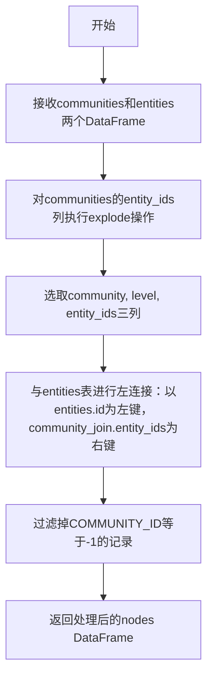
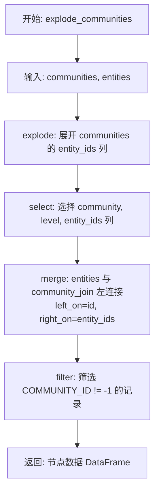
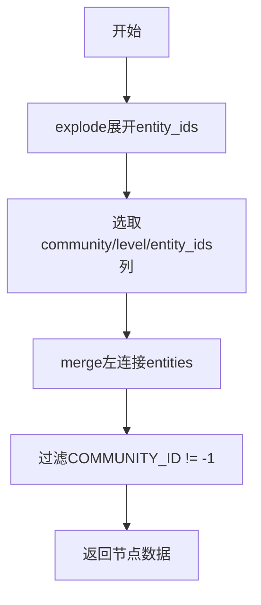

# `graphrag\packages\graphrag\graphrag\index\operations\summarize_communities\explode_communities.py` 详细设计文档

该代码实现了一个数据处理函数，通过展开社区列表中的entity_ids并与实体表进行左连接，将社区信息映射到实体节点上，同时过滤掉社区ID为-1的无效记录，生成可用于过滤的节点数据。

## 整体流程



## 类结构

```
该文件为模块级函数，不包含类定义
```

## 全局变量及字段


### `communities`
    
输入参数，包含社区信息的数据框，包含 entity_ids 等列

类型：`pd.DataFrame`
    


### `entities`
    
输入参数，包含实体信息的数据框，包含 id 等列用于关联

类型：`pd.DataFrame`
    


### `community_join`
    
中间变量，展开 entity_ids 后的社区数据，用于与实体进行合并

类型：`pd.DataFrame`
    


### `nodes`
    
中间变量，实体与社区合并后的节点数据，尚未过滤

类型：`pd.DataFrame`
    


### `COMMUNITY_ID`
    
从 graphrag.data_model.schemas 导入的常量，用于标识社区 ID 列名

类型：`Any`
    


    

## 全局函数及方法


### `explode_communities`

将社区数据与实体数据进行关联展开，生成可用于过滤的节点列表。该函数通过展开社区中的实体ID列表，并与实体表进行左连接，最终过滤掉未分配社区（COMMUNITY_ID=-1）的记录，得到带有社区信息的实体节点。

参数：

- `communities`：`pd.DataFrame`，包含社区信息的数据框，必须包含 "community"、"level" 和 "entity_ids" 列，其中 "entity_ids" 为列表类型
- `entities`：`pd.DataFrame`，包含实体信息的数据框，必须包含 "id" 列用于关联

返回值：`pd.DataFrame`，返回包含社区信息的实体节点数据，筛选掉了未分配社区（COMMUNITY_ID=-1）的记录

#### 流程图



#### 带注释源码

```python
def explode_communities(
    communities: pd.DataFrame, entities: pd.DataFrame
) -> pd.DataFrame:
    """Explode a list of communities into nodes for filtering."""
    # 第一步：展开 communities DataFrame 的 entity_ids 列
    # 将列表格式的 entity_ids 展开为多行，每个实体ID对应一行
    community_join = communities.explode("entity_ids").loc[
        :, ["community", "level", "entity_ids"]
    ]
    
    # 第二步：左连接 entities 和 community_join
    # 以实体的 id 列与社区中的 entity_ids 列进行关联
    # how='left' 保留所有实体，即使某些实体没有关联的社区
    nodes = entities.merge(
        community_join, left_on="id", right_on="entity_ids", how="left"
    )
    
    # 第三步：过滤掉未分配社区的记录
    # COMMUNITY_ID = -1 表示该实体没有关联的社区
    # 只返回有关联社区的实体节点
    return nodes.loc[nodes.loc[:, COMMUNITY_ID] != -1]
```

---

#### 关键组件信息

| 组件名称 | 描述 |
|---------|------|
| `COMMUNITY_ID` | 全局常量，从 `graphrag.data_model.schemas` 导入，用于标识社区ID列 |
| `pd.DataFrame.explode()` | Pandas 方法，将列表类型的列展开为多行 |
| `pd.DataFrame.merge()` | Pandas 方法，用于数据表关联 |

---

#### 潜在的技术债务或优化空间

1. **缺少输入验证**：函数未对输入数据的结构和必填列进行验证，可能在运行时产生难以定位的错误
2. **魔法数字 `-1`**：硬编码的 `-1` 用于表示无社区，建议提取为常量以提高可读性
3. **返回列不明确**：函数返回的列依赖于输入数据，建议明确指定返回的列或添加文档说明
4. **性能考虑**：对于大规模数据，左连接操作可能产生性能瓶颈，可考虑优化或添加缓存机制

---

#### 其它项目

**设计目标与约束**：
- 将社区-实体多对多关系展开为可过滤的节点列表
- 过滤掉"无社区"（COMMUNITY_ID=-1）的实体记录
- 输入的 `entities` DataFrame 必须包含 "id" 列
- 输入的 `communities` DataFrame 必须包含 "entity_ids" 列（列表类型）

**错误处理与异常设计**：
- 缺少显式的异常处理机制
- 若缺少必要的列（如 "entity_ids"、"id"），Pandas 会抛出 KeyError
- 若 `entity_ids` 列不是列表类型，`explode()` 操作可能产生意外结果

**数据流与状态机**：
- 数据流：communities (多对多) → explode (展开) → 左连接 entities → 过滤无效社区 → 输出节点列表
- 状态转换：原始社区数据 → 展开后的社区列表 → 关联实体 → 最终节点

**外部依赖与接口契约**：
- 依赖 `pandas` 库
- 依赖内部模块 `graphrag.data_model.schemas` 中的 `COMMUNITY_ID` 常量
- 输入输出的 DataFrame 结构由调用方控制，函数本身不保证数据完整性

## 关键组件


# 代码概述

这段代码实现了一个社区节点展开过滤功能，通过将社区数据集中的 entity_ids 字段展开为多行记录，然后与实体数据集进行左连接，最后过滤掉社区ID为-1的记录，生成可用于过滤的节点数据。

## 文件运行流程

1. 使用 pandas 的 `explode` 方法将 communities DataFrame 中的 "entity_ids" 列展开为多行
2. 选取需要的列：community、level、entity_ids
3. 使用 merge 方法将 entities 和展开后的 community_join 进行左连接，基于 entities 的 id 列和 community_join 的 entity_ids 列
4. 过滤掉 COMMUNITY_ID 值为 -1 的行
5. 返回过滤后的节点数据

## 全局函数详细信息

### explode_communities

- **名称**: explode_communities
- **参数名称**: communities, entities
- **参数类型**: pd.DataFrame, pd.DataFrame
- **参数描述**: communities 包含社区信息及其关联的实体ID列表，entities 包含实体信息
- **返回值类型**: pd.DataFrame
- **返回值描述**: 过滤后的节点数据，包含属于有效社区的实体节点
- **流程图**: 



- **带注释源码**:

```python
def explode_communities(
    communities: pd.DataFrame, entities: pd.DataFrame
) -> pd.DataFrame:
    """Explode a list of communities into nodes for filtering."""
    # 使用explode方法将entity_ids列表展开为多行，每行对应一个实体
    community_join = communities.explode("entity_ids").loc[
        :, ["community", "level", "entity_ids"]
    ]
    # 将entities与展开后的community_join进行左连接，通过id和entity_ids匹配
    nodes = entities.merge(
        community_join, left_on="id", right_on="entity_ids", how="left"
    )
    # 过滤掉community_id为-1的记录（表示不属于任何有效社区）
    return nodes.loc[nodes.loc[:, COMMUNITY_ID] != -1]
```

## 关键组件信息

### pandas DataFrame explode

将列表类型的列展开为多行，是本函数实现社区-实体关系展开的核心操作

### pandas DataFrame merge

实现实体与社区数据的关联，通过左连接确保保留所有实体记录

### COMMUNITY_ID 常量

从 graphrag.data_model.schemas 导入，用于标识社区ID并过滤无效社区记录

## 潜在的技术债务或优化空间

1. **缺少输入数据验证**: 未对 communities 和 entities 的必需列进行校验
2. **缺少空值处理**: 未处理空 DataFrame 或空列表的情况
3. **性能优化空间**: 对于大规模数据，可考虑使用索引加速 merge 操作
4. **可测试性**: 缺少单元测试覆盖
5. **可观测性**: 缺少日志记录，难以追踪执行过程

## 其它项目

### 设计目标与约束

- **设计目标**: 将社区-实体多对多关系转换为可用于过滤的节点数据集
- **约束**: 依赖 pandas 库和预定义的 COMMUNITY_ID 常量

### 错误处理与异常设计

- 未处理 communities 或 entities 为空的情况
- 未处理缺少必需列（entity_ids、id、COMMUNITY_ID）的情况
- 未处理 entity_ids 为空列表或 None 的情况

### 数据流与状态机

- 输入：社区数据（包含 entity_ids 列表）、实体数据
- 处理：展开 → 选取列 → 关联 → 过滤
- 输出：过滤后的节点数据

### 外部依赖与接口契约

- **依赖**: pandas 库、graphrag.data_model.schemas.COMMUNITY_ID
- **输入接口**: communities (pd.DataFrame), entities (pd.DataFrame)
- **输出接口**: pd.DataFrame，包含社区级别的实体节点


## 问题及建议


### 已知问题

-   **硬编码列名**：代码中直接使用字符串 `"entity_ids"`, `"community"`, `"level"`，这些列名应该从schema模块导入或定义为常量，以提高可维护性和避免拼写错误
-   **魔法数字**：`-1` 作为社区ID的过滤值被硬编码，应该定义为常量（如 `INVALID_COMMUNITY_ID`）以提高代码可读性
-   **缺少输入验证**：函数没有对输入的 `communities` 和 `entities` DataFrame 进行有效性检查，可能导致运行时错误
-   **缺少类型注解**：函数参数和返回值都缺少类型注解，不利于静态分析和IDE支持
-   **多次使用 .loc**：代码中连续使用 `.loc` 进行切片和过滤，效率较低且代码可读性不佳
-   **merge后未处理空值**：如果 merge 操作没有匹配结果，可能返回空 DataFrame，但函数没有相应的处理逻辑
-   **缺少错误处理**：没有 try-except 块处理可能的异常情况（如列不存在、类型错误等）
-   **文档字符串不完整**：只有一句话描述，缺少参数说明、返回值说明和异常说明

### 优化建议

-   从 `graphrag.data_model.schemas` 导入更多相关常量（如 `ENTITY_IDS`, `COMMUNITY`, `LEVEL`）替代硬编码字符串
-   在模块顶部定义常量 `INVALID_COMMUNITY_ID = -1` 替代魔法数字
-   添加函数类型注解：`def explode_communities(communities: pd.DataFrame, entities: pd.DataFrame) -> pd.DataFrame:`
-   在函数开头添加输入验证：检查 DataFrame 是否为空、是否包含必要列
-   简化操作链，使用链式调用或一次性完成过滤，减少中间 DataFrame 的创建
-   添加详细的文档字符串，包含完整的参数说明、返回值描述和异常说明
-   考虑添加错误处理逻辑，处理可能的异常情况
-   考虑添加单元测试覆盖边界情况（空DataFrame、无匹配数据等）


## 其它


### 设计目标与约束

本函数的设计目标是将社区数据展开为节点形式，以便进行后续的过滤操作。约束条件包括：输入的communities DataFrame必须包含"entity_ids"列（且为列表格式），entities DataFrame必须包含"id"列，COMMUNITY_ID列的值-1表示无效社区。

### 错误处理与异常设计

当输入的DataFrame缺少必要列（如communities缺少"entity_ids"列或entities缺少"id"列）时，pandas的merge操作会返回空结果或抛出KeyError。建议在调用前验证输入DataFrame的结构，或使用try-except捕获KeyError并提供明确的错误信息。当communities的"entity_ids"列不是列表类型时，explode操作可能产生意外结果。

### 数据流与状态机

数据流如下：1)communities输入 → 2)explode操作展开entity_ids → 3)与entities表进行left join → 4)过滤掉COMMUNITY_ID为-1的记录 → 5)返回过滤后的节点数据。该过程是一个单向数据转换过程，无状态机设计。

### 外部依赖与接口契约

主要依赖包括：pandas库和graphrag.data_model.schemas中的COMMUNITY_ID常量。接口契约要求communities参数必须包含"community"、"level"、"entity_ids"三列，entities必须包含"id"列，返回值为包含节点信息的DataFrame。

### 性能考虑

当前实现使用left join合并数据，对于大规模数据集可能存在性能瓶颈。建议在调用前对数据进行预处理（如预先过滤无效社区），或考虑使用更高效的合并策略。当entity_ids列表较长时，explode操作可能产生大量行，需要评估内存使用。

### 安全性考虑

代码本身不涉及用户输入处理，安全性风险较低。但需要注意合并操作可能产生意外的数据膨胀，需确保输入数据的合理性。

### 测试策略

建议编写单元测试覆盖以下场景：1)正常输入数据处理；2)空DataFrame输入；3)不包含有效社区的数据（全部为-1）；4)entity_ids为空列表的情况；5)大规模数据集的性能测试。

### 使用示例

```python
# 示例：如何调用explode_communities函数
communities = pd.DataFrame({
    "community": [1, 2],
    "level": [0, 0],
    "entity_ids": [[101, 102], [103]]
})

entities = pd.DataFrame({
    "id": [101, 102, 103, 104],
    "name": ["Entity1", "Entity2", "Entity3", "Entity4"]
})

result = explode_communities(communities, entities)
# result将包含属于有效社区的实体节点
```

### 版本历史与变更记录

当前版本为1.0.0，属于graphrag项目的工具函数。该函数于2024年添加，用于支持社区数据的节点化处理，为后续的图分析提供基础数据结构。


    