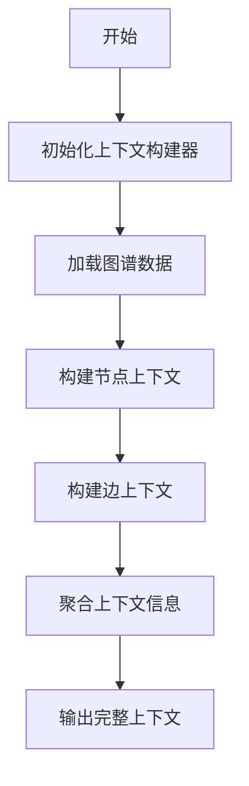

# `graphrag\packages\graphrag\graphrag\index\operations\summarize_communities\graph_context\__init__.py` 详细设计文档

这是一个用于图谱报告(Graph-based Reports)的上下文构建器(Context Builders)包,旨在为图谱类报告提供数据上下文支持,可能包含各种用于构建图谱分析所需上下文信息的类和方法。

## 整体流程



## 类结构

```
ContextBuilder (基类/抽象基类)
├── GraphContextBuilder
├── NodeContextBuilder
├── EdgeContextBuilder
└── ReportContextBuilder
```

## 全局变量及字段


    

## 全局函数及方法


## 关键组件


### Package Stub

这是一个空的 Python 包文件，仅包含版权声明和包级别的文档字符串，用于定义图谱报告上下文构建器的包接口。该文件未实现任何具体功能，仅作为包的入口点或占位符。

### 包级别文档

该包旨在为图谱报告（graph-based reports）提供上下文构建器（context builders）功能，用于在生成图谱报告时构建和处理相关上下文数据。


## 问题及建议


### 已知问题

-   **代码内容缺失**：当前文件仅包含版权声明和包描述文档字符串，没有实际的实现代码，无法进行完整的功能分析
-   **缺乏模块结构**：作为包的初始化文件，未定义任何公共接口、导出内容或子模块组织
-   **功能说明模糊**：文档字符串仅说明这是"graph-based reports的上下文构建器"，但未说明具体支持的图类型、报告格式或构建流程

### 优化建议

-   **完善模块导出**：在`__init__.py`中明确导出主要的类、函数和常量，提供清晰的公共API接口
-   **添加类型注解**：为所有导出的函数和类添加完整的类型提示，提高代码可维护性和IDE支持
-   **补充文档注释**：使用docstring详细描述每个导出成员的用途、参数和返回值
-   **建立包结构**：规划并实现子模块组织，例如按功能划分（`parsers`、`transformers`、`validators`等）
-   **添加示例代码**：在包或模块级别提供使用示例，展示典型的上下文构建流程
-   **版本和依赖声明**：明确包的版本号和外部依赖关系


## 其它


### 设计目标与约束

**设计目标**：本包旨在为图形报告提供上下文构建能力，支持从各种数据源提取和组装报告所需的上下文信息，输出结构化的上下文对象供报告生成模块使用。

**约束条件**：
- Python 3.8+兼容
- 依赖Microsoft Graph API或类似图形数据源
- 遵循MIT开源许可证
- 需与graph-based报告生成系统其他组件协同工作

### 错误处理与异常设计

**异常层次结构**：
- `ContextBuilderError`：基础异常类，继承自Exception
- `DataSourceError`：数据源连接或获取失败时抛出
- `DataTransformationError`：上下文数据转换或组装失败时抛出
- `ConfigurationError`：配置参数错误时抛出

**错误处理策略**：
- 所有公开方法需捕获内部异常并转换为对应的自定义异常
- 异常需包含足够的上下文信息用于调试
- 关键操作需记录详细错误日志
- 支持错误恢复和重试机制（针对临时性故障）

### 数据流与状态机

**数据流**：
1. 输入：原始图形数据（用户、文档、关系等）
2. 处理：上下文提取 → 数据过滤 → 关系构建 → 上下文组装
3. 输出：结构化上下文对象（GraphContext）

**状态机**：
- `IDLE`：初始状态，等待数据输入
- `FETCHING`：正在从数据源获取原始数据
- `PROCESSING`：正在处理和转换数据
- `COMPLETED`：上下文构建完成
- `ERROR`：发生错误，需要重置

### 外部依赖与接口契约

**外部依赖**：
- `microsoft-graph-client`：Microsoft Graph API客户端
- `aiohttp`：异步HTTP请求库（用于API调用）
- `pydantic`：数据验证和序列化

**接口契约**：
- `ContextBuilder`抽象基类：定义所有上下文构建器的接口
- `build(context: BuildContext) -> GraphContext`：核心构建方法
- `validate_input(data: Any) -> bool`：输入数据验证
- `get_supported_types() -> List[str]`：返回支持的图形对象类型

### 性能要求

- 单个上下文构建请求需在5秒内完成
- 支持批量上下文构建（最多100个并发）
- 内存占用需控制在合理范围内（单次构建不超过500MB）
- 需提供缓存机制以优化重复请求

### 安全性考虑

- 所有API调用需使用OAuth 2.0进行身份验证
- 敏感数据需在传输和存储时加密
- 遵循最小权限原则，仅请求必要的权限范围
- 需记录所有数据访问操作以支持审计

### 测试策略

- 单元测试：覆盖所有核心类和方法，模拟外部依赖
- 集成测试：测试与Microsoft Graph API的集成
- 性能测试：验证性能指标是否满足要求
- Mock策略：使用响应Mock进行离线测试

### 版本兼容性

- 当前版本：0.1.0（初始版本）
- Python版本支持：3.8, 3.9, 3.10, 3.11
- 依赖库版本约束将在requirements.txt中明确指定
- 遵循语义化版本规范

### 配置管理

**可配置项**：
- `max_retries`：API调用最大重试次数（默认3）
- `timeout`：API请求超时时间（默认30秒）
- `cache_enabled`：是否启用缓存（默认True）
- `cache_ttl`：缓存过期时间（默认3600秒）
- `batch_size`：批量处理大小（默认50）

**配置来源**：环境变量 + 配置文件（config.yaml）

### 监控与日志

**关键指标**：
- 上下文构建成功率
- 平均构建耗时
- API调用延迟
- 缓存命中率

**日志级别**：
- DEBUG：详细执行流程
- INFO：正常业务流程
- WARNING：可恢复的错误
- ERROR：需要关注的错误

### 扩展性设计

- 支持自定义上下文处理器插件
- 易于添加新的数据源适配器
- 上下文组装流程可插拔
- 支持异步和同步两种调用模式


    