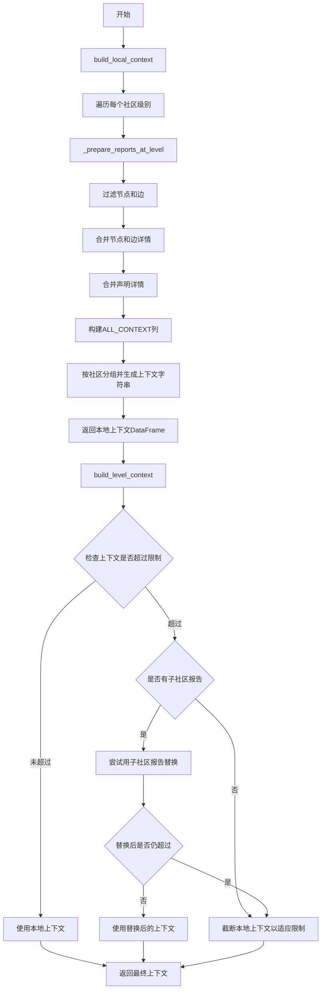
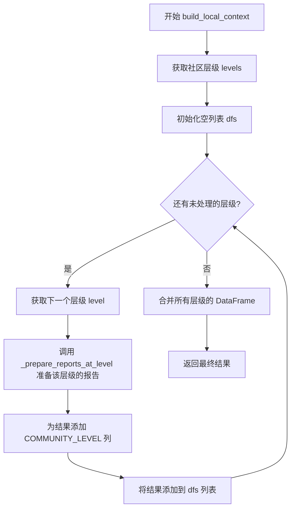
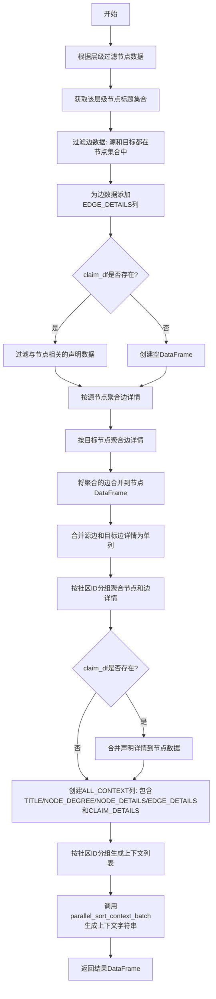
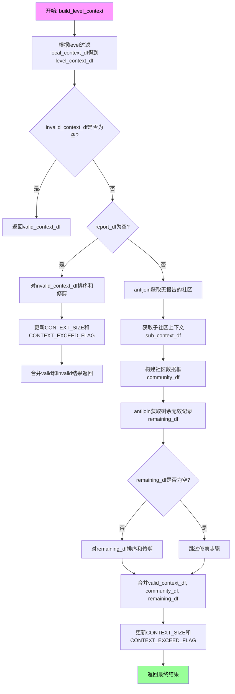
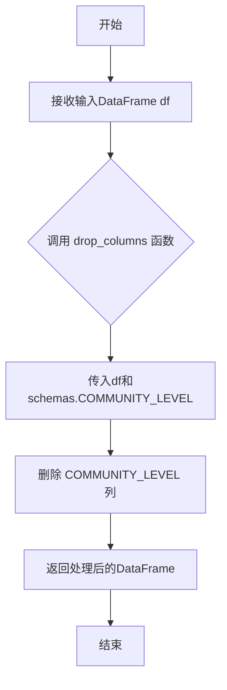
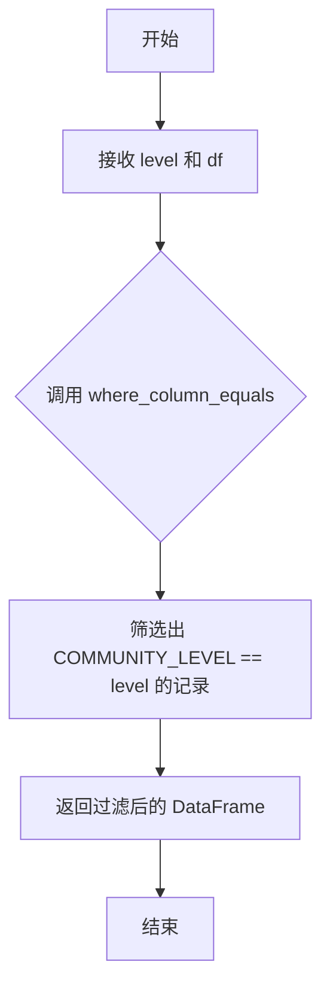
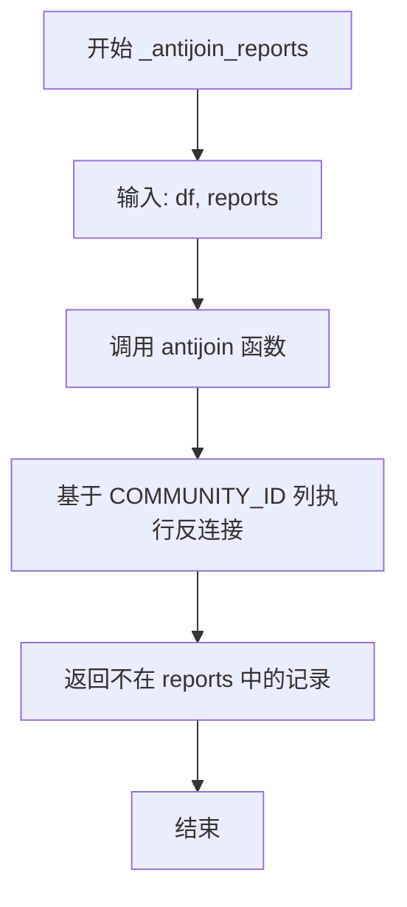
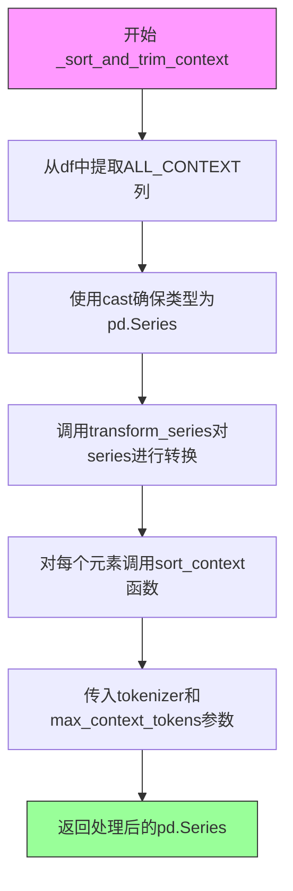
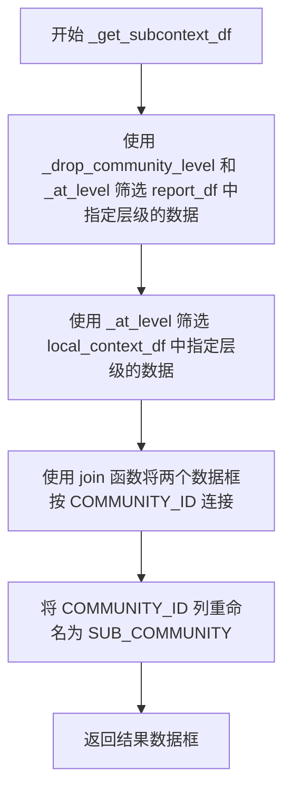
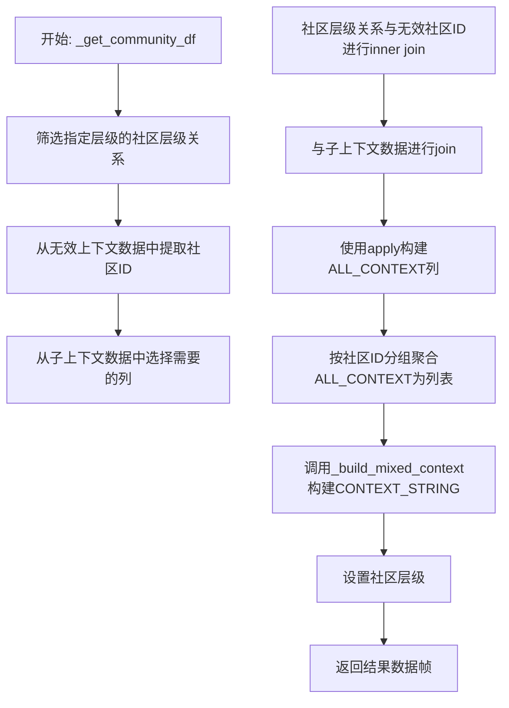

# `graphrag\packages\graphrag\graphrag\index\operations\summarize_communities\graph_context\context_builder.py` 详细设计文档

该代码为图谱中的社区构建上下文，用于报告生成。它通过处理节点、边和声明数据，为每个社区级别生成上下文字符串，并根据上下文大小限制决定使用本地上下文还是子社区报告。

## 整体流程



## 类结构

```
该模块为函数式编程风格，无显式类定义
所有功能通过模块级函数实现
└── ContextBuilders (模块)
```

## 全局变量及字段


### `logger`
    
模块级别的日志记录器，用于记录模块执行过程中的日志信息，例如节点数量统计等

类型：`logging.Logger`
    


    

## 全局函数及方法


### `build_local_context`

该函数是图社区上下文构建的核心入口，负责为图数据集中的每个社区准备报告生成所需的上下文数据。它通过遍历社区层级，筛选对应层级的节点、边和声明信息，将其整合为包含节点详情、边详情和声明详情的 DataFrame，并最终合并返回完整的本地上下文数据。

参数：

- `nodes`：`pd.DataFrame`，包含社区节点的详细信息，如标题、社区ID、节点度数等
- `edges`：`pd.DataFrame`，包含社区之间的边关系数据，如源节点、目标节点、边描述等
- `claims`：`pd.DataFrame | None`，可选参数，包含与节点相关的声明数据，如声明主题和声明详情
- `tokenizer`：`Tokenizer`，用于计算token数量以控制上下文大小
- `callbacks`：`WorkflowCallbacks`，工作流回调接口，用于报告处理进度
- `max_context_tokens`：`int = 16_000`，可选参数，控制每个社区上下文的最大token数，默认为16000

返回值：`pd.DataFrame`，返回包含所有社区层级的本地上下文数据，合并了节点、边和声明信息

#### 流程图



#### 带注释源码

```python
def build_local_context(
    nodes,           # 节点数据DataFrame
    edges,           # 边数据DataFrame
    claims,          # 声明数据DataFrame，可为None
    tokenizer: Tokenizer,       # 分词器用于计算token数
    callbacks: WorkflowCallbacks,  # 进度回调接口
    max_context_tokens: int = 16_000,  # 最大token限制
):
    """Prep communities for report generation."""
    # 1. 从节点数据中提取社区层级信息
    levels = get_levels(nodes, schemas.COMMUNITY_LEVEL)

    # 2. 初始化用于存储各层级结果的列表
    dfs = []

    # 3. 遍历每个社区层级，使用进度回调报告进度
    for level in progress_iterable(levels, callbacks.progress, len(levels)):
        # 4. 调用内部函数准备该层级的报告数据
        communities_at_level_df = _prepare_reports_at_level(
            nodes, edges, claims, tokenizer, level, max_context_tokens
        )

        # 5. 为该层级的所有社区添加层级标识列
        communities_at_level_df.loc[:, schemas.COMMUNITY_LEVEL] = level
        # 6. 将结果添加到待合并列表
        dfs.append(communities_at_level_df)

    # 7. 合并所有层级的DataFrame并返回
    # build initial local context for all communities
    return pd.concat(dfs)
```


### `_prepare_reports_at_level`

该函数是图谱报告生成的核心数据准备函数，负责在给定社区层级（level）下，过滤节点、边和声明数据，将其合并为包含完整上下文信息的数据结构，并利用并行排序和批处理生成社区级别的上下文字符串。

参数：

- `node_df`：`pd.DataFrame`，节点数据框，包含社区节点信息
- `edge_df`：`pd.DataFrame`，边数据框，包含社区节点之间的连接关系
- `claim_df`：`pd.DataFrame | None`，声明数据框（可选），包含与节点相关的声明信息
- `tokenizer`：`Tokenizer`，分词器实例，用于计算token数量和上下文排序
- `level`：`int`，社区层级，用于过滤对应层级的节点
- `max_context_tokens`：`int = 16_000`，最大上下文token数限制

返回值：`pd.DataFrame`，返回包含社区级别上下文字符串的数据框

#### 流程图



#### 带注释源码

```python
def _prepare_reports_at_level(
    node_df: pd.DataFrame,
    edge_df: pd.DataFrame,
    claim_df: pd.DataFrame | None,
    tokenizer: Tokenizer,
    level: int,
    max_context_tokens: int = 16_000,
) -> pd.DataFrame:
    """Prepare reports at a given level."""
    # 步骤1: 根据层级过滤节点数据
    # 筛选出符合当前层级的所有节点
    level_node_df = node_df[node_df[schemas.COMMUNITY_LEVEL] == level]
    logger.info("Number of nodes at level=%s => %s", level, len(level_node_df))
    
    # 步骤2: 获取该层级节点的标题集合，用于后续过滤边和声明
    nodes_set = set(level_node_df[schemas.TITLE])

    # 步骤3: 过滤边数据
    # 只保留源节点和目标节点都在当前层级节点集合中的边
    level_edge_df = edge_df[
        edge_df.loc[:, schemas.EDGE_SOURCE].isin(nodes_set)
        & edge_df.loc[:, schemas.EDGE_TARGET].isin(nodes_set)
    ]
    
    # 步骤4: 为边数据添加详情列
    # 包含短ID、源、目标、描述和度数信息
    level_edge_df.loc[:, schemas.EDGE_DETAILS] = level_edge_df.loc[  # type: ignore
        :,
        [
            schemas.SHORT_ID,
            schemas.EDGE_SOURCE,
            schemas.EDGE_TARGET,
            schemas.DESCRIPTION,
            schemas.EDGE_DEGREE,
        ],
    ].to_dict(orient="records")

    # 步骤5: 处理声明数据（可选）
    level_claim_df = pd.DataFrame()
    if claim_df is not None:
        # 过滤与当前层级节点相关的声明
        level_claim_df = claim_df[
            claim_df.loc[:, schemas.CLAIM_SUBJECT].isin(nodes_set)
        ]

    # 步骤6: 按源节点聚合边详情
    # 将每条边的详情聚合到其源节点下
    source_edges = (
        level_edge_df
        .groupby(schemas.EDGE_SOURCE)
        .agg({schemas.EDGE_DETAILS: "first"})
        .reset_index()
        .rename(columns={schemas.EDGE_SOURCE: schemas.TITLE})
    )

    # 步骤7: 按目标节点聚合边详情
    target_edges = (
        level_edge_df
        .groupby(schemas.EDGE_TARGET)
        .agg({schemas.EDGE_DETAILS: "first"})
        .reset_index()
        .rename(columns={schemas.EDGE_TARGET: schemas.TITLE})
    )

    # 步骤8: 将聚合的边合并到节点DataFrame
    # 使用左连接保留所有节点
    merged_node_df = level_node_df.merge(
        source_edges, on=schemas.TITLE, how="left"
    ).merge(target_edges, on=schemas.TITLE, how="left")

    # 步骤9: 合并源边和目标边详情为单列
    # 使用combine_first合并_x和_y后缀的列
    merged_node_df.loc[:, schemas.EDGE_DETAILS] = merged_node_df.loc[
        :, f"{schemas.EDGE_DETAILS}_x"
    ].combine_first(merged_node_df.loc[:, f"{schemas.EDGE_DETAILS}_y"])

    # 步骤10: 删除中间临时列
    merged_node_df.drop(
        columns=[f"{schemas.EDGE_DETAILS}_x", f"{schemas.EDGE_DETAILS}_y"], inplace=True
    )

    # 步骤11: 按关键字段分组并聚合节点和边详情
    merged_node_df = (
        merged_node_df
        .groupby([
            schemas.TITLE,
            schemas.COMMUNITY_ID,
            schemas.COMMUNITY_LEVEL,
            schemas.NODE_DEGREE,
        ])
        .agg({
            schemas.NODE_DETAILS: "first",
            schemas.EDGE_DETAILS: lambda x: list(x.dropna()),
        })
        .reset_index()
    )

    # 步骤12: 合并声明详情（如果可用）
    if claim_df is not None:
        merged_node_df = merged_node_df.merge(
            level_claim_df.loc[
                :, [schemas.CLAIM_SUBJECT, schemas.CLAIM_DETAILS]
            ].rename(columns={schemas.CLAIM_SUBJECT: schemas.TITLE}),
            on=schemas.TITLE,
            how="left",
        )

    # 步骤13: 创建ALL_CONTEXT列
    # 组合节点标题、度数、详情、边详情和声明详情为完整上下文
    merged_node_df[schemas.ALL_CONTEXT] = (  # type: ignore
        merged_node_df
        .loc[
            :,
            [
                schemas.TITLE,
                schemas.NODE_DEGREE,
                schemas.NODE_DETAILS,
                schemas.EDGE_DETAILS,
            ],
        ]
        .assign(
            **{schemas.CLAIM_DETAILS: merged_node_df[schemas.CLAIM_DETAILS]}
            if claim_df is not None
            else {}
        )
        .to_dict(orient="records")
    )

    # 步骤14: 按社区ID分组所有上下文
    community_df = (
        merged_node_df
        .groupby(schemas.COMMUNITY_ID)
        .agg({schemas.ALL_CONTEXT: list})
        .reset_index()
    )

    # 步骤15: 使用并行批处理生成社区级上下文字符串
    return parallel_sort_context_batch(
        community_df,
        tokenizer=tokenizer,
        max_context_tokens=max_context_tokens,
    )
```


### `build_level_context`

该函数为给定级别的每个社区准备上下文。对于每个社区，它检查本地上下文是否在token限制内，如果是则直接使用本地上下文；如果本地上下文超过限制，则迭代地用子社区报告替换本地上下文（从最大的子社区开始），以确保上下文不超过最大token限制。

参数：

- `report_df`：`pd.DataFrame | None`，包含社区报告的数据框，可为None或空
- `community_hierarchy_df`：`pd.DataFrame`，社区层级关系数据框
- `local_context_df`：`pd.DataFrame`，本地上下文数据框
- `tokenizer`：`Tokenizer`，用于计算token数量和排序上下文的分词器
- `level`：`int`，社区层级
- `max_context_tokens`：`int`，最大允许的上下文token数量

返回值：`pd.DataFrame`，处理后的上下文数据框，包含每个社区的上下文字符串、大小和是否超过限制的标志

#### 流程图



#### 带注释源码

```python
def build_level_context(
    report_df: pd.DataFrame | None,
    community_hierarchy_df: pd.DataFrame,
    local_context_df: pd.DataFrame,
    tokenizer: Tokenizer,
    level: int,
    max_context_tokens: int,
) -> pd.DataFrame:
    """
    Prep context for each community in a given level.

    For each community:
    - Check if local context fits within the limit, if yes use local context
    - If local context exceeds the limit, iteratively replace local context with sub-community reports, starting from the biggest sub-community
    """
    # 步骤1: 根据社区级别过滤本地上下文数据框
    # Filter by community level
    level_context_df = local_context_df.loc[
        local_context_df.loc[:, schemas.COMMUNITY_LEVEL] == level
    ]

    # 步骤2: 使用布尔逻辑分离有效和无效上下文
    # 有效上下文: CONTEXT_EXCEED_FLAG为False，表示未超过token限制
    # 无效上下文: CONTEXT_EXCEED_FLAG为True，表示超过token限制需要处理
    # Filter valid and invalid contexts using boolean logic
    valid_context_df = level_context_df.loc[
        ~level_context_df.loc[:, schemas.CONTEXT_EXCEED_FLAG]
    ]
    invalid_context_df = level_context_df.loc[
        level_context_df.loc[:, schemas.CONTEXT_EXCEED_FLAG]
    ]

    # 步骤3: 如果没有无效上下文，直接返回有效上下文
    # 这是社区层级最底层的情况，没有子社区可以替换
    # there is no report to substitute with, so we just trim the local context of the invalid context records
    # this case should only happen at the bottom level of the community hierarchy where there are no sub-communities
    if invalid_context_df.empty:
        return valid_context_df

    # 步骤4: 如果报告数据为空或None，直接对无效上下文进行排序和修剪
    if report_df is None or report_df.empty:
        # 对无效上下文排序和修剪以适应token限制
        invalid_context_df.loc[:, schemas.CONTEXT_STRING] = _sort_and_trim_context(
            invalid_context_df, tokenizer, max_context_tokens
        )
        # 计算实际token数量
        invalid_context_df[schemas.CONTEXT_SIZE] = invalid_context_df.loc[
            :, schemas.CONTEXT_STRING
        ].map(tokenizer.num_tokens)
        # 重置超过标志为False
        invalid_context_df[schemas.CONTEXT_EXCEED_FLAG] = False
        # 合并有效和无效上下文返回
        return union(valid_context_df, invalid_context_df)

    # 步骤5: 过滤出没有对应报告的社区记录
    level_context_df = _antijoin_reports(level_context_df, report_df)

    # 步骤6: 获取子社区上下文
    # 为每个无效上下文获取本地上下文和子社区报告(如果可用)
    # for each invalid context, we will try to substitute with sub-community reports
    # first get local context and report (if available) for each sub-community
    sub_context_df = _get_subcontext_df(level + 1, report_df, local_context_df)
    
    # 步骤7: 构建社区数据框，包含子社区的混合上下文
    community_df = _get_community_df(
        level,
        invalid_context_df,
        sub_context_df,
        community_hierarchy_df,
        tokenizer,
        max_context_tokens,
    )

    # 步骤8: 处理无法用子社区报告替换的剩余无效记录
    # 这是一个保护性措施，通常很少发生
    # handle any remaining invalid records that can't be subsituted with sub-community reports
    # this should be rare, but if it happens, we will just trim the local context to fit the limit
    remaining_df = _antijoin_reports(invalid_context_df, community_df)
    
    # 如果有剩余无效记录，对其进行排序和修剪
    remaining_df.loc[:, schemas.CONTEXT_STRING] = _sort_and_trim_context(
        remaining_df, tokenizer, max_context_tokens
    )

    # 步骤9: 合并所有结果: 有效上下文 + 社区上下文 + 剩余上下文
    result = union(valid_context_df, community_df, remaining_df)
    
    # 步骤10: 计算所有结果的token大小
    result[schemas.CONTEXT_SIZE] = result.loc[:, schemas.CONTEXT_STRING].map(
        tokenizer.num_tokens
    )

    # 步骤11: 重置超过标志，所有记录现在都已处理
    result[schemas.CONTEXT_EXCEED_FLAG] = False
    return result
```


### `_drop_community_level`

该函数是一个私有辅助函数，用于从DataFrame中删除社区级别（COMMUNITY_LEVEL）列。它接收一个包含社区数据的pandas DataFrame作为输入，调用数据处理工具函数`drop_columns`移除指定的列，并返回处理后的DataFrame。

参数：

- `df`：`pd.DataFrame`，输入的DataFrame，包含社区相关数据，其中包含COMMUNITY_LEVEL列

返回值：`pd.DataFrame`，返回删除了COMMUNITY_LEVEL列之后的DataFrame

#### 流程图



#### 带注释源码

```python
def _drop_community_level(df: pd.DataFrame) -> pd.DataFrame:
    """
    Drop the community level column from the dataframe.
    
    这是一个私有辅助函数，专门用于移除DataFrame中的COMMUNITY_LEVEL列。
    该列在社区层级处理过程中作为临时标识使用，在完成特定处理后需要移除。
    
    Args:
        df: 输入的DataFrame，包含社区数据及其层级信息
        
    Returns:
        返回一个新的DataFrame，其中不包含COMMUNITY_LEVEL列
    """
    return drop_columns(df, schemas.COMMUNITY_LEVEL)
```


### `_at_level`

该函数是一个简单的数据过滤函数，用于从 DataFrame 中筛选出特定社区层级的记录。它接收一个层级整数和一个 DataFrame，然后调用 `where_column_equals` 工具函数返回满足条件的行。

参数：

- `level`：`int`，要筛选的社区层级值
- `df`：`pd.DataFrame`，输入的 Pandas DataFrame，包含 `COMMUNITY_LEVEL` 列

返回值：`pd.DataFrame`，返回社区层级等于指定 `level` 值的所有记录

#### 流程图



#### 带注释源码

```python
def _at_level(level: int, df: pd.DataFrame) -> pd.DataFrame:
    """
    Return records at the given level.
    
    该函数是一个简单的列值过滤封装器，用于从 DataFrame 中
    提取特定社区层级的所有记录。它内部调用了 where_column_equals
    工具函数来实现过滤逻辑。
    
    参数:
        level: int - 要筛选的社区层级值
        df: pd.DataFrame - 输入的数据框，必须包含 COMMUNITY_LEVEL 列
    
    返回:
        pd.DataFrame - 社区层级等于指定 level 值的记录集合
    """
    return where_column_equals(df, schemas.COMMUNITY_LEVEL, level)
```


### `_antijoin_reports`

该函数是一个工具函数，用于执行反连接（anti-join）操作，从第一个 DataFrame 中返回与第二个 DataFrame 在 `COMMUNITY_ID` 列上没有匹配记录的社区上下文数据，常用于筛选出无法被子社区报告替换的无效上下文记录。

参数：

- `df`：`pd.DataFrame`，包含社区上下文记录的 DataFrame，作为主表进行反连接操作
- `reports`：`pd.DataFrame`，包含报告记录的 DataFrame，作为参照表，用于排除匹配的记录

返回值：`pd.DataFrame`，返回 `df` 中不存在于 `reports` 中的记录，基于 `COMMUNITY_ID` 列进行匹配

#### 流程图



#### 带注释源码

```python
def _antijoin_reports(df: pd.DataFrame, reports: pd.DataFrame) -> pd.DataFrame:
    """
    Return records in df that are not in reports.
    
    This function performs an anti-join operation using the COMMUNITY_ID column.
    It returns all rows from df where the COMMUNITY_ID does not exist in reports.
    Commonly used to filter out community records that have corresponding reports.
    
    Args:
        df: The primary DataFrame containing community context records
        reports: The DataFrame containing report records to exclude
        
    Returns:
        A DataFrame containing records from df that are not present in reports
    """
    return antijoin(df, reports, schemas.COMMUNITY_ID)
```

---

### 补充说明

#### 关键组件信息

| 组件名称 | 一句话描述 |
|---------|-----------|
| `antijoin` | 执行反连接操作的工具函数，基于指定列返回左表中不在右表中的记录 |
| `schemas.COMMUNITY_ID | 用于标识社区的唯一ID列，作为反连接操作的连接键 |

#### 潜在技术债务或优化空间

1. **缺乏错误处理**：函数未对输入 DataFrame 进行空值检查或列存在性验证
2. **文档注释不足**：虽然有 docstring，但未说明在 `build_level_context` 中的具体业务场景
3. **函数粒度**：作为简单的封装函数，可考虑内联到调用处或与 `antijoin` 统一管理

#### 其它项目

- **设计目标**：提供一个简洁的接口用于过滤掉已有报告的社区上下文，避免重复处理
- **调用场景**：在 `build_level_context` 函数中，用于从 `level_context_df` 中过滤出已有报告的社区，以及从 `invalid_context_df` 中过滤出已被 `community_df` 替换的记录
- **外部依赖**：依赖 `graphrag.index.utils.dataframes.antijoin` 函数和 `graphrag.data_model.schemas` 中的 `COMMUNITY_ID` 常量


### `_sort_and_trim_context`

该函数用于对社区的上下文内容进行排序和修剪，以确保生成的上下文文本符合最大token数量限制。它通过将DataFrame中的ALL_CONTEXT列转换为Series，并对其每个元素应用sort_context函数来实现。

参数：

- `df`：`pd.DataFrame`，包含ALL_CONTEXT列的输入数据框
- `tokenizer`：`Tokenizer`，用于计算token数量的分词器实例
- `max_context_tokens`：`int`，允许的最大上下文token数量

返回值：`pd.Series`，返回处理后的上下文系列，每个元素都是经过排序和修剪后的上下文内容

#### 流程图



#### 带注释源码

```python
def _sort_and_trim_context(
    df: pd.DataFrame, tokenizer: Tokenizer, max_context_tokens: int
) -> pd.Series:
    """Sort and trim context to fit the limit.
    
    此函数对DataFrame中的ALL_CONTEXT列进行处理，通过调用sort_context函数
    对每个社区的上下文内容进行排序和修剪，以确保不超过最大token限制。
    
    Args:
        df: 包含ALL_CONTEXT列的DataFrame
        tokenizer: 分词器实例，用于计算token数量
        max_context_tokens: 最大允许的token数量
    
    Returns:
        返回处理后的pd.Series，其中每个元素都是经过排序和修剪的上下文内容
    """
    # 从DataFrame中提取ALL_CONTEXT列，并将其强制转换为pd.Series类型
    # cast用于类型断言，确保类型安全
    series = cast("pd.Series", df[schemas.ALL_CONTEXT])
    
    # 使用transform_series对系列中的每个元素应用sort_context函数
    # transform_series会遍历series中的每个元素（即每个社区的上下文列表）
    # 并对其应用lambda函数中定义的sort_context转换
    return transform_series(
        series,
        lambda x: sort_context(
            x, tokenizer=tokenizer, max_context_tokens=max_context_tokens
        ),
    )
```

#### 关键技术细节

1. **类型转换**：使用`cast`函数确保从DataFrame列提取的对象被正确识别为`pd.Series`类型
2. **函数组合**：通过`transform_series`高阶函数实现对系列中每个元素的批量处理
3. **排序修剪逻辑**：实际的排序和修剪逻辑委托给`sort_context`函数（在别处定义），本函数作为包装器提供数据转换层


### `_build_mixed_context`

对数据框中的所有上下文进行排序和修剪，以适应指定的 token 数量限制。该函数通过 `transform_series` 将 `build_mixed_context` 应用于 `ALL_CONTEXT` 列的每个元素。

参数：

-  `df`：`pd.DataFrame`，包含社区上下文信息的数据框
-  `tokenizer`：`Tokenizer`，用于计算 token 数量的分词器实例
-  `max_context_tokens`：`int`，允许的最大上下文 token 数量

返回值：`pd.Series`，返回经过混合上下文构建和 token 限制处理后的系列

#### 流程图

```mermaid
flowchart TD
    A[开始 _build_mixed_context] --> B[提取 df[schemas.ALL_CONTEXT] 列]
    B --> C{遍历系列中的每个元素}
    C -->|对每个元素 x| D[调用 build_mixed_context]
    D --> E[传入参数: x, tokenizer, max_context_tokens]
    E --> F[返回处理后的元素]
    F --> C
    C -->|完成所有元素| G[返回 pd.Series]
    G --> H[结束]
    
    subgraph "transform_series 内部处理"
        D
        E
        F
    end
```

#### 带注释源码

```python
def _build_mixed_context(
    df: pd.DataFrame, tokenizer: Tokenizer, max_context_tokens: int
) -> pd.Series:
    """
    Sort and trim context to fit the limit.
    
    对上下文进行排序和修剪以适应限制。
    该函数是内部辅助函数，用于在社区级别构建混合上下文。
    """
    # 从输入数据框中提取 ALL_CONTEXT 列，并将其类型转换为 pd.Series
    # ALL_CONTEXT 列包含了节点、边、声明等综合上下文信息
    series = cast("pd.Series", df[schemas.ALL_CONTEXT])
    
    # 使用 transform_series 对系列中的每个元素应用 build_mixed_context 函数
    # transform_series 是一个向量化转换工具，会对系列中的每个值调用提供的 lambda 函数
    # lambda x 表示对系列中的每个上下文元素进行处理
    return transform_series(
        series,
        lambda x: build_mixed_context(
            x, tokenizer, max_context_tokens=max_context_tokens
        ),
    )
    # 返回值是一个新的 pd.Series，其中每个元素都是经过 build_mixed_context 
    # 处理后的上下文内容，已经根据 max_context_tokens 进行了排序和修剪
```


### `_get_subcontext_df`

获取每个社区的子社区上下文数据。

参数：

-  `level`：`int`，社区层级，用于筛选对应层级的数据
-  `report_df`：`pd.DataFrame`，报告数据框，包含社区报告信息
-  `local_context_df` `：pd.DataFrame`，本地上下文数据框，包含社区的上下文信息

返回值：`pd.DataFrame`，返回包含子社区上下文信息的数据框，其中 `COMMUNITY_ID` 列被重命名为 `SUB_COMMUNITY`

#### 流程图



#### 带注释源码

```python
def _get_subcontext_df(
    level: int, report_df: pd.DataFrame, local_context_df: pd.DataFrame
) -> pd.DataFrame:
    """Get sub-community context for each community."""
    # 从 report_df 中获取指定层级的数据，并移除社区层级列
    sub_report_df = _drop_community_level(_at_level(level, report_df))
    
    # 从 local_context_df 中获取指定层级的数据
    sub_context_df = _at_level(level, local_context_df)
    
    # 将子上下文数据框与子报告数据框按 COMMUNITY_ID 进行连接
    sub_context_df = join(sub_context_df, sub_report_df, schemas.COMMUNITY_ID)
    
    # 将 COMMUNITY_ID 列重命名为 SUB_COMMUNITY，以区分父子社区
    sub_context_df.rename(
        columns={schemas.COMMUNITY_ID: schemas.SUB_COMMUNITY}, inplace=True
    )
    
    # 返回包含子社区上下文的结果数据框
    return sub_context_df
```


### `_get_community_df`

该函数用于根据层级、不合法的上下文数据帧、子上下文数据帧、社区层级关系数据帧、分词器和最大上下文token数，获取每个社区的社区上下文。它首先收集所有子社区的上下文，然后通过join操作将无效社区与子上下文合并，最后使用混合上下文构建器生成最终的上下文字符串。

参数：

- `level`：`int`，社区层级，用于筛选对应层级的社区层级关系数据
- `invalid_context_df`：`pd.DataFrame`，包含无效上下文（超出token限制）的数据帧，这些社区需要用子社区报告来替换
- `sub_context_df`：`pd.DataFrame`，子社区的上下文数据，包含子社区ID、完整内容、所有上下文和上下文大小等信息
- `community_hierarchy_df`：`pd.DataFrame`，社区层级关系数据，记录了社区与其子社区的层级关系
- `tokenizer`：`Tokenizer`，分词器实例，用于计算token数量
- `max_context_tokens`：`int`，最大上下文token数限制，用于控制上下文大小

返回值：`pd.DataFrame`，返回包含社区ID、上下文字符串、社区层级等字段的数据帧，其中上下文字符串已通过混合上下文构建器处理

#### 流程图



#### 带注释源码

```
def _get_community_df(
    level: int,  # 社区层级
    invalid_context_df: pd.DataFrame,  # 包含无效上下文的数据帧
    sub_context_df: pd.DataFrame,  # 子社区上下文数据
    community_hierarchy_df: pd.DataFrame,  # 社区层级关系
    tokenizer: Tokenizer,  # 分词器
    max_context_tokens: int,  # 最大token数
) -> pd.DataFrame:
    """Get community context for each community."""
    # 收集所有子社区的上下文
    
    # 1. 筛选指定层级的社区层级关系，并移除社区层级列
    community_df = _drop_community_level(_at_level(level, community_hierarchy_df))
    
    # 2. 从无效上下文数据中提取社区ID
    invalid_community_ids = select(invalid_context_df, schemas.COMMUNITY_ID)
    
    # 3. 从子上下文数据中选择需要的列：子社区ID、完整内容、所有上下文、上下文大小
    subcontext_selection = select(
        sub_context_df,
        schemas.SUB_COMMUNITY,
        schemas.FULL_CONTENT,
        schemas.ALL_CONTEXT,
        schemas.CONTEXT_SIZE,
    )

    # 4. 将社区层级关系与无效社区ID进行inner join，获取无效社区及其层级关系
    invalid_communities = join(
        community_df, invalid_community_ids, schemas.COMMUNITY_ID, "inner"
    )
    
    # 5. 将无效社区数据与子上下文数据进行join，获取每个无效社区的子社区上下文
    community_df = join(
        invalid_communities, subcontext_selection, schemas.SUB_COMMUNITY
    )
    
    # 6. 使用apply构建ALL_CONTEXT列，将子社区信息组合成字典
    community_df[schemas.ALL_CONTEXT] = community_df.apply(
        lambda x: {
            schemas.SUB_COMMUNITY: x[schemas.SUB_COMMUNITY],
            schemas.ALL_CONTEXT: x[schemas.ALL_CONTEXT],
            schemas.FULL_CONTENT: x[schemas.FULL_CONTENT],
            schemas.CONTEXT_SIZE: x[schemas.CONTEXT_SIZE],
        },
        axis=1,  # 按行应用函数
    )
    
    # 7. 按社区ID分组，将ALL_CONTEXT聚合为列表
    community_df = (
        community_df
        .groupby(schemas.COMMUNITY_ID)
        .agg({schemas.ALL_CONTEXT: list})
        .reset_index()
    )
    
    # 8. 调用_build_mixed_context构建混合上下文字符串
    community_df[schemas.CONTEXT_STRING] = _build_mixed_context(
        community_df, tokenizer, max_context_tokens
    )
    
    # 9. 设置社区层级列
    community_df[schemas.COMMUNITY_LEVEL] = level
    
    # 10. 返回结果数据帧
    return community_df
```

## 关键组件


### build_local_context

构建整个图的本地上下文，处理所有社区级别，为每个级别准备报告并合并结果

### _prepare_reports_at_level

准备特定社区级别的报告数据，包括节点、边、声明的筛选和聚合，构建ALL_CONTEXT列

### build_level_context

为给定级别的社区准备上下文，检查本地上下文是否超限，若超限则迭代用子社区报告替换

### _sort_and_trim_context

对上下文进行排序和裁剪，确保上下文字符串不超过最大token数限制

### _build_mixed_context

构建混合上下文，组合多个子社区的上下文内容

### _get_subcontext_df

获取子社区的上下文数据帧，将子社区报告与本地上下文进行连接

### _get_community_df

收集每个社区的所有子社区上下文，聚合生成社区级别的上下文字符串

### _antijoin_reports

返回在数据帧中但不在报告中的记录，用于筛选无效或缺失报告的社区

### parallel_sort_context_batch

使用向量化批处理并行排序上下文，提高大规模数据处理效率

### sort_context

对单个上下文进行排序，按照优先级和token限制进行裁剪

### schemas

定义图数据模型的模式常量，包括社区级别、节点、边、声明等字段名称

### Tokenizer

令牌化器，用于计算token数量和上下文裁剪

### WorkflowCallbacks

工作流回调接口，用于报告进度


## 问题及建议


### 已知问题

-   **DataFrame 赋值操作可能触发 SettingWithCopyWarning**：多处使用 `.loc` 进行条件赋值（如 `level_edge_df.loc[:, schemas.EDGE_DETAILS] = ...` 和 `invalid_context_df.loc[:, schemas.CONTEXT_STRING] = ...`），存在潜在的拷贝警告风险
-   **类型标注不完整**：大量使用 `cast` 进行类型转换，且部分变量缺乏明确的类型声明，降低了代码的类型安全性
-   **魔法数字硬编码**：`max_context_tokens=16_000` 在多个函数中重复出现，应提取为常量
-   **缺少输入验证**：函数参数（如 `nodes`, `edges`, `claims`）没有进行空值或类型检查，可能导致运行时错误
-   **代码重复**：`build_local_context` 和 `build_level_context` 中都有 DataFrame 合并逻辑，可抽取为通用函数
-   **apply 性能瓶颈**：`_get_community_df` 中使用 `community_df.apply(lambda x: {...}, axis=1)` 构建字典列表，对大数据集性能较差
-   **日志记录不足**：仅在 `_prepare_reports_at_level` 中有一条日志，关键操作节点缺少日志，难以追踪执行流程

### 优化建议

-   **提取常量**：将 `16_000` 定义为模块级常量 `DEFAULT_MAX_CONTEXT_TOKENS = 16_000`
-   **添加输入验证**：在 public 函数开头添加参数校验，如检查 DataFrame 是否为空、required columns 是否存在
-   **优化 DataFrame 操作**：将链式 `.loc` 赋值改为先构建完整列再一次性赋值，或使用 `.copy()` 避免拷贝警告
-   **重构重复逻辑**：将 `_sort_and_trim_context` 和 `_build_mixed_context` 合并为一个高阶函数，接受不同的处理函数作为参数
-   **替换 apply 为向量化操作**：将 `apply(lambda x: {...}, axis=1)` 改为直接使用字典构造或 `pd.concat`
-   **增强日志**：在关键分支（如无效上下文处理、子社区替换逻辑）添加 INFO/DEBUG 级别日志
-   **添加类型守卫**：使用 `typeguard` 或在函数入口添加运行时类型检查，确保输入符合预期


## 其它


### 设计目标与约束

本模块的核心设计目标是高效构建图社区的上下文信息，用于支持检索增强生成（RAG）系统。设计约束包括：1）最大上下文token数限制（默认16000）；2）按社区层级处理数据；3）优先使用本地上下文，仅在超出限制时使用子社区报告替换；4）保持内存效率，支持大规模图数据处理。

### 错误处理与异常设计

代码中的错误处理主要体现在：1）空数据帧检查（report_df为空时直接裁剪本地上下文）；2）使用pandas的loc和布尔逻辑进行安全索引；3）通过antijoin和union操作处理数据合并时的边界情况。当前错误处理相对简单，缺乏显式的异常捕获机制，建议在生产环境中增加对tokenizer失效、数据格式错误等情况的异常处理。

### 数据流与状态机

数据流遵循以下路径：1）build_local_context接收nodes、edges、claims数据，按层级处理后返回包含ALL_CONTEXT列的DataFrame；2）_prepare_reports_at_level完成节点-边-声明的合并与聚合；3）build_level_context根据层级和token限制决定使用本地上下文或子社区报告；4）最终输出包含CONTEXT_STRING、CONTEXT_SIZE、CONTEXT_EXCEED_FLAG等列的DataFrame。状态转换通过CONTEXT_EXCEED_FLAG标志位标识（True表示超出限制需替换）。

### 外部依赖与接口契约

主要外部依赖包括：1）graphrag_llm.tokenizer.Tokenizer - token计数与限制；2）graphrag.data_model.schemas - 数据模式定义（COMMUNITY_LEVEL、TITLE、EDGE_SOURCE等）；3）graphrag.index.operations.summarize_communities下的build_mixed_context、sort_context等函数；4）graphrag.index.utils.dataframes - DataFrame操作工具（join、union、antijoin等）；5）graphrag.callbacks.workflow_callbacks - 进度回调接口。接口契约要求：输入DataFrame必须包含schema定义的列，tokenizer必须实现num_tokens方法。

### 性能考虑与优化空间

当前实现存在以下性能问题：1）多次使用loc进行inplace操作，可能触发pandas警告；2）groupby操作中使用lambda函数效率较低；3）apply操作（axis=1）在大数据集上性能瓶颈明显；4）缺少向量化优化。优化建议：1）使用copy()避免SettingWithCopyWarning；2）将lambda聚合改为字典映射；3）使用向量化操作替代apply；4）考虑使用dask或polars加速大规模数据处理；5）增加缓存机制避免重复计算。

### 并发处理

当前代码使用progress_iterable实现进度回调，但未实现真正的并发处理。build_local_context中按层级顺序处理，build_level_context中也是顺序处理各记录。建议：1）在build_local_context中实现多层级并行处理；2）在_prepare_reports_at_level中并行处理各社区；3）使用joblib或multiprocessing加速groupby和merge操作。

### 配置参数

关键配置参数包括：1）max_context_tokens - 最大上下文token数（默认16000，可调整）；2）schemas.COMMUNITY_LEVEL - 社区层级字段；3）schemas.TITLE - 节点/社区标题；4）schemas.EDGE_SOURCE/TARGET - 边源和目标；5）schemas.CLAIM_SUBJECT/DETAILS - 声明主题和详情。这些参数通过schemas模块统一管理，支持配置化调整。

### 单元测试建议

建议补充以下测试用例：1）空输入测试（空DataFrame、None值）；2）单层级/多层级数据测试；3）token限制边界测试（恰好等于/小于/大于限制）；4）无子社区的底层处理测试；5）claim_df为None时的降级处理测试；6）大规模数据集性能基准测试；7）数据完整性测试（确保无数据丢失）。

### 关键组件信息

1）Tokenizer - token计数组件，用于限制上下文大小；2）WorkflowCallbacks - 进度回调接口，支持长流程进度展示；3）schemas模块 - 统一的数据模式定义，包含COMMUNITY_LEVEL、TITLE、EDGE_DETAILS等15+个字段；4）DataFrame工具函数（join/union/antijoin等）- 提供声明式数据操作；5）parallel_sort_context_batch - 向量化批量排序上下文函数；6）sort_context - 单个上下文排序函数；7）build_mixed_context - 混合上下文构建函数。

### 潜在的技术债务与优化空间

1）代码注释不足，部分复杂逻辑（如边聚合逻辑）缺乏解释；2）类型标注不完整（如lambda表达式、apply操作的返回值）；3）魔法字符串和字段操作可进一步抽象；4）缺乏日志详细程度控制（仅info级别）；5）DataFrame操作链较长，可拆分为更小的纯函数；6）没有实现缓存机制，重复计算同一层级的上下文；7）单元测试覆盖率未知，建议补充完整测试套件；8）错误消息不够友好，难以快速定位问题。


    