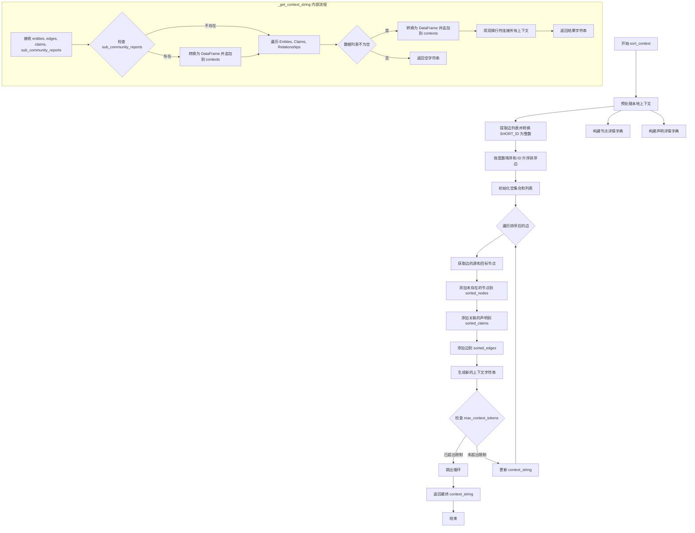
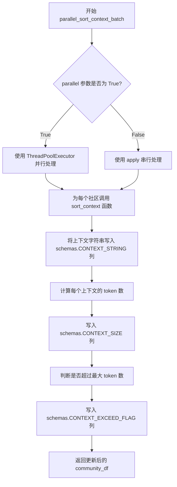

# `graphrag\packages\graphrag\graphrag\index\operations\summarize_communities\graph_context\sort_context.py` 详细设计文档

该代码实现了一个上下文排序优化函数，根据边的度数（degree）降序排序实体、边和声明信息，并支持并行化批量处理，以优化大语言模型的上下文窗口使用效率。

## 整体流程

```mermaid
graph TD
    A[开始 sort_context] --> B[预处理本地上下文]
    B --> C[提取边信息并转换SHORT_ID为整数]
    C --> D[构建节点详情字典]
    D --> E[构建声明详情字典]
    E --> F[按度数降序、ID升序排序边]
    F --> G[初始化去重集合和排序列表]
    G --> H{遍历排序后的边}
    H -->|添加节点| I[获取源和目标节点详情]
    I --> J[添加相关声明]
    J --> K[添加边到排序列表]
    K --> L[生成新上下文字符串]
    L --> M{检查token数量是否超限}
    M -->|是| N[跳出循环]
    M -->|否| H
    N --> O{context_string是否为空}
    O -->|是| P[调用_get_context_string生成默认上下文]
    O -->|否| Q[返回context_string]
    P --> R[结束]
    Q --> R

graph TD
    A1[开始 parallel_sort_context_batch] --> B1{parallel参数是否为True}
    B1 -->|是| C1[使用ThreadPoolExecutor并行处理]
    B1 -->|否| D1[使用apply串行处理]
    C1 --> E1[计算CONTEXT_SIZE]
    D1 --> E1
    E1 --> F1[计算CONTEXT_EXCEED_FLAG]
    F1 --> G1[返回community_df]
```

## 类结构

```
sort_context.py (模块)
```

## 全局变量及字段


### `sort_context`
    
Sort context by degree in descending order, optimizing for performance by building context incrementally

类型：`function`
    


### `parallel_sort_context_batch`
    
Calculate context using parallelization if enabled, processing community DataFrame

类型：`function`
    


### `local_context`
    
Input list of dictionaries containing node and edge context data

类型：`list[dict]`
    


### `tokenizer`
    
Tokenizer instance for counting tokens in context strings

类型：`Tokenizer`
    


### `sub_community_reports`
    
Optional list of sub-community reports to include in context

类型：`list[dict] | None`
    


### `max_context_tokens`
    
Maximum token limit for context string generation

类型：`int | None`
    


### `node_name_column`
    
Column name for node names, defaults to schemas.TITLE

类型：`str`
    


### `node_details_column`
    
Column name for node details, defaults to schemas.NODE_DETAILS

类型：`str`
    


### `edge_id_column`
    
Column name for edge IDs, defaults to schemas.SHORT_ID

类型：`str`
    


### `edge_details_column`
    
Column name for edge details, defaults to schemas.EDGE_DETAILS

类型：`str`
    


### `edge_degree_column`
    
Column name for edge degree, defaults to schemas.EDGE_DEGREE

类型：`str`
    


### `edge_source_column`
    
Column name for edge source, defaults to schemas.EDGE_SOURCE

类型：`str`
    


### `edge_target_column`
    
Column name for edge target, defaults to schemas.EDGE_TARGET

类型：`str`
    


### `claim_details_column`
    
Column name for claim details, defaults to schemas.CLAIM_DETAILS

类型：`str`
    


### `community_df`
    
Pandas DataFrame containing community data

类型：`DataFrame`
    


### `parallel`
    
Flag to enable parallel execution using ThreadPoolExecutor

类型：`bool`
    


    

## 全局函数及方法


### `sort_context`

该函数通过按度数降序排序上下文中的边来优化上下文构建过程，同时增量式地添加关联的节点和声明，并在达到最大 token 数量限制时停止，从而生成排序后的上下文字符串。

参数：

- `local_context`：`list[dict]`，本地上下文列表，包含实体、边和声明的记录
- `tokenizer`：`Tokenizer`，用于计算 token 数量的分词器实例
- `sub_community_reports`：`list[dict] | None`，可选的子社区报告列表
- `max_context_tokens`：`int | None`，允许的最大 token 数量限制
- `node_name_column`：`str`，节点名称列名（默认值为 schemas.TITLE）
- `node_details_column`：`str`，节点详情列名（默认值为 schemas.NODE_DETAILS）
- `edge_id_column`：`str`，边 ID 列名（默认值为 schemas.SHORT_ID）
- `edge_details_column`：`str`，边详情列名（默认值为 schemas.EDGE_DETAILS）
- `edge_degree_column`：`str`，边度数列名（默认值为 schemas.EDGE_DEGREE）
- `edge_source_column`：`str`，边源节点列名（默认值为 schemas.EDGE_SOURCE）
- `edge_target_column`：`str`，边目标节点列名（默认值为 schemas.EDGE_TARGET）
- `claim_details_column`：`str`，声明详情列名（默认值为 schemas.CLAIM_DETAILS）

返回值：`str`，排序并截断后的上下文字符串

#### 流程图



#### 带注释源码

```python
def sort_context(
    local_context: list[dict],
    tokenizer: Tokenizer,
    sub_community_reports: list[dict] | None = None,
    max_context_tokens: int | None = None,
    node_name_column: str = schemas.TITLE,
    node_details_column: str = schemas.NODE_DETAILS,
    edge_id_column: str = schemas.SHORT_ID,
    edge_details_column: str = schemas.EDGE_DETAILS,
    edge_degree_column: str = schemas.EDGE_DEGREE,
    edge_source_column: str = schemas.EDGE_SOURCE,
    edge_target_column: str = schemas.EDGE_TARGET,
    claim_details_column: str = schemas.CLAIM_DETAILS,
) -> str:
    """Sort context by degree in descending order, optimizing for performance."""

    def _get_context_string(
        entities: list[dict],
        edges: list[dict],
        claims: list[dict],
        sub_community_reports: list[dict] | None = None,
    ) -> str:
        """Concatenate structured data into a context string."""
        contexts = []
        # 如果存在子社区报告，则将其转换为 CSV 格式并添加到上下文中
        if sub_community_reports:
            report_df = pd.DataFrame(sub_community_reports)
            if not report_df.empty:
                contexts.append(
                    f"----Reports-----\n{report_df.to_csv(index=False, sep=',')}"
                )

        # 遍历实体、声明和边，将其转换为 CSV 格式添加到上下文
        for label, data in [
            ("Entities", entities),
            ("Claims", claims),
            ("Relationships", edges),
        ]:
            if data:
                data_df = pd.DataFrame(data)
                if not data_df.empty:
                    contexts.append(
                        f"-----{label}-----\n{data_df.to_csv(index=False, sep=',')}"
                    )

        # 使用双换行符连接所有上下文部分
        return "\n\n".join(contexts)

    # ============ 预处理本地上下文 ============
    # 提取所有边记录，并将 SHORT_ID 转换为整数类型
    edges = [
        {**e, schemas.SHORT_ID: int(e[schemas.SHORT_ID])}
        for record in local_context
        for e in record.get(edge_details_column, [])
        if isinstance(e, dict)
    ]

    # 构建节点详情字典，键为节点名称，值为节点详情（包含转换后的 SHORT_ID）
    node_details = {
        record[node_name_column]: {
            **record[node_details_column],
            schemas.SHORT_ID: int(record[node_details_column][schemas.SHORT_ID]),
        }
        for record in local_context
    }

    # 构建声明详情字典，键为节点名称，值为该节点关联的所有声明列表
    claim_details = {
        record[node_name_column]: [
            {**c, schemas.SHORT_ID: int(c[schemas.SHORT_ID])}
            for c in record.get(claim_details_column, [])
            if isinstance(c, dict) and c.get(schemas.SHORT_ID) is not None
        ]
        for record in local_context
        if isinstance(record.get(claim_details_column), list)
    }

    # ============ 排序边 ============
    # 按度数降序排序，度数相同则按 ID 升序排序
    edges.sort(key=lambda x: (-x.get(edge_degree_column, 0), x.get(edge_id_column, "")))

    # ============ 去重并增量构建上下文 ============
    # 初始化用于去重的集合和用于存储结果的列表
    edge_ids, nodes_ids, claims_ids = set(), set(), set()
    sorted_edges, sorted_nodes, sorted_claims = [], [], []
    context_string = ""

    # 遍历排序后的边，逐步构建上下文
    for edge in edges:
        source, target = edge[edge_source_column], edge[edge_target_column]

        # 添加源节点和目标节点的详情（去重）
        for node in [node_details.get(source), node_details.get(target)]:
            if node and node[schemas.SHORT_ID] not in nodes_ids:
                nodes_ids.add(node[schemas.SHORT_ID])
                sorted_nodes.append(node)

        # 添加与源节点和目标节点关联的声明（去重）
        for claims in [claim_details.get(source), claim_details.get(target)]:
            if claims:
                for claim in claims:
                    if claim[schemas.SHORT_ID] not in claims_ids:
                        claims_ids.add(claim[schemas.SHORT_ID])
                        sorted_claims.append(claim)

        # 添加边本身（去重）
        if edge[schemas.SHORT_ID] not in edge_ids:
            edge_ids.add(edge[schemas.SHORT_ID])
            sorted_edges.append(edge)

        # 生成新的上下文字符串
        new_context_string = _get_context_string(
            sorted_nodes, sorted_edges, sorted_claims, sub_community_reports
        )
        # 检查是否超出最大 token 限制，若超出则停止添加更多内容
        if (
            max_context_tokens
            and tokenizer.num_tokens(new_context_string) > max_context_tokens
        ):
            break
        # 更新上下文字符串为最新的内容
        context_string = new_context_string

    # ============ 返回结果 ============
    # 返回最终的上下文字符串，如果为空则返回基于当前数据的默认字符串
    return context_string or _get_context_string(
        sorted_nodes, sorted_edges, sorted_claims, sub_community_reports
    )
```


### `_get_context_string`

该函数是一个内部辅助函数，用于将实体（entities）、边（edges）、声明（claims）以及可选的子社区报告（sub_community_reports）等结构化数据转换为CSV格式的字符串，以便构建上下文文本。

参数：

- `entities`：`list[dict]`，包含实体的字典列表
- `edges`：`list[dict]`，包含关系/边的字典列表
- `claims`：`list[dict]`，包含声明的字典列表
- `sub_community_reports`：`list[dict] | None`，可选的子社区报告列表，默认为 None

返回值：`str`，返回由各部分CSV数据组成的上下文字符串，不同部分之间用双换行符分隔

#### 流程图

```mermaid
flowchart TD
    A[开始] --> B{sub_community_reports是否存在?}
    B -->|是| C[将sub_community_reports转为DataFrame]
    C --> D{DataFrame是否为空?}
    D -->|否| E[转换为CSV格式并添加到contexts列表]
    D -->|是| F
    B -->|否| F
    F --> G[遍历 ['Entities', 'Claims', 'Relationships'] 标签和数据]
    G --> H[对每类数据转为DataFrame]
    H --> I{DataFrame是否为空?}
    I -->|否| J[转换为CSV格式并添加到contexts列表]
    I -->|是| K
    J --> K{还有更多数据?}
    K -->|是| G
    K -->|否| L[用双换行符连接所有contexts]
    L --> M[返回最终上下文字符串]
```

#### 带注释源码

```python
def _get_context_string(
    entities: list[dict],
    edges: list[dict],
    claims: list[dict],
    sub_community_reports: list[dict] | None = None,
) -> str:
    """Concatenate structured data into a context string."""
    # 存储所有上下文字符串的列表
    contexts = []
    
    # 处理子社区报告（如果有）
    if sub_community_reports:
        # 将报告数据转换为DataFrame以便格式化为CSV
        report_df = pd.DataFrame(sub_community_reports)
        if not report_df.empty:
            # 格式化并添加到上下文中，标签为 "-----Reports-----"
            contexts.append(
                f"----Reports-----\n{report_df.to_csv(index=False, sep=',')}"
            )

    # 遍历实体、声明和关系，按指定标签顺序处理
    for label, data in [
        ("Entities", entities),
        ("Claims", claims),
        ("Relationships", edges),
    ]:
        # 检查该类型数据是否存在
        if data:
            # 转换为DataFrame
            data_df = pd.DataFrame(data)
            if not data_df.empty:
                # 格式化并添加到上下文中，使用对应标签（如 "-----Entities-----"）
                contexts.append(
                    f"-----{label}-----\n{data_df.to_csv(index=False, sep=',')}"
                )

    # 用双换行符连接所有上下文部分并返回
    return "\n\n".join(contexts)
```


### `parallel_sort_context_batch`

该函数用于根据给定的社区数据批量生成排序后的上下文字符串，支持并行和串行两种处理模式，并计算上下文大小及是否超过最大token限制。

参数：

- `community_df`：`pd.DataFrame`，包含社区数据的DataFrame，需包含 `schemas.ALL_CONTEXT` 列
- `tokenizer`：`Tokenizer`，用于计算token数量的分词器
- `max_context_tokens`：`int | None`，上下文允许的最大token数，超过此限制的上下文将被截断
- `parallel`：`bool`，是否启用并行处理，默认为 False

返回值：`pd.DataFrame`，返回添加了 `schemas.CONTEXT_STRING`、`schemas.CONTEXT_SIZE` 和 `schemas.CONTEXT_EXCEED_FLAG` 列的DataFrame

#### 流程图



#### 带注释源码

```python
def parallel_sort_context_batch(
    community_df, tokenizer: Tokenizer, max_context_tokens, parallel=False
):
    """Calculate context using parallelization if enabled.
    
    根据 parallel 参数决定使用并行还是串行方式处理社区上下文，
    并计算上下文大小和是否超过最大 token 限制。
    """
    if parallel:
        # Use ThreadPoolExecutor for parallel execution
        # 当 parallel=True 时，使用线程池并行处理每个社区的上下文
        from concurrent.futures import ThreadPoolExecutor

        # 使用 ThreadPoolExecutor 创建线程池，max_workers=None 表示使用系统默认线程数
        with ThreadPoolExecutor(max_workers=None) as executor:
            # 使用 executor.map 并行处理社区数据
            # 对 community_df[schemas.ALL_CONTEXT] 中的每个元素调用 sort_context 函数
            context_strings = list(
                executor.map(
                    lambda x: sort_context(
                        x, tokenizer, max_context_tokens=max_context_tokens
                    ),
                    community_df[schemas.ALL_CONTEXT],
                )
            )
        # 将并行处理的结果写入 DataFrame 的 CONTEXT_STRING 列
        community_df[schemas.CONTEXT_STRING] = context_strings

    else:
        # 当 parallel=False 时，使用 pandas 的 apply 方法串行处理
        # 对 community_df[schemas.ALL_CONTEXT] 中的每个上下文列表调用 sort_context 函数
        community_df[schemas.CONTEXT_STRING] = community_df[schemas.ALL_CONTEXT].apply(
            lambda context_list: sort_context(
                context_list, tokenizer, max_context_tokens=max_context_tokens
            )
        )

    # Calculate other columns
    # 计算每个上下文的 token 数量，写入 CONTEXT_SIZE 列
    community_df[schemas.CONTEXT_SIZE] = community_df[schemas.CONTEXT_STRING].apply(
        tokenizer.num_tokens
    )
    # 判断每个上下文的 token 数是否超过最大限制，写入 CONTEXT_EXCEED_FLAG 列
    community_df[schemas.CONTEXT_EXCEED_FLAG] = (
        community_df[schemas.CONTEXT_SIZE] > max_context_tokens
    )

    # 返回更新后的 DataFrame，包含新增的三列
    return community_df
```

## 关键组件


### sort_context 函数

核心排序函数，按边度数降序和ID升序排列，优先选择高度数的边，同时增量构建上下文字符串并监控token数量，防止超过最大限制。

### _get_context_string 内部函数

将实体、声明、关系和子社区报告等结构化数据转换为CSV格式的字符串，供后续tokenization使用。

### 边排序逻辑

使用lambda表达式按度数降序和ID升序双重排序，确保高度数的边优先被选中，优化上下文质量。

### 增量上下文构建机制

在遍历边的同时逐步添加节点、声明和边，每添加一次都检查当前token数量是否超过限制，实现惰性加载和按需构建。

### parallel_sort_context_batch 函数

提供并行和串行两种模式处理批量社区数据，使用ThreadPoolExecutor实现多线程并行，或使用DataFrame.apply串行处理。

### 数据预处理与类型转换

将边的SHORT_ID和节点详情的SHORT_ID统一转换为整数类型，确保ID的一致性和可比较性。

### 去重机制

使用set维护edge_ids、nodes_ids和claims_ids，在添加新元素前检查是否已存在，避免重复数据。


## 问题及建议


### 已知问题

-   **DataFrame频繁创建**：在`_get_context_string`函数和循环中多次调用`pd.DataFrame(data)`创建DataFrame，当数据量大时会产生显著的性能开销。
- **循环内重复字符串生成**：在`for edge in edges`循环内每次迭代都调用`_get_context_string`生成完整的context字符串，导致大量重复的字符串拼接和token计算。
- **类型检查冗余**：在多处使用`isinstance()`进行类型检查（如`isinstance(e, dict)`、`isinstance(record.get(claim_details_column), list)`），增加了运行时开销。
- **并行处理不完善**：`parallel_sort_context_batch`中`ThreadPoolExecutor`的`max_workers=None`使用系统默认值，且未考虑I/O绑定 vs CPU绑定任务的差异，批处理方式可能导致内存峰值过高。
- **缺少错误处理**：代码未对可能的异常情况进行处理（如`tokenizer`为None、数据格式不符合预期等），可能导致运行时错误。
- **默认值缺失**：`sort_context`函数的`max_context_tokens`参数没有默认值，可能导致调用方必须显式传递该参数。
- **内部函数重复定义**：`_get_context_string`在每次调用`sort_context`时都会被重新定义，虽然Python会进行优化，但仍然是潜在的代码组织问题。

### 优化建议

-   **预计算Context结构**：考虑预先构建好需要输出的结构，最后一次性转换为CSV字符串，避免循环内重复创建DataFrame。
-   **增量Token计算**：实现增量token计算而非每次重新计算整个字符串的token数量，可以考虑缓存中间结果的token数。
-   **类型提示增强**：为`local_context`、`sub_community_reports`等参数添加更精确的泛型类型提示，提高代码可读性和静态检查能力。
-   **并行策略优化**：根据实际场景选择合适的`max_workers`数量，或考虑使用`ProcessPoolExecutor`替代`ThreadPoolExecutor`（如任务为CPU密集型）。
-   **添加默认值和异常处理**：为`max_context_tokens`添加合理的默认值，并添加必要的try-except块处理潜在异常。
-   **提取内部函数**：将`_get_context_string`提升为模块级函数或使用`functools.lru_cache`缓存结果。

## 其它


### 设计目标与约束

**设计目标**：
1. 通过按度数降序排列边（edges）来优化上下文选择，确保最重要的关系优先被包含
2. 增量构建上下文字符串，在达到最大token限制时立即停止，提高性能和内存效率
3. 支持可选的并行处理以加速批量社区上下文排序

**设计约束**：
1. 输入的local_context必须为字典列表格式，每个字典需包含node_name_column和node_details_column指定的字段
2. max_context_tokens参数用于限制上下文token数量，若为None则不进行限制
3. 边（edges）必须包含edge_degree_column和edge_id_column字段用于排序和去重
4. 所有 SHORT_ID 字段值必须可转换为整数类型
5. 该函数假设图数据模型遵循schemas中定义的固定结构

### 错误处理与异常设计

**异常处理策略**：
1. **KeyError/TypeError处理**：在访问字典字段时使用`.get()`方法并提供默认值，避免KeyError；若字段类型不符合预期（如list/dict），使用`isinstance()`进行检查
2. **空数据处理**：对于空的DataFrame或空列表，函数直接返回空字符串或跳过处理
3. **类型转换异常**：SHORT_ID字段转换为整数时使用`int()`直接转换，假设输入数据已预处理为可转换格式
4. **Tokenizer异常**：若tokenizer.num_tokens()抛出异常，应由调用方处理

**边界条件**：
- 当local_context为空列表时，返回空字符串
- 当所有边都超过max_context_tokens限制时，返回包含尽可能少数据的上下文
- 当sub_community_reports为空列表或None时，不包含报告部分

### 数据流与状态机

**数据流**：
1. **输入阶段**：接收local_context列表、tokenizer对象、可选的sub_community_reports和max_context_tokens限制
2. **预处理阶段**：
   - 提取并规范化所有边（edges），确保SHORT_ID为整数类型
   - 构建node_details字典，以node_name_column为键
   - 构建claim_details字典，按节点名称索引声明列表
3. **排序阶段**：按edge_degree_column降序、edge_id_column升序进行排序
4. **增量构建阶段**：
   - 遍历排序后的边，依次添加相关节点、声明和边
   - 每添加一条记录后，生成新的上下文字符串并检查token限制
   - 若超过max_context_tokens则立即停止
5. **输出阶段**：返回最终的context_string

**状态转换**：
- 初始状态 → 预处理完成 → 排序完成 → 增量构建中 → 完成/提前终止

### 外部依赖与接口契约

**外部依赖**：
1. **pandas**：用于将字典列表转换为DataFrame并生成CSV格式字符串
2. **graphrag_llm.tokenizer.Tokenizer**：用于计算token数量，接口需实现`num_tokens(text: str) -> int`方法
3. **graphrag.data_model.schemas**：提供常量定义，包括TITLE、NODE_DETAILS、SHORT_ID、EDGE_DETAILS、EDGE_DEGREE、EDGE_SOURCE、EDGE_TARGET、CLAIM_DETAILS、ALL_CONTEXT、CONTEXT_STRING、CONTEXT_SIZE、CONTEXT_EXCEED_FLAG
4. **concurrent.futures.ThreadPoolExecutor**：用于并行模式下的多线程执行（可选依赖）

**接口契约**：
- `sort_context()`: 返回类型为str的上下文字符串
- `parallel_sort_context_batch()`: 返回填充了CONTEXT_STRING、CONTEXT_SIZE和CONTEXT_EXCEED_FLAG列的community_df DataFrame

### 性能考虑与优化空间

**当前性能特性**：
- 时间复杂度：O(n log n) 用于边排序，O(m) 用于增量构建（m为实际处理的边数）
- 空间复杂度：O(k) 用于存储排序后的节点、边和声明（k为最终包含的记录数）
- 增量token计算避免了对整个数据集重复计算

**优化建议**：
1. **缓存优化**：对于相同的局部上下文，可缓存已计算的context_string
2. **预计算**：在预处理阶段可并行计算所有node_details和claim_details
3. **Tokenizer优化**：使用批处理方式计算token数量，减少函数调用开销
4. **内存优化**：对于超大规模数据，可考虑使用生成器模式替代一次性加载
5. **索引优化**：可预先建立节点名称到记录的反向索引，加速查找

### 并发与线程安全分析

**并发考量**：
1. `sort_context()`函数本身为无状态函数（除依赖外部tokenizer），线程安全
2. `parallel_sort_context_batch()`使用ThreadPoolExecutor实现并行，需确保：
   - tokenizer实例为线程安全或每个线程使用独立实例
   - community_df的apply操作在主线程完成，避免竞态条件

**并行模式选择**：
- 当前使用ThreadPoolExecutor，适用于I/O密集型任务（tokenizer计算）
- 若为CPU密集型任务，可考虑ProcessPoolExecutor以规避GIL限制
- max_workers=None使用默认线程数（通常为CPU核心数+4）

### 监控与日志建议

**建议添加的监控点**：
1. 记录实际处理的边数、节点数、声明数
2. 记录上下文构建是否因达到token限制而提前终止
3. 记录并行模式下的执行时间和线程使用情况
4. 记录tokenizer.num_tokens()的调用次数和平均耗时

**日志级别建议**：
- DEBUG：详细的处理过程信息
- INFO：最终上下文大小、是否超限
- WARNING：数据异常或处理失败但可继续的情况
- ERROR：导致功能完全失败的关键异常

### 配置文件与参数说明

**sort_context参数**：
| 参数名 | 类型 | 默认值 | 说明 |
|--------|------|--------|------|
| local_context | list[dict] | 必填 | 包含实体、边、声明的局部上下文列表 |
| tokenizer | Tokenizer | 必填 | 用于计算token数量的tokenizer实例 |
| sub_community_reports | list[dict]\|None | None | 子社区报告列表 |
| max_context_tokens | int\|None | None | 最大token限制，None表示不限制 |
| node_name_column | str | schemas.TITLE | 节点名称字段名 |
| node_details_column | str | schemas.NODE_DETAILS | 节点详情字段名 |
| edge_id_column | str | schemas.SHORT_ID | 边ID字段名 |
| edge_details_column | str | schemas.EDGE_DETAILS | 边详情字段名 |
| edge_degree_column | str | schemas.EDGE_DEGREE | 边度数字段名 |
| edge_source_column | str | schemas.EDGE_SOURCE | 边源节点字段名 |
| edge_target_column | str | schemas.EDGE_TARGET | 边目标节点字段名 |
| claim_details_column | str | schemas.CLAIM_DETAILS | 声明详情字段名 |

**parallel_sort_context_batch参数**：
| 参数名 | 类型 | 默认值 | 说明 |
|--------|------|--------|------|
| community_df | DataFrame | 必填 | 包含ALL_CONTEXT列的DataFrame |
| tokenizer | Tokenizer | 必填 | tokenizer实例 |
| max_context_tokens | int | 必填 | 最大token限制 |
| parallel | bool | False | 是否启用并行处理 |

### 测试策略建议

**单元测试**：
1. 测试空输入（空列表、None）返回空字符串
2. 测试单条边、单个节点的正确处理
3. 测试排序逻辑（度数降序、ID升序）
4. 测试token限制的精确触发
5. 测试去重逻辑（边ID、节点ID、声明ID）

**集成测试**：
1. 测试与tokenizer的交互
2. 测试并行模式与串行模式结果一致性
3. 测试大规模数据集的性能和内存使用

**边界测试**：
1. 测试缺失必需字段的情况
2. 测试数据类型错误（字符串当作字典）
3. 测试超长上下文处理

    