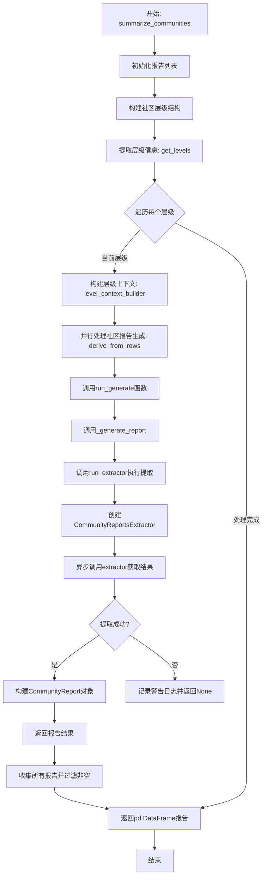
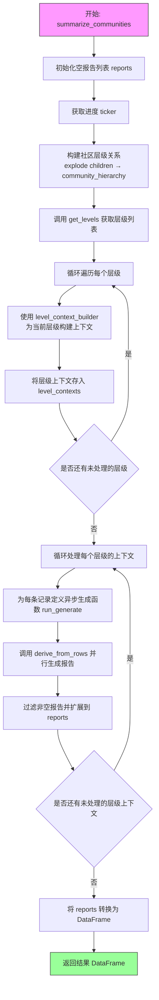
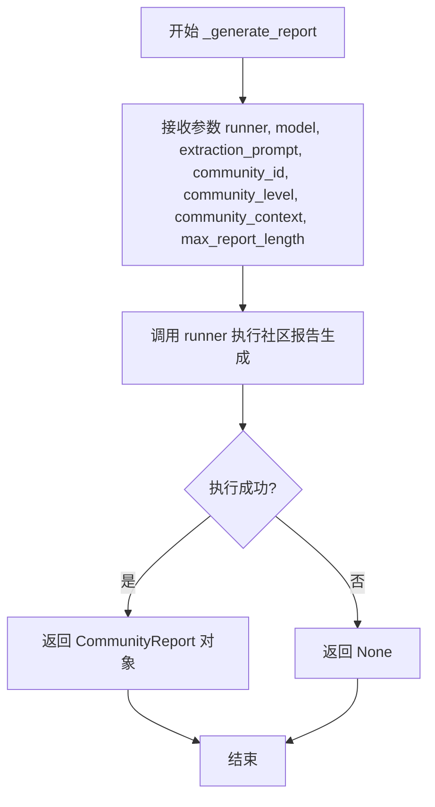
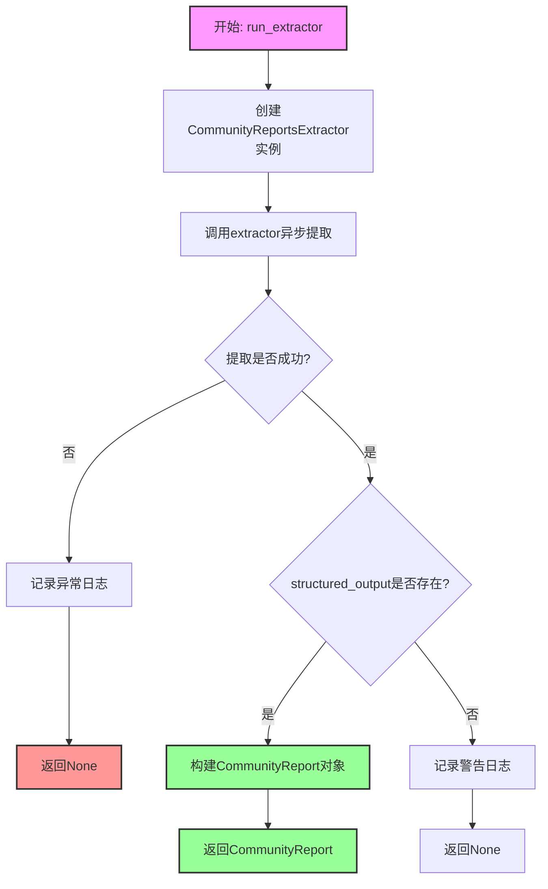
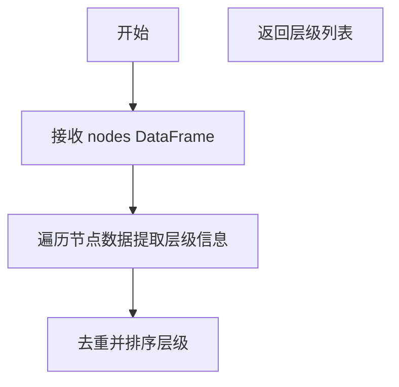
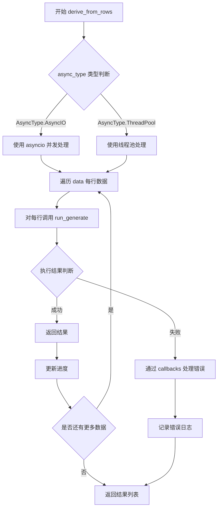
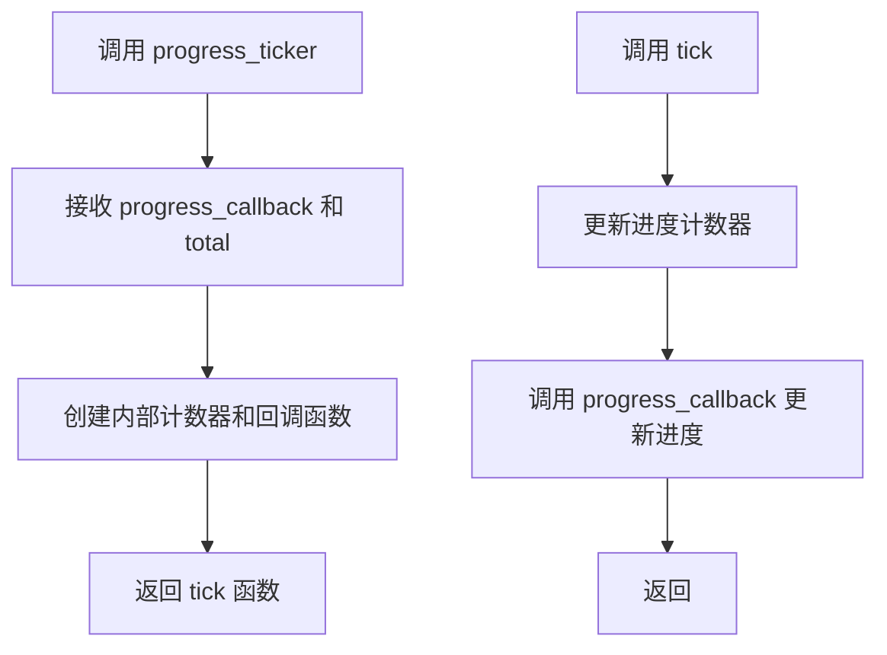
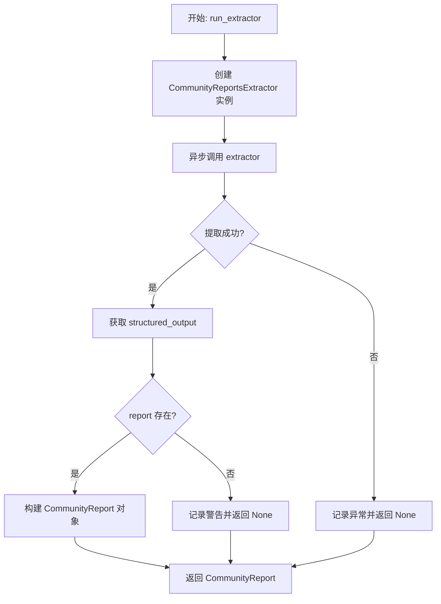

# `graphrag\packages\graphrag\graphrag\index\operations\summarize_communities\summarize_communities.py` 详细设计文档

该模块是GraphRAG索引操作的核心组件,负责从图数据中提取社区信息并生成结构化社区报告。通过异步处理节点和社区数据,利用LLM模型进行上下文理解和内容提取,最终输出包含标题、评级、摘要和关键发现的社区报告。

## 整体流程



## 类结构

```
summarize_communities (模块)
├── summarize_communities (异步主函数)
├── _generate_report (异步内部函数)
└── run_extractor (异步提取器函数)
```

## 全局变量及字段


### `nodes`
    
图节点数据，包含图中所有节点的属性信息

类型：`pd.DataFrame`
    


### `communities`
    
社区数据，包含社区成员和层级关系

类型：`pd.DataFrame`
    


### `local_contexts`
    
本地上下文数据，为每个社区提供上下文信息

类型：`pd.DataFrame`
    


### `level_context_builder`
    
层级上下文构建器，用于为每个层级构建输入上下文

类型：`Callable`
    


### `callbacks`
    
工作流回调，用于报告进度和状态

类型：`WorkflowCallbacks`
    


### `model`
    
LLM模型实例，用于生成社区报告

类型：`LLMCompletion`
    


### `prompt`
    
提取提示词，用于指导LLM生成报告内容

类型：`str`
    


### `tokenizer`
    
分词器，用于计算token数量和控制上下文长度

类型：`Tokenizer`
    


### `max_input_length`
    
最大输入长度，控制上下文的最大token数

类型：`int`
    


### `max_report_length`
    
最大报告长度，控制生成报告的最大token数

类型：`int`
    


### `num_threads`
    
线程数，控制并行处理的任务数

类型：`int`
    


### `async_type`
    
异步类型，指定并发执行的方式

类型：`AsyncType`
    


### `reports`
    
报告列表，存储生成的社区报告

类型：`list[CommunityReport | None]`
    


### `tick`
    
进度回调函数，用于更新进度指示器

类型：`Callable`
    


### `community_hierarchy`
    
社区层级数据框，存储社区的父子层级关系

类型：`pd.DataFrame`
    


### `levels`
    
层级列表，包含所有需要处理的社区层级

类型：`list[int]`
    


### `level_contexts`
    
层级上下文列表，为每个层级构建的输入上下文

类型：`list`
    


### `CommunityReportsExtractor.model`
    
LLM模型实例，用于生成社区报告内容

类型：`LLMCompletion`
    


### `CommunityReportsExtractor.extraction_prompt`
    
提取提示词，指导模型如何提取社区报告信息

类型：`str`
    


### `CommunityReportsExtractor.max_report_length`
    
最大报告长度限制，控制生成报告的token数量

类型：`int`
    


### `CommunityReportsExtractor.on_error`
    
错误处理回调函数，用于记录提取过程中的错误

类型：`Callable`
    


### `CommunityReport.community`
    
社区标识符，唯一标识一个社区

类型：`str | int`
    


### `CommunityReport.full_content`
    
完整内容，LLM生成的原始报告文本

类型：`str`
    


### `CommunityReport.level`
    
社区层级，表示社区在层级结构中的深度

类型：`int`
    


### `CommunityReport.rank`
    
排名分数，表示社区的重要性评级

类型：`float`
    


### `CommunityReport.title`
    
报告标题，社区报告的名称

类型：`str`
    


### `CommunityReport.rating_explanation`
    
评级说明，解释排名的原因和依据

类型：`str`
    


### `CommunityReport.summary`
    
摘要，社区报告的简要概述

类型：`str`
    


### `CommunityReport.findings`
    
发现列表，包含社区中的主要发现和洞察

类型：`list[Finding]`
    


### `CommunityReport.full_content_json`
    
JSON格式的完整内容，便于结构化存储和传输

类型：`str`
    


### `Finding.explanation`
    
解释说明，对发现内容的详细解释

类型：`str`
    


### `Finding.summary`
    
发现摘要，对发现内容的简要总结

类型：`str`
    
    

## 全局函数及方法


### `summarize_communities`

异步主函数，负责协调整个社区摘要生成流程，包括构建社区层级上下文、并行生成各层级社区报告，并最终汇总为结构化数据。

参数：

- `nodes`：`pd.DataFrame`，节点数据表，包含社区的节点信息
- `communities`：`pd.DataFrame`，社区数据表，包含社区层级和子社区关系
- `local_contexts`：本地上下文数据（类型取决于调用方，通常为 pd.DataFrame），提供社区的局部上下文信息
- `level_context_builder`：`Callable`，级别上下文构建器，用于为每个层级构建输入上下文
- `callbacks`：`WorkflowCallbacks`，工作流回调接口，用于报告进度和状态
- `model`：`LLMCompletion`，语言模型实例，用于生成社区报告内容
- `prompt`：`str`，提取社区报告的提示词模板
- `tokenizer`：`Tokenizer`，分词器，用于计算令牌数量和控制上下文长度
- `max_input_length`：`int`，最大输入令牌数限制
- `max_report_length`：`int`，生成的社区报告最大长度
- `num_threads`：`int`，并发处理的线程数
- `async_type`：`AsyncType`，异步执行类型（决定使用 asyncio 或线程池）

返回值：`pd.DataFrame`，包含所有生成的社区报告，字段包括 community、full_content、level、rank、title、rating_explanation、summary、findings、full_content_json 等。

#### 流程图



#### 带注释源码

```python
async def summarize_communities(
    nodes: pd.DataFrame,
    communities: pd.DataFrame,
    local_contexts,  # 类型由调用方决定，通常为 pd.DataFrame
    level_context_builder: Callable,  # 用于构建层级上下文的回调函数
    callbacks: WorkflowCallbacks,  # 工作流进度回调
    model: "LLMCompletion",  # LLM 模型实例
    prompt: str,  # 社区报告提取提示词
    tokenizer: Tokenizer,  # 分词器
    max_input_length: int,  # 最大输入 token 数
    max_report_length: int,  # 最大报告长度
    num_threads: int,  # 并发线程数
    async_type: AsyncType,  # 异步类型
):
    """Generate community summaries."""
    # 初始化空报告列表，用于存储所有层级的社区报告
    reports: list[CommunityReport | None] = []
    
    # 创建进度 ticker，用于报告处理进度
    tick = progress_ticker(callbacks.progress, len(local_contexts))
    
    # 处理社区数据：将 children 列展开为 sub_community，提取层级关系
    # explode("children") 将每个社区的子社区列表展开为多行
    community_hierarchy = (
        communities
        .explode("children")
        .rename({"children": "sub_community"}, axis=1)
        .loc[:, ["community", "level", "sub_community"]]
    ).dropna()  # 移除没有子社区的记录

    # 从节点数据中获取所有层级的列表
    levels = get_levels(nodes)

    # 预构建所有层级的上下文，避免重复计算
    level_contexts = []
    for level in levels:
        # 为每个层级构建输入上下文（包含之前层级的报告信息）
        level_context = level_context_builder(
            pd.DataFrame(reports),  # 当前已有的报告作为上下文
            community_hierarchy_df=community_hierarchy,  # 社区层级关系
            local_context_df=local_contexts,  # 本地上下文
            level=level,  # 当前处理的层级
            tokenizer=tokenizer,  # 分词器
            max_context_tokens=max_input_length,  # 最大上下文 token 数
        )
        level_contexts.append(level_context)

    # 逐层级处理：按层级顺序生成报告，保证依赖关系
    for i, level_context in enumerate(level_contexts):
        # 定义异步生成函数：为单条记录生成社区报告
        async def run_generate(record):
            # 调用 _generate_report 生成单个社区的报告
            result = await _generate_report(
                run_extractor,  # 使用 run_extractor 作为报告生成策略
                community_id=record[schemas.COMMUNITY_ID],  # 社区 ID
                community_level=record[schemas.COMMUNITY_LEVEL],  # 社区层级
                community_context=record[schemas.CONTEXT_STRING],  # 社区上下文
                model=model,  # LLM 模型
                extraction_prompt=prompt,  # 提取提示词
                max_report_length=max_report_length,  # 最大报告长度
            )
            tick()  # 报告进度
            return result

        # 使用 derive_from_rows 并行处理当前层级的所有记录
        # num_threads 控制并发度，async_type 指定异步方式
        local_reports = await derive_from_rows(
            level_context,
            run_generate,
            callbacks=NoopWorkflowCallbacks(),  # 内部使用 noop 回调
            num_threads=num_threads,
            async_type=async_type,
            progress_msg=f"level {levels[i]} summarize communities progress: ",
        )
        
        # 将当前层级的非空报告添加到总报告列表
        reports.extend([lr for lr in local_reports if lr is not None])

    # 将报告列表转换为 DataFrame 并返回
    return pd.DataFrame(reports)
```


### `_generate_report`

这是一个异步辅助函数，用于调用社区报告提取器为单个社区生成报告。它接收社区的ID、级别、上下文以及LLM模型和提示词，然后通过runner策略执行提取，最后返回结构化的社区报告对象。

参数：

- `runner`：`CommunityReportsStrategy`，社区报告策略的运行器，负责实际执行报告生成逻辑
- `model`：`LLMCompletion`，用于生成报告的LLM模型实例
- `extraction_prompt`：`str`，提取提示词，指导LLM如何生成社区报告
- `community_id`：`int`，社区的唯一标识符
- `community_level`：`int`，社区在层级结构中的级别
- `community_context`：`str`，社区的上下文信息，作为LLM生成的输入
- `max_report_length`：`int`，生成报告的最大长度限制

返回值：`CommunityReport | None`，成功时返回包含社区报告详情的CommunityReport对象，失败时返回None

#### 流程图



#### 带注释源码

```python
async def _generate_report(
    runner: CommunityReportsStrategy,  # 社区报告策略运行器，用于执行实际的报告生成
    model: "LLMCompletion",  # LLM模型实例，用于生成报告内容
    extraction_prompt: str,  # 提取提示词，包含生成报告的指令
    community_id: int,  # 社区的唯一标识ID
    community_level: int,  # 社区在层级结构中的级别
    community_context: str,  # 社区的上下文字符串，包含需要分析的信息
    max_report_length: int,  # 生成报告的最大长度限制
) -> CommunityReport | None:
    """Generate a report for a single community."""
    # 调用runner策略，传入社区ID、上下文、级别、模型、提示词和最大长度
    # 返回CommunityReport对象或None（如果生成失败）
    return await runner(
        community_id,
        community_context,
        community_level,
        model,
        extraction_prompt,
        max_report_length,
    )
```


### `run_extractor`

这是一个异步提取器运行函数，执行实际的LLM（大型语言模型）提取逻辑，通过调用 `CommunityReportsExtractor` 来处理输入的社区上下文数据，生成包含社区评级、标题、摘要和发现项的结构化社区报告。

参数：

- `community`：`str | int`，社区的唯一标识符，用于标识正在处理的社区
- `input`：`str`，要提取的社区上下文文本内容，作为LLM提取的输入数据
- `level`：`int`，社区的层级深度，用于报告中的级别信息
- `model`：`LLMCompletion`，LLMCompletion实例，用于执行实际的文本提取和生成任务
- `extraction_prompt`：`str`，提取提示模板，指导LLM如何从输入文本中提取社区报告信息
- `max_report_length`：`int`，生成报告的最大长度限制，用于控制输出文本的规模

返回值：`CommunityReport | None`，成功时返回包含社区完整内容、评级、标题、摘要和发现项的 `CommunityReport` 对象；失败时返回 `None`

#### 流程图



#### 带注释源码

```python
async def run_extractor(
    community: str | int,
    input: str,
    level: int,
    model: "LLMCompletion",
    extraction_prompt: str,
    max_report_length: int,
) -> CommunityReport | None:
    """Run the graph intelligence entity extraction strategy.
    
    执行图智能实体提取策略的异步函数。
    该函数负责调用LLM模型从社区上下文中提取结构化报告信息。
    
    Args:
        community: 社区标识符，str或int类型
        input: 待提取的社区上下文文本内容
        level: 社区层级深度
        model: LLMCompletion模型实例，用于执行提取
        extraction_prompt: 提取提示模板
        max_report_length: 报告最大长度限制
    
    Returns:
        CommunityReport对象或None，取决于提取是否成功
    """
    # 创建CommunityReportsExtractor提取器实例
    # 配置模型、提取提示、最大报告长度和错误处理回调
    extractor = CommunityReportsExtractor(
        model,  # LLM模型实例
        extraction_prompt=extraction_prompt,  # 提取提示模板
        max_report_length=max_report_length,  # 最大报告长度
        # 错误处理lambda：记录提取过程中的错误和堆栈信息
        on_error=lambda e, stack, _data: logger.error(
            "Community Report Extraction Error", exc_info=e, extra={"stack": stack}
        ),
    )

    try:
        # 异步调用extractor处理输入文本
        results = await extractor(input)
        
        # 获取结构化输出结果
        report = results.structured_output
        
        # 检查报告是否存在
        if report is None:
            # 记录警告日志：未找到社区报告
            logger.warning("No report found for community: %s", community)
            return None

        # 成功提取，构建并返回CommunityReport对象
        return CommunityReport(
            community=community,  # 社区标识
            full_content=results.output,  # 完整输出内容
            level=level,  # 社区层级
            rank=report.rating,  # 社区评级
            title=report.title,  # 报告标题
            rating_explanation=report.rating_explanation,  # 评级说明
            summary=report.summary,  # 报告摘要
            # 将提取的发现项转换为Finding对象列表
            findings=[
                Finding(explanation=f.explanation, summary=f.summary)
                for f in report.findings
            ],
            # 报告的JSON序列化形式
            full_content_json=report.model_dump_json(indent=4),
        )
    except Exception:
        # 捕获所有异常，记录详细错误日志并返回None
        logger.exception("Error processing community: %s", community)
        return None
```


根据提供的代码，`get_levels` 函数是从 `graphrag.index.operations.summarize_communities.utils` 模块导入的，但其具体实现源码未包含在给定的代码块中。我只能基于函数的使用方式 `levels = get_levels(nodes)` 和函数名称进行推断。

### `get_levels`

从节点数据中提取层级信息，返回社区的所有层级列表。

参数：

- `nodes`：`pd.DataFrame`，包含节点数据的 DataFrame，通常包含社区相关的层级信息

返回值：`list[int]`，返回社区的层级编号列表

#### 流程图



#### 带注释源码

```python
# 注意: 此函数的实际源码未在给定代码中提供
# 以下为基于函数调用方式的推断

def get_levels(nodes: pd.DataFrame) -> list[int]:
    """从节点数据中提取层级信息。
    
    参数:
        nodes: 包含社区节点信息的 DataFrame，应该包含 'level' 或类似的列
        
    返回:
        排序后的层级编号列表
    """
    # 推断实现逻辑:
    # 1. 从 nodes DataFrame 中提取 level 列
    # 2. 使用 set 去重
    # 3. 排序返回
    levels = nodes['level'].unique().tolist()
    return sorted(levels)
```

> **注意**：由于原始代码中仅导入了该函数而未包含其实现，上述源码为基于函数调用上下文 `levels = get_levels(nodes)` 的合理推断。实际实现可能略有差异，建议查看 `graphrag/index/operations/summarize_communities/utils.py` 文件获取完整源码。


# derive_from_rows 函数提取

由于提供的代码中仅展示了 `derive_from_rows` 函数的导入和使用方式，未包含该函数的完整实现源码，我将基于代码中的使用方式提取相关信息。

### `derive_from_rows`

该函数是一个通用工具函数，用于从数据行中派生结果，支持异步并发处理和进度追踪。它接收一个数据上下文、一个生成函数以及并发控制参数，对每一行数据执行异步处理，最终返回结果列表。

参数：

- `data`：参数类型未知（根据`level_context`推断为`pd.DataFrame`），待处理的数据上下文，通常为DataFrame格式
- `run_generate`：参数类型未知（根据调用推断为`Callable`），用于对每条记录执行异步处理的生成函数
- `callbacks`：参数类型为`WorkflowCallbacks`，工作流回调接口，用于处理进度、状态等事件
- `num_threads`：参数类型为`int`，并发线程数，控制同时处理的任务数量
- `async_type`：参数类型为`AsyncType`，异步类型枚举，指定异步执行模式（如并发或串行）
- `progress_msg`：参数类型为`str`，进度消息前缀，用于显示处理进度

返回值：返回值类型未知（根据使用场景推断为`list[Any]`或`list[CommunityReport | None]`），处理结果列表，可能包含None值

#### 流程图



#### 带注释源码

```
# 注：由于源代码未在提供的代码中包含，以下为基于使用方式推断的函数签名和逻辑

from typing import Any, Callable, Coroutine, TypeVar
from collections.abc import AsyncIterator
import asyncio
from graphrag.callbacks.workflow_callbacks import WorkflowCallbacks
from graphrag.config.enums import AsyncType

T = TypeVar('T')
R = TypeVar('R')

async def derive_from_rows(
    data: pd.DataFrame,  # 输入数据，每行代表一个待处理的记录
    run_generate: Callable[[Any], Coroutine[Any, Any, R]],  # 异步生成函数，对单条记录进行处理
    callbacks: WorkflowCallbacks,  # 工作流回调，用于进度汇报和错误处理
    num_threads: int = 1,  # 并发线程数，控制同时处理的任务数
    async_type: AsyncType = AsyncType.AsyncIO,  # 异步类型，选择并发方式
    progress_msg: str = ""  # 进度消息前缀
) -> list[R | None]:
    """
    从数据行派生结果的通用工具函数。
    
    该函数支持两种异步执行模式：
    1. AsyncIO 模式：使用 Python asyncio 进行并发处理
    2. ThreadPool 模式：使用线程池进行并发处理
    
    处理流程：
    1. 遍历数据的每一行
    2. 对每行调用 run_generate 函数执行异步处理
    3. 通过 callbacks 报告进度
    4. 收集并返回所有结果
    """
    
    results: list[R | None] = []
    
    # 根据 async_type 选择不同的并发处理策略
    if async_type == AsyncType.AsyncIO:
        # 使用 asyncio.gather 并发执行所有任务
        tasks = [run_generate(record) for record in data.itertuples()]
        results = await asyncio.gather(*tasks, return_exceptions=True)
    else:
        # 使用线程池执行器
        with ThreadPoolExecutor(max_workers=num_threads) as executor:
            loop = asyncio.get_event_loop()
            futures = [
                loop.run_in_executor(executor, asyncio.run, run_generate(record))
                for record in data.itertuples()
            ]
            results = await asyncio.gather(*futures, return_exceptions=True)
    
    # 过滤异常并返回结果
    return [r if not isinstance(r, Exception) else None for r in results]
```

### 潜在的技术债务或优化空间

1. **类型注解缺失**：从外部模块导入的 `derive_from_rows` 函数缺乏完整的类型注解，导致调用方需要通过运行时推断参数类型
2. **错误处理机制**：虽然使用了 `NoopWorkflowCallbacks()`，但对于异步执行过程中的异常处理逻辑不够清晰，可能导致部分失败时难以追踪
3. **返回值不确定性**：函数返回的列表中包含 `None` 值，需要调用方进行额外的过滤处理，增加了使用复杂度


### `progress_ticker`

进度追踪回调函数工厂，用于创建一个进度更新回调函数，该函数可以在循环中定期调用以报告进度。

参数：

- `progress_callback`：应该从 `callbacks.progress` 获取，具体类型取决于 `WorkflowCallbacks` 的实现，通常是一个可调用的进度报告函数
- `total`：`int`，需要处理的总项目数（这里传入 `len(local_contexts)` 表示本地上下文的数量）

返回值：`Callable`，返回一个无参数的回调函数，每次调用时会更新进度条

#### 流程图



#### 带注释源码

```python
# 从 graphrag.logger.progress 模块导入 progress_ticker 函数
from graphrag.logger.progress import progress_ticker

# 在 summarize_communities 函数中使用
async def summarize_communities(
    nodes: pd.DataFrame,
    communities: pd.DataFrame,
    local_contexts,
    level_context_builder: Callable,
    callbacks: WorkflowCallbacks,
    model: "LLMCompletion",
    prompt: str,
    tokenizer: Tokenizer,
    max_input_length: int,
    max_report_length: int,
    num_threads: int,
    async_type: AsyncType,
):
    """Generate community summaries."""
    reports: list[CommunityReport | None] = []
    
    # 创建进度追踪回调函数
    # 参数1: callbacks.progress - 工作流进度回调函数
    # 参数2: len(local_contexts) - 需要处理的本地上下文总数
    tick = progress_ticker(callbacks.progress, len(local_contexts))
    
    # ... 后续代码 ...
    
    # 在每次处理完一个社区报告后调用 tick() 来更新进度
    async def run_generate(record):
        result = await _generate_report(
            run_extractor,
            community_id=record[schemas.COMMUNITY_ID],
            community_level=record[schemas.COMMUNITY_LEVEL],
            community_context=record[schemas.CONTEXT_STRING],
            model=model,
            extraction_prompt=prompt,
            max_report_length=max_report_length,
        )
        tick()  # 报告完成一个项目的处理
        return result
```


从提供的代码中，我无法找到 `CommunityReportsExtractor` 类或其 `__call__` 方法的定义。该类是从其他模块导入的（`community_reports_extractor.py`）。

不过，我在代码中找到了使用 `CommunityReportsExtractor` 的地方，即 `run_extractor` 函数。如果您需要我为 `run_extractor` 函数生成文档，请告知。

如果您确实需要 `CommunityReportsExtractor.__call__` 方法的文档，您需要提供该类定义所在的源代码文件。

---


### `run_extractor`

该函数是图智能实体提取策略的运行器，用于对每个社区运行提取器生成社区报告。它接受社区ID、输入文本、层级等参数，实例化 `CommunityReportsExtractor`，异步调用提取器，并将结果转换为 `CommunityReport` 对象返回。

参数：

-  `community`：`str | int`，社区的唯一标识符
-  `input`：`str`，要提取的输入文本（社区上下文）
-  `level`：`int`，社区的层级
-  `model`：`LLMCompletion`，语言模型实例
-  `extraction_prompt`：`str`，用于提取的提示词
-  `max_report_length`：`int`，生成报告的最大长度

返回值：`CommunityReport | None`，成功返回社区报告对象，失败返回 `None`

#### 流程图



#### 带注释源码

```python
async def run_extractor(
    community: str | int,
    input: str,
    level: int,
    model: "LLMCompletion",
    extraction_prompt: str,
    max_report_length: int,
) -> CommunityReport | None:
    """Run the graph intelligence entity extraction strategy."""
    # 创建 CommunityReportsExtractor 实例，传入模型、提取提示词、最大报告长度
    # 并设置错误处理回调，当发生错误时记录日志
    extractor = CommunityReportsExtractor(
        model,
        extraction_prompt=extraction_prompt,
        max_report_length=max_report_length,
        on_error=lambda e, stack, _data: logger.error(
            "Community Report Extraction Error", exc_info=e, extra={"stack": stack}
        ),
    )

    try:
        # 异步调用提取器处理输入
        results = await extractor(input)
        # 获取结构化输出
        report = results.structured_output
        if report is None:
            # 如果没有找到报告，记录警告日志
            logger.warning("No report found for community: %s", community)
            return None

        # 构建并返回 CommunityReport 对象
        return CommunityReport(
            community=community,
            full_content=results.output,
            level=level,
            rank=report.rating,
            title=report.title,
            rating_explanation=report.rating_explanation,
            summary=report.summary,
            # 将报告中的发现转换为 Finding 对象列表
            findings=[
                Finding(explanation=f.explanation, summary=f.summary)
                for f in report.findings
            ],
            full_content_json=report.model_dump_json(indent=4),
        )
    except Exception:
        # 捕获所有异常，记录完整堆栈跟踪
        logger.exception("Error processing community: %s", community)
        return None
```


## 关键组件


### 社区摘要生成模块 (summarize_communities)

这是核心入口函数，通过分层处理社区数据，利用LLM为每个社区生成结构化报告，支持异步并发处理和进度追踪。

### 社区报告提取器 (run_extractor)

封装了CommunityReportsExtractor，负责调用LLM从上下文中提取社区报告，包含完善的异常处理和日志记录，返回标准化的CommunityReport对象。

### 级别上下文构建 (level_context_builder)

通过回调函数为每个社区级别构建输入上下文，管理token限制和上下文数据，准备适合LLM处理的输入格式。

### 社区层次结构处理 (community_hierarchy)

使用pandas的explode和dropna操作将嵌套的children数据转换为扁平的结构化DataFrame，用于追踪社区的层级关系。

### 并发执行引擎 (derive_from_rows)

基于传入的生成函数和异步类型配置，分布式处理各层级社区数据，支持多线程或异步IO模式，提高整体吞吐量。

### 进度追踪机制 (progress_ticker)

通过回调函数报告处理进度，按社区数量tick计数，提供可视化的批处理进度反馈。

### 错误处理与日志系统

集成Python标准logging模块，为提取失败和异常情况提供结构化日志记录，包含堆栈信息和上下文数据。

### 数据模型与类型契约

定义CommunityReport、Finding等数据结构，规范输入输出格式，确保LLM调用结果的一致性和可验证性。


## 问题及建议


### 已知问题

- **变量名遮蔽内置函数**：在`run_extractor`函数中，参数名`input`遮蔽了Python内置的`input`函数，可能导致意外的代码维护问题
- **循环内嵌套函数定义效率低**：在`for`循环内定义`run_generate`异步函数，每一轮循环都会重新定义该函数，造成不必要的函数对象创建开销
- **闭包变量捕获潜在风险**：`run_generate`闭包捕获了外部的`tick`回调，虽然当前实现中`tick`在循环外被定义，但这种模式在代码演进时容易引入变量捕获错误
- **异常处理过于宽泛**：`run_extractor`中使用`except Exception`捕获所有异常并仅记录日志后返回`None`，无法区分可恢复错误和不可恢复错误，可能导致静默失败难以调试
- **无任务取消支持**：异步操作未实现取消机制，在大规模数据处理时无法优雅地中断长时间运行的任务
- **进度回调可能失效**：`tick()`在异步内部函数中调用，如果`derive_from_rows`以某种方式缓存或预计算，可能导致进度更新不准确或重复计数

### 优化建议

- **重构嵌套函数**：将`run_generate`提取到模块级别或使用`functools.partial`传递上下文参数，避免循环内重复定义
- **改进错误处理策略**：实现分级异常处理，对超时、网络错误等可重试异常进行重试逻辑，对数据格式错误等异常进行明确记录
- **添加取消令牌支持**：在异步函数签名中引入`asyncio.CancellationToken`或类似的取消机制，使外部调用者能够中断执行
- **统一进度报告接口**：使用生成器模式或回调队列替代直接回调，确保进度报告的准确性和有序性
- **考虑流式处理**：对于大规模社区报告生成，考虑使用异步生成器流式返回结果，避免将所有报告加载到内存后再转换为DataFrame

## 其它


### 设计目标与约束

本模块的设计目标是异步批量生成社区摘要报告，通过分层处理社区数据并利用LLM模型提取结构化信息，最终输出包含标题、评级、摘要和发现结果的社区报告DataFrame。核心约束包括：需在限定token数内完成上下文处理，生成的报告长度受限，依赖特定的社区层级结构，且错误处理采用静默失败策略（记录日志但继续处理）。

### 错误处理与异常设计

模块采用分层错误处理机制。在`run_extractor`函数中使用try-except捕获所有异常，通过logger.exception记录完整堆栈信息并返回None实现静默失败；回调函数通过NoopWorkflowCallbacks()抑制进度更新；LLM调用错误通过on_error回调处理。关键缺陷是错误发生时缺少重试机制，且未区分可恢复错误与不可恢复错误，可能导致部分社区报告缺失但无法追溯。

### 数据流与状态机

数据流为：输入nodes和communities DataFrame → 构建community_hierarchy层级表 → 根据levels分批构建level_context → 并发调用_generate_report处理每个社区 → 聚合reports并输出。没有显式状态机，但存在隐式状态转换：初始化 → 层级迭代 → 报告生成 → 结果聚合。

### 外部依赖与接口契约

核心依赖包括：graphrag_llm.tokenizer.Tokenizer用于token计数；graphrag.index.operations.summarize_communities模块内的CommunityReportsExtractor、CommunityReportsStrategy、CommunityReport、CommunityReportsStrategy、Finding等类型；graphrag.callbacks.WorkflowCallbacks工作流回调；LLMCompletion模型接口。接口契约要求nodes必须包含社区级别字段，communities需有children列展开为子社区，local_contexts需包含社区上下文字符串。

### 配置参数说明

关键配置参数包括：max_input_length限制单次LLM调用的token上限；max_report_length限制生成报告的最大长度；num_threads控制并发线程数；async_type指定异步类型（AsyncType枚举）；prompt为LLM提取报告的提示词模板；tokenizer用于计算token消耗以动态调整上下文。

### 性能考量与优化空间

当前实现存在性能瓶颈：每次level迭代都重新定义内部async函数run_generate导致函数对象开销；level_contexts一次性构建所有层级上下文可能造成内存峰值；derive_from_rows的并发度未根据社区数量动态调整。建议优化方向：提取run_generate到模块级避免重复创建；采用生成器按需构建level_context；添加基于社区数量的自适应并发策略；考虑使用缓存避免重复的LLM调用。

    