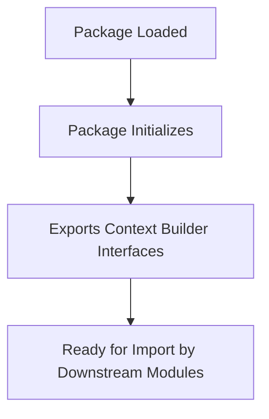

# `graphrag\packages\graphrag\graphrag\index\operations\summarize_communities\text_unit_context\__init__.py` 详细设计文档

这是一个用于基于文本单元(text unit)的报告(Reports)的上下文构建器(Context Builders)包。该包是微软开源项目的一部分，提供了构建报告所需的上下文信息封装功能。

## 整体流程



## 类结构

```

```

## 全局变量及字段


    

## 全局函数及方法


## 关键组件


### 模块概述

该代码为 Microsoft 上下文构建器包的初始化文件，用于为基于文本单元的报告构建上下文信息，属于空模块定义文件。

### 关键组件信息

由于提供的代码仅为包初始化文件（`__init__.py`），仅包含版权声明和模块文档字符串，未包含具体的类、函数、变量等实现代码，因此无法识别"张量索引与惰性加载、反量化支持、量化策略"等组件。

### 文件整体运行流程

该文件作为 Python 包的入口点，在导入时会执行包初始化逻辑，但当前代码不包含任何可执行语句。

### 类详细信息

无（代码中未定义任何类）

### 全局变量和全局函数

无（代码中未定义任何全局变量或函数）

### 潜在的技术债务或优化空间

由于代码仅包含文档字符串，建议后续补充：
- 文本单元上下文构建器的核心类设计
- 惰性加载机制的实现
- 量化/反量化支持模块
- 错误处理与异常设计
- 外部依赖与接口契约

### 其它项目

- **设计目标**：为基于文本单元的报告提供上下文构建能力
- **约束**：基于 MIT License 开源协议
- **错误处理**：未实现
- **数据流与状态机**：未实现
- **外部依赖与接口契约**：未定义


## 问题及建议


### 已知问题

- 缺少模块导出定义：`__init__.py` 文件中未包含任何 `__all__` 变量或实际导入语句，无法明确该包对外暴露的接口
- 文档信息不足：模块级 docstring 仅包含一句话描述，未说明具体功能、包含的子模块及使用示例
- 版权年份固定：Copyright 声明使用 2024 年，需定期更新以反映维护状态

### 优化建议

- 补充完整的模块文档：在 docstring 中添加包的使用说明、主要功能描述、包含的子模块清单及简单使用示例
- 显式定义公共接口：使用 `__all__` 明确列出公开的类和函数，便于 IDE 智能提示和静态分析工具使用
- 添加版本管理：可引入 `__version__` 变量或集成 `setuptools-scm` 等版本管理工具
- 补充类型注解支持：若包内实现了具体模块，建议在 `__init__.py` 中使用 `from __future__ import annotations` 以提高类型兼容性


## 其它


### 设计目标与约束

设计目标：本包旨在为基于文本单元的报告提供上下文构建功能，支持模块化、可扩展的上下文管理，适用于需要根据文本内容生成对应报告场景的AI应用或数据处理管道。

约束条件：需遵循MIT开源许可证约束；应保持与上游Microsoft生态系统的兼容性；模块设计需考虑轻量级依赖原则。

### 错误处理与异常设计

由于当前代码仅为模块占位符，暂未定义具体异常类。建议后续实现时定义自定义异常层次结构，如ContextBuilderError作为基类，下设BuildError、ValidationError、ConfigurationError等子类，统一继承自Python内置Exception或自定义业务异常基类。

### 数据流与状态机

当前无实际数据流实现。根据模块描述推测，数据流可能涉及：输入文本单元→上下文构建器→输出上下文对象→报告生成器。状态机可能包含：初始化状态→构建中状态→完成状态→错误状态。

### 外部依赖与接口契约

当前模块无外部依赖声明。建议后续实现时明确依赖项，如需要NLP库、报告生成库等。接口契约应定义ContextBuilder基类或协议规范，包括build_context(text_unit)方法、validate_input(data)方法等。

### 性能要求与约束

由于缺乏实现代码，暂无具体性能指标。建议后续设计时考虑：上下文构建的时延需满足实时或近实时需求；内存占用需控制在合理范围内；支持批量处理以提高吞吐量。

### 安全与隐私考虑

当前代码无安全相关实现。后续应考虑：输入数据验证以防止注入攻击；敏感信息脱敏处理；遵循数据最小化原则；如涉及用户数据需明确数据处理声明。

### 测试策略

建议后续实现时包含：单元测试覆盖核心上下文构建逻辑；集成测试验证与上下游组件的协作；性能测试评估大规模文本单元处理能力；Mock对象用于隔离外部依赖。

### 部署与配置

当前为纯Python包，建议通过pyproject.toml或setup.py定义包分发配置。配置管理可采用环境变量或独立配置文件方式，支持不同部署环境（开发、测试、生产）的差异化配置。

### 版本兼容性与迁移策略

当前版本为0.1.0或未定义。建议遵循语义化版本规范（SemVer）。重大变更需提供迁移指南，保留历史版本支持以便用户过渡。

### 监控与可观测性

建议后续实现添加：日志记录机制覆盖关键操作路径；指标导出（如使用Prometheus）用于监控构建器性能；追踪支持（如OpenTelemetry）用于分布式场景下的请求链路分析。

    