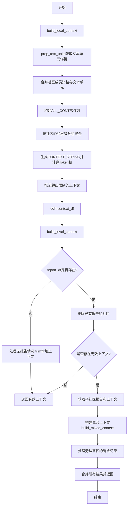
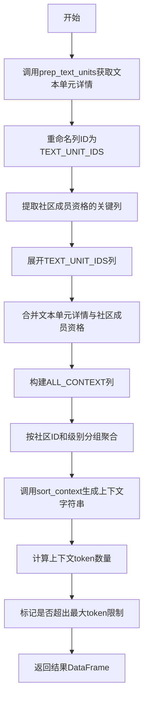
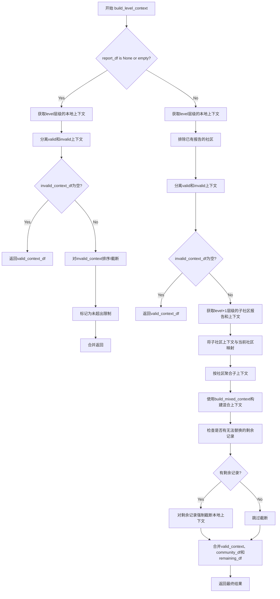

# `graphrag\packages\graphrag\graphrag\index\operations\summarize_communities\text_unit_context\context_builder.py` 详细设计文档

该模块提供社区报告生成的上下文构建功能，包括build_local_context用于基于文本单元准备本地上下文，以及build_level_context用于根据层级关系管理和替换上下文内容，确保上下文Token数量不超过限制。

## 整体流程



## 类结构

```
该文件为纯函数模块，无类定义
└── 模块: context_builder (context_builder.py)
    ├── 函数: build_local_context
    └── 函数: build_level_context
```

## 全局变量及字段


### `logger`
    
模块级日志记录器，用于记录该模块运行过程中的日志信息

类型：`logging.Logger`
    


    

## 全局函数及方法


### `build_local_context`

该函数用于为社区报告生成准备上下文数据，通过合并社区成员资格、文本单元和节点信息，计算每个社区的上下文字符串、上下文大小，并标记是否超出最大token限制。

参数：

- `community_membership_df`：`pd.DataFrame`，社区成员资格数据框，包含列 [COMMUNITY_ID, COMMUNITY_LEVEL, ENTITY_IDS, RELATIONSHIP_IDS, TEXT_UNIT_IDS]
- `text_units_df`：`pd.DataFrame`，文本单元数据框，提供文本内容
- `node_df`：`pd.DataFrame`，节点数据框，用于计算实体度数
- `tokenizer`：`Tokenizer`，分词器对象，用于计算token数量和排序上下文
- `max_context_tokens`：`int`，可选参数，默认值为 16000，最大上下文token数限制

返回值：`pd.DataFrame`，包含社区ID、社区级别、上下文字符串（CONTEXT_STRING）、上下文大小（CONTEXT_SIZE）和是否超出限制标志（CONTEXT_EXCEED_FLAG）的DataFrame

#### 流程图



#### 带注释源码

```python
def build_local_context(
    community_membership_df: pd.DataFrame,
    text_units_df: pd.DataFrame,
    node_df: pd.DataFrame,
    tokenizer: Tokenizer,
    max_context_tokens: int = 16000,
) -> pd.DataFrame:
    """
    Prep context data for community report generation using text unit data.

    Community membership has columns [COMMUNITY_ID, COMMUNITY_LEVEL, ENTITY_IDS, RELATIONSHIP_IDS, TEXT_UNIT_IDS]
    """
    # 获取文本单元详情，包括short_id、text和entity_degree
    # entity_degree是文本单元所属节点的度数之和
    prepped_text_units_df = prep_text_units(text_units_df, node_df)
    
    # 重命名列以匹配schemas定义的命名规范
    prepped_text_units_df = prepped_text_units_df.rename(
        columns={
            schemas.ID: schemas.TEXT_UNIT_IDS,
            schemas.COMMUNITY_ID: schemas.COMMUNITY_ID,
        }
    )

    # 从社区成员资格中提取关键列：社区ID、社区级别、文本单元ID
    context_df = community_membership_df.loc[
        :, [schemas.COMMUNITY_ID, schemas.COMMUNITY_LEVEL, schemas.TEXT_UNIT_IDS]
    ]
    
    # 展开文本单元ID列，使每个文本单元对应一行
    context_df = context_df.explode(schemas.TEXT_UNIT_IDS)
    
    # 将文本单元详情与社区成员资格合并，基于文本单元ID和社区ID
    context_df = context_df.merge(
        prepped_text_units_df,
        on=[schemas.TEXT_UNIT_IDS, schemas.COMMUNITY_ID],
        how="left",
    )

    # 构建ALL_CONTEXT列，包含id、text和entity_degree信息
    context_df[schemas.ALL_CONTEXT] = context_df.apply(
        lambda x: {
            "id": x[schemas.ALL_DETAILS][schemas.SHORT_ID],
            "text": x[schemas.ALL_DETAILS][schemas.TEXT],
            "entity_degree": x[schemas.ALL_DETAILS][schemas.ENTITY_DEGREE],
        },
        axis=1,
    )

    # 按社区ID和社区级别分组，将上下文聚合为列表
    context_df = (
        context_df
        .groupby([schemas.COMMUNITY_ID, schemas.COMMUNITY_LEVEL])
        .agg({schemas.ALL_CONTEXT: list})
        .reset_index()
    )
    
    # 使用sort_context函数生成上下文字符串
    context_df[schemas.CONTEXT_STRING] = context_df[schemas.ALL_CONTEXT].apply(
        lambda x: sort_context(x, tokenizer)
    )
    
    # 计算上下文字符串的token数量
    context_df[schemas.CONTEXT_SIZE] = context_df[schemas.CONTEXT_STRING].apply(
        lambda x: tokenizer.num_tokens(x)
    )
    
    # 标记是否超出最大token限制
    context_df[schemas.CONTEXT_EXCEED_FLAG] = context_df[schemas.CONTEXT_SIZE].apply(
        lambda x: x > max_context_tokens
    )

    return context_df
```


### `build_level_context`

该函数为社区层级报告生成准备上下文数据。对于每个社区，它检查本地上下文是否在令牌限制内，如果超出限制，则迭代地用子社区报告替换上下文，从最大的子社区开始，直到满足令牌约束。

参数：

- `report_df`：`pd.DataFrame | None`，包含社区报告的DataFrame，可为None
- `community_hierarchy_df`：`pd.DataFrame`，社区层级结构数据，包含社区ID和层级信息
- `local_context_df`：`pd.DataFrame`，预处理后的本地上下文数据
- `level`：`int`，要处理的社区层级
- `tokenizer`：`Tokenizer`，用于计算令牌数和排序上下文的分词器
- `max_context_tokens`：`int = 16000`，上下文的最大令牌数限制

返回值：`pd.DataFrame`，处理后的上下文DataFrame，包含CONTEXT_STRING、CONTEXT_SIZE和CONTEXT_EXCEED_FLAG等列

#### 流程图



#### 带注释源码

```python
def build_level_context(
    report_df: pd.DataFrame | None,
    community_hierarchy_df: pd.DataFrame,
    local_context_df: pd.DataFrame,
    level: int,
    tokenizer: Tokenizer,
    max_context_tokens: int = 16000,
) -> pd.DataFrame:
    """
    Prep context for each community in a given level.

    For each community:
    - Check if local context fits within the limit, if yes use local context
    - If local context exceeds the limit, iteratively replace local context with sub-community reports, starting from the biggest sub-community
    """
    # Case 1: 没有报告可用（最底层社区，无子社区）
    if report_df is None or report_df.empty:
        # 获取当前层级的本地上下文
        level_context_df = local_context_df[
            local_context_df[schemas.COMMUNITY_LEVEL] == level
        ]

        # 分离有效（未超限）和无效（超限）上下文
        valid_context_df = cast(
            "pd.DataFrame",
            level_context_df[~level_context_df[schemas.CONTEXT_EXCEED_FLAG]],
        )
        invalid_context_df = cast(
            "pd.DataFrame",
            level_context_df[level_context_df[schemas.CONTEXT_EXCEED_FLAG]],
        )

        # 如果没有无效上下文，直接返回有效上下文
        if invalid_context_df.empty:
            return valid_context_df

        # 对无效上下文进行排序和截断以适应token限制
        invalid_context_df.loc[:, [schemas.CONTEXT_STRING]] = invalid_context_df[
            schemas.ALL_CONTEXT
        ].apply(
            lambda x: sort_context(x, tokenizer, max_context_tokens=max_context_tokens)
        )
        invalid_context_df.loc[:, [schemas.CONTEXT_SIZE]] = invalid_context_df[
            schemas.CONTEXT_STRING
        ].apply(lambda x: tokenizer.num_tokens(x))
        invalid_context_df.loc[:, [schemas.CONTEXT_EXCEED_FLAG]] = False

        # 合并有效和截断后的无效上下文并返回
        return pd.concat([valid_context_df, invalid_context_df])

    # Case 2: 有报告可用，尝试用子社区报告替换超限的本地上下文
    # 获取当前层级的本地上下文
    level_context_df = local_context_df[
        local_context_df[schemas.COMMUNITY_LEVEL] == level
    ]

    # 排除已经生成报告的社区（只处理没有报告的社区）
    level_context_df = level_context_df.merge(
        report_df[[schemas.COMMUNITY_ID]],
        on=schemas.COMMUNITY_ID,
        how="outer",
        indicator=True,
    )
    level_context_df = level_context_df[level_context_df["_merge"] == "left_only"].drop(
        "_merge", axis=1
    )
    
    # 分离有效和无效上下文
    valid_context_df = cast(
        "pd.DataFrame",
        level_context_df[level_context_df[schemas.CONTEXT_EXCEED_FLAG] is False],
    )
    invalid_context_df = cast(
        "pd.DataFrame",
        level_context_df[level_context_df[schemas.CONTEXT_EXCEED_FLAG] is True],
    )

    # 如果没有无效上下文，直接返回
    if invalid_context_df.empty:
        return valid_context_df

    # 获取下一层级的子社区报告和上下文用于替换
    sub_report_df = report_df[report_df[schemas.COMMUNITY_LEVEL] == level + 1].drop(
        [schemas.COMMUNITY_LEVEL], axis=1
    )
    sub_context_df = local_context_df[
        local_context_df[schemas.COMMUNITY_LEVEL] == level + 1
    ]
    sub_context_df = sub_context_df.merge(
        sub_report_df, on=schemas.COMMUNITY_ID, how="left"
    )
    sub_context_df.rename(
        columns={schemas.COMMUNITY_ID: schemas.SUB_COMMUNITY}, inplace=True
    )

    # 收集所有子社区的上下文信息
    community_df = community_hierarchy_df[
        community_hierarchy_df[schemas.COMMUNITY_LEVEL] == level
    ].drop([schemas.COMMUNITY_LEVEL], axis=1)
    community_df = community_df.merge(
        invalid_context_df[[schemas.COMMUNITY_ID]], on=schemas.COMMUNITY_ID, how="inner"
    )
    community_df = community_df.merge(
        sub_context_df[
            [
                schemas.SUB_COMMUNITY,
                schemas.FULL_CONTENT,
                schemas.ALL_CONTEXT,
                schemas.CONTEXT_SIZE,
            ]
        ],
        on=schemas.SUB_COMMUNITY,
        how="left",
    )
    community_df[schemas.ALL_CONTEXT] = community_df.apply(
        lambda x: {
            schemas.SUB_COMMUNITY: x[schemas.SUB_COMMUNITY],
            schemas.ALL_CONTEXT: x[schemas.ALL_CONTEXT],
            schemas.FULL_CONTENT: x[schemas.FULL_CONTENT],
            schemas.CONTEXT_SIZE: x[schemas.CONTEXT_SIZE],
        },
        axis=1,
    )
    # 按社区聚合子上下文
    community_df = (
        community_df
        .groupby(schemas.COMMUNITY_ID)
        .agg({schemas.ALL_CONTEXT: list})
        .reset_index()
    )
    # 使用混合上下文策略构建新上下文
    community_df[schemas.CONTEXT_STRING] = community_df[schemas.ALL_CONTEXT].apply(
        lambda x: build_mixed_context(x, tokenizer, max_context_tokens)
    )
    community_df[schemas.CONTEXT_SIZE] = community_df[schemas.CONTEXT_STRING].apply(
        lambda x: tokenizer.num_tokens(x)
    )
    community_df[schemas.CONTEXT_EXCEED_FLAG] = False
    community_df[schemas.COMMUNITY_LEVEL] = level

    # 处理无法用子社区报告替换的剩余记录
    remaining_df = invalid_context_df.merge(
        community_df[[schemas.COMMUNITY_ID]],
        on=schemas.COMMUNITY_ID,
        how="outer",
        indicator=True,
    )
    remaining_df = remaining_df[remaining_df["_merge"] == "left_only"].drop(
        "_merge", axis=1
    )
    # 强制截断本地上下文
    remaining_df[schemas.CONTEXT_STRING] = cast(
        "pd.DataFrame", remaining_df[schemas.ALL_CONTEXT]
    ).apply(lambda x: sort_context(x, tokenizer, max_context_tokens=max_context_tokens))
    remaining_df[schemas.CONTEXT_SIZE] = cast(
        "pd.DataFrame", remaining_df[schemas.CONTEXT_STRING]
    ).apply(lambda x: tokenizer.num_tokens(x))
    remaining_df[schemas.CONTEXT_EXCEED_FLAG] = False

    # 合并所有结果返回
    return cast(
        "pd.DataFrame", pd.concat([valid_context_df, community_df, remaining_df])
    )
```

## 关键组件


### 张量索引与惰性加载

该模块不直接涉及张量索引与惰性加载，主要处理DataFrame数据结构的索引和筛选操作。

### 反量化支持

该模块不涉及反量化操作。

### 量化策略

该模块不涉及量化策略。

### build_local_context 函数

构建本地上下文数据，用于社区报告生成。该函数接收社区成员资格、文本单元和节点数据，通过prep_text_units准备文本单元详情，合并社区成员资格数据，构建包含id、text和entity_degree的上下文对象，按社区ID和层级分组，最终生成上下文字符串、令牌数统计和超限标志。

### build_level_context 函数

为社区层次结构中的指定层级准备上下文数据。对于每个社区，检查本地上下文是否在令牌限制内；如果本地上下文超限，则迭代地用子社区报告替换，从最大的子社区开始尝试替换，最终返回包含有效和无效（已处理）上下文的DataFrame。

### prep_text_units 函数（导入）

准备文本单元详情，包含短ID、文本和实体度数信息。

### sort_context 函数（导入）

对上下文进行排序，可能涉及令牌限制的处理。

### build_mixed_context 函数（导入）

构建混合上下文，可能用于合并多种上下文来源。


## 问题及建议


### 已知问题

-   **过度使用类型强制转换 (cast)**：代码中多处使用 `cast("pd.DataFrame", ...)` 进行类型转换，这种做法可能掩盖潜在的运行时错误，降低类型安全性的同时，也使得代码维护更加困难。
-   **DataFrame _apply_ 性能瓶颈**：大量使用 `.apply(lambda x: ...)` 进行逐行操作，这在处理大规模数据时效率较低，应优先考虑向量化操作或更高效的 pandas/numpy 方法。
-   **魔法字符串与重复字面量**：代码中多处使用字符串字面量如 `"_merge"`，且在 merge 操作中重复指定列名，增加了拼写错误的风险，也降低了代码的可维护性。
-   **重复代码模式**：`sort_context` 调用和 token 数计算逻辑在多个位置重复出现，未抽取为可复用的公共函数。
-   **缺乏输入验证**：函数没有对输入的 DataFrame 进行有效性检查（如必需的列是否存在），可能导致难以追踪的运行时错误。
-   **异常处理缺失**：代码中没有 try-except 块来捕获和处理潜在的异常情况（如 merge 失败、tokenizer 调用异常等）。
-   **变量命名与语义不清晰**：部分中间变量命名冗长或语义不明确，如混合使用 `ALL_CONTEXT`、`FULL_CONTENT` 等字段名，增加了理解成本。

### 优化建议

-   **移除不必要的 cast**：通过改进 DataFrame 操作逻辑或在必要时进行真正有效的类型检查，而非依赖强制类型转换。
-   **重构为向量化操作**：将基于 apply 的逐行处理替换为 pandas 向量化操作，或使用 `transform`、`map` 等更高效的方法，提升性能。
-   **提取常量与公共函数**：将重复的列名字符串、merge 逻辑、token 计算等抽取为模块级常量或独立函数，减少代码重复。
-   **增强输入验证**：在函数入口处添加 DataFrame 和列名的有效性验证，提供清晰的错误信息。
-   **添加异常处理**：针对可能的异常情况（如数据为空、列不存在）添加适当的异常捕获和处理逻辑。
-   **简化复杂链式操作**：将过长的 DataFrame 操作链拆分为多个中间步骤，添加注释以提升可读性。

## 其它


### 设计目标与约束

本模块的设计目标是为图谱社区报告生成提供上下文构建能力，通过文本单元数据准备上下文，并支持分层级的上下文管理。主要约束包括：1）上下文大小受max_context_tokens参数限制（默认16000 tokens）；2）需要依赖外部的tokenizer进行token计数；3）数据处理主要依赖pandas DataFrame结构；4）社区层级关系需要通过community_hierarchy_df维护。

### 错误处理与异常设计

代码中主要通过以下方式处理异常情况：1）当report_df为空或为空DataFrame时，直接对本地上下文进行trim处理；2）使用cast类型转换确保类型安全；3）对于无法用子社区报告替换的剩余记录，会进行最终的trim处理返回空值检查：使用df.empty和布尔标志位CONTEXT_EXCEED_FLAG进行状态判断。

### 数据流与状态机

数据流主要分为两个阶段：1）build_local_context阶段：将text_units_df和node_df合并，生成每个社区的本地上下文字符串，计算token数量并标记是否超出限制；2）build_level_context阶段：根据社区层级判断，如果本地上下文超出限制，则尝试用子社区报告替换，最终返回包含CONTEXT_STRING、CONTEXT_SIZE、CONTEXT_EXCEED_FLAG等字段的DataFrame。状态转换：通过CONTEXT_EXCEED_FLAG标记每个社区的上下文是否需要替换操作。

### 外部依赖与接口契约

主要外部依赖包括：1）pandas库用于数据处理；2）graphrag_llm.tokenizer.Tokenizer用于token计数；3）graphrag.data_model.schemas作为数据模式定义；4）内部模块build_mixed_context、prep_text_units、sort_context提供辅助功能。输入契约：community_membership_df需包含COMMUNITY_ID、COMMUNITY_LEVEL、TEXT_UNIT_IDS列；text_units_df需包含ID和TEXT列；node_df用于计算实体度数。

### 性能考虑与优化空间

当前实现使用大量的apply lambda操作，可能存在性能瓶颈。优化方向：1）向量化操作替代部分apply调用；2）对于大型数据集可考虑分批处理；3）context_df的多次merge操作可以优化合并顺序；4）可以考虑缓存中间结果避免重复计算。当前默认的16000 tokens限制较高，可能需要根据实际模型上下文窗口调整。

### 安全性考虑

本模块主要处理数据拼接和文本处理，未直接涉及用户输入验证或敏感数据操作。安全关注点：1）确保传入的DataFrame结构符合schema要求；2）避免注入攻击（虽然当前是内部模块）；3）日志记录不包含敏感信息。

### 可测试性设计

测试策略建议：1）使用mock数据构造不同规模的测试用例；2）边界条件测试：空DataFrame、单条记录、超过token限制的情况；3）层级边界测试：顶级社区、叶子社区；4）集成测试：验证与build_mixed_context等下游模块的配合。测试数据应覆盖正常流程和异常流程。

### 配置参数说明

关键配置参数包括：1）max_context_tokens：最大上下文token数，默认16000，用于控制单个社区的上下文大小；2）level：社区层级，用于build_level_context中筛选特定层级的社区；3）tokenizer：Tokenizer实例，用于计算token数量和排序上下文。

### 使用示例

示例1 - 构建本地上下文：result = build_local_context(community_membership_df, text_units_df, node_df, tokenizer, max_context_tokens=16000)。示例2 - 构建层级上下文：result = build_level_context(report_df, community_hierarchy_df, local_context_df, level=1, tokenizer)。返回的DataFrame包含COMMUNITY_ID、COMMUNITY_LEVEL、CONTEXT_STRING、CONTEXT_SIZE、CONTEXT_EXCEED_FLAG等字段。

### 术语表

Text Unit：文本单元，图谱中的基本语义单元。Community：社区，由相关实体和关系组成的分组。Context String：上下文字符串，用于报告生成的文本内容。Entity Degree：实体度数，节点的重要性指标。Sub-community Report：子社区报告，用于替换超出限制的本地上下文。

    