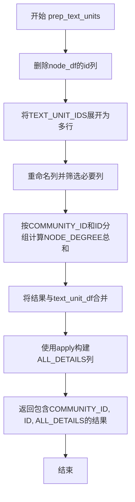
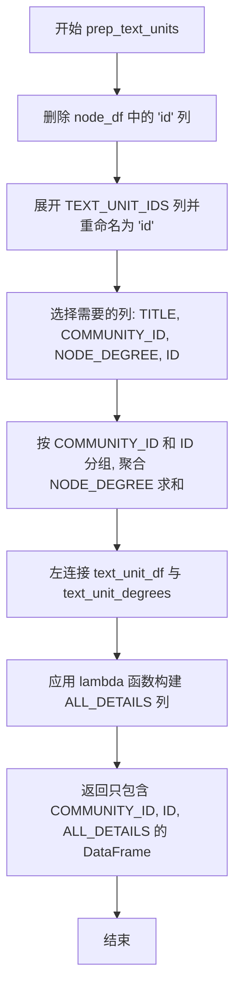

# `graphrag\packages\graphrag\graphrag\index\operations\summarize_communities\text_unit_context\prep_text_units.py` 详细设计文档

该模块用于准备社区报告的文本单元数据，通过计算文本单元的度数（degree）并将文本单元详情进行聚合，最终输出包含社区ID、文本单元ID和完整详情的DataFrame。

## 整体流程



## 类结构

```
模块: prep_text_units (无类定义)
└── 函数: prep_text_units
```

## 全局变量及字段


### `logger`
    
模块级日志记录器，用于记录函数执行过程中的日志信息

类型：`logging.Logger`
    


### `schemas`
    
graphrag.data_model.schemas数据模式模块，定义数据模型的结构和字段常量

类型：`module`
    


### `pd`
    
数据处理库，用于DataFrame操作和数据处理

类型：`pandas`
    


    

## 全局函数及方法


### `prep_text_units`

该函数用于计算文本单元的度数（degree）并聚合文本单元的详细信息，返回包含社区ID、文本单元ID和完整详情的DataFrame。

参数：

- `text_unit_df`：`pd.DataFrame`，文本单元数据框，包含文本单元的基本信息
- `node_df`：`pd.DataFrame`，节点数据框，包含节点与文本单元的关联关系及度数信息

返回值：`pd.DataFrame`，返回包含 `COMMUNITY_ID`、`TEXT_UNIT_ID`、`ALL_DETAILS` 三列的数据框，其中 `ALL_DETAILS` 包含短ID、文本内容和实体度数的聚合信息

#### 流程图



#### 带注释源码

```python
# 版权声明和许可协议
# Copyright (c) 2024 Microsoft Corporation.
# Licensed under the MIT License

"""Prepare text units for community reports."""
# 模块文档字符串，说明该文件用于准备社区报告的文本单元

import logging
# 导入日志模块，用于记录运行时信息

import pandas as pd
# 导入 pandas 库，用于数据处理

import graphrag.data_model.schemas as schemas
# 导入图数据模型模式定义，包含列名常量

logger = logging.getLogger(__name__)
# 初始化当前模块的日志记录器


def prep_text_units(
    text_unit_df: pd.DataFrame,
    node_df: pd.DataFrame,
) -> pd.DataFrame:
    """
    Calculate text unit degree  and concatenate text unit details.

    Returns : dataframe with columns [COMMUNITY_ID, TEXT_UNIT_ID, ALL_DETAILS]
    """
    # 函数文档：计算文本单元度数并拼接文本单元详情
    # 返回包含 COMMUNITY_ID, TEXT_UNIT_ID, ALL_DETAILS 列的数据框
    
    # 步骤1: 删除 node_df 中的 'id' 列（inplace=True 表示直接修改原数据框）
    node_df.drop(columns=["id"], inplace=True)
    
    # 步骤2: 展开 TEXT_UNIT_IDS 列，将每个节点对应的多个文本单元ID展开为多行
    # 并将列名从 TEXT_UNIT_IDS 重命名为 ID
    node_to_text_ids = node_df.explode(schemas.TEXT_UNIT_IDS).rename(
        columns={schemas.TEXT_UNIT_IDS: schemas.ID}
    )
    
    # 步骤3: 选择需要的列：TITLE, COMMUNITY_ID, NODE_DEGREE, ID
    node_to_text_ids = node_to_text_ids[
        [schemas.TITLE, schemas.COMMUNITY_ID, schemas.NODE_DEGREE, schemas.ID]
    ]
    
    # 步骤4: 按 COMMUNITY_ID 和 ID 分组，计算每个文本单元的度数总和
    text_unit_degrees = (
        node_to_text_ids
        .groupby([schemas.COMMUNITY_ID, schemas.ID])
        .agg({schemas.NODE_DEGREE: "sum"})
        .reset_index()
    )
    
    # 步骤5: 将 text_unit_df 与 text_unit_degrees 进行左连接，基于 ID 列
    result_df = text_unit_df.merge(text_unit_degrees, on=schemas.ID, how="left")
    
    # 步骤6: 应用 lambda 函数，为每一行构建 ALL_DETAILS 字典
    # 包含 SHORT_ID, TEXT, ENTITY_DEGREE (即 NODE_DEGREE) 信息
    result_df[schemas.ALL_DETAILS] = result_df.apply(
        lambda x: {
            schemas.SHORT_ID: x[schemas.SHORT_ID],
            schemas.TEXT: x[schemas.TEXT],
            schemas.ENTITY_DEGREE: x[schemas.NODE_DEGREE],
        },
        axis=1,  # axis=1 表示按行应用函数
    )
    
    # 步骤7: 返回只包含 COMMUNITY_ID, ID (TEXT_UNIT_ID), ALL_DETAILS 列的数据框
    return result_df.loc[:, [schemas.COMMUNITY_ID, schemas.ID, schemas.ALL_DETAILS]]
```

## 关键组件


### prep_text_units 函数

用于准备社区报告的文本单元数据，通过节点数据计算文本单元度数并合并文本详情，返回包含COMMUNITY_ID、TEXT_UNIT_ID和ALL_DETAILS列的数据框。

### 节点到文本单元的映射转换

通过explode操作将节点数据中的TEXT_UNIT_IDS列展开为多行，实现节点与文本单元的一对多关系映射，为后续度数聚合做准备。

### 文本单元度数聚合计算

使用groupby按COMMUNITY_ID和ID分组，对NODE_DEGREE列进行sum聚合运算，得到每个文本单元在对应社区中的总度数。

### 文本详情字典构建

通过apply操作将SHORT_ID、TEXT和ENTITY_DEGREE字段组合成ALL_DETAILS字典字段，实现文本单元详细信息的结构化封装。


## 问题及建议


### 已知问题

-   **inplace 修改输入数据**：`node_df.drop(columns=["id"], inplace=True)` 直接修改了传入的 DataFrame，可能导致调用方数据被意外修改，产生副作用。
-   **使用低效的 apply+lambda**：`result_df.apply(lambda x: {...}, axis=1)` 采用逐行迭代，效率远低于向量化操作，在大数据集上性能瓶颈明显。
-   **缺少类型提示**：函数参数和返回值均无类型注解，降低了代码可读性和 IDE 辅助支持。
-   **缺少输入验证**：未校验 `text_unit_df` 和 `node_df` 是否包含必需的列（如 `schemas.ID`、`schemas.TEXT_UNIT_IDS` 等），若列不存在会抛出底层 pandas 错误，定位困难。
-   **文档不完整**：docstring 仅描述返回值，未说明参数含义及数据约束。
-   **魔法字符串**：`"id"` 硬编码在 drop 操作中，未使用 `schemas.ID` 保持一致性。
-   **异常处理缺失**：merge 操作、explode 操作等均无异常捕获与友好提示。

### 优化建议

-   移除 `inplace=True`，改为 `node_df = node_df.drop(columns=["id"])` 或创建副本操作，避免副作用。
-   用向量化操作替代 `apply(lambda ...)`，例如直接构造字典列或使用 `pd.concat`/`assign` 方法构建 `ALL_DETAILS` 列。
-   添加类型提示：`def prep_text_units(text_unit_df: pd.DataFrame, node_df: pd.DataFrame) -> pd.DataFrame:`。
-   在函数开头增加输入验证逻辑，检查必要列是否存在，不存在时抛出自定义异常或返回空 DataFrame。
-   完善 docstring，补充参数说明、可能的异常及使用示例。
-   统一使用 `schemas` 中的常量替代硬编码字符串（如 `"id"` 改为 `schemas.ID`）。
-   添加 try-except 包装关键操作，提供更明确的错误信息。

## 其它


### 设计目标与约束

**设计目标**：为社区报告准备文本单元数据，计算每个文本单元在对应社区中的节点度数，并整合文本单元的详细信息（短ID、文本内容、实体度数）到统一的ALL_DETAILS字段中，最终输出包含COMMUNITY_ID、TEXT_UNIT_ID和ALL_DETAILS列的数据框。

**约束条件**：
- 输入的text_unit_df必须包含ID、SHORT_ID、TEXT列
- 输入的node_df必须包含id、COMMUNITY_ID、NODE_DEGREE、TEXT_UNIT_IDS列
- TEXT_UNIT_IDS列应为列表结构，用于展开为多个文本单元关联
- 输出结果按COMMUNITY_ID和ID列返回

### 错误处理与异常设计

**异常处理机制**：
- 使用logging模块记录处理过程中的警告和错误信息
- 使用pandas的inplace=True参数直接修改原数据框，需注意数据安全性
- merge操作使用left join，可能产生NaN值（当某些文本单元无对应节点度数时）
- groupby聚合操作假设NODE_DEGREE列存在且为数值类型
- apply操作使用lambda函数，需确保列名正确否则会抛出KeyError

**边界情况**：
- node_df为空或TEXT_UNIT_IDS列全为空时，返回的text_unit_degrees为空，导致merge后ENTITY_DEGREE为NaN
- node_df中不存在于text_unit_df的ID时，合并后该文本单元的ENTITY_DEGREE为NaN

### 数据流与状态机

**数据流转过程**：
1. 输入阶段：接收text_unit_df和node_df两个DataFrame
2. 处理阶段：
   - 删除node_df的id列（保留其他列）
   - 展开node_df的TEXT_UNIT_IDS列（列表展开为多行）
   - 重命名列，将TEXT_UNIT_IDS改为ID
   - 选择需要的列：[TITLE, COMMUNITY_ID, NODE_DEGREE, ID]
   - 按[COMMUNITY_ID, ID]分组，对NODE_DEGREE求和
   - 与text_unit_df进行left merge
   - 使用apply创建ALL_DETAILS字典列
3. 输出阶段：返回只包含[COMMUNITY_ID, ID, ALL_DETAILS]列的DataFrame

### 外部依赖与接口契约

**外部依赖**：
- `logging`：Python标准库，用于日志记录
- `pandas`：数据处理库，版本未指定
- `graphrag.data_model.schemas`：项目内部模块，提供常量定义（SCHEMAS.TEXT_UNIT_IDS, SCHEMAS.ID, SCHEMAS.TITLE, SCHEMAS.COMMUNITY_ID, SCHEMAS.NODE_DEGREE, SCHEMAS.SHORT_ID, SCHEMAS.TEXT, SCHEMAS.ALL_DETAILS）

**接口契约**：
- 函数签名：prep_text_units(text_unit_df: pd.DataFrame, node_df: pd.DataFrame) -> pd.DataFrame
- 输入约束：text_unit_df需包含列[ID, SHORT_ID, TEXT]；node_df需包含列[id, COMMUNITY_ID, NODE_DEGREE, TEXT_UNIT_IDS]
- 输出保证：返回DataFrame包含列[COMMUNITY_ID, ID, ALL_DETAILS]
- ALL_DETAILS为字典类型，包含键：SHORT_ID（字符串）、TEXT（字符串）、ENTITY_DEGREE（数值或NaN）

### 性能考虑与优化空间

**性能问题**：
- 使用inplace=True修改DataFrame，虽节省内存但可能影响数据追踪
- apply + lambda逐行处理效率较低，特别是对于大数据集
- explode操作可能产生大量行数，groupby聚合前未做预过滤

**优化建议**：
- 可使用向量化操作替代apply + lambda构建ALL_DETAILS列
- 考虑在groupby前过滤掉不需要的节点数据
- 对于大规模数据，可考虑分批处理或使用更高效的数据结构

### 关键组件信息

- **prep_text_units函数**：核心处理函数，负责计算文本单元度数并整合详细信息
- **schemas模块**：提供所有列名常量，确保命名一致性
- **logger对象**：模块级日志记录器，用于输出处理过程中的信息

### 潜在技术债务

- 硬编码列选择`[schemas.TITLE, schemas.COMMUNITY_ID, schemas.NODE_DEGREE, schemas.ID]`，若schema变更需同步修改
- 缺少输入数据的类型检查和验证
- 未对空输入或异常输入做明确的错误提示
- 函数文档中的"Calculate text unit degree"表述不完全准确（实际计算的是节点度数的聚合和）
- 缺少单元测试覆盖

    