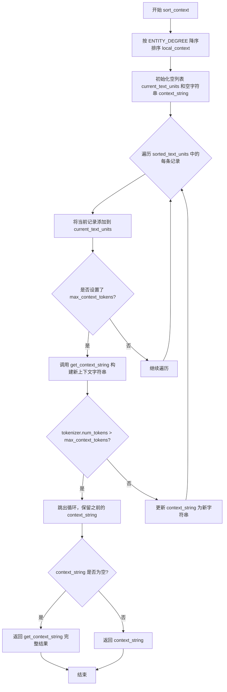

# `graphrag\packages\graphrag\graphrag\index\operations\summarize_communities\text_unit_context\sort_context.py` 详细设计文档

该代码实现了一个按度数排序的上下文处理模块，主要功能是将本地上下文（如文本单元和社区报告）按关联节点的度数降序排列，并将其合并为上下文字符串，支持基于token数量的截断操作。

## 整体流程

```mermaid
graph TD
    A[开始 sort_context] --> B[按 ENTITY_DEGREE 降序排序 local_context]
    B --> C[初始化 current_text_units 和 context_string]
    C --> D{存在 max_context_tokens?}
    D -- 否 --> E[遍历 sorted_text_units]
    D -- 是 --> F[逐个添加 record 到 current_text_units]
    F --> G[调用 get_context_string 生成新上下文]
    G --> H{token数 > max_context_tokens?}
    H -- 是 --> I[break 跳出循环]
    H -- 否 --> J[更新 context_string]
    J --> E
    E --> K{context_string 为空?}
    K -- 是 --> L[返回 get_context_string(sorted_text_units)]
    K -- 否 --> M[返回 context_string]
    L --> N[结束]
    M --> N
```

## 类结构

```
该文件为函数式模块，无类层次结构
└── get_context_string (全局函数)
└── sort_context (全局函数)
```

## 全局变量及字段


### `logger`
    
用于记录模块日志的日志对象，通过 logging.getLogger(__name__) 初始化

类型：`logging.Logger`
    


### `schemas`
    
graphrag.data_model.schemas 模块，用于获取 COMMUNITY_ID 和 ENTITY_DEGREE 常量

类型：`module`
    


    

## 全局函数及方法


### `get_context_string`

将文本单元（text_units）和可选的子社区报告（sub_community_reports）合并成一个格式化的上下文字符串，用于检索增强生成（RAG）流程中的上下文填充。

参数：

- `text_units`：`list[dict]`，包含"id"字段的文本单元列表，用于构建上下文来源部分
- `sub_community_reports`：`list[dict] | None`，可选的子社区报告列表，用于构建上下文报告部分

返回值：`str`，格式化的上下文字符串，包含报告和来源两部分，之间用双换行符分隔

#### 流程图

```mermaid
flowchart TD
    A[开始 get_context_string] --> B{检查 sub_community_reports 是否存在}
    B -->|是| C[过滤无效报告]
    B -->|否| D{检查 text_units 是否有效}
    
    C --> C1[转换为 DataFrame 并去重]
    C1 --> C2{报告 DataFrame 是否为空?}
    C2 -->|否| C3[处理 COMMUNITY_ID 类型转换]
    C3 --> C4[生成报告字符串 '----REPORTS-----\n{csv}']
    C4 --> C5[添加到 contexts 列表]
    C5 --> D
    
    D --> D1[过滤无效 text_units]
    D1 --> D2[转换为 DataFrame 并去重]
    D2 --> D3{text_units DataFrame 是否为空?}
    D3 -->|否| D4[处理 id 类型转换]
    D4 --> D5[生成来源字符串 '-----SOURCES-----\n{csv}']
    D5 --> D6[添加到 contexts 列表]
    D3 -->|是| E
    
    E[用 '\n\n' 连接所有上下文]
    E --> F[返回最终字符串]
```

#### 带注释源码

```python
def get_context_string(
    text_units: list[dict],
    sub_community_reports: list[dict] | None = None,
) -> str:
    """Concatenate structured data into a context string."""
    # 初始化上下文列表，用于存储最终的字符串片段
    contexts = []
    
    # 处理子社区报告（如果存在）
    if sub_community_reports:
        # 过滤掉无效的报告：必须包含 COMMUNITY_ID 字段、
        # 值非空、且去除空白字符后不为空字符串
        sub_community_reports = [
            report
            for report in sub_community_reports
            if schemas.COMMUNITY_ID in report
            and report[schemas.COMMUNITY_ID]
            and str(report[schemas.COMMUNITY_ID]).strip() != ""
        ]
        # 将过滤后的报告转换为 pandas DataFrame 并去重
        report_df = pd.DataFrame(sub_community_reports).drop_duplicates()
        
        # 检查 DataFrame 是否为空
        if not report_df.empty:
            # 处理 COMMUNITY_ID 的数据类型问题：
            # 如果是 float 类型（如 NaN 转换而来），转换为 int
            if report_df[schemas.COMMUNITY_ID].dtype == float:
                report_df[schemas.COMMUNITY_ID] = report_df[
                    schemas.COMMUNITY_ID
                ].astype(int)
            
            # 生成报告字符串，格式为 CSV 格式，前面加上标题行
            report_string = (
                f"----REPORTS-----\n{report_df.to_csv(index=False, sep=',')}"
            )
            # 添加到上下文列表
            contexts.append(report_string)

    # 处理文本单元列表
    # 过滤掉无效的文本单元：必须包含 "id" 字段、
    # 值非空、且去除空白字符后不为空字符串
    text_units = [
        unit
        for unit in text_units
        if "id" in unit and unit["id"] and str(unit["id"]).strip() != ""
    ]
    # 转换为 DataFrame 并去重
    text_units_df = pd.DataFrame(text_units).drop_duplicates()
    
    # 检查 DataFrame 是否为空
    if not text_units_df.empty:
        # 处理 id 字段的数据类型问题：如果是 float，转换为 int
        if text_units_df["id"].dtype == float:
            text_units_df["id"] = text_units_df["id"].astype(int)
        
        # 生成文本单元字符串，格式为 CSV 格式，前面加上标题行
        text_unit_string = (
            f"-----SOURCES-----\n{text_units_df.to_csv(index=False, sep=',')}"
        )
        # 添加到上下文列表
        contexts.append(text_unit_string)

    # 用双换行符连接所有上下文片段并返回
    # 如果 contexts 为空，将返回空字符串
    return "\n\n".join(contexts)
```


### `sort_context`

该函数接收本地上下文列表（包含文本单元）、分词器以及可选的社区报告和最大 token 限制，对上下文中的文本单元按关联实体的度数降序排序，并返回一个经过排序且可能因 token 数量限制而被截断的上下文字符串。

参数：

- `local_context`：`list[dict]`，本地上下文列表，每个元素为包含文本单元信息的字典（如 id、实体度数等）
- `tokenizer`：`Tokenizer`，分词器实例，用于计算字符串的 token 数量
- `sub_community_reports`：`list[dict] | None`，可选的子社区报告列表，用于补充上下文信息
- `max_context_tokens`：`int | None`，可选的最大 token 数量限制，若设置则超过该阈值时停止添加更多文本单元

返回值：`str`，返回排序并可能截断的上下文字符串

#### 流程图



#### 带注释源码

```python
def sort_context(
    local_context: list[dict],
    tokenizer: Tokenizer,
    sub_community_reports: list[dict] | None = None,
    max_context_tokens: int | None = None,
) -> str:
    """Sort local context (list of text units) by total degree of associated nodes in descending order."""
    
    # 步骤1: 按 ENTITY_DEGREE 字段降序排序本地上下文
    # degree 表示实体在图中的连接数/度数，度数越高说明实体越重要
    sorted_text_units = sorted(
        local_context, key=lambda x: x[schemas.ENTITY_DEGREE], reverse=True
    )

    # 步骤2: 初始化用于累积文本单元的列表和最终的上下文字符串
    current_text_units = []
    context_string = ""
    
    # 步骤3: 逐个遍历排序后的文本单元，构建上下文
    for record in sorted_text_units:
        current_text_units.append(record)  # 将当前记录加入累积列表
        
        # 如果设置了最大 token 限制，则需要检查累积后的 token 数量
        if max_context_tokens:
            # 步骤3.1: 根据当前累积的文本单元生成上下文字符串
            new_context_string = get_context_string(
                current_text_units, sub_community_reports
            )
            
            # 步骤3.2: 检查新生成的上下文字符串是否超过 token 限制
            if tokenizer.num_tokens(new_context_string) > max_context_tokens:
                # 超过限制，跳出循环，保留上一次有效的 context_string
                break

            # 未超过限制，更新 context_string 为新的有效字符串
            context_string = new_context_string

    # 步骤4: 处理边界情况
    # 如果 context_string 为空（可能是未设置 max_context_tokens 或循环未执行）
    if context_string == "":
        # 返回完整的排序后上下文字符串
        return get_context_string(sorted_text_units, sub_community_reports)

    # 步骤5: 返回最终的上下文字符串（可能已被截断）
    return context_string
```

## 关键组件


### get_context_string 函数

将文本单元和子社区报告等结构化数据合并为单个上下文字符串，包含数据验证、去重和类型转换功能。

### sort_context 函数

根据实体的度数（ENTITY_DEGREE）对本地上下文进行降序排序，并支持通过 max_context_tokens 参数实现惰性加载和token数量限制的量化策略。

### 张量索引与惰性加载

使用 sorted() 函数配合 lambda 表达式按 schemas.ENTITY_DEGREE 字段进行索引排序，采用逐步累加记录的方式实现惰性加载，当达到 max_context_tokens 限制时立即停止迭代。

### 反量化支持

对 DataFrame 中的浮点型 ID 字段进行检测和类型转换（float 转 int），确保数据一致性。

### 量化策略

通过 max_context_tokens 参数控制上下文字符串的 token 数量，使用 tokenizer.num_tokens() 方法实时计算并限制上下文大小。

### 数据验证与清洗

对输入数据进行多层验证：检查必需字段存在性、过滤空值和空白字符串、去除重复记录。

### 全局变量 schemas

从 graphrag.data_model.schemas 导入的常量定义，提供 COMMUNITY_ID 和 ENTITY_DEGREE 等字段名称。


## 问题及建议


### 已知问题

- **重复计算与低效循环**：在`sort_context`函数的循环中，每次添加新记录后都调用`get_context_string`重新生成完整的上下文字符串来计算token数，当`max_context_tokens`较大时会导致大量重复计算，性能低下
- **类型转换逻辑重复**：对`COMMUNITY_ID`和`id`的float转int逻辑在`get_context_string`中重复出现两次，违反了DRY原则
- **缺乏输入验证**：未对`local_context`为None或空列表的情况进行适当处理，也没有验证必需字段`ENTITY_DEGREE`是否存在，可能导致KeyError
- **原地排序副作用**：`sorted`函数虽然不修改原列表，但代码逻辑假设不会修改，如果传入的字典结构包含可变对象可能存在风险
- **DataFrame过度使用**：对简单的数据去重和类型转换使用pandas DataFrame增加了不必要的内存开销
- **错误处理缺失**：当tokenizer出错或数据类型不匹配时没有异常捕获和处理机制

### 优化建议

- **增量token计算**：预先计算每条记录的token数，采用累积方式增量添加，避免重复生成完整上下文字符串
- **提取公共逻辑**：将类型检查和转换逻辑抽取为独立的辅助函数，在`get_context_string`中复用
- **添加输入验证**：在函数开头增加参数校验，处理None、空列表、缺失字段等边界情况，提供明确的错误信息
- **考虑使用轻量级替代方案**：对于简单的数据清洗和去重，可以考虑使用原生Python数据结构替代pandas DataFrame
- **添加异常处理**：用try-except包装tokenizer调用和关键操作，提供fallback逻辑或清晰的错误信息
- **优化排序逻辑**：考虑使用`operator.itemgetter`替代lambda函数提升排序性能

## 其它


### 设计目标与约束

**设计目标**：为GraphRAG系统提供本地上下文排序功能，通过实体度数（degree）降序排列文本单元，在满足最大token数限制的前提下，生成最优的上下文字符串供LLM使用。

**约束条件**：
- 输入的`local_context`列表中的每条记录必须包含`schemas.ENTITY_DEGREE`字段用于排序
- 上下文字符串总token数不能超过`max_context_tokens`（若指定）
- 数据来源包括文本单元（text_units）和子社区报告（sub_community_reports）
- 必须依赖`graphrag_llm.tokenizer.Tokenizer`进行token计数

### 错误处理与异常设计

**异常处理机制**：
- **DataFrame为空**：使用`.empty`检查跳过空DataFrame处理，避免生成无效CSV
- **类型转换异常**：`COMMUNITY_ID`和`id`字段从float转换为int时需先检查dtype
- **缺失字段**：使用条件筛选过滤掉不包含必要字段或字段值为空的记录
- **Token计数失败**：若`tokenizer.num_tokens()`抛出异常，函数应捕获并记录日志

**边界条件**：
- 当`local_context`为空时，返回空字符串
- 当`max_context_tokens`为None时，不进行token数量检查，返回所有排序后的上下文
- 当`sub_community_reports`为None或空时，仅处理text_units

### 数据流与状态机

**数据流转过程**：

```
输入数据
    │
    ▼
┌─────────────────────────────┐
│  过滤无效记录（空id/degree） │
└─────────────────────────────┘
    │
    ▼
┌─────────────────────────────┐
│  按ENTITY_DEGREE降序排序    │
└─────────────────────────────┘
    │
    ▼
┌─────────────────────────────┐
│  遍历排序后的记录，构建上下文  │
│  （若设置max_context_tokens）│
└─────────────────────────────┘
    │
    ▼
┌─────────────────────────────┐
│  转换为CSV格式字符串          │
└─────────────────────────────┘
    │
    ▼
输出：合并的上下文字符串
```

**状态说明**：
- **初始态**：接收未处理的text_units和sub_community_reports
- **过滤态**：移除无效或空值的记录
- **排序态**：按degree字段降序排列
- **累积态**：逐步添加记录并检查token限制（若适用）
- **完成态**：生成最终上下文字符串

### 外部依赖与接口契约

**外部依赖**：
- `pandas`：用于DataFrame操作和CSV格式转换
- `graphrag_llm.tokenizer.Tokenizer`：用于token数量计算
- `graphrag.data_model.schemas`：定义数据模式常量（COMMUNITY_ID、ENTITY_DEGREE）
- `logging`：日志记录

**接口契约**：
- `get_context_string(text_units, sub_community_reports)`：返回格式化的上下文字符串，若两者都为空则返回空字符串
- `sort_context(local_context, tokenizer, sub_community_reports, max_context_tokens)`：返回最终排序并可能截断的上下文字符串

**输入约束**：
- `text_units`：list[dict]，每项需包含"id"字段
- `sub_community_reports`：list[dict]，每项需包含schemas.COMMUNITY_ID字段
- `local_context`：list[dict]，每项需包含schemas.ENTITY_DEGREE字段
- `tokenizer`：Tokenizer实例，需实现num_tokens()方法

### 性能考虑与优化空间

**当前性能特征**：
- 时间复杂度：O(n log n) dominated by sort operation
- 空间复杂度：O(n) for storing DataFrame and context strings
- Token计数可能被多次调用（每添加一条记录），存在重复计算

**优化建议**：
- 考虑缓存已计算token数的中间结果
- 在数据量大时可考虑流式处理避免一次性加载所有DataFrame
- 可预先估算单条记录的token增量，减少调用tokenizer次数

### 安全性与输入验证

**输入安全**：
- 对`text_units`和`sub_community_reports`中的字符串字段进行strip处理，防止注入
- CSV输出不包含敏感元数据，仅包含数据本身

**数据验证**：
- 检查必要字段存在性后再访问
- 处理None和空列表的边界情况

### 测试策略建议

**单元测试覆盖点**：
- 空输入处理
- 单条记录处理
- 多条记录排序验证
- max_context_tokens限制生效
- 无效/空值记录过滤
- DataFrame dtype转换场景

**集成测试**：
- 与实际Tokenizer集成验证token计数准确性
- 与完整GraphRAG流程集成验证输出质量

### 版本兼容性说明

**依赖版本要求**：
- pandas：需支持DataFrame.drop_duplicates()和dtype检查
- graphrag_llm.tokenizer：Tokenizer需实现num_tokens(string) -> int接口
- schemas模块：需定义COMMUNITY_ID和ENTITY_DEGREE常量


    