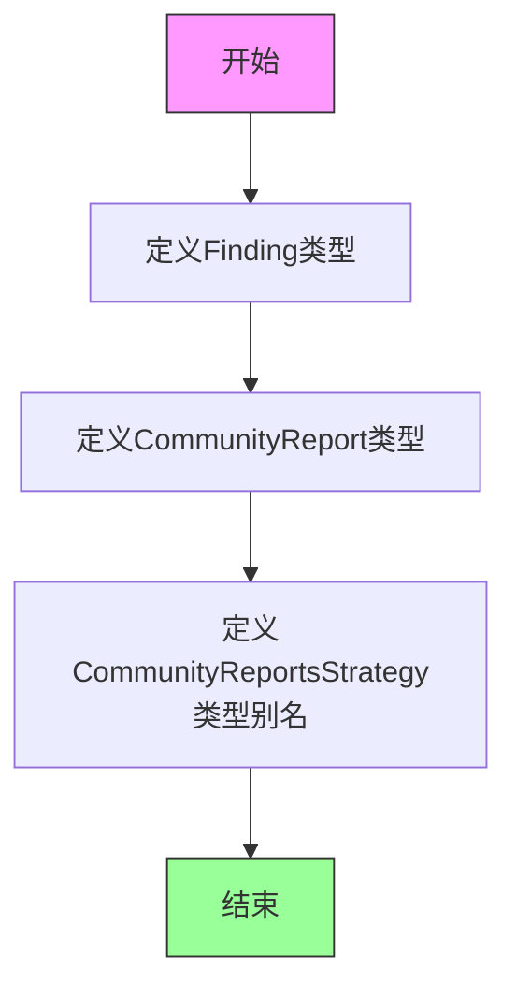
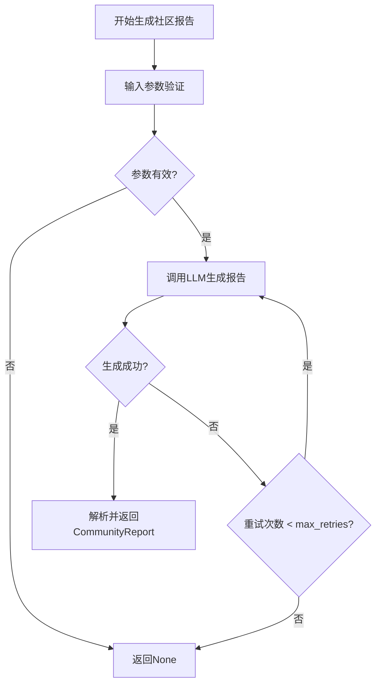

# `graphrag\packages\graphrag\graphrag\index\operations\summarize_communities\typing.py` 详细设计文档

该模块定义了社区报告相关的TypedDict数据模型，包括Finding（发现）和CommunityReport（社区报告）的结构定义，以及社区报告生成策略的函数类型别名。

## 整体流程



## 类结构

```
TypedDict (Python内建)
├── Finding (社区发现数据模型)
└── CommunityReport (社区报告数据模型)

类型别名 (Type Alias)
├── RowContext (行上下文类型)
├── Claim (声明类型)
└── CommunityReportsStrategy (社区报告生成策略函数类型)
```

## 全局变量及字段


### `RowContext`
    
行上下文类型定义，用于存储任意类型的键值对数据

类型：`dict[str, Any]`
    


### `Claim`
    
声明类型定义，用于存储声明相关的数据

类型：`dict[str, Any]`
    


### `Finding.summary`
    
发现内容的摘要

类型：`str`
    


### `Finding.explanation`
    
发现内容的详细解释

类型：`str`
    


### `CommunityReport.community`
    
社区标识

类型：`str | int`
    


### `CommunityReport.title`
    
报告标题

类型：`str`
    


### `CommunityReport.summary`
    
报告摘要

类型：`str`
    


### `CommunityReport.full_content`
    
完整内容

类型：`str`
    


### `CommunityReport.full_content_json`
    
JSON格式的完整内容

类型：`str`
    


### `CommunityReport.rank`
    
排名分数

类型：`float`
    


### `CommunityReport.level`
    
层级

类型：`int`
    


### `CommunityReport.rating_explanation`
    
评级说明

类型：`str`
    


### `CommunityReport.findings`
    
发现列表

类型：`list[Finding]`
    
    

## 全局函数及方法


### `CommunityReportsStrategy`

社区报告生成策略的可调用类型别名，定义了异步生成社区报告的函数签名，接收社区ID、文本、完成模型、提示词和最大重试次数作为输入，返回生成的社区报告或None。

参数：

- `community_id`：`str | int`，社区的唯一标识符，用于指定需要生成报告的社区
- `text`：`str`，社区相关的原始文本内容，作为生成报告的输入数据
- `completion_model`：`int`，LLM完成模型的索引或标识符，用于指定使用哪个语言模型生成报告
- `llm`：`LLMCompletion`，LLM完成接口实例，负责实际调用语言模型生成报告内容
- `prompt`：`str`，用于指导语言模型生成报告的系统提示词或指令
- `max_retries`：`int`，生成报告失败时的最大重试次数，确保在临时故障时能够自动重试

返回值：`Awaitable[CommunityReport | None]`，异步返回生成的社区报告（CommunityReport类型），如果生成失败则返回None

#### 流程图



#### 带注释源码

```python
# 社区报告生成策略的类型别名定义
# 这是一个异步可调用类型，封装了生成社区报告的函数签名
CommunityReportsStrategy = Callable[
    # 参数列表（共6个参数）：
    [
        str | int,          # community_id: 社区ID，支持字符串或整数类型
        str,                # text: 输入的原始文本内容
        int,                # completion_model: LLM模型索引
        "LLMCompletion",    # llm: LLM完成接口实例（字符串引用避免循环导入）
        str,                # prompt: 生成报告的提示词
        int,                # max_retries: 最大重试次数
    ],
    # 返回类型：异步返回CommunityReport或None
    Awaitable[CommunityReport | None],
]
```

## 关键组件


### Finding

表示单个发现的模型，包含摘要和解释两个字段，用于描述从数据中提取的具体发现内容。

### CommunityReport

社区报告的完整数据结构，包含社区标识、标题、摘要、完整内容、JSON格式内容、排名、等级、评级说明以及发现列表等完整信息。

### CommunityReportsStrategy

社区报告生成策略的类型定义，描述了一个异步函数签名，接收社区ID、文本内容、策略索引、LLMCompletion实例、查询字符串和最大Tokens数，返回社区报告或None。

### RowContext

行级上下文的类型别名，定义为字符串键到任意值的字典，用于在处理过程中传递上下文数据。

### Claim

声明/断言的类型别名，定义为字符串键到任意值的字典，用于表示从数据中提取的声明信息。

### LLMCompletion 类型导入

通过 TYPE_CHECKING 条件导入的 LLMCompletion 类型，用于类型注解，表明依赖外部模块的LLM完成接口契约。


## 问题及建议


### 已知问题

-   **类型定义过于宽松**：RowContext 和 Claim 使用 `dict[str, Any]`，无法提供类型安全和自动补全，应改为具体的 TypedDict 定义
-   **命名不一致**：CommunityReport 中的 `full_content_json` 字段名为 `_json` 后缀，但实际类型是 `str` 而非 JSON 对象，容易造成误解
-   **CommunityReportsStrategy 函数签名过于复杂**：6 个独立参数应封装为数据类或 TypedDict，降低调用复杂度并提升可维护性
-   **缺少文档注释**：RowContext、Claim 全局类型以及 CommunityReportsStrategy 的各参数均无文档说明
-   **联合类型使用不当**：community 字段允许 `str | int`，这种混合类型可能导致后续处理逻辑复杂化
-   **类型注解依赖运行时不可用**：LLMCompletion 在 TYPE_CHECKING 块中导入，运行时无法进行类型检查

### 优化建议

-   为 RowContext 和 Claim 定义具体的 TypedDict，明确每个字段的名称和类型
-   考虑将 full_content_json 重命名为 full_content_serialized 或直接改为 dict 类型
-   创建 StrategyParams 数据类封装 CommunityReportsStrategy 的参数，使用 dataclass 或 TypedDict
-   为所有类型添加 docstring，特别是 CommunityReportsStrategy 的参数说明
-   考虑将 community 字段统一为单一类型（建议用 str）
-   可考虑使用 Pydantic 替代 TypedDict 以增加运行时验证能力

## 其它


### 设计目标与约束

本模块旨在定义图谱社区报告的数据模型，封装社区发现结果的摘要、完整内容、排名、评级等关键信息，为上层业务逻辑提供统一的数据结构契约。设计约束：必须兼容Python 3.10+的TypedDict特性，Finding与CommunityReport须保持与LLMCompletion输出格式的兼容性，所有字段均须支持JSON序列化。

### 错误处理与异常设计

本模块作为纯数据结构定义，不涉及业务逻辑错误处理。使用方在构造CommunityReport实例时应确保必填字段（community、title、summary、findings）非空，rank值域为[0,1]，level为非负整数。若字段类型不匹配或必需字段缺失，应由调用方负责验证并抛出TypeError或ValueError。

### 数据流与状态机

数据流方向：LLMCompletion生成原始社区报告文本 → 通过特定策略（CommunityReportsStrategy）解析转换 → 构造CommunityReport对象（含Finding列表） → 序列化存储或传输。状态机不适用，因本模块仅定义静态数据结构，不涉及状态变迁。

### 外部依赖与接口契约

主要依赖：`typing_extensions.TypedDict`（Python 3.10+可替换为内置TypedDict）、`collections.abc.Awaitable`、`typing.Any`。外部接口：CommunityReportsStrategy定义了异步策略函数的签名约束，调用方须提供符合签名的实现函数，接收community_id、content、level等参数并返回CommunityReport | None。

### 使用示例

```python
# 构建Finding
finding: Finding = {
    "summary": "社区A包含多个实体",
    "explanation": "该社区发现了5个实体和3个关系"
}

# 构建CommunityReport
report: CommunityReport = {
    "community": "community_123",
    "title": "社区报告标题",
    "summary": "简要描述",
    "full_content": "完整报告内容...",
    "full_content_json": "{\"key\": \"value\"}",
    "rank": 0.85,
    "level": 2,
    "rating_explanation": "高重要性",
    "findings": [finding]
}
```

### 性能考量与优化空间

TypedDict在运行时仅保留字典行为，无额外性能开销。当前设计潜在优化空间：可考虑使用Pydantic模型替代TypedDict以增强运行时验证和默认值支持；findings列表若数据量巨大，可考虑改为生成器或分页加载机制。

### 安全与合规考量

本模块不直接处理敏感数据，但使用方应注意：full_content_json字段存储LLM输出可能包含敏感信息，需按业务要求进行脱敏处理；community字段若涉及真实实体标识，应遵循数据隐私合规要求。

### 测试策略建议

建议补充单元测试验证：CommunityReport各字段类型检查、必填字段缺失时的行为、JSON序列化/反序列化完整性、CommunityReportsStrategy函数签名兼容性。

### 扩展性设计

未来可扩展方向：为Finding添加更多元数据（如source、confidence）；为CommunityReport增加temporal字段支持时序分析；考虑引入report_id作为主键以支持去重和追踪。

    