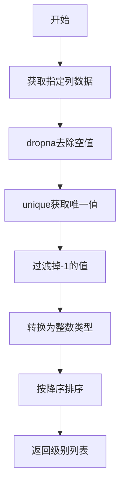

# `graphrag\packages\graphrag\graphrag\index\operations\summarize_communities\utils.py` 详细设计文档

一个社区报告生成工具模块，提供从DataFrame中提取和排序社区级别的功能函数。

## 整体流程



## 类结构

```
无类结构 (仅包含一个工具函数)
```

## 全局变量及字段


### `schemas.COMMUNITY_LEVEL`
    
社区级别列名常量，用于标识DataFrame中社区等级所在的列

类型：`str`
    


    

## 全局函数及方法


### `get_levels`

获取数据框中社区的层级列表，排除空值和-1层级，并以降序排序返回。

参数：

- `df`：`pd.DataFrame`，包含社区层级信息的DataFrame
- `level_column`：`str`，默认为 `schemas.COMMUNITY_LEVEL`，用于指定层级列的名称

返回值：`list[int]`，按降序排列的社区层级整数值列表

#### 流程图

```mermaid
flowchart TD
    A[开始] --> B[获取 df[level_column] 列数据]
    B --> C[dropna 去除空值]
    C --> D[unique 获取唯一值]
    D --> E{遍历每个层级}
    E -->|lvl != -1| F[转换为整数类型]
    E -->|lvl == -1| G[跳过该层级]
    F --> H[添加到结果列表]
    H --> E
    G --> E
    E --> I{sorted reverse=True}
    I --> J[返回降序排序的层级列表]
```

#### 带注释源码

```python
def get_levels(
    df: pd.DataFrame, level_column: str = schemas.COMMUNITY_LEVEL
) -> list[int]:
    """Get the levels of the communities."""
    # 从指定列获取数据并去除NA值，然后获取唯一值
    levels = df[level_column].dropna().unique()
    # 过滤掉-1值，并将所有层级转换为整数类型
    levels = [int(lvl) for lvl in levels if lvl != -1]
    # 按降序排序后返回
    return sorted(levels, reverse=True)
```

## 关键组件


### get_levels 函数

获取数据框中社区报告的不同层级。核心逻辑是通过指定的级别列提取唯一值，排除-1和空值，然后按降序排列返回。

### schemas.COMMUNITY_LEVEL

社区级别列名的常量引用，来自数据模型模式定义，用于确保列名的一致性和可维护性。

### pandas DataFrame 处理

使用 pandas 库进行数据处理，通过 dropna() 去除空值，unique() 获取唯一值，sorted() 进行排序，是数据管道处理的标准模式。


## 问题及建议


### 已知问题

-   **缺少输入验证**：函数未验证 `level_column` 参数是否存在于 DataFrame 中，若列不存在会抛出 `KeyError`，缺乏友好的错误提示
-   **未处理空 DataFrame**：当输入的 DataFrame 为空或 `level_column` 全为 NaN 时，函数会返回空列表，但这是隐式行为，缺乏明确说明
-   **硬编码魔法数字**：`-1` 被硬编码用于表示无效或未分配的社区级别，应提取为常量以提高可读性和可维护性
-   **依赖外部模式**：函数依赖 `schemas.COMMUNITY_LEVEL` 常量，若该常量不存在或值变化会导致运行时错误，缺乏防御性编程

### 优化建议

-   **添加输入验证**：在函数开头检查 `level_column` 是否存在于 DataFrame 列中，若不存在则抛出明确的 `ValueError` 异常
-   **提取魔法数字**：将 `-1` 定义为模块级常量，如 `INVALID_COMMUNITY_LEVEL = -1`，并在函数中使用该常量
-   **增强文档**：在 docstring 中说明空 DataFrame 和全为 NaN 时的返回值行为，以及可能的异常类型
-   **添加类型检查**：考虑使用 `typing.TypeGuard` 或运行时检查确保 `level_column` 列的数据类型可以转换为整数

## 其它


### 设计目标与约束

本模块的设计目标是提供一个轻量级的工具函数，用于从社区数据中提取和过滤有效的层级信息。约束条件包括：1) 输入必须是包含社区层级列的pandas DataFrame；2) 仅处理数值型层级数据；3) 自动过滤无效值（-1和NaN）；4) 返回结果按降序排列以便于优先级处理。

### 错误处理与异常设计

1. **KeyError**: 当指定的level_column不存在于DataFrame中时抛出
2. **TypeError**: 当df不是pandas DataFrame对象时抛出
3. **ValueError**: 当level_column中的数据无法转换为整数时抛出
4. 异常处理策略：函数本身不进行捕获，由调用方负责异常处理

### 数据流与状态机

数据流：输入DataFrame → 选择指定列 → dropna()去除空值 → 过滤-1值 → 转换为整数类型 → 升序排列 → 反转为降序 → 返回列表

状态机：本模块为纯函数，无状态机设计

### 外部依赖与接口契约

1. **pandas**: 依赖pandas库进行数据处理
2. **schemas模块**: 依赖graphrag.data_model.schemas中的COMMUNITY_LEVEL常量
3. **接口契约**: 
   - 输入：df为pd.DataFrame，level_column为字符串类型
   - 输出：list[int]类型的层级列表
   - 默认参数：level_column默认为schemas.COMMUNITY_LEVEL的值

### 性能考量

1. 使用unique()而非distinct()以提高性能
2. 使用列表推导式而非map+list以提高性能
3. 适用于中小规模数据集（万级别以下）
4. 大规模数据（百万级）建议考虑向量化优化或分批处理

### 测试建议

1. 正常输入测试：包含有效层级数据的DataFrame
2. 边界测试：空DataFrame、全为-1的层级、包含NaN的层级
3. 异常测试：不存在指定列、列数据类型错误
4. 默认参数测试：验证schemas.COMMUNITY_LEVEL的正确性

### 使用示例

```python
# 示例数据
data = {
    schemas.COMMUNITY_LEVEL: [1, 2, -1, 3, None, 2, 1]
}
df = pd.DataFrame(data)

# 调用函数
levels = get_levels(df)  # 返回 [3, 2, 1]
```

### 版本兼容性

- Python版本: 3.8+
- pandas版本: 1.0+
- 依赖graphrag内部模块，需与主项目版本同步


    