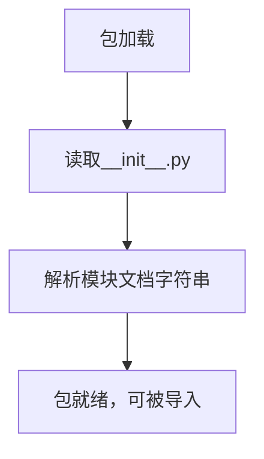

# `graphrag\packages\graphrag\graphrag\index\operations\summarize_descriptions\__init__.py` 详细设计文档

这是 description summarization（描述摘要）功能的根包初始化文件，仅包含版权信息和包级别的文档字符串，用于标识该包的整体用途。

## 整体流程



## 类结构

```

```

## 全局变量及字段


    

## 全局函数及方法


## 关键组件


### 核心功能概述

该代码模块作为描述摘要（Description Summarization）功能的根包，仅包含包级别的文档说明和版权声明，无实际实现逻辑。

### 文件整体运行流程

由于该文件仅为包初始化文件，不包含可执行代码，其主要作用在于标识包命名空间并提供包级文档说明。导入该包时，Python 解释器会执行该文件以注册包路径，但不执行任何业务逻辑。

### 类的详细信息

该文件中不包含任何类定义。

### 全局变量和全局函数

该文件中不包含任何全局变量或全局函数定义。

### 关键组件信息

- **Package Namespace（包命名空间）**: 作为 `description_summarization` 包的根模块，用于组织相关功能代码的层次结构
- **Documentation String（文档字符串）**: 提供包级别的一行功能描述，说明该包用于描述摘要任务

### 潜在的技术债务或优化空间

- **缺少包初始化逻辑**: 当前文件仅包含文档字符串，建议根据实际需求添加包级别的导入配置、版本信息或公共接口导出
- **无子模块组织**: 建议在后续实现中通过 `__all__` 明确导出公共API，或使用相对导入组织子模块

### 其它项目

- **设计目标与约束**: 根据文档字符串，该包的设计目标是为描述摘要任务提供支持，需遵循 MIT License 开源许可协议
- **错误处理与异常设计**: 当前文件无错误处理设计
- **数据流与状态机**: 无数据流设计
- **外部依赖与接口契约**: 无外部依赖声明


## 问题及建议


### 已知问题

-   **空包占位符**: 该 `__init__.py` 文件仅包含版权信息和文档字符串，未实现任何实际功能
-   **缺少版本信息**: 未定义 `__version__` 变量，无法方便地获取包版本号
-   **缺少公共API定义**: 未定义 `__all__` 列表，不明确包的公共接口
-   **未初始化子模块**: 未导入任何子模块，子包无法被直接访问
-   **缺乏模块级配置**: 包初始化时没有任何配置或初始化逻辑
-   **文档不完整**: 仅有一行简短的包描述，缺少详细的功能说明和使用示例

### 优化建议

-   **添加版本管理**: 定义 `__version__ = "0.1.0"` 或从版本配置文件读取
-   **明确公共接口**: 添加 `__all__ = []` 列表定义导出模块
-   **导入子模块**: 根据实际项目结构，导入相关子模块如 `description_summarization` 下的模块
-   **添加详细文档**: 扩展文档字符串，包含功能描述、使用方法和示例
-   **包初始化逻辑**: 如有需要，在包初始化时设置日志、配置等
-   **添加类型注解**: 考虑添加类型注解提高代码可维护性
-   **考虑依赖声明**: 如有依赖，在包级别提供便捷的导入方式


## 其它


### 设计目标与约束

该代码作为description summarization功能的根包，主要目标是提供一个统一的包命名空间入口。设计约束包括：必须保持与Microsoft的版权声明一致，需遵循MIT许可证要求，包结构需支持未来扩展多个子模块。

### 错误处理与异常设计

由于当前为根包初始化文件，暂不涉及具体业务逻辑错误处理。若后续添加业务代码，建议定义包级别的自定义异常类，如DescriptionSummarizationError，并遵循Python异常层次结构设计。

### 数据流与状态机

当前代码不涉及具体数据流处理。后续模块设计时应考虑：输入数据（待摘要描述）→ 处理流程（摘要生成）→ 输出数据（摘要结果）的完整数据流，并定义清晰的状态转换逻辑。

### 外部依赖与接口契约

当前代码无外部依赖。若后续添加功能，可能依赖：1) 大语言模型API接口；2) 文本处理库；3) 配置管理模块。需定义清晰的接口契约，包括输入输出格式、错误返回规范等。

### 配置与参数设计

建议预留配置接口，包括：1) 摘要长度参数；2) 模型选择参数；3) API端点配置；4) 超时设置。配置应支持环境变量和配置文件两种方式。

### 安全性考虑

需考虑：1) API密钥安全存储；2) 输入数据校验；3) 敏感信息脱敏；4) 权限控制机制。Microsoft产品通常需遵循内部安全编码规范。

### 性能考量

后续实现时需关注：1) 摘要生成延迟；2) 并发请求处理能力；3) 缓存策略；4) 内存占用优化。建议添加性能监控指标。

### 测试策略

建议包含：1) 单元测试（包导入验证）；2) 集成测试（子模块联动）；3) 端到端测试（完整流程）；4) 性能测试。测试覆盖率应达到核心业务逻辑80%以上。

### 版本兼容性

需明确：1) Python版本支持范围（建议3.8+）；2) 依赖库版本约束；3) 向前向后兼容性策略。建议使用语义化版本号（Semantic Versioning）。

### 日志与监控

建议实现统一的日志记录机制：1) 结构化日志格式；2) 日志级别控制；3) 日志输出目标配置；4) 关键操作审计日志。便于问题排查和运行监控。

### 代码风格与规范

需遵循：1) PEP 8 Python代码规范；2) 类型注解（Type Hints）使用；3) 文档字符串（Docstring）规范；4) 命名约定（PEP 257）。建议使用自动化工具（如pylint、black）进行代码检查。

### 文档维护

需维护：1) README使用说明；2) API接口文档；3) 变更日志（CHANGELOG）；4) 贡献指南。文档应与代码同步更新，确保准确性。


    