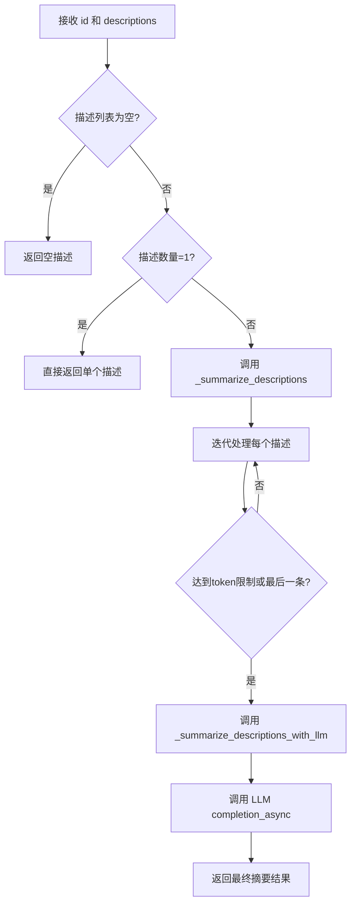
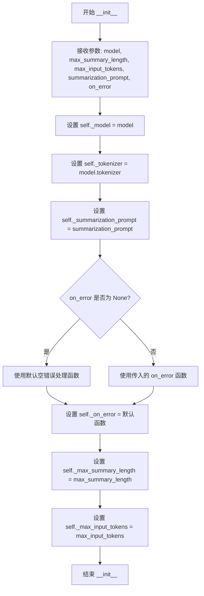

# `graphrag\packages\graphrag\graphrag\index\operations\summarize_descriptions\description_summary_extractor.py` 详细设计文档

该模块实现了一个基于LLM的文本摘要提取器，用于将实体的大量描述信息压缩成单一摘要，包含SummarizationResult数据类和SummarizeExtractor处理器类，支持批量描述的迭代式token限制处理和异步LLM调用。

## 整体流程



## 类结构

```
SummarizationResult (数据类)
└── SummarizeExtractor (处理器类)
```

## 全局变量及字段


### `ENTITY_NAME_KEY`
    
实体名称键名常量

类型：`str`
    


### `DESCRIPTION_LIST_KEY`
    
描述列表键名常量

类型：`str`
    


### `MAX_LENGTH_KEY`
    
最大长度键名常量

类型：`str`
    


### `SummarizationResult.id`
    
实体唯一标识

类型：`str | tuple[str, str]`
    


### `SummarizationResult.description`
    
摘要描述内容

类型：`str`
    


### `SummarizeExtractor._model`
    
LLM模型实例

类型：`LLMCompletion`
    


### `SummarizeExtractor._summarization_prompt`
    
摘要提示模板

类型：`str`
    


### `SummarizeExtractor._on_error`
    
错误处理函数

类型：`ErrorHandlerFn`
    


### `SummarizeExtractor._max_summary_length`
    
最大摘要长度

类型：`int`
    


### `SummarizeExtractor._max_input_tokens`
    
最大输入token数

类型：`int`
    


### `SummarizeExtractor._tokenizer`
    
分词器实例

类型：`Any`
    
    

## 全局函数及方法


### `SummarizeExtractor.__init__`

这是 `SummarizeExtractor` 类的构造函数，用于初始化摘要提取器的各个配置参数，包括 LLM 模型实例、分词器、最大摘要长度、最大输入 token 数、摘要提示词模板以及错误处理函数。

参数：

-  `model`：`LLMCompletion`，用于执行 LLM 调用的模型实例
-  `max_summary_length`：`int`，生成的摘要文本的最大长度限制
-  `max_input_tokens`：`int`，输入文本的最大 token 数量限制
-  `summarization_prompt`：`str`，用于指导 LLM 进行摘要生成的提示词模板
-  `on_error`：`ErrorHandlerFn | None`，可选的错误处理回调函数，默认为 None

返回值：`None`，无返回值（构造函数）

#### 流程图



#### 带注释源码

```python
def __init__(
    self,
    model: "LLMCompletion",
    max_summary_length: int,
    max_input_tokens: int,
    summarization_prompt: str,
    on_error: ErrorHandlerFn | None = None,
):
    """Init method definition."""
    # TODO: streamline construction
    # 将传入的 LLM 模型实例赋值给实例变量
    self._model = model
    # 从模型中获取分词器并赋值给实例变量，供后续 token 计数使用
    self._tokenizer = model.tokenizer
    # 将摘要提示词模板赋值给实例变量
    self._summarization_prompt = summarization_prompt
    # 如果传入了错误处理函数则使用，否则使用默认的空处理函数
    self._on_error = on_error or (lambda _e, _s, _d: None)
    # 将最大摘要长度赋值给实例变量
    self._max_summary_length = max_summary_length
    # 将最大输入 token 数赋值给实例变量，用于控制输入规模
    self._max_input_tokens = max_input_tokens
```


### `SummarizeExtractor.__call__`

该方法是 `SummarizeExtractor` 类的核心调用入口，接收实体ID和描述列表，根据描述数量直接返回单条描述或调用LLM进行汇总处理，最终返回包含实体ID和汇总描述的 `SummarizationResult` 对象。

参数：

- `self`：隐式参数，`SummarizeExtractor` 实例本身
- `id`：`str | tuple[str, str]`，实体的唯一标识符，可以是字符串或元组形式（如实体对）
- `descriptions`：`list[str]`，待汇总的描述列表，每个元素为字符串类型的描述文本

返回值：`SummarizationResult`，封装了实体ID和汇总后描述的结果对象，包含 `id` 和 `description` 两个字段

#### 流程图

```mermaid
flowchart TD
    A[开始 __call__] --> B{descriptions 列表长度 == 0?}
    B -->|是| C[设置 result = ""]
    B -->|否| D{descriptions 列表长度 == 1?}
    D -->|是| E[result = descriptions[0]]
    D -->|否| F[调用 _summarize_descriptions 异步方法]
    F --> G[获取汇总结果 result]
    C --> H[创建 SummarizationResult 对象]
    E --> H
    G --> H
    H --> I[返回 SummarizationResult]
    I --> J[结束]
```

#### 带注释源码

```python
async def __call__(
    self,
    id: str | tuple[str, str],
    descriptions: list[str],
) -> SummarizationResult:
    """Call method definition.
    
    该方法是类的可调用入口，根据描述列表的长度采取不同的处理策略：
    - 空列表：直接返回空描述
    - 单元素：直接返回该元素作为描述
    - 多元素：调用内部方法进行LLM汇总
    
    Args:
        id: 实体的唯一标识，支持字符串或元组形式
        descriptions: 待处理的描述列表
        
    Returns:
        SummarizationResult: 包含实体ID和汇总描述的结果对象
    """
    # 初始化结果为空字符串
    result = ""
    
    # 分支处理：空列表情况
    if len(descriptions) == 0:
        # 无描述时保持空字符串
        result = ""
    # 分支处理：单元素情况
    elif len(descriptions) == 1:
        # 只有一个描述时直接使用，无需汇总
        result = descriptions[0]
    else:
        # 多描述情况：调用异步方法进行LLM智能汇总
        result = await self._summarize_descriptions(id, descriptions)

    # 构建并返回结果对象，将空字符串转换为空字符串确保非None
    return SummarizationResult(
        id=id,
        description=result or "",
    )
```


### `SummarizeExtractor._summarize_descriptions`

该方法负责将多个描述文本汇总成单一描述，通过迭代方式处理大量描述，利用token限制分批调用LLM进行逐步汇总，最终返回汇总后的描述字符串。

参数：

- `id`：`str | tuple[str, str]`，实体的唯一标识符，可以是字符串或字符串元组/列表
- `descriptions`：`list[str]`，需要汇总的描述文本列表

返回值：`str`，汇总后的单一描述文本字符串

#### 流程图

```mermaid
flowchart TD
    A[开始 _summarize_descriptions] --> B{检查 id 类型}
    B -->|是列表| C[sorted_id = sorted(id)]
    B -->|否则| D[sorted_id = id]
    C --> E{检查 descriptions 是否为列表}
    D --> E
    E -->|否| F[descriptions = [descriptions]]
    E -->|是| G{检查描述数量 > 1}
    F --> G
    G -->|是| H[descriptions = sorted(descriptions)]
    G -->|否| I
    H --> I[计算可用token数量<br/>usable_tokens = max_input_tokens - 提示词token]
    I --> J[初始化空列表 descriptions_collected<br/>result = '']
    J --> K[遍历 descriptions]
    K --> L{当前描述是否超过token限制<br/>usable_tokens < 0 且 collected > 1<br/>或 已是最后一个描述}
    L -->|是| M[调用 _summarize_descriptions_with_llm<br/>获取汇总结果]
    L -->|否| N[继续添加描述到 collected<br/>usable_tokens -= 当前描述token]
    M --> O{是否还有更多描述未处理<br/>i != len(descriptions) - 1}
    O -->|是| P[重置 collected = [result]<br/>重新计算 usable_tokens]
    O -->|否| Q[返回 result]
    N --> K
    P --> K
    
    style A fill:#f9f,stroke:#333
    style Q fill:#9f9,stroke:#333
```

#### 带注释源码

```python
async def _summarize_descriptions(
    self, id: str | tuple[str, str], descriptions: list[str]
) -> str:
    """Summarize descriptions into a single description.
    
    该方法通过迭代方式将多个描述汇总成一个单一描述。
    如果描述总token数超过限制，会分批调用LLM进行逐步汇总。
    
    Args:
        id: 实体的唯一标识符，可以是字符串或字符串元组
        descriptions: 需要汇总的描述文本列表
    
    Returns:
        汇总后的单一描述文本字符串
    """
    # 对ID进行排序，确保一致的顺序（如果是列表/元组类型）
    # 如果是单个字符串，直接使用原值
    sorted_id = sorted(id) if isinstance(id, list) else id

    # 安全检查：确保descriptions是列表类型
    # 这是一个防御性编程，避免输入类型错误导致后续处理失败
    if not isinstance(descriptions, list):
        descriptions = [descriptions]

    # 对描述列表进行排序，确保处理顺序一致性
    if len(descriptions) > 1:
        descriptions = sorted(descriptions)

    # 计算可用token数量：最大输入token数减去提示词占用的token数
    # 这是为了确保prompt本身不会占用输入token配额
    usable_tokens = self._max_input_tokens - self._tokenizer.num_tokens(
        self._summarization_prompt
    )
    
    # 用于存储当前批次收集的描述
    descriptions_collected = []
    # 存储最终的汇总结果
    result = ""

    # 遍历所有描述，收集直到达到token限制
    for i, description in enumerate(descriptions):
        # 减去当前描述的token数量
        usable_tokens -= self._tokenizer.num_tokens(description)
        # 将当前描述添加到收集列表
        descriptions_collected.append(description)

        # 判断是否需要进行汇总：
        # 1. 可用token为负（超出限制）且已收集多个描述
        # 2. 已经是最后一个描述
        if (usable_tokens < 0 and len(descriptions_collected) > 1) or (
            i == len(descriptions) - 1
        ):
            # 调用LLM进行汇总（可能是部分或最终汇总）
            result = await self._summarize_descriptions_with_llm(
                sorted_id, descriptions_collected
            )

            # 如果还有更多描述需要处理，重置收集状态
            # 将当前汇总结果作为下一批次的起点
            if i != len(descriptions) - 1:
                descriptions_collected = [result]
                # 重新计算剩余可用token：
                # 最大token - 提示词token - 已汇总结果token
                usable_tokens = (
                    self._max_input_tokens
                    - self._tokenizer.num_tokens(self._summarization_prompt)
                    - self._tokenizer.num_tokens(result)
                )

    # 返回最终的汇总结果
    return result
```


### `SummarizeExtractor._summarize_descriptions_with_llm`

该方法负责调用大型语言模型（LLM）将多个描述文本合并为一个简洁的摘要。它接收实体ID和描述列表，构造包含实体名称、描述列表和最大长度约束的提示词，然后异步调用LLM完成生成，最后返回LLM生成的内容作为摘要结果。

参数：

- `self`：`SummarizeExtractor`，隐式参数，表示当前类实例
- `id`：`str | tuple[str, str] | list[str]`，需要生成摘要的实体标识符，可以是字符串、元组或列表形式
- `descriptions`：`list[str]`（Python 中实际代码标注为 `list[str]`），需要汇总的描述文本列表

返回值：`str`，返回LLM生成的摘要内容字符串

#### 流程图

```mermaid
flowchart TD
    A[开始 _summarize_descriptions_with_llm] --> B[接收 id 和 descriptions 参数]
    B --> C[对 descriptions 进行 sorted 排序]
    C --> D[构造提示词消息字典]
    D --> E[ENTITY_NAME_KEY: json.dumps id]
    D --> F[DESCRIPTION_LIST_KEY: json.dumps sorted(descriptions)]
    D --> G[MAX_LENGTH_KEY: _max_summary_length]
    E --> H[调用 _model.completion_async 异步生成]
    F --> H
    G --> H
    H --> I[等待 LLM 响应]
    I --> J[提取 response.content]
    J --> K[返回摘要内容字符串]
```

#### 带注释源码

```python
async def _summarize_descriptions_with_llm(
    self, id: str | tuple[str, str] | list[str], descriptions: list[str]
):
    """Summarize descriptions using the LLM."""
    # 调用LLM的异步完成方法，传入格式化后的提示词
    # 提示词通过 _summarization_prompt.format() 方法填充三个关键参数：
    # 1. ENTITY_NAME_KEY: 实体的ID（被JSON序列化为字符串）
    # 2. DESCRIPTION_LIST_KEY: 描述列表（排序后JSON序列化）
    # 3. MAX_LENGTH_KEY: 最大摘要长度限制
    response: LLMCompletionResponse = await self._model.completion_async(
        messages=self._summarization_prompt.format(**{
            ENTITY_NAME_KEY: json.dumps(id, ensure_ascii=False),  # 确保非ASCII字符正确处理
            DESCRIPTION_LIST_KEY: json.dumps(
                sorted(descriptions), ensure_ascii=False  # 对描述进行排序以保证一致性
            ),
            MAX_LENGTH_KEY: self._max_summary_length,  # 来自类实例的配置参数
        }),
    )  # type: ignore  # 忽略类型检查警告
    
    # 提取并返回LLM生成的内容
    # 返回类型为 str，即 response.content
    return response.content
```

## 关键组件


### SummarizationResult 数据类

用于存储图谱提取结果的数据类，包含实体的id和合并后的描述信息。

### SummarizeExtractor 提取器类

核心提取器类，负责将实体的多个描述合并为单一摘要，支持分块处理大量描述以避免超出token限制。

### 实体ID排序机制

在处理tuple类型实体ID时进行排序，确保相同实体但顺序不同的ID被正确识别为同一实体。

### Token预算管理

通过计算token数量来管理输入上下文预算，确保prompt加上描述的总token数不超过_max_input_tokens限制。

### 分块摘要处理

当描述列表过长时，自动将描述分批处理，每批达到token限制时调用LLM进行中间摘要，再将中间结果作为下一批的输入。

### 错误处理机制

通过_on_error回调函数处理错误，默认实现为空操作_lambda _e, _s, _d: None。

### 提示模板格式化

使用json.dumps确保Unicode字符正确处理，通过ENTITY_NAME_KEY、DESCRIPTION_LIST_KEY、MAX_LENGTH_KEY三个占位符格式化prompt。


## 问题及建议


### 已知问题

-   **类型不一致错误**：`sorted_id = sorted(id) if isinstance(id, list) else id` 中检查 `id` 是否为 `list`，但 `__call__` 方法参数类型定义为 `str | tuple[str, str]`，不存在 `list` 类型，导致 `sorted_id` 逻辑分支永远不会执行
-   **未使用的变量**：`sorted_id` 变量在 `_summarize_descriptions` 方法中赋值后未被使用，可能是遗留代码或未完成的功能
-   **错误处理未使用**：`_on_error` 错误处理函数在类中定义但从未被调用，当 LLM 调用失败时没有任何错误处理机制
-   **返回类型注解缺失**：`_summarize_descriptions_with_llm` 方法没有声明返回类型注解，应返回 `str` 但未明确标注
-   **顺序执行异步调用**：在 `_summarize_descriptions` 的循环中，LLM 调用是顺序执行的，导致性能瓶颈，应该考虑使用 `asyncio.gather` 并行处理
-   **Token 计算重复**：`self._tokenizer.num_tokens(self._summarization_prompt)` 在每次循环中都重复计算，应该在循环外缓存该值
-   **Prompt 模板验证缺失**：没有验证 `summarization_prompt` 是否包含必需的占位符（`{entity_name}`、`{description_list}`、`{max_length}`），可能导致运行时错误
-   **类型断言注释**：`# type: ignore` 表明存在类型不匹配问题，需要进一步检查 `completion_async` 的返回类型
-   **实例变量未声明**：`_tokenizer` 在 `__init__` 中动态赋值，但类定义中缺少类型注解声明

### 优化建议

-   修复 `sorted_id` 的类型检查逻辑，使用 `tuple` 而非 `list`，或移除无用代码
-   在 LLM 调用失败时调用 `_on_error` 处理函数，或使用 try-except 捕获异常
-   为 `_summarize_descriptions_with_llm` 添加返回类型注解 `-> str`
-   使用 `asyncio.gather` 并行调用 LLM，或使用信号量控制并发数量
-   在 `_summarize_descriptions` 开始时缓存 `prompt_tokens = self._tokenizer.num_tokens(self._summarization_prompt)`，避免重复计算
-   在 `__init__` 中添加 prompt 模板验证，确保包含必需占位符
-   移除 `# type: ignore` 并正确处理类型，或使用 `cast` 进行类型转换
-   在类定义中添加 `_tokenizer` 字段的类型注解 `from typing import Any` 或具体类型
-   简化条件判断：`if not descriptions` 替代 `if len(descriptions) == 0`
-   考虑添加重试机制处理临时性的 LLM 调用失败

## 其它


### 设计目标与约束

设计目标：该模块主要用于将同一实体的多个描述（descriptions）聚合生成单一的摘要（summary），支持文本摘要功能，通过分批处理和LLM调用实现大规模描述的压缩，适用于知识图谱构建中的实体描述生成场景。

核心约束：
- 依赖外部LLM模型（LLMCompletion接口）进行摘要生成
- 受限于max_input_tokens参数控制输入token总量
- 摘要长度由max_summary_length参数控制
- 仅支持异步调用（async/await模式）
- 输入ID支持字符串或元组/列表形式

### 错误处理与异常设计

错误处理策略采用回调函数模式，由ErrorHandlerFn类型的_on_error成员处理错误。代码中包含以下错误处理机制：

1. 空描述列表处理：当descriptions为空时直接返回空字符串
2. 单描述场景优化：仅有一个描述时直接返回原描述，跳过LLM调用
3. 类型安全检查：通过isinstance检查确保descriptions为list类型，非list时强制转换为list
4. Token边界检查：在遍历描述时动态计算剩余可用token数量
5. 默认错误处理：on_error参数默认为空操作lambda函数（lambda _e, _s, _d: None）

当前设计缺陷：
- 错误处理函数签名固定，错误信息传递不够灵活
- LLM调用返回的response未进行空值检查，若response.content为None可能导致问题
- 缺少超时处理和重试机制

### 数据流与状态机

整体数据流如下：

```
输入(id: str|tuple[str,str], descriptions: list[str])
    ↓
[分支判断] descriptions数量
    ├─ 0 → result = ""
    ├─ 1 → result = descriptions[0]
    └─ >1 → 进入_summarize_descriptions
            ↓
        [token计算] 计算可用token数量
            ↓
        [遍历循环] 逐个添加描述至收集列表
            ↓
        [触发条件] token超限 或 最后一个描述
            ↓
        [LLM调用] _summarize_descriptions_with_llm
            ↓
        [状态更新] 重置收集列表，保留上一轮结果
            ↓
        返回最终result
    ↓
输出SummarizationResult(id=id, description=result)
```

关键状态转换点：
- idle：初始状态，等待处理
- processing：正在遍历描述列表
- calling_llm：正在调用LLM生成摘要
- completed：完成处理，返回结果

### 外部依赖与接口契约

主要外部依赖：

1. graphrag_llm.completion.LLMCompletion
   - 用途：LLM模型调用接口
   - 关键方法：completion_async(messages) → LLMCompletionResponse
   - 约束：必须实现tokenizer属性

2. graphrag_llm.types.LLMCompletionResponse
   - 用途：LLM调用响应结构
   - 期望属性：content（字符串类型）

3. graphrag.index.typing.error_handler.ErrorHandlerFn
   - 用途：错误处理回调函数
   - 函数签名：(error, stage, details) → None

4. typing.TYPE_CHECKING
   - 用途：仅在类型检查时导入，避免运行时依赖

5. json标准库
   - 用途：序列化和反序列化JSON数据
   - 确保ASCII安全处理（ensure_ascii=False）

6. dataclasses.dataclass
   - 用途：定义数据类SummarizationResult

接口契约：
- model参数必须实现tokenizer属性和completion_async方法
- summarization_prompt必须为格式化字符串，支持{entity_name}、{description_list}、{max_length}占位符
- tokenize.num_tokens()方法必须返回整数类型的token计数

### 性能考虑

性能优化点：

1. Token预算管理：
   - 预先计算prompt占用的token数量
   - 动态计算剩余可用token
   - 分批处理避免单次输入超限

2. 早期退出优化：
   - 空描述列表直接返回，无需处理
   - 单描述直接返回，跳过LLM调用

3. 增量处理：
   - 多轮处理时保留前一轮摘要结果
   - 避免重复处理已生成的摘要内容

潜在性能瓶颈：
- 同步token计算在大量描述时可能产生开销
- LLM调用为串行处理，未实现并行批量调用
- sorted()函数在每轮调用时重复执行

### 安全性考虑

1. 输入验证：
   - descriptions类型检查，非list进行转换
   - ID类型支持tuple/list/str但处理逻辑不一致（isinstance(id, list)判断可能有问题）

2. JSON序列化安全：
   - 使用ensure_ascii=False确保Unicode字符正常处理
   - json.dumps防止注入问题

3. 潜在安全问题：
- summarization_prompt直接格式化用户输入（id、descriptions），存在提示注入风险
- 未对LLM返回内容进行长度校验和内容过滤
- 错误处理回调可能泄露敏感信息

### 并发与线程安全

1. 异步设计：
   - 使用async/await实现异步处理
   - 支持高并发调用

2. 线程安全性：
   - 类实例无共享可变状态
   - 每个调用独立处理，天然线程安全

3. 限制：
   - 同一实例多次并发调用共享_model和_tokenizer，可能产生资源竞争
- LLM模型本身可能存在并发限制，需外部保证

### 配置与可扩展性

可配置项：

1. max_summary_length: int
   - 用途：限制生成摘要的最大长度
   - 传递至prompt模板

2. max_input_tokens: int
   - 用途：控制单次LLM调用的最大输入token数
   - 影响分批处理策略

3. summarization_prompt: str
   - 用途：自定义LLM提示词模板
   - 支持占位符：{entity_name}、{description_list}、{max_length}

4. on_error: ErrorHandlerFn | None
   - 用途：自定义错误处理逻辑
   - 默认为空操作

扩展点：
- 可通过继承扩展SummarizeExtractor实现自定义摘要策略
- 可替换不同的LLM实现（只要符合LLMCompletion接口）
- 可通过自定义ErrorHandlerFn实现不同的错误处理策略

### 测试策略建议

1. 单元测试：
   - 测试空描述列表场景
   - 测试单描述场景
   - 测试多描述分批处理逻辑
   - 测试token计算准确性

2. 集成测试：
   - 测试与真实LLM的集成
   - 测试错误处理回调触发

3. 边界测试：
   - 超长描述列表处理
   - token限制临界值测试
   - ID为tuple/list/str的各种组合

### 监控与日志

当前代码缺少监控和日志功能，建议添加：
- LLM调用耗时监控
- Token使用量统计
- 错误率统计
- 处理描述数量统计
- 日志记录关键决策点（分批处理、摘要生成等）

### 版本兼容性

1. Python版本要求：
   - 使用str | tuple[str, str]联合类型语法（Python 3.10+）
   - 若需支持Python 3.9需使用Union语法

2. 类型注解：
   - 使用TYPE_CHECKING避免运行时导入
   - 使用"字符串引用"延迟类型标注

3. 潜在兼容性问题：
   - sorted()函数对混合类型列表的行为可能因Python版本而异
   - asyncio相关API需确保Python 3.7+

    