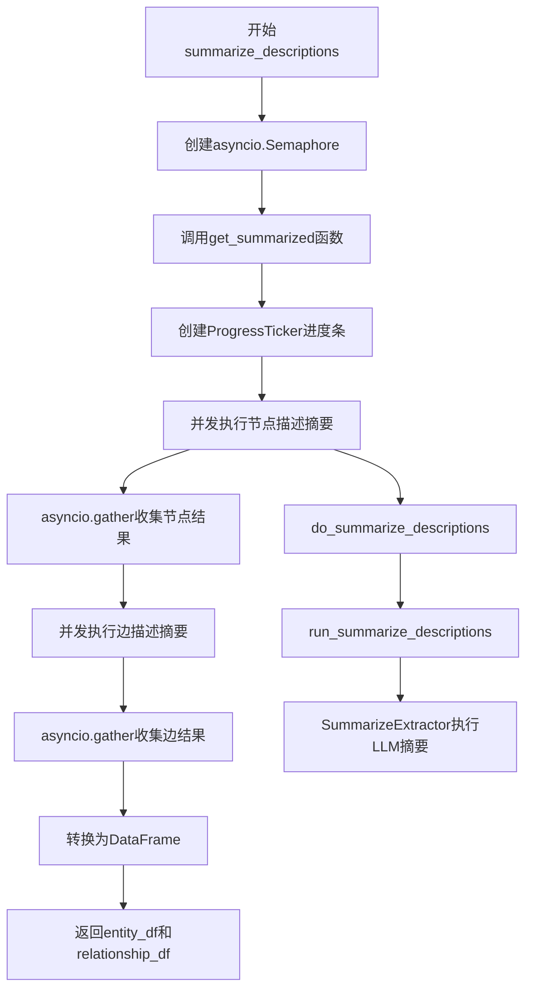
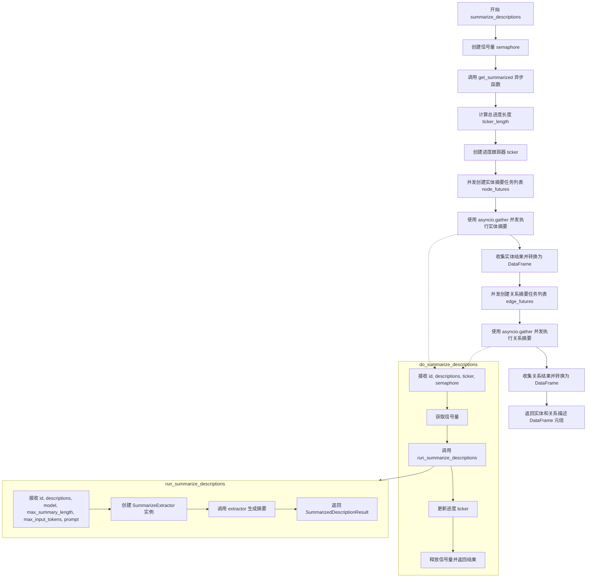
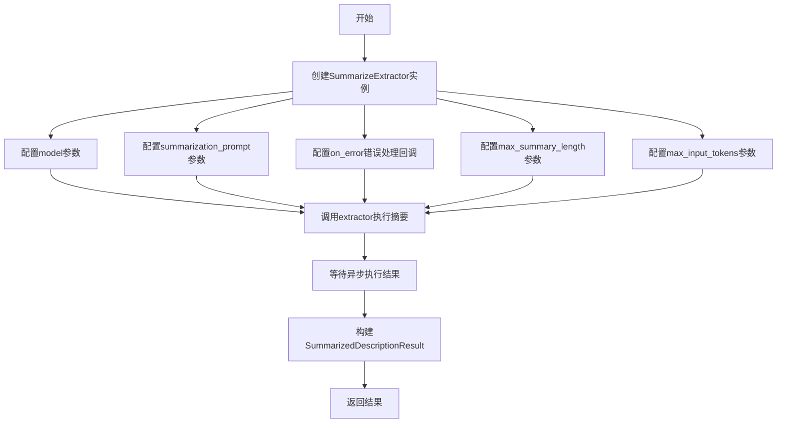
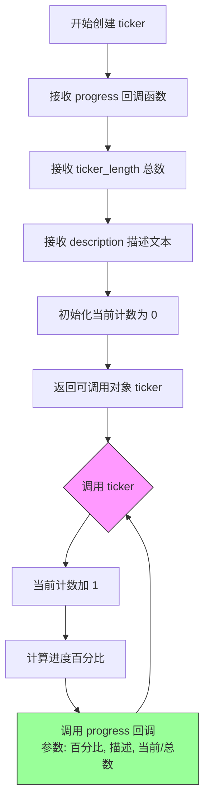
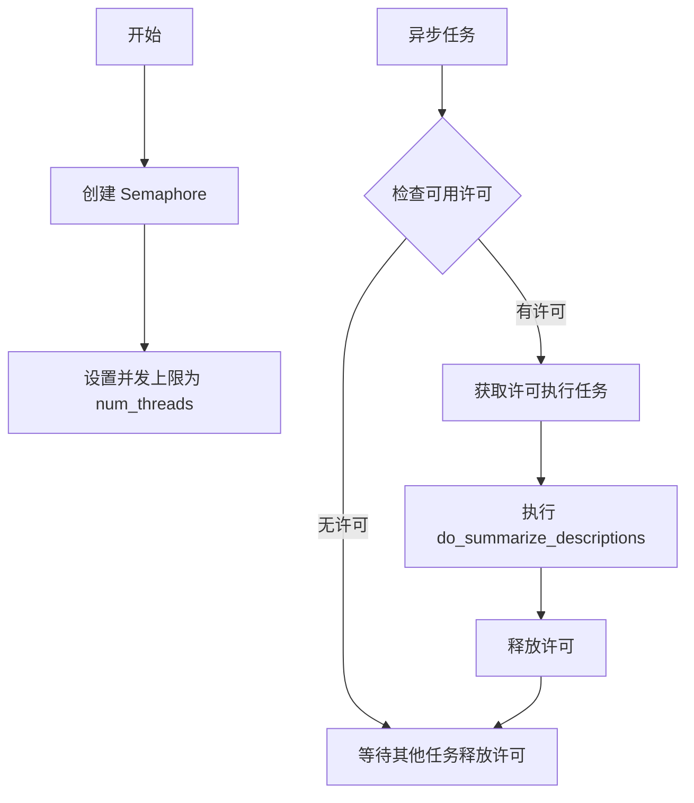
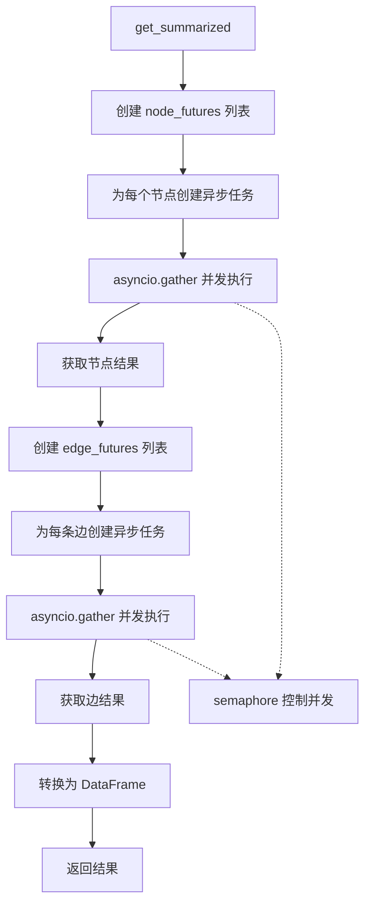
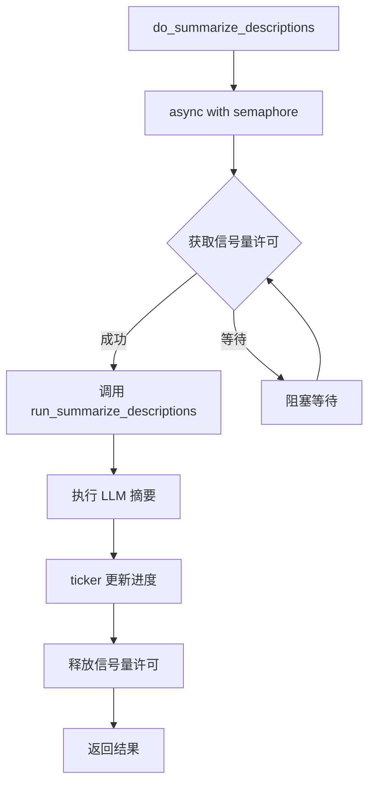
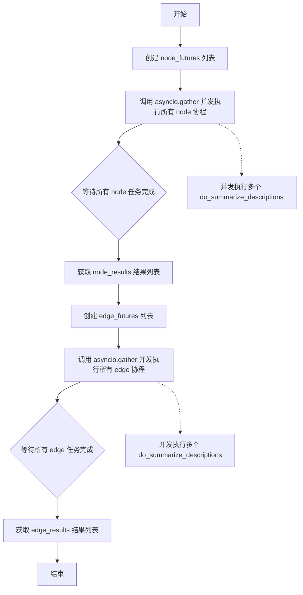
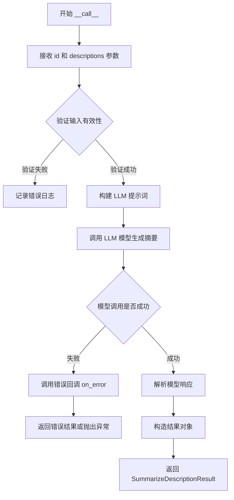

# `graphrag\packages\graphrag\graphrag\index\operations\summarize_descriptions\summarize_descriptions.py` 详细设计文档

这是一个图谱描述摘要模块，通过异步并发方式使用LLM对实体图中的实体和关系描述进行批量摘要处理，支持控制并发数量并返回处理后的实体和关系描述数据框。

## 整体流程



## 类结构

```
summarize_descriptions (模块)
├── summarize_descriptions (主异步函数)
│   ├── get_summarized (内部异步函数)
│   │   └── do_summarize_descriptions (内部异步函数)
└── run_summarize_descriptions (异步函数)
```

## 全局变量及字段


### `logger`
    
模块级别的日志记录器，用于记录错误和调试信息

类型：`logging.Logger`
    


### `entities_df`
    
包含实体数据的DataFrame，包含title和description列

类型：`pd.DataFrame`
    


### `relationships_df`
    
包含关系数据的DataFrame，包含source、target和description列

类型：`pd.DataFrame`
    


### `callbacks`
    
工作流回调对象，用于进度报告

类型：`WorkflowCallbacks`
    


### `model`
    
语言模型用于生成描述摘要

类型：`LLMCompletion`
    


### `max_summary_length`
    
摘要的最大字符长度限制

类型：`int`
    


### `max_input_tokens`
    
输入模型的最大token数限制

类型：`int`
    


### `prompt`
    
用于指导语言模型生成摘要的提示模板

类型：`str`
    


### `num_threads`
    
并发执行的最大线程数，用于控制并发度

类型：`int`
    


### `semaphore`
    
异步信号量，用于限制并发执行的任务数量

类型：`asyncio.Semaphore`
    


### `ticker`
    
进度计数器，用于更新和显示处理进度

类型：`ProgressTicker`
    


### `ticker_length`
    
进度条的总长度，等于节点数加边数

类型：`int`
    


### `node_futures`
    
存储所有实体摘要异步任务的列表

类型：`list[asyncio.Task]`
    


### `node_results`
    
存储所有实体摘要结果的列表

类型：`list[SummarizedDescriptionResult]`
    


### `node_descriptions`
    
存储格式化后实体描述的列表，包含title和description

类型：`list[dict]`
    


### `edge_futures`
    
存储所有关系摘要异步任务的列表

类型：`list[asyncio.Task]`
    


### `edge_results`
    
存储所有关系摘要结果的列表

类型：`list[SummarizedDescriptionResult]`
    


### `edge_descriptions`
    
存储格式化后关系描述的列表，包含source、target和description

类型：`list[dict]`
    


### `entity_descriptions`
    
包含所有实体摘要的DataFrame

类型：`pd.DataFrame`
    


### `relationship_descriptions`
    
包含所有关系摘要的DataFrame

类型：`pd.DataFrame`
    


### `result`
    
单个实体或关系的摘要结果，包含id和description

类型：`SummarizedDescriptionResult`
    


### `SummarizeExtractor.model`
    
用于生成摘要的语言模型实例

类型：`LLMCompletion`
    


### `SummarizeExtractor.summarization_prompt`
    
用于指导摘要生成的提示模板

类型：`str`
    


### `SummarizeExtractor.on_error`
    
错误处理回调函数，当摘要生成失败时调用

类型：`Callable`
    


### `SummarizeExtractor.max_summary_length`
    
生成摘要的最大字符长度限制

类型：`int`
    


### `SummarizeExtractor.max_input_tokens`
    
输入模型的最大token数限制

类型：`int`
    


### `WorkflowCallbacks.progress`
    
进度回调函数，用于报告操作进度

类型：`Callable`
    


### `SummarizedDescriptionResult.id`
    
实体或关系的唯一标识符

类型：`str | tuple[str, str]`
    


### `SummarizedDescriptionResult.description`
    
生成的内容描述或摘要文本

类型：`str`
    
    

## 全局函数及方法


### `summarize_descriptions`

这是一个异步函数，用于使用语言模型对实体图中的实体和关系描述进行摘要总结。它接收实体和关系数据框，并发地为每个实体和关系调用语言模型生成描述摘要，最后返回包含摘要结果的实体描述和关系描述数据框。

参数：

- `entities_df`：`pd.DataFrame`，包含实体的数据框，必须包含 title 和 description 列
- `relationships_df`：`pd.DataFrame`，包含关系的数据框，必须包含 source、target 和 description 列
- `callbacks`：`WorkflowCallbacks`，工作流回调接口，用于报告进度
- `model`：`LLMCompletion`，语言模型实例，用于生成描述摘要
- `max_summary_length`：`int`，生成摘要的最大长度限制
- `max_input_tokens`：`int`，输入语言模型的最大 token 数限制
- `prompt`：`str`，用于指导语言模型生成摘要的提示词模板
- `num_threads`：`int`，并发执行的最大线程数，控制同时处理的任务数量

返回值：`tuple[pd.DataFrame, pd.DataFrame]`，返回一个元组，包含两个 pandas DataFrame：第一个是实体描述摘要（包含 title 和 description 列），第二个是关系描述摘要（包含 source、target 和 description 列）

#### 流程图



#### 带注释源码

```python
import asyncio
import logging
from typing import TYPE_CHECKING

import pandas as pd

from graphrag.callbacks.workflow_callbacks import WorkflowCallbacks
from graphrag.index.operations.summarize_descriptions.description_summary_extractor import (
    SummarizeExtractor,
)
from graphrag.index.operations.summarize_descriptions.typing import (
    SummarizedDescriptionResult,
)
from graphrag.logger.progress import ProgressTicker, progress_ticker

# 仅在类型检查时导入 LLMCompletion，避免循环依赖
if TYPE_CHECKING:
    from graphrag_llm.completion import LLMCompletion

# 获取模块日志记录器
logger = logging.getLogger(__name__)


async def summarize_descriptions(
    entities_df: pd.DataFrame,
    relationships_df: pd.DataFrame,
    callbacks: WorkflowCallbacks,
    model: "LLMCompletion",
    max_summary_length: int,
    max_input_tokens: int,
    prompt: str,
    num_threads: int,
) -> tuple[pd.DataFrame, pd.DataFrame]:
    """Summarize entity and relationship descriptions from an entity graph, using a language model."""

    # 定义内部异步函数：获取实体和关系的摘要
    async def get_summarized(
        nodes: pd.DataFrame, edges: pd.DataFrame, semaphore: asyncio.Semaphore
    ):
        # 计算总进度长度 = 实体数量 + 关系数量
        ticker_length = len(nodes) + len(edges)

        # 创建进度跟踪器，用于报告处理进度
        ticker = progress_ticker(
            callbacks.progress,
            ticker_length,
            description="Summarize entity/relationship description progress: ",
        )

        # 为每个实体创建异步摘要任务
        node_futures = [
            do_summarize_descriptions(
                str(row.title),  # type: ignore
                sorted(set(row.description)),  # type: ignore
                ticker,
                semaphore,
            )
            for row in nodes.itertuples(index=False)
        ]

        # 并发执行所有实体摘要任务
        node_results = await asyncio.gather(*node_futures)

        # 将实体结果转换为字典列表
        node_descriptions = [
            {
                "title": result.id,
                "description": result.description,
            }
            for result in node_results
        ]

        # 为每个关系创建异步摘要任务
        edge_futures = [
            do_summarize_descriptions(
                (str(row.source), str(row.target)),  # type: ignore
                sorted(set(row.description)),  # type: ignore
                ticker,
                semaphore,
            )
            for row in edges.itertuples(index=False)
        ]

        # 并发执行所有关系摘要任务
        edge_results = await asyncio.gather(*edge_futures)

        # 将关系结果转换为字典列表
        edge_descriptions = [
            {
                "source": result.id[0],
                "target": result.id[1],
                "description": result.description,
            }
            for result in edge_results
        ]

        # 转换为 pandas DataFrame
        entity_descriptions = pd.DataFrame(node_descriptions)
        relationship_descriptions = pd.DataFrame(edge_descriptions)
        return entity_descriptions, relationship_descriptions

    # 定义内部异步函数：执行单个实体或关系的摘要
    async def do_summarize_descriptions(
        id: str | tuple[str, str],
        descriptions: list[str],
        ticker: ProgressTicker,
        semaphore: asyncio.Semaphore,
    ):
        # 使用信号量控制并发数量
        async with semaphore:
            # 调用底层摘要生成函数
            results = await run_summarize_descriptions(
                id,
                descriptions,
                model,
                max_summary_length,
                max_input_tokens,
                prompt,
            )
            # 更新进度
            ticker(1)
        return results

    # 创建信号量，限制并发数量
    semaphore = asyncio.Semaphore(num_threads)

    # 调用主处理函数并返回结果
    return await get_summarized(entities_df, relationships_df, semaphore)


async def run_summarize_descriptions(
    id: str | tuple[str, str],
    descriptions: list[str],
    model: "LLMCompletion",
    max_summary_length: int,
    max_input_tokens: int,
    prompt: str,
) -> SummarizedDescriptionResult:
    """Run the graph intelligence entity extraction strategy."""
    # 创建描述摘要提取器实例
    extractor = SummarizeExtractor(
        model=model,
        summarization_prompt=prompt,
        # 定义错误处理回调函数
        on_error=lambda e, stack, details: logger.error(
            "Entity Extraction Error",
            exc_info=e,
            extra={"stack": stack, "details": details},
        ),
        max_summary_length=max_summary_length,
        max_input_tokens=max_input_tokens,
    )

    # 调用提取器生成摘要
    result = await extractor(id=id, descriptions=descriptions)
    # 返回封装后的结果
    return SummarizedDescriptionResult(id=result.id, description=result.description)
```


### `summarize_descriptions.get_summarized`

该函数是一个内部异步辅助函数，负责并发地汇总实体图中的节点（实体）和边（关系）的描述。它通过信号量控制并发数量，使用进度条跟踪处理进度，并行调用语言模型生成摘要，最终将结果转换为两个DataFrame返回。

参数：

- `nodes`：`pd.DataFrame`，包含实体的节点数据，需要进行摘要处理的节点集合
- `edges`：`pd.DataFrame`，包含关系数据的边数据，需要进行摘要处理的关系集合
- `semaphore`：`asyncio.Semaphore`，用于控制并发数量的信号量，确保同时运行的任务数不超过指定阈值

返回值：`tuple[pd.DataFrame, pd.DataFrame]`，返回两个DataFrame——第一个包含实体的标题和描述，第二个包含关系的源、目标节点和描述

#### 流程图

```mermaid
flowchart TD
    A[开始 get_summarized] --> B[计算 ticker_length = len(nodes + len(edges))]
    B --> C[创建 progress_ticker 进度条]
    C --> D[为 nodes 中每个行创建 do_summarize_descriptions 任务]
    D --> E[asyncio.gather 并发执行所有 node 摘要任务]
    E --> F[收集 node_results 并转换为 node_descriptions 列表]
    F --> G[为 edges 中每个行创建 do_summarize_descriptions 任务]
    G --> H[asyncio.gather 并发执行所有 edge 摘要任务]
    H --> I[收集 edge_results 并转换为 edge_descriptions 列表]
    I --> J[将 node_descriptions 转换为 DataFrame: entity_descriptions]
    J --> K[将 edge_descriptions 转换为 DataFrame: relationship_descriptions]
    K --> L[返回 tuple[entity_descriptions, relationship_descriptions]]
```

#### 带注释源码

```python
async def get_summarized(
    nodes: pd.DataFrame, edges: pd.DataFrame, semaphore: asyncio.Semaphore
):
    """异步内部函数：汇总节点和边的描述信息"""
    
    # 计算进度条总长度（节点数 + 边数）
    ticker_length = len(nodes) + len(edges)

    # 创建进度条跟踪器，用于显示处理进度
    ticker = progress_ticker(
        callbacks.progress,
        ticker_length,
        description="Summarize entity/relationship description progress: ",
    )

    # 为每个节点创建描述摘要任务
    node_futures = [
        do_summarize_descriptions(
            str(row.title),  # 将节点标题转为字符串作为ID
            sorted(set(row.description)),  # 去重并排序描述
            ticker,
            semaphore,
        )
        for row in nodes.itertuples(index=False)  # 遍历所有节点行
    ]

    # 并发执行所有节点摘要任务
    node_results = await asyncio.gather(*node_futures)

    # 将节点结果转换为字典列表格式
    node_descriptions = [
        {
            "title": result.id,  # 使用结果ID作为标题
            "description": result.description,  # 使用生成的描述
        }
        for result in node_results
    ]

    # 为每条边创建描述摘要任务
    edge_futures = [
        do_summarize_descriptions(
            (str(row.source), str(row.target)),  # 元组形式的边ID
            sorted(set(row.description)),  # 去重并排序描述
            ticker,
            semaphore,
        )
        for row in edges.itertuples(index=False)  # 遍历所有边行
    ]

    # 并发执行所有边摘要任务
    edge_results = await asyncio.gather(*edge_futures)

    # 将边结果转换为字典列表格式
    edge_descriptions = [
        {
            "source": result.id[0],  # 边的源节点
            "target": result.id[1],  # 边的目标节点
            "description": result.description,  # 生成的描述
        }
        for result in edge_results
    ]

    # 转换为 pandas DataFrame 格式
    entity_descriptions = pd.DataFrame(node_descriptions)
    relationship_descriptions = pd.DataFrame(edge_descriptions)
    
    # 返回实体描述和关系描述的 DataFrame 元组
    return entity_descriptions, relationship_descriptions
```


### `do_summarize_descriptions`

该函数是 `summarize_descriptions` 模块内部的异步辅助函数，负责对单个实体或关系进行描述摘要处理。它接收实体/关系的ID、描述列表以及并发控制信号量，通过信号量限制并发数量，调用核心摘要提取逻辑，并在完成后更新进度指示器。

参数：

- `id`：`str | tuple[str, str]`，实体ID（字符串）或关系ID（由源和目标组成的元组）
- `descriptions`：`list[str]`，需要摘要的描述列表
- `ticker`：`ProgressTicker`，进度回调函数，用于报告当前处理进度
- `semaphore`：`asyncio.Semaphore`，用于控制并发数量的信号量

返回值：`SummarizedDescriptionResult`，包含摘要后的ID和描述结果

#### 流程图

```mermaid
flowchart TD
    A[开始 do_summarize_descriptions] --> B[获取信号量 lock]
    B --> C[调用 run_summarize_descriptions]
    C --> D[执行摘要提取]
    D --> E[更新进度: ticker(1)]
    E --> F[释放信号量]
    F --> G[返回 SummarizedDescriptionResult]
```

#### 带注释源码

```python
async def do_summarize_descriptions(
    id: str | tuple[str, str],  # 实体ID字符串 或 关系ID元组 (source, target)
    descriptions: list[str],     # 待摘要的描述文本列表
    ticker: ProgressTicker,       # 进度报告回调函数
    semaphore: asyncio.Semaphore # 并发控制信号量
):
    """
    对单个实体或关系的描述进行异步摘要处理。
    
    Args:
        id: 实体标识符（字符串）或关系标识符（源-目标元组）
        descriptions: 需要汇总的描述文本集合
        ticker: 进度条更新回调，每处理完一条记录调用一次
        semaphore: 用于限制并发数量的信号量
    
    Returns:
        SummarizedDescriptionResult: 包含原始ID和摘要后描述的结果对象
    """
    # 使用信号量控制并发，确保不超过指定数量的并发任务
    async with semaphore:
        # 调用核心摘要提取函数，传入ID、描述列表、语言模型和配置参数
        results = await run_summarize_descriptions(
            id,
            descriptions,
            model,
            max_summary_length,
            max_input_tokens,
            prompt,
        )
        # 更新处理进度，标记已完成一个实体/关系的摘要
        ticker(1)
    # 返回包含ID和描述的摘要结果
    return results
```


### `run_summarize_descriptions`

该函数执行图智能实体提取策略，通过语言模型对实体或关系的描述进行摘要处理。它接收实体/关系的ID和描述列表，使用配置好的提取器和提示词生成摘要，并返回包含ID和描述的`SummarizedDescriptionResult`对象。

参数：

- `id`：`str | tuple[str, str]`，实体或关系的标识符。对于节点是字符串，对于边是源和目标组成的元组
- `descriptions`：`list[str]`，需要摘要的描述列表
- `model`：`LLMCompletion`，用于执行摘要的语言模型
- `max_summary_length`：`int`，摘要的最大长度限制
- `max_input_tokens`：`int`，输入令牌的最大数量限制
- `prompt`：`str`，用于引导语言模型生成摘要的提示词

返回值：`SummarizedDescriptionResult`，包含摘要后的描述结果

#### 流程图



#### 带注释源码

```python
async def run_summarize_descriptions(
    id: str | tuple[str, str],           # 实体ID或关系边元组
    descriptions: list[str],             # 待摘要的描述文本列表
    model: "LLMCompletion",              # 语言模型实例
    max_summary_length: int,             # 摘要最大长度
    max_input_tokens: int,               # 输入最大token数
    prompt: str,                         # 摘要提示词
) -> SummarizedDescriptionResult:        # 返回摘要结果对象
    """Run the graph intelligence entity extraction strategy."""
    
    # 创建描述摘要提取器，配置模型、提示词、错误处理和限制参数
    extractor = SummarizeExtractor(
        model=model,                                     # 传入语言模型
        summarization_prompt=prompt,                    # 传入提示词模板
        on_error=lambda e, stack, details: logger.error(  # 错误处理回调
            "Entity Extraction Error",
            exc_info=e,
            extra={"stack": stack, "details": details},
        ),
        max_summary_length=max_summary_length,          # 摘要长度限制
        max_input_tokens=max_input_tokens,               # 输入token限制
    )

    # 异步调用提取器处理ID和描述列表
    result = await extractor(id=id, descriptions=descriptions)
    
    # 将结果封装为SummarizedDescriptionResult并返回
    return SummarizedDescriptionResult(
        id=result.id,              # 保持原始ID
        description=result.description  # 填充摘要后的描述
    )
```


### `progress_ticker`

创建并返回一个用于报告异步任务进度的回调函数（ticker）。

参数：

-  `progress`：未知类型，来自 `callbacks.progress`，用于报告进度
-  `ticker_length`：`int`，需要处理的总项目数（实体数量 + 关系数量）
-  `description`：`str`，进度条显示的描述文本

返回值：`ProgressTicker`，一个可调用对象，每次调用时增加进度计数

#### 流程图



#### 带注释源码

```python
# 从 graphrag.logger.progress 模块导入的进度 ticker 函数
# 注意：这是外部模块定义的函数，此处基于代码调用方式推断其实现

from typing import Callable, Any

def progress_ticker(
    progress: Callable[[float, str, tuple[int, int]], Any],  # 进度回调函数
    ticker_length: int,                                        # 总项目数
    description: str                                           # 进度描述
) -> Callable[[int], None]:
    """
    创建并返回一个 ticker 函数，用于报告异步任务的进度。
    
    参数:
        progress: 进度回调函数，接收 (百分比, 描述, (当前, 总数))
        ticker_length: 需要处理的总项目数
        description: 显示在进度条旁边的描述文本
    
    返回:
        一个可调用对象，每次调用时会增加进度计数并触发回调
    """
    
    # 初始化当前已处理的项数
    current = 0
    
    def ticker(amount: int = 1) -> None:
        """
        进度 ticker 的实际调用函数。
        
        参数:
            amount: 每次调用增加的进度数量，默认为 1
        """
        nonlocal current
        current += amount
        
        # 计算进度百分比
        percent = (current / ticker_length) * 100 if ticker_length > 0 else 0
        
        # 调用进度回调函数报告当前进度
        progress(
            percent,
            description,
            (current, ticker_length)
        )
    
    return ticker


# 在 summarize_descriptions 中的使用示例:
# ticker_length = len(nodes) + len(edges)
# ticker = progress_ticker(
#     callbacks.progress,
#     ticker_length,
#     description="Summarize entity/relationship description progress: "
# )
# 
# # 每次处理完一个实体或关系后调用 ticker(1)
# node_futures = [
#     do_summarize_descriptions(..., ticker, semaphore)
#     for row in nodes.itertuples(index=False)
# ]
```


# asyncio.Semaphore 在代码中的使用分析

## 1. 核心功能概述

该代码模块实现了对图谱中实体和关系描述的异步摘要功能，使用 `asyncio.Semaphore` 控制并发摘要任务的数量，防止对 LLM API 造成过大的并发压力。

---

### `summarize_descriptions.semaphore` (创建)

在 `summarize_descriptions` 函数中创建并发控制信号量。

#### 参数

- `num_threads`：`int`，允许同时执行的最大并发任务数

返回值：`asyncio.Semaphore`，用于限制异步并发数的信号量

#### 流程图



#### 带注释源码

```python
# 在 summarize_descriptions 函数内部创建信号量
# num_threads 控制同时进行摘要任务的最大数量
semaphore = asyncio.Semaphore(num_threads)
```

---

### `get_summarized` 函数中的 semaphore 参数

内部异步函数，使用信号量控制并发。

#### 参数

- `nodes`：`pd.DataFrame`，实体数据
- `edges`：`pd.DataFrame`，关系数据
- `semaphore`：`asyncio.Semaphore`，并发控制信号量

返回值：`(pd.DataFrame, pd.DataFrame)`，返回实体描述和关系描述的两个 DataFrame

#### 流程图



#### 带注释源码

```python
async def get_summarized(
    nodes: pd.DataFrame, edges: pd.DataFrame, semaphore: asyncio.Semaphore
):
    """获取摘要后的实体和关系描述"""
    
    # 使用 progress_ticker 显示进度
    ticker = progress_ticker(
        callbacks.progress,
        ticker_length,
        description="Summarize entity/relationship description progress: ",
    )
    
    # 为每个节点创建异步任务，semaphore 作为参数传入
    node_futures = [
        do_summarize_descriptions(
            str(row.title),
            sorted(set(row.description)),
            ticker,
            semaphore,  # 传递信号量用于并发控制
        )
        for row in nodes.itertuples(index=False)
    ]
    
    # 并发执行所有节点摘要任务，受 semaphore 限制
    node_results = await asyncio.gather(*node_futures)
    
    # 同样的模式应用于边
    edge_futures = [
        do_summarize_descriptions(
            (str(row.source), str(row.target)),
            sorted(set(row.description)),
            ticker,
            semaphore,  # 传递信号量用于并发控制
        )
        for row in edges.itertuples(index=False)
    ]
    
    edge_results = await asyncio.gather(*edge_futures)
    
    # 转换结果为 DataFrame
    entity_descriptions = pd.DataFrame(node_descriptions)
    relationship_descriptions = pd.DataFrame(edge_descriptions)
    
    return entity_descriptions, relationship_descriptions
```

---

### `do_summarize_descriptions` 函数中的 semaphore 参数

执行单个实体或关系的摘要，使用信号量控制并发。

#### 参数

- `id`：`str | tuple[str, str]`，实体ID或(源,目标)元组
- `descriptions`：`list[str]`，描述列表
- `ticker`：`ProgressTicker`，进度回调
- `semaphore`：`asyncio.Semaphore`，并发控制信号量

返回值：`SummarizedDescriptionResult`，包含ID和摘要描述的结果

#### 流程图



#### 带注释源码

```python
async def do_summarize_descriptions(
    id: str | tuple[str, str],
    descriptions: list[str],
    ticker: ProgressTicker,
    semaphore: asyncio.Semaphore,  # 并发控制信号量
):
    """执行单个描述的摘要任务"""
    
    # 使用 async with 确保信号量许可被正确获取和释放
    # 这是线程安全的并发控制方式
    async with semaphore:
        # 执行实际的摘要逻辑
        results = await run_summarize_descriptions(
            id,
            descriptions,
            model,
            max_summary_length,
            max_input_tokens,
            prompt,
        )
        # 更新进度
        ticker(1)
    
    # 离开 async with 块时自动释放信号量许可
    return results
```

---

## 关键组件信息

| 组件名称 | 描述 |
|---------|------|
| `asyncio.Semaphore(num_threads)` | 创建信号量，限制最大并发数为 `num_threads` |
| `async with semaphore` | 上下文管理器，自动获取和释放信号量许可 |
| `ticker` | 进度跟踪器，用于显示摘要任务进度 |

---

## 技术债务与优化空间

1. **错误处理不足**：`asyncio.gather` 没有显式的 `return_exceptions=True` 处理，如果单个任务失败可能导致整体失败
2. **缺少重试机制**：LLM 调用可能因网络问题失败，没有重试逻辑
3. **硬编码错误处理**：`do_summarize_descriptions` 中的错误会被直接抛出，缺少优雅降级
4. **资源清理**：虽然 `semaphore` 使用上下文管理器自动释放，但建议添加超时机制防止任务永久阻塞

---

## 其他设计说明

### 设计目标
- 使用信号量模式控制并发，避免对 LLM API 造成过载
- 通过 `num_threads` 参数允许用户配置并发能力

### 并发控制流程
```
summarize_descriptions (创建 Semaphore)
    │
    ▼
get_summarized (传递 Semaphore)
    │
    ├──► node_futures ──► asyncio.gather ──► 受 Semaphore 控制
    │
    └──► edge_futures ──► asyncio.gather ──► 受 Semaphore 控制
```

### 外部依赖
- `asyncio.Semaphore`：Python 标准库，用于异步并发控制
- `graphrag_llm.completion.LLMCompletion`：LLM 模型接口


### `asyncio.gather`

在 `summarize_descriptions` 函数中，`asyncio.gather` 被用于并发执行多个异步描述摘要任务。它接收多个协程（asyncio 任务）作为参数，并等待所有任务完成返回一个包含所有结果的列表。该函数允许同时处理多个实体和关系的描述摘要，通过并发执行提高处理效率。

参数：

-  `*node_futures`：`list[Coroutine]`，由 `do_summarize_descriptions` 创建的协程对象列表，代表待处理的实体描述摘要任务
-  `*edge_futures`：`list[Coroutine]`，由 `do_summarize_descriptions` 创建的协程对象列表，代表待处理的关系描述摘要任务

返回值：`list[Any]`（第一个用法）和 `list[Any]`（第二个用法），返回所有并发任务的结果列表，结果顺序与输入的协程顺序一致。对于实体摘要，返回 `SummarizedDescriptionResult` 对象列表；对于关系摘要，同样返回 `SummarizedDescriptionResult` 对象列表。

#### 流程图



#### 带注释源码

```python
# 第一次使用 asyncio.gather：并发执行所有实体描述摘要任务
# node_futures 是一个列表，包含多个协程对象，每个协程调用 do_summarize_descriptions
# asyncio.gather 会并发运行所有这些协程，并返回一个结果列表
node_results = await asyncio.gather(*node_futures)

# 第二次使用 asyncio.gather：并发执行所有关系描述摘要任务
# edge_futures 同样是协程列表，与节点处理方式相同
# 区别在于处理的是边（关系）的描述摘要
edge_results = await asyncio.gather(*edge_futures)
```

#### 完整调用上下文

```python
# 在 get_summarized 异步函数内部，asyncio.gather 的使用上下文：

async def get_summarized(
    nodes: pd.DataFrame, edges: pd.DataFrame, semaphore: asyncio.Semaphore
):
    # ... ticker 设置 ...
    
    # 构建实体摘要任务列表：为每个节点创建一个协程
    node_futures = [
        do_summarize_descriptions(
            str(row.title),  # 节点ID
            sorted(set(row.description)),  # 描述列表
            ticker,
            semaphore,
        )
        for row in nodes.itertuples(index=False)
    ]

    # 使用 asyncio.gather 并发执行所有实体摘要任务
    # semaphore 控制并发数量，避免过多并发导致资源耗尽
    node_results = await asyncio.gather(*node_futures)

    # 构建关系摘要任务列表：为每条边创建一个协程
    edge_futures = [
        do_summarize_descriptions(
            (str(row.source), str(row.target)),  # 边ID (源节点, 目标节点)
            sorted(set(row.description)),  # 描述列表
            ticker,
            semaphore,
        )
        for row in edges.itertuples(index=False)
    ]

    # 使用 asyncio.gather 并发执行所有关系摘要任务
    edge_results = await asyncio.gather(*edge_futures)

    # 将结果转换为 DataFrame 格式
    # ...
```


### `SummarizeExtractor.__call__`

该方法是 SummarizeExtractor 类的核心调用方法，用于异步调用语言模型对实体或关系的描述进行摘要处理。它接收要摘要的实体/关系ID和描述列表，通过内部封装的 LLM 模型和提示词模板生成精简的描述摘要。

参数：

- `id`：`str | tuple[str, str]`，要摘要的实体ID（字符串）或关系ID（源-目标元组）
- `descriptions`：`list[str]`，需要汇总的描述文本列表

返回值：`Any`（异步返回），返回一个包含 `id` 和 `description` 属性的对象，其中 `id` 是原始输入的标识符，`description` 是生成的摘要文本

#### 流程图



#### 带注释源码

```python
# 注意：由于 SummarizeExtractor 类定义在外部模块中，以下是根据代码调用推断的 __call__ 方法结构

async def __call__(
    self,
    id: str | tuple[str, str],  # 输入的实体ID或关系ID元组
    descriptions: list[str],    # 需要摘要的描述列表
) -> SummarizedDescriptionResult:
    """异步调用方法，对实体或关系的描述进行摘要处理
    
    参数:
        id: 实体标识符（字符串）或关系标识符（源-目标元组）
        descriptions: 待汇总的描述文本列表
        
    返回:
        包含原始ID和生成摘要的结果对象
    """
    # 1. 准备输入数据，将描述列表格式化为模型输入
    # 2. 调用底层的 LLM 模型（如 GPT-4）进行摘要生成
    # 3. 处理模型返回的结果，提取摘要文本
    # 4. 构造并返回 SummarizedDescriptionResult 对象
    
    # 以下为代码中实际调用的形式：
    result = await extractor(id=id, descriptions=descriptions)
    return SummarizedDescriptionResult(id=result.id, description=result.description)
```

#### 说明

根据代码中的调用模式可以推断，`SummarizeExtractor` 类实现了 `__call__` 方法使其可被直接调用。该方法：

1. 内部创建 `SummarizeExtractor` 实例时传入了 `model`（LLMCompletion）、`summarization_prompt`、`on_error` 错误处理回调、`max_summary_length` 和 `max_input_tokens` 等配置
2. 通过 `await extractor(id=id, descriptions=descriptions)` 方式异步调用
3. 返回结果被转换为 `SummarizedDescriptionResult` 格式，包含原始ID和生成的摘要描述

该方法是整个 `summarize_descriptions` 工作流的核心执行单元，负责与语言模型的实际交互。


### `ProgressTicker.__call__`

ProgressTicker 类的可调用方法，用于更新进度条并增加已完成的计数。当调用此方法时，它会增加内部计数器并通过回调函数报告当前进度。

参数：

-  `self`：`ProgressTicker`，ProgressTicker 类的实例本身
-  `n`：`int`，表示完成的增量数值，通常为 1

返回值：`None`，该方法不返回任何值，仅通过回调更新进度

#### 流程图

```mermaid
flowchart TD
    A[调用 ticker(n)] --> B{检查 n 是否为正数}
    B -->|是| C[增加内部计数器 by n]
    B -->|否| D[记录警告日志]
    C --> E{检查是否达到总数}
    E -->|是| F[调用进度回调, 进度=100%, 显示完成消息]
    E -->|否| G[调用进度回调, 进度=当前百分比, 显示进度描述]
    D --> H[返回, 不执行更新]
    F --> I[结束]
    G --> I
```

#### 带注释源码

```python
# ProgressTicker 类的 __call__ 方法源码（推断自使用方式）

class ProgressTicker:
    """进度票据类，用于跟踪和报告进度"""
    
    def __init__(
        self, 
        progress_callback: Callable,  # 进度回调函数
        total: int,                    # 总任务数
        description: str = ""          # 进度描述
    ):
        self._progress_callback = progress_callback
        self._total = total
        self._description = description
        self._current = 0  # 当前已完成数量
    
    def __call__(self, n: int = 1) -> None:
        """
        更新进度条的可调用方法
        
        Args:
            n: 增量数值，默认为 1，表示完成了 n 个任务
        """
        # 增加当前计数
        self._current += n
        
        # 计算进度百分比
        progress = min(100, int(self._current / self._total * 100))
        
        # 调用进度回调函数报告进度
        self._progress_callback(
            progress,
            description=self._description
        )


# 使用示例（在 summarize_descriptions 函数中）
ticker = progress_ticker(
    callbacks.progress,           # 进度回调函数
    ticker_length,                  # 总任务数（节点数+边数）
    description="Summarize entity/relationship description progress: "
)

# 调用 ProgressTicker 的 __call__ 方法，参数为 1
ticker(1)  # 等价于调用 ProgressTicker.__call__(ticker, 1)
```


## 关键组件


### summarize_descriptions

主入口函数，接收实体DataFrame、关系DataFrame、工作流回调、LLM模型和配置参数，协调整体摘要流程，返回包含摘要描述的实体和关系DataFrame。

### get_summarized

内部异步函数，负责构建节点和边的futures列表，使用asyncio.gather并发执行摘要任务，并组装最终结果为两个DataFrame返回。

### do_summarize_descriptions

内部异步函数，作为单个描述摘要任务的执行单元，通过semaphore控制并发数量，调用run_summarize_descriptions执行实际摘要并更新进度。

### run_summarize_descriptions

异步函数，创建SummarizeExtractor实例并调用其执行摘要，返回包含id和description的SummarizedDescriptionResult对象。

### SummarizeExtractor

描述摘要提取器类，负责调用LLM模型对实体或关系的描述文本进行压缩摘要，支持最大摘要长度和最大输入token数限制。

### SummarizedDescriptionResult

数据类型，包含id和description字段，用于封装单个实体或关系的摘要结果。

### asyncio.Semaphore

并发控制组件，限制同时执行的摘要任务数量，避免对LLM API造成过大压力。

### ProgressTicker

进度报告组件，通过回调函数报告当前处理进度，用于在UI或日志中展示摘要任务的完成情况。

### WorkflowCallbacks

工作流回调接口，提供progress方法用于报告任务进度。


## 问题及建议


### 已知问题

-   **缺乏异常处理与重试机制**：`do_summarize_descriptions` 函数中没有显式的异常捕获和处理逻辑，当 LLM 调用失败时会导致整个任务失败。虽然 `on_error` 回调会记录错误，但不会进行重试，可能导致部分实体/关系描述总结失败后数据不完整。
-   **并发控制粒度不足**：使用单一 `asyncio.Semaphore(num_threads)` 控制所有并发请求，没有区分实体和关系处理的优先级，且无法对单个 LLM 调用设置超时，可能导致任务长时间阻塞。
-   **数据验证缺失**：函数入口没有对 `entities_df` 和 `relationships_df` 的结构进行验证，缺少对必需列（title、description、source、target）的存在性检查，可能导致运行时错误。
-   **类型安全绕过**：多处使用 `# type: ignore` 注释规避类型检查，如 `str(row.title)` 和 `sorted(set(row.description))`，降低了代码的类型安全性和可维护性。
-   **内存效率问题**：使用 `itertuples()` 遍历 DataFrame 时，每次都调用 `sorted(set(row.description))` 进行去重和排序，对于大型数据集会产生额外的内存开销和 CPU 消耗。
-   **内部函数嵌套过深**：`get_summarized` 和 `do_summarize_descriptions` 定义在 `summarize_descriptions` 函数内部，导致函数过长（超过 80 行），降低了代码可读性和可测试性。
-   **日志记录不完善**：缺少对关键操作（如开始/结束处理、成功/失败统计）的结构化日志记录，难以追踪任务执行状态和排查问题。
-   **资源管理不明确**：虽然使用 `async with semaphore` 管理并发控制，但没有显式管理 LLM 调用的资源释放，可能存在潜在的资源泄漏风险。

### 优化建议

-   **添加异常处理与重试机制**：在 `do_summarize_descriptions` 中添加 try-except 块，对 LLM 调用失败进行捕获，并实现指数退避重试逻辑，同时记录失败的实体/关系 ID 以便后续补偿处理。
-   **引入数据验证**：在函数入口添加 DataFrame 结构验证，检查必需列是否存在，以及数据类型的正确性，不符合要求时抛出明确的 ValidationError。
-   **改进并发控制**：为 LLM 调用添加超时参数，可以使用 `asyncio.wait_for` 包装任务，并考虑将 semaphore 分层或使用优先级队列区分实体和关系的处理优先级。
-   **提取内部函数**：将 `get_summarized` 和 `do_summarize_descriptions` 提取为模块级函数或独立的辅助类，提高代码的可测试性和可维护性。
-   **优化数据处理**：在遍历前预处理 DataFrame，去除重复描述并排序，减少循环内的重复计算；对于超大型数据集，考虑分批处理或使用流式处理。
-   **完善日志记录**：使用结构化日志记录关键节点信息，包括处理进度、成功/失败数量、耗时统计等，便于监控和调试。
-   **移除类型忽略注释**：通过定义明确的数据类（dataclass）或 TypedDict 替代动态访问属性，确保类型安全。

## 其它


### 设计目标与约束

**设计目标**：通过异步并发方式，利用大语言模型对知识图谱中的实体和关系描述进行批量摘要生成，减少重复冗余信息，生成简洁的结构化描述。

**约束条件**：
- 依赖外部LLM模型进行摘要生成，需确保模型可用性
- 最大并发数受num_threads参数限制
- 输入Token数受max_input_tokens约束
- 摘要长度受max_summary_length限制
- 仅支持pandas DataFrame格式的输入输出

### 错误处理与异常设计

**错误处理策略**：
- 使用lambda函数捕获LLM调用过程中的异常：`on_error=lambda e, stack, details: logger.error(...)`
- 异常信息包含错误堆栈和详细上下文
- 异步任务中通过`asyncio.gather`收集所有结果，个别任务失败不影响整体流程
- 使用logging模块记录错误级别日志，包含exc_info和extra信息

**异常传播机制**：
- LLM调用异常通过logger记录但不中断执行流程
- Semaphore相关异常会自然传播到调用方

### 数据流与状态机

**数据输入流**：
- entities_df: 包含title和description列的实体DataFrame
- relationships_df: 包含source、target和description列的关系DataFrame

**数据处理流程**：
```
输入DataFrame → 转换为行迭代器 → 构建异步任务列表 → 并发执行摘要 → 收集结果 → 转换为输出DataFrame
```

**状态变化**：
1. 初始状态：接收原始entities和relationships DataFrame
2. 处理状态：通过progress_ticker报告进度
3. 完成状态：返回包含摘要的entity_descriptions和relationship_descriptions DataFrame

### 外部依赖与接口契约

**核心依赖**：
- `graphrag.callbacks.workflow_callbacks.WorkflowCallbacks`: 工作流回调接口，用于进度报告
- `graphrag.index.operations.summarize_descriptions.description_summary_extractor.SummarizeExtractor`: 描述摘要提取器
- `graphrag.index.operations.summarize_descriptions.typing.SummarizedDescriptionResult`: 摘要结果类型定义
- `graphrag_llm.completion.LLMCompletion`: LLMCompletion接口（类型提示）
- `graphrag.logger.progress.ProgressTicker`: 进度 ticker 接口

**接口契约**：
- `summarize_descriptions`函数：接收DataFrame和配置参数，返回元组(pd.DataFrame, pd.DataFrame)
- `run_summarize_descriptions`函数：内部函数，执行单个实体/关系的摘要生成
- `get_summarized`内部函数：管理整体异步流程和进度追踪
- `do_summarize_descriptions`内部函数：包装单个摘要任务的异步执行

### 并发与异步处理设计

**并发模型**：
- 使用Python asyncio实现异步并发
- 通过`asyncio.Semaphore(num_threads)`控制最大并发数
- 使用`asyncio.gather`并行执行多个摘要任务
- 每个实体/关系的描述去重后统一处理

**异步任务划分**：
- 节点摘要任务组：遍历entities_df的所有行
- 边摘要任务组：遍历relationships_df的所有行
- 两组任务通过各自的future列表并行提交

### 配置与参数说明

| 参数名 | 类型 | 描述 |
|--------|------|------|
| entities_df | pd.DataFrame | 实体数据框，需包含title和description列 |
| relationships_df | pd.DataFrame | 关系数据框，需包含source、target和description列 |
| callbacks | WorkflowCallbacks | 进度回调接口 |
| model | LLMCompletion | LLM模型实例 |
| max_summary_length | int | 摘要最大长度 |
| max_input_tokens | int | 输入LLM的最大token数 |
| prompt | str | 摘要生成提示词模板 |
| num_threads | int | 最大并发线程数 |

### 性能考虑与优化空间

**当前性能特征**：
- 并发数可通过num_threads调节，默认值由调用方指定
- 使用set去重描述，减少重复输入
- 使用sorted保证顺序一致性

**潜在优化空间**：
- 批量处理：当前逐个提交任务，可考虑批量提交减少调度开销
- 缓存机制：相同实体/关系的重复调用可考虑结果缓存
- 错误重试：当前失败直接记录日志，可增加重试机制
- 资源预分配：ticker_length预先计算，大数据集可考虑流式处理

### 安全考虑

**数据安全**：
- 描述文本通过LLM处理，需确保传输链路安全
- 日志中包含错误详情，需注意敏感信息过滤
- 无持久化存储，内存中的数据随函数结束释放

**输入验证**：
- 依赖调用方保证DataFrame格式正确
- 未对title、description等字段进行空值校验

### 可扩展性设计

**扩展方向**：
- 支持自定义摘要策略：可注入不同的SummarizeExtractor实现
- 支持更多输出格式：当前仅支持DataFrame，可扩展JSON、Graph等格式
- 支持分布式处理：当前为单进程异步，可扩展为多进程/多节点
- 支持增量处理：可增加状态追踪支持增量更新

### 日志与监控

**日志记录**：
- 使用`logging.getLogger(__name__)`获取模块级logger
- 错误日志级别：logger.error，包含完整的异常堆栈信息
- 日志额外字段：stack、details用于问题排查
- 进度报告：通过callbacks.progress接口的ticker实现

**监控指标**：
- 处理进度：ticker_length和当前进度
- 并发控制：Semaphore占用情况
- LLM调用：依赖SummarizeExtractor内部监控

### 测试考虑

**测试策略**：
- 单元测试：测试run_summarize_descriptions的单次调用
- 集成测试：测试完整的数据流和异步流程
- Mock对象：需要Mock LLMCompletion和WorkflowCallbacks

**测试覆盖点**：
- 空输入处理
- 单实体/单关系处理
- 并发数边界测试
- 错误场景测试

### 版本兼容性

**类型提示**：
- 使用`TYPE_CHECKING`条件导入避免运行时循环依赖
- 字符串引用LLMCompletion类型：`"LLMCompletion"`
- Python 3.9+兼容的联合类型语法：`str | tuple[str, str]`

**依赖版本**：
- pandas: 数据处理
- asyncio: 内置异步库
- typing: 内置类型提示

    