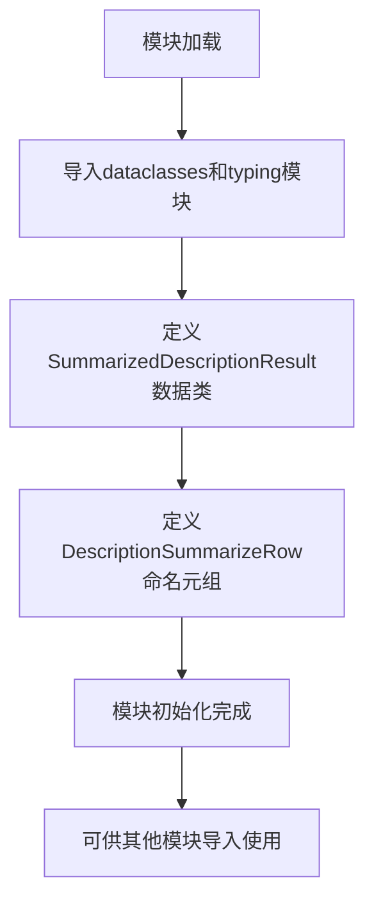

# `graphrag\packages\graphrag\graphrag\index\operations\summarize_descriptions\typing.py` 详细设计文档

一个用于实体摘要结果的数据模型模块，包含SummarizedDescriptionResult数据类用于存储实体ID（字符串或字符串元组）和描述信息，以及DescriptionSummarizeRow命名元组用于存储图数据。该模块是Microsoft Corporation的实体摘要功能的基础数据模型定义。

## 整体流程



## 类结构

```
SummarizedDescriptionResult (dataclass)
DescriptionSummarizeRow (NamedTuple)
```

## 全局变量及字段


### `SummarizedDescriptionResult.id`
    
实体标识符，可以是字符串或字符串元组形式

类型：`str | tuple[str, str]`
    


### `SummarizedDescriptionResult.description`
    
实体的描述文本内容

类型：`str`
    


### `DescriptionSummarizeRow.graph`
    
图数据结构，用于存储图相关信息

类型：`Any`
    
    

## 全局函数及方法


## 关键组件


### SummarizedDescriptionResult

实体摘要结果数据类，用于存储实体ID和对应的描述文本，支持字符串或字符串元组形式的ID

### DescriptionSummarizeRow

描述摘要行命名的元组类，用于封装图结构数据，作为描述摘要操作的输入载体


## 问题及建议


### 已知问题

-   `SummarizedDescriptionResult.id` 字段使用 `str | tuple[str, str]` 联合类型，缺乏类型安全保证，调用方需要做类型检查
-   `description` 字段没有任何验证或约束，缺少最大长度限制，可能导致存储或展示问题
-   `DescriptionSummarizeRow.graph` 字段使用 `Any` 类型，属于类型提示的反模式，丧失静态类型检查的优势
-   两个类之间的关系不明确，`DescriptionSummarizeRow` 的 `graph` 字段意图不清晰，与 `SummarizedDescriptionResult` 缺乏逻辑关联
-   缺少对类字段的详细 docstring 文档说明，影响代码可读性和可维护性
-   `SummarizedDescriptionResult` 没有使用 `__slots__` 优化内存使用

### 优化建议

-   为 `description` 字段添加 `Field` 验证器，限制最大长度（如 10000 字符）
-   将 `DescriptionSummarizeRow.graph` 的 `Any` 类型替换为具体的图类型（如 `nx.Graph` 或自定义图类）
-   考虑为 `id` 字段的 tuple 类型定义命名元组或枚举，增加类型语义
-   补充完整的 docstring，说明每个字段的含义、约束和用途
-   如果 `DescriptionSummarizeRow` 用于批量生成 `SummarizedDescriptionResult`，应明确这一数据流转关系
-   考虑为 `SummarizedDescriptionResult` 添加 `__slots__` 以减少内存开销

## 其它


### 设计目标与约束

本模块的设计目标是提供一个轻量级、高效的数据结构用于存储实体摘要结果，支持单ID和复合ID两种标识方式。约束方面，id字段必须为str或tuple[str, str]类型，description必须为非空字符串。

### 错误处理与异常设计

代码本身不包含复杂的错误处理逻辑。作为dataclass和NamedTuple，主要依赖Python的类型检查和运行时验证。建议在实例化时验证id和description的有效性，确保id不为空且description长度在合理范围内。

### 数据流与描述

数据流主要从外部输入（如知识图谱处理流程）接收原始数据，经过摘要处理后生成SummarizedDescriptionResult对象。DescriptionSummarizeRow作为中间数据结构，用于在处理过程中传递图谱信息。

### 外部依赖与接口契约

本模块依赖Python标准库：dataclasses、typing.Any、typing.NamedTuple。无外部第三方依赖。接口契约要求：SummarizedDescriptionResult的id字段支持字符串或元组类型，description字段为字符串；DescriptionSummarizeRow的graph字段接受任意类型对象。

### 使用示例

```python
# 创建单ID的摘要结果
result1 = SummarizedDescriptionResult(
    id="entity_001",
    description="这是一个测试实体描述"
)

# 创建复合ID的摘要结果
result2 = SummarizedDescriptionResult(
    id=("source_a", "entity_002"),
    description="这是另一个测试实体描述"
)

# 创建描述摘要行
row = DescriptionSummarizeRow(graph=some_graph_object)
```

### 性能考虑

由于使用dataclass和NamedTuple（均为不可变对象），具有良好的内存效率和创建性能。建议在大量创建场景下使用__slots__优化内存占用。

### 版本历史

- 2024年：初始版本，包含SummarizedDescriptionResult和DescriptionSummarizeRow两个类

    