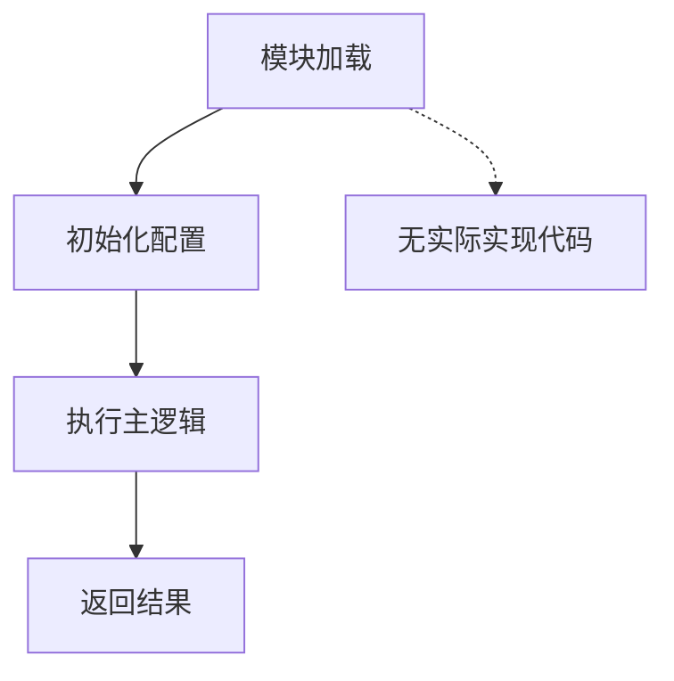

# `graphrag\packages\graphrag\graphrag\index\run\__init__.py` 详细设计文档

这是一个GraphRAG的运行模块入口文件，目前仅包含版权信息和模块基础说明。

## 整体流程



## 类结构

```
当前文件为模块入口
无类定义
无继承关系
```

## 全局变量及字段


    

## 全局函数及方法


## 关键组件


## 一段话描述

GraphRAG 运行模块（Run Module），作为 GraphRAG 项目的入口模块，负责协调整个图的构建和检索增强生成流程。

## 文件的整体运行流程

该模块为 GraphRAG 项目的运行入口文件，当前仅定义了模块级别的版权信息和文档字符串，具体的运行流程和实现细节需要查看其他相关模块文件。

## 类的详细信息

由于代码中仅包含版权头和文档字符串，未发现任何类定义。

## 全局变量和全局函数

由于代码中仅包含版权头和文档字符串，未发现任何全局变量或全局函数定义。

## 关键组件信息

### GraphRAG Run Module

GraphRAG 项目的运行模块入口，基于 MIT License 开源，隶属于 Microsoft Corporation 2024 年发布的 GraphRAG 项目。

## 潜在的技术债务或优化空间

由于当前代码仅为占位符文件，无法进行技术债务或优化空间的评估。

## 其它项目

### 设计目标与约束

- 遵循 MIT License 开源协议
- 作为 GraphRAG 项目的运行模块

### 错误处理与异常设计

由于代码中未包含实现细节，无法提供错误处理与异常设计信息。

### 数据流与状态机

由于代码中未包含实现细节，无法提供数据流与状态机信息。

### 外部依赖与接口契约

由于代码中未包含实现细节，无法提供外部依赖与接口契约信息。


## 问题及建议


### 已知问题

-   **模块为空无实际实现**：该模块仅包含版权和许可证声明以及文档字符串，缺少任何实际的运行逻辑或入口点实现
-   **缺少主入口函数**：典型的 Run 模块应包含 `main()` 函数或 CLI 入口点，当前模块无法独立执行
-   **缺少 GraphRAG 核心功能集成**：作为 GraphRAG 的运行模块，未体现与图谱检索增强生成相关的任何功能
-   **缺乏模块级配置管理**：未提供参数配置、命令行参数解析等基础设施
-   **缺少错误处理与异常设计**：由于无实际代码，无法实现任何错误处理机制
-   **缺少日志记录**：未包含日志初始化或日志记录器配置

### 优化建议

-   **实现模块入口函数**：添加 `main()` 函数作为 CLI 入口点，支持命令行参数解析（如使用 argparse 或 click）
-   **定义 GraphRAG 核心流程**：实现工作流编排，包括数据加载、图谱构建、查询处理等核心逻辑
-   **添加配置管理**：实现配置类或使用配置管理系统，支持从文件或环境变量加载配置
-   **完善文档字符串**：扩展模块文档，说明 GraphRAG 的功能定位、使用方式和命令行接口
-   **添加日志模块集成**：配置标准日志记录，支持不同级别的日志输出
-   **实现错误处理**：添加异常类定义和错误处理机制，提升模块健壮性
-   **添加类型注解**：为所有函数和类添加类型提示，提高代码可维护性和 IDE 支持


## 其它


### 一段话描述

该模块是GraphRAG的运行模块入口，目前仅包含版权信息和模块文档字符串，具体功能实现尚未展开。

### 文件的整体运行流程

该模块作为GraphRAG的运行入口点，当前版本为占位模块，无实际执行逻辑。模块加载时仅执行版权声明和模块文档的初始化，不涉及任何运行时流程。

### 类详细信息

该模块未定义任何类。

### 全局变量信息

该模块未定义任何全局变量。

### 全局函数信息

该模块未定义任何全局函数。

### 关键组件信息

该模块未定义任何关键组件。

### 潜在的技术债务或优化空间

1. **功能实现缺失**：模块作为GraphRAG运行入口，核心功能尚未实现，需要补充完整的运行逻辑
2. **接口定义不完整**：缺乏与GraphRAG其他模块的接口定义和交互规范

### 设计目标与约束

- **设计目标**：作为GraphRAG系统的运行入口模块，负责协调和管理GraphRAG的整体执行流程
- **约束条件**：遵循MIT开源许可证约束

### 错误处理与异常设计

当前模块未实现错误处理机制，后续实现需考虑：
- 配置文件缺失或格式错误的处理
- 依赖服务不可用时的异常捕获
- 运行时环境验证

### 数据流与状态机

当前模块无数据流设计，后续实现应包含：
- 输入数据（查询、文档等）的接收和处理流程
- 状态管理（初始化、处理中、完成、错误等状态转换）
- 输出结果的传递机制

### 外部依赖与接口契约

当前模块无明确外部依赖，后续实现可能依赖：
- 配置文件解析模块
- 图数据库接口
- LLM接口
- 索引构建模块
- 检索模块


    