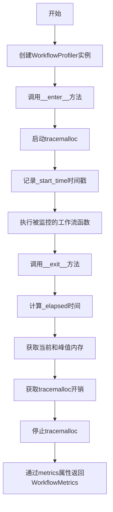
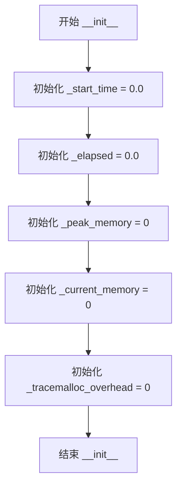
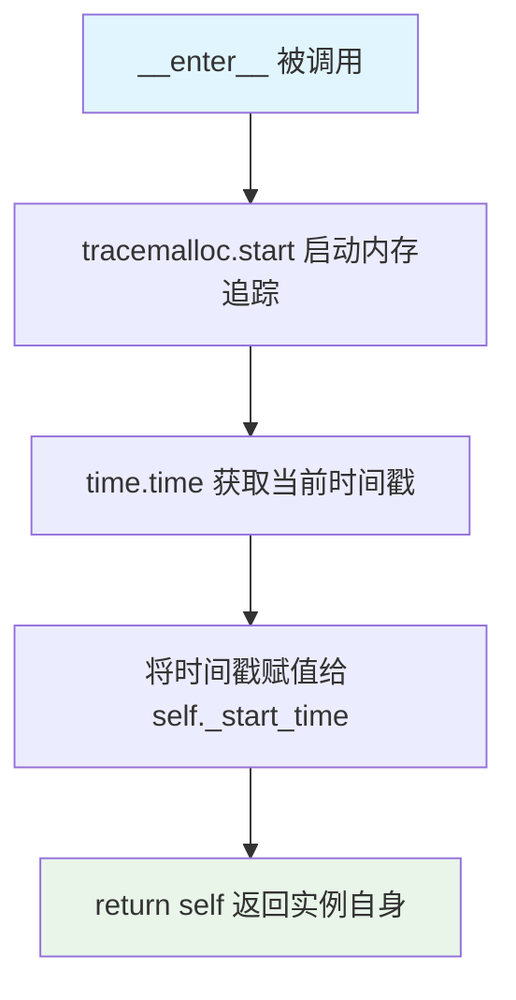
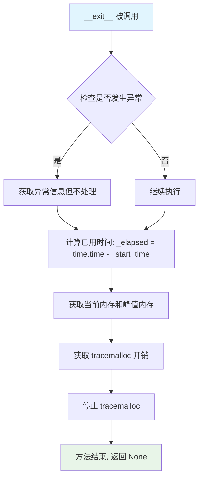
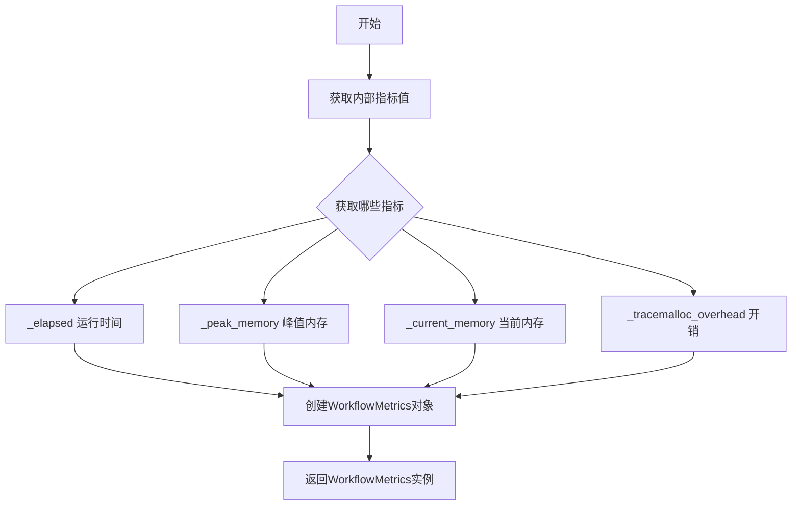

# `graphrag\packages\graphrag\graphrag\index\run\profiling.py` 详细设计文档

这是一个工作流性能分析工具类，通过上下文管理器的方式捕获工作流执行的时间消耗和内存使用指标，利用Python内置的tracemalloc模块进行内存分析，最小化代码侵入性地为run_pipeline提供性能监控能力。

## 整体流程



## 类结构

```
WorkflowProfiler (性能分析上下文管理器)
```

## 全局变量及字段


### `WorkflowProfiler._start_time`
    
记录性能分析开始时间戳

类型：`float`
    


### `WorkflowProfiler._elapsed`
    
存储工作流执行总耗时

类型：`float`
    


### `WorkflowProfiler._peak_memory`
    
存储执行期间峰值内存使用量

类型：`int`
    


### `WorkflowProfiler._current_memory`
    
存储执行结束后当前内存使用量

类型：`int`
    


### `WorkflowProfiler._tracemalloc_overhead`
    
存储tracemalloc模块自身带来的内存开销

类型：`int`
    
    

## 全局函数及方法


### `WorkflowProfiler.__init__`

初始化 `WorkflowProfiler` 类的实例，将所有性能指标（开始时间、经过时间、峰值内存、当前内存、tracemalloc 开销）初始化为默认值，为后续的性能分析做好准备。

参数：

- `self`：无，隐式参数，表示 `WorkflowProfiler` 类的实例本身

返回值：`None`，无返回值（构造函数）

#### 流程图



#### 带注释源码

```python
def __init__(self) -> None:
    """初始化所有性能指标为默认值."""
    # 记录工作流开始执行的时间戳
    self._start_time: float = 0.0
    # 记录工作流执行所消耗的时间（秒）
    self._elapsed: float = 0.0
    # 记录执行过程中的峰值内存使用量（字节）
    self._peak_memory: int = 0
    # 记录执行结束时的当前内存使用量（字节）
    self._current_memory: int = 0
    # 记录 tracemalloc 自身的内存开销（字节）
    self._tracemalloc_overhead: int = 0
```


### `WorkflowProfiler.__enter__`

启动性能分析上下文管理器，记录开始时间并初始化 tracemalloc 内存追踪，返回实例自身以支持 with 语句的链式调用。

参数：

- `self`：隐式参数，WorkflowProfiler 实例本身，无需显式传入

返回值：`Self`，返回 WorkflowProfiler 实例自身，供外部调用者使用或进行链式操作

#### 流程图



#### 带注释源码

```python
def __enter__(self) -> Self:
    """Start profiling: begin tracemalloc and record start time."""
    # 启动 tracemalloc 模块，开始追踪 Python 程序的内存分配情况
    tracemalloc.start()
    
    # 记录当前时间戳作为工作流执行的起始时间，用于后续计算总耗时
    self._start_time = time.time()
    
    # 返回上下文管理器实例本身，使 with 语句能够正常执行
    # 返回的实例可被 as 关键字后的变量接收
    return self
```

---

### 1. 一段话描述

`WorkflowProfiler` 是一个上下文管理器类，用于在工作流执行期间捕获时间和内存指标。它通过内置的 `tracemalloc` 模块追踪 Python 进程的内存分配情况，并结合 `time.time()` 记录执行时长，最终将收集到的指标封装为 `WorkflowMetrics` 数据类返回。该类的设计目标是以最小的代码侵入性包装工作流执行过程，便于性能监控和优化分析。

---

### 2. 文件的整体运行流程

```
[导入模块] → [定义 WorkflowProfiler 类] → [实例化 with 语句]
                                                        ↓
                                            [__enter__ 启动追踪]
                                                        ↓
                                            [执行被包裹的工作流]
                                                        ↓
                                            [__exit__ 捕获指标并停止追踪]
                                                        ↓
                                            [通过 metrics 属性获取结果]
```

---

### 3. 类的详细信息

#### 3.1 类字段

| 字段名称 | 类型 | 描述 |
|---------|------|------|
| `_start_time` | `float` | 记录工作流开始执行的时间戳 |
| `_elapsed` | `float` | 工作流执行的总时长（秒） |
| `_peak_memory` | `int` | 追踪期间的最大内存使用量（字节） |
| `_current_memory` | `int` | 追踪结束时的当前内存使用量（字节） |
| `_tracemalloc_overhead` | `int` | tracemalloc 自身的内存开销（字节） |

#### 3.2 类方法

| 方法名称 | 功能描述 |
|---------|---------|
| `__init__` | 初始化所有指标字段为零值 |
| `__enter__` | 启动 tracemalloc 并记录开始时间，返回实例自身 |
| `__exit__` | 停止追踪并计算各项内存和时间指标 |
| `metrics` | 属性方法，将收集的指标封装为 WorkflowMetrics 返回 |

---

### 4. 关键组件信息

| 组件名称 | 一句话描述 |
|---------|-----------|
| `tracemalloc` | Python 标准库模块，用于追踪内存分配 |
| `WorkflowMetrics` | 数据类，用于封装工作流执行的性能指标 |
| `time.time()` | Python 标准库函数，用于获取高精度时间戳 |
| `Self` | 类型注解，表示返回类自身的类型（Python 3.11+） |

---

### 5. 潜在的技术债务或优化空间

1. **精度损失风险**：使用 `time.time()` 而非 `time.perf_counter()`，在高精度性能测量场景下可能存在系统时间调整导致的不准确问题
2. **线程安全缺失**：tracemalloc 本身非线程安全，多线程环境下可能导致指标采集不准确
3. **异常安全性**：如果 `tracemalloc.start()` 失败（如资源限制），`__exit__` 中的 `tracemalloc.stop()` 仍会被调用，但此时状态可能不一致
4. **开销评估缺失**：未提供开关机制以在生产环境中禁用性能追踪，可能带来不必要的性能负担

---

### 6. 其它项目

#### 6.1 设计目标与约束

- **最小侵入性**：通过上下文管理器协议实现，对现有代码结构改动最小
- **开箱即用**：依赖仅限 Python 标准库，无额外第三方依赖
- **单一职责**：仅负责性能数据采集，不涉及数据持久化或上报

#### 6.2 错误处理与异常设计

- `__enter__` 方法未做异常捕获，若 tracemalloc 启动失败将直接向上层抛出
- `__exit__` 方法无返回值，默认不抑制异常传播

#### 6.3 数据流与状态机

```
[初始状态: 所有字段为 0/默认值]
        ↓ __enter__
[运行状态: tracemalloc 激活, _start_time 已记录]
        ↓ 工作流执行
[结束状态: __exit__ 执行完毕, metrics 可用]
```

#### 6.4 外部依赖与接口契约

- **输入**：无显式参数，通过 with 语句隐式传入
- **输出**：通过 `metrics` 属性返回 `WorkflowMetrics` 数据类实例
- **依赖模块**：`time`, `tracemalloc`, `typing`, `types`


### WorkflowProfiler.__exit__

停止 profiling：捕获所有内存和时间指标并停止 tracemalloc。该方法在上下文管理器退出时自动调用，用于记录执行时间和内存使用情况。

参数：

- `exc_type`：`type[BaseException] | None`，异常类型，如果发生异常则为异常类，否则为 None
- `exc_val`：`BaseException | None`，异常值，如果发生异常则为异常实例，否则为 None
- `exc_tb`：`TracebackType | None`，异常追溯对象，如果发生异常则为追溯对象，否则为 None

返回值：`None`，无返回值（Python 上下文管理器的 `__exit__` 方法不应返回 True 来抑制异常）

#### 流程图



#### 带注释源码

```python
def __exit__(
    self,
    exc_type: type[BaseException] | None,
    exc_val: BaseException | None,
    exc_tb: TracebackType | None,
) -> None:
    """Stop profiling: capture metrics and stop tracemalloc."""
    # 计算执行时间：从开始时间到当前时间的差值
    self._elapsed = time.time() - self._start_time
    
    # 获取内存指标：tracemalloc.get_traced_memory() 返回
    # (current, peak) 元组，分别表示当前内存和峰值内存
    self._current_memory, self._peak_memory = tracemalloc.get_traced_memory()
    
    # 获取 tracemalloc 自身的内存开销
    self._tracemalloc_overhead = tracemalloc.get_tracemalloc_memory()
    
    # 重要：必须停止 tracemalloc 否则会持续消耗内存
    # 这是一个关键的资源清理步骤
    tracemalloc.stop()
    
    # 注意：该方法不返回 True 来抑制异常
    # 即使发生异常，异常也会正常向上传播
    # 异常信息通过参数传入但未被使用，仅用于满足上下文管理器协议
```


### `WorkflowProfiler.metrics`

该属性方法用于获取工作流性能分析的最终结果，将内部收集的运行时间、内存使用等指标封装为标准化的WorkflowMetrics对象返回，以便调用方获取本次性能分析的完整数据。

参数：无需参数

返回值：`WorkflowMetrics`，包含工作流执行的总体耗时、峰值内存使用量、内存增量以及tracemalloc开销等四项关键性能指标的数据类实例

#### 流程图



#### 带注释源码

```python
@property
def metrics(self) -> WorkflowMetrics:
    """Return collected metrics as a WorkflowMetrics dataclass.
    
    该属性方法将WorkflowProfiler在上下文管理器生命周期内收集的各项
    性能指标封装为WorkflowMetrics对象返回。调用方可通过此属性获取
    完整的性能分析数据，包括执行耗时、内存使用情况等关键信息。
    
    Returns:
        WorkflowMetrics: 包含以下字段的数据类实例:
            - overall: 总执行时间（秒）
            - peak_memory_bytes: 峰值内存使用量（字节）
            - memory_delta_bytes: 内存增量（字节）
            - tracemalloc_overhead_bytes: tracemalloc开销（字节）
    """
    # 将内部收集的原始指标数据传递给WorkflowMetrics构造函数
    # 创建一个标准化的性能指标数据对象并返回给调用者
    return WorkflowMetrics(
        overall=self._elapsed,                      # 工作流总执行耗时
        peak_memory_bytes=self._peak_memory,        # 峰值内存占用
        memory_delta_bytes=self._current_memory,    # 内存变化量
        tracemalloc_overhead_bytes=self._tracemalloc_overhead,  # 追踪库开销
    )
```

## 关键组件


## 一段话描述

WorkflowProfiler 是一个上下文管理器类，用于通过 tracemalloc 捕获工作流执行的时间消耗和内存指标（运行时间、峰值内存、内存增量和追踪开销），并将结果封装为 WorkflowMetrics 数据类返回，以实现对工作流性能的无侵入式监控。

## 文件的整体运行流程

1. **初始化阶段**：创建 WorkflowProfiler 实例，初始化各性能指标属性（_start_time, _elapsed, _peak_memory, _current_memory, _tracemalloc_overhead）
2. **进入上下文（__enter__）**：启动 tracemalloc 追踪，记录开始时间，返回自身以支持 with 语句
3. **执行被包裹代码**：用户代码在此期间执行，tracemalloc 自动追踪内存分配
4. **退出上下文（__exit__）**：停止 tracemalloc，计算运行时间差，获取当前和峰值内存使用，捕获追踪内存开销
5. **获取指标（metrics 属性）**：将收集的性能数据封装为 WorkflowMetrics 对象供外部使用

## 类的详细信息

### WorkflowProfiler 类

#### 类字段

| 名称 | 类型 | 描述 |
|------|------|------|
| _start_time | float | 记录上下文进入时的时间戳，用于计算总耗时 |
| _elapsed | float | 存储工作流执行的总体耗时（秒） |
| _peak_memory | int | 追踪期间的最大内存使用量（字节） |
| _current_memory | int | 追踪结束时的当前内存使用量（字节） |
| _tracemalloc_overhead | int | tracemalloc 自身的内存开销（字节） |

#### 类方法

##### __init__

| 项目 | 详情 |
|------|------|
| 名称 | __init__ |
| 参数 | 无 |
| 返回值类型 | None |
| 返回值描述 | 初始化实例属性为默认值 |
| 流程图 | ```mermaid<br>flowchart TD<br>    A[开始] --> B[设置_start_time = 0.0]<br>    B --> C[设置_elapsed = 0.0]<br>    C --> D[设置_peak_memory = 0]<br>    D --> E[设置_current_memory = 0]<br>    E --> F[设置_tracemalloc_overhead = 0]<br>    F --> G[结束] |
| 源码 | ```python<br>def __init__(self) -> None:<br>    self._start_time: float = 0.0<br>    self._elapsed: float = 0.0<br>    self._peak_memory: int = 0<br>    self._current_memory: int = 0<br>    self._tracemalloc_overhead: int = 0<br>``` |

##### __enter__

| 项目 | 详情 |
|------|------|
| 名称 | __enter__ |
| 参数 | 无 |
| 返回值类型 | Self |
| 返回值描述 | 返回 WorkflowProfiler 实例本身，使其可在 with 语句中使用 |
| 流程图 | ```mermaid<br>flowchart TD<br>    A[开始] --> B[tracemalloc.start 启动内存追踪]<br>    B --> C[记录当前时间到_start_time]<br>    C --> D[返回 self 实例]<br>    D --> E[结束] |
| 源码 | ```python<br>def __enter__(self) -> Self:<br>    """Start profiling: begin tracemalloc and record start time."""<br>    tracemalloc.start()<br>    self._start_time = time.time()<br>    return self<br>``` |

##### __exit__

| 项目 | 详情 |
|------|------|
| 名称 | __exit__ |
| 参数 1 名称 | exc_type |
| 参数 1 类型 | type[BaseException] \| None |
| 参数 1 描述 | 异常类型，若无异常则为 None |
| 参数 2 名称 | exc_val |
| 参数 2 类型 | BaseException \| None |
| 参数 2 描述 | 异常实例，若无异常则为 None |
| 参数 3 名称 | exc_tb |
| 参数 3 类型 | TracebackType \| None |
| 参数 3 描述 | 异常回溯对象，若无异常则为 None |
| 返回值类型 | None |
| 返回值描述 | 不处理异常，异常会正常传播 |
| 流程图 | ```mermaid<br>flowchart TD<br>    A[开始] --> B[计算_elapsed = time.time - _start_time]<br>    B --> C[调用tracemalloc.get_traced_memory获取当前和峰值内存]<br>    C --> D[调用tracemalloc.get_tracemalloc_memory获取追踪开销]<br>    D --> E[tracemalloc.stop 停止内存追踪]<br>    E --> F[结束] |
| 源码 | ```python<br>def __exit__(<br>    self,<br>    exc_type: type[BaseException] | None,<br>    exc_val: BaseException | None,<br>    exc_tb: TracebackType | None,<br>) -> None:<br>    """Stop profiling: capture metrics and stop tracemalloc."""<br>    self._elapsed = time.time() - self._start_time<br>    self._current_memory, self._peak_memory = tracemalloc.get_traced_memory()<br>    self._tracemalloc_overhead = tracemalloc.get_tracemalloc_memory()<br>    tracemalloc.stop()<br>``` |

##### metrics（属性）

| 项目 | 详情 |
|------|------|
| 名称 | metrics |
| 参数 | 无 |
| 返回值类型 | WorkflowMetrics |
| 返回值描述 | 包含已收集的性能指标的 WorkflowMetrics 数据类实例 |
| 流程图 | ```mermaid<br>flowchart TD<br>    A[开始] --> B[创建WorkflowMetrics实例]<br>    B --> C[设置overall = _elapsed运行时间]<br>    C --> D[设置peak_memory_bytes = _peak_memory峰值内存]<br>    D --> E[设置memory_delta_bytes = _current_memory内存增量]<br>    E --> F[设置tracemalloc_overhead_bytes = _tracemalloc_overhead追踪开销]<br>    F --> G[返回WorkflowMetrics对象] --> H[结束] |
| 源码 | ```python<br>@property<br>def metrics(self) -> WorkflowMetrics:<br>    """Return collected metrics as a WorkflowMetrics dataclass."""<br>    return WorkflowMetrics(<br>        overall=self._elapsed,<br>        peak_memory_bytes=self._peak_memory,<br>        memory_delta_bytes=self._current_memory,<br>        tracemalloc_overhead_bytes=self._tracemalloc_overhead,<br>    )<br>``` |

## 关键组件信息

### WorkflowMetrics 数据类

用于存储工作流性能指标的数据结构，由 graphrag.index.typing.stats 模块导入，具体字段需参考该模块定义，当前使用四个字段：overall（总运行时间）、peak_memory_bytes（峰值内存字节）、memory_delta_bytes（内存增量字节）、tracemalloc_overhead_bytes（tracemalloc 开销字节）

### tracemalloc 模块

Python 标准库模块，提供内存分配追踪功能，本类使用 start()、get_traced_memory()、get_tracemalloc_memory() 和 stop() 四个函数实现性能数据的采集

### time 模块

Python 标准库模块，提供 time.time() 函数用于获取当前时间戳以计算执行耗时

## 潜在的技术债务或优化空间

1. **缺乏异步支持**：仅提供同步的上下文管理器接口，未实现 __aenter__ 和 __aexit__ 以支持 async with 语法，无法用于异步工作流场景
2. **异常安全性问题**：如果在 __enter__ 和 __exit__ 之间发生异常导致程序崩溃，tracemalloc 可能无法正确停止，虽然 __exit__ 仍会执行但缺乏显式的异常处理保障
3. **精度限制**：使用 time.time() 作为时间源，在某些系统上可能受系统时钟调整影响，可考虑使用 time.perf_counter() 提供更高精度
4. **线程安全性**：tracemalloc 本身不是线程安全的，在多线程场景下使用可能导致不准确的结果或竞态条件
5. **指标扩展性**：目前仅收集基础指标，可考虑添加 CPU 使用率、垃圾回收统计、内存分配次数等更详细的性能数据

## 其它项目

### 设计目标与约束

- **设计目标**：以最小代码侵入性方式捕获工作流执行的时间和内存指标
- **约束**：依赖 Python 标准库 tracemalloc，需确保在 Python 3.4+ 环境中运行（tracemalloc 自 Python 3.4 起可用）

### 错误处理与异常设计

- 当前实现不捕获任何异常，异常会直接传播给调用者
- __exit__ 方法接收异常信息参数（exc_type, exc_val, exc_tb）但未使用，若需要可在子类中重写以实现自定义异常处理逻辑
- 建议添加对 tracemalloc 启动/停止失败情况的异常处理

### 数据流与状态机

- **状态转换**：Idle（初始化）→ Running（__enter__ 后）→ Completed（__exit__ 后）
- **数据流向**：外部传入 → 上下文管理器捕获 → tracemalloc 追踪 → metrics 属性输出

### 外部依赖与接口契约

- **依赖模块**：time（标准库）、tracemalloc（标准库）、typing（标准库）
- **外部导入**：WorkflowMetrics 来自 graphrag.index.typing.stats 模块
- **接口契约**：作为上下文管理器使用，需配合 with 语句，返回包含 performance metrics 的 WorkflowMetrics 对象


## 问题及建议


### 已知问题

-   **异常安全性不足**：`__exit__` 方法中在调用 `tracemalloc.get_traced_memory()` 和 `tracemalloc.get_tracemalloc_memory()` 时，如果发生异常，`tracemalloc.stop()` 将无法执行，导致 tracemalloc 资源泄漏
-   **计时精度不足**：使用 `time.time()` 进行计时，应改用 `time.perf_counter()` 以获得更高的时间测量精度
-   **不支持嵌套使用**：如果嵌套使用多个 `WorkflowProfiler` 实例，tracemalloc 的行为可能会出现不可预期的问题（重复 start/stop）
-   **线程不安全**：在多线程环境下使用可能产生竞态条件，缺乏线程安全保护
-   **属性重复计算**：`metrics` 属性每次调用都会创建新的 `WorkflowMetrics` 实例，当频繁访问时会带来不必要的开销

### 优化建议

-   使用 `try-finally` 块确保 `tracemalloc.stop()` 始终被执行，或在获取指标失败时也保证资源释放
-   将 `time.time()` 替换为 `time.perf_counter()` 以获得更精确的计时
-   添加嵌套检测逻辑或文档说明禁止嵌套使用，必要时抛出明确的错误
-   如需支持多线程，考虑添加线程锁保护或使用线程局部存储
-   考虑缓存 `metrics` 属性值或在首次访问后存储结果，避免重复实例化

## 其它


### 设计目标与约束

设计目标：提供一个轻量级、非侵入式的上下文管理器，用于捕获工作流执行时的耗时和内存指标，帮助开发者监控和优化工作流性能。

设计约束：
- 最小化对被测量代码的影响，使用上下文管理器模式实现自动启动和停止
- 依赖于Python标准库tracemalloc，不引入外部依赖
- 仅适用于支持tracemalloc的Python环境
- 设计为同步使用，不支持异步直接测量

### 错误处理与异常设计

异常处理机制：
- `__exit__` 方法接收标准的异常参数(exc_type, exc_val, exc_tb)，即使发生异常也会捕获性能指标
- 如果在profiling过程中发生异常，`_elapsed`、`_current_memory`等指标仍会被记录（尽管可能不完整）
- tracemalloc相关调用可能抛出异常（如环境限制），但代码中未做处理，可能导致程序崩溃
- 建议：添加try-except保护tracemalloc调用，确保异常情况下也能安全退出

### 外部依赖与接口契约

外部依赖：
- `time`：Python标准库，用于时间测量
- `tracemalloc`：Python标准库，用于内存分析
- `types.TracebackType`：Python标准库，用于类型注解
- `typing.Self`：Python 3.9+类型注解（向后兼容需使用TypeVar）
- `graphrag.index.typing.stats.WorkflowMetrics`：项目内部数据类，定义指标输出格式

接口契约：
- `WorkflowProfiler`必须作为上下文管理器使用（with语句）
- 使用前需确保有足够权限启动tracemalloc
- `metrics`属性在`__exit__`调用后方可访问，否则返回零值
- 返回的WorkflowMetrics包含只读的性能数据

### 线程安全性与并发考虑

线程安全分析：
- tracemalloc是线程本地的，每个线程有独立的内存跟踪状态
- WorkflowProfiler实例非线程安全，不建议在多线程环境中共享同一个实例
- 并发场景下，每个线程应创建独立的WorkflowProfiler实例

### 使用示例与最佳实践

典型使用场景：
```python
# 同步工作流性能测量
with WorkflowProfiler() as profiler:
    result = workflow_function(config, context)
metrics = profiler.metrics
print(f"耗时: {metrics.overall}s, 峰值内存: {metrics.peak_memory_bytes / 1024 / 1024:.2f}MB")
```

最佳实践：
- 避免在profiler上下文中创建大量临时对象，以免影响内存测量准确性
- 建议用于离线调试和性能分析，不建议在生产环境中长期启用
- 可通过比较多次运行的metrics识别内存泄漏

### 性能特征与开销

时间开销：
- 启动tracemalloc有轻微开销（约0.5-2ms）
- `get_traced_memory()`调用约需0.1-0.5ms

内存开销：
- `_tracemalloc_overhead`记录了tracemalloc自身的内存消耗
- 在内存密集型任务中，tracemalloc开销通常可忽略（<1MB）

### 可扩展性与未来改进

可扩展方向：
- 支持异步上下文管理器（`__aenter__`/`__aexit__`）
- 添加更细粒度的内存分配分析（如按模块/函数分组）
- 支持自定义指标收集回调
- 添加采样模式以降低高负载下的性能影响

### 配置与初始化

初始化配置：
- 构造函数无参数，零配置使用
- tracemalloc使用默认配置（traceback深度等）
- 如需自定义tracemalloc行为，需扩展类实现

### 相关文档与参考

- Python官方tracemalloc文档
- WorkflowMetrics数据类定义（graphrag.index.typing.stats）
- 项目中其他性能测量工具（如有）


    