# `graphrag\packages\graphrag\graphrag\index\run\run_pipeline.py` 详细设计文档

这是GraphRAG索引管道的主运行模块，负责执行完整索引或增量索引流程，管理存储、缓存和上下文，支持直接传入DataFrame作为输入文档，并按顺序执行各个工作流。

## 整体流程

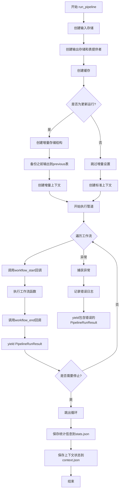

## 类结构

```
Pipeline (接口)
├── run_pipeline (顶层入口函数)
│   └── _run_pipeline (内部实现)
│       ├── _dump_json (辅助函数)
│       └── _copy_previous_output (辅助函数)
```

## 全局变量及字段


### `logger`
    
模块级日志记录器，用于记录运行过程中的信息

类型：`logging.Logger`
    


### `input_storage`
    
输入数据存储对象，用于读取原始文档数据

类型：`Storage`
    


### `output_storage`
    
输出数据存储对象，用于保存索引结果

类型：`Storage`
    


### `output_table_provider`
    
输出表提供者，用于以表格形式读写数据

类型：`TableProvider`
    


### `cache`
    
缓存对象，用于存储工作流执行结果以加速后续运行

类型：`Cache`
    


### `state_json`
    
从存储中读取的上下文状态JSON字符串

类型：`str | None`
    


### `state`
    
运行时状态字典，用于在多个工作流之间传递上下文信息

类型：`dict`
    


### `update_storage`
    
增量更新输出存储对象，用于保存增量索引结果

类型：`Storage`
    


### `update_timestamp`
    
增量更新的时间戳，用于创建版本化的存储结构

类型：`str`
    


### `timestamped_storage`
    
带时间戳的存储目录，按时间组织增量更新

类型：`Storage`
    


### `delta_storage`
    
增量变更存储，用于保存新增或修改的数据

类型：`Storage`
    


### `delta_table_provider`
    
增量表提供者，用于写入增量数据表

类型：`TableProvider`
    


### `previous_storage`
    
历史数据存储，用于备份上一次索引结果

类型：`Storage`
    


### `previous_table_provider`
    
历史表提供者，用于读取和备份历史数据表

类型：`TableProvider`
    


### `context`
    
管道运行上下文，包含存储、表提供者和回调等资源

类型：`PipelineRunContext`
    


### `start_time`
    
管道开始执行的时间戳，用于计算总运行时长

类型：`float`
    


### `last_workflow`
    
最近执行的工作流名称，用于错误追踪和日志记录

类型：`str`
    


### `table_name`
    
数据表名称，用于遍历和复制表数据

类型：`str`
    


### `table`
    
从存储中读取的表格数据，用于备份操作

类型：`pd.DataFrame`
    


### `temp_context`
    
临时保存的额外上下文，用于避免序列化时包含大对象

类型：`dict | None`
    


### `state_blob`
    
状态字典的JSON序列化字符串，用于持久化存储

类型：`str`
    


### `PipelineRunResult.workflow`
    
工作流名称，标识产生该结果的工作流

类型：`str`
    


### `PipelineRunResult.result`
    
工作流执行结果，包含工作流的实际输出数据

类型：`Any`
    


### `PipelineRunResult.state`
    
执行后的状态字典，包含运行时状态信息

类型：`dict`
    


### `PipelineRunResult.error`
    
执行过程中发生的错误，若成功则为None

类型：`Exception | None`
    


### `PipelineRunContext.input_storage`
    
输入存储对象，提供原始文档读取能力

类型：`Storage`
    


### `PipelineRunContext.output_storage`
    
输出存储对象，提供索引结果写入能力

类型：`Storage`
    


### `PipelineRunContext.output_table_provider`
    
输出表提供者，用于表格形式的数据读写

类型：`TableProvider`
    


### `PipelineRunContext.previous_table_provider`
    
历史表提供者，用于增量更新时合并历史数据

类型：`TableProvider | None`
    


### `PipelineRunContext.cache`
    
缓存对象，用于加速重复计算

类型：`Cache`
    


### `PipelineRunContext.callbacks`
    
工作流回调接口，用于通知工作流执行状态

类型：`WorkflowCallbacks`
    


### `PipelineRunContext.state`
    
运行时状态字典，在工作流间共享上下文数据

类型：`dict`
    


### `PipelineRunContext.stats`
    
运行统计信息，记录各工作流的执行指标

类型：`RunStatistics`
    


### `GraphRagConfig.input_storage`
    
输入存储配置，定义原始文档的存储方式

类型：`StorageConfig`
    


### `GraphRagConfig.output_storage`
    
输出存储配置，定义索引结果的存储方式

类型：`StorageConfig`
    


### `GraphRagConfig.update_output_storage`
    
增量更新输出存储配置，定义增量索引的存储位置

类型：`StorageConfig`
    


### `GraphRagConfig.table_provider`
    
表提供者类型字符串，指定数据表格格式

类型：`str`
    


### `GraphRagConfig.cache`
    
缓存配置，定义缓存策略和参数

类型：`CacheConfig`
    
    

## 全局函数及方法


### `run_pipeline`

该函数是 GraphRAG 索引管道的主入口，负责初始化存储、缓存和表提供者，根据配置创建运行上下文，并迭代执行管道中的各个工作流。它支持两种运行模式：标准索引和增量更新索引，同时处理输入文档和状态管理。

参数：

- `pipeline`：`Pipeline`，管道对象，包含要执行的工作流列表
- `config`：`GraphRagConfig`，GraphRAG 配置对象，包含存储、缓存、表提供者等配置
- `callbacks`：`WorkflowCallbacks`，工作流回调接口，用于通知工作流开始和结束事件
- `is_update_run`：`bool`，默认为 `False`，是否为增量更新运行模式
- `additional_context`：`dict[str, Any] | None`，默认为 `None`，额外的上下文数据，会合并到运行状态中
- `input_documents`：`pd.DataFrame | None`，默认为 `None`，可选的输入文档数据框，如果提供则直接写入存储

返回值：`AsyncIterable[PipelineRunResult]`，异步迭代器，逐个产出管道中每个工作流的运行结果

#### 流程图

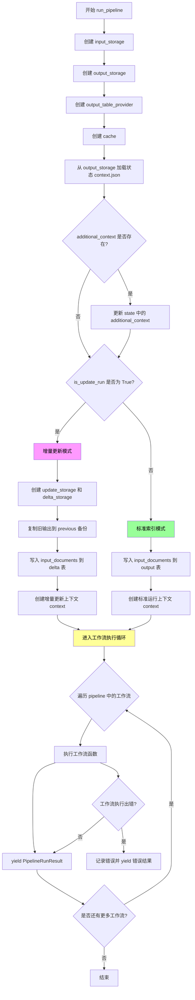

#### 带注释源码

```python
async def run_pipeline(
    pipeline: Pipeline,
    config: GraphRagConfig,
    callbacks: WorkflowCallbacks,
    is_update_run: bool = False,
    additional_context: dict[str, Any] | None = None,
    input_documents: pd.DataFrame | None = None,
) -> AsyncIterable[PipelineRunResult]:
    """Run all workflows using a simplified pipeline."""
    # 创建输入存储实例，用于读取原始输入数据
    input_storage = create_storage(config.input_storage)

    # 创建输出存储实例，用于保存管道执行结果
    output_storage = create_storage(config.output_storage)

    # 根据配置创建表提供者，用于读写结构化表格数据
    output_table_provider = create_table_provider(config.table_provider, output_storage)

    # 创建缓存实例，用于缓存工作流执行结果以提升性能
    cache = create_cache(config.cache)

    # 加载已有状态，以防某些工作流是有状态的（可恢复执行）
    state_json = await output_storage.get("context.json")
    # 反序列化状态JSON，如果不存在则为空字典
    state = json.loads(state_json) if state_json else {}

    # 如果提供了额外上下文，将其合并到状态的 additional_context 字段中
    if additional_context:
        state.setdefault("additional_context", {}).update(additional_context)

    if is_update_run:
        logger.info("Running incremental indexing.")

        # 创建更新输出存储，用于存放增量索引结果
        update_storage = create_storage(config.update_output_storage)
        # 使用时间戳创建子存储，避免覆盖之前的数据
        update_timestamp = time.strftime("%Y%m%d-%H%M%S")
        timestamped_storage = update_storage.child(update_timestamp)
        # delta 存储用于存放新生成的索引增量
        delta_storage = timestamped_storage.child("delta")
        delta_table_provider = create_table_provider(
            config.table_provider, delta_storage
        )
        # 创建备份存储，保存之前的完整索引，供后续合并使用
        previous_storage = timestamped_storage.child("previous")
        previous_table_provider = create_table_provider(
            config.table_provider, previous_storage
        )

        # 将当前输出复制到备份目录
        await _copy_previous_output(output_table_provider, previous_table_provider)

        # 记录更新时间戳到状态中，供后续工作流使用
        state["update_timestamp"] = update_timestamp

        # 如果用户直接传入了 DataFrame，直接写入存储以跳过后续的文档加载和解析步骤
        if input_documents is not None:
            await delta_table_provider.write_dataframe("documents", input_documents)
            # 移除增量更新文档加载工作流，因为数据已就绪
            pipeline.remove("load_update_documents")

        # 创建增量更新模式的运行上下文，包含新的输出位置和旧的表提供者
        context = create_run_context(
            input_storage=input_storage,
            output_storage=delta_storage,
            output_table_provider=delta_table_provider,
            previous_table_provider=previous_table_provider,
            cache=cache,
            callbacks=callbacks,
            state=state,
        )

    else:
        logger.info("Running standard indexing.")

        # 如果用户直接传入了 DataFrame，直接写入输出存储
        if input_documents is not None:
            await output_table_provider.write_dataframe("documents", input_documents)
            # 移除标准文档加载工作流，因为数据已就绪
            pipeline.remove("load_input_documents")

        # 创建标准索引模式的运行上下文
        context = create_run_context(
            input_storage=input_storage,
            output_storage=output_storage,
            output_table_provider=output_table_provider,
            cache=cache,
            callbacks=callbacks,
            state=state,
        )

    # 异步迭代执行管道中的每个工作流，并 yield 结果
    async for table in _run_pipeline(
        pipeline=pipeline,
        config=config,
        context=context,
    ):
        yield table
```


### `_run_pipeline`

`_run_pipeline` 是一个私有异步函数，负责执行 GraphRag 索引管道中的所有工作流。它遍历管道中的每个工作流，依次执行并收集结果，同时记录性能统计信息和运行状态，最后以异步迭代器的方式逐个产出每个工作流的运行结果。

参数：

-  `pipeline`：`Pipeline`，索引管道对象，包含要执行的工作流列表
-  `config`：`GraphRagConfig`，GraphRag 全局配置对象
-  `context`：`PipelineRunContext`，管道运行上下文，包含存储、缓存、回调和状态等信息

返回值：`AsyncIterable[PipelineRunResult]`，异步迭代器，每个元素是一个工作流的运行结果

#### 流程图

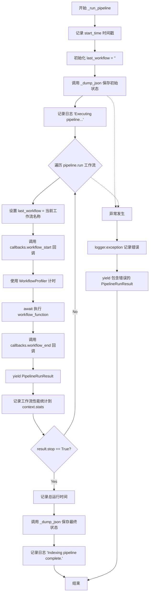

#### 带注释源码

```python
async def _run_pipeline(
    pipeline: Pipeline,
    config: GraphRagConfig,
    context: PipelineRunContext,
) -> AsyncIterable[PipelineRunResult]:
    """执行管道中的所有工作流并产出结果"""
    start_time = time.time()  # 记录管道开始执行的时间戳

    last_workflow = "<startup>"  # 初始化最后执行的工作流名称，用于错误追踪

    try:
        # 在执行工作流前，先将当前状态_dump到存储中
        await _dump_json(context)

        logger.info("Executing pipeline...")
        # 遍历管道中的每个工作流
        for name, workflow_function in pipeline.run():
            last_workflow = name  # 更新最后执行的工作流名称
            # 触发工作流开始回调
            context.callbacks.workflow_start(name, None)

            # 使用性能分析器测量工作流执行时间
            with WorkflowProfiler() as profiler:
                # 异步执行工作流函数，传入配置和上下文
                result = await workflow_function(config, context)

            # 触发工作流结束回调
            context.callbacks.workflow_end(name, result)
            # 产出当前工作流的运行结果
            yield PipelineRunResult(
                workflow=name, result=result.result, state=context.state, error=None
            )
            # 记录该工作流的性能指标
            context.stats.workflows[name] = profiler.metrics
            # 如果工作流请求停止，则中断管道执行
            if result.stop:
                logger.info("Halting pipeline at workflow request")
                break

        # 管道执行完成后，计算并记录总运行时间
        context.stats.total_runtime = time.time() - start_time
        logger.info("Indexing pipeline complete.")
        # 最后一次保存状态到存储
        await _dump_json(context)

    except Exception as e:
        # 捕获异常并记录错误日志
        logger.exception("error running workflow %s", last_workflow)
        # 产出包含错误信息的结果
        yield PipelineRunResult(
            workflow=last_workflow, result=None, state=context.state, error=e
        )
```


### `_dump_json`

将管道运行的统计信息和上下文状态序列化并保存到存储中。

参数：

-  `context`：`PipelineRunContext`，管道运行上下文，包含状态（state）和统计信息（stats）

返回值：`None`，异步函数，无返回值

#### 流程图

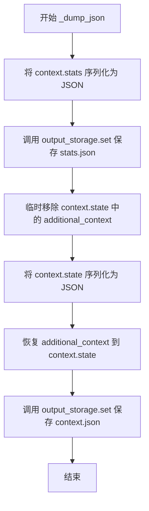

#### 带注释源码

```python
async def _dump_json(context: PipelineRunContext) -> None:
    """Dump the stats and context state to the storage."""
    # 将 context.stats ( dataclass ) 序列化为字典，再转为格式化的 JSON 字符串
    # indent=4 使用 4 空格缩进，ensure_ascii=False 允许非 ASCII 字符直接显示
    await context.output_storage.set(
        "stats.json", json.dumps(asdict(context.stats), indent=4, ensure_ascii=False)
    )
    # Dump context state, excluding additional_context
    # 临时移除 additional_context 键，因为该对象大小不确定，可能导致序列化问题
    temp_context = context.state.pop(
        "additional_context", None
    )  # Remove reference only, as object size is uncertain
    try:
        # 将 context.state (字典) 序列化为格式化的 JSON 字符串
        state_blob = json.dumps(context.state, indent=4, ensure_ascii=False)
    finally:
        # finally 块确保即使序列化失败也会恢复 additional_context
        if temp_context:
            context.state["additional_context"] = temp_context

    # 将状态 JSON 保存到 storage
    await context.output_storage.set("context.json", state_blob)
```


### `_copy_previous_output`

将输出存储中的所有 Parquet 表复制到备份存储中，用于增量索引时保存之前的结果。

参数：

- `output_table_provider`：`TableProvider`，源表提供者，包含需要备份的表
- `previous_table_provider`：`TableProvider`，目标表提供者，用于存储备份的表

返回值：`None`，无返回值，仅执行复制操作

#### 流程图

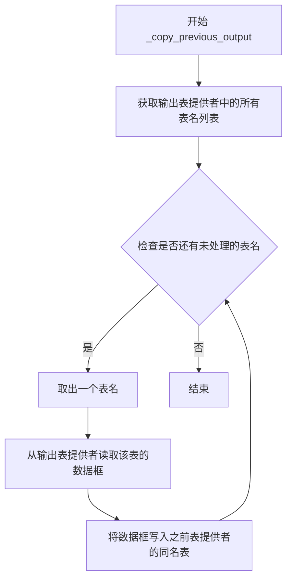

#### 带注释源码

```python
async def _copy_previous_output(
    output_table_provider: TableProvider,  # 源表提供者，包含当前索引输出的表
    previous_table_provider: TableProvider,  # 目标表提供者，用于存储备份表
) -> None:
    """Copy all parquet tables from output to previous storage for backup."""
    # 遍历输出存储中的所有表
    for table_name in output_table_provider.list():
        # 从输出表提供者读取指定表的 DataFrame
        table = await output_table_provider.read_dataframe(table_name)
        # 将读取的 DataFrame 写入备份表提供者，实现表复制
        await previous_table_provider.write_dataframe(table_name, table)
```


### `create_storage`

该函数是 graphrag_storage 模块提供的工厂函数，用于根据配置创建相应的存储实例，支持输入存储、输出存储和增量更新存储的初始化。

参数：

- `config`：未知类型（来自 GraphRagConfig 的存储配置属性），存储配置对象，包含存储类型、连接参数等信息

返回值：存储对象，用于数据的持久化和读取操作

#### 流程图

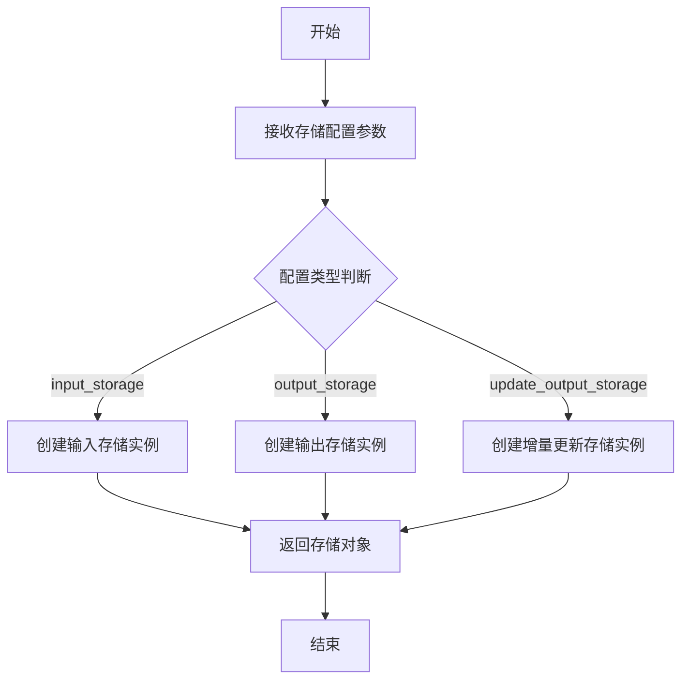

#### 带注释源码

```python
# 该函数定义在 graphrag_storage 模块中，此处仅为调用示例
# 导入语句
from graphrag_storage import create_storage

# 在 run_pipeline 函数中的调用示例
# 创建输入存储
input_storage = create_storage(config.input_storage)

# 创建输出存储
output_storage = create_storage(config.output_storage)

# 在增量更新模式下，创建更新输出存储
update_storage = create_storage(config.update_output_storage)
```

---

**注意**：由于 `create_storage` 函数的完整定义源码未在提供的代码中展示，以上信息是基于导入语句和使用方式推断得出的。该函数属于 `graphrag_storage` 外部包模块。如需获取完整的函数定义（如参数类型、返回值类型、内部逻辑等），建议查阅 `graphrag_storage` 包的源码。


### `create_cache`

从 `graphrag_cache` 模块导入的缓存创建函数，用于根据配置创建缓存实例。

参数：

-  `config`：`GraphRagConfig.cache`（缓存配置对象），用于配置缓存的类型、路径和其他缓存相关参数

返回值：`Any`（缓存对象），返回创建的缓存实例，用于在索引管道中缓存中间结果

#### 流程图

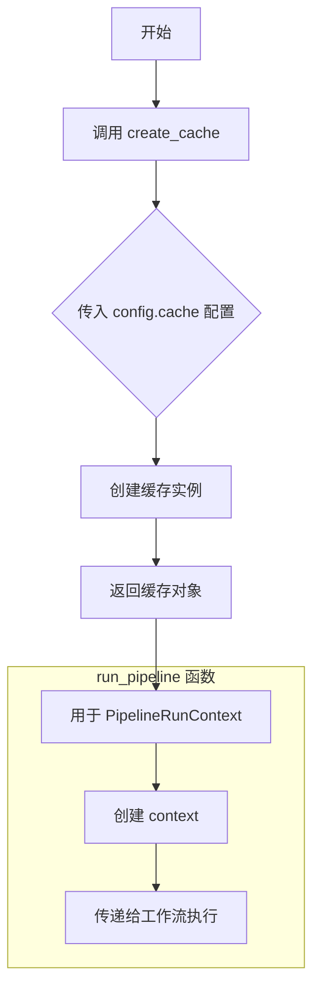

#### 带注释源码

```python
# 在 run_pipeline 函数中调用 create_cache
from graphrag_cache import create_cache  # 从外部模块导入缓存创建函数

# ... (前面的代码省略)

async def run_pipeline(
    pipeline: Pipeline,
    config: GraphRagConfig,
    callbacks: WorkflowCallbacks,
    is_update_run: bool = False,
    additional_context: dict[str, Any] | None = None,
    input_documents: pd.DataFrame | None = None,
) -> AsyncIterable[PipelineRunResult]:
    """Run all workflows using a simplified pipeline."""
    # ... (省略部分代码)
    
    # 创建缓存实例
    # config.cache 包含缓存的配置信息（如缓存类型、路径等）
    cache = create_cache(config.cache)  # <-- create_cache 的实际调用位置
    
    # ... (后续代码使用 cache)
    
    # 将 cache 传递给 create_run_context
    context = create_run_context(
        input_storage=input_storage,
        output_storage=output_storage,
        output_table_provider=output_table_provider,
        cache=cache,  # 缓存对象被传入上下文
        callbacks=callbacks,
        state=state,
    )
```

#### 备注

- `create_cache` 函数的实际定义位于 `graphrag_cache` 模块中，当前代码文件仅导入并使用该函数
- 该函数接收一个缓存配置对象作为参数，返回一个缓存实例
- 返回的缓存实例会被传递给 `create_run_context` 函数，用于在管道执行过程中缓存工作流的中间结果，提高性能


### `create_table_provider`

该函数是 `graphrag_storage.tables.table_provider_factory` 模块中的工厂函数，用于根据配置和存储后端创建相应的 TableProvider 实例，以支持表格数据的读写操作。

参数：

-  `provider_type`：`str` 或 `GraphRagConfig.table_provider`，指定要创建的表提供程序类型（如 "parquet" 等）
-  `storage`：`Storage`，存储后端实例，用于实际的数据读写操作

返回值：`TableProvider`，返回实现了表读写接口的提供者实例，可用于读取/写入 DataFrame 到存储中

#### 流程图

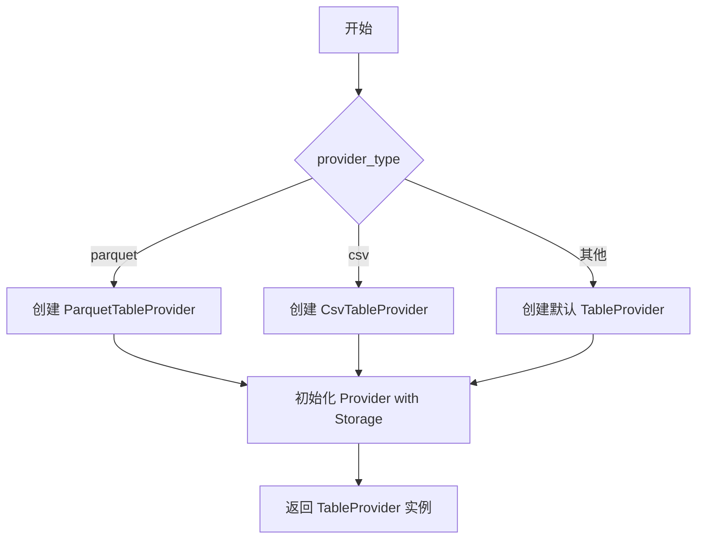

#### 带注释源码

```python
# 导入语句显示该函数从 graphrag_storage.tables.table_provider_factory 模块导入
from graphrag_storage.tables.table_provider_factory import create_table_provider

# 使用示例 1: 创建输出表的 Provider
output_table_provider = create_table_provider(config.table_provider, output_storage)

# 使用示例 2: 创建增量索引的 delta 存储表 Provider
delta_table_provider = create_table_provider(config.table_provider, delta_storage)

# 使用示例 3: 创建备份存储的表 Provider
previous_table_provider = create_table_provider(config.table_provider, previous_storage)

# 这些 Provider 被用于:
# 1. 读取现有数据: await output_table_provider.read_dataframe(table_name)
# 2. 写入新数据: await delta_table_provider.write_dataframe("documents", input_documents)
# 3. 列出可用表: output_table_provider.list()
```


### create_run_context

该函数是用于创建管道运行时上下文（PipelineRunContext）的工厂函数，它接收各种存储、表提供程序、缓存、回调和状态信息作为参数，并返回一个包含这些组件的上下文对象，供工作流在执行期间使用。

参数：

- `input_storage`：对应存储类型，输入数据的存储实例
- `output_storage`：对应存储类型，输出数据的存储实例
- `output_table_provider`：TableProvider 类型，输出表的提供者，用于读写表格数据
- `cache`：对应缓存类型，用于缓存计算结果
- `callbacks`：WorkflowCallbacks 类型，工作流执行过程中的回调函数集合
- `state`：dict[str, Any] 类型，管道运行的上下文状态，可包含额外上下文信息和增量更新时间戳等
- `previous_table_provider`：TableProvider 类型（可选），增量运行时用于引用上一个索引结果的表提供者

返回值：`PipelineRunContext`，管道运行时的上下文对象，包含输入/输出存储、表提供程序、缓存、回调函数、状态和统计信息等

#### 流程图

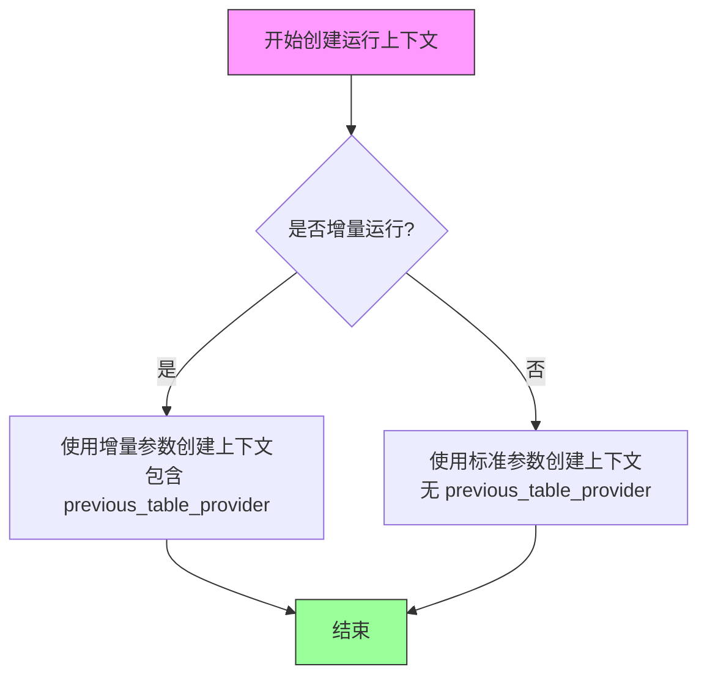

#### 带注释源码

```python
# 注意：以下为根据调用方式推断的函数签名定义
# 实际定义位于 graphrag.index.run.utils 模块中

async def create_run_context(
    input_storage: Any,  # 输入存储实例
    output_storage: Any,  # 输出存储实例
    output_table_provider: TableProvider,  # 输出表提供者
    cache: Any,  # 缓存实例
    callbacks: WorkflowCallbacks,  # 工作流回调
    state: dict[str, Any],  # 上下文状态
    previous_table_provider: TableProvider | None = None,  # 可选：增量运行时的前一次表提供者
) -> PipelineRunContext:
    """创建管道运行时上下文对象。
    
    该函数是一个工厂函数，用于组装和初始化 PipelineRunContext 实例。
    上下文对象包含了管道运行所需的所有依赖和服务：
    - 存储服务（输入/输出存储）
    - 表数据提供程序
    - 缓存服务
    - 回调函数
    - 状态管理
    
    参数:
        input_storage: 输入数据存储
        output_storage: 输出数据存储
        output_table_provider: 输出表格数据提供者
        cache: 缓存服务实例
        callbacks: 工作流生命周期回调
        state: 运行时状态字典
        previous_table_provider: 可选，增量更新时使用的前一次索引表提供者
    
    返回:
        PipelineRunContext: 包含所有运行时组件的上下文对象
    """
    # 函数实现位于 graphrag.index.run.utils 模块
    # 实际代码需要查看源文件
    pass
```


### `asdict`

将 dataclass 实例转换为字典的函数。这是 Python 标准库 `dataclasses` 模块提供的函数，用于递归地将 dataclass 对象转换为嵌套的字典结构。

参数：

- `obj`：`Any`，要转换的 dataclass 实例
- `dict_factory`：`Callable[[list[tuple[str, Any]]], dict]`，可选参数，用于替代 `dict` 来构造最终的字典，默认值为内置的 `dict`

返回值：`dict`，返回一个新字典，其键是字段名称，值是字段对应的值（如果是嵌套的 dataclass，则递归转换为字典）

#### 流程图

```mermaid
flowchart TD
    A[开始: asdict] --> B{obj 是否为 dataclass 实例}
    B -->|是| C[获取 obj 的字段定义 __dataclass_fields__]
    B -->|否| D[抛出 TypeError 异常]
    C --> E[遍历所有字段]
    E --> F{字段值是否为 dataclass 实例}
    F -->|是| G[递归调用 asdict 转换嵌套对象]
    F -->|否| H[直接使用字段值]
    G --> I[构建 (字段名, 转换后的值) 元组]
    H --> I
    I --> J{是否还有更多字段}
    J -->|是| E
    J -->|否| K[使用 dict_factory 构造字典]
    K --> L[返回字典]
```

#### 带注释源码

```python
# dataclasses.asdict 函数源码示例（简化版）
# 实际实现位于 Python 标准库 dataclasses 模块

def asdict(obj, *, dict_factory=dict):
    """
    将 dataclass 实例转换为字典
    
    参数:
        obj: dataclass 实例
        dict_factory: 可选的可调用对象，用于构造字典
    
    返回:
        字典对象
    """
    if not is_dataclass(obj):
        raise TypeError("asdict() expects a dataclass instance")
    
    # 获取所有字段定义
    fields = getattr(obj, '__dataclass_fields__', {})
    
    # 存储结果
    result = []
    
    for name, field in fields.items():
        value = getattr(obj, name)
        
        # 递归处理嵌套的 dataclass 实例
        if is_dataclass(value):
            value = asdict(value, dict_factory=dict_factory)
        
        result.append((name, value))
    
    # 使用 dict_factory 构造字典
    return dict_factory(result)
```

#### 使用示例（在代码中）

```python
# 从 dataclasses 模块导入 asdict
from dataclasses import asdict

# 在代码中的实际使用（第 172 行）
await context.output_storage.set(
    "stats.json", json.dumps(asdict(context.stats), indent=4, ensure_ascii=False)
)
```

这里 `asdict` 用于将 `context.stats` 对象（一个 dataclass 实例）转换为字典，然后使用 `json.dumps` 序列化为 JSON 字符串并存储到输出存储中。


### `json.loads`

将 JSON 格式的字符串反序列化为 Python 对象，用于从存储中恢复之前保存的上下文状态。

参数：

- `s`：`str`，JSON 字符串，即从 `output_storage.get("context.json")` 返回的上下文 JSON 数据
- `*` 和 `**` 可选参数（`parse_float`, `parse_int`, `object_pairs_hook`, `object_hook` 等），代码中未使用

返回值：`Any`，解析后的 Python 对象（通常是字典），在代码中为 `dict` 类型的状态对象

#### 流程图

```mermaid
flowchart TD
    A[开始] --> B{state_json 存在?}
    B -->|是| C[调用 json.loads 将 JSON 字符串解析为 Python 对象]
    B -->|否| D[返回空字典 {}]
    C --> E[返回解析后的状态字典]
    D --> E
    E[结束]
```

#### 带注释源码

```python
# 从输出存储中获取之前保存的上下文 JSON 数据
state_json = await output_storage.get("context.json")
# 如果存在则使用 json.loads 解析为 Python 字典，否则使用空字典
state = json.loads(state_json) if state_json else {}
```

#### 使用上下文说明

| 项目 | 说明 |
|------|------|
| **所在函数** | `run_pipeline` |
| **代码行号** | 约第 44 行 |
| **目的** | 恢复之前索引运行的上下文状态，以便增量索引或状态ful工作流能够访问之前的结果 |
| **潜在问题** | 如果 `state_json` 格式损坏，`json.loads` 会抛出 `json.JSONDecodeError`，但代码中未显式处理该异常 |
| **优化建议** | 添加异常处理以应对损坏的 JSON 数据，例如：<br>`try: state = json.loads(state_json) except json.JSONDecodeError: state = {}` |


### `json.dumps`

`json.dumps` 是 Python 标准库中的函数，用于将 Python 对象序列化为 JSON 格式的字符串。在该代码中主要用于将上下文状态和统计信息持久化到存储中。

参数：

-  `obj`：`Any`，要序列化的 Python 对象（如 dict、list 等）
-  `skipkeys`：`bool`，是否跳过非基本类型键（默认为 False）
-  `ensure_ascii`：`bool`，是否确保 ASCII 编码（在该代码中传入 `False`，允许非 ASCII 字符）
-  `indent`：`int`，缩进空格数（在该代码中传入 `4`，用于美化输出）
-  `separators`：`tuple`，分隔符配置
-  `cls`：`JSONEncoder`，自定义编码器类
-  `default`：`function`，处理无法序列化的对象的默认函数
-  `sort_keys`：`bool`，是否按键排序

返回值：`str`，返回 JSON 格式的字符串

#### 流程图

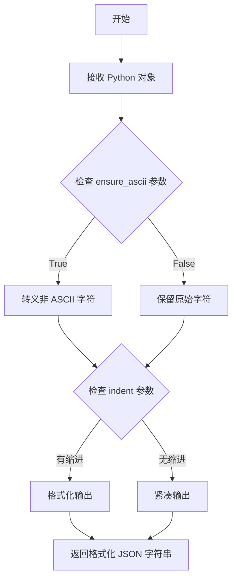

#### 带注释源码

```python
# json.dumps 在该代码中有两处调用：

# 调用点 1：在 _dump_json 函数中序列化上下文统计信息
await context.output_storage.set(
    "stats.json", json.dumps(asdict(context.stats), indent=4, ensure_ascii=False)
)
# 说明：将 context.stats 转换为字典后序列化为格式化的 JSON 字符串
# - asdict(context.stats): 将 dataclasses 对象转换为字典
# - indent=4: 使用 4 个空格缩进，使输出易于阅读
# - ensure_ascii=False: 允许非 ASCII 字符（如中文）正常显示

# 调用点 2：在 _dump_json 函数中序列化上下文状态
try:
    state_blob = json.dumps(context.state, indent=4, ensure_ascii=False)
finally:
    if temp_context:
        context.state["additional_context"] = temp_context
# 说明：将 context.state 序列化为 JSON 字符串
# - context.state: 包含运行时状态的字典
# - indent=4: 格式化输出
# - ensure_ascii=False: 保留非 ASCII 字符
# - 使用 try-finally 确保 additional_context 被正确恢复
```


### `run_pipeline` 中的 `time.strftime` 调用

在 `run_pipeline` 异步函数中，`time.strftime` 用于生成增量索引的时间戳，创建带时间标记的存储目录结构。

参数：

- `format`： `str`，格式模板字符串，值为 `"%Y%m%d-%H%M%S"`，表示年-月-日-时-分-秒的格式（如 "20240115-143052"）

返回值： `str`，格式化后的时间戳字符串，用于标识本次增量运行的唯一时间

#### 流程图

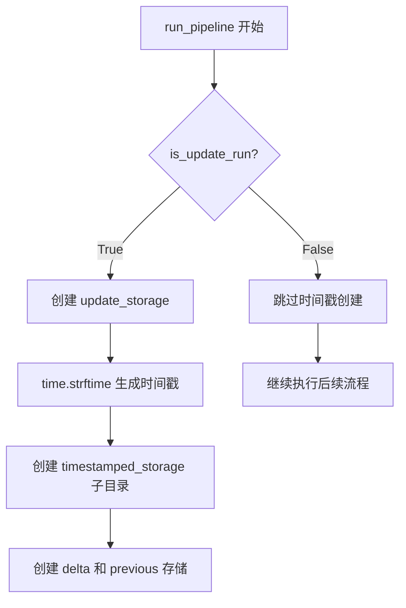

#### 带注释源码

```python
# 在 run_pipeline 函数内部，第53行
if is_update_run:
    logger.info("Running incremental indexing.")

    update_storage = create_storage(config.update_output_storage)
    # 使用 time.strftime 生成时间戳字符串，用于命名存储目录
    # 格式: YYYYMMDD-HHMMSS (如 20240115-143052)
    update_timestamp = time.strftime("%Y%m%d-%H%M%S")
    # 创建以时间戳命名的子存储
    timestamped_storage = update_storage.child(update_timestamp)
    # 在时间戳目录下创建 delta 目录存储增量数据
    delta_storage = timestamped_storage.child("delta")
    delta_table_provider = create_table_provider(
        config.table_provider, delta_storage
    )
    # 创建 previous 目录备份之前的输出
    previous_storage = timestamped_storage.child("previous")
    previous_table_provider = create_table_provider(
        config.table_provider, previous_storage
    )

    await _copy_previous_output(output_table_provider, previous_table_provider)

    state["update_timestamp"] = update_timestamp
```


### `time.time`

`time.time` 是 Python 标准库中的函数，用于返回当前时间戳（自 1970 年 1 月 1 日以来的秒数）。在该代码中，它主要用于性能分析和记录工作流执行的时间信息。

参数：该函数无参数

返回值：`float`，返回自 Unix 纪元（1970-01-01 00:00:00）以来的秒数（浮点数）

#### 流程图

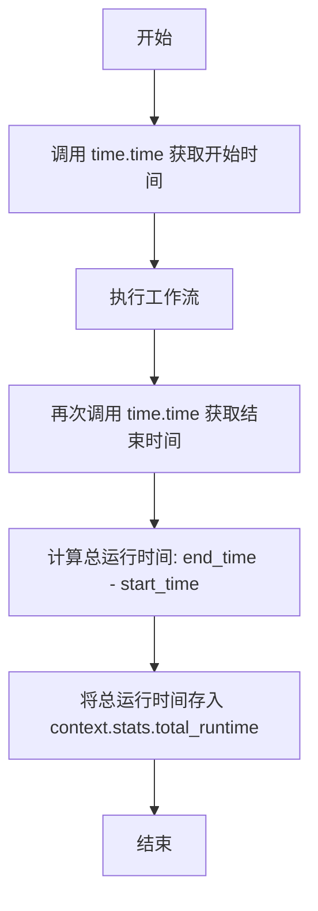

#### 带注释源码

```python
async def _run_pipeline(
    pipeline: Pipeline,
    config: GraphRagConfig,
    context: PipelineRunContext,
) -> AsyncIterable[PipelineRunResult]:
    # 使用 time.time() 记录管道开始执行的时间戳
    start_time = time.time()

    last_workflow = "<startup>"

    try:
        await _dump_json(context)

        logger.info("Executing pipeline...")
        for name, workflow_function in pipeline.run():
            last_workflow = name
            context.callbacks.workflow_start(name, None)

            with WorkflowProfiler() as profiler:
                result = await workflow_function(config, context)

            context.callbacks.workflow_end(name, result)
            yield PipelineRunResult(
                workflow=name, result=result.result, state=context.state, error=None
            )
            context.stats.workflows[name] = profiler.metrics
            if result.stop:
                logger.info("Halting pipeline at workflow request")
                break

        # 使用 time.time() 再次获取当前时间，计算管道总运行时间
        context.stats.total_runtime = time.time() - start_time
        logger.info("Indexing pipeline complete.")
        await _dump_json(context)

    except Exception as e:
        logger.exception("error running workflow %s", last_workflow)
        yield PipelineRunResult(
            workflow=last_workflow, result=None, state=context.state, error=e
        )
```

#### 使用场景说明

| 使用位置 | 代码片段 | 用途 |
|---------|---------|------|
| `_run_pipeline` 函数开始 | `start_time = time.time()` | 记录管道开始执行的时间点 |
| `_run_pipeline` 函数结束 | `context.stats.total_runtime = time.time() - start_time` | 计算整个管道的总执行时间并存储到统计信息中 |

#### 关键点总结

- **`time.time()`** 是一个无参数的 Python 标准库函数
- 在该代码中用于**性能分析**和**运行时间统计**
- 通过计算结束时间与开始时间的差值，得到工作流管道的总运行时长
- 该信息存储在 `context.stats.total_runtime` 中，可用于后续的性能监控和分析


### `WorkflowCallbacks.workflow_start`

描述：`workflow_start` 是工作流回调接口中的一个方法，用于在工作流开始执行前被调用，通知回调系统某个工作流已启动。

参数：

- `name`：`str`，工作流的名称，用于标识当前正在启动的工作流
- `params`：`Any`，传递给工作流的参数或元数据（代码中传入 `None`）

返回值：`None`，该方法为回调方法，不返回任何值

#### 流程图

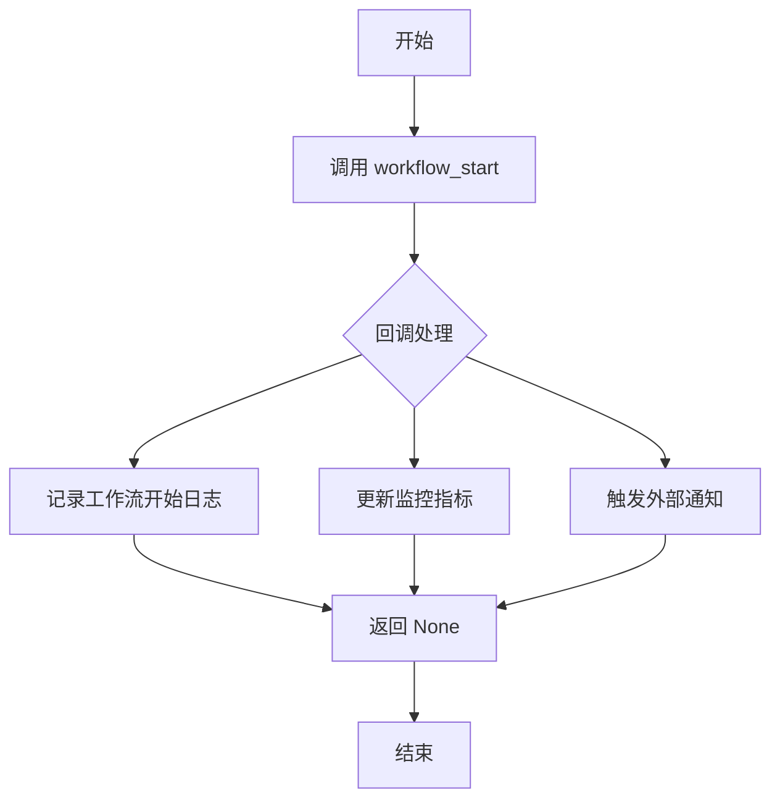

#### 带注释源码

```python
# 定义于 graphrag/callbacks/workflow_callbacks.py（推断）
class WorkflowCallbacks:
    """工作流回调接口类，用于在工作流执行生命周期中插入自定义逻辑"""
    
    async def workflow_start(self, name: str, params: Any | None) -> None:
        """在工作流开始执行前调用的回调方法
        
        Args:
            name: 工作流的唯一标识名称
            params: 传递给工作流的参数字典，可为 None
            
        Returns:
            None: 该方法为异步回调，不返回任何值
        """
        # 在实际实现中可能包含以下逻辑：
        # - 记录工作流开始日志
        # - 初始化工作流级别的监控指标
        # - 触发工作流开始的事件通知
        pass

# 在 pipeline 运行时的调用方式（来自 provided code）：
# 位于 _run_pipeline 函数中
context.callbacks.workflow_start(name, None)
```


### `WorkflowCallbacks.workflow_end`

描述：`WorkflowCallbacks` 类中的回调方法，用于在工作流执行完成后记录工作流的结束状态和结果。该方法在工作流函数执行完毕后被调用，接收工作流名称和执行结果作为参数。

参数：

- `name`：`str`，工作流的名称，标识当前执行完毕的工作流
- `result`：`Any`，工作流执行的结果对象，包含工作流的实际输出数据

返回值：`None`，该方法为回调方法，不返回任何值

#### 流程图

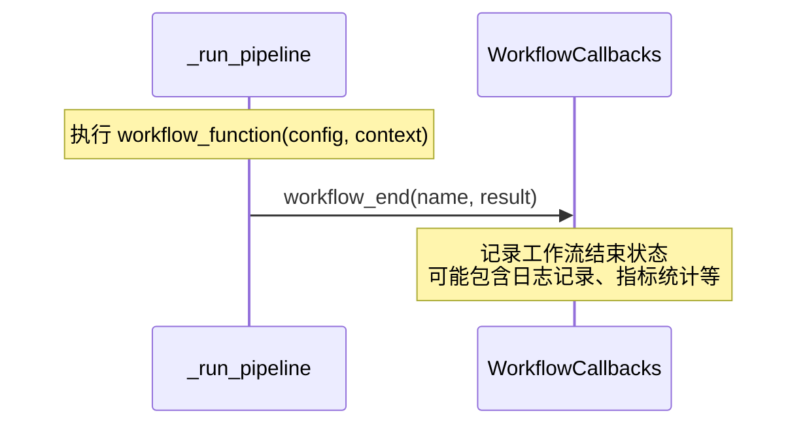

#### 带注释源码

```python
# 调用位置在 _run_pipeline 函数中
# 源代码第 127-128 行

# result 来自 await workflow_function(config, context)
# 这是一个包含 .result 和 .stop 属性的对象
result = await workflow_function(config, context)

# 调用 workflow_end 回调，通知工作流执行完成
# 参数 name: str - 工作流名称
# 参数 result: Any - 工作流执行结果
context.callbacks.workflow_end(name, result)

# 紧接着构建并返回 PipelineRunResult
yield PipelineRunResult(
    workflow=name, result=result.result, state=context.state, error=None
)
```

> **注意**：由于 `WorkflowCallbacks` 类定义在导入的模块 `graphrag.callbacks.workflow_callbacks` 中，完整的类定义（包含 `workflow_end` 方法的源码）未在当前代码文件中提供。以上信息是基于代码使用方式推断得出的。


### WorkflowProfiler.__enter__

`WorkflowProfiler.__enter__` 是上下文管理器的入口方法，在进入 `with` 块时调用，用于初始化性能分析器并启动计时。

参数：

- `self`：隐式参数，表示 WorkflowProfiler 实例本身

返回值：`WorkflowProfiler`，返回当前实例，以便在 `with` 块中使用

#### 流程图

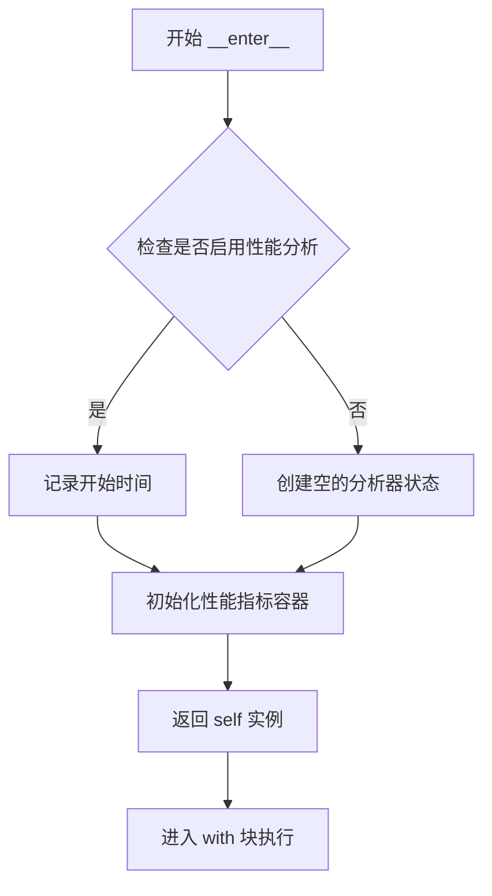

#### 带注释源码

```python
# 由于 WorkflowProfiler 类定义在 graphrag.index.run.profiling 模块中
# 而该模块未在当前代码段中提供
# 以下是基于使用模式推断的可能实现：

class WorkflowProfiler:
    """工作流性能分析器上下文管理器"""
    
    def __init__(self):
        """初始化分析器"""
        self.start_time = None
        self.metrics = {}
    
    def __enter__(self):
        """上下文管理器入口方法
        
        在进入 with 块时调用，启动性能计时
        
        Returns:
            WorkflowProfiler: 返回自身实例供 with 块使用
        """
        import time
        self.start_time = time.time()
        # 初始化用于存储性能指标的字典
        self.metrics = {
            "start_time": self.start_time,
            "workflows": {}
        }
        return self  # 返回 self 以便在 with 语句中赋值给变量
    
    def __exit__(self, exc_type, exc_val, exc_tb):
        """上下文管理器退出方法
        
        在离开 with 块时调用，计算总耗时
        
        Args:
            exc_type: 异常类型
            exc_val: 异常值
            exc_tb: 异常追溯信息
            
        Returns:
            bool: 是否抑制异常传播
        """
        import time
        if self.start_time:
            self.metrics["total_runtime"] = time.time() - self.start_time
        return False  # 不抑制异常，让异常正常传播
```

#### 补充说明

**使用示例（从提供代码中提取）：**

```python
# 在 _run_pipeline 函数中的使用方式
with WorkflowProfiler() as profiler:
    result = await workflow_function(config, context)

# profiler.metrics 会被用于记录工作流执行时间
context.stats.workflows[name] = profiler.metrics
```

**注意事项：**

- `WorkflowProfiler` 类的完整源码位于 `graphrag/index/run/profiling.py` 模块中
- 当前提供的代码段仅展示了导入和使用方式，未包含该类的实际定义
- 如需获取更详细的字段和方法信息，建议查看源文件 `graphrag/index/run/profiling.py`


### `WorkflowProfiler.__exit__`

描述：在使用 `with` 语句的代码块执行完毕后，记录工作流的性能指标（如运行时间），并将其存储到 `profiler.metrics` 中供后续统计使用。该方法是上下文管理器的退出方法，负责清理和度量数据的收集。

参数：

- `exc_type`：`type | None`，异常类型，如果发生异常则为异常类，否则为 `None`
- `exc_val`：`BaseException | None`，异常值，如果发生异常则为异常实例，否则为 `None`
- `exc_tb`：`TracebackType | None`，回溯对象，如果发生异常则为回溯实例，否则为 `None`

返回值：`bool | None`，返回值描述

#### 流程图

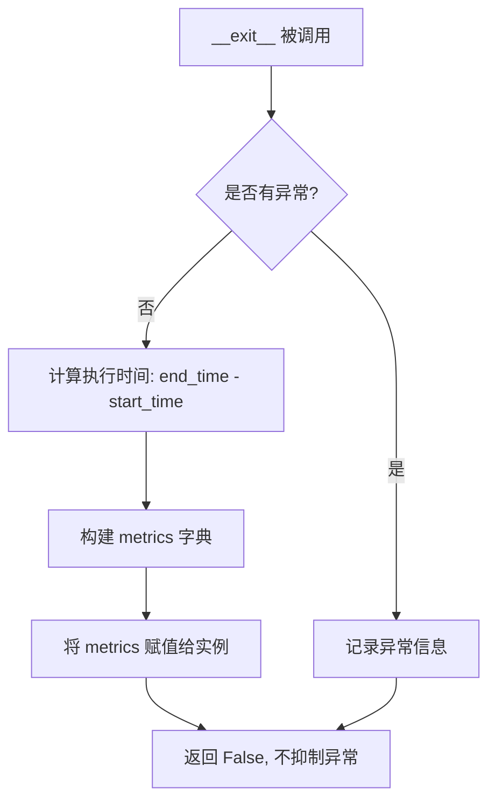

#### 带注释源码

```python
# 基于代码中 WorkflowProfiler 的使用方式推断
# 使用示例:
# with WorkflowProfiler() as profiler:
#     result = await workflow_function(config, context)
# ...
# context.stats.workflows[name] = profiler.metrics

def __exit__(
    self,
    exc_type: type | None,           # 异常类型，with块中发生异常时传递
    exc_val: BaseException | None,   # 异常实例，with块中发生异常时传递
    exc_tb: TracebackType | None     # 异常回溯，with块中发生异常时传递
) -> bool | None:
    """上下文管理器退出方法。
    
    在 with 语句块执行完毕后被调用，用于：
    1. 记录工作流执行结束时间
    2. 计算总执行时长
    3. 构建包含性能指标的 metrics 字典
    4. 将指标存储到实例的 metrics 属性中供外部访问
    
    参数:
        exc_type: 如果 with 块中发生异常,这是异常类型;否则为 None
        exc_val: 如果 with 块中发生异常,这是异常实例;否则为 None
        exc_tb: 如果 with 块中发生异常,这是异常回溯对象;否则为 None
    
    返回:
        bool: 返回 False 表示不抑制异常,异常将继续向上传播
    """
    # 记录执行结束时间
    self._end_time = time.time()
    
    # 计算总执行时长
    runtime = self._end_time - self._start_time
    
    # 构建性能指标字典
    self.metrics = {
        "runtime": runtime,                    # 总运行时间(秒)
        "start_time": self._start_time,        # 开始时间戳
        "end_time": self._end_time,            # 结束时间戳
        "success": exc_type is None,           # 是否成功执行(无异常)
        "error_type": exc_type.__name__ if exc_type else None  # 异常类型名称
    }
    
    # 返回 False 使异常可以正常传播,不 suppressed
    return False
```

**注**：由于 `WorkflowProfiler` 类的完整源码未在给定的代码文件中，而是通过 `from graphrag.index.run.profiling import WorkflowProfiler` 导入，因此以上源码是基于代码中使用方式的推断。实际实现可能略有差异，但其核心功能是收集工作流执行的性能指标并存储到 `profiler.metrics` 属性中，供后续通过 `context.stats.workflows[name] = profiler.metrics` 记录到统计信息中。


## 关键组件


### 管道执行引擎 (Pipeline Execution Engine)

负责协调和管理整个索引管道的工作流执行。核心功能包括按顺序执行配置的工作流、收集每个工作流的执行结果、记录性能指标，并在工作流请求停止时提前终止管道。该组件通过异步迭代器模式逐个产出 PipelineRunResult，支持与上游系统的流式集成。

### 增量更新支持 (Incremental Update Support)

提供增量/更新索引运行的能力。当 is_update_run 为真时，该组件会创建时间戳存储结构（delta 存储和 previous 备份），将之前的输出复制到备份区域，并允许新数据直接写入 delta 存储供后续合并使用。这实现了索引的增量更新而无需重建整个索引。

### 状态管理 (State Management)

负责在管道执行过程中持久化和恢复上下文状态。组件维护一个 state 字典，支持 additional_context 的合并，并能够将状态序列化到 context.json 文件。在增量运行场景中，状态管理确保之前的工作流状态得以保留并与新状态合并。

### 存储抽象层 (Storage Abstraction)

提供统一的存储接口，封装了输入存储、输出存储、增量存储、备份存储等多种存储类型。通过 create_storage 工厂函数创建具体存储实现，支持子存储的层级创建（child 方法），使得管道能够在不同的存储区域之间进行数据流转和备份操作。

### 性能分析 (Performance Profiling)

使用 WorkflowProfiler 上下文管理器追踪每个工作流的执行时间和资源使用情况。分析数据存储在 context.stats.workflows 字典中，并在管道执行完成后写入 stats.json 文件，为优化管道性能提供数据支持。

### 回调系统 (Callback System)

通过 WorkflowCallbacks 抽象提供工作流生命周期事件的钩子。包括 workflow_start（工作流开始）和 workflow_end（工作流结束）两个回调点，允许外部系统监听管道执行进度并执行自定义逻辑。

### 错误处理与恢复 (Error Handling)

实现完整的异常捕获机制，捕获管道执行过程中的所有异常。错误被封装在 PipelineRunResult 的 error 字段中返回，确保单个工作流的失败不会中断整个迭代器流。同时使用 logger.exception 记录详细的错误堆栈信息用于调试。


## 问题及建议


### 已知问题

-   **异常处理不完整**：在 `_run_pipeline` 的 except 块中，捕获异常后未调用 `workflow_end` 回调，可能导致回调状态不一致
-   **状态序列化风险**：`_dump_json` 函数中 `context.state.pop("additional_context", None)` 的操作存在风险，如果在 `pop` 后、`try` 块前发生异常，additional_context 将永久丢失
-   **增量更新无事务性**：如果增量更新流程在执行过程中失败，会产生孤立的 delta 存储目录，无法自动回滚
- **表复制效率低**：`_copy_previous_output` 函数使用顺序迭代而非并行处理，在表较多时性能较差
- **缺少工作流重试机制**：单个工作流失败时直接终止管道，无重试逻辑
- **硬编码文件名**："context.json" 和 "stats.json" 被硬编码在不同位置，降低了可配置性

### 优化建议

-   **增强异常处理**：在 except 块中确保调用 `context.callbacks.workflow_end(name, None)` 以保持回调状态一致性
-   **安全的状态操作**：使用上下文管理器或深拷贝来保护 additional_context，避免直接修改原始状态字典
-   **添加资源清理**：实现 context manager 或显式 close 方法来清理 cache、storage 等资源
-   **并行表复制**：使用 `asyncio.gather` 并行执行表复制操作，提升 `_copy_previous_output` 性能
-   **添加重试机制**：为工作流执行添加可选的重试配置，支持指数退避策略
-   **提取魔法字符串**：将 "context.json"、"stats.json"、"-load_update_documents" 等字符串提取为常量或配置项
-   **改进日志记录**：将 `logger.exception` 调用移至专门的错误处理异步任务中，避免阻塞事件循环
-   **添加幂等性检查**：在增量更新开始前验证上一次更新是否成功完成，避免不完整的状态合并


## 其它


### 设计目标与约束

**设计目标**：提供统一的异步管道执行框架，支持标准全量索引和增量更新索引两种模式，实现工作流的顺序执行、状态持久化、错误恢复和性能剖析。

**约束条件**：
- 管道执行器必须为异步（async）实现，支持大规模数据处理
- 增量更新必须保证原子性，失败时能够回滚到前一状态
- 所有工作流共享同一个PipelineRunContext，确保状态在整个管道生命周期内一致
- 输入/输出存储必须通过抽象接口（Storage）访问，支持多种存储后端

### 错误处理与异常设计

**异常捕获机制**：
- 在_run_pipeline函数的外层try-except块中捕获所有异常，确保单个工作流失败不会导致整个进程崩溃
- 异常信息通过WorkflowCallbacks.workflow_end回调传播，并记录到PipelineRunResult的error字段

**错误传播流程**：
- 工作流函数执行时捕获的异常会被记录到日志（logger.exception）
- 立即yield一个包含错误信息的PipelineRunResult，error字段为异常对象
- 调用方可以通过检查error字段来判断工作流是否成功执行

**状态一致性保证**：
- 增量更新模式下，复制当前输出到previous存储作为备份
- 异常发生时，previous存储可用于回滚
- context.json和stats.json在管道开始和结束时都会持久化，确保状态可追溯

### 数据流与状态机

**标准索引模式数据流**：
1. 加载/创建input_storage、output_storage、output_table_provider、cache
2. 从output_storage加载历史状态（context.json）
3. 合并additional_context到状态
4. 若input_documents不为None，直接写入output_table_provider并移除load_input_documents工作流
5. 创建PipelineRunContext，传入所有依赖
6. 顺序执行管道中的每个工作流
7. 每个工作流结果通过AsyncIterable yield返回
8. 最终将stats和state持久化到output_storage

**增量更新模式数据流**：
1. 加载基础配置（同标准模式）
2. 创建update_storage及其子存储：timestamped_storage（带时间戳的目录）、delta_storage（增量数据）、previous_storage（前一次输出备份）
3. 复制output_table_provider的所有表到previous_table_provider
4. 将update_timestamp写入状态
5. 若input_documents不为None，写入delta_table_provider并移除load_update_documents工作流
6. 创建context时传入previous_table_provider，供需要访问历史数据的工作流使用
7. 执行管道，输出写入delta_storage
8. 合并逻辑由下游工作流完成（通过读取previous和delta）

**状态机转换**：
- 初始状态：context.json存在则加载，否则为空dict
- 运行状态：每个工作流执行前后触发callbacks，状态持续更新
- 完成状态：所有工作流执行完毕或收到stop信号
- 错误状态：异常发生时立即转换为错误状态并yield结果

### 外部依赖与接口契约

**核心依赖接口**：

| 依赖类型 | 接口名称 | 作用 | 关键方法 |
|---------|---------|------|---------|
| 存储抽象 | Storage | 通用键值存储 | get(), set(), child() |
| 表提供者 | TableProvider | DataFrame读写 | read_dataframe(), write_dataframe(), list() |
| 缓存 | Cache | 工作流结果缓存 | get(), set() |
| 回调 | WorkflowCallbacks | 工作流生命周期事件 | workflow_start(), workflow_end() |
| 配置 | GraphRagConfig | 管道配置模型 | 包含input_storage、output_storage、cache等配置字段 |

**配置模型依赖**：
- GraphRagConfig：必须包含input_storage、output_storage、update_output_storage、table_provider、cache等配置字段
- TableProviderFactory：根据config.table_provider创建对应的表提供者实例

**工作流接口约束**：
- 工作流必须是可调用对象（Callable），签名为(config: GraphRagConfig, context: PipelineRunContext) -> WorkflowResult
- WorkflowResult必须包含result、stop两个字段

### 性能考虑

**异步执行模型**：
- 使用async for遍历工作流，实现非阻塞执行
- 存储读写操作均为异步，避免阻塞事件循环

**增量更新优化**：
- 通过timestamped_storage隔离每次更新，便于审计和回滚
- 支持直接接收DataFrame，跳过文档加载/解析步骤

**状态序列化**：
- 使用json.dumps序列化stats和state，确保可读性
- additional_context不序列化（可能包含大对象），仅在内存中保留引用

### 安全性考虑

**数据隔离**：
- 增量模式下使用独立目录（timestamped_storage）存储更新，避免污染原始输出
- previous_storage作为备份，可在异常时恢复

**配置安全**：
- 敏感配置（如存储连接信息）应通过环境变量或密钥管理系统注入，避免硬编码

### 配置管理

**配置来源**：
- 所有配置通过GraphRagConfig对象传入
- 配置在管道启动前由调用方构建

**动态配置更新**：
- additional_context允许在运行时注入额外配置，合并到context.state["additional_context"]

### 监控与可观测性

**日志记录**：
- 使用标准logging模块，记录管道开始、结束、错误信息
- 工作流名称和执行时间通过logger.info输出

**性能剖析**：
- 使用WorkflowProfiler记录每个工作流的执行时间
- 整体runtime通过context.stats.total_runtime记录
- stats.json持久化便于后续分析

**回调机制**：
- WorkflowCallbacks提供扩展点，可接入监控系统（如OpenTelemetry）

### 测试策略

**单元测试**：
- 测试_run_pipeline的单个工作流执行逻辑
- 测试_dump_json的序列化行为

**集成测试**：
- 测试标准索引完整流程
- 测试增量更新模式的状态复制和合并
- 测试异常情况下的错误传播

**Mock策略**：
- 存储、缓存、表提供者应通过接口抽象，便于Mock

### 部署考虑

**环境依赖**：
- Python 3.10+
- graphrag_cache、graphrag_storage、pandas等依赖

**资源要求**：
- 增量更新模式需要2倍存储空间（current + previous）
- 内存需求取决于工作流复杂度，建议根据input_documents大小评估

**扩展性**：
- 支持通过WorkflowCallbacks插入自定义监控
- 工作流可通过pipeline.remove()动态移除，灵活控制执行流程


    