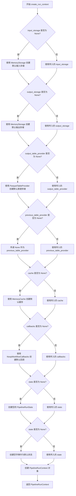
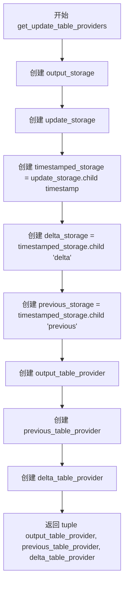
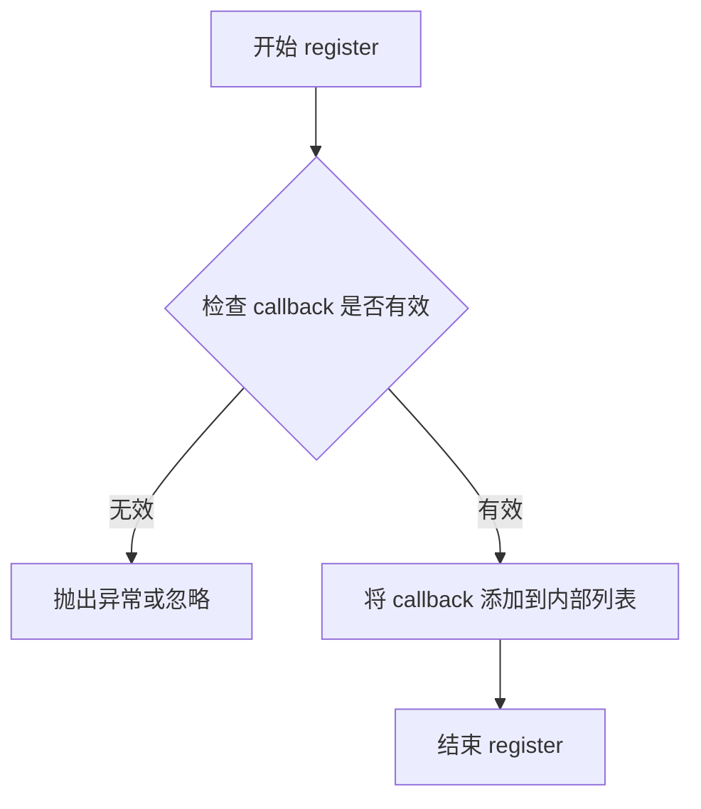

# `graphrag\packages\graphrag\graphrag\index\run\utils.py` 详细设计文档

GraphRAG管道运行工具模块，提供创建管道运行上下文、回调链管理器和更新索引表提供者的工具函数，用于支持GraphRAG索引管道的执行和状态管理。

## 整体流程

```mermaid
graph TD
A[开始] --> B{create_run_context调用}
B --> C[初始化默认Storage]
C --> D[创建PipelineRunContext]
E[开始] --> F{create_callback_chain调用}
F --> G[创建WorkflowCallbacksManager]
G --> H[注册回调列表]
I[开始] --> J{get_update_table_providers调用}
J --> K[创建output_storage和update_storage]
K --> L[创建timestamped/ delta/ previous子存储]
L --> M[创建三个TableProvider]
M --> N[返回(output, previous, delta)表提供者]
```

## 类结构

```
PipelineRunContext (数据类)
WorkflowCallbacksManager (回调管理器)
WorkflowCallbacks (抽象基类)
NoopWorkflowCallbacks (空实现)
TableProvider (抽象基类)
ParquetTableProvider (具体实现)
Storage (抽象基类)
MemoryStorage (具体实现)
Cache (抽象基类)
MemoryCache (具体实现)
```

## 全局变量及字段


### `PipelineRunContext.input_storage`
    
用于存储输入数据的存储对象，如果未提供则使用内存存储

类型：`Storage | None`
    


### `PipelineRunContext.output_storage`
    
用于存储输出数据的存储对象，如果未提供则使用内存存储

类型：`Storage | None`
    


### `PipelineRunContext.output_table_provider`
    
用于写入输出表的表提供者，默认使用ParquetTableProvider

类型：`TableProvider | None`
    


### `PipelineRunContext.previous_table_provider`
    
用于读取上一次运行数据的表提供者，支持增量更新场景

类型：`TableProvider | None`
    


### `PipelineRunContext.cache`
    
用于缓存计算结果的缓存对象，默认使用内存缓存

类型：`Cache | None`
    


### `PipelineRunContext.callbacks`
    
工作流回调管理器，用于在管道执行过程中触发回调事件

类型：`WorkflowCallbacks | None`
    


### `PipelineRunContext.stats`
    
管道运行统计信息，记录各阶段执行指标

类型：`PipelineRunStats | None`
    


### `PipelineRunContext.state`
    
管道状态字典，用于在管道执行过程中传递和保存状态数据

类型：`PipelineState | None`
    


### `WorkflowCallbacksManager.callbacks`
    
已注册的工作流回调列表，用于管理多个回调实例

类型：`list[WorkflowCallbacks]`
    
    

## 全局函数及方法


### `create_run_context`

创建并返回管道运行上下文（PipelineRunContext），用于在整个索引管道中传递共享的资源和服务（如存储、表提供者、缓存、回调、统计和状态）。

参数：

- `input_storage`：`Storage | None`，输入存储，如果为 None 则创建内存存储
- `output_storage`：`Storage | None`，输出存储，如果为 None 则创建内存存储
- `output_table_provider`：`TableProvider | None`，输出表提供者，如果为 None 则使用基于输出存储的 ParquetTableProvider
- `previous_table_provider`：`TableProvider | None`，之前的表提供者，用于增量更新场景
- `cache`：`Cache | None`，缓存实例，如果为 None 则创建内存缓存
- `callbacks`：`WorkflowCallbacks | None`，工作流回调，如果为 None 则使用无操作回调
- `stats`：`PipelineRunStats | None`，管道运行统计，如果为 None 则创建空统计对象
- `state`：`PipelineState | None`，管道状态字典，如果为 None 则创建空字典

返回值：`PipelineRunContext`，包含所有运行时资源和状态的上下文对象

#### 流程图



#### 带注释源码

```python
def create_run_context(
    input_storage: Storage | None = None,
    output_storage: Storage | None = None,
    output_table_provider: TableProvider | None = None,
    previous_table_provider: TableProvider | None = None,
    cache: Cache | None = None,
    callbacks: WorkflowCallbacks | None = None,
    stats: PipelineRunStats | None = None,
    state: PipelineState | None = None,
) -> PipelineRunContext:
    """Create the run context for the pipeline."""
    # 如果未提供输入存储，使用内存存储作为默认值
    input_storage = input_storage or MemoryStorage()
    # 如果未提供输出存储，使用内存存储作为默认值
    output_storage = output_storage or MemoryStorage()
    # 创建并返回管道运行上下文对象，整合所有传入或默认的资源
    return PipelineRunContext(
        input_storage=input_storage,
        output_storage=output_storage,
        # 如果未提供输出表提供者，基于输出存储创建 ParquetTableProvider
        output_table_provider=output_table_provider
        or ParquetTableProvider(storage=output_storage),
        previous_table_provider=previous_table_provider,
        # 如果未提供缓存，使用内存缓存作为默认值
        cache=cache or MemoryCache(),
        # 如果未提供回调，使用无操作回调作为默认值
        callbacks=callbacks or NoopWorkflowCallbacks(),
        # 如果未提供统计，使用空统计对象作为默认值
        stats=stats or PipelineRunStats(),
        # 如果未提供状态，使用空字典作为默认值
        state=state or {},
    )
```


### `create_callback_chain`

该函数用于创建一个回调管理器（WorkflowCallbacksManager），将多个回调函数封装成统一的回调管理器，以便于统一管理和调用。

参数：

- `callbacks`：`list[WorkflowCallbacks] | None`，一个可选的 WorkflowCallbacks 实例列表，用于注册到回调管理器中

返回值：`WorkflowCallbacks`，返回一个 WorkflowCallbacksManager 实例，它封装了所有传入的回调函数

#### 流程图

```mermaid
flowchart TD
    A[开始 create_callback_chain] --> B[创建 WorkflowCallbacksManager 实例]
    B --> C{callbacks 是否为 None?}
    C -->|是| D[使用空列表 [] 替代]
    C -->|否| E[直接使用 callbacks 列表]
    D --> F[遍历 callbacks 列表]
    E --> F
    F --> G{列表中还有未处理的 callback?}
    G -->|是| H[取出下一个 callback]
    H --> I[调用 manager.register callback 注册回调]
    I --> G
    G -->|否| J[返回 manager 实例]
    J --> K[结束]
```

#### 带注释源码

```python
def create_callback_chain(
    callbacks: list[WorkflowCallbacks] | None,
) -> WorkflowCallbacks:
    """Create a callback manager that encompasses multiple callbacks."""
    # 创建一个 WorkflowCallbacksManager 实例用于管理所有回调
    manager = WorkflowCallbacksManager()
    
    # 遍历传入的回调列表（如果为 None 则使用空列表）
    for callback in callbacks or []:
        # 将每个回调注册到管理器中
        manager.register(callback)
    
    # 返回封装了所有回调的管理器实例
    return manager
```


### `get_update_table_providers`

获取用于更新索引运行的表提供程序，创建并返回三个表提供程序（输出表提供程序、前一个表提供程序和增量表提供程序），分别用于访问主输出存储、包含之前数据的历史存储和包含增量更改的增量存储。

参数：

- `config`：`GraphRagConfig`，GraphRAG 配置对象，包含存储和表提供程序的相关配置
- `timestamp`：`str`，时间戳字符串，用于创建带时间戳的存储目录结构

返回值：`tuple[TableProvider, TableProvider, TableProvider]`，包含三个表提供程序的元组：
- 第一个：输出表提供程序，用于主输出存储
- 第二个：前一个表提供程序，用于访问历史/之前的数据
- 第三个：增量表提供程序，用于存储增量更改

#### 流程图



#### 带注释源码

```python
def get_update_table_providers(
    config: GraphRagConfig, timestamp: str
) -> tuple[TableProvider, TableProvider, TableProvider]:
    """Get table providers for the update index run."""
    # 从配置创建主输出存储，用于存储当前的索引数据
    output_storage = create_storage(config.output_storage)
    
    # 从配置创建更新输出存储，用于存储更新操作的数据
    update_storage = create_storage(config.update_output_storage)
    
    # 在更新存储下创建以时间戳命名的子存储，用于隔离不同时间点的更新
    timestamped_storage = update_storage.child(timestamp)
    
    # 在时间戳存储下创建 delta 子目录，用于存储本次更新的增量数据
    delta_storage = timestamped_storage.child("delta")
    
    # 在时间戳存储下创建 previous 子目录，用于存储上一次更新时的数据快照
    previous_storage = timestamped_storage.child("previous")

    # 根据配置创建输出表提供程序，关联主输出存储
    output_table_provider = create_table_provider(config.table_provider, output_storage)
    
    # 根据配置创建前一个表提供程序，关联历史数据存储
    previous_table_provider = create_table_provider(
        config.table_provider, previous_storage
    )
    
    # 根据配置创建增量表提供程序，关联增量数据存储
    delta_table_provider = create_table_provider(config.table_provider, delta_storage)

    # 返回三个表提供程序的元组
    return output_table_provider, previous_table_provider, delta_table_provider
```


### WorkflowCallbacksManager.register

该方法是 WorkflowCallbacksManager 类用于注册工作流回调函数的成员方法，将传入的 WorkflowCallbacks 回调对象添加到回调管理器中进行统一管理，以便在流水线执行过程中触发相应的回调逻辑。

参数：

- `callback`：`WorkflowCallbacks`，要注册的工作流回调实例，包含了在流水线各个阶段执行的自定义逻辑

返回值：`None`，该方法无返回值，仅执行注册操作

#### 流程图



#### 带注释源码

```python
# 该方法实现未在当前代码文件中提供
# 以下为基于使用场景的推断实现

class WorkflowCallbacksManager(WorkflowCallbacks):
    """工作流回调管理器，用于聚合多个回调处理器"""
    
    def __init__(self):
        """初始化回调管理器"""
        self._callbacks: list[WorkflowCallbacks] = []
    
    def register(self, callback: WorkflowCallbacks) -> None:
        """注册单个回调到管理器中
        
        Args:
            callback: 实现 WorkflowCallbacks 接口的回调实例
            
        Returns:
            None: 无返回值，执行注册操作
        """
        # 将回调对象添加到内部列表
        self._callbacks.append(callback)
    
    # 其他回调方法的实现会遍历 self._callbacks 并依次调用
```

## 关键组件


### PipelineRunContext 创建组件

负责初始化GraphRAG管道的运行时环境，整合输入输出存储、表提供者、缓存、回调和统计信息，支持内存和持久化存储的灵活配置。

### 存储层级管理组件

通过create_storage和child方法构建timestamped_storage -> delta/previous的层级存储结构，支持增量更新索引的版本管理和数据隔离。

### 表提供者工厂组件

基于配置动态创建TableProvider（支持Parquet等格式），封装了不同存储后端的表访问接口抽象。

### 回调链管理组件

通过WorkflowCallbacksManager将多个独立回调聚合为统一的管理器，支持注册和批量触发，用于 pipeline 各阶段的钩子扩展。

### 缓存抽象组件

通过Cache接口（MemoryCache实现）提供计算结果持久化能力，避免重复计算。

### 配置驱动组件

以GraphRagConfig为核心，读取output_storage、update_output_storage、table_provider等配置项，驱动运行时组件的创建。


## 问题及建议


### 已知问题

-   **硬编码的默认存储后端**：使用`MemoryStorage`和`MemoryCache`作为默认值，在生产环境中可能导致内存溢出或数据丢失，缺乏持久化存储的选项
-   **缺少错误处理**：对`create_storage`和`create_table_provider`的调用没有异常处理，如果配置错误或存储初始化失败会导致程序崩溃
-   **类型安全风险**：`state: PipelineState | None = None`默认为空字典`{}`，但类型注解可能是更复杂的类型，存在类型不一致的风险
-   **配置耦合**：`get_update_table_providers`直接读取`config`对象的多个存储配置，测试时难以mock
-   **回调管理器功能有限**：`WorkflowCallbacksManager`只提供了`register`方法，缺少取消注册、优先级控制等能力
-   **资源清理缺失**：创建了多个存储实例（output_storage、update_storage、timestamped_storage等）但没有显式的资源清理或context manager支持
-   **依赖外部模块**：代码依赖多个外部模块（graphrag_cache、graphrag_storage）的具体实现，存在接口变化导致代码失效的风险

### 优化建议

-   引入配置驱动的存储后端选择机制，允许通过配置文件指定默认存储类型，而非硬编码MemoryStorage
-   为关键函数添加try-except错误处理和合理的降级策略，如catch异常后返回默认存储或抛出更具信息量的自定义异常
-   统一状态类型定义，确保`state`参数的类型注解与实际使用一致，考虑使用TypeVar定义泛型状态类型
-   将配置读取逻辑抽象为独立的配置类或工厂函数，提高可测试性
-   增强回调管理器功能，支持优先级、禁用/启用、批量管理等操作
-   使用context manager模式管理存储生命周期，或添加显式的close/cleanup方法
-   添加依赖接口的版本检查或使用抽象基类定义接口契约，降低对具体实现的耦合

## 其它


### 设计目标与约束

本模块的设计目标是提供 GraphRAG 管道运行的上下文管理能力，包括存储、表提供者、缓存、回调和统计信息的初始化与管理。约束条件包括：所有存储对象默认为内存存储，回调默认为空操作回调，状态默认为空字典。

### 错误处理与异常设计

代码主要依赖下游组件（Storage、Cache、TableProvider等）的异常传播。create_run_context 函数在参数为 None 时自动创建默认实现（MemoryStorage、MemoryCache、ParquetTableProvider、NoopWorkflowCallbacks、PipelineRunStats），降低了创建上下文时的异常风险。get_update_table_providers 中的 create_storage 和 create_table_provider 调用可能抛出配置错误或初始化异常。

### 数据流与状态机

数据流方向：配置对象 (GraphRagConfig) → 存储创建 (create_storage) → 子存储划分 (child) → 表提供者创建 (create_table_provider) → 上下文组装 (PipelineRunContext)。状态机主要体现在 PipelineRunContext 中的 state 字段，该字段为 PipelineState 类型（字典），用于在管道执行过程中传递和保存状态信息。

### 外部依赖与接口契约

核心依赖包括：graphrag_cache 模块提供 Cache 和 MemoryCache；graphrag_storage 模块提供 Storage、MemoryStorage、TableProvider、ParquetTableProvider、create_storage 和 create_table_provider；graphrag.callbacks 模块提供 WorkflowCallbacks、NoopWorkflowCallbacks 和 WorkflowCallbacksManager；graphrag.index.typing 模块提供 PipelineRunContext、PipelineState 和 PipelineRunStats；graphrag.config 模块提供 GraphRagConfig。接口契约：create_run_context 返回 PipelineRunContext 对象；create_callback_chain 返回 WorkflowCallbacks 管理器；get_update_table_providers 返回三个 TableProvider 元组。

### 配置管理

配置通过 GraphRagConfig 对象传入，主要涉及 config.output_storage、config.update_output_storage 和 config.table_provider 三个配置项。配置在 get_update_table_providers 函数中使用，用于创建相应的存储和表提供者实例。

### 性能考虑

默认使用内存存储（MemoryStorage、MemoryCache）适合开发和测试环境，但在大规模数据处理时可能成为性能瓶颈。get_update_table_providers 中创建的 timestamped_storage、delta_storage、previous_storage 三个子存储会占用额外内存空间。

### 安全性考虑

代码本身不涉及敏感数据处理，但需要注意传入的 Storage、Cache 等组件可能包含敏感数据。回调机制（WorkflowCallbacks）可能被恶意实现，需确保可信的回调对象传入。

### 测试策略

建议为三个函数编写单元测试：测试 create_run_context 的默认参数和自定义参数行为；测试 create_callback_chain 对空列表和回调列表的处理；测试 get_update_table_providers 对不同配置的响应。集成测试应验证 PipelineRunContext 对象的完整性和各组件的协作。

### 版本兼容性

代码依赖于多个 graphrag 子模块，需确保这些模块的版本与当前代码兼容。PipelineRunContext 的字段定义来自 graphrag.index.typing，任何对该类的修改都可能导致不兼容。

### 并发安全性

当前实现未包含并发控制机制。在多线程或多进程环境下，共享的 MemoryStorage、MemoryCache 可能导致竞态条件。PipelineRunStats 的累加操作在并发场景下需要考虑线程安全。

    