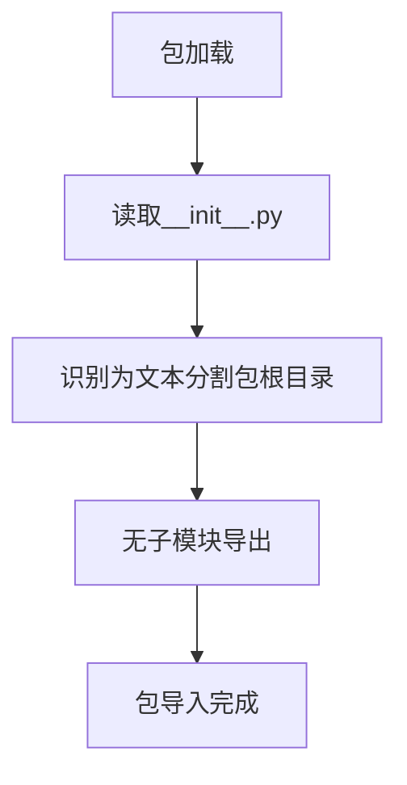

# `graphrag\packages\graphrag\graphrag\index\text_splitting\__init__.py` 详细设计文档

这是微软Indexing Engine项目的文本分割包根目录的初始化文件，仅包含版权声明和包描述，无实际实现代码。

## 整体流程



## 类结构

```
该文件为包根目录初始化文件，无类层次结构
```

## 全局变量及字段


    

## 全局函数及方法


## 关键组件


### 核心功能概述

该代码是微软索引引擎文本分割包的根模块，定义了包的名称和版权信息，作为包的入口点和命名空间标识。

### 文件运行流程

作为Python包的根模块，该文件在包被导入时首先执行，负责包的初始化和版本信息暴露。

### 类信息

无类定义。

### 全局变量与函数

无全局变量或函数定义。

### 关键组件信息

### 包根模块

该模块作为"the-indexing-engine-text-splitting"包的入口点，仅包含版权声明和包描述文档字符串。

### 技术债务与优化空间

由于该文件仅为包根模块的占位符，当前无功能实现。建议在后续迭代中添加包级别配置、版本管理和子模块统一导出接口。

### 其它项目

- **设计目标**: 定义索引引擎文本分割功能的命名空间
- **依赖**: 无外部依赖
- **错误处理**: 不适用
- **数据流**: 不适用


## 问题及建议


### 已知问题

-   包初始化文件缺少实际功能实现，仅包含文档字符串，无法提供任何实质性的模块功能
-   缺少包的版本信息定义（__version__），影响依赖管理和版本追踪
-   未定义包的公开API接口（__all__），不利于模块的封装性和使用规范
-   未包含任何导入语句或子模块引用，无法形成完整的包结构

### 优化建议

-   添加包版本号定义，如 `__version__ = "0.1.0"`
-   定义 `__all__` 列表以明确导出接口，例如 `__all__ = ["TextSplitter", "SentenceSplitter"]`
-   考虑添加包的初始化配置逻辑或导入核心组件，使包在被导入时具备基础功能
-   添加类型提示文件（py.typed）以支持静态类型检查
-   可考虑在此处配置日志记录器或全局配置项


## 其它


### 设计目标与约束

本包作为索引引擎文本分割包的根模块，主要目标是为文本分割功能提供模块化的包结构支持。设计约束包括：遵循MIT开源许可证、保持与Microsoft相关项目的兼容性、确保代码符合Python最佳实践。

### 错误处理与异常设计

由于当前代码仅为包初始化文件，未包含具体业务逻辑，因此暂无特定的异常设计。如后续添加功能，建议定义包级别的自定义异常类，并遵循项目统一的错误码规范。

### 数据流与状态机

当前无数据流处理需求。未来实现文本分割功能时，应设计清晰的数据输入→处理→输出流程，并明确定义各处理阶段的状态转换。

### 外部依赖与接口契约

当前无外部依赖。未来如需引入外部库（如nltk、spacy等），应在文档中明确标注依赖版本范围、接口调用方式及兼容性要求。

### 性能要求

当前无性能要求。后续实现文本分割算法时，应考虑时间复杂度和空间复杂度，并设定合理的性能指标。

### 安全考虑

当前无安全相关实现。后续添加功能时应遵循安全编码规范，防止注入攻击、拒绝服务等安全风险。

### 测试策略

建议为每个子模块编写单元测试和集成测试，确保文本分割功能的准确性和稳定性。测试覆盖率应达到项目要求的标准。

### 版本控制与发布策略

遵循语义化版本号规范（Semantic Versioning），当前版本为0.1.0（初始版本）。发布时应更新版本号并记录变更日志。

### 监控与日志

建议在包的关键功能点添加日志记录，便于运行时监控和问题排查。日志级别应可配置。

### 配置管理

建议将文本分割的参数（如块大小、重叠量等）通过配置文件或环境变量进行管理，支持运行时动态调整。

    