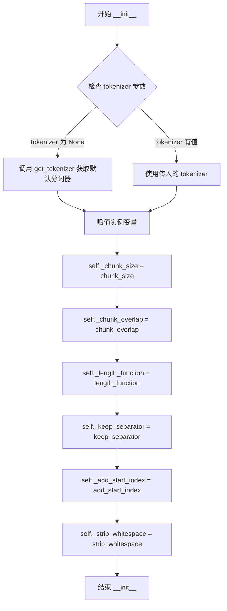
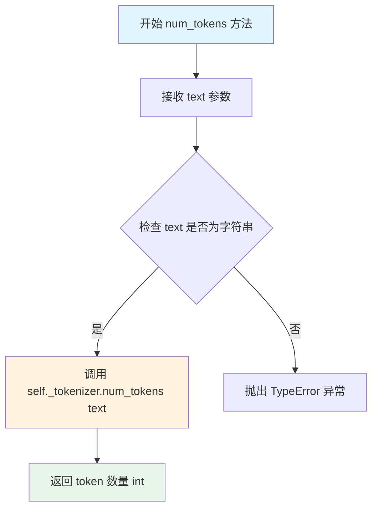

# `graphrag\packages\graphrag\graphrag\index\text_splitting\text_splitting.py` 详细设计文档

一个基于token的文本分割器模块，提供TokenTextSplitter类将长文本按指定的token数量分割成多个小块，同时支持重叠区域，适用于各种embedding模型的输入限制场景。

## 整体流程

```mermaid
graph TD
    A[开始] --> B{输入text是list?}
    B -- 是 --> C[使用空格连接所有文本]
    B -- 否 --> D{text是NaN或空字符串?}
    C --> E[调用split_single_text_on_tokens]
    D -- 是 --> F[返回空列表[]]
    D -- 否 --> E
    E --> G[encode(text)获取token IDs]
    G --> H[计算起始和结束索引]
    H --> I[decode(chunk_ids)转换为文本]
    I --> J[追加到结果列表]
    J --> K{还有更多token?}
    K -- 是 --> L[计算下一个分块的起始位置]
    L --> H
    K -- 否 --> M[返回结果列表]
```

## 类结构

```
TokenTextSplitter (ABC抽象基类)
└── split_text() - 文本分割主方法
└── num_tokens() - 计算token数量方法
└── split_single_text_on_tokens() - 底层分割函数
```

## 全局变量及字段


### `EncodedText`
    
编码文本类型别名，表示tokenize后的整数列表

类型：`list[int]`
    


### `DecodeFn`
    
解码函数类型别名，将编码文本转换回字符串

类型：`Callable[[EncodedText], str]`
    


### `EncodeFn`
    
编码函数类型别名，将字符串转换为编码文本

类型：`Callable[[str], EncodedText]`
    


### `LengthFn`
    
长度计算函数类型别名，用于计算文本长度

类型：`Callable[[str], int]`
    


### `logger`
    
模块级日志记录器，用于记录类和方法执行过程中的日志信息

类型：`logging.Logger`
    


### `TokenTextSplitter._chunk_size`
    
每个分块的token数量限制

类型：`int`
    


### `TokenTextSplitter._chunk_overlap`
    
相邻分块之间的token重叠数量

类型：`int`
    


### `TokenTextSplitter._length_function`
    
用于计算文本长度的函数

类型：`LengthFn`
    


### `TokenTextSplitter._keep_separator`
    
是否保留分隔符

类型：`bool`
    


### `TokenTextSplitter._add_start_index`
    
是否添加起始索引

类型：`bool`
    


### `TokenTextSplitter._strip_whitespace`
    
是否去除首尾空白

类型：`bool`
    


### `TokenTextSplitter._tokenizer`
    
tokenizer实例，用于文本的编码和解码操作

类型：`Tokenizer`
    
    

## 全局函数及方法


### `split_single_text_on_tokens`

该函数是按token分割单文本的底层核心实现，通过调用外部的encode和decode函数将文本转换为token ID列表，然后按照指定的tokens_per_chunk大小和chunk_overlap重叠量进行分块，最后将每个分块的token ID解码回文本字符串并返回。

参数：

- `text`：`str`，要分割的输入文本
- `tokens_per_chunk`：`int`，每个文本块的最大token数量
- `chunk_overlap`：`int`，相邻文本块之间的token重叠数量
- `encode`：`EncodeFn`，将字符串编码为token ID列表的函数
- `decode`：`DecodeFn`，将token ID列表解码为字符串的函数

返回值：`list[str]` ，分割后的文本块列表

#### 流程图

```mermaid
flowchart TD
    A[开始 split_single_text_on_tokens] --> B[调用 encode 函数将 text 转换为 input_ids]
    B --> C[初始化 start_idx = 0, cur_idx = min(start_idx + tokens_per_chunk, len(input_ids))]
    C --> D[提取 input_ids[start_idx:cur_idx] 作为 chunk_ids]
    D --> E{start_idx < len(input_ids)?}
    E -->|Yes| F[调用 decode 函数将 chunk_ids 解码为 chunk_text]
    F --> G[将 chunk_text 添加到 result 列表]
    G --> H{cur_idx == len(input_ids)?}
    H -->|Yes| I[break 退出循环]
    H -->|No| J[start_idx += tokens_per_chunk - chunk_overlap]
    J --> K[cur_idx = min(start_idx + tokens_per_chunk, len(input_ids))]
    K --> L[更新 chunk_ids = input_ids[start_idx:cur_idx]]
    L --> E
    E -->|No| M[返回 result 列表]
```

#### 带注释源码

```python
def split_single_text_on_tokens(
    text: str,
    tokens_per_chunk: int,
    chunk_overlap: int,
    encode: EncodeFn,
    decode: DecodeFn,
) -> list[str]:
    """Split a single text and return chunks using the tokenizer."""
    result = []  # 用于存储分割后的文本块
    input_ids = encode(text)  # 将输入文本编码为token ID列表

    start_idx = 0  # 当前分块的起始位置（token索引）
    # 计算当前分块的结束位置，不超过token列表长度
    cur_idx = min(start_idx + tokens_per_chunk, len(input_ids))
    # 提取当前分块的token ID
    chunk_ids = input_ids[start_idx:cur_idx]

    # 循环处理直到处理完所有token
    while start_idx < len(input_ids):
        # 将当前分块的token ID解码为文本字符串
        chunk_text = decode(list(chunk_ids))
        result.append(chunk_text)  # 将解码后的文本添加到结果列表
        
        # 如果已经到达token列表末尾，则退出循环
        if cur_idx == len(input_ids):
            break
        
        # 计算下一个分块的起始位置，考虑重叠部分
        # 下一个起始位置 = 当前起始位置 + 分块大小 - 重叠大小
        start_idx += tokens_per_chunk - chunk_overlap
        # 重新计算当前分块的结束位置
        cur_idx = min(start_idx + tokens_per_chunk, len(input_ids))
        # 更新当前分块的token ID
        chunk_ids = input_ids[start_idx:cur_idx]

    return result  # 返回分割后的文本块列表
```


### `TokenTextSplitter.__init__`

初始化方法，用于创建TokenTextSplitter实例，配置文本分块参数和分词器。

参数：

- `chunk_size`：`int`，基于OpenAI嵌入块大小限制，默认为8191个token
- `chunk_overlap`：`int`，块之间的重叠token数量，默认为100
- `length_function`：`LengthFn`，计算文本长度的函数，默认为len
- `keep_separator`：`bool`，是否保留分隔符，默认为False
- `add_start_index`：`bool`，是否在结果中添加起始索引，默认为False
- `strip_whitespace`：`bool`，是否去除首尾空白字符，默认为True
- `tokenizer`：`Tokenizer | None`，用于编码/解码文本的分词器，默认为None（自动获取）

返回值：`None`，无返回值（构造函数）

#### 流程图



#### 带注释源码

```python
def __init__(
    self,
    # based on OpenAI embedding chunk size limits
    # https://devblogs.microsoft.com/azure-sql/embedding-models-and-dimensions-optimizing-the-performance-resource-usage-ratio/
    chunk_size: int = 8191,
    chunk_overlap: int = 100,
    length_function: LengthFn = len,
    keep_separator: bool = False,
    add_start_index: bool = False,
    strip_whitespace: bool = True,
    tokenizer: Tokenizer | None = None,
):
    """Init method definition."""
    # 存储块大小参数，控制每个文本块的token数量
    self._chunk_size = chunk_size
    # 存储块重叠参数，控制相邻块之间的重叠token数量
    self._chunk_overlap = chunk_overlap
    # 存储长度计算函数，用于计算文本长度
    self._length_function = length_function
    # 存储是否保留分隔符的标志
    self._keep_separator = keep_separator
    # 存储是否添加起始索引的标志
    self._add_start_index = add_start_index
    # 存储是否去除空白字符的标志
    self._strip_whitespace = strip_whitespace
    # 如果未提供tokenizer，则使用get_tokenizer获取默认分词器
    self._tokenizer = tokenizer or get_tokenizer()
```


### `TokenTextSplitter.num_tokens`

该方法用于返回给定文本的token数量，通过委托给内部维护的tokenizer对象来完成计算。

参数：

- `text`：`str`，需要进行token计数输入的文本

返回值：`int`，返回文本对应的token数量

#### 流程图



#### 带注释源码

```python
def num_tokens(self, text: str) -> int:
    """Return the number of tokens in a string."""
    # 使用类实例化时注入的tokenizer对象来计算文本的token数量
    # tokenizer对象在__init__方法中被初始化，若未提供则通过get_tokenizer()获取默认tokenizer
    # _tokenizer属性继承自TokenTextSplitter类的父类或通过组合方式持有
    return self._tokenizer.num_tokens(text)
```


### `TokenTextSplitter.split_text`

该方法负责将输入的文本（字符串或字符串列表）分割成基于token数量的块，返回分割后的文本块列表。方法内部会对输入类型进行验证，处理空值和空字符串情况，并调用底层的 `split_single_text_on_tokens` 函数完成实际的分块操作。

参数：

- `text`：`str | list[str]`，要分割的文本，可以是单个字符串或字符串列表

返回值：`list[str]`，分割后的文本块列表

#### 流程图

```mermaid
flowchart TD
    A[开始 split_text] --> B{text 是否为 list?}
    B -->|是| C[用空格连接 text]
    B -->|否| D{text 是 NaN 或空字符串?}
    C --> D
    D -->|是| E[返回空列表 []]
    D -->|否| F{text 是否为 str?}
    F -->|否| G[抛出 TypeError]
    F -->|是| H[调用 split_single_text_on_tokens]
    H --> I[返回分割后的文本块列表]
    E --> J[结束]
    G --> J
    I --> J
```

#### 带注释源码

```python
def split_text(self, text: str | list[str]) -> list[str]:
    """Split text method."""
    # 判断输入是否为列表，如果是则用空格连接成字符串
    if isinstance(text, list):
        text = " ".join(text)
    # 如果是NaN或空字符串，直接返回空列表
    elif cast("bool", pd.isna(text)) or text == "":
        return []
    # 确保输入是字符串类型，否则抛出TypeError
    if not isinstance(text, str):
        msg = f"Attempting to split a non-string value, actual is {type(text)}"
        raise TypeError(msg)

    # 调用底层函数进行基于token的分块
    return split_single_text_on_tokens(
        text,
        chunk_overlap=self._chunk_overlap,
        tokens_per_chunk=self._chunk_size,
        decode=self._tokenizer.decode,
        encode=self._tokenizer.encode,
    )
```

## 关键组件


### TokenTextSplitter 类

基于 Token 的文本分割器类，提供将文本按 Token 数量分割成块的完整实现。支持自定义分块大小、重叠量、长度计算函数、分隔符保留、起始索引添加和空白去除等配置选项。

### split_single_text_on_tokens 函数

核心文本分割逻辑函数，接收待分割文本、每块 Token 数量、块重叠量、编码函数和解码函数，使用 Tokenizer 将文本编码为 Token ID 列表后按块分割，最后解码还原为文本块返回。

### Tokenizer 惰性加载机制

通过 `get_tokenizer()` 函数在初始化时延迟加载默认 Tokenizer，仅在需要时才进行加载，支持自定义传入的 Tokenizer 实例作为替代。

### 类型定义 (EncodedText, DecodeFn, EncodeFn, LengthFn)

提供代码中使用的类型别名定义，分别表示编码后的 Token ID 列表、解码函数类型、编码函数类型和长度计算函数类型，确保类型安全和代码可读性。

### 文本预处理与验证

在 split_text 方法中对输入进行类型检查和预处理，包括列表类型合并、空值和空字符串处理、非字符串类型异常抛出等逻辑，确保输入数据的有效性。


## 问题及建议


### 已知问题

-   **重叠分块逻辑错误**：`split_single_text_on_tokens` 函数中 `start_idx += tokens_per_chunk - chunk_overlap` 的实现会导致分块重叠不正确。当前实现会跳过某些 token，而非正确实现重叠。例如，当 tokens_per_chunk=100, chunk_overlap=10 时，下一个 chunk 应从 token[90] 开始，但实际从 token[100] 开始，导致 token[90-99] 被重复处理或遗漏。
-   **无边界条件验证**：未验证 `chunk_overlap` 必须小于 `tokens_per_chunk` 的前提条件，当 `chunk_overlap >= tokens_per_chunk` 时会导致 `start_idx` 不正确移动或无限循环风险。
-   **类型转换性能低效**：在循环中 `decode(list(chunk_ids))` 每次都创建新的 list 对象，对于大型文本和多次分割场景会产生不必要的内存分配开销，应直接传递 chunk_ids 或使用其他方式避免复制。
-   **空文本处理不一致**：split_text 方法中 `pd.isna(text)` 的检查位于 `isinstance(text, list)` 分支之后，但实际在 `isinstance(text, str)` 分支内也会执行该检查前的逻辑，可能导致不可预期的行为。
-   **tokenizer 依赖风险**：依赖外部的 `get_tokenizer()` 函数获取默认 tokenizer，若该函数实现不稳定或返回 None，会导致整个类功能失效。

### 优化建议

-   **修复重叠算法**：使用正确的重叠起始位置计算逻辑，确保每两个相邻 chunk 之间的 token 重叠数量符合 chunk_overlap 参数。建议使用 `start_idx = max(0, start_idx + tokens_per_chunk - chunk_overlap)` 或类似逻辑。
-   **添加参数校验**：在 `__init__` 方法中添加 `chunk_overlap < chunk_size` 的校验，抛出明确的 ValueError 异常。
-   **优化类型转换**：评估是否可以直接传递 chunk_ids 而无需 `list()` 转换，或在 tokenizer 接口层面优化 decode 方法以接受更灵活的输入类型。
-   **统一空值处理**：将 `pd.isna()` 检查提前到类型判断之前，并统一处理各种空值情况的逻辑。
-   **增强错误处理**：为 tokenizer 相关的 encode/decode 操作添加 try-except 包装，提供更友好的错误信息和降级方案。
-   **添加日志与监控**：在分割关键路径添加 logging，帮助排查生产环境中的分割异常问题。

## 其它


### 设计目标与约束

设计目标：提供一个基于token数量的文本分割器，将长文本分割成不超过指定token数量的文本块，同时支持重叠区域以保持上下文连贯性。约束条件包括：chunk_size默认8191（基于OpenAI embedding限制），chunk_overlap默认100，依赖外部tokenizer进行编解码。

### 错误处理与异常设计

代码中包含以下错误处理：1）当text参数为非字符串类型时抛出TypeError异常，错误信息包含实际类型；2）当text为空字符串或NaN值时返回空列表；3）使用logging记录器进行日志输出。潜在改进：可增加对tokenizer为空或未正确初始化的校验，对encode/decode函数返回值进行校验。

### 数据流与状态机

数据流：1）split_text接收text参数；2）如果是列表则join为空格字符串；3）处理空值和空字符串情况；4）调用split_single_text_on_tokens进行分块；5）encode将文本转为token ids；6）按tokens_per_chunk分块并decode转回文本；7）返回文本块列表。状态机涉及start_idx和cur_idx指针的递进管理。

### 外部依赖与接口契约

外部依赖：1）pandas库用于isna检测；2）graphrag_llm.tokenizer模块的Tokenizer类；3）graphrag.tokenizer.get_tokenizer模块的get_tokenizer函数。接口契约：Tokenizer需提供num_tokens、encode、decode方法；length_function需接受字符串返回整数；encode/decode需符合Callable类型签名。

### 性能考虑

性能瓶颈：1）每次split_text都调用encode将整个文本转为token ids，大文本可能内存占用高；2）循环中频繁创建list切片和decode操作。优化方向：可考虑增量编码、流式处理，缓存已编码结果，pre-allocate result列表大小。

### 线程安全与并发考虑

当前实现无线程锁保护，多线程场景下需注意：1）Tokenizer实例的encode/deode方法是否线程安全；2）get_tokenizer()返回的全局tokenizer实例状态。改进建议：考虑使用threading.local或提供线程本地的tokenizer实例。

### 配置说明

主要配置参数：chunk_size（默认8191，最大token数）、chunk_overlap（默认100，重叠token数）、length_function（默认len，长度计算函数）、keep_separator（默认False，是否保留分隔符）、add_start_index（默认False，是否添加起始索引）、strip_whitespace（默认True，是否去除首尾空白）、tokenizer（默认None，使用全局tokenizer）。

### 使用示例

示例1：基本用法
```python
splitter = TokenTextSplitter(chunk_size=1000, chunk_overlap=100)
text = "很长的一段文本..."
chunks = splitter.split_text(text)
```

示例2：使用自定义tokenizer
```python
from graphrag_llm.tokenizer import Tokenizer
custom_tokenizer = Tokenizer(...)
splitter = TokenTextSplitter(tokenizer=custom_tokenizer)
```

### 安全考虑

当前代码无显式安全风险，但需注意：1）输入文本长度无限制，可能导致内存溢出；2）decode操作假设token ids有效，需防范畸形输入。改进：增加输入长度校验，对encode结果进行有效性检查。

### 日志与监控

使用标准logging模块，logger名称为__name__（graphrag.tokenizer.text_split）。当前日志级别配置依赖外部调用方，建议增加DEBUG级别详细日志记录分块过程。

### 边界条件与限制

边界条件：1）空字符串返回[]；2）NaN值返回[]；3）text长度小于tokens_per_chunk返回原文本；4）chunk_overlap >= tokens_per_chunk会导致死循环（代码中未做校验）。限制：不支持流式返回、不支持自定义分隔符策略、不保留原始段落结构。

### 测试策略建议

建议测试用例：1）空字符串、空列表、NaN输入；2）单字符和极短文本；3）chunk_overlap=0和chunk_overlap接近chunk_size场景；4）中英文混合文本；5）特殊字符（emoji、unicode）；6）非字符串类型输入触发TypeError；7）Tokenizer失效场景模拟。


    