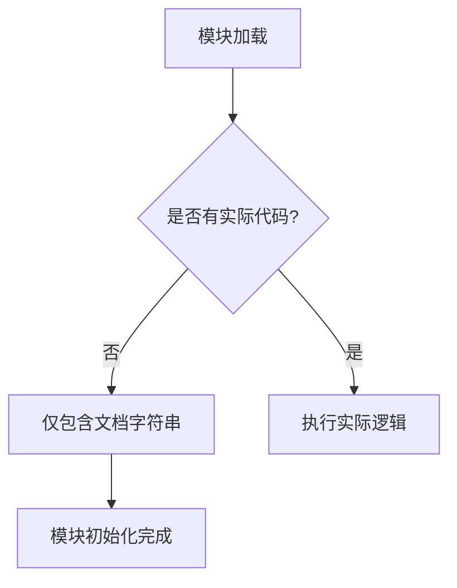

# `graphrag\packages\graphrag\graphrag\index\typing\__init__.py` 详细设计文档

该文件是GraphRAG项目的根类型定义模块，仅包含版权声明和模块级文档字符串，用于标识项目名称和许可证信息，不包含实际的类型定义、类或函数实现。

## 整体流程



## 类结构

```

```

## 全局变量及字段


    

## 全局函数及方法


## 关键组件


### 一段话描述

该文件是GraphRAG项目的根类型定义模块，作为类型系统的入口点，目前仅包含版权声明和模块级文档字符串，尚未定义任何实际的类型、类或函数。

### 文件的整体运行流程

该文件作为Python模块被导入时，仅执行模块级别的文档字符串初始化，不涉及任何运行时逻辑或业务流程。

### 类的详细信息

该文件未定义任何类。

### 全局变量和全局函数

该文件未定义任何全局变量或全局函数。

### 关键组件信息

- **模块文档字符串**: 作为GraphRAG根类型定义的标识，表明这是类型系统的入口模块

### 潜在的技术债务或优化空间

- **未完成的类型定义**: 该模块作为"Root typings"但缺少实际的类型定义，应补充基础类型别名、接口定义或类型导出
- **缺少类型注解**: 建议添加详细的类型注解以支持静态类型检查
- **文档不完整**: 模块文档字符串过于简略，建议补充模块用途、版本信息和主要导出类型的说明

### 其它项目

- **设计目标与约束**: 从模块名称推断，该模块应定义GraphRAG的核心类型系统，为其他模块提供类型支持
- **错误处理与异常设计**: 当前文件不涉及运行时错误处理
- **数据流与状态机**: 不适用
- **外部依赖与接口契约**: 当前无外部依赖或接口定义


## 问题及建议


### 已知问题

-   该文件仅包含版权声明和文档字符串，缺少实际的类型定义内容，作为"根类型"文件应包含GraphRAG的核心类型声明
-   文件命名与内容不匹配：文件名暗示应为项目提供根类型导出，但实际上没有任何导出内容
-   缺少模块级别的基础类型定义，如通用接口、枚举、联合类型等

### 优化建议

-   补充GraphRAG项目的核心类型定义，如实体类型、关系类型、图查询结果类型等基础接口
-   考虑添加统一的类型导出语句，形成清晰的公共API边界
-   如果当前仅为占位文件，建议在文档中明确说明其用途或添加TODO注释说明后续填充计划
-   可考虑添加版本号或类型兼容性标记，以便后续类型演进管理


## 其它


### 设计目标与约束

本文件作为GraphRAG项目的根类型定义模块，旨在为整个项目提供基础类型支持和统一的类型约束。设计目标包括：1）建立GraphRAG核心数据结构的类型体系；2）确保类型安全性和IDE友好性；3）支持TypeScript/JavaScript生态系统的类型推断。约束条件包括：需兼容Python 3.8+类型注解语法，遵循PEP 484类型提示规范，支持静态类型检查工具（如mypy）。

### 错误处理与异常设计

由于当前文件为类型根模块，不包含运行时逻辑，暂不存在运行时异常处理需求。未来若扩展类型定义时，建议采用自定义异常类继承自Exception基类，异常命名规范为`{模块名}Error`，如`GraphRAGTypeError`。类型相关的错误应在类型检查阶段由静态分析工具捕获。

### 数据流与状态机

当前文件作为静态类型声明文件，不涉及运行时数据流处理。在GraphRAG完整架构中，数据流通常为：输入数据 → 解析层 → 类型验证 → 图谱构建 → 查询处理。状态机相关类型（如GraphState、QueryState）应在后续子模块中定义，通过本文件的根类型进行引用和组合。

### 外部依赖与接口契约

当前文件无外部运行时依赖，仅依赖Python标准库`typing`模块。接口契约方面，本模块导出的所有类型应保持向后兼容，任何类型修改需遵循语义版本控制规范。公开API包括：所有以`__all__`导出的类型定义，以及模块级文档字符串描述的公共接口。

### 版本兼容性

本模块遵循GraphRAG主项目的版本管理策略。当前版本对应GraphRAG v0.x系列，需兼容Python 3.8及以上版本。类型注解使用`typing`模块而非内置类型语法以确保广泛兼容性。若需支持Python 3.10+的联合类型语法，需添加版本条件判断或使用`__future__`导入。

### 安全考虑

作为纯类型定义文件，本模块不涉及用户输入处理、数据加密或认证授权等安全敏感逻辑。类型定义本身不执行任何操作，无安全风险。后续扩展时若涉及敏感数据类型（如API密钥、凭据类型），应使用`Annotated`类型添加安全标注注释。

### 测试策略

由于类型定义文件不包含可执行代码，传统单元测试不适用。建议采用以下测试策略：1）使用mypy、pyright等静态类型检查工具进行类型验证；2）创建类型用例测试文件验证复杂类型定义正确性；3）在CI/CD流程中集成类型检查步骤；4）使用`typing.assert_type`（Python 3.13+）进行运行时类型断言测试。

### 配置说明

本模块无需运行时配置。类型检查器配置（如mypy.ini、pyrightconfig.json）应在项目根目录单独管理。建议配置项包括：strict模式启用、泛型严格检查、导入精度设置等。类型定义的选择应可通过项目配置进行覆盖时，应在配置模块中定义相应的类型别名。

### 使用示例

```python
# 导入根类型
from graphrag.typings import GraphNode, GraphEdge, GraphQuery

# 使用类型注解
def process_graph(nodes: list[GraphNode], edges: list[GraphEdge]) -> GraphQuery:
    """处理图数据并返回查询对象"""
    ...
```

### 术语表

| 术语 | 定义 |
|------|------|
| GraphRAG | 基于图的检索增强生成系统 |
| Root typings | 根类型定义，项目类型系统的入口点 |
| PEP 484 | Python类型提示规范 |
| TypeScript | JavaScript的超集，支持静态类型 |

### 附录

参考资源：1）PEP 484 - Type Hints：https://peps.python.org/pep-0484/；2）mypy类型检查文档：https://mypy.readthedocs.io/；3）GraphRAG项目主页：https://github.com/microsoft/graphrag。类型定义文件结构遵循行业最佳实践，参考了Microsoft TypeScript标准库的组织方式。


    