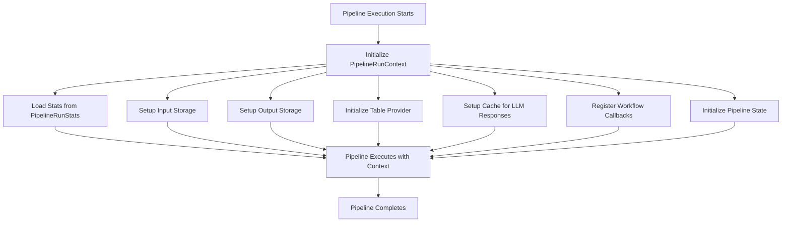

# `graphrag\packages\graphrag\graphrag\index\typing\context.py` 详细设计文档

A data class that provides the runtime context for pipeline runs, including storage, caching, callbacks, and state management.

## 整体流程



## 类结构

```
PipelineRunContext (dataclass)
└── Fields:
    ├── stats: PipelineRunStats
    ├── input_storage: Storage
    ├── output_storage: Storage
    ├── output_table_provider: TableProvider
    ├── previous_table_provider: TableProvider | None
    ├── cache: Cache
    ├── callbacks: WorkflowCallbacks
    └── state: PipelineState
```

## 全局变量及字段


### `PipelineRunContext.stats`
    
Runtime statistics for the pipeline run

类型：`PipelineRunStats`
    


### `PipelineRunContext.input_storage`
    
Storage for reading input documents

类型：`Storage`
    


### `PipelineRunContext.output_storage`
    
Long-term storage for pipeline verbs to use. Items written here will be written to the storage provider.

类型：`Storage`
    


### `PipelineRunContext.output_table_provider`
    
Table provider for reading and writing output tables

类型：`TableProvider`
    


### `PipelineRunContext.previous_table_provider`
    
Table provider for reading previous pipeline run when running in update mode

类型：`TableProvider | None`
    


### `PipelineRunContext.cache`
    
Cache instance for reading previous LLM responses

类型：`Cache`
    


### `PipelineRunContext.callbacks`
    
Callbacks to be called during the pipeline run

类型：`WorkflowCallbacks`
    


### `PipelineRunContext.state`
    
Arbitrary property bag for runtime state, persistent pre-computes, or experimental features

类型：`PipelineState`
    
    

## 全局函数及方法


## 关键组件


### PipelineRunContext 数据类

提供管道运行时的上下文环境，封装了存储、表提供器、缓存、回调和状态管理等核心基础设施组件。

### Storage 存储组件

input_storage 和 output_storage 分别负责输入文档的读取和管道动词输出结果的持久化，是数据流转的核心载体。

### TableProvider 表提供器组件

output_table_provider 和 previous_table_provider 支持输出表的读写操作，并在更新模式下提供前一次运行数据的访问能力。

### Cache 缓存实例

用于读取之前LLM的响应缓存，避免重复计算，提升管道执行效率。

### WorkflowCallbacks 回调系统

在管道运行过程中被调用，支持扩展点和插件化的事件处理机制。

### PipelineState 状态管理

作为运行时属性的容器，可存储持久化的预计算结果或实验性功能的状态信息。

### PipelineRunStats 统计信息

记录管道运行的统计指标，用于监控和性能分析。


## 问题及建议


### 已知问题

-   **类型注解风格不一致**：`previous_table_provider` 使用了 Python 3.10+ 的 `|` 联合类型语法 `TableProvider | None`，而其他字段使用 `typing` 模块的 `Optional`，风格不统一，可能导致与旧版本 Python 不兼容。
-   **缺少字段验证机制**：dataclass 没有实现 `__post_init__` 方法对字段值进行有效性检查，例如 `input_storage` 和 `output_storage` 不能为 `None` 等。
-   **缺乏不可变性保证**：作为流水线运行时的上下文对象，运行期间不应被意外修改，但当前未设置 `frozen=True`，存在被意外修改的风险。
-   **文档不完整**：部分字段（如 `stats`、`callbacks`）缺少描述性注释，而其他字段有 `"..."` 形式的字符串注释，文档风格不统一。
-   **可选字段处理不够明确**：`previous_table_provider` 允许为 `None`，但没有明确说明在什么场景下为 `None`，以及对业务流程的影响。

### 优化建议

-   **统一类型注解风格**：统一使用 `Optional[TableProvider]` 或统一使用 `TableProvider | None`，并确保与项目支持的 Python 版本兼容。
-   **添加不可变性**：如果该上下文对象在流水线运行期间不应被修改，考虑添加 `frozen=True` 参数到 `@dataclass` 装饰器。
-   **补充字段验证**：在 `__post_init__` 方法中添加必要的验证逻辑，确保关键字段（如 `storage` 实例）非空且有效。
-   **完善文档注释**：为所有字段添加统一的描述性注释，明确各字段的用途、约束条件和默认值。
-   **明确可选字段语义**：为 `previous_table_provider` 添加更明确的文档说明，解释 `None` 值的业务含义（如非更新模式）。
-   **考虑使用 Pydantic**：如果需要更强大的验证和类型转换功能，可考虑将 `@dataclass` 替换为 Pydantic 的 `BaseModel`。

## 其它


### 设计目标与约束

**设计目标**：为 GraphRAG Pipeline 提供统一的运行时上下文环境，封装所有 pipeline 执行所需的依赖资源（存储、表提供者、缓存、回调等），实现关注点分离，使 pipeline 各阶段能够无状态地访问所需资源。

**约束**：
- 作为数据类（dataclass），设计为不可变或轻量级可变对象
- 所有字段必须在 Pipeline 初始化时提供，不支持延迟初始化
- 必须与 GraphRAG 的存储、缓存、工作流回调系统兼容

### 错误处理与异常设计

**初始化阶段**：
- 各依赖项（Storage、Cache、TableProvider 等）若为 None 应在初始化时抛出 TypeError 或 ValueError
- 建议在 Pipeline 构造阶段进行依赖项有效性验证

**运行时阶段**：
- 上下文对象本身不执行复杂逻辑，异常由调用的方法（如 callbacks、cache 操作）抛出
- 建议在调用 callbacks 前进行空值检查，防止空指针异常

### 数据流与状态机

**数据输入**：
- input_storage：读取原始输入文档
- previous_table_provider（可选）：读取上一次 pipeline 运行的输出（更新模式）

**数据处理**：
- stats：收集和统计各阶段执行指标
- state：存储运行时状态和预计算结果
- callbacks：触发各阶段的钩子函数

**数据输出**：
- output_storage：持久化 pipeline verb 的输出
- output_table_provider：读写结构化输出表

### 外部依赖与接口契约

**核心依赖**：
- `graphrag_cache.Cache`：LLM 响应缓存接口
- `graphrag.callbacks.workflow_callbacks.WorkflowCallbacks`：工作流回调接口
- `graphrag.index.typing.state.PipelineState`：状态容器接口
- `graphrag.index.typing.stats.PipelineRunStats`：统计信息接口
- `graphrag_storage.Storage`：存储抽象接口
- `graphrag_storage.TableProvider`：表提供抽象接口

### 生命周期管理

**创建时机**：在 Pipeline 开始执行前由 Pipeline 引擎构造
**使用周期**：贯穿整个 Pipeline 执行过程
**销毁时机**：Pipeline 执行完成后由垃圾回收机制回收
**线程安全性**：非线程安全，应在单线程环境下使用

### 序列化与反序列化

**支持情况**：dataclass 天生支持 dataclasses.asdict() 和 copy.deepcopy()，但由于包含复杂对象（Storage、Cache 等），自定义序列化需由各依赖类实现

### 性能考量

- 作为数据容器，无明显性能开销
- 引用传递避免大量数据拷贝
- 建议避免在 context 中存储大型中间结果

### 使用示例

```python
# 创建 PipelineRunContext
context = PipelineRunContext(
    stats=PipelineRunStats(),
    input_storage=SomeStorage(),
    output_storage=SomeStorage(),
    output_table_provider=SomeTableProvider(),
    previous_table_provider=None,
    cache=SomeCache(),
    callbacks=WorkflowCallbacks(),
    state=PipelineState()
)
```

### 测试策略

**单元测试**：
- 测试初始化和各字段赋值
- 测试 dataclass 装饰器的默认行为（eq、repr 等）

**集成测试**：
- 测试与各依赖接口的集成
- 测试在完整 Pipeline 流程中的使用

### 版本历史与兼容性

- 当前版本：1.0（基于 GraphRAG 2024）
- 兼容性：作为内部组件，无严格版本兼容性保证
- 变更历史：初始版本

    