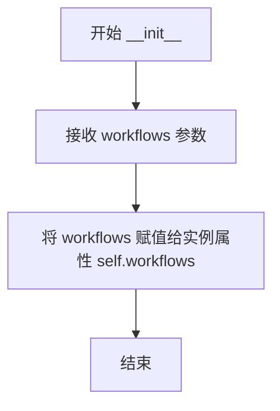
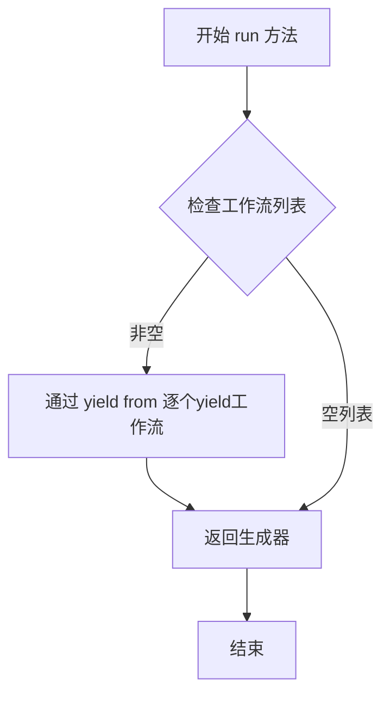
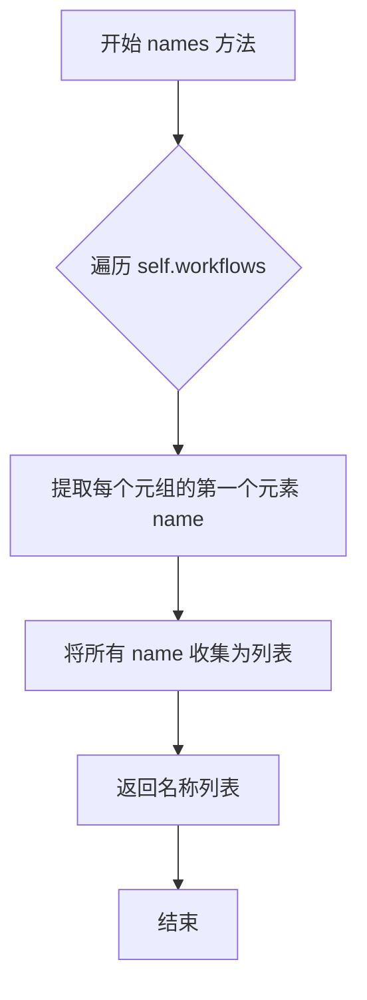
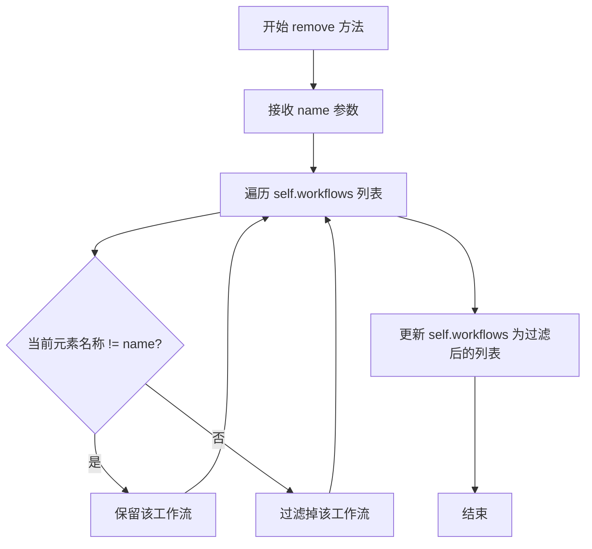

# `graphrag\packages\graphrag\graphrag\index\typing\pipeline.py` 详细设计文档

这是一个工作流管道封装类，负责管理和执行一系列工作流（Workflows），提供运行、获取名称和移除工作流的功能。

## 整体流程

```mermaid
graph TD
    A[开始] --> B[创建Pipeline实例]
B --> C{调用run方法?}
C -->|是| D[yield from workflows]
D --> E[返回Generator<Workflow>]
C --> F{调用names方法?}
F -->|是| G[提取所有workflow名称]
G --> H[返回list[str>]
C --> I{调用remove方法?}
I -->|是| J[根据名称过滤workflows]
J --> K[更新self.workflows列表]
```

## 类结构

```
Pipeline (工作流管道类)
```

## 全局变量及字段


### `Pipeline.workflows`
    
存储管道中工作流列表的实例变量

类型：`list[Workflow]`
    
    

## 全局函数及方法


### `Pipeline.__init__`

这是 Pipeline 类的构造函数，用于初始化一个包含工作流列表的 Pipeline 实例。

参数：

- `workflows`：`list[Workflow]`，要封装在管道中的工作流列表

返回值：`None`，构造函数不返回值，仅初始化实例属性

#### 流程图



#### 带注释源码

```python
def __init__(self, workflows: list[Workflow]):
    """初始化 Pipeline 实例。
    
    参数:
        workflows: 一个包含 Workflow 对象的列表，用于定义管道中要执行的工作流。
    
    返回值:
        无（None），__init__ 方法不返回值。
    """
    self.workflows = workflows  # 将传入的工作流列表存储为实例属性
```


### `Pipeline.run`

返回管道的所有工作流的生成器，通过yield from语法直接将工作流列表转发为生成器。

参数：

- 无

返回值：`Generator[Workflow]` ，一个遍历管道中所有工作流的生成器对象

#### 流程图



#### 带注释源码

```python
def run(self) -> Generator[Workflow]:
    """Return a Generator over the pipeline workflows."""
    # 使用 yield from 语法糖直接将 self.workflows 列表中的每个 Workflow 对象逐个 yield
    # 这种方式比在循环中显式使用 yield 更简洁高效
    # 返回的是一个生成器对象，可迭代遍历所有工作流
    yield from self.workflows
```


### `Pipeline.names`

返回管道中所有工作流的名称列表。

参数： 无

返回值：`list[str]`，返回工作流名称的列表

#### 流程图



#### 带注释源码

```python
def names(self) -> list[str]:
    """Return the names of the workflows in the pipeline."""
    # 使用列表推导式遍历 workflows 列表
    # self.workflows 存储的是元组 (name, Workflow) 的列表
    # 通过解包获取每个元组的第一个元素（即 name）
    return [name for name, _ in self.workflows]
```


### `Pipeline.remove`

从管道中根据名称移除指定的工作流。

参数：

- `name`：`str`，要移除的工作流名称

返回值：`None`，无返回值（该方法直接修改实例的 `workflows` 属性）

#### 流程图



#### 带注释源码

```python
def remove(self, name: str) -> None:
    """Remove a workflow from the pipeline by name.
    
    通过名称从管道中移除指定的工作流。
    使用列表推导式过滤掉名称匹配的工作流。
    
    Args:
        name: 要移除的工作流的名称
        
    Returns:
        None: 该方法直接修改实例属性，无返回值
    """
    # 使用列表推导式过滤 workflows 列表
    # 保留所有名称不等于目标 name 的工作流
    # 这里 w 是一个元组 (name, workflow)，w[0] 是工作流的名称
    self.workflows = [w for w in self.workflows if w[0] != name]
```

## 关键组件


### Pipeline 类

封装工作流执行的管道类，负责管理一组工作流并提供遍历、查询和移除功能。

### workflows 字段

存储工作流列表的实例变量，类型为 list[Workflow]，用于保存管道中所有工作流。

### run 方法

返回管道中所有工作流的生成器，支持惰性加载工作流。

### names 方法

返回管道中所有工作流的名称列表，遍历工作流提取名称。

### remove 方法

根据给定名称从管道中移除指定工作流，更新工作流列表。


## 问题及建议


### 已知问题

- **类型不明确**：`Workflow` 类型未导入或定义，且代码中假设其为元组 `(name, workflow)` 但缺乏明确的类型注解，导致静态类型检查困难
- **输入无验证**：`__init__` 方法未对 `workflows` 参数进行空列表或类型校验，可能导致后续方法运行时出现难以追踪的错误
- **索引访问风险**：`names()` 和 `remove()` 方法中使用 `w[0]` 和 `w[1]` 索引访问，假设 `Workflow` 为元组结构，若结构不符会触发运行时异常
- **功能局限**：`run()` 方法返回 `Generator[Workflow]` 类型，但实际只是简单透传，缺乏对工作流执行状态、进度或结果的处理能力
- **可观测性缺失**：缺少日志记录、错误处理和异常抛出机制，难以追踪执行过程中的问题

### 优化建议

- 导入并明确定义 `Workflow` 类型（如 `list[tuple[str, Any]]` 或自定义 dataclass），添加类型注解
- 在 `__init__` 中添加参数校验：`if not isinstance(workflows, list): raise TypeError(...)`
- 考虑添加 `__iter__` 方法使类可直接迭代，添加 `__len__` 方法支持 `len(pipeline)` 操作
- 增强 `remove()` 方法的返回值，标记是否成功移除或抛出 KeyError
- 添加错误处理和日志记录，提升可观测性
- 如需更复杂的流水线功能，考虑添加工作流执行结果的状态管理

## 其它


### 设计目标与约束

该Pipeline类的核心设计目标是提供一个轻量级的工作流管理容器，用于封装和运行多个工作流。设计约束包括：仅支持线性顺序执行工作流，不支持并行执行；工作流以列表形式存储，遵循先进先出(FIFO)的原则；依赖外部导入的Workflow类型定义，不负责工作流的实际创建和初始化。

### 错误处理与异常设计

当前代码未实现显式的错误处理机制。建议补充以下异常处理场景：1) 在remove方法中当指定name不存在时，可选择抛出KeyError或静默处理；2) 在run方法迭代过程中，若单个工作流执行失败，应捕获异常并可选择继续执行后续工作流或中断执行；3) __init__方法应验证workflows参数类型为list，避免传入None或非list类型导致的运行时错误。

### 数据流与状态机

Pipeline类本身不维护复杂的状态机，其状态流转较为简单：初始化状态( workflows已赋值) -> 运行状态(run方法被调用，生成器活跃) -> 完成状态(所有工作流已迭代)。数据流方向为：外部创建Workflow列表 -> 传入Pipeline构造函数 -> Pipeline内部存储引用 -> 通过run方法逐个产出工作流供消费 -> names方法提供元数据查询 -> remove方法修改内部状态。

### 外部依赖与接口契约

该模块依赖graphrag.index.typing.workflow模块中的Workflow类型定义。Workflow被假定为Tuple[str, Any]形式的元组，其中第一个元素为工作流名称(str类型)，第二个元素为工作流对象。接口契约包括：__init__接受list[Workflow]类型参数；run方法返回Generator[Workflow]类型；names方法返回list[str]类型；remove方法接受str类型的name参数且无返回值。

### 使用示例与典型场景

典型使用场景包括：1) 批量执行多个数据处理工作流；2) 动态构建和修改工作流管道；3) 查询已注册工作流列表。示例代码：创建Pipeline实例后，可通过for workflow in pipeline.run():来遍历执行所有工作流；通过pipeline.names()获取所有工作流名称用于日志记录或调试；通过pipeline.remove('workflow_name')动态移除特定工作流。

### 性能考虑与优化空间

当前实现为轻量级封装，性能开销主要来自workflows列表的迭代和过滤操作。优化建议：1) 若工作流数量较大，remove方法每次调用都会创建新列表，可考虑使用链表或保持删除标记的方式优化；2) names方法每次调用都重新生成列表，若频繁调用可考虑缓存结果；3) run方法返回生成器而非列表，符合惰性计算原则，有利于处理大量工作流场景。

### 线程安全性分析

该类非线程安全。当多个线程同时修改workflows列表(如调用remove方法)或迭代时，可能导致数据竞争和不确定行为。若需要在多线程环境中使用，建议添加线程锁(如threading.Lock)保护共享状态，或提供线程安全的只读访问接口。

### 扩展性设计建议

未来扩展方向可包括：1) 添加工作流优先级支持，实现带优先级的调度；2) 支持条件执行，根据前置工作流结果决定是否执行后续工作流；3) 添加工作流依赖管理，构建有向无环图(DAG)结构；4) 支持插件式架构，动态注册和加载工作流；5) 添加执行结果缓存和错误恢复机制。

    