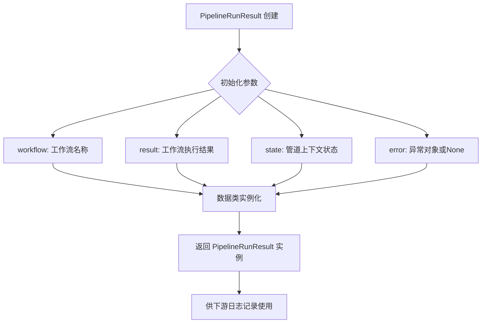
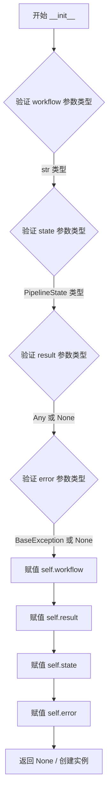
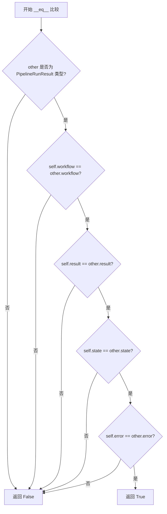

# `graphrag\packages\graphrag\graphrag\index\typing\pipeline_run_result.py` 详细设计文档

这是一个数据类模块，定义了 PipelineRunResult 类，用于封装工作流执行的结果、状态和错误信息，作为 graphrag 索引管道中各工作流执行的返回值容器。

## 整体流程



## 类结构

```
PipelineRunResult (@dataclass)
└── 数据容器类 (无继承关系)
```

## 全局变量及字段


### `PipelineRunResult.workflow`
    
工作流名称

类型：`str`
    


### `PipelineRunResult.result`
    
工作流函数的结果

类型：`Any | None`
    


### `PipelineRunResult.state`
    
管道上下文状态对象

类型：`PipelineState`
    


### `PipelineRunResult.error`
    
异常对象

类型：`BaseException | None`
    
    

## 全局函数及方法


### `PipelineRunResult.__init__`

这是 `PipelineRunResult` 类的初始化方法（由 `@dataclass` 装饰器自动生成），用于创建管道运行结果对象，封装工作流名称、执行结果、状态和错误信息。

参数：

- `self`：自动传入的实例对象
- `workflow`：`str`，执行的工作流名称
- `result`：`Any | None`，工作流函数的执行结果，仅用于下游日志记录
- `state`：`PipelineState`，管道上下文状态对象
- `error`：`BaseException | None`，执行过程中捕获的异常（若无异常则为 None）

返回值：`None`，`__init__` 方法不返回值，仅初始化对象状态

#### 流程图



#### 带注释源码

```python
def __init__(self, workflow: str, result: Any | None, state: PipelineState, error: BaseException | None) -> None:
    """
    PipelineRunResult 类的初始化方法（由 @dataclass 自动生成）。
    
    参数:
        workflow: str - 执行的工作流名称
        result: Any | None - 工作流函数的执行结果
        state: PipelineState - 管道上下文状态对象
        error: BaseException | None - 执行过程中的异常（无异常为 None）
    
    返回:
        None - __init__ 方法不返回值
    """
    # 赋值工作流名称字段
    self.workflow: str = workflow
    
    # 赋值工作流执行结果字段（可为任意类型或 None）
    self.result: Any | None = result
    
    # 赋值管道状态对象字段
    self.state: PipelineState = state
    
    # 赋值错误信息字段（可为 BaseException 子类或 None）
    self.error: BaseException | None = error
```


### `PipelineRunResult.__repr__` (自动生成)

返回该数据类的字符串表示形式，包含所有字段的名称和值，用于调试和日志输出。

参数：

- `self`：隐式参数，`PipelineRunResult` 类型，表示当前实例

返回值：`str`，表示该 PipelineRunResult 对象的字符串表示

#### 流程图

```mermaid
flowchart TD
    A[开始 __repr__] --> B[获取 self.workflow 字段值]
    B --> C[获取 self.result 字段值]
    C --> D[获取 self.state 字段值]
    D --> E[获取 self.error 字段值]
    E --> F{各字段值非 None?}
    F -->|是| G[格式化字段名为 'workflow=值']
    F -->|否| H[格式化字段名为 'workflow=None']
    G --> I[类似处理 result, state, error]
    H --> I
    I --> J[拼接: PipelineRunResult(workflow=..., result=..., state=..., error=...)]
    J --> K[返回拼接后的字符串]
```

#### 带注释源码

```python
def __repr__(self) -> str:
    """自动生成的 __repr__ 方法，由 dataclass 装饰器生成。
    
    返回包含所有字段及其值的字符串表示。
    
    Returns:
        str: 格式为 'PipelineRunResult(workflow=..., result=..., state=..., error=...)' 的字符串
    """
    return (
        f"PipelineRunResult("
        f"workflow={self.workflow!r}, "
        f"result={self.result!r}, "
        f"state={self.state!r}, "
        f"error={self.error!r})"
    )
```


### `PipelineRunResult.__eq__`

自动生成的相等性比较方法，用于比较两个 PipelineRunResult 对象是否相等。由于 PipelineRunResult 是使用 @dataclass 装饰器定义的，Python 会自动生成此方法，该方法会比较所有字段（workflow、result、state、error）的值来确定两个对象是否相等。

参数：

- `self`：`PipelineRunResult`，当前对象（隐式参数），进行比较的左侧对象
- `other`：`Any`，要比较的右侧对象，可以是任何类型，通常应该是 PipelineRunResult 类型

返回值：`bool`，如果两个对象的所有字段（workflow、result、state、error）都相等则返回 True，否则返回 False

#### 流程图



#### 带注释源码

```python
def __eq__(self, other: Any) -> bool:
    """比较两个 PipelineRunResult 对象是否相等。
    
    这是由 @dataclass 装饰器自动生成的方法。
    它会比较两个对象的所有字段：workflow、result、state、error。
    
    参数:
        self: 当前 PipelineRunResult 实例
        other: 要比较的其他对象，任意类型
    
    返回值:
        bool: 如果所有字段都相等返回 True，否则返回 False
    """
    # Python dataclass 自动生成的相等性比较逻辑
    # 会依次比较 workflow、result、state、error 四个字段
    if not isinstance(other, PipelineRunResult):
        return NotImplemented
    
    # 比较所有四个字段
    return (self.workflow == other.workflow and 
            self.result == other.result and 
            self.state == other.state and 
            self.error == other.error)
```

#### 说明

由于 `PipelineRunResult` 使用了 `@dataclass` 装饰器且未指定 `eq=False`，Python 自动生成了 `__eq__` 方法。需要注意的是：

1. **类型检查**：如果 `other` 不是 `PipelineRunResult` 类型，方法返回 `NotImplemented` 而非 `False`，这是 Python 的标准做法，允许其他类型处理比较逻辑
2. **字段比较顺序**：比较按照字段定义顺序进行（workflow → result → state → error），一旦发现不相等就会返回 False
3. **比较行为**：使用 Python 的 `==` 运算符比较每个字段，这意味着对于嵌套对象（如 state 和 error），会比较它们的 `__eq__` 方法


## 关键组件


### PipelineRunResult 数据类

用于封装管道执行的结果数据容器，包含工作流名称、执行结果、管道状态和错误信息。

### PipelineState 状态管理

 Ongoing pipeline context state object，负责在管道执行过程中维护和传递状态信息。

### 错误处理机制

 BaseException | None 类型的 error 字段，用于捕获和传递工作流执行过程中发生的异常。


## 问题及建议


### 已知问题

-   **类型注解兼容性**：使用 `Any | None` 和 `BaseException | None` 语法需要 Python 3.10+，限制了代码在旧版本 Python 环境中的兼容性
-   **类型过于宽泛**：`result: Any | None` 使用 `Any` 类型导致类型检查失效，无法为调用者提供有意义的类型提示，降低了代码的可维护性和 IDE 智能提示能力
-   **缺少字段验证**：没有实现 `__post_init__` 方法对字段值进行验证，例如 `error` 和 `result` 不应同时存在（成功时 error 应为 None）
-   **非不可变对象**：作为流水线运行结果数据类，未使用 `frozen=True` 声明为不可变对象，可能在多线程或并发场景下导致状态意外修改
-   **文档注释缺失**：`error` 字段缺少文档注释（docstring），调用者无法明确该字段的含义和使用方式
-   **混合类型设计**：`result` 字段设计为可以是任意类型，但文档又期望工作流函数将官方输出写入存储，这种混合设计可能导致职责不清晰

### 优化建议

-   **添加类型别名**：考虑为 `result` 字段定义更具体的类型约束，使用泛型或类型别名替代 `Any`，提升类型安全性
-   **启用不可变性**：添加 `frozen=True` 参数到 `@dataclass` 装饰器，使实例不可变，适合作为流水线结果传递
-   **补充文档**：为 `error` 字段添加 docstring，说明何时会有值以及错误类型
-   **添加验证逻辑**：实现 `__post_init__` 方法，验证 `result` 和 `error` 字段的互斥关系，确保数据一致性
-   **添加默认值**：考虑为 `error` 字段提供默认值为 `None`，简化实例创建过程
-   **使用兼容语法**：如需兼容 Python 3.9，可改用 `Optional[Any]` 语法并从 `typing` 导入

## 其它


### 设计目标与约束

该类旨在为管道执行提供标准化的结果封装，包含工作流名称、执行结果、状态和错误信息。其约束包括：result字段为Any类型，仅用于日志记录，不作为官方输出；官方输出需由各工作流函数写入提供的存储中。

### 错误处理与异常设计

error字段类型为BaseException | None，用于捕获工作流执行过程中可能出现的任何异常。调用方需检查error字段是否为None来判断工作流是否成功执行，若非None则需要进行相应的错误处理和日志记录。

### 数据流与状态机

该类作为数据传递的载体，workflow字段标识当前工作流名称，result字段承载工作流函数的执行结果（可选），state字段传递管道上下文状态对象供工作流函数使用，error字段报告执行异常。数据流方向为：输入（workflow name, state）-> 工作流执行 -> 输出（result, state更新, error）

### 外部依赖与接口契约

该类依赖from graphrag.index.typing.state导入的PipelineState类型，需确保PipelineState类已正确定义。使用方需保证state参数为有效的PipelineState实例，result可为任意类型或None。

### 性能考虑

该类使用@dataclass装饰器，具有较低的对象创建开销。result字段使用Any类型避免了类型转换开销，但需注意避免在result中存储过大的对象以免影响性能。

### 序列化与反序列化

由于使用dataclass，可直接利用dataclasses.asdict()方法进行字典转换。后续可能需要考虑JSON序列化支持，建议添加to_dict()方法和from_dict()类方法以支持更灵活的序列化需求。

### 使用示例

```python
# 创建PipelineRunResult实例
result = PipelineRunResult(
    workflow="example_workflow",
    result={"key": "value"},
    state=some_pipeline_state,
    error=None
)
```

### 扩展性考虑

当前设计已预留扩展字段的能力，可通过继承或修改dataclass添加新字段。建议未来考虑添加timestamp字段记录执行时间、duration字段记录执行时长等扩展需求。

### 线程安全性

该类本身为不可变数据类（默认），但包含的可变对象（如state）需注意线程安全问题。多个线程同时访问同一个PipelineRunResult实例时，应确保state对象的线程安全或使用副本。

### 测试策略

建议编写单元测试验证：1) 正常创建带所有参数的实例；2) error为None和不为None的两种情况；3) result为None的情况；4) 与PipelineState的集成测试；5) 类型检查测试。

    