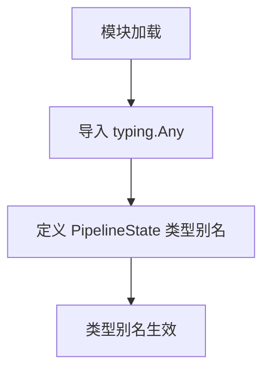

# `graphrag\packages\graphrag\graphrag\index\typing\state.py` 详细设计文档

定义管道状态类型的类型别名，用于在管道中传递和存储任意键值对数据。

## 整体流程



## 类结构

```
该文件为纯类型定义模块，无类层次结构
```

## 全局变量及字段


### `PipelineState`
    
A type alias representing the state dictionary for a pipeline, storing key-value pairs of any type.

类型：`dict[Any, Any]`
    


    

## 全局函数及方法


## 关键组件


### 核心功能概述

该代码定义了一个用于表示管道状态（Pipeline State）的类型别名，提供了类型安全的字典结构来存储任意键值对数据，是Microsoft管道系统的基础类型定义之一。

### 文件整体运行流程

该模块为纯类型定义文件，不包含任何可执行逻辑。其运行流程仅涉及Python模块导入时的类型检查阶段，PipelineState作为dict[Any, Any]的别名，在类型检查时被解析为字典类型。

### 类详细信息

本文件不包含任何类定义。

### 全局变量和全局函数详细信息

#### PipelineState

- **名称**: PipelineState
- **类型**: dict[Any, Any]
- **描述**: 管道状态类型别名，用于表示包含任意键值对的字典结构，支持存储任何类型的配置、状态数据或中间结果。

```python
# 源码:
PipelineState = dict[Any, Any]
```

### 关键组件信息

#### PipelineState 类型别名

用于在管道系统中传递和存储状态数据的通用容器，支持动态键值存储，是管道各阶段间数据传递的基础类型。

### 潜在的技术债务或优化空间

1. **类型安全不足**: 使用dict[Any, Any]过于宽松，无法在编译期提供有意义的类型检查，建议根据实际使用场景定义更具体的类型约束。
2. **缺乏文档说明**: 仅有一个模块级docstring，未说明PipelineState的具体用途、使用场景及预期数据结构。
3. **无验证机制**: 未提供状态验证逻辑，可能导致非法状态数据在管道中传播。

### 其它项目

#### 设计目标与约束

- 目标：提供通用的管道状态数据结构，支持任意类型的数据存储
- 约束：保持类型别名的简洁性和通用性

#### 错误处理与异常设计

本模块不涉及运行时错误处理，类型错误将由类型检查器在静态分析阶段捕获。

#### 数据流与状态机

PipelineState作为数据容器，不直接参与状态机逻辑，仅提供状态数据的存储结构。

#### 外部依赖与接口契约

- 依赖：typing.Any（Python标准库）
- 接口契约：使用dict的標準接口，支持get、set、update等字典操作


## 问题及建议


### 已知问题

-   **类型安全缺失**：`dict[Any, Any]` 过于宽泛，完全失去静态类型检查的意义，任何键值对都可以添加，无法在编译期发现类型错误
-   **无文档注释**：缺少对 `PipelineState` 用途、预期键类型、值类型的说明
-   **可读性差**：类型别名没有提供任何语义信息，后续维护者无法理解状态的预期结构
-   **无验证机制**：状态字典没有运行时验证，非法数据可能在运行时才暴露问题

### 优化建议

-   使用 `TypedDict` 替代 `dict[Any, Any]`，为键值定义具体类型约束，提供结构化类型检查
-   为 `PipelineState` 添加 docstring，说明其用途、典型键名和值类型
-   考虑使用 `dataclass` 或 `Pydantic BaseModel` 封装状态，提供默认值和验证逻辑
-   若状态结构复杂，可拆分为多个子类型定义，增强类型语义
-   添加类型安全的工厂函数或状态构建器，统一状态初始化方式


## 其它


### 设计目标与约束

本代码定义了一个简单的类型别名PipelineState，用于表示管道状态的数据结构。设计目标是提供一个灵活、可扩展的字典类型来存储管道运行过程中的状态数据。约束方面，该类型定义为Any到Any的映射，牺牲了类型安全性和IDE自动补全能力，以换取最大的灵活性。

### 外部依赖与接口契约

本代码仅依赖Python标准库中的typing模块，具体为Any类型。无外部依赖，接口契约简单：PipelineState是一个dict类型，其键和值都可以是任意类型。任何需要存储任意结构化数据的模块都可以使用此类型。

### 使用示例与最佳实践

虽然本类型定义简单，但在实际使用中应注意：1) 尽量避免过度使用Any类型，建议在具体业务场景中定义具体的State类以提高类型安全性；2) 如果PipelineState用于跨模块传递数据，应在文档中明确其预期的键值结构；3) 考虑使用TypedDict或dataclass来替代dict，以获得更好的类型检查支持。

### 版本兼容性说明

本代码使用Python 3.9+的dict泛型语法（dict[Any, Any]），如果需要兼容更早版本的Python，应使用typing.Dict[Any, Any]。该类型别名本身不涉及任何版本特定的特性，保持了良好的向前向后兼容性。

### 测试策略

由于本代码仅为类型定义，不涉及运行时逻辑，因此无需编写单元测试。在实际项目中，建议：1) 使用mypy或pyright进行静态类型检查；2) 在使用PipelineState的模块中进行集成测试以验证类型兼容性；3) 可选地添加类型断言测试以确保类型定义符合预期。

### 扩展性考虑与未来建议

当前PipelineState定义为极其宽松的Any类型，存在以下扩展方向：1) 定义具体的State类或TypedDict来替代dict，提供更具体的类型约束；2) 引入泛型参数使类型更加精确，如PipelineState[T, V]；3) 考虑是否需要序列化支持（如to_json/from_json方法）；4) 评估是否需要添加不可变版本（如Mapping或frozendict）以防止意外的状态修改。

    