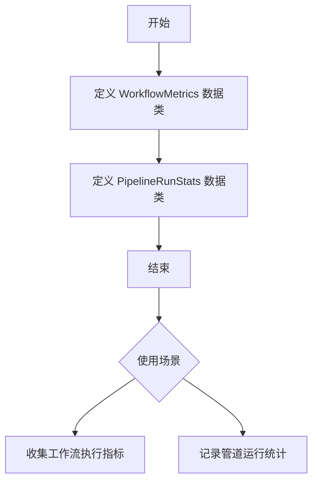
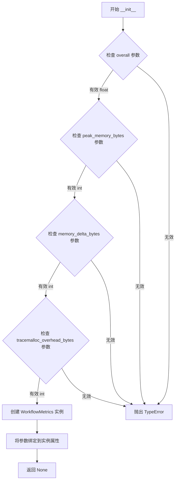
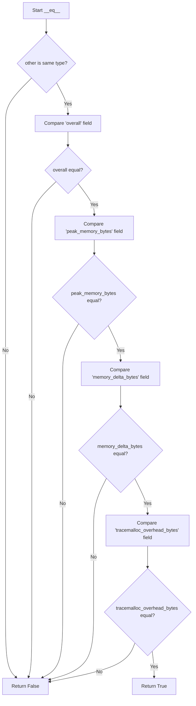
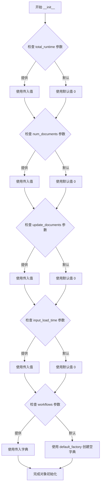
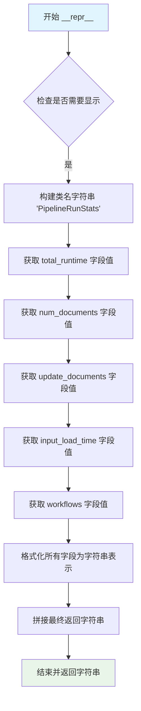
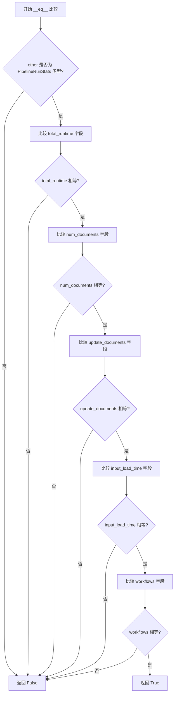

# `graphrag\packages\graphrag\graphrag\index\typing\stats.py` 详细设计文档

该代码定义了用于跟踪管道执行指标的数据类，包括单个工作流的运行时间、内存使用情况以及文档处理统计信息。

## 整体流程



## 类结构

```
dataclass (Python内置)
├── WorkflowMetrics
│   └── 用于存储单个工作流的执行指标
└── PipelineRunStats
    └── 用于存储整个管道的运行统计信息
```

## 全局变量及字段


### `WorkflowMetrics.overall`
    
墙上时钟时间（秒）

类型：`float`
    


### `WorkflowMetrics.peak_memory_bytes`
    
工作流执行期间的峰值内存使用（tracemalloc）

类型：`int`
    


### `WorkflowMetrics.memory_delta_bytes`
    
工作流完成后的净内存变化（tracemalloc）

类型：`int`
    


### `WorkflowMetrics.tracemalloc_overhead_bytes`
    
tracemalloc本身用于跟踪分配所消耗的内存

类型：`int`
    


### `PipelineRunStats.total_runtime`
    
表示总运行时间（默认0）

类型：`float`
    


### `PipelineRunStats.num_documents`
    
文档数量（默认0）

类型：`int`
    


### `PipelineRunStats.update_documents`
    
更新文档数量（默认0）

类型：`int`
    


### `PipelineRunStats.input_load_time`
    
表示输入加载时间（默认0）

类型：`float`
    


### `PipelineRunStats.workflows`
    
每个工作流执行的指标（默认空字典）

类型：`dict[str, WorkflowMetrics]`
    
    

## 全局函数及方法


### `WorkflowMetrics.__init__`

这是 `WorkflowMetrics` 类的初始化方法，用于创建一个包含工作流执行指标（运行时间、内存使用等）的数据对象。该方法由 Python 的 `@dataclass` 装饰器自动生成，接收四个参数并将其存储为实例属性。

参数：

- `overall`：`float`，Wall-clock time in seconds.（工作流执行的墙钟时间，单位秒）
- `peak_memory_bytes`：`int`，Peak memory usage during workflow execution (tracemalloc).（工作流执行期间的峰值内存使用量）
- `memory_delta_bytes`：`int`，Net memory change after workflow completion (tracemalloc).（工作流完成后的净内存变化量）
- `tracemalloc_overhead_bytes`：`int`，Memory used by tracemalloc itself for tracking allocations.（tracemalloc 自身用于跟踪内存分配的内存开销）

返回值：`None`，无显式返回值（dataclass 的 `__init__` 方法自动将参数绑定到实例属性）

#### 流程图



#### 带注释源码

```python
def __init__(self, 
             overall: float, 
             peak_memory_bytes: int, 
             memory_delta_bytes: int, 
             tracemalloc_overhead_bytes: int) -> None:
    """
    初始化 WorkflowMetrics 实例。
    
    此方法由 @dataclass 装饰器自动生成，将四个参数绑定到实例属性。
    
    Args:
        overall: Wall-clock time in seconds. 工作流执行的墙钟时间（秒）。
        peak_memory_bytes: Peak memory usage during workflow execution (tracemalloc).
                          工作流执行期间的峰值内存使用量（字节）。
        memory_delta_bytes: Net memory change after workflow completion (tracemalloc).
                           工作流完成后的净内存变化量（字节）。
        tracemalloc_overhead_bytes: Memory used by tracemalloc itself for tracking allocations.
                                   tracemalloc 自身用于跟踪内存分配的内存开销（字节）。
    
    Returns:
        None. dataclass 的 __init__ 方法不返回任何值，实例本身由 Python 自动返回。
    """
    # 将参数值绑定到实例属性
    # 这些赋值操作由 @dataclass 装饰器自动生成
    self.overall = overall
    self.peak_memory_bytes = peak_memory_bytes
    self.memory_delta_bytes = memory_delta_bytes
    self.tracemalloc_overhead_bytes = tracemalloc_overhead_bytes
```


### `WorkflowMetrics.__repr__`

该方法为 `WorkflowMetrics` 数据类自动生成的魔术方法，用于返回对象的字符串表示形式，便于调试和日志输出。

参数：

- `self`：`WorkflowMetrics`，方法的调用者，代表当前 `WorkflowMetrics` 实例本身

返回值：`str`，返回该对象的官方字符串表示，包含类名及所有字段的名称和值

#### 流程图

```mermaid
flowchart TD
    A[开始 __repr__] --> B{接收 self 实例}
    B --> C[获取 all 字段值]
    C --> D[获取 peak_memory_bytes 字段值]
    D --> E[获取 memory_delta_bytes 字段值]
    E --> F[获取 tracemalloc_overhead_bytes 字段值]
    F --> G[拼接字符串: 类名(字段1=值1, 字段2=值2, ...)]
    G --> H[返回格式化字符串]
    H --> I[结束]
```

#### 带注释源码

```python
def __repr__(self):
    """自动生成的魔术方法，返回对象的字符串表示。
    
    当打印 WorkflowMetrics 实例或使用 repr() 时自动调用，
    便于开发者调试和日志记录。
    
    Returns:
        str: 包含类名及所有字段名称和值的字符串，格式为：
             WorkflowMetrics(field1=value1, field2=value2, ...)
    """
    # dataclass 自动生成的 __repr__ 实现
    return (
        f"WorkflowMetrics("
        f"overall={self.overall!r}, "
        f"peak_memory_bytes={self.peak_memory_bytes!r}, "
        f"memory_delta_bytes={self.memory_delta_bytes!r}, "
        f"tracemalloc_overhead_bytes={self.tracemalloc_overhead_bytes!r})"
    )
    # !r 表示使用 repr() 格式化值，确保字符串带引号
```


### `WorkflowMetrics.__eq__`

该方法是 `WorkflowMetrics` 数据类自动生成的相等性比较方法，用于比较两个 `WorkflowMetrics` 对象的所有字段是否相等。

参数：

- `self`：`WorkflowMetrics`，当前实例
- `other`：`Any`，用于比较的对象

返回值：`bool`，如果两个对象的所有字段相等则返回 `True`，否则返回 `False`

#### 流程图



#### 带注释源码

```python
def __eq__(self, other: object) -> bool:
    """自动生成的相等性比较方法。
    
    比较当前 WorkflowMetrics 对象与另一个对象是否相等。
    只有当另一个对象也是 WorkflowMetrics 类型且所有字段值相同时才返回 True。
    
    参数:
        self: 当前 WorkflowMetrics 实例
        other: 要比较的对象
        
    返回:
        bool: 所有字段相等返回 True，否则返回 False
    """
    # 如果比较的是同一个对象，直接返回 True
    if self is other:
        return True
    
    # 如果类型不同，返回 False
    # 注意：不会进行子类兼容性检查
    if type(other) is not WorkflowMetrics:
        return False
    
    # 依次比较所有字段
    # 1. 比较 overall 字段（浮点数，执行时间）
    if self.overall != other.overall:
        return False
    
    # 2. 比较 peak_memory_bytes 字段（整数值，峰值内存）
    if self.peak_memory_bytes != other.peak_memory_bytes:
        return False
    
    # 3. 比较 memory_delta_bytes 字段（整数值，内存变化量）
    if self.memory_delta_bytes != other.memory_delta_bytes:
        return False
    
    # 4. 比较 tracemalloc_overhead_bytes 字段（整数值，tracemalloc 开销）
    if self.tracemalloc_overhead_bytes != other.tracemalloc_overhead_bytes:
        return False
    
    # 所有字段都相等，返回 True
    return True
```


### `PipelineRunStats.__init__`

这是 `PipelineRunStats` 类的构造函数，使用 Python 的 `dataclass` 装饰器自动生成。该方法初始化管道运行统计对象，设置运行时长、文档数量、输入加载时间以及工作流指标字典等核心属性。

参数：

- `self`：隐式参数，PipelineRunStats 实例本身
- `total_runtime`：`float`，默认为 0，表示管道总运行时间（秒）
- `num_documents`：`int`，默认为 0，表示处理的文档总数
- `update_documents`：`int`，默认为 0，表示需要更新的文档数量
- `input_load_time`：`float`，默认为 0，表示输入数据加载时间（秒）
- `workflows`：`dict[str, WorkflowMetrics]`，默认为空字典，记录每个工作流执行的性能指标

返回值：`None`，构造函数不返回值，仅初始化对象状态

#### 流程图



#### 带注释源码

```python
@dataclass
class PipelineRunStats:
    """Pipeline running stats."""
    # 管道总运行时间（秒），默认为0
    total_runtime: float = field(default=0)
    
    # 处理的文档总数，默认为0
    num_documents: int = field(default=0)
    
    # 需要更新的文档数量，默认为0
    update_documents: int = field(default=0)
    
    # 输入数据加载时间（秒），默认为0
    input_load_time: float = field(default=0)
    
    # 每个工作流的性能指标字典，键为工作流名称，值为WorkflowMetrics对象
    # 使用default_factory确保每次创建新实例时获得独立的字典对象
    workflows: dict[str, WorkflowMetrics] = field(default_factory=dict)
```

> **注意**：由于 `PipelineRunStats` 使用 `@dataclass` 装饰器，其 `__init__` 方法是由 Python 自动生成的。上述源码展示了类的完整定义，自动生成的 `__init__` 方法会根据字段定义和 `field()` 配置自动创建参数。


### `PipelineRunStats.__repr__`

自动生成的 `__repr__` 方法，用于返回 PipelineRunStats 对象的字符串表示形式，展示所有实例属性的名称和值。

参数：

- `self`：`PipelineRunStats`，表示调用该方法的当前实例对象

返回值：`str`，返回对象的字符串表示，包含类名和所有字段名称及其值的表示

#### 流程图



#### 带注释源码

```python
def __repr__(self):
    """自动生成的 __repr__ 方法。
    
    返回 PipelineRunStats 对象的字符串表示形式。
    Python dataclass 装饰器自动为此数据类生成此方法。
    
    Returns:
        str: 包含类名和所有字段值的字符串表示
    """
    return (
        f'PipelineRunStats('
        f'total_runtime={self.total_runtime!r}, '
        f'num_documents={self.num_documents!r}, '
        f'update_documents={self.update_documents!r}, '
        f'input_load_time={self.input_load_time!r}, '
        f'workflows={self.workflows!r})'
    )
```

**说明**：由于 `PipelineRunStats` 使用了 `@dataclass` 装饰器，Python 会自动生成 `__repr__` 方法。该方法按照字段定义顺序（`total_runtime`、`num_documents`、`update_documents`、`input_load_time`、`workflows`）格式化输出每个属性的值，使用 `!r` 确保值以 repr 形式呈现（例如字符串带引号）。


### `PipelineRunStats.__eq__`

该方法为 `dataclass` 自动生成的相等性比较方法，用于比较两个 `PipelineRunStats` 对象的所有字段是否相等。

参数：

- `self`：`PipelineRunStats`，当前对象（隐式参数）
- `other`：`Any`，要比较的其他对象

返回值：`bool`，如果两个对象的所有字段相等则返回 `True`，否则返回 `False`

#### 流程图



#### 带注释源码

```python
def __eq__(self, other: object) -> bool:
    """
    比较两个 PipelineRunStats 对象是否相等。
    
    由 @dataclass 装饰器自动生成。
    比较所有字段：total_runtime, num_documents, update_documents, input_load_time, workflows
    
    参数:
        self: 当前 PipelineRunStats 实例
        other: 要比较的其他对象
    
    返回:
        bool: 所有字段相等返回 True，否则返回 False
    """
    # 类型检查：如果比较对象不是 PipelineRunStats 类型，直接返回 False
    if not isinstance(other, PipelineRunStats):
        return NotImplemented
    
    # 逐个比较所有字段
    # 1. 比较 total_runtime（浮点数，总运行时间）
    if self.total_runtime != other.total_runtime:
        return False
    
    # 2. 比较 num_documents（整数，文档数量）
    if self.num_documents != other.num_documents:
        return False
    
    # 3. 比较 update_documents（整数，更新文档数量）
    if self.update_documents != other.update_documents:
        return False
    
    # 4. 比较 input_load_time（浮点数，输入加载时间）
    if self.input_load_time != other.input_load_time:
        return False
    
    # 5. 比较 workflows（字典，工作流指标）
    if self.workflows != other.workflows:
        return False
    
    # 所有字段都相等，返回 True
    return True
```

#### 补充说明

| 项目 | 说明 |
|------|------|
| **生成方式** | 由 Python `dataclass` 装饰器自动生成 |
| **比较逻辑** | 逐字段进行 `==` 比较，使用短路求值优化性能 |
| **类型安全** | 通过 `isinstance` 检查确保类型匹配 |
| **字典比较** | `workflows` 字段的字典比较会递归比较键值对 |
| **潜在问题** | 浮点数比较可能存在精度问题（如 `total_runtime` 和 `input_load_time`） |

## 关键组件


### WorkflowMetrics

用于收集单个工作流执行期间的指标数据，包含时间、内存使用和 tracemalloc 开销的性能监控信息。

### PipelineRunStats

用于存储管道运行时的统计信息，包括运行时长、文档数量、各工作流执行指标等。

### 性能监控组件

代码定义了数据模型来跟踪工作流执行的 wall-clock 时间、峰值内存使用、内存变化以及 tracemalloc 自身的开销。

### 数据结构组件

使用 Python dataclass 装饰器定义了两个不可变的统计数据结构，用于在管道执行过程中收集和存储性能指标。


## 问题及建议


### 已知问题

-   **缺少数据验证**：两个 dataclass 均未实现 `__post_init__` 方法，无法对负值（如 `overall`、`peak_memory_bytes` 等应为非负数）进行约束校验，可能导致无效状态。
-   **WorkflowMetrics 缺乏默认值**：所有字段均为必填字段，无法像 `PipelineRunStats` 那样灵活地创建空实例，限制了使用场景。
-   **序列化能力缺失**：缺少 `to_dict()`、`from_dict()` 等方法，无法直接序列化为 JSON 或从字典反序列化，在持久化或跨模块传递时需要额外转换逻辑。
-   **类型注解可更精确**：`overall` 等时间字段使用通用 `float`，建议使用 `typing.Final` 或自定义类型别名以明确语义（如 `Seconds = float`）。
-   **常量定义缺失**：时间单位（秒）和字节单位未通过常量显式声明，其他开发者可能误解单位。

### 优化建议

-   在 `WorkflowMetrics` 和 `PipelineRunStats` 中添加 `__post_init__` 方法，验证数值字段非负、时间字段合理范围等约束。
-   为 `WorkflowMetrics` 字段提供默认值（可设为 `0` 或 `None`），或提供工厂方法以支持可选字段。
-   添加数据序列化方法，例如实现 `to_dict(self) -> dict` 和类方法 `from_dict(cls, data: dict) -> Self`，或考虑继承 `pydantic.BaseModel` 以获得内置验证和序列化支持。
-   引入类型别名或枚举（如 `TimeSeconds = float`、`MemoryBytes = int`）提升类型可读性。
-   在模块顶部定义常量：`DEFAULT_TIME_UNIT = "seconds"`，并在文档中明确说明单位约定。

## 其它


### 设计目标与约束

该模块定义了管道执行过程中的性能指标数据结构，包括工作流执行时间、内存使用情况等关键指标的标准化定义。设计约束方面，所有字段均使用Python原生数据类型以确保跨模块兼容性，内存统计依赖tracemalloc库因此仅在支持该库的环境中有效，数值类型采用float和int以平衡精度与存储开销。

### 错误处理与异常设计

当前模块作为纯数据容器不涉及异常处理逻辑。后续使用时若遇到非法数值（如负数时间、负数内存值）应在调用方进行校验，建议抛出ValueError并附加明确的错误描述。WorkflowMetrics和PipelineRunStats实例化时的必填字段（overall、peak_memory_bytes等）若传入None应触发TypeError。

### 数据流与状态机

该模块本身不包含状态机逻辑。数据流向为：外部系统（如管道执行器）创建PipelineRunStats实例，填充各个字段后传递给下游分析或可视化组件。WorkflowMetrics作为嵌套字典存储在PipelineRunStats.workflows字段中，键为工作流名称字符串，值为对应的Metrics对象。

### 外部依赖与接口契约

主要依赖Python标准库dataclasses和typing模块。接口契约要求：overall和total_runtime须为非负浮点数表示秒级时间，peak_memory_bytes、memory_delta_bytes、tracemalloc_overhead_bytes须为非负整数表示字节数，workflows字典的键应为有效的工作流标识符字符串。

### 性能考虑

由于仅定义数据结构且使用@dataclass装饰器，实例化开销较低。tracemalloc_overhead_bytes字段用于校正内存统计精度，在高频率采样场景下需注意该开销。字典类型字段workflows采用default_factory延迟初始化以避免可变默认参数问题。

### 可测试性

模块设计为纯数据容器，测试重点应放在数据完整性和边界条件验证。建议测试用例：实例化各字段并正确访问、序列化/反序列化场景、空值或零值输入处理、字典键值对的增删改操作。

### 配置与扩展性

当前设计支持通过继承或组合方式扩展。若需添加新的指标类型（如CPU使用率、磁盘IO等），建议新增独立的@dataclass并在PipelineRunStats中添加对应字段，以保持向后兼容性。workflows字段设计为字典以便动态添加任意数量的工作流指标。

### 安全性与权限

本模块不涉及敏感数据处理，内存统计信息属于性能监控范畴。tracemalloc采集的数据仅包含Python对象内存分配信息，不包含应用层敏感内容。


    