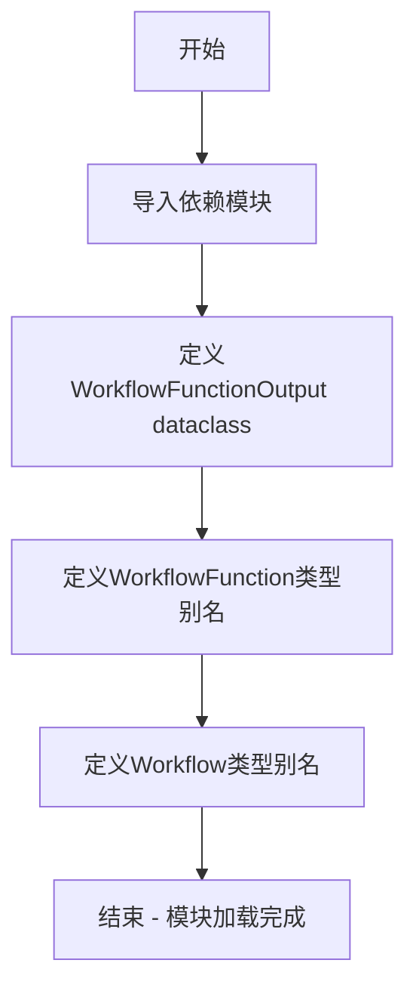

# `graphrag\packages\graphrag\graphrag\index\typing\workflow.py` 详细设计文档

该文件定义了GraphRag索引管道的workflow类型系统，包含用于存储workflow函数结果的 dataclass 以及 workflow函数和workflow本身的类型别名，支撑异步pipeline的执行框架。

## 整体流程



## 类结构

```
WorkflowFunctionOutput (dataclass)
├── result: Any | None
└── stop: bool

Type Aliases
├── WorkflowFunction
└── Workflow
```

## 全局变量及字段


### `WorkflowFunction`
    
异步可调用类型，接收GraphRagConfig和PipelineRunContext，返回WorkflowFunctionOutput

类型：`Callable[[GraphRagConfig, PipelineRunContext], Awaitable[WorkflowFunctionOutput]]`
    


### `Workflow`
    
元组类型，包含字符串名称和对应的WorkflowFunction

类型：`tuple[str, WorkflowFunction]`
    


### `WorkflowFunctionOutput`
    
数据容器，用于封装Workflow函数的执行结果

类型：`dataclass`
    


### `WorkflowFunctionOutput.result`
    
workflow函数的执行结果，用于下游日志记录

类型：`Any | None`
    


### `WorkflowFunctionOutput.stop`
    
标记workflow是否应在该函数执行后停止

类型：`bool`
    
    

## 全局函数及方法


## 关键组件


### 核心功能概述

该代码定义了GraphRAG索引管道的工作流类型系统，提供工作流函数的结果容器和异步工作流函数的类型签名，支持通过停止标志控制工作流执行流程。

### 文件运行流程

该模块作为类型定义文件，在导入时完成类型检查和类型别名的注册。不包含运行时逻辑，仅为上层工作流系统提供类型安全保证。工作流执行时，管道系统会导入该模块获取`Workflow`和`WorkflowFunction`类型，用于类型检查和验证工作流函数的签名一致性。

### 类详细信息

#### WorkflowFunctionOutput

**描述**: 数据容器类，用于封装工作流函数的执行结果

**字段**:

| 字段名 | 类型 | 描述 |
|--------|------|------|
| result | Any \| None | 工作流函数的执行结果，可为任意类型，官方输出需写入提供的存储 |
| stop | bool | 布尔标志，指示工作流是否应在该函数执行后停止执行 |

**方法**: 无自定义方法（使用@dataclass自动生成）

### 全局类型别名

#### WorkflowFunction

**类型**: `Callable[[GraphRagConfig, PipelineRunContext], Awaitable[WorkflowFunctionOutput]]`

**描述**: 异步可调用类型，定义工作流函数的签名

**参数**:
- config: GraphRagConfig - 全局配置对象
- context: PipelineRunContext - 管道运行上下文

**返回值**: WorkflowFunctionOutput - 异步返回工作流输出

#### Workflow

**类型**: `tuple[str, WorkflowFunction]`

**描述**: 工作流元组类型，包含工作流名称和对应的执行函数

**返回值**: 二元元组，第一个元素为字符串名称，第二个元素为工作流函数

### 关键组件信息

### WorkflowFunctionOutput 数据容器

工作流函数的标准输出封装类，通过result字段承载任意类型的执行结果，stop字段提供工作流中断能力。这种设计允许工作流函数在检测到不稳定失败风险时主动终止后续执行。

### WorkflowFunction 异步函数类型

定义了GraphRAG工作流系统的核心接口契约，约束所有工作流函数必须为接收配置和上下文、返回异步结果的协程函数。

### Workflow 元组类型

将工作流名称与执行函数绑定，支持工作流的注册、查找和动态调度。

### 潜在的技术债务或优化空间

1. **类型安全不足**: result字段使用`Any`类型，丧失类型检查意义，建议定义通用的结果基类或协议
2. **缺少日志级别控制**: stop标志仅支持布尔值，可考虑增加日志级别参数
3. **文档缺失**: 模块级缺少docstring，WorkflowFunction和Workflow缺少详细说明

### 其它项目

#### 设计目标与约束

- 目标：提供工作流系统的类型安全保证
- 约束：结果类型必须兼容任意业务逻辑输出

#### 错误处理与异常设计

通过stop标志处理潜在的不稳定失败，而非依赖异常捕获机制，提供更优雅的工作流中止方式

#### 数据流与状态机

工作流函数通过PipelineRunContext维护状态，WorkflowFunctionOutput携带状态转移信息

#### 外部依赖与接口契约

依赖graphrag.config.models.graph_rag_config.GraphRagConfig和graphrag.index.typing.context.PipelineRunContext，需保证这两个模块的类型稳定性


## 问题及建议


### 已知问题

-   **类型安全不足**：`Workflow` 使用简单 tuple `[str, WorkflowFunction]`，缺少编译时类型检查，容易因顺序错误导致运行时错误，且可读性差。
-   **类型信息丢失**：`WorkflowFunctionOutput.result` 字段使用 `Any` 类型，无法享受类型推导和 IDE 自动补全，降低了代码的可维护性和可读性。
-   **设计不一致**：注释说明"expect each workflow function to write official outputs to the provided storage"，意味着主要输出通过 side-effect 写入，而非返回值，但函数签名仍然返回 `WorkflowFunctionOutput`，这种设计容易造成混淆，且返回值实际仅用于日志记录。
-   **缺少上下文说明**：`stop` 字段的文档仅说明"用于防止不稳定故障"，但未说明具体触发场景和业务逻辑。
-   **灵活性受限**：`WorkflowFunction` 定义为固定参数签名 `(GraphRagConfig, PipelineRunContext)`，无法传递额外参数（如工作流特定配置），限制了工作流函数的扩展性。
-   **未使用的导入**：`PipelineRunContext` 在类型签名中使用，但代码中未直接引用其具体属性，运行时依赖隐式约定。

### 优化建议

-   使用 `@dataclass` 或 `NamedTuple` 替代普通 tuple 定义 `Workflow`，提升类型安全性和可读性。
-   为 `WorkflowFunctionOutput` 引入泛型参数，例如 `WorkflowFunctionOutput[T]`，并将 `result` 类型改为 `T | None`。
-   考虑将日志记录结果与正式输出分离，可新增 `WorkflowStorageOutput` 或采用其他更清晰的设计模式。
-   补充 `stop` 字段的业务场景说明，并考虑使用 Enum 定义停止原因。
-   使用 `Protocol` 或泛型定义 `WorkflowFunction`，支持可选的额外参数配置。
-   明确 `PipelineRunContext` 的具体使用方式，或考虑在文档中补充运行时合约说明。


## 其它


### 设计目标与约束

本模块的设计目标是定义GraphRag工作流管道的类型系统，提供统一的工作流函数签名和输出格式封装。约束方面，WorkflowFunction必须是异步函数且接受固定参数(GraphRagConfig, PipelineRunContext)，返回WorkflowFunctionOutput对象以支持流程控制和结果传递。

### 错误处理与异常设计

本模块本身不直接处理错误，错误处理由具体的工作流函数实现。WorkflowFunctionOutput中的stop字段用于处理不可恢复的错误场景，当设置为True时管道将停止执行。建议工作流函数在遇到以下情况时设置stop=True：数据持久化失败、关键依赖不可用、配置严重错误等。

### 数据流与状态机

数据流从配置(GraphRagConfig)和运行时上下文(PipelineRunContext)输入，经过工作流函数处理后，输出结果(result)和控制标志(stop)。状态机方面，管道通过stop标志实现简单的状态转换：当stop=False时继续执行下一个工作流，stop=True时终止管道。状态转换是单向的，不可逆。

### 外部依赖与接口契约

本模块依赖以下外部组件：graphrag.config.models.graph_rag_config.GraphRagConfig提供配置模型；graphrag.index.typing.context.PipelineRunContext提供运行时上下文；typing模块提供类型注解；collections.abc提供Callable和Awaitable类型。接口契约要求：WorkflowFunction必须返回Awaitable[WorkflowFunctionOutput]，result字段可为任意类型，stop字段默认为False。

### 性能考虑

本模块为纯类型定义模块，无运行时性能开销。性能优化应关注具体工作流函数的实现，避免在WorkflowFunctionOutput中传递大型对象，建议仅传递引用或标识符。

### 安全性考虑

由于本模块仅定义类型，无直接安全风险。但需注意：工作流函数中result字段可能包含敏感数据，应在日志记录时进行脱敏处理；stop字段的使用需谨慎，错误的stop=True可能导致数据不一致。

### 可扩展性设计

扩展点包括：1) 可通过继承WorkflowFunctionOutput添加更多字段；2) 可在Workflow元组中扩展元数据；3) 可定义工作流链式调用的中间件模式。当前设计保持了简洁性，支持任意Callable作为工作流函数。

### 测试策略

由于本模块为类型定义模块，测试重点在于：1) 验证类型注解的正确性；2) 验证WorkflowFunctionOutput数据类的序列化/反序列化；3) 验证类型别名与实际函数签名的兼容性。建议使用mypy进行静态类型检查。

### 版本兼容性

本模块适用于Python 3.10+（支持@dataclass的slots参数和联合类型语法）。当前使用Any|None语法需Python 3.10+，如需兼容更低版本需改用Union[Any, None]。GraphRagConfig和PipelineRunContext的版本需与主包保持一致。

### 配置管理

本模块不直接涉及配置管理，但通过GraphRagConfig参数为工作流函数提供配置访问能力。建议在具体工作流实现中通过配置驱动行为，避免硬编码。

    