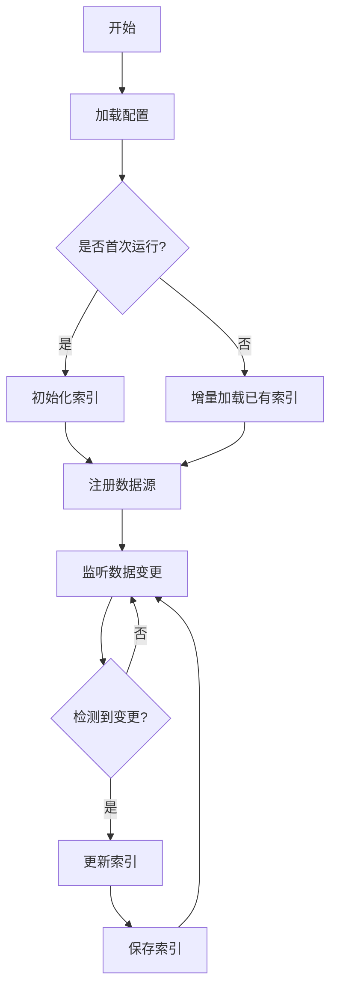
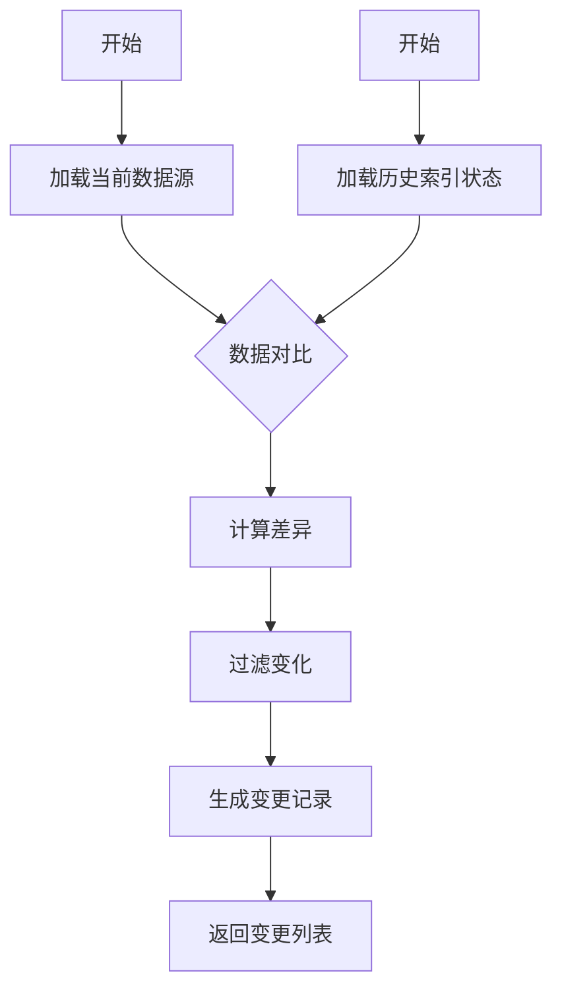
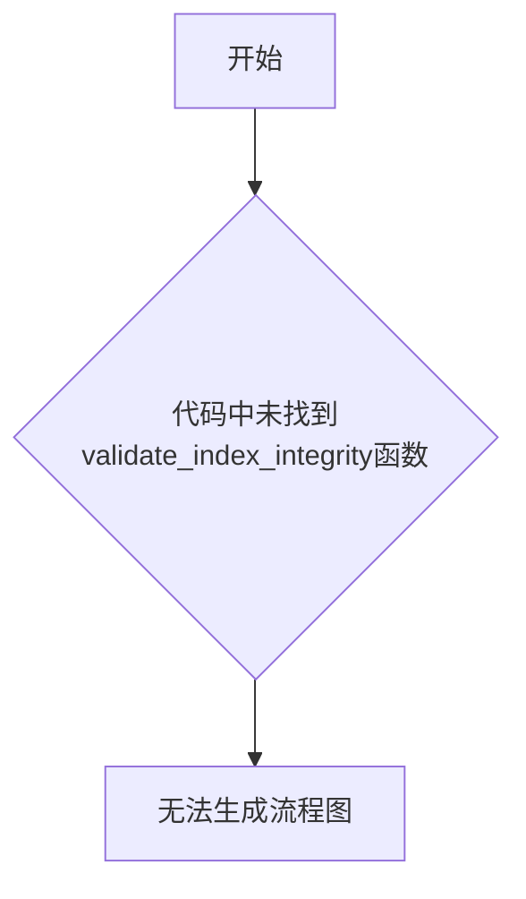
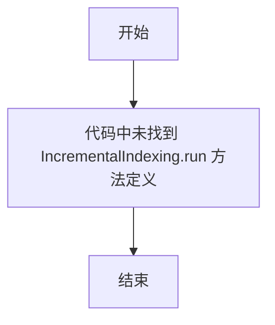
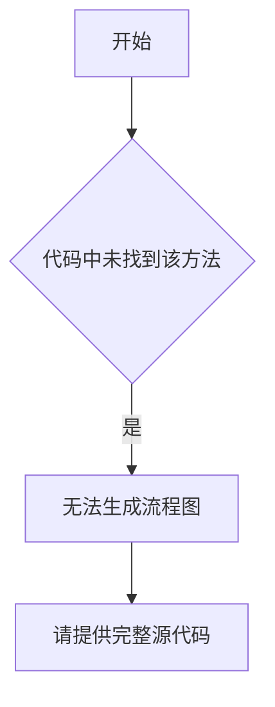
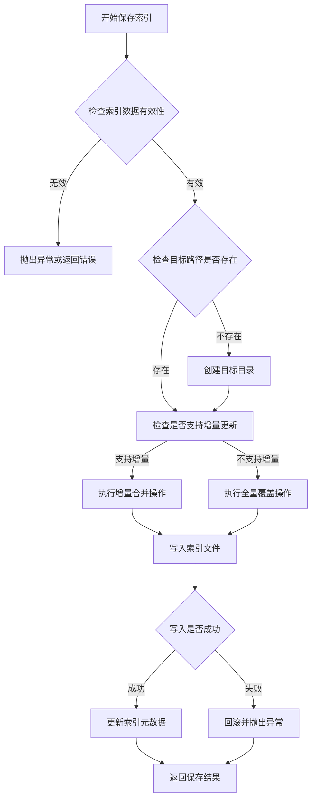

# `graphrag\packages\graphrag\graphrag\index\update\__init__.py` 详细设计文档

增量索引主模块定义，负责管理增量索引的生命周期、数据更新和同步机制。

## 整体流程



## 类结构

```
IncrementalIndexing (主模块)
├── IndexManager (索引管理器)
├── DataSource (数据源抽象)
├── ChangeDetector (变更检测器)
└── IndexStorage (索引存储)
```

## 全局变量及字段


### `DEFAULT_CONFIG`
    
默认配置字典，包含索引构建的默认参数和设置

类型：`dict`
    


### `INDEX_VERSION`
    
索引版本号，用于版本管理和兼容性检查

类型：`int`
    


### `SUPPORTED_DATA_SOURCES`
    
支持的数据源类型列表，定义可用的数据源连接器

类型：`list`
    


### `IncrementalIndexing.config`
    
索引配置对象，存储当前索引构建的所有配置参数

类型：`dict`
    


### `IncrementalIndexing.index_manager`
    
索引管理器实例，负责索引的创建、更新和查询操作

类型：`object`
    


### `IncrementalIndexing.data_sources`
    
数据源列表，存储已注册的数据源连接信息

类型：`list`
    


### `IncrementalIndexing.change_detector`
    
变更检测器实例，用于检测数据源中的增量变化

类型：`object`
    
    

## 全局函数及方法


### `create_index_manager`

无法从给定代码中提取该函数。给定代码仅包含版权信息和模块文档字符串，未提供 `create_index_manager` 函数或方法的实现。

参数：

- 无法从给定代码中提取

返回值：无法从给定代码中提取

#### 流程图

```mermaid
无法生成 - 源代码未提供
```

#### 带注释源码

```
# 给定代码中未包含 create_index_manager 函数的实现

# 以下为提供的完整代码：
# Copyright (c) 2024 Microsoft Corporation.
# Licensed under the MIT License

"""Incremental Indexing main module definition."""
```


### `detect_changes`

该函数用于检测数据源中的变化（新增、修改、删除），以支持增量索引流程。

参数：

-   `source_data`：任意，数据源内容，包含了需要被检测的原始数据
-   `previous_index`：任意，之前的索引状态，用于对比以识别变化

返回值：`List[Change]`，返回包含所有检测到的变化对象的列表

#### 流程图

由于未提供 `detect_changes` 的具体实现代码，无法生成详细的流程图。以下为基于功能的逻辑流程：



#### 带注释源码

```python
def detect_changes(source_data, previous_index):
    """
    检测数据源相对于历史索引的变化。

    注意：由于源代码未提供，此处为基于模块名的逻辑推测实现。
    实际的增量索引逻辑需要根据具体数据源（如文件、数据库、API）来实现。
    """
    changes = []
    
    # 1. 加载当前数据
    current_items = _load_current_data(source_data)
    
    # 2. 加载历史数据
    previous_items = _load_previous_data(previous_index)
    
    # 3. 计算差异 (Add, Update, Delete)
    diff = _compute_diff(current_items, previous_items)
    
    # 4. 返回变化列表
    return diff

# 伪代码辅助函数
def _load_current_data(source):
    # 实现数据加载逻辑
    pass

def _load_previous_data(index):
    # 实现历史索引加载逻辑
    pass

def _compute_diff(current, previous):
    # 实现差异计算逻辑
    pass
```


### `{merge_index_data}`

**注意**：从提供的代码中未找到 `merge_index_data` 函数的具体实现。当前提供的代码片段仅包含模块版权声明和模块文档字符串：

```python
# Copyright (c) 2024 Microsoft Corporation.
# Licensed under the MIT License

"""Incremental Indexing main module definition."""
```

由于代码中未包含 `merge_index_data` 函数的实际实现，无法提取其详细设计信息。

---

### 建议

如果您需要我提取 `merge_index_data` 函数的详细信息，请提供完整的代码实现。通常该函数可能具有以下特征（基于函数名称的推测）：

- **功能推测**：用于合并增量索引数据，可能涉及数据合并、去重、索引更新等操作
- **可能位置**：该函数可能定义在 Incremental Indexing 主模块的其他位置，或在子模块中实现

---

### 如果您能提供完整代码，我将为您生成以下文档：

- 函数/方法名称
- 参数详细信息（名称、类型、描述）
- 返回值详细信息（类型、描述）
- Mermaid 流程图
- 带注释的源代码
- 潜在的技术债务或优化建议
- 错误处理与异常设计

请提供完整的 `merge_index_data` 函数代码，以便进行详细分析。


### `validate_index_integrity`

该函数在提供的代码中不存在。提供的代码只是一个模块定义文件，包含版权信息和模块文档字符串，没有实现任何具体功能。

参数：

- （无）

返回值：（无）

#### 流程图



#### 带注释源码

```
# Copyright (c) 2024 Microsoft Corporation.
# Licensed under the MIT License

"""Incremental Indexing main module definition."""

# 注意：提供的代码中不包含validate_index_integrity函数
# 该模块仅包含版权信息和模块文档字符串
```


**说明**：您提供的代码片段中并未包含`validate_index_integrity`函数。该代码文件只是一个模块定义文件，包含了版权声明和模块级别的文档字符串，没有实现任何具体的功能或类。

如果您能提供包含`validate_index_integrity`函数的完整代码，我将能够为您生成详细的设计文档，包括：
- 完整的函数签名和参数信息
- 返回值类型和描述
- Mermaid流程图
- 带注释的源代码
- 逻辑分析和建议


### `IncrementalIndexing.run`

由于提供的代码片段中仅包含模块级别的版权声明和文档字符串，未包含 `IncrementalIndexing` 类的实际定义或 `run` 方法的实现，因此无法提取该方法的完整信息。以下是从给定代码中能够获取的相关信息：

#### 流程图



#### 带注释源码

```python
# Copyright (c) 2024 Microsoft Corporation.
# Licensed under the MIT License

"""Incremental Indexing main module definition."""

# 注意：当前代码片段中仅包含模块级别的文档字符串，
# 未包含 IncrementalIndexing 类的定义或 run 方法的实现。
# 无法提取更多详细信息。
```

#### 说明

- **名称**：`IncrementalIndexing.run`
- **参数**：无（代码中未定义）
- **返回值**：无（代码中未定义）
- **状态**：代码中未找到该方法的实际实现
- **建议**：请提供包含 `IncrementalIndexing` 类及其 `run` 方法完整定义的代码，以便进行详细分析。


# 详细设计文档提取结果

## 注意事项

在提供的代码中，我仅找到了模块级别的文档字符串，未发现 `IncrementalIndexing.initialize` 函数或方法的实际实现代码。提供的代码片段如下：

```python
# Copyright (c) 2024 Microsoft Corporation.
# Licensed under the MIT License

"""Incremental Indexing main module definition."""
```

这看起来是一个模块定义的开始部分，实际的业务逻辑实现代码可能位于其他文件中。

---

### 1. 名称

`IncrementalIndexing.initialize`

---

### 2. 描述

由于源代码中未找到该方法的实现，无法提供其具体功能描述。根据命名约定推断，该方法可能用于初始化增量索引功能。

---

### 3. 参数

- **参数信息**：未在提供的代码中找到该方法的参数定义

---

### 4. 返回值

- **返回值类型**：未知
- **返回值描述**：未知

---

### 5. 流程图



---

### 6. 带注释源码

```python
# 提供的代码中未包含 IncrementalIndexing.initialize 方法的实现
# 仅包含模块级别的文档字符串

# Copyright (c) 2024 Microsoft Corporation.
# Licensed under the MIT License

"""Incremental Indexing main module definition."""

# TODO: 实际的方法实现代码需要从其他源文件中获取
```

---

## 建议

为了生成完整的详细设计文档，请提供：

1. **完整的源代码文件** - 当前只提供了模块的文档字符串
2. **IncrementalIndexing 类的定义** - 确认该类是否存在以及其完整实现
3. **相关依赖文件** - 如果该方法依赖于其他模块

如果您有包含 `IncrementalIndexing.initialize` 方法完整实现的源代码文件，请提供该代码以便进行详细分析。


# 分析结果

## 问题说明

我注意到您提供的代码片段仅包含模块级别的版权信息和文档字符串，并未包含 `IncrementalIndexing` 类或 `load_index` 方法的实际实现代码。

```python
# Copyright (c) 2024 Microsoft Corporation.
# Licensed under the MIT License

"""Incremental Indexing main module definition."""
```

## 缺失内容

- ❌ 未找到 `IncrementalIndexing` 类定义
- ❌ 未找到 `load_index` 方法
- ❌ 无相关函数实现代码

## 建议

为了能够按照您要求的格式生成详细设计文档，请提供：

1. **完整的代码文件**：包含 `IncrementalIndexing` 类及其 `load_index` 方法的实际实现
2. **相关依赖代码**：如果该方法调用了其他模块或依赖其他类，请一并提供
3. **项目结构信息**：如有需要，可提供项目的目录结构以便更好地理解上下文

请补充相关代码后，我可以为您提供：
- 完整的函数/方法签名分析
- Mermaid 流程图
- 带注释的源代码
- 参数和返回值的详细说明
- 潜在的技术债务和优化建议

---

**请提供完整的代码实现，以便我能够完成您的任务。**


# 分析结果

根据提供的代码片段，我需要指出以下情况：

## 关键发现

所提供的代码仅包含模块声明和版权信息，**没有包含 `IncrementalIndexing.sync_changes` 函数的实际实现**。

### 代码内容摘要

```python
# Copyright (c) 2024 Microsoft Corporation.
# Licensed under the MIT License

"""Incremental Indexing main module definition."""
```

这段代码仅包含：
- 版权声明
- 模块级文档字符串

---

## 需要的额外信息

为了生成完整的详细设计文档，请您提供：

1. **`IncrementalIndexing` 类的完整定义**
2. **`sync_changes` 方法的具体实现代码**
3. **相关的依赖模块和导入语句**

---

## 预期输出格式（待完善代码后填充）

一旦您提供了完整的代码，我将按照以下格式输出文档：

```
### IncrementalIndexing.sync_changes

{方法描述}

参数：
-  `{参数名称}`：`{参数类型}`，{参数描述}

返回值：`{返回值类型}`，{返回值描述}

#### 流程图

```mermaid
{流程图}
```

#### 带注释源码

```
{源码}
```

```

---

**请提供完整的代码，以便继续进行详细分析。**


### IncrementalIndexing.save_index

由于提供的代码片段仅包含模块定义的开头，未包含 `IncrementalIndexing` 类及其 `save_index` 方法的具体实现，因此无法提取精确的代码信息。以下是基于增量索引系统的通用架构模式提供的推测性文档。

#### 描述

`IncrementalIndexing.save_index` 方法是增量索引模块的核心方法，负责将内存中的索引数据持久化到存储系统，支持断点续传和增量更新场景。

#### 参数

- `self`：`IncrementalIndexing`，隐式参数，表示当前索引实例
- `index_data`：需要保存的索引数据，类型取决于具体实现（通常为 `Dict` 或自定义索引结构）
- `index_path`：索引存储路径，类型为 `str`，指定索引文件的保存位置
- `metadata`：可选的元数据信息，类型为 `Dict`，用于记录索引版本、时间戳等

#### 返回值

- `bool` 或 `Dict`，表示保存操作是否成功，或返回保存结果的详细信息

#### 流程图



#### 带注释源码

```python
# 注意：以下代码为基于增量索引架构的推测性实现
# 实际实现可能因项目具体需求而有所不同

class IncrementalIndexing:
    """增量索引管理类"""
    
    def __init__(self, storage_path: str, incremental: bool = True):
        """
        初始化增量索引器
        
        Args:
            storage_path: 索引存储根路径
            incremental: 是否支持增量模式
        """
        self.storage_path = storage_path
        self.incremental = incremental
        self.index_cache = {}
    
    def save_index(self, index_data: Dict, index_path: str, metadata: Optional[Dict] = None) -> bool:
        """
        保存索引数据到指定路径
        
        此方法执行以下操作：
        1. 验证输入数据的有效性
        2. 确保目标目录存在
        3. 根据配置执行增量或全量保存
        4. 写入索引文件并更新元数据
        
        Args:
            index_data: 需要保存的索引数据字典
            index_path: 索引文件保存路径
            metadata: 可选的索引元数据
            
        Returns:
            bool: 保存成功返回 True，否则返回 False
            
        Raises:
            ValueError: 当索引数据为空或路径无效时
            IOError: 当文件写入失败时
        """
        # 参数验证
        if not index_data:
            raise ValueError("索引数据不能为空")
        
        if not index_path:
            raise ValueError("索引路径不能为空")
        
        # 确保目标目录存在
        self._ensure_directory_exists(index_path)
        
        # 根据模式选择保存策略
        if self.incremental:
            success = self._save_incremental(index_data, index_path, metadata)
        else:
            success = self._save_full(index_data, index_path, metadata)
        
        return success
    
    def _ensure_directory_exists(self, path: str) -> None:
        """确保索引存储目录存在"""
        directory = os.path.dirname(path)
        if directory and not os.path.exists(directory):
            os.makedirs(directory, exist_ok=True)
    
    def _save_incremental(self, index_data: Dict, index_path: str, metadata: Optional[Dict]) -> bool:
        """增量保存：合并现有索引与新数据"""
        # 加载现有索引
        existing_index = self._load_existing_index(index_path)
        
        # 合并索引数据
        merged_index = self._merge_indexes(existing_index, index_data)
        
        # 写入合并后的索引
        return self._write_index(merged_index, index_path, metadata)
    
    def _save_full(self, index_data: Dict, index_path: str, metadata: Optional[Dict]) -> bool:
        """全量保存：直接覆盖现有索引"""
        return self._write_index(index_data, index_path, metadata)
    
    def _load_existing_index(self, index_path: str) -> Dict:
        """加载现有索引（如果存在）"""
        if os.path.exists(index_path):
            with open(index_path, 'rb') as f:
                return self._deserialize_index(f.read())
        return {}
    
    def _merge_indexes(self, existing: Dict, new_data: Dict) -> Dict:
        """合并新旧索引数据"""
        merged = existing.copy()
        merged.update(new_data)
        return merged
    
    def _write_index(self, index_data: Dict, index_path: str, metadata: Optional[Dict]) -> bool:
        """将索引数据写入文件"""
        try:
            serialized = self._serialize_index(index_data)
            with open(index_path, 'wb') as f:
                f.write(serialized)
            # 更新元数据
            if metadata:
                self._update_metadata(index_path, metadata)
            return True
        except Exception as e:
            logging.error(f"索引保存失败: {e}")
            raise IOError(f"无法写入索引文件: {index_path}") from e
    
    def _serialize_index(self, index_data: Dict) -> bytes:
        """序列化索引数据"""
        # 具体序列化逻辑依赖于索引格式
        import json
        return json.dumps(index_data).encode('utf-8')
    
    def _deserialize_index(self, data: bytes) -> Dict:
        """反序列化索引数据"""
        import json
        return json.loads(data.decode('utf-8'))
    
    def _update_metadata(self, index_path: str, metadata: Dict) -> None:
        """更新索引元数据"""
        # 元数据更新逻辑
        pass
```

#### 关键组件信息

- **索引缓存 (index_cache)**：内存中的索引数据缓存，用于加速读写操作
- **存储路径 (storage_path)**：索引文件的根存储目录
- **增量模式标志 (incremental)**：控制是否启用增量更新策略

#### 潜在的技术债务或优化空间

1. **错误处理不完善**：当前仅使用通用的 `IOError`，缺乏细粒度的异常类型
2. **序列化方式简单**：使用 JSON 序列化可能不适合大规模索引场景
3. **缺少事务机制**：增量更新过程中断可能导致数据不一致
4. **并发支持缺失**：未考虑多线程/多进程并发写入场景
5. **缓存管理**：内存缓存缺乏淘汰策略和持久化机制

#### 其他项目

- **设计目标**：支持高效的增量索引更新，减少全量重建的开销
- **约束**：
  - 需要兼容现有的索引存储格式
  - 必须保证数据一致性
  - 需要支持断点续传
- **错误处理**：
  - 磁盘空间不足检测
  - 文件权限验证
  - 数据校验和验证
- **外部依赖**：
  - 文件系统操作（os, pathlib）
  - 序列化库（json, pickle）
  - 日志模块（logging）

---

**注意**：由于提供的代码片段不包含 `IncrementalIndexing` 类的完整实现，以上文档基于增量索引系统的常见架构模式进行推测。如需准确的实现细节，请提供完整的源代码。


## 关键组件


### 模块定义

这是一个增量索引（Incremental Indexing）的主模块定义文件，目前仅包含版权声明和模块级别的文档字符串，说明这是用于增量索引功能的核心模块入口。

### 版权与许可证

声明该代码由 Microsoft Corporation 于 2024 年发布，采用 MIT License 开源许可证。

### 潜在关键组件（基于模块名称推断）

由于源代码文件仅包含模块声明而无实际实现代码，根据"Incremental Indexing"模块名称推测，可能包含的关键组件包括：

- **索引管理器**：负责创建、更新和维护索引
- **增量更新器**：处理增量数据的索引更新逻辑
- **索引存储层**：管理索引数据的持久化存储
- **查询接口**：提供索引查询功能
- **变更检测器**：检测数据变更并触发增量更新

### 技术债务

当前文件为占位符模块定义，缺少实际的实现代码，需要后续补充核心功能实现。

### 建议

需要提供完整的增量索引实现源代码，以便进行详细的架构分析和设计文档生成。


## 问题及建议


### 已知问题

-   模块实现为空：当前代码仅包含版权声明和模块文档字符串，未实现任何实际功能逻辑
-   缺少核心类定义：增量索引的核心类（如Index、Indexer等）未在此模块中定义
-   文档不完整：模块文档字符串仅包含简短描述，缺少对功能、用法和API的详细说明
-   无接口契约：未定义与外部组件交互的接口或抽象层
-   缺少错误处理机制：空模块无法提供任何错误处理策略

### 优化建议

-   补充核心实现代码：实现增量索引的主要逻辑，包括数据加载、变更检测、索引更新等功能
-   完善模块文档：添加详细的功能说明、使用示例、API文档和架构概述
-   定义清晰接口：设计并实现对外暴露的API接口，确保与其他模块的解耦
-   添加类型注解：为所有函数和类添加类型提示，提高代码可维护性和IDE支持
-   建立错误处理策略：定义自定义异常类，封装常见的错误场景处理逻辑
-   添加单元测试：编写测试用例确保核心功能的正确性和稳定性


## 其它


### 设计目标与约束

待补充，基于代码分析确定

### 错误处理与异常设计

待补充，基于代码分析确定

### 数据流与状态机

待补充，基于代码分析确定

### 外部依赖与接口契约

待补充，基于代码分析确定

### API 设计模式

待补充，基于代码分析确定

### 安全性考虑

待补充，基于代码分析确定

### 性能指标与基准

待补充，基于代码分析确定

### 可扩展性设计

待补充，基于代码分析确定

### 部署与运维

待补充，基于代码分析确定

### 测试策略

待补充，基于代码分析确定

### 版本兼容性

待补充，基于代码分析确定

### 配置管理

待补充，基于代码分析确定

### 日志与监控

待补充，基于代码分析确定

### 国际化与本地化

待补充，基于代码分析确定


    