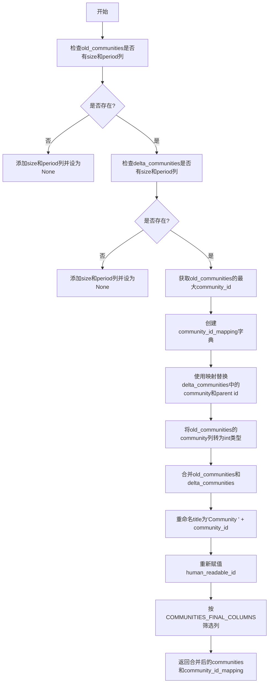
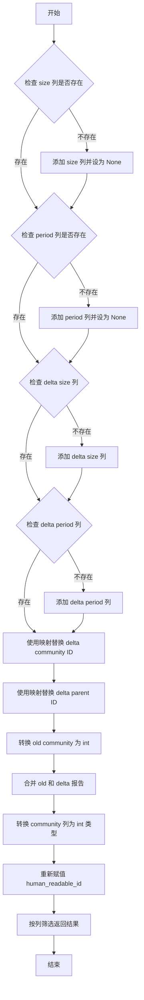

# `graphrag\packages\graphrag\graphrag\index\update\communities.py` 详细设计文档

这是一个用于增量索引的数据框架操作工具模块，主要负责将旧的社区数据和新的增量社区数据进行合并和更新，包括处理社区ID映射、重命名标题、重新分配人类可读ID等操作，同时确保数据结构符合最终的列规范。

## 整体流程



## 类结构

```
模块: incremental_indexing
└── 全局函数
    ├── _update_and_merge_communities
    └── _update_and_merge_community_reports
```

## 全局变量及字段


### `COMMUNITIES_FINAL_COLUMNS`
    
定义最终社区数据框应包含的列名列表，用于数据整合和列选择

类型：`list[str] | tuple[str, ...]`
    


### `COMMUNITY_REPORTS_FINAL_COLUMNS`
    
定义最终社区报告数据框应包含的列名列表，用于数据整合和列选择

类型：`list[str] | tuple[str, ...]`
    


    

## 全局函数及方法


### `_update_and_merge_communities`

该函数负责在增量索引场景下，将新产生的社区数据（delta）与已有的历史社区数据（old）进行合并。主要逻辑包括：为缺失字段填充默认值、根据历史最大社区ID重新映射增量数据的社区ID和父社区ID、合并两个DataFrame并重新计算人类可读的标题和ID，最终返回合并后的完整社区列表及ID映射关系供其他模块使用。

参数：

- `old_communities`：`pd.DataFrame`，历史社区数据表
- `delta_communities`：`pd.DataFrame`，新增的增量社区数据表

返回值：`tuple[pd.DataFrame, dict]`，合并后的完整社区数据表及社区ID映射字典

#### 流程图

```mermaid
flowchart TD
    A[开始] --> B{检查old_communities是否有size列}
    B -->|否| C[添加size列并设为None]
    B -->|是| D{检查old_communities是否有period列}
    C --> D
    D -->|否| E[添加period列并设为None]
    D -->|是| F{检查delta_communities是否有size列}
    E --> F
    F -->|否| G[添加size列并设为None]
    F -->|是| H{检查delta_communities是否有period列}
    G --> H
    H -->|否| I[添加period列并设为None]
    H -->|是| J[计算旧社区最大ID]
    I --> J
    J --> K[构建社区ID映射字典]
    K --> L[重映射delta_communities的community列]
    L --> M[重映射delta_communities的parent列]
    M --> N[转换old_communities的community列为int]
    N --> O[concat合并两个DataFrame]
    O --> P[重命名title为'Community {id}']
    P --> Q[重新赋值human_readable_id]
    Q --> R[按列顺序裁剪返回]
    R --> S[返回合并结果和ID映射]
```

#### 带注释源码

```python
def _update_and_merge_communities(
    old_communities: pd.DataFrame,
    delta_communities: pd.DataFrame,
) -> tuple[pd.DataFrame, dict]:
    """Update and merge communities.

    Parameters
    ----------
    old_communities : pd.DataFrame
        The old communities.
    delta_communities : pd.DataFrame
        The delta communities.
    community_id_mapping : dict
        The community id mapping.

    Returns
    -------
    pd.DataFrame
        The updated communities.
    """
    # 检查old_communities是否存在size列，不存在则添加并初始化为None
    # 目的：确保合并后的数据格式一致，避免列缺失错误
    if "size" not in old_communities.columns:
        old_communities["size"] = None
    # 检查old_communities是否存在period列，不存在则添加并初始化为None
    if "period" not in old_communities.columns:
        old_communities["period"] = None

    # 对delta_communities进行相同的size列检查和添加操作
    if "size" not in delta_communities.columns:
        delta_communities["size"] = None
    # 对delta_communities进行相同的period列检查和添加操作
    if "period" not in delta_communities.columns:
        delta_communities["period"] = None

    # 获取旧社区中最大的community ID值，用于后续ID偏移计算
    # fillna(0)处理空值，astype(int)确保整数运算
    old_max_community_id = old_communities["community"].fillna(0).astype(int).max()
    
    # 构建社区ID映射字典：将delta中的每个社区ID加上偏移量
    # 偏移量 = 旧最大ID + 1，确保新ID不会与旧ID冲突
    # dropna()排除空值，astype(int)转换为整数
    community_id_mapping = {
        v: v + old_max_community_id + 1
        for k, v in delta_communities["community"].dropna().astype(int).items()
    }
    # 特殊处理：保留ID为-1的映射（通常表示无社区/根节点）
    community_id_mapping.update({-1: -1})

    # 使用映射字典重写delta_communities的community列
    # apply配合lambda实现逐行映射，get方法处理未在映射中的值（保留原值）
    delta_communities["community"] = (
        delta_communities["community"]
        .astype(int)
        .apply(lambda x: community_id_mapping.get(x, x))
    )

    # 同样重写parent列，保持社区层级关系一致
    delta_communities["parent"] = (
        delta_communities["parent"]
        .astype(int)
        .apply(lambda x: community_id_mapping.get(x, x))
    )

    # 统一将old_communities的community列转换为int类型
    old_communities["community"] = old_communities["community"].astype(int)

    # 使用pd.concat合并两个社区DataFrame
    # ignore_index=True重新生成连续索引，copy=False避免不必要的数据拷贝
    merged_communities = pd.concat(
        [old_communities, delta_communities], ignore_index=True, copy=False
    )

    # 生成人类可读的社区标题，格式为"Community {id}"
    merged_communities["title"] = "Community " + merged_communities["community"].astype(
        str
    )
    # 重新赋值human_readable_id字段，使其与community ID一致
    merged_communities["human_readable_id"] = merged_communities["community"]

    # 按预定义的列顺序裁剪DataFrame，确保输出格式一致
    merged_communities = merged_communities.loc[
        :,
        COMMUNITIES_FINAL_COLUMNS,
    ]
    # 返回合并后的社区数据及ID映射关系（供社区报告模块使用）
    return merged_communities, community_id_mapping
```


### `_update_and_merge_community_reports`

该函数负责将增量（delta）社区报告与旧的社区报告进行合并，通过社区ID映射处理ID偏移问题，并确保数据列的完整性，最终返回合并后的社区报告DataFrame。

参数：

- `old_community_reports`：`pd.DataFrame`，旧的社区报告数据
- `delta_community_reports`：`pd.DataFrame`，新增的增量社区报告数据
- `community_id_mapping`：`dict`，社区ID映射字典，用于将增量数据的ID偏移到旧数据的ID范围内

返回值：`pd.DataFrame`，合并更新后的社区报告数据

#### 流程图



#### 带注释源码

```python
def _update_and_merge_community_reports(
    old_community_reports: pd.DataFrame,
    delta_community_reports: pd.DataFrame,
    community_id_mapping: dict,
) -> pd.DataFrame:
    """Update and merge community reports.

    Parameters
    ----------
    old_community_reports : pd.DataFrame
        The old community reports.
    delta_community_reports : pd.DataFrame
        The delta community reports.
    community_id_mapping : dict
        The community id mapping.

    Returns
    -------
    pd.DataFrame
        The updated community reports.
    """
    # 检查旧社区报告中是否存在 size 列，如不存在则添加并设为 None
    if "size" not in old_community_reports.columns:
        old_community_reports["size"] = None
    # 检查旧社区报告中是否存在 period 列，如不存在则添加并设为 None
    if "period" not in old_community_reports.columns:
        old_community_reports["period"] = None

    # 对增量社区报告进行相同的处理
    if "size" not in delta_community_reports.columns:
        delta_community_reports["size"] = None
    if "period" not in delta_community_reports.columns:
        delta_community_reports["period"] = None

    # 使用社区ID映射替换增量数据中的 community 列ID
    # 将 community 列转换为 int 类型，然后通过映射字典替换ID值
    delta_community_reports["community"] = (
        delta_community_reports["community"]
        .astype(int)
        .apply(lambda x: community_id_mapping.get(x, x))
    )

    # 使用社区ID映射替换增量数据中的 parent 列ID
    delta_community_reports["parent"] = (
        delta_community_reports["parent"]
        .astype(int)
        .apply(lambda x: community_id_mapping.get(x, x))
    )

    # 将旧社区报告的 community 列转换为 int 类型
    old_community_reports["community"] = old_community_reports["community"].astype(int)

    # 合并旧社区报告和增量社区报告
    # 使用 pd.concat 合并两个 DataFrame，ignore_index=True 重新生成索引，copy=False 避免不必要的复制
    merged_community_reports = pd.concat(
        [old_community_reports, delta_community_reports], ignore_index=True, copy=False
    )

    # 保持与查询的类型兼容性，将 community 列转换为 int 类型
    merged_community_reports["community"] = merged_community_reports[
        "community"
    ].astype(int)
    # 重新赋值 human_readable_id 为 community 列的值
    merged_community_reports["human_readable_id"] = merged_community_reports[
        "community"
    ]

    # 按预定义的列顺序筛选返回最终结果
    return merged_community_reports.loc[:, COMMUNITY_REPORTS_FINAL_COLUMNS]
```

## 关键组件


### 增量社区数据合并（_update_and_merge_communities）

该函数负责将旧的社区数据与增量社区数据进行合并，通过社区ID映射机制确保新旧数据的ID不冲突，并自动补全缺失的size和period列，最后按照COMMUNITIES_FINAL_COLUMNS返回规范化的DataFrame。

### 增量社区报告合并（_update_and_merge_community_reports）

该函数负责将旧的社区报告与增量社区报告进行合并，使用传入的community_id_mapping重新映射社区ID，确保报告与社区数据的一致性，同时补全缺失的列并返回规范化的DataFrame。

### 社区ID映射机制

在合并过程中，系统通过计算旧社区的最大ID，为增量社区的ID添加偏移量（old_max_community_id + 1），生成映射字典，使得新旧社区的ID不会冲突。同时保留-1作为特殊值用于表示空或根节点。

### 列补全机制

两个合并函数都实现了动态列补全逻辑：当old_communities或delta_communities中缺少size或period列时，自动添加这些列并设为None，确保数据结构的统一性。

### DataFrame合并与规范化

使用pd.concat进行高效的DataFrame合并操作（copy=False以优化内存），然后通过.loc选择特定的列（COMMUNITIES_FINAL_COLUMNS或COMMUNITY_REPORTS_FINAL_COLUMNS）进行规范化输出。


## 问题及建议


### 已知问题

-   **代码重复**：两个函数`_update_and_merge_communities`和`_update_and_merge_community_reports`存在大量重复逻辑，包括检查并添加size/period列、community和parent列的ID映射转换、类型转换等，应抽取公共逻辑
-   **使用低效的apply+lambda**：代码使用`.apply(lambda x: community_id_mapping.get(x, x))`进行ID映射，这是逐行操作，性能较低，应使用`pandas`的向量化操作如`map()`或`replace()`
-   **缺少输入验证**：函数未对输入的DataFrame进行空值检查、类型验证或必要的约束检查，可能导致运行时错误
-   **魔法数字**：`community_id_mapping.update({-1: -1})`中-1被特殊处理，但没有定义常量说明其语义
-   **冗余类型转换**：多次调用`.astype(int)`进行类型转换，部分转换可能是多余的
-   **硬编码字符串**：标题生成`"Community " + merged_communities["community"].astype(str)`中的字符串应抽取为常量
-   **不一致的返回类型**：第一个函数返回`tuple[pd.DataFrame, dict]`，第二个函数返回`pd.DataFrame`，接口设计不一致
-   **缺少日志记录**：没有任何日志输出，不利于调试和监控增量索引过程

### 优化建议

-   **提取公共函数**：将重复的列检查、ID映射、类型转换逻辑抽取为私有辅助函数，如`_ensure_columns_exist()`和`_remap_community_ids()`
-   **向量化操作优化**：使用`df['community'].map(community_id_mapping).fillna(df['community'])`替代apply+lambda，提升性能
-   **添加输入验证**：在函数入口添加`assert`或显式检查，确保输入DataFrame非空且包含必要列
-   **定义常量**：将`-1`和`"Community "`定义为具名常量，如`NO_PARENT_ID = -1`和`COMMUNITY_TITLE_PREFIX = "Community "`
-   **统一返回类型**：考虑让两个函数返回一致的结构，或在文档中明确说明差异
-   **添加日志**：使用`logging`模块记录合并操作的统计信息（如记录数、映射数等）
-   **考虑使用类型提示**：虽然已有基础类型提示，但可考虑使用`typing.TypeAlias`或`Protocol`定义更精确的类型


## 其它


### 设计目标与约束

**设计目标**：实现增量索引（Incremental Indexing）场景下的社区（communities）和社区报告（community reports）数据的合并更新功能。通过为增量数据分配新的社区ID，避免与历史数据产生ID冲突，最终合并输出符合查询兼容性要求的数据框。

**约束条件**：
- 输入的old_communities和delta_communities必须包含`community`列
- 社区ID（community）应为整数类型，支持NaN值处理
- parent字段必须与community字段同步进行ID映射
- 合并后的数据框必须符合COMMUNITIES_FINAL_COLUMNS和COMMUNITY_REPORTS_FINAL_COLUMNS定义的列结构
- 增量数据的ID映射采用旧数据最大ID+1的递增策略，确保ID唯一性

### 错误处理与异常设计

**错误处理机制**：
- **列缺失处理**：代码主动检查`size`和`period`列是否存在，不存在时初始化为None。这是向前兼容旧版本数据的防御性编程。
- **NaN值处理**：使用`fillna(0)`处理社区ID中的NaN值，避免max()操作失败；使用`dropna()`过滤有效的社区ID进行映射构建。
- **类型转换保护**：在进行int转换前未显式检查类型，可能抛出`ValueError`或`TypeError`。

**潜在异常场景**：
- 输入DataFrame为空时的max()操作返回NaN，需依赖fillna(0)处理
- community_id_mapping中未找到的ID会保留原值（通过`.get(x, x)`实现），这可能导致ID冲突但不会抛出异常
- 字段类型不一致时astype(int)可能失败

### 数据流与状态机

**数据流向**：

```
[old_communities] ─┐
                   ├──→ [ID映射构建] ──→ [ID重映射] ──→ [合并] ──→ [列重排] ──→ [merged_communities]
[delta_communities] ┘                                    ↑
                                                               │
[old_community_reports] ─┐                                 │
                         ├──→ [ID映射应用] ──→ [合并] ──→ [类型转换] ──┘
[delta_community_reports] ┘
```

**处理流程**：
1. **准备阶段**：检查并补全size和period列
2. **ID映射阶段**：计算旧数据最大community ID，构建增量数据ID映射字典（映射值=原ID+max+1，特殊值-1映射为-1）
3. **ID转换阶段**：对delta数据的community和parent字段应用映射
4. **合并阶段**：使用pd.concat合并旧数据和增量数据
5. **后处理阶段**：重写title字段、重置human_readable_id、筛选目标列

### 外部依赖与接口契约

**外部依赖**：
- `pandas`：DataFrame操作核心库
- `graphrag.data_model.schemas`：内部模块，提供COMMUNITIES_FINAL_COLUMNS和COMMUNITY_REPORTS_FINAL_COLUMNS两个列定义常量

**接口契约**：
- `_update_and_merge_communities(old_communities, delta_communities)`：返回合并后的DataFrame和community_id_mapping字典
- `_update_and_merge_community_reports(old_community_reports, delta_community_reports, community_id_mapping)`：返回合并后的community_reports DataFrame
- 两个函数均为纯函数，无副作用（除输入DataFrame可能被修改外）

### 性能考虑与优化建议

**当前实现问题**：
- 使用`.apply(lambda x: ...)`逐行处理ID映射，效率较低，大数据量时建议使用`replace()`或向量化操作
- `pd.concat`默认copy=False但在列筛选时可能产生拷贝
- 未对空DataFrame进行快速路径处理

**优化建议**：
- 使用`delta_communities["community"].map(community_id_mapping).fillna(delta_communities["community"])`替代apply
- 对空DataFrame直接返回，避免不必要的计算
- 考虑使用索引而非列名进行列筛选

### 使用示例与调用模式

```python
# 典型调用流程
old_communities = pd.DataFrame(...)
delta_communities = pd.DataFrame(...)

# 合并社区数据
merged_communities, community_id_mapping = _update_and_merge_communities(
    old_communities, 
    delta_communities
)

# 合并社区报告数据（使用上方返回的mapping）
merged_reports = _update_and_merge_community_reports(
    old_community_reports,
    delta_community_reports,
    community_id_mapping
)
```

### 版本与环境要求

- Python版本：无显式限制，建议Python 3.8+
- Pandas版本：支持pandas 1.5+（因使用pd.concat的ignore_index和copy参数）
- 依赖graphrag.data_model.schemas模块，需确保该模块可导入


    