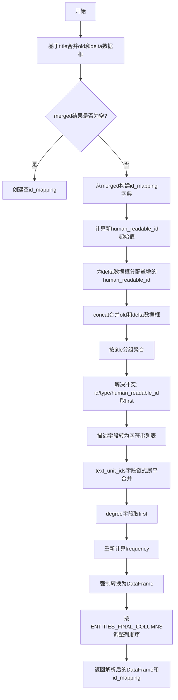

# `graphrag\packages\graphrag\graphrag\index\update\entities.py` 详细设计文档

该文件实现了增量索引中实体数据的合并与冲突解决功能，通过合并旧实体数据框和新产生的增量实体数据框，按标题分组去重，重新计算人类可读ID和频率，并确保输出列顺序与ENTITIES_FINAL_COLUMNS一致。

## 整体流程

```mermaid
graph TD
    A[开始: _group_and_resolve_entities] --> B[通过title合并两个DataFrame]
    B --> C[创建id映射字典: {delta_id: old_id}]
    C --> D[为增量实体生成human_readable_id]
    D --> E[concat合并旧实体和增量实体]
    E --> F[按title分组聚合解决冲突]
    F --> G[重新计算frequency字段]
    G --> H[按ENTITIES_FINAL_COLUMNS重排列顺序]
    H --> I[返回resolved_df和id_mapping]
```

## 类结构

```
无类定义 - 纯函数模块
└── _group_and_resolve_entities (模块级函数)
```

## 全局变量及字段


### `ENTITIES_FINAL_COLUMNS`
    
从graphrag.data_model.schemas模块导入的实体最终列名常量，用于定义DataFrame的列顺序

类型：`list[str] | tuple[str, ...]`
    


    

## 全局函数及方法


### `_group_and_resolve_entities`

该函数是实体相关操作的核心工具函数，用于增量索引（Incremental Indexing）场景下合并和解析两个实体数据框（旧的实体数据框和新增的增量实体数据框），通过title字段匹配并建立ID映射关系，同时解决合并后的冲突（如描述和文本单元ID的合并），最终返回按统一列顺序整理的解析后数据框和ID映射字典。

参数：

- `old_entities_df`：`pd.DataFrame`，旧的实体数据框，包含已存在的实体记录
- `delta_entities_df`：`pd.DataFrame`，增量实体数据框，包含新提取的实体记录

返回值：`tuple[pd.DataFrame, dict]`，返回解析合并后的实体数据框和ID映射字典（格式为 {delta中的id: old中的id}）

#### 流程图



#### 带注释源码

```python
def _group_and_resolve_entities(
    old_entities_df: pd.DataFrame, delta_entities_df: pd.DataFrame
) -> tuple[pd.DataFrame, dict]:
    """Group and resolve entities.

    Parameters
    ----------
    old_entities_df : pd.DataFrame
        The first dataframe.
    delta_entities_df : pd.DataFrame
        The delta dataframe.

    Returns
    -------
    pd.DataFrame
        The resolved dataframe.
    dict
        The id mapping for existing entities. In the form of {df_b.id: df_a.id}.
    """
    # 如果title在A和B中都存在，创建{B.id: A.id}的映射字典
    # 用于追踪哪些增量实体映射到了现有实体
    merged = delta_entities_df[["id", "title"]].merge(
        old_entities_df[["id", "title"]],
        on="title",
        suffixes=("_B", "_A"),
        copy=False,
    )
    id_mapping = dict(zip(merged["id_B"], merged["id_A"], strict=True))

    # 将B中的人类可读ID基于A的最大值进行递增分配
    # 确保新实体的ID不会与现有实体冲突
    initial_id = old_entities_df["human_readable_id"].max() + 1
    delta_entities_df["human_readable_id"] = np.arange(
        initial_id, initial_id + len(delta_entities_df)
    )
    # 合并A和B两个数据框
    combined = pd.concat(
        [old_entities_df, delta_entities_df"], ignore_index=True, copy=False
    )

    # 按title分组并解决冲突
    # 对于不同实体同名的情况，进行如下聚合策略：
    aggregated = (
        combined
        .groupby("title")
        .agg({
            "id": "first",  # 取第一个实体的id
            "type": "first",  # 取第一个实体的type
            "human_readable_id": "first",  # 取第一个实体的人类可读ID
            "description": lambda x: list(x.astype(str)),  # 将所有描述转为字符串并合并为列表
            # 将nd.array展平并链式合并为一个列表
            "text_unit_ids": lambda x: list(itertools.chain(*x.tolist())),
            "degree": "first",  # 取第一个实体的度数
            # todo: we could probably re-compute this with the entire new graph
        })
        .reset_index()
    )

    # 重新计算frequency以包含新的文本单元
    aggregated["frequency"] = aggregated["text_unit_ids"].apply(len)

    # 强制将聚合结果转换为DataFrame类型
    resolved: pd.DataFrame = pd.DataFrame(aggregated)

    # 修改列顺序以保持与ENTITIES_FINAL_COLUMNS一致
    resolved = resolved.loc[:, ENTITIES_FINAL_COLUMNS]

    return resolved, id_mapping
```

---

#### 关键组件信息

| 名称 | 描述 |
|------|------|
| `merged` | 基于title字段合并后的数据框，用于建立ID映射关系 |
| `id_mapping` | 增量实体ID到旧实体ID的映射字典，形式为 `{delta_id: old_id}` |
| `combined` | 合并后的完整实体数据框 |
| `aggregated` | 按title分组聚合后的中间结果 |
| `resolved` | 最终解析并调整列顺序后的数据框 |

#### 潜在的技术债务或优化空间

1. **degree字段重新计算**：代码中degree字段直接取first值，注释中提到todo：应该基于整个新图重新计算degree，而非简单继承
2. **description字段类型转换**：使用 `lambda x: list(x.astype(str))` 进行类型转换，在某些边界情况下（如空值、特殊字符）可能存在问题
3. **内存效率**：使用 `copy=False` 参数虽然提升性能，但在某些操作链中可能产生意外修改风险
4. **错误处理缺失**：未对空数据框、title字段缺失等异常场景进行校验

#### 其它项目

**设计目标与约束**：
- 核心目标是在增量索引场景下合并新旧实体，避免重复实体
- 约束：必须保持输出列顺序与 `ENTITIES_FINAL_COLUMNS` 一致

**错误处理与异常设计**：
- 当 `old_entities_df` 为空时，`max()` 操作可能报错
- 当 `delta_entities_df` 为空时，直接返回原数据框和空映射

**数据流与状态机**：
- 输入：两个独立的实体DataFrame（old和delta）
- 处理：合并 → 分组聚合 → 冲突解决 → 列重排
- 输出：合并后的实体DataFrame和ID映射字典

**外部依赖与接口契约**：
- 依赖 `pandas`、`numpy`、`itertools` 库
- 依赖 `ENTITIES_FINAL_COLUMNS` 常量定义列顺序
- 输入DataFrame必须包含 `id`, `title`, `human_readable_id`, `type`, `description`, `text_unit_ids`, `degree` 等字段

## 关键组件


### 实体分组与解析组件（_group_and_resolve_entities）

负责将旧实体数据框（old_entities_df）与增量实体数据框（delta_entities_df）进行合并、冲突解决和ID映射的核心函数。

### ID映射机制

通过标题（title）匹配新旧数据框中的实体，建立增量实体ID到旧实体ID的映射字典（id_mapping），用于追踪实体的变化关系。

### 人类可读ID递增机制

计算旧实体中最大的人类可读ID（human_readable_id），然后为增量实体分配连续的递增ID，确保ID的唯一性和连续性。

### 数据合并与聚合组件

使用pandas的groupby和agg方法对合并后的实体按标题分组，解决字段冲突并整合数据，包括取第一个值、字符串列表合并、数组展平连接等策略。

### 文本单元ID连接器

使用itertools.chain和tolist方法将多个实体的text_unit_ids（numpy数组）合并为单一的Python列表，实现文本单元引用的累积。

### 频率重计算组件

根据合并后的text_unit_ids列表长度重新计算实体频率（frequency），确保频率统计包含所有新旧文本单元。

### 列顺序规范化组件

通过ENTITIES_FINAL_COLUMNS定义的目标列顺序，对解析后的数据框进行列重排，保持输出数据结构的一致性。

### 数据类型转换器

在聚合描述字段时使用lambda函数将所有值转换为字符串类型，确保数据类型一致性避免类型错误。


## 问题及建议


### 已知问题

- **degree 重新计算缺失**: 代码中 `degree: "first"` 使用了 "first" 策略保留旧值，注释中明确提到 "todo: we could probably re-compute this with the entire new graph"，这意味着实体的度数（连接数）可能不准确，无法反映增量索引后的新图结构
- **使用 lambda 函数进行聚合**: 代码中多处使用 lambda 函数（如 `description: lambda x: list(x.astype(str))` 和 `text_unit_ids: lambda x: list(itertools.chain(*x.tolist()))`），这会显著影响大数据集下的性能，无法利用 pandas 的向量化操作
- **itertools.chain 效率问题**: `itertools.chain(*x.tolist())` 将所有嵌套数组展开并拼接，当 text_unit_ids 数量庞大时会导致内存和性能问题
- **缺乏输入验证**: 函数未对输入的 DataFrame 结构进行验证，如果缺少必需的列（如 "id"、"title"、"human_readable_id" 等），代码会在运行时抛出不够友好的 KeyError
- **潜在的 SettingWithCopyWarning**: 虽然使用了 `copy=False`，但在链式赋值场景下（如 `delta_entities_df["human_readable_id"] = ...`）可能触发 pandas 的 SettingWithCopyWarning
- **依赖外部常量缺乏校验**: 代码依赖 `ENTITIES_FINAL_COLUMNS` 常量，但如果该常量定义变化或不存在，代码会在后续 `.loc[:, ENTITIES_FINAL_COLUMNS]` 时失败
- **ID 映射可能为空时的问题**: 如果没有匹配的 title（merged 为空），`dict(zip(..., ...))` 会返回空字典，但后续逻辑未考虑这种情况下的边界处理
- **类型提示不完整**: 返回的 dict 只说明了是 `{df_b.id: df_a.id}` 形式，但缺少更具体的泛型类型提示

### 优化建议

- **重新计算 degree 值**: 在聚合后基于合并后的图结构重新计算每个实体的度数，而非简单保留旧值
- **使用向量化操作替代 lambda**: 将 lambda 函数中的逻辑改为使用 pandas 内置的聚合函数（如 `'first'`、`'sum'`）或自定义向量化函数
- **优化列表拼接**: 对于 text_unit_ids 的合并，可以考虑预先分配内存或使用更高效的列表连接方式
- **添加输入验证**: 在函数入口处验证 DataFrame 是否包含必需列，或提供明确的错误信息
- **显式复制避免警告**: 对需要修改的 DataFrame 使用 `.copy()` 明确创建副本，避免 SettingWithCopyWarning
- **添加边界条件处理**: 当 id_mapping 为空或 merged 结果为空时，应有明确的处理逻辑或文档说明
- **类型提示完善**: 补充完整的类型注解，如 `dict[str, str]` 用于 id_mapping
- **考虑增量优化的数据结构和算法**: 对于超大规模数据集，可以考虑使用数据库或专门的图处理引擎来完成实体解析和度数计算

## 其它


### 设计目标与约束

本模块的设计目标是在增量索引场景下，通过实体标题匹配机制，将新增实体数据与现有实体数据进行合并与冲突解决，确保实体ID的连续性和一致性，同时保持数据完整性。设计约束包括：1) 必须保持与ENTITIES_FINAL_COLUMNS定义的列顺序一致；2) 增量实体human_readable_id必须基于旧实体的最大值递增；3) 合并过程中不能丢失任何文本单元关联关系。

### 错误处理与异常设计

本模块未实现显式的异常处理机制，主要通过pandas操作进行隐式错误处理。对于空DataFrame输入，max()和merge()操作可能产生异常或警告。对于title列缺失的情况，merge操作将返回空结果。潜在改进点：添加对输入DataFrame结构的基础校验（如required columns检查）、空输入处理、以及merge失败时的fallback逻辑。

### 数据流与状态机

数据流为：old_entities_df + delta_entities_df -> merge by title -> id_mapping生成 -> human_readable_id重分配 -> concat合并 -> groupby title聚合 -> 频率重计算 -> 列顺序调整 -> resolved_df输出。状态转换：输入状态（两个独立DataFrame） -> 映射状态（id_mapping字典） -> 合并状态（combined DataFrame） -> 聚合状态（aggregated DataFrame） -> 最终状态（resolved DataFrame）。

### 外部依赖与接口契约

外部依赖包括：1) pandas DataFrame数据结构；2) numpy用于生成连续ID数组；3) itertools.chain用于展平嵌套列表；4) graphrag.data_model.schemas.ENTITIES_FINAL_COLUMNS常量定义输出列顺序。接口契约：输入old_entities_df和delta_entities_df必须包含id、title、type、human_readable_id、description、text_unit_ids、degree列；输出resolved DataFrame遵循ENTITIES_FINAL_COLUMNS定义的列顺序；id_mapping返回{delta_id: old_id}的映射关系。

### 性能考虑

groupby操作是性能瓶颈，对于大规模实体数据集可能存在性能问题。文本单元ID的展平操作(itertools.chain)在大数据量时可能影响性能。建议：1) 考虑使用更高效的聚合方式；2) 对degree列添加注释表明可以重新计算；3) 考虑增量更新而非全量重算；4) 可以在merge前进行数据预处理减少后续计算量。

### 安全性考虑

本模块主要处理内存中的DataFrame数据，无直接的安全风险。潜在安全考量：1) 输入数据验证不足，可能导致后续处理异常；2) 对于恶意构造的title字段（包含特殊字符），groupby可能产生意外结果；3) 数据合并过程中需确保不引入外部不可信数据。

### 配置参数

模块无显式配置参数，所有行为由输入数据决定。隐含配置包括：merge的on='title'字段、groupby聚合策略（first/last选择）、frequency计算方式（基于text_unit_ids长度）。建议未来将这些策略参数化以提高灵活性。

### 使用示例

```python
# 基础用法
old_df = pd.DataFrame(...)
delta_df = pd.DataFrame(...)
resolved_df, id_map = _group_and_resolve_entities(old_df, delta_df)

# id_map可用于更新关系表中的引用
# resolved_df可直接用于后续索引流程
```

    