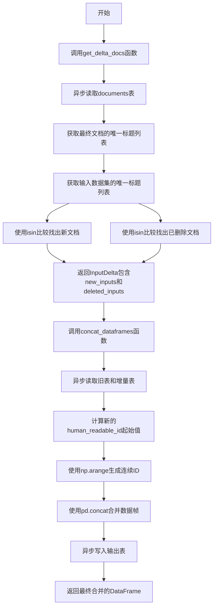
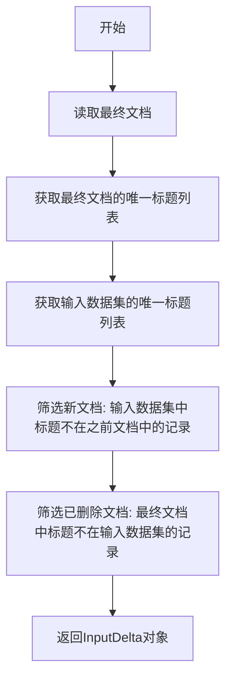
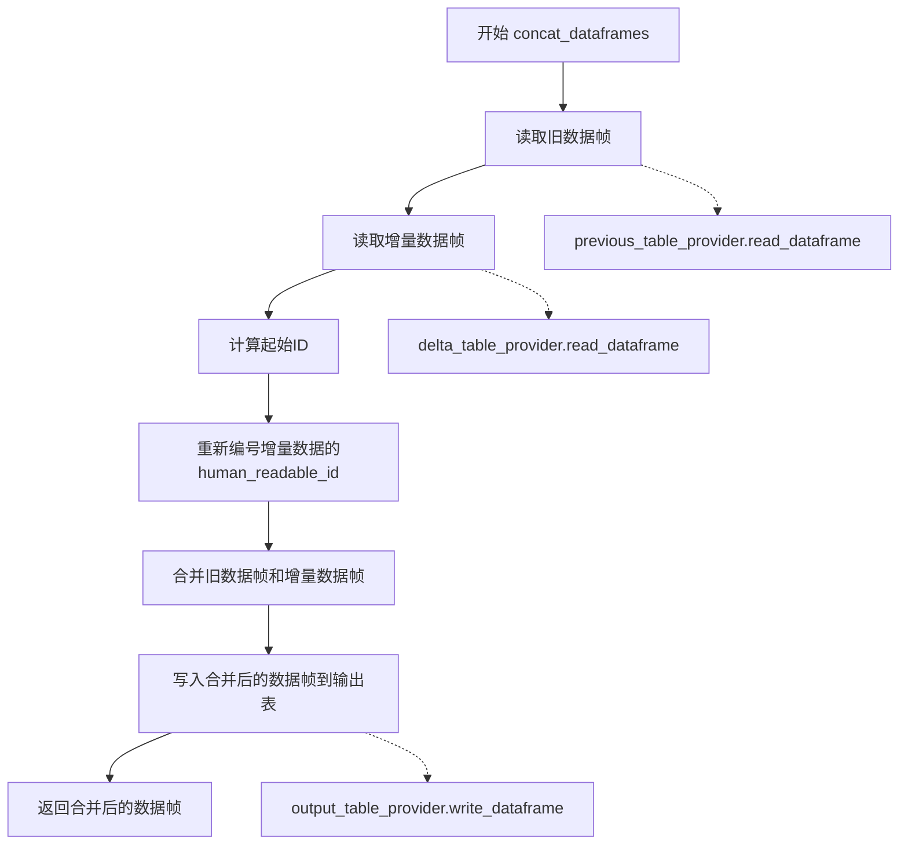
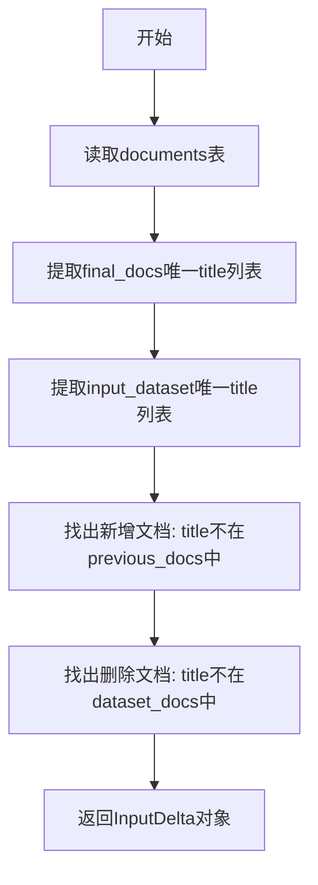
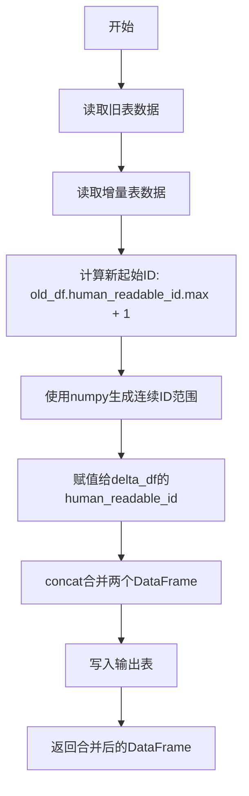

# `graphrag\packages\graphrag\graphrag\index\update\incremental_index.py` 详细设计文档

这是一个用于增量索引（Incremental Indexing）的数据帧操作和工具模块，主要功能是计算输入数据集与已存储文档之间的增量差异（新增和删除的文档），并提供合并数据帧的功能以支持增量更新。

## 整体流程



## 类结构

```
InputDelta (数据类)
├── new_inputs: pd.DataFrame
└── deleted_inputs: pd.DataFrame

全局函数
├── get_delta_docs
└── concat_dataframes
```

## 全局变量及字段


### `get_delta_docs`
    
异步函数，计算输入数据集与已有文档之间的增量差异，返回新增和删除的文档

类型：`async function`
    


### `concat_dataframes`
    
异步函数，将旧数据帧与增量数据帧进行合并，并更新human_readable_id后写入输出表

类型：`async function`
    


### `InputDelta.new_inputs`
    
新增的输入数据帧

类型：`pd.DataFrame`
    


### `InputDelta.deleted_inputs`
    
已删除的输入数据帧

类型：`pd.DataFrame`
    
    

## 全局函数及方法


### `get_delta_docs`

异步函数，计算输入数据集与最终文档之间的增量，识别新增和已删除的文档条目。

参数：

- `input_dataset`：`pd.DataFrame`，输入的数据集
- `table_provider`：`TableProvider`，用于读取之前文档的表提供者

返回值：`InputDelta`，包含新文档和已删除文档的增量对象

#### 流程图



#### 带注释源码

```python
async def get_delta_docs(
    input_dataset: pd.DataFrame, table_provider: TableProvider
) -> InputDelta:
    """Get the delta between the input dataset and the final documents.

    Parameters
    ----------
    input_dataset : pd.DataFrame
        The input dataset.
    table_provider : TableProvider
        The table provider for reading previous documents.

    Returns
    -------
    InputDelta
        The input delta. With new inputs and deleted inputs.
    """
    # 从表提供者读取已存储的文档数据
    final_docs = await table_provider.read_dataframe("documents")

    # 从最终文档中提取唯一的标题列表
    previous_docs: list[str] = final_docs["title"].unique().tolist()
    
    # 从输入数据集中提取唯一的标题列表
    dataset_docs: list[str] = input_dataset["title"].unique().tolist()

    # 使用loc方法筛选新文档：标题不存在于之前文档中的记录
    # 保留DataFrame类型而非Series
    new_docs = input_dataset.loc[~input_dataset["title"].isin(previous_docs)]

    # 使用loc方法筛选已删除文档：标题不存在于当前输入数据集的记录
    # 同样保留DataFrame类型
    deleted_docs = final_docs.loc[~final_docs["title"].isin(dataset_docs)]

    # 返回包含新文档和已删除文档的InputDelta对象
    return InputDelta(new_docs, deleted_docs)
```


### `concat_dataframes`

该函数是一个异步函数，用于合并多个数据帧（旧的表和增量表），对增量数据的 `human_readable_id` 进行重新编号，并将结果写入输出表，最终返回合并后的数据帧。

参数：

- `name`：`str`，要合并的数据帧名称（表名）
- `previous_table_provider`：`TableProvider`，用于读取旧数据的表提供者
- `delta_table_provider`：`TableProvider`，用于读取增量数据的表提供者
- `output_table_provider`：`TableProvider`，用于写入合并后数据的表提供者

返回值：`pd.DataFrame`，合并并重新编号后的数据帧

#### 流程图



#### 带注释源码

```python
async def concat_dataframes(
    name: str,
    previous_table_provider: TableProvider,
    delta_table_provider: TableProvider,
    output_table_provider: TableProvider,
) -> pd.DataFrame:
    """Concatenate dataframes.
    
    异步合并多个数据帧并重新编号
    
    参数:
        name: str - 要合并的表名
        previous_table_provider: TableProvider - 旧数据的表提供者
        delta_table_provider: TableProvider - 增量数据的表提供者
        output_table_provider: TableProvider - 输出表的提供者
    
    返回:
        pd.DataFrame - 合并并重新编号后的数据帧
    """
    # 从旧表提供者读取旧数据帧
    old_df = await previous_table_provider.read_dataframe(name)
    # 从增量表提供者读取增量数据帧
    delta_df = await delta_table_provider.read_dataframe(name)

    # 计算新的起始ID：取旧数据帧中human_readable_id的最大值加1
    initial_id = old_df["human_readable_id"].max() + 1
    # 使用numpy的arange为增量数据帧重新生成human_readable_id
    delta_df["human_readable_id"] = np.arange(initial_id, initial_id + len(delta_df))
    # 使用pd.concat合并两个数据帧，ignore_index=True重置索引，copy=False避免不必要的复制
    final_df = pd.concat([old_df, delta_df], ignore_index=True, copy=False)

    # 将合并后的数据帧写入输出表提供者
    await output_table_provider.write_dataframe(name, final_df)

    # 返回最终合并的数据帧
    return final_df
```

## 关键组件


### InputDelta

一个数据类，用于保存增量索引的输入变更，包含新增的输入数据框和删除的输入数据框。

### get_delta_docs 函数

异步函数，用于计算输入数据集与已存储文档之间的差异，识别新增和删除的文档条目。

### concat_dataframes 函数

异步函数，用于合并旧数据框和增量数据框，重新分配 human_readable_id，并输出合并后的数据框。

### TableProvider 接口

外部依赖接口，提供数据框的读取和写入能力，用于与存储层交互。

### 潜在技术债务

1. 缺少对 title 字段存在性的验证
2. 没有错误处理机制
3. concat_dataframes 中直接修改传入的 delta_df 对象，可能产生副作用
4. 缺少输入数据验证（如空值检查、类型检查）

### 设计约束

- 依赖 pandas 和 numpy 库
- 假设输入数据框都包含 title 和 human_readable_id 字段
- 增量索引基于 title 字段进行去重识别


## 问题及建议


### 已知问题

- **缺乏错误处理**：代码未对边界条件进行检查，如 `final_docs` 为空或不存在 `"title"` 列、`old_df` 为空或 `"human_readable_id"` 列缺失等情况，可能导致运行时异常
- **字段假设不稳健**：假设 `title` 字段存在且可作为唯一标识符，但未验证其唯一性；若存在空值或重复值，比较逻辑会产生错误结果
- **性能隐患**：使用列表存储唯一值进行集合比较，在文档数量庞大时可能导致内存和性能问题；`pd.concat` 在未指定连接键时可能产生意外结果
- **类型安全不足**：未对 `human_readable_id` 列的类型进行验证，直接使用 `.max()` 和 `np.arange`，若该列为非数值类型会导致运行时错误
- **缺少日志记录**：异步操作缺乏日志追踪，调试和问题排查困难
- **未使用连接键优化**：`pd.concat` 未指定 `keys` 或索引列，在大型数据集上可能影响性能

### 优化建议

- 添加输入验证：检查 DataFrame 是否为空、必需列是否存在、数据类型是否符合预期
- 使用集合（set）替代列表进行成员资格检查，提高比较性能
- 增加日志记录关键操作和异常信息，便于监控和调试
- 考虑使用 `merge` 操作替代当前的新增/删除文档逻辑，提高代码可读性和性能
- 对 `human_readable_id` 的分配逻辑添加原子性考虑，避免并发场景下的 ID 冲突
- 提取公共逻辑到工具函数中，提高代码复用性和可测试性

## 其它


### 核心功能概述

这段代码是用于增量索引（Incremental Indexing）的数据框操作工具库，主要提供了检测输入数据集与现有文档集合之间差异（新增和删除文档）的功能，以及合并多个数据框并重新分配人类可读ID的能力，支持异步操作以提高性能。

### 文件的整体运行流程

1. 调用`get_delta_docs`函数，传入输入数据集和表提供程序
2. 通过表提供程序读取现有的documents表
3. 提取现有文档和输入数据集的唯一标题列表
4. 使用pandas的布尔索引找出新增文档（在数据集中但不在现有文档中）和删除文档（在现有文档中但不在数据集中）
5. 返回包含新增和删除文档的`InputDelta`对象
6. 调用`concat_dataframes`函数进行数据合并
7. 分别读取旧表和增量表的数据框
8. 计算新的human_readable_id起始值
9. 使用numpy生成连续ID并赋值
10. 使用pd.concat合并数据框
11. 将合并后的数据框写入输出表提供程序

### 类的详细信息

#### InputDelta类

InputDelta是一个dataclass，用于封装增量索引中的输入变化数据。

**类字段：**

| 字段名称 | 类型 | 描述 |
|---------|------|------|
| new_inputs | pd.DataFrame | 新增的输入文档数据框 |
| deleted_inputs | pd.DataFrame | 删除的输入文档数据框 |

### 全局函数详细信息

#### get_delta_docs函数

获取输入数据集与最终文档之间的增量差异。

**函数签名：**
```python
async def get_delta_docs(
    input_dataset: pd.DataFrame, 
    table_provider: TableProvider
) -> InputDelta
```

**参数：**

| 参数名称 | 参数类型 | 参数描述 |
|---------|---------|---------|
| input_dataset | pd.DataFrame | 输入的数据集，包含待索引的文档 |
| table_provider | TableProvider | 表提供程序，用于读取之前的文档数据 |

**返回值：**

| 返回值类型 | 返回值描述 |
|-----------|-----------|
| InputDelta | 包含新增输入和删除输入的数据类对象 |

**Mermaid流程图：**


**带注释源码：**
```python
async def get_delta_docs(
    input_dataset: pd.DataFrame, table_provider: TableProvider
) -> InputDelta:
    """Get the delta between the input dataset and the final documents.

    Parameters
    ----------
    input_dataset : pd.DataFrame
        The input dataset.
    table_provider : TableProvider
        The table provider for reading previous documents.

    Returns
    -------
    InputDelta
        The input delta. With new inputs and deleted inputs.
    """
    # 异步读取现有的documents表
    final_docs = await table_provider.read_dataframe("documents")

    # 从最终文档和数据集中选择唯一的title
    previous_docs: list[str] = final_docs["title"].unique().tolist()
    dataset_docs: list[str] = input_dataset["title"].unique().tolist()

    # 获取新增文档（使用loc确保返回DataFrame）
    new_docs = input_dataset.loc[~input_dataset["title"].isin(previous_docs)]

    # 获取删除的文档（同样使用loc确保返回DataFrame）
    deleted_docs = final_docs.loc[~final_docs["title"].isin(dataset_docs)]

    return InputDelta(new_docs, deleted_docs)
```

#### concat_dataframes函数

合并多个数据框并重新分配人类可读ID。

**函数签名：**
```python
async def concat_dataframes(
    name: str,
    previous_table_provider: TableProvider,
    delta_table_provider: TableProvider,
    output_table_provider: TableProvider,
) -> pd.DataFrame
```

**参数：**

| 参数名称 | 参数类型 | 参数描述 |
|---------|---------|---------|
| name | str | 要合并的表名称 |
| previous_table_provider | TableProvider | 提供旧版本数据的表提供程序 |
| delta_table_provider | TableProvider | 提供增量数据的表提供程序 |
| output_table_provider | TableProvider | 输出合并结果的表提供程序 |

**返回值：**

| 返回值类型 | 返回值描述 |
|-----------|-----------|
| pd.DataFrame | 合并后的数据框 |

**Mermaid流程图：**


**带注释源码：**
```python
async def concat_dataframes(
    name: str,
    previous_table_provider: TableProvider,
    delta_table_provider: TableProvider,
    output_table_provider: TableProvider,
) -> pd.DataFrame:
    """Concatenate dataframes."""
    # 读取旧表和增量表的数据框
    old_df = await previous_table_provider.read_dataframe(name)
    delta_df = await delta_table_provider.read_dataframe(name)

    # 合并最终文档，计算起始ID
    initial_id = old_df["human_readable_id"].max() + 1
    # 使用numpy生成连续的人类可读ID
    delta_df["human_readable_id"] = np.arange(initial_id, initial_id + len(delta_df))
    # 忽略索引合并数据框，copy=False提高性能
    final_df = pd.concat([old_df, delta_df], ignore_index=True, copy=False)

    # 写入输出表并返回合并结果
    await output_table_provider.write_dataframe(name, final_df)

    return final_df
```

### 关键组件信息

| 组件名称 | 描述 |
|---------|------|
| InputDelta | 数据类，封装新增和删除的文档数据框 |
| get_delta_docs | 异步函数，用于检测输入数据集与现有文档的差异 |
| concat_dataframes | 异步函数，用于合并数据框并重新分配ID |
| TableProvider | 接口，抽象数据表的读写操作 |

### 潜在的技术债务或优化空间

1. **错误处理不足**：缺少对空数据框、表不存在、列不存在等边界条件的处理
2. **日志记录缺失**：没有日志记录关键操作和错误信息
3. **硬编码表名**：表名"documents"硬编码在函数中，应作为参数或配置
4. **性能优化空间**：可考虑批量操作、缓存机制、增量更新而非全量合并
5. **类型注解不完整**：部分变量缺少类型注解（如previous_docs, dataset_docs）
6. **ID冲突风险**：在并发场景下可能出现ID冲突问题

### 设计目标与约束

- **设计目标**：支持增量索引场景下的文档差异检测和数据框合并
- **性能约束**：使用异步操作提高并发性能，使用copy=False减少内存开销
- **依赖约束**：依赖pandas、numpy和TableProvider接口

### 错误处理与异常设计

- 当前版本缺少显式的异常处理机制
- 建议增加对以下场景的处理：
  - 表不存在或无法读取
  - 数据框为空或列不存在
  - human_readable_id列不存在
  - 并发冲突

### 数据流与状态机

1. **输入状态**：原始输入数据集（DataFrame）
2. **检测状态**：通过比较识别新增和删除的文档
3. **合并状态**：将增量数据与历史数据合并
4. **输出状态**：写入合并后的数据到输出表

### 外部依赖与接口契约

- **pandas**：数据框操作的核心依赖
- **numpy**：生成连续ID序列
- **TableProvider**：抽象数据访问接口，需实现read_dataframe和write_dataframe方法
- **接口契约**：
  - read_dataframe方法接收表名字符串，返回pd.DataFrame
  - write_dataframe方法接收表名字符串和pd.DataFrame，无返回值

### 其它项目

- **并发考虑**：在高并发场景下，ID生成策略需要加锁或使用分布式ID生成器
- **可测试性**：建议增加单元测试覆盖边界条件
- **配置化**：表名和关键参数应考虑配置化以提高灵活性

    