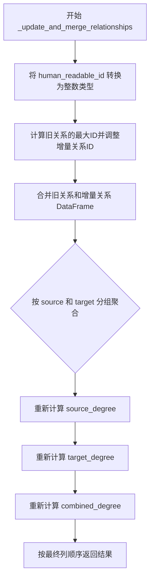
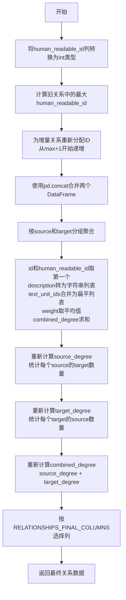

# `graphrag\packages\graphrag\graphrag\index\update\relationships.py` 详细设计文档

该文件包含用于增量索引（Incremental Indexing）的关系数据操作和工具函数，主要提供关系数据的更新和合并功能，能够将旧的关​​系数据与新增的增量关系数据合并，并重新计算相关的度数信息。

## 整体流程



## 类结构

```
无类定义，仅包含全局函数
```

## 全局变量及字段


### `RELATIONSHIPS_FINAL_COLUMNS`
    
从 graphrag.data_model.schemas 导入的最终关系列定义，用于指定关系数据帧的列顺序

类型：`Any`
    


    

## 全局函数及方法


### `_update_and_merge_relationships`

该函数是增量索引中用于更新和合并关系数据的核心函数，负责将新增的关系数据与现有关系数据进行合并，通过调整增量数据的ID、合并DataFrame、按源目标和并消除冲突，并重新计算节点的度数信息。

参数：

- `old_relationships`：`pd.DataFrame`，旧的关系数据表，包含已有的关系记录
- `delta_relationships`：`pd.DataFrame`，增量（新增）的关系数据表，包含需要合并的新关系记录

返回值：`pd.DataFrame`，合并并更新后的关系数据表，包含所有关系且度数信息已重新计算

#### 流程图



#### 带注释源码

```python
def _update_and_merge_relationships(
    old_relationships: pd.DataFrame, delta_relationships: pd.DataFrame
) -> pd.DataFrame:
    """Update and merge relationships.

    Parameters
    ----------
    old_relationships : pd.DataFrame
        The old relationships.
    delta_relationships : pd.DataFrame
        The delta relationships.

    Returns
    -------
    pd.DataFrame
        The updated relationships.
    """
    # Step 1: 确保增量关系和旧关系的human_readable_id列都是整数类型
    # 以便后续进行数值比较和运算
    delta_relationships["human_readable_id"] = delta_relationships[
        "human_readable_id"
    ].astype(int)
    old_relationships["human_readable_id"] = old_relationships[
        "human_readable_id"
    ].astype(int)

    # Step 2: 计算旧关系中最大的human_readable_id
    # 作为增量关系ID的起始值，确保新ID不会与旧ID冲突
    initial_id = old_relationships["human_readable_id"].max() + 1
    
    # Step 3: 为增量关系重新分配连续的ID
    # 从initial_id开始，长度与增量关系数量相同
    delta_relationships["human_readable_id"] = np.arange(
        initial_id, initial_id + len(delta_relationships)
    )

    # Step 4: 使用pd.concat合并两个DataFrame
    # ignore_index=True重置索引，copy=False避免不必要的内存复制
    merged_relationships = pd.concat(
        [old_relationships, delta_relationships], ignore_index=True, copy=False
    )

    # Step 5: 按source和target分组，聚合冲突字段
    # 对于相同source-target对的关系，进行如下聚合：
    aggregated = (
        merged_relationships
        .groupby(["source", "target"])
        .agg({
            "id": "first",                          # 取第一个id
            "human_readable_id": "first",           # 取第一个human_readable_id
            "description": lambda x: list(x.astype(str)),  # 将所有description转为字符串并合并为列表
            # 使用itertools.chain将嵌套的nd.array展平为单个列表
            "text_unit_ids": lambda x: list(itertools.chain(*x.tolist())),
            "weight": "mean",                       # 权重取平均值
            "combined_degree": "sum",               # combined_degree求和
        })
        .reset_index()
    )

    # Step 6: 将聚合结果强制转换为DataFrame类型
    final_relationships: pd.DataFrame = pd.DataFrame(aggregated)

    # Step 7: 重新计算source_degree
    # 统计每个source节点有多少个target相连
    final_relationships["source_degree"] = final_relationships.groupby("source")[
        "target"
    ].transform("count")
    
    # Step 8: 重新计算target_degree
    # 统计每个target节点有多少个source相连
    final_relationships["target_degree"] = final_relationships.groupby("target")[
        "source"
    ].transform("count")

    # Step 9: 重新计算combined_degree
    # combined_degree = source_degree + target_degree
    final_relationships["combined_degree"] = (
        final_relationships["source_degree"] + final_relationships["target_degree"]
    )

    # Step 10: 按预定义的列顺序返回最终结果
    # RELATIONSHIPS_FINAL_COLUMNS定义了输出应该包含哪些列及顺序
    return final_relationships.loc[
        :,
        RELATIONSHIPS_FINAL_COLUMNS,
    ]
```

## 关键组件


### 关系增量更新与合并机制

该函数实现增量索引中关系数据的更新与合并，通过调整增量数据的human_readable_id、合并DataFrame、按source和target分组聚合、重新计算度数等步骤，将旧关系与增量关系合并为最终的关系数据集。

### 张量/数组展平操作

使用`itertools.chain(*x.tolist())`将嵌套的text_unit_ids数组（ndarray列表）展平为单个列表，这是处理关系数据中关联文本单元的关键逻辑。

### 度数重计算机制

通过groupby transform操作重新计算source_degree、target_degree和combined_degree，确保合并后关系图中各节点的度数准确反映新的图结构状态。

### ID冲突处理策略

通过获取旧关系中human_readable_id的最大值并为增量关系分配连续的更大ID，避免合并时的ID冲突问题。

### 分组聚合逻辑

使用groupby对source和target进行分组，对description使用lambda转为字符串列表，对text_unit_ids使用itertools.chain展平，对weight取平均值，对combined_degree求和，实现多维度冲突解决。


## 问题及建议


### 已知问题

- **空数据未处理**：当 `old_relationships` 为空DataFrame时，调用 `old_relationships["human_readable_id"].max()` 会返回 `NaN`，导致后续 `initial_id + len(delta_relationships)` 计算出错
- **原地修改输入参数**：代码直接修改了传入的 `old_relationships` 和 `delta_relationships` 的 `human_readable_id` 列，违反了函数式编程原则，会产生副作用
- **聚合逻辑可能产生嵌套列表**：`description` 字段的聚合使用 `lambda x: list(x.astype(str))`，在多行合并时会产生嵌套列表而非扁平列表
- **类型提示缺失**：函数缺少参数和返回值的类型注解，影响代码可读性和静态类型检查
- **未验证必需列存在性**：未检查输入 DataFrame 是否包含必需的列（如 `source`、`target`、`id` 等），可能在运行时引发 `KeyError`
- **ID 生成策略简单**：仅使用 `max() + 1` 的方式生成 ID，在并发场景或高并发写入时可能产生 ID 冲突

### 优化建议

- 在函数开头添加空数据检查处理：`if old_relationships.empty: return delta_relationships.copy()` 或返回空 DataFrame
- 使用 `.copy()` 创建副本后再修改，避免修改原 DataFrame：`delta_relationships = delta_relationships.copy()`
- 修复聚合逻辑，使用 `"first"` 或 `"; ".join()` 等方式处理 `description` 字段，避免嵌套列表
- 添加完整的类型注解：`def _update_and_merge_relationships(old_relationships: pd.DataFrame, delta_relationships: pd.DataFrame) -> pd.DataFrame:`
- 在函数入口添加列存在性验证，或使用 `schema` 定义进行验证
- 考虑使用 UUID 或分布式 ID 生成器替代简单的自增 ID
- 将重复的 groupby 操作合并，减少遍历次数以提升性能

## 其它


### 设计目标与约束

本模块的设计目标是在增量索引（Incremental Indexing）场景下，高效地合并旧的relationships数据与新增的delta relationships数据，确保数据一致性同时保持human_readable_id的唯一性和连续性。约束条件包括：输入的DataFrame必须包含source、target、human_readable_id等必要列，且source和target应为有效的实体标识符。

### 错误处理与异常设计

1. **空DataFrame处理**：当old_relationships或delta_relationships为空DataFrame时，函数应能正常处理。若两者都为空，应返回空的DataFrame但保留正确的列结构；若仅delta_relationships为空，应直接返回old_relationships的副本。
2. **类型转换异常**：human_readable_id列转换为int时可能抛出ValueError，应捕获并抛出更具描述性的自定义异常。
3. **缺失列异常**：若输入DataFrame缺少必需列（如source、target、id等），应在函数开始时进行校验并抛出KeyError。
4. **NaN/None值处理**：source或target列中可能存在NaN值，应在聚合前进行过滤或填充处理。

### 数据流与状态机

该函数处于增量索引工作流的合并阶段。输入为两个DataFrame（old_relationships和delta_relationships），输出为合并后的final_relationships。状态转换包括：ID调整状态（为delta数据分配新的human_readable_id）→ 合并状态（concat两个DataFrame）→ 聚合状态（按source-target分组聚合）→ 度量重计算状态（重新计算degree相关列）→ 输出状态（按RELATIONSHIPS_FINAL_COLUMNS筛选列）。

### 外部依赖与接口契约

1. **pandas依赖**：要求pandas版本≥1.0.0，以支持copy=False参数优化内存使用。
2. **numpy依赖**：用于生成连续的human_readable_id序列。
3. **itertools依赖**：用于展平嵌套列表（text_unit_ids的合并）。
4. **RELATIONSHIPS_FINAL_COLUMNS**：从graphrag.data_model.schemas导入，定义了输出DataFrame的列顺序和列名，调用方需确保此常量已正确定义。

### 性能考虑与优化空间

1. **时间复杂度**：主要操作包括concat（O(n+m)）、groupby-agg（O(n+m)）、transform（O(n+m)），总体时间复杂度为O(n+m)，其中n和m分别为old和delta数据的行数。
2. **空间复杂度**：聚合过程中description列会转换为字符串列表再合并，可能导致内存峰值；text_unit_ids的chain操作也会产生中间列表。建议对大量数据的场景采用分批处理或流式聚合。
3. **copy=False优化**：concat时使用copy=False减少不必要的内存分配，但后续的astype操作可能仍会触发复制。
4. **向量化操作**：groupby后的transform操作已使用向量化实现，但description的lambda函数使用Python循环，可考虑使用pandas的string操作或numpy向量化进一步优化。

### 边界条件与特殊场景

1. **旧数据human_readable_id为空的处理**：若old_relationships的human_readable_id全为空，max()会返回NaN，导致后续计算错误，应先填充默认值。
2. **重复source-target对**：函数通过groupby聚合处理重复对，但aggregation逻辑中description使用list(x.astype(str))可能保留过多信息，需确认业务需求是否正确。
3. **权重计算**：使用mean聚合权重，可能导致精度问题，对于增量场景可能需要更复杂的权重合并策略。

### 版本兼容性说明

该代码使用Python 3.8+的语法特性（如类型注解中的pd.DataFrame）。numpy的arange和pandas的copy=False参数均需较新版本支持。需在requirements.txt中明确标注依赖版本范围。

### 测试用例建议

应覆盖以下场景：空DataFrame输入、仅old有数据、仅delta有数据、old和delta均有数据且无重复、存在重复source-target对、human_readable_id存在空值或负数、text_unit_ids为嵌套列表的情况。


    