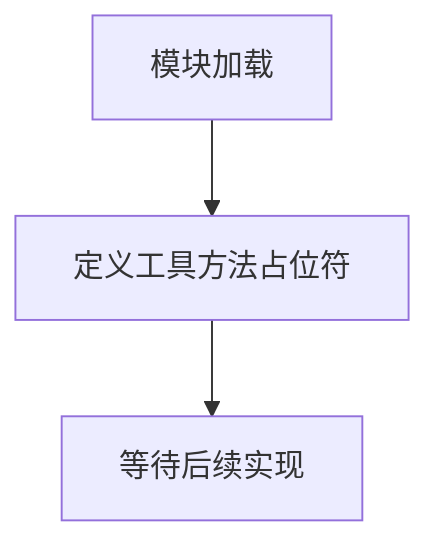

# `graphrag\packages\graphrag\graphrag\index\utils\__init__.py` 详细设计文档

这是一个工具方法定义文件，作为占位符存在，仅包含版权声明和模块基础文档字符串，尚未实现具体的工具方法。

## 整体流程



## 类结构

```
Utils (工具模块)
└── (暂无具体类定义)
```

## 全局变量及字段


    

## 全局函数及方法


## 关键组件


### Utils模块

占位符工具方法模块，定义在"Utils methods definition"文档字符串中，用于存放通用工具函数和方法。


## 问题及建议


### 已知问题

-   模块仅包含版权声明和空的模块文档字符串，无任何实际功能实现
-   无法基于空代码进行架构、逻辑或技术债务的深入分析
-   模块名称"Utils methods definition"表明应为工具方法定义，但缺乏具体实现

### 优化建议

-   明确该工具模块的具体职责和功能范围，补充实际的工具方法实现
-   为每个工具方法编写详细的文档字符串，说明功能、参数和返回值
-   根据项目需求，添加常用的工具函数（如文件操作、数据处理、字符串处理等）
-   建立统一的错误处理机制和异常设计规范
-   补充单元测试以确保工具方法的可靠性和稳定性


## 其它


### 项目概述

该代码文件为Microsoft Corporation的utils工具方法定义模块，目前处于初始状态，仅包含版权声明和基本的模块文档字符串，尚未实现具体的工具方法。

### 设计目标与约束

设计目标：建立一个通用的工具方法库，为项目提供可复用的辅助功能模块。
约束条件：
- 遵循MIT开源许可证
- 保持代码的轻量级和高效性
- 确保与主项目的兼容性

### 整体运行流程

由于当前代码仅包含文件头部信息，暂无实际运行流程。建议在实现具体工具方法后，建立清晰的初始化和调用流程。

### 全局变量

无全局变量定义。

### 全局函数

无全局函数定义。

### 关键组件信息

- **Utils模块基础框架**：提供工具方法的基础架构，为后续扩展预留空间

### 错误处理与异常设计

由于当前代码未实现具体功能，暂无错误处理机制。建议在实现具体工具方法时：
- 定义清晰的异常类型
- 建立统一的错误码体系
- 实现适当的异常捕获和日志记录

### 数据流与状态机

当前代码未定义数据流和状态机。建议在实现具体工具方法时：
- 明确输入输出数据格式
- 定义状态转换逻辑
- 建立数据验证机制

### 外部依赖与接口契约

当前代码无外部依赖。建议在实现具体工具方法时：
- 明确所依赖的第三方库
- 定义清晰的接口规范
- 建立版本兼容性策略

### 潜在的技术债务或优化空间

1. **功能缺失**：当前模块仅包含文件头，缺少实际的工具方法实现
2. **文档完善**：需要补充详细的API文档和使用示例
3. **测试覆盖**：需要建立完整的单元测试和集成测试体系

### 其它项目

- **代码规范**：遵循PEP 8编码规范
- **版本管理**：使用语义化版本控制
- **性能考量**：在实现时需考虑时间和空间复杂度
- **安全性**：确保工具方法不引入安全漏洞

### 类结构

无类定义。

### 类字段

无类字段定义。

### 类方法

无类方法定义。


    