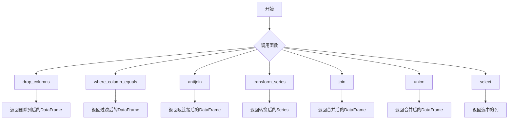
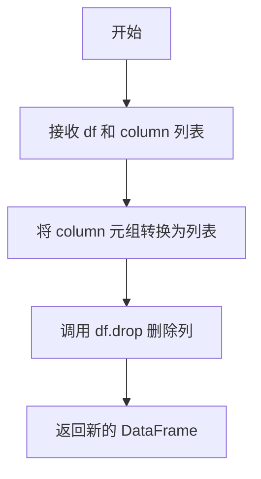
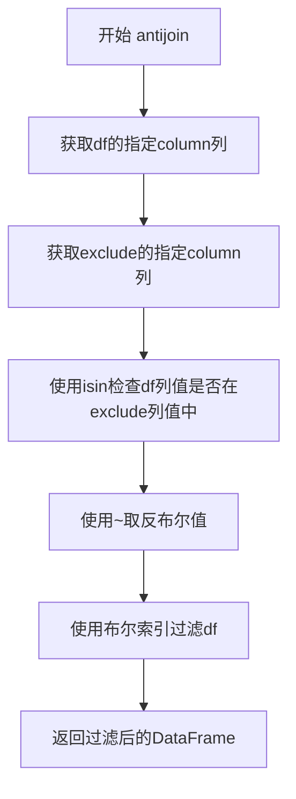
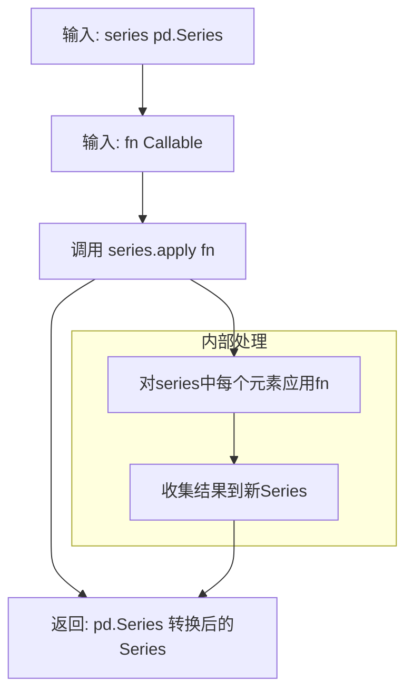
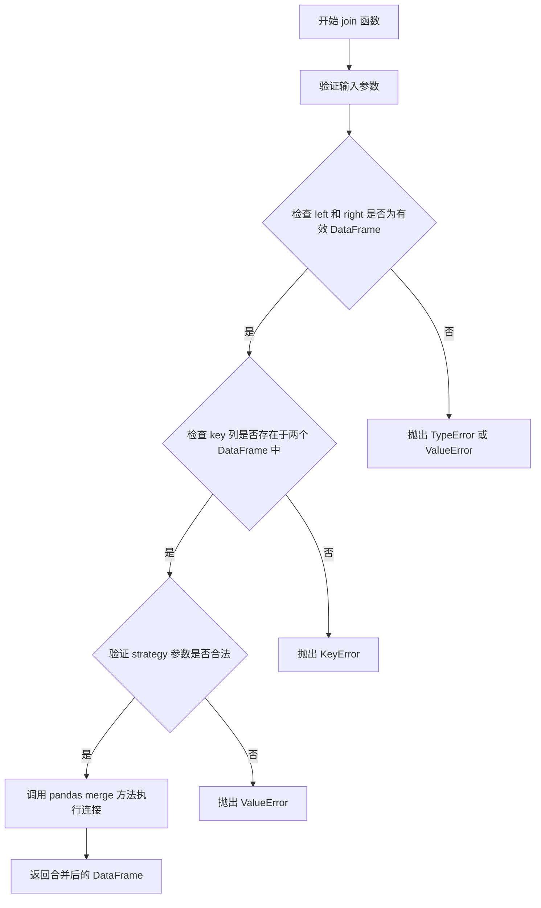
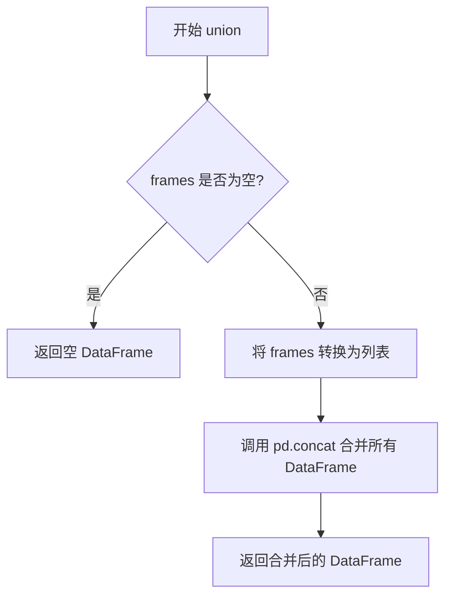

# `graphrag\packages\graphrag\graphrag\index\utils\dataframes.py` 详细设计文档

一个DataFrame工具模块，提供数据帧的列删除、过滤、反连接、转换、连接、联合和列选择等常用操作函数，用于简化pandas数据处理流程。

## 整体流程



## 类结构

```
模块级函数 (无类)
├── drop_columns
├── where_column_equals
├── antijoin
├── transform_series
├── join
├── union
└── select
```

## 全局变量及字段


### `pd`
    
Pandas库模块别名，提供DataFrame和Series数据结构及数据操作功能

类型：`module`
    


### `Callable`
    
用于声明可调用对象（函数）类型的类型提示工具

类型：`typing.Callable`
    


### `Any`
    
表示任意类型的类型提示，相当于动态类型

类型：`typing.Any`
    


### `cast`
    
类型转换函数，用于在类型检查时进行显式类型转换

类型：`typing.cast`
    


### `MergeHow`
    
DataFrame连接操作的方式类型，支持'left', 'right', 'inner', 'outer', 'cross'等值

类型：`pandas._typing.MergeHow`
    


    

## 全局函数及方法


### `drop_columns`

从 DataFrame 中删除指定的列，并返回删除列后的新 DataFrame。

参数：

- `df`：`pd.DataFrame`，输入的 DataFrame
- `*column`：`str`，要删除的列名（可变参数，可接受多个列名）

返回值：`pd.DataFrame`，删除指定列后的 DataFrame

#### 流程图



#### 带注释源码

```python
def drop_columns(df: pd.DataFrame, *column: str) -> pd.DataFrame:
    """Drop columns from a dataframe."""
    # 将可变参数 column（元组）转换为列表
    # 使用 axis=1 指定按列删除（axis=0 按行删除）
    return df.drop(list(column), axis=1)
```


### `where_column_equals`

该函数是 DataFrame 工具模块中的一个过滤函数，用于根据指定列的值精确匹配来筛选 DataFrame 中的行，返回满足条件的新 DataFrame。

参数：

- `df`：`pd.DataFrame`，输入的需要过滤的 DataFrame
- `column`：`str`，用于执行等值比较的列名
- `value`：`Any`，要匹配的值，可以是任意可比较的类型

返回值：`pd.DataFrame`，仅包含列值与指定值相等的行的新 DataFrame

#### 流程图

```mermaid
flowchart TD
    A[开始: where_column_equals] --> B[接收参数 df, column, value]
    B --> C[执行过滤: df[column] == value]
    C --> D[生成布尔 Series]
    D --> E[使用布尔索引过滤 DataFrame]
    E --> F[使用 cast 转换为 pd.DataFrame 类型]
    F --> G[返回过滤后的 DataFrame]
```

#### 带注释源码

```python
def where_column_equals(df: pd.DataFrame, column: str, value: Any) -> pd.DataFrame:
    """Return a filtered DataFrame where a column equals a value.
    
    Arguments:
    * df: 需要过滤的输入 DataFrame
    * column: 要进行等值比较的列名
    * value: 要匹配的目标值
    
    Returns:
    * 包含所有满足 df[column] == value 条件的行的新 DataFrame
    """
    # 使用布尔索引过滤：先筛选出列值等于value的行，再通过df[...]获取对应的行
    # cast 用于确保返回类型被正确标注为 pd.DataFrame（尽管实际返回类型已经是 DataFrame）
    return cast("pd.DataFrame", df[df[column] == value])
```

---

## 补充信息

### 1. 文件整体运行流程

该模块（`DataFrame utilities`）提供了一系列 DataFrame 操作的工具函数，主要流程为：
- **数据输入**：接收原始 DataFrame 和相关参数
- **数据处理**：通过各种工具函数进行转换、过滤、连接等操作
- **数据输出**：返回处理后的 DataFrame

具体到 `where_column_equals` 函数：
1. 接收 DataFrame、列名和目标值
2. 使用布尔索引进行行过滤
3. 返回过滤后的 DataFrame

### 2. 全局函数详情

| 函数名 | 参数 | 返回值 | 描述 |
|--------|------|--------|------|
| `drop_columns` | `df: pd.DataFrame, *column: str` | `pd.DataFrame` | 从 DataFrame 中删除指定列 |
| `where_column_equals` | `df: pd.DataFrame, column: str, value: Any` | `pd.DataFrame` | 按列值等值过滤 DataFrame |
| `antijoin` | `df: pd.DataFrame, exclude: pd.DataFrame, column: str` | `pd.DataFrame` | 返回左表排除右表后的数据 |
| `transform_series` | `series: pd.Series, fn: Callable[[Any], Any]` | `pd.Series` | 对 Series 应用转换函数 |
| `join` | `left: pd.DataFrame, right: pd.DataFrame, key: str, strategy: MergeHow` | `pd.DataFrame` | 执行表连接操作 |
| `union` | `*frames: pd.DataFrame` | `pd.DataFrame` | 合并多个 DataFrame |
| `select` | `df: pd.DataFrame, *columns: str` | `pd.DataFrame` | 选择指定的列 |

### 3. 关键组件信息

| 组件名称 | 描述 |
|----------|------|
| `pd.DataFrame` | pandas 核心数据结构，用于存储表格数据 |
| `pd.Series` | pandas 一维数组结构 |
| `cast` | 类型强制转换工具，用于类型提示 |
| `Callable` | 可调用对象类型，用于函数引用 |

### 4. 潜在的技术债务或优化空间

- **错误处理缺失**：函数未对以下边界情况进行处理：
  - 列名不存在于 DataFrame 中（会抛出 `KeyError`）
  - 空 DataFrame 输入
  - `value` 为 `None` 时的预期行为（当前会匹配所有 `None` 值）
- **类型转换开销**：使用 `cast` 而非实际的类型检查或转换，在严格类型检查场景下可能不够严谨
- **性能考虑**：对于大型 DataFrame，每次调用都会创建新的 DataFrame 副本，可考虑是否需要原地操作选项

### 5. 其它项目

**设计目标与约束**：
- 保持函数简洁单一职责
- 返回类型严格为 `pd.DataFrame`
- 依赖最小化，仅依赖 pandas 和 typing 标准库

**错误处理与异常设计**：
- 当前实现依赖 pandas 内部的异常传播
- 建议添加列存在性验证和类型检查

**数据流与状态机**：
- 该函数为纯函数，无副作用
- 输入 DataFrame 不被修改，返回新的 DataFrame

**外部依赖与接口契约**：
- 依赖：`pandas`、`typing`
- 接口契约：传入有效的 DataFrame、存在的列名，返回过滤后的 DataFrame


### `antijoin`

该函数执行反连接（Anti-Join）操作，返回主DataFrame中列值不在排除DataFrame中的所有行，实现从df中排除exclude包含的特定列值对应的行。

参数：

- `df`：`pd.DataFrame`，要应用排除操作的主DataFrame
- `exclude`：`pd.DataFrame`，包含需要排除的行的DataFrame
- `column`：`str`，用于执行反连接的列名

返回值：`pd.DataFrame`，执行反连接后的DataFrame，包含原df中列值不在exclude中的所有行

#### 流程图



#### 带注释源码

```python
def antijoin(df: pd.DataFrame, exclude: pd.DataFrame, column: str) -> pd.DataFrame:
    """Return an anti-joined dataframe.

    Arguments:
    * df: The DataFrame to apply the exclusion to
    * exclude: The DataFrame containing rows to remove.
    * column: The join-on column.
    """
    # 使用isin检查df的column列中哪些值存在于exclude的column列中
    # ~操作符取反，得到不在exclude中的行的布尔掩码
    # loc使用布尔掩码筛选出不在exclude中的行并返回
    return df.loc[~df.loc[:, column].isin(exclude.loc[:, column])]
```


### `transform_series`

对给定的pandas Series应用一个转换函数，返回转换后的新Series。

参数：

-  `series`：`pd.Series`，输入的pandas Series对象
-  `fn`：`Callable[[Any], Any]，应用于Series每个元素的转换函数

返回值：`pd.Series`，应用转换函数后得到的新Series

#### 流程图



#### 带注释源码

```python
def transform_series(series: pd.Series, fn: Callable[[Any], Any]) -> pd.Series:
    """Apply a transformation function to a series.
    
    Arguments:
    * series: 输入的pandas Series对象
    * fn: 用于转换Series中每个元素的函数，接收任意类型参数，返回任意类型结果
    
    Returns:
    * 转换后的pandas Series对象
    """
    # 使用pandas的apply方法将fn应用于Series的每个元素
    # 使用cast确保返回类型为pd.Series，以满足类型提示要求
    return cast("pd.Series", series.apply(fn))
```


### `join`

执行表格数据连接操作，将两个 DataFrame 按照指定的键列和连接策略合并为一个 DataFrame。

参数：

- `left`：`pd.DataFrame`，左侧数据框，作为连接的主表
- `right`：`pd.DataFrame`，右侧数据框，作为连接的要合并的表
- `key`：`str`，连接键列名，两个数据框将基于此列进行匹配
- `strategy`：`MergeHow`，连接策略，默认为 "left"（左连接），可选值包括 "left", "right", "inner", "outer", "cross"

返回值：`pd.DataFrame`，连接操作完成后返回的结果数据框

#### 流程图



#### 带注释源码

```python
def join(
    left: pd.DataFrame, right: pd.DataFrame, key: str, strategy: MergeHow = "left"
) -> pd.DataFrame:
    """Perform a table join.
    
    使用 pandas 的 merge 方法将两个 DataFrame 按照指定键列和连接策略进行合并。
    
    Arguments:
        left: 左侧 DataFrame，作为连接的主表
        right: 右侧 DataFrame，要与左侧表合并的表
        key: 连接键列名，两个表将基于此列进行匹配
        strategy: 连接方式，默认为 'left'（左外连接），支持 'inner', 'outer', 'right', 'cross'
    
    Returns:
        合并后的 DataFrame
    
    Example:
        >>> df1 = pd.DataFrame({'id': [1, 2, 3], 'name': ['Alice', 'Bob', 'Charlie']})
        >>> df2 = pd.DataFrame({'id': [1, 2, 4], 'age': [25, 30, 35]})
        >>> join(df1, df2, 'id', 'inner')
           name  id  age
        0  Alice   1   25
        1    Bob   2   30
    """
    # 调用 pandas DataFrame 的 merge 方法执行连接操作
    # left.merge() 会在 left DataFrame 的基础上合并 right DataFrame
    # on 参数指定连接键
    # how 参数指定连接策略（left, right, inner, outer, cross）
    return left.merge(right, on=key, how=strategy)
```


### `union`

执行 DataFrame 的合并操作，将多个 DataFrame 按行堆叠合并成一个 DataFrame。

参数：

- `*frames`：`pd.DataFrame`，可变数量的 DataFrame 对象，表示要合并的多个数据框

返回值：`pd.DataFrame`，返回合并后的 DataFrame

#### 流程图



#### 带注释源码

```python
def union(*frames: pd.DataFrame) -> pd.DataFrame:
    """Perform a union operation on the given set of dataframes."""
    # 将可变参数 frames 转换为列表
    # *frames 允许传入任意数量的 DataFrame 参数
    # pd.concat 会按行堆叠这些 DataFrame（axis=0 是默认值）
    return pd.concat(list(frames))
```


### `select`

从 DataFrame 中选择指定的列，返回包含这些列的新 DataFrame。

参数：

- `df`：`pd.DataFrame`，输入的原始 DataFrame
- `*columns`：`str`，可变数量的列名参数，表示需要选择的列

返回值：`pd.DataFrame`，包含指定列的新 DataFrame

#### 流程图

```mermaid
flowchart TD
    A[开始 select 函数] --> B[接收 df 和 columns 参数]
    B --> C[将 columns 元组转换为列表]
    C --> D[使用 df[list(columns)] 选择列]
    D --> E[使用 cast 转换为 pd.DataFrame 类型]
    E --> F[返回结果 DataFrame]
```

#### 带注释源码

```python
def select(df: pd.DataFrame, *columns: str) -> pd.DataFrame:
    """Select columns from a dataframe."""
    # 将可变参数 columns（tuple）转换为 list
    # 然后使用 DataFrame 的列索引语法选择指定列
    # 最后通过 cast 确保返回类型为 pd.DataFrame
    return cast("pd.DataFrame", df[list(columns)])
```

## 关键组件


### 列操作组件

提供列级别的数据操作功能，包括列的删除（drop_columns）和列的选择（select），支持对DataFrame进行列级别的结构调整。

### 数据过滤组件

提供基于条件的行过滤功能，where_column_equals实现等值过滤，antijoin实现反连接操作用于排除指定列中存在的值。

### 数据转换组件

transform_series提供对数据列的通用转换能力，通过传入的回调函数对Series中的每个元素进行转换处理。

### 数据合并组件

提供表级别的合并操作，join支持多种连接策略（left/right/inner/outer），union支持多个DataFrame的纵向合并。


## 问题及建议


### 已知问题

- **缺少输入验证**：函数未检查必需参数的有效性，如检查列是否存在、DataFrame是否为空，可能导致运行时错误
- **类型安全问题**：大量使用`cast`进行类型转换，可能掩盖潜在的运行时错误，降低类型安全性和可靠性
- **antijoin性能问题**：当前实现使用`isin`+取反，对于大数据集效率较低，可考虑使用merge实现更高效的antijoin
- **DataFrame视图风险**：`drop_columns`、`select`等函数可能返回DataFrame视图而非副本，导致意外修改原始数据
- **union函数冗余**：直接将`frames`转换为list再传递是多此一举，可以直接传递`frames`
- **错误处理缺失**：函数未处理空DataFrame、None值等边界情况
- **docstring不完整**：缺少参数类型的详细描述和返回值说明

### 优化建议

- 添加输入验证逻辑，如验证列名是否存在、DataFrame是否为None
- 考虑使用`copy()`方法确保返回副本，避免副作用
- 优化antijoin实现，使用merge方式或pandas内置的merge策略
- 简化union函数实现，直接传递frames参数
- 增加错误处理和异常抛出机制，提供有意义的错误信息
- 完善docstring，提供完整的参数说明和返回值描述
- 考虑添加类型检查工具或使用pylint等静态分析工具验证类型安全

## 其它


### 设计目标与约束

本模块的设计目标是为数据处理流程提供一组简洁、高效的DataFrame操作工具函数，封装常用的数据转换、过滤和连接逻辑，降低业务代码的复杂度。约束方面，所有函数均基于pandas实现，要求输入为有效的pandas DataFrame或Series对象，函数内部不进行深度的数据验证，调用者需确保输入数据的合法性。

### 错误处理与异常设计

本模块采用轻量级错误处理策略，主要依赖pandas自身的异常机制。当传入无效的DataFrame类型时，会在pandas操作时触发TypeError；若指定的列名不存在，pandas会抛出KeyError；若连接键类型不匹配，会引发MergeError。模块本身未实现额外的输入校验和自定义异常，调用方应根据业务场景自行捕获和处理这些异常。建议在生产环境中对关键函数调用添加try-except包装。

### 数据流与状态机

本模块的函数为无状态纯函数，数据流为输入DataFrame经过转换后输出新的DataFrame，不涉及内部状态管理。各函数可链式调用形成数据处理流水线，例如：select → where_column_equals → transform_series → drop_columns。状态机不适用于此模块，因为所有操作均为一次性变换，不存在状态迁移。

### 外部依赖与接口契约

本模块的直接外部依赖包括：pandas（数据处理核心库）、typing（类型提示）、collections.abc（Callable抽象基类）。接口契约如下：所有操作函数均接受DataFrame或Series作为第一个参数，返回值为变换后的DataFrame或Series；列名参数均为字符串类型；join函数的strategy参数接受pandas._typing.MergeHow类型的字符串字面量（"left"/"right"/"inner"/"outer"/"cross"）。

### 性能考虑与优化空间

当前实现存在以下性能考量点：union函数每次调用都会创建新的列表对象，可考虑使用生成器替代；antijoin操作在大型DataFrame上可能效率较低，可考虑使用pandas的merge并设置indicator参数实现更高效的排除操作；transform_series使用Series.apply()，对于向量化操作可考虑直接使用pandas原生向量化方法替代lambda函数以提升性能。

### 使用场景与示例

典型使用场景包括：数据清洗流水线（select选取字段 → where_column_equals过滤行 → drop_columns移除冗余列）、数据集合并（join执行多表关联 → union合并结果集）、数据转换（transform_series应用自定义转换逻辑）。示例代码展示了典型调用模式，但不包含在核心模块中。

### 兼容性说明

本模块兼容pandas 1.0+版本，依赖pandas._typing模块中的MergeHow类型，该类型在pandas 1.0+版本中稳定。代码中使用cast进行类型提示的运行时安全转换，不影响实际执行效率。


    