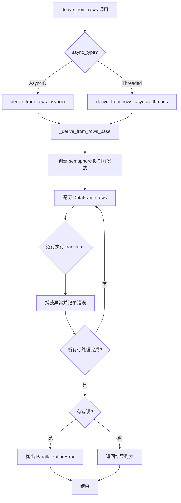
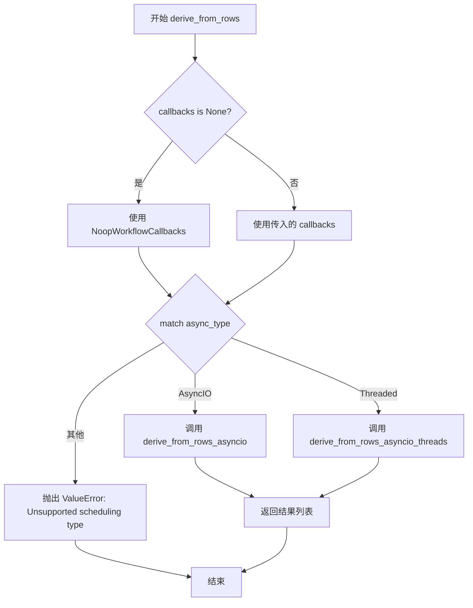
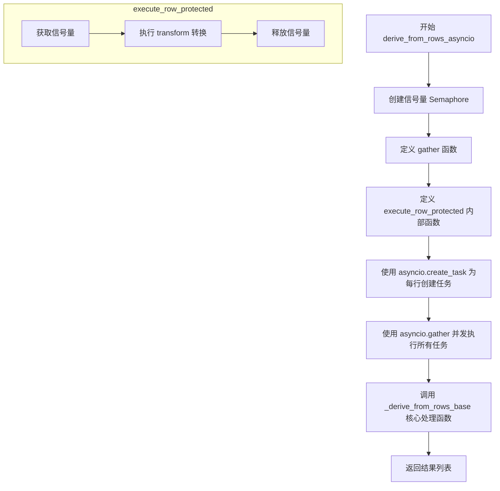
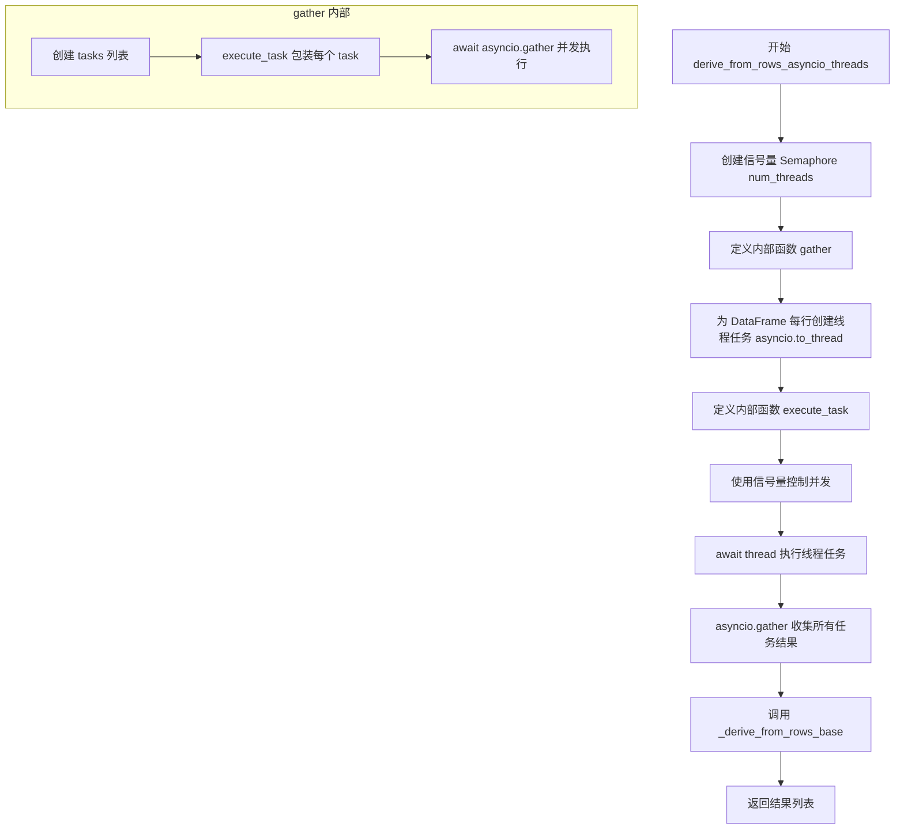

# `graphrag\packages\graphrag\graphrag\index\utils\derive_from_rows.py` 详细设计文档

A module for parallel processing of pandas DataFrame rows using asyncio, supporting both native AsyncIO and threaded execution modes with error handling and progress tracking.

## 整体流程



## 类结构

```
模块级
├── ParallelizationError (自定义异常类)
├── 类型定义
│   ├── ItemType (TypeVar)
│   ├── ExecuteFn (Callable类型)
│   └── GatherFn (Callable类型)
└── 函数
    ├── derive_from_rows (主入口)
    ├── derive_from_rows_asyncio (AsyncIO实现)
    ├── derive_from_rows_asyncio_threads (线程实现)
    └── _derive_from_rows_base (基础实现)
```

## 全局变量及字段


### `ItemType`
    
类型变量，用于泛型返回类型

类型：`TypeVar`
    


### `ExecuteFn`
    
行执行函数类型别名，接收行数据并返回异步结果

类型：`Callable[[tuple[Hashable, pd.Series]], Awaitable[ItemType | None]]`
    


### `GatherFn`
    
收集函数类型别名，用于聚合多个执行函数的结果

类型：`Callable[[ExecuteFn], Awaitable[list[ItemType | None]]]`
    


### `logger`
    
模块级日志记录器，用于记录并行转换过程中的错误

类型：`logging.Logger`
    


### `ParallelizationError.num_errors`
    
错误数量，记录并行转换过程中发生的错误总数

类型：`int`
    


### `ParallelizationError.example`
    
示例错误信息，包含第一个错误的详细堆栈信息

类型：`str | None`
    
    

## 全局函数及方法


### `derive_from_rows`

该函数是并行处理DataFrame行的主入口，根据async_type参数路由到不同的异步实现（AsyncIO或Threaded），将转换函数应用于每一行，并返回处理结果列表。

参数：

- `input`：`pd.DataFrame`，待处理的输入数据框
- `transform`：`Callable[[pd.Series], Awaitable[ItemType]]`，应用于每一行的异步转换函数
- `callbacks`：`WorkflowCallbacks | None`，工作流回调接口，默认为None
- `num_threads`：`int`，并发线程数，默认为4
- `async_type`：`AsyncType`，异步调度类型，默认为AsyncType.AsyncIO
- `progress_msg`：`str`，进度消息字符串，默认为空

返回值：`list[ItemType | None]`，包含转换结果或None的列表

#### 流程图



#### 带注释源码

```python
async def derive_from_rows(
    input: pd.DataFrame,
    transform: Callable[[pd.Series], Awaitable[ItemType]],
    callbacks: WorkflowCallbacks | None = None,
    num_threads: int = 4,
    async_type: AsyncType = AsyncType.AsyncIO,
    progress_msg: str = "",
) -> list[ItemType | None]:
    """Apply a generic transform function to each row. Any errors will be reported and thrown."""
    # 如果callbacks为空，使用默认的NoopWorkflowCallbacks
    callbacks = callbacks or NoopWorkflowCallbacks()
    
    # 根据async_type路由到不同的异步实现
    match async_type:
        case AsyncType.AsyncIO:
            # 使用纯异步IO方式处理
            return await derive_from_rows_asyncio(
                input, transform, callbacks, num_threads, progress_msg
            )
        case AsyncType.Threaded:
            # 使用线程池方式处理（适合IO密集型操作）
            return await derive_from_rows_asyncio_threads(
                input, transform, callbacks, num_threads, progress_msg
            )
        case _:
            # 不支持的调度类型，抛出异常
            msg = f"Unsupported scheduling type {async_type}"
            raise ValueError(msg)
```


### `derive_from_rows_asyncio`

使用原生 asyncio 实现异步并行处理 DataFrame 每一行的转换操作，通过信号量控制并发数量，支持进度跟踪和错误收集，适用于 IO 密集型任务。

参数：

- `input`：`pd.DataFrame`，输入的 DataFrame，包含待处理的行数据
- `transform`：`Callable[[pd.Series], Awaitable[ItemType]]`，异步转换函数，对每一行 pd.Series 执行转换并返回结果
- `callbacks`：`WorkflowCallbacks`，工作流回调对象，用于报告进度
- `num_threads`：`int = 4`，并发线程/任务数上限，默认为 4
- `progress_msg`：`str = ""`，进度条显示的描述文本

返回值：`list[ItemType | None]`，转换结果列表，失败返回 None，成功返回转换后的 ItemType

#### 流程图



#### 带注释源码

```python
async def derive_from_rows_asyncio(
    input: pd.DataFrame,
    transform: Callable[[pd.Series], Awaitable[ItemType]],
    callbacks: WorkflowCallbacks,
    num_threads: int = 4,
    progress_msg: str = "",
) -> list[ItemType | None]:
    """
    Derive from rows asynchronously.

    This is useful for IO bound operations.
    """
    # 创建信号量，用于控制并发数量，避免同时启动过多任务
    semaphore = asyncio.Semaphore(num_threads or 4)

    # 定义 gather 函数，收集并执行所有行的转换任务
    async def gather(execute: ExecuteFn[ItemType]) -> list[ItemType | None]:
        # 定义受保护的行执行函数，在信号量控制下并发执行
        async def execute_row_protected(
            row: tuple[Hashable, pd.Series],
        ) -> ItemType | None:
            async with semaphore:  # 获取信号量，控制并发
                return await execute(row)  # 执行转换任务

        # 为 DataFrame 的每一行创建异步任务
        tasks = [
            asyncio.create_task(execute_row_protected(row)) for row in input.iterrows()
        ]
        # 并发等待所有任务完成并收集结果
        return await asyncio.gather(*tasks)

    # 调用基础处理函数，传入自定义的 gather 实现
    return await _derive_from_rows_base(
        input, transform, callbacks, gather, progress_msg
    )
```


### `derive_from_rows_asyncio_threads`

使用线程池的异步实现，通过 `asyncio.to_thread` 将同步或异步的转换函数分配到线程池中执行，配合信号量控制并发数，实现对 DataFrame 每行数据的并行处理，适用于 IO 密集型操作。

参数：

- `input`：`pd.DataFrame`，待处理的输入数据框，每一行将作为转换函数的输入
- `transform`：`Callable[[pd.Series], Awaitable[ItemType]]`，异步转换函数，接收一行数据并返回处理结果
- `callbacks`：`WorkflowCallbacks`，工作流回调对象，用于报告进度和状态
- `num_threads`：`int | None = 4`，最大并发线程数，默认为 4，设为 None 时使用默认值
- `progress_msg`：`str = ""`，进度条显示的消息文本

返回值：`list[ItemType | None]`，转换结果列表，每个元素对应输入 DataFrame 一行的转换结果，失败时返回 None

#### 流程图



#### 带注释源码

```python
async def derive_from_rows_asyncio_threads(
    input: pd.DataFrame,
    transform: Callable[[pd.Series], Awaitable[ItemType]],
    callbacks: WorkflowCallbacks,
    num_threads: int | None = 4,
    progress_msg: str = "",
) -> list[ItemType | None]:
    """
    Derive from rows asynchronously.

    This is useful for IO bound operations.
    """
    # 创建信号量用于控制并发线程数，避免创建过多线程导致资源耗尽
    semaphore = asyncio.Semaphore(num_threads or 4)

    async def gather(execute: ExecuteFn[ItemType]) -> list[ItemType | None]:
        # 为 DataFrame 的每一行创建一个在线程池中执行的任务
        # asyncio.to_thread 会在线程池中同步执行 execute 函数
        tasks = [asyncio.to_thread(execute, row) for row in input.iterrows()]

        async def execute_task(task: Coroutine) -> ItemType | None:
            # 使用信号量限制并发执行的任务数量
            async with semaphore:
                # fire off the thread
                # 等待线程执行完成并获取结果
                thread = await task
                # 如果 thread 本身是协程（异步操作），则 await 它
                return await thread

        # 使用 asyncio.gather 并发执行所有任务
        return await asyncio.gather(*[execute_task(task) for task in tasks])

    # 调用基础实现，传入自定义的 gather 函数
    return await _derive_from_rows_base(
        input, transform, callbacks, gather, progress_msg
    )
```


### `_derive_from_rows_base`

这是 `derive_from_rows` 系列函数的基础实现私有方法，负责并行处理 DataFrame 的每一行。它接收一个 DataFrame、转换函数、回调函数、gather 函数和进度消息，对每一行应用转换函数，收集结果并统一处理错误。

参数：

- `input`：`pd.DataFrame`，输入的 DataFrame，包含待处理的行数据
- `transform`：`Callable[[pd.Series], Awaitable[ItemType]]`，异步转换函数，对每行数据执行转换操作
- `callbacks`：`WorkflowCallbacks`，工作流回调接口，用于报告进度
- `gather`：`GatherFn[ItemType]`，gather 函数，负责调度和收集任务结果
- `progress_msg`：`str`，进度消息，用于显示处理进度

返回值：`list[ItemType | None]`，返回转换结果列表，失败的操作返回 None

#### 流程图

```mermaid
flowchart TD
    A[开始 _derive_from_rows_base] --> B[创建进度 ticker]
    B --> C[初始化错误列表 errors]
    C --> D[定义内部 execute 函数]
    D --> E[调用 gather 函数执行 execute]
    E --> F{执行是否完成}
    F -->|是| G[标记 ticker.done]
    G --> H{是否有错误}
    H -->|是| I[遍历错误日志记录]
    I --> J[抛出 ParallelizationError]
    H -->|否| K[返回结果列表]
    J --> L[结束]
    K --> L
    F -->|否| E
    
    subgraph execute函数内部
        D1[接收 row 数据] --> D2[调用 transform(row)]
        D2 --> D3{是否协程}
        D3 -->|是| D4[await result]
        D3 -->|否| D5[直接返回 result]
        D4 --> D6[返回结果或捕获异常]
        D5 --> D6
        D6 --> D7[执行 tick 计数]
        D7 --> D8[返回结果]
    end
```

#### 带注释源码

```python
async def _derive_from_rows_base(
    input: pd.DataFrame,
    transform: Callable[[pd.Series], Awaitable[ItemType]],
    callbacks: WorkflowCallbacks,
    gather: GatherFn[ItemType],
    progress_msg: str = "",
) -> list[ItemType | None]:
    """
    Derive from rows asynchronously.

    This is useful for IO bound operations.
    """
    # 创建进度 ticker，用于报告处理进度
    tick = progress_ticker(
        callbacks.progress, num_total=len(input), description=progress_msg
    )
    # 初始化错误列表，用于收集转换过程中的异常
    errors: list[tuple[BaseException, str]] = []

    # 定义内部执行函数，处理单行数据的转换
    async def execute(row: tuple[Any, pd.Series]) -> ItemType | None:
        try:
            # 调用转换函数处理行数据
            result = transform(row[1])
            # 检查结果是否为协程，若是则等待完成
            if inspect.iscoroutine(result):
                result = await result
        except Exception as e:  # noqa: BLE001
            # 捕获异常并记录错误信息和堆栈跟踪
            errors.append((e, traceback.format_exc()))
            return None
        else:
            # 转换成功，返回结果
            return cast("ItemType", result)
        finally:
            # 无论成功或失败，都更新进度计数器
            tick(1)

    # 调用 gather 函数执行所有行的转换
    result = await gather(execute)

    # 标记进度完成
    tick.done()

    # 遍历所有错误并记录到日志
    for error, stack in errors:
        logger.error(
            "parallel transformation error", exc_info=error, extra={"stack": stack}
        )

    # 如果存在错误，抛出并行化错误异常
    if len(errors) > 0:
        raise ParallelizationError(len(errors), errors[0][1])

    return result
```


### `ParallelizationError.__init__`

初始化 ParallelizationError 异常实例，用于在并行处理过程中发生错误时抛出异常，携带错误数量和可选的示例错误信息。

参数：

- `num_errors`：`int`，表示在并行转换过程中发生的错误总数
- `example`：`str | None`，可选参数，表示第一个错误的示例信息，用于提供更详细的错误诊断

返回值：`None`，该方法通过调用父类 `ValueError` 的初始化方法来设置异常消息，无显式返回值

#### 流程图

```mermaid
flowchart TD
    A[开始 __init__] --> B{example 参数是否提供?}
    B -->|是| C[构建完整错误消息: 错误数量 + 示例错误]
    B -->|否| D[构建基本错误消息: 仅包含错误数量]
    C --> E[调用 super().__init__msg 设置异常消息]
    D --> E
    E --> F[结束]
```

#### 带注释源码

```python
def __init__(self, num_errors: int, example: str | None = None):
    """初始化 ParallelizationError 异常实例。
    
    Args:
        num_errors: 在并行转换过程中发生的错误总数
        example: 可选的第一个错误的示例信息，用于调试和诊断
    """
    # 构建基础错误消息，包含错误数量
    msg = f"{num_errors} Errors occurred while running parallel transformation, could not complete!"
    
    # 如果提供了示例错误信息，则追加到消息中
    if example:
        msg += f"\nExample error: {example}"
    
    # 调用父类 ValueError 的初始化方法，设置异常的错误消息
    super().__init__(msg)
```

## 关键组件


### ParallelizationError

自定义异常类，用于并行处理过程中发生错误时抛出，包含错误数量和示例错误信息。

### derive_from_rows

主入口函数，根据async_type参数选择AsyncIO或Threaded两种并行化方式应用转换函数到DataFrame的每一行。

### derive_from_rows_asyncio_threads

使用asyncio.to_thread将同步函数分配到线程池中执行的异步并行化实现，适用于IO密集型操作。

### derive_from_rows_asyncio

纯异步IO实现的并行化方式，通过asyncio.create_task创建任务并发执行，适用于IO密集型操作。

### _derive_from_rows_base

基础实现函数，包含错误收集、进度追踪和异常抛出的核心逻辑。

### ExecuteFn 和 GatherFn

类型定义，分别表示行执行函数的类型和结果聚合函数的类型，用于函数式编程风格的参数化。

### 进度追踪机制

通过progress_ticker实现进度回调，支持在长时间运行的并行任务中报告进度。


## 问题及建议


### 已知问题

-   **类型定义重复**：代码中 `ItemType = TypeVar("ItemType")` 出现了两次（第15行和第77行附近），第二次定义是多余的，可能导致类型检查工具产生警告。
-   **泛型类型定义位置不当**：`ExecuteFn` 和 `GatherFn` 类型别名定义在函数实现之后，虽然Python支持这种写法，但会影响代码可读性和静态类型检查工具的早期发现能力。
-   **重复代码**：两个异步执行函数 `derive_from_rows_asyncio_threads` 和 `derive_from_rows_asyncio` 结构高度相似，仅在任务创建方式上不同，可以进一步抽象减少重复。
-   **线程池逻辑冗余**：在 `derive_from_rows_asyncio_threads` 中，`asyncio.to_thread` 已在线程中执行，再使用 semaphore 包装 `await task` 的逻辑显得冗余，且 semaphore 控制的是协程而非实际线程数。
-   **错误信息不完整**：`ParallelizationError` 仅记录第一个错误的堆栈信息，当有多个错误时难以定位具体问题。
-   **进度计数不准确**：在 `execute` 函数的 `finally` 块中调用 `tick(1)`，无论转换成功还是失败都会增加进度，可能导致进度显示与实际完成情况不匹配。
-   **DataFrame迭代性能**：`input.iterrows()` 是 pandas 中性能较低的行迭代方式，对于大数据集可能成为瓶颈。
-   **类型安全风险**：使用 `row[1]` 索引访问而非命名索引，缺乏类型安全保护。

### 优化建议

-   移除重复的 `ItemType` 类型定义，将 `ExecuteFn` 和 `GatherFn` 移至文件顶部类型定义区域。
-   抽取两个异步实现函数的公共逻辑，进一步减少代码重复，例如将 semaphore 创建和 gather 逻辑抽象到基础函数中。
-   改进错误收集机制，可考虑按错误类型分组记录，或提供获取完整错误列表的接口。
-   考虑仅在转换成功时更新进度，或提供可选的"包含失败"进度模式。
-   对于大规模数据处理场景，可考虑添加批处理模式支持，避免单行迭代的开销。
-   考虑使用 `DataFrame.to_dict(orient='records')` 配合 `asyncio.gather` 替代 `iterrows()`，或提供数据迭代器的参数化选项。
-   添加单元测试覆盖边界情况，如空 DataFrame、单行数据、全部失败等场景。


## 其它


### 设计目标与约束

**设计目标**：
提供一个通用的DataFrame行并行处理框架，支持在DataFrame的每一行上执行异步转换函数，并灵活选择AsyncIO或线程池两种异步执行模式，同时提供进度跟踪和统一的错误处理机制。

**设计约束**：
1. 输入必须是pandas.DataFrame类型
2. 转换函数transform必须接收pd.Series类型参数并返回Awaitable类型
3. 并发数受num_threads参数限制，默认值为4
4. 仅支持AsyncType.AsyncIO和AsyncType.Threaded两种异步模式

### 错误处理与异常设计

**异常类型**：
- ParallelizationError：继承自ValueError，当并行转换过程中发生错误时抛出
- ValueError：当传入不支持的async_type时抛出

**错误处理流程**：
1. 在_execute函数中捕获所有Exception类型异常
2. 错误信息包含异常对象和完整堆栈跟踪
3. 错误被收集到errors列表中，不中断其他行处理
4. 所有行处理完成后，统一记录错误日志
5. 若存在错误，抛出ParallelizationError包含错误数量和示例错误信息

**错误传播机制**：
- 单行转换失败返回None，结果列表中对应位置为None
- 最终若存在任何错误，抛出异常终止流程

### 数据流与状态机

**数据流转过程**：
1. 入口函数derive_from_rows接收DataFrame和转换函数
2. 根据async_type分发到不同实现（asyncio或threaded）
3. 创建信号量控制并发数量
4. 对DataFrame每行创建异步任务
5. 并发执行转换函数，捕获异常
6. 收集所有结果，发送进度更新
7. 处理错误并返回最终结果列表

**状态管理**：
- 使用asyncio.Semaphore控制并发数量
- 使用progress_ticker管理进度状态
- 错误状态通过errors列表收集

### 外部依赖与接口契约

**外部依赖**：
- pandas：DataFrame数据结构
- asyncio：异步编程框架
- typing：类型注解
- inspect：协程检查
- logging：日志记录
- traceback：堆栈跟踪
- graphrag.callbacks：工作流回调接口
- graphrag.config：配置枚举
- graphrag.logger：进度跟踪

**接口契约**：
- transform函数签名：Callable[[pd.Series], Awaitable[ItemType]]
- 返回值：list[ItemType | None]，长度与输入DataFrame行数一致
- callbacks参数可选，若为None使用NoopWorkflowCallbacks
- num_threads参数控制最大并发数

### 并发模型与线程安全

**并发策略**：
- AsyncIO模式：使用asyncio.create_task创建任务，协程间切换
- Threaded模式：使用asyncio.to_thread将任务分发到线程池

**线程安全考虑**：
- Semaphore在多协程间共享需保证原子操作
- 进度回调在多任务中调用需考虑并发安全性

### 性能考量与优化建议

**性能特性**：
- 默认4线程/协程并发，可根据CPU/IO特性调整
- 使用信号量防止资源过载
- 错误收集机制避免单点失败导致整体中断

**潜在优化点**：
- 当前使用iterrows()遍历DataFrame，效率较低，可考虑values或itertuples
- 错误发生仍需完整遍历，可考虑快速失败机制
- 可增加结果缓存或流式处理支持

### 使用示例与调用模式

**基本调用**：
```python
result = await derive_from_rows(
    input=df,
    transform=lambda row: asyncio.sleep(0.1, result=row["value"] * 2),
    num_threads=8
)
```

**带进度回调**：
```python
result = await derive_from_rows(
    input=df,
    transform=async_transform,
    callbacks=CustomCallbacks(),
    progress_msg="Processing rows"
)
```

    