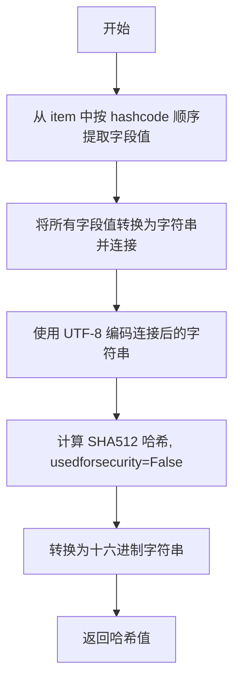

# `graphrag\packages\graphrag\graphrag\index\utils\hashing.py` 详细设计文档

一个哈希工具模块，提供基于SHA512算法的字典字段哈希生成功能，用于将指定字典字段组合后转换为固定长度的十六进制哈希值。

## 整体流程

```mermaid
graph TD
    A[开始 gen_sha512_hash] --> B[提取hashcode中的列名]
    B --> C[遍历列名列表]
C --> D{还有更多列名?}
D -- 是 --> E[获取item[column]的值并转为字符串]
E --> F[拼接所有字段值]
D -- 否 --> G[对拼接字符串进行UTF-8编码]
G --> H[调用sha512计算哈希]
H --> I[usedforsecurity=False参数]
I --> J[转换为十六进制字符串]
J --> K[返回哈希结果]
```

## 类结构

```
hashing.py (模块文件，无类定义)
```

## 全局变量及字段


### `gen_sha512_hash`
    
生成SHA512哈希值的全局函数

类型：`function`
    


### `sha512`
    
hashlib模块提供的SHA512哈希计算函数

类型：`function`
    


### `Iterable`
    
collections.abc中的可迭代对象抽象基类

类型：`class`
    


### `Any`
    
typing中的任意类型注解

类型：`type`
    


    

## 全局函数及方法


### `gen_sha512_hash`

生成给定字典的指定字段值的 SHA512 哈希值。

参数：

- `item`：`dict[str, Any]`, 需要计算哈希的字典对象
- `hashcode`：`Iterable[str]`, 用于构建哈希字符串的键名集合

返回值：`str`, SHA512 哈希值的十六进制字符串表示

#### 流程图



#### 带注释源码

```python
def gen_sha512_hash(item: dict[str, Any], hashcode: Iterable[str]):
    """Generate a SHA512 hash."""
    # 步骤1: 从 item 字典中按 hashcode 指定的键顺序提取值
    # 步骤2: 将每个值转换为字符串后连接在一起
    hashed = "".join([str(item[column]) for column in hashcode])
    
    # 步骤3: 对连接后的字符串进行 SHA512 哈希计算
    # usedforsecurity=False 表示不用于安全加密场景
    # 步骤4: 将二进制哈希值转换为十六进制字符串返回
    return f"{sha512(hashed.encode('utf-8'), usedforsecurity=False).hexdigest()}"
```

## 关键组件


### SHA512哈希生成函数

gen_sha512_hash函数接收一个字典和一个字符串迭代器，将字典中指定列的值连接后进行SHA512哈希，生成十六进制哈希字符串。

### 哈希输入处理

通过列表推导式和str()将字典中指定列的值转换为字符串并连接，形成待哈希的原始字符串。

### 哈希算法实现

使用Python标准库hashlib的sha512函数，通过usedforsecurity=False参数确保在所有环境下的一致性行为。

### 字符串编码处理

将连接后的字符串使用UTF-8编码转换为字节串，供给哈希函数使用。


## 问题及建议


### 已知问题

-   **哈希碰撞风险**：代码直接拼接字典值（如 `"ab" + "c"` 与 `"a" + "bc"`），不同字段值组合可能产生相同的哈希值，缺乏分隔符。
-   **非确定性哈希**：如果传入的 `hashcode` 是无序集合（Set），哈希结果将不确定，这可能导致相同的输入数据产生不同的哈希值。
-   **错误处理不足**：直接通过 `item[column]` 访问，若字段缺失会抛出 `KeyError`，缺乏对缺失键的处理。
-   **类型转换一致性**：使用 `str()` 转换任意对象，对于容器类型（如字典、列表）其字符串表示可能受插入顺序或 Python 版本影响，缺乏稳定性。

### 优化建议

-   **添加分隔符**：在拼接值时加入明确的分隔符（如 `\x00` 或特定字符），防止值边界混淆导致的碰撞。
-   **确保顺序确定性**：对 `hashcode` 进行排序（`sorted(hashcode)`），确保即使输入是无序集合，生成的哈希值也是确定性的。
-   **健壮的字段访问**：使用 `item.get(column)` 并设计合理的默认值逻辑，或者在缺失时记录警告而非直接失败。
-   **规范化序列化**：对于复杂类型的字段，考虑使用 JSON 序列化（并确保键排序）来替代简单的 `str()` 转换，以保证一致性。


## 其它


### 设计目标与约束

本模块的核心设计目标是为数据处理流程提供可靠的SHA512哈希生成功能，支持对字典对象中指定列进行哈希计算。设计约束包括：输入参数必须为字典类型且包含指定的键；哈希算法固定为SHA512；输出格式为64位十六进制字符串；仅依赖Python标准库hashlib和typing模块，确保零外部依赖。

### 错误处理与异常设计

本模块未实现显式的异常处理机制，但存在潜在的异常场景需要调用方注意：1) 如果item参数中不存在hashcode中指定的列键，会抛出KeyError；2) 如果item参数不是字典类型，会抛出TypeError；3) 如果hashcode参数包含非字符串类型元素，在字符串格式化时可能产生意外结果。建议调用方在调用前验证输入参数的合法性。

### 外部依赖与接口契约

本模块的外部依赖为零，完全使用Python标准库。接口契约如下：gen_sha512_hash函数接受两个参数——item参数类型为dict[str, Any]，表示待哈希的字典对象；hashcode参数类型为Iterable[str]，表示用于生成哈希的列名集合。返回值类型为str，为64位十六进制格式的SHA512哈希字符串。调用方应确保传入的字典包含hashcode中指定的所有键。

### 性能考虑与优化空间

当前实现采用字符串拼接方式构建待哈希内容，在处理大规模数据时可能存在性能瓶颈。优化方向包括：1) 使用生成器表达式替代列表推导以减少内存占用；2) 对于批量哈希场景，可考虑预先计算各列的字节表示；3) 可添加缓存机制以避免重复计算相同输入的哈希值。

### 安全性考虑

本模块使用hashlib的usedforsecurity=False参数，明确表示该哈希计算不用于安全敏感场景（如密码存储）。如需用于安全相关场景，应重新评估哈希算法选择和盐值策略。当前实现不包含盐值处理，存在彩虹表攻击风险。

### 使用示例

```python
# 基本用法
item = {"id": "12345", "name": "example", "timestamp": 1699999999}
hashcode = ["id", "name"]
result = gen_sha512_hash(item, hashcode)
# 返回64位十六进制字符串

# 批量处理场景
items = [{"id": "1", "data": "a"}, {"id": "2", "data": "b"}]
hashes = [gen_sha512_hash(item, ["id"]) for item in items]
```

    