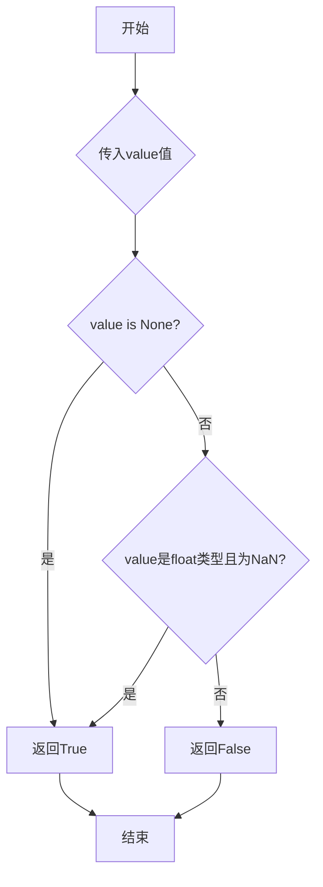
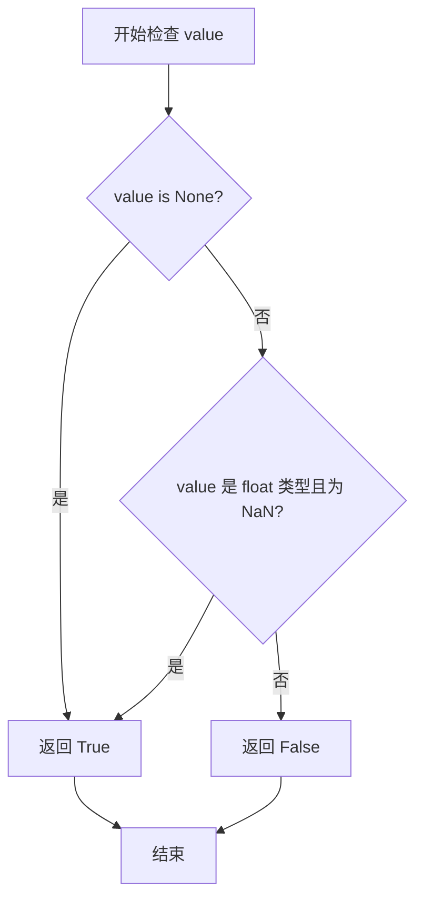
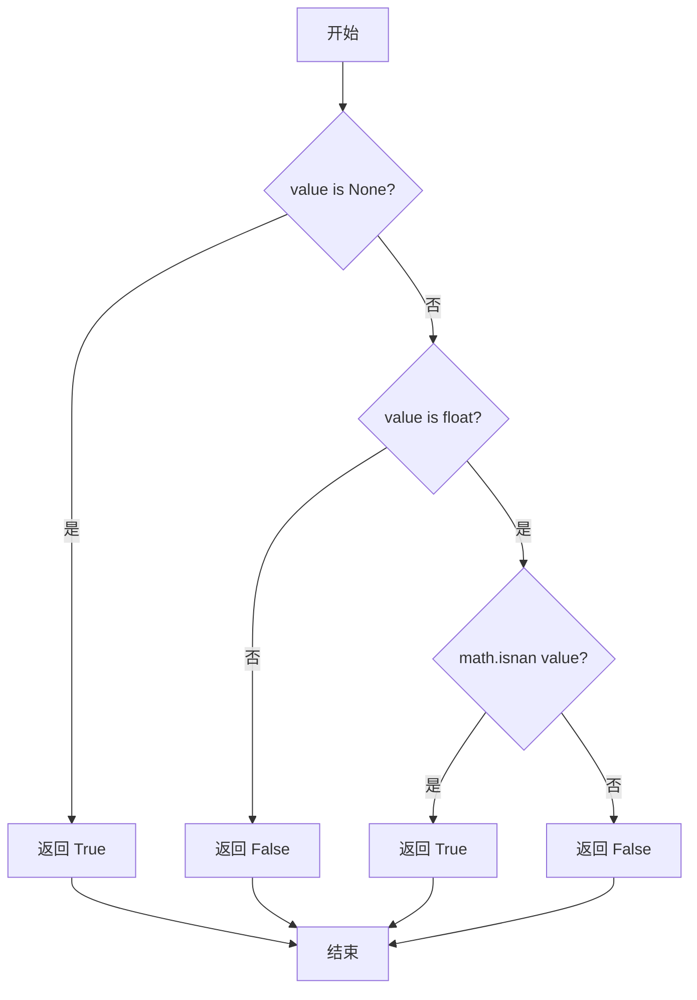

# `graphrag\packages\graphrag\graphrag\index\utils\is_null.py` 详细设计文档

这是一个用于检查值是否为null（None）或NaN（Not a Number）的工具函数模块，通过判断值是否为None或浮点类型的NaN来返回布尔结果。

## 整体流程



## 类结构

```
该文件为工具模块，无类层次结构
仅包含一个全局函数 is_null
```

## 全局变量及字段


### `is_null`
    
检查给定值是否为null(None)或NaN（Not a Number）

类型：`function(value: Any) -> bool`
    


    

## 全局函数及方法


### `is_null`

检查给定值是否为空（None）或非数值（NaN）。

参数：

- `value`：`Any`，要检查的值，可以是任意类型

返回值：`bool`，如果值是 None 或 NaN 则返回 True，否则返回 False

#### 流程图



#### 带注释源码

```python
# 导入数学模块，用于检测NaN
import math
# 导入Any类型，用于类型注解
from typing import Any


def is_null(value: Any) -> bool:
    """检查值是否为空或非数值（NaN）"""
    
    # 内部函数：检查值是否为None
    def is_none() -> bool:
        return value is None

    # 内部函数：检查值是否为float类型的NaN
    def is_nan() -> bool:
        # isinstance检查value是否为float类型
        # math.isnan检查是否为NaN
        return isinstance(value, float) and math.isnan(value)

    # 返回None检查或NaN检查的结果
    # 满足任一条件都返回True
    return is_none() or is_nan()
```

## 关键组件


### is_null 函数

主函数，用于检查值是否为空（None）或是否为 NaN（Not a Number）。

### is_none 内部函数

用于检查值是否为 None。

### is_nan 内部函数

用于检查值是否为浮点数且为 NaN。

### math 模块依赖

Python 标准库数学模块，用于调用 math.isnan() 函数进行 NaN 检查。

### typing.Any 类型导入

用于支持任意类型的参数检查。


## 问题及建议


### 已知问题

-   **嵌套函数定义开销**：在每次调用`is_null`时都会重新定义内部函数`is_none`和`is_nan`，虽然Python会进行内部优化，但仍然存在不必要的函数对象创建开销
-   **NaN类型检测不全面**：当前仅支持`float`类型的NaN检测，不支持`decimal.Decimal`等其他可能包含NaN的类型
-   **文档不完整**：函数文档字符串缺少参数和返回值的详细描述，不符合完整的API文档规范
-   **缺少类型注解精确性**：返回值类型注解虽然正确，但可以添加更多类型信息以提高代码可读性
-   **空值判断逻辑可优化**：使用两个嵌套函数包装简单的布尔判断，增加了代码层级复杂度

### 优化建议

-   **提取内部函数**：将`is_none`和`is_nan`改为模块级函数或直接内联逻辑，减少函数对象创建开销
-   **扩展NaN检测**：考虑支持`decimal.Decimal`类型的NaN检测，使用`math.isnan()`的try-except包装或`decimal.Decimal.is_nan()`方法
-   **完善文档**：为docstring添加Args和Returns部分，详细说明参数类型约束和返回值含义
-   **简化逻辑**：直接使用`value is None or (isinstance(value, float) and math.isnan(value))`替代嵌套函数，使代码更简洁直观


## 其它


### 一段话描述

is_null 是一个工具函数，用于检查给定值是否为 null (None) 或 NaN（Not a Number），返回一个布尔值。

### 文件的整体运行流程

该模块导入后，直接调用 `is_null(value)` 函数即可使用。函数内部首先定义两个内部函数 `is_none()` 和 `is_nan()`，分别用于检查 None 和 NaN 的情况，最后通过逻辑或运算返回综合结果。

### 全局变量

无全局变量。

### 全局函数

### is_null

- **名称**: is_null
- **参数名称**: value
- **参数类型**: Any
- **参数描述**: 任意类型的值，用于检查是否为 null 或 NaN
- **返回值类型**: bool
- **返回值描述**: 如果值为 None 或 float 类型的 NaN，返回 True；否则返回 False
- **mermaid 流程图**:

- **带注释源码**:
```python
def is_null(value: Any) -> bool:
    """Check if value is null or is nan."""

    def is_none() -> bool:
        """检查值是否为 None"""
        return value is None

    def is_nan() -> bool:
        """检查值是否为 float 类型的 NaN"""
        return isinstance(value, float) and math.isnan(value)

    return is_none() or is_nan()
```

### 关键组件信息

- **math.isnan**: Python 标准库函数，用于检查浮点数是否为 NaN
- **isinstance**: Python 内置函数，用于类型检查

### 设计目标与约束

- **设计目标**: 提供一个统一且简洁的接口来检查值是否为"空"（None 或 NaN），避免在调用处重复编写判断逻辑
- **约束**: 
  - 仅支持 Python 标准库
  - 依赖 typing.Any 类型注解
  - 不处理其他类型的空值（如空字符串、空列表等）

### 错误处理与异常设计

- 该函数不抛出任何异常
- math.isnan() 会在非浮点数上抛出 TypeError，但通过 isinstance(value, float) 检查已规避此风险

### 外部依赖与接口契约

- **依赖**: 
  - `math` 模块（标准库）
  - `typing.Any`（标准库）
- **接口契约**: 
  - 输入: 任意类型的值
  - 输出: 布尔值

### 性能考虑

- 内部函数定义在每次调用时会产生轻微的性能开销，但在实际使用中可忽略不计
- 短路求值策略：先检查 is_none()，若为 True 则不执行 is_nan()

### 使用示例

```python
>>> is_null(None)
True
>>> import math
>>> is_null(math.nan)
True
>>> is_null(1.0)
False
>>> is_null("hello")
False
```

### 兼容性考虑

- 适用于 Python 3.x 版本
- 无平台特定依赖

### 潜在的技术债务或优化空间

1. **内部函数开销**: 每次调用 is_null 都会重新定义 is_none 和 is_nan 函数，可考虑将内部函数提取为模块级私有函数以优化性能
2. **类型支持有限**: 目前仅支持 float 类型的 NaN，未来可能需要支持 numpy.nan 或 pandas.NaT 等场景
3. **文档完善**: 缺少完整的文档字符串说明返回值和异常的详细行为


    