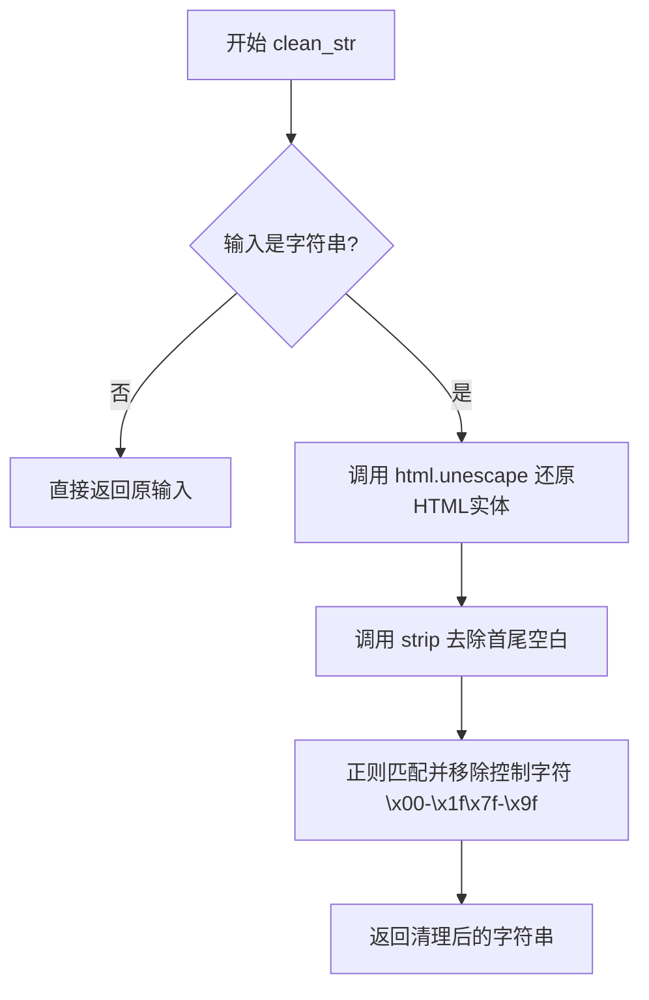
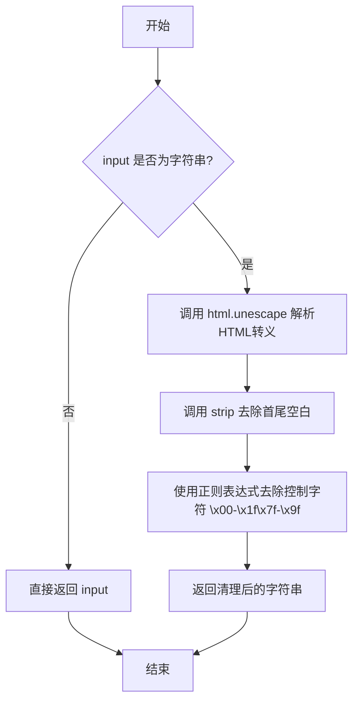

# `graphrag\packages\graphrag\graphrag\index\utils\string.py` 详细设计文档

一个字符串处理工具模块，提供clean_str函数用于清理输入字符串，移除HTML转义字符、控制字符等不需要的字符，返回干净的字符串。

## 整体流程



## 类结构

```
string_utils (工具模块)
└── clean_str (全局函数)
```

## 全局变量及字段


### `html`
    
Python标准库模块，用于处理HTML转义和反转义

类型：`module`
    


### `re`
    
Python标准库模块，用于正则表达式匹配和替换

类型：`module`
    


### `clean_str`
    
清理输入字符串，移除HTML转义、控制字符和其他不需要的字符

类型：`function`
    


    

## 全局函数及方法


### `clean_str`

该函数用于清理输入字符串，通过移除HTML转义序列、控制字符（C0控制字符和C1控制字符）以及首尾多余空白字符，同时对非字符串输入直接返回原值。

参数：

- `input`：`Any`，任意类型的输入值，如果是字符串则进行清理操作，否则直接返回原值

返回值：`str`，返回清理后的字符串或未修改的非字符串输入

#### 流程图



#### 带注释源码

```python
def clean_str(input: Any) -> str:
    """Clean an input string by removing HTML escapes, control characters, and other unwanted characters."""
    # 如果输入不是字符串类型，直接返回原值（不做任何转换处理）
    if not isinstance(input, str):
        return input

    # 第一步：使用 html.unescape 将HTML转义实体转换回原始字符
    # 例如 &amp; -> &, &lt; -> <, &gt; -> >
    result = html.unescape(input.strip())
    
    # 第二步：使用正则表达式移除C0控制字符（0x00-0x1F）和C1控制字符（0x7F-0x9F）
    # 参考：https://stackoverflow.com/questions/4324790/removing-control-characters-from-a-string-in-python
    # 这些字符包括：换行符\t、回车符\r、换页符\f、退格符\b等不可见控制字符
    return re.sub(r"[\x00-\x1f\x7f-\x9f]", "", result)
```

## 关键组件


### 字符串清理函数 (clean_str)

该函数是核心组件，负责清理输入字符串。通过html.unescape()移除HTML转义字符，使用正则表达式[\x00-\x1f\x7f-\x9f]删除控制字符(C0和C1控制码)，并调用strip()去除首尾空白。

### HTML转义处理模块

利用Python标准库html.unescape()将HTML实体(如&amp;, &lt;, &#x27;)转换回原始字符，处理Web数据中常见的HTML编码问题。

### 正则表达式控制字符过滤

使用re.sub()配合正则表达式模式[\x00-\x1f\x7f-\x9f]匹配并移除ASCII控制字符(范围0x00-0x1F和0x7F-0x9F)，包括换行符、制表符等不可打印字符。

### 输入类型检查与转换

通过isinstance(input, str)进行类型守卫，非字符串输入直接原样返回，实现函数的容错性和类型灵活性。


## 问题及建议


### 已知问题

-   **类型不一致**：函数签名声明返回类型为 `str`，但当输入非字符串时直接返回原始输入（类型可能为 `Any`），导致类型声明与实际返回值不符，可能引发运行时类型错误
-   **遮蔽内置函数**：参数名 `input` 遮蔽了 Python 内置函数 `input()`，虽然不影响功能，但不够规范
-   **正则表达式未预编译**：每次调用都重新编译正则表达式 `r"[\x00-\x1f\x7f-\x9f]"`，在高频调用场景下会产生性能开销
-   **注释链接已失效**：代码中的 Stack Overflow 链接可能已无法访问，该注释失去参考价值

### 优化建议

-   **修复类型声明**：将非字符串输入转换为字符串返回（`str(input)`）或抛出 `TypeError` 异常，确保返回类型始终为 `str`
-   **重命名参数**：将参数名 `input` 改为 `value`、`text` 或 `s` 等，避免遮蔽内置函数
-   **预编译正则表达式**：在模块级别使用 `re.compile()` 预编译正则表达式，提升执行效率
-   **移除失效注释**：删除或更新不可访问的 Stack Overflow 链接注释
-   **增强错误处理**：可考虑添加更详细的输入验证和错误信息，提升函数健壮性

## 其它


### 设计目标与约束

本工具旨在提供通用的字符串清理功能，用于移除HTML转义字符和控制字符，确保字符串的安全性和整洁性。设计约束包括：仅处理字符串类型输入，保留非字符串输入原样返回；使用Python标准库实现，无外部依赖；性能要求为单次调用延迟低于1ms。

### 错误处理与异常设计

函数采用防御性编程策略。对于非字符串输入，直接返回原值而非抛出异常。内部处理了HTML转义字符（通过html.unescape）和控制字符（通过正则表达式）。不主动抛出任何异常，调用方无需try-catch包裹。若输入为None，应在调用前进行None检查。

### 外部依赖与接口契约

依赖Python标准库：html（html.unescape）、re（正则表达式）、typing（类型注解）。接口契约：输入参数input接受Any类型，建议传入str或None；返回值类型为str，非字符串输入时返回空字符串""或原值。

### 性能考虑与基准测试

当前实现性能良好，正则表达式编译可考虑预编译以提升频繁调用场景性能。基准测试建议：使用不同长度字符串（10/100/1000/10000字符）测试清理耗时，确保O(n)线性时间复杂度。内存占用稳定，无额外大对象创建。

### 安全考虑

该函数用于清理用户输入或外部数据，可抵御HTML注入攻击（通过unescape）和控制字符干扰。正则表达式使用固定模式，无正则表达式DoS风险。输出可安全用于日志、存储或显示。

### 测试策略建议

建议覆盖测试场景：正常字符串清理、包含HTML转义字符的字符串（如&quot;、&amp;）、包含控制字符的字符串（\x00-\x1f、\x7f-\x9f）、非字符串输入（int、list、None）、空白字符串、特殊Unicode字符。性能测试建议使用pytest-benchmark。

### 可扩展性与未来建议

当前仅支持移除特定控制字符范围（\x00-\x1f\x7f-\x9f），未来可考虑：1）提供可配置的字符过滤规则；2）支持更多清理选项（如URL编码、空白符标准化）；3）增加流式处理大字符串的生成器版本。

### 版本信息

当前版本：1.0.0（2024年）基于MIT License开源，版权归属Microsoft Corporation。

    